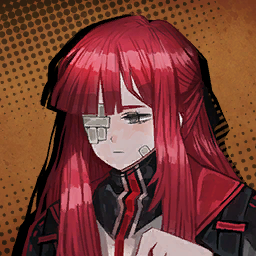
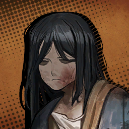
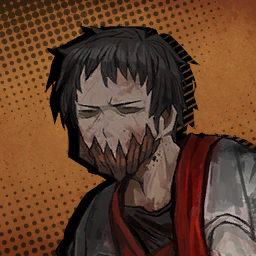
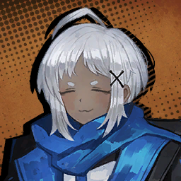
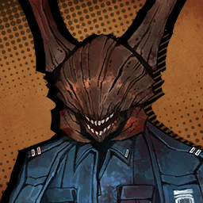
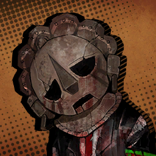
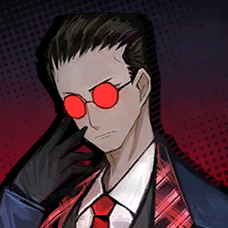
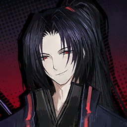

### Chapter 1

---

* ***The Outcast*** **(ผู้ถูกเนรเทศ)**

    * **Episode: 1 | ตอนที่ 1<br>Location: Aboard Mephistopheles | บนรถเมฟิสโตเฟเลส**

        

        ```
        Charon: Verg.
        ชารอน: วอร์จ
        ```
        ```
        Charon: Blockage ahead. Permission to vroom-vroom?
        ชารอน: มีอะไรขวางทางข้างหน้าอยู่ อนุญาติให้ฉันบรื๊น-บรื๊นไปได้เลยไหม
        ```

        ---

        

        * เสียงในหัว

            ```
            The chatter was what finally got me to open my eyes.
            เสียงพูดคุยคือสิ่งที่ทำให้ผมลืมตาตื่นขึ้นหลังจากการหลับไหลอันยาวนาน
            ```
            ```
            After all, nothing beats blocking out your sight when you want to keep boredom at bay.
            ยังไงซะ ก็ไม่มีอะไรดีไปกว่าการปิดสายตาตัวเองลง… ในยามที่อยากหนีหน้าจากความเบื่อหน่ายที่รุมเร้านั้นแหละนะ
            ```
            ```
            Not that there was much else to do on a bus whose destination was unknown to me...
            มันก็ไม่มีอะไรให้ทำมากตอนอยู๋บนรถบัสที่ไม่รู้ด้วยซ้ำว่าสุดท้ายแล้วจุดหมายปลายทางที่ไปจะหยุดที่ตรงไหนกันแน่
            ```
            ```
            My lack of head and memories certainly don’t help, either.
            และการที่ฉันสูญเสียหัว รวมถึงความทรงจำไปก็ไม่ได้ช่วยปลอบประโลมความเบื่อหน่ายนี้ให้น้อยลงได้เลย
            ```

        ---

        

        ```
        Vergilius: ... ...
        วอร์จิลิอุส: ... ...
        ```
        ```
        Vergilius: Alright, let’s proceed.
        วอร์จิลิอุส: ตกลง จัดการได้เลย
        ```

        --- 

        

        ```
        Charon: Ok. Here come bumpity-bumps.
        ชารอน: โอเค จะชนแล้วน้าาา~ ตึกตัก ๆ
        ```
        ```
        Charon: Expensive washer fluid. Verg said he paid a fortune.
        ชารอน: หลังจบเรื่องนี้ต้องล้างเจ้าเมิฟิสด้วยน้ำยาล้างรถราคาแพง ที่วอร์คบอกว่าเสียไปหลายกระตังซะแล้วสิ
        ```

        ---

        

        * เสียงในหัว

            ```
            The clumps stuck to the window gently dissolve, letting light through.
            กลุ่มก้อนเนื้อที่ติดอยู่บนหน้าต่างกำลังค่อย ๆ ถูกชำระล้างหายไปอย่างละเมียดละไม ทำให้แสงสว่างของดวงอาทิตย์สามารถลอดผ่านหน้าตามาได้
            ```
            ```
            Many different sets of eyes on the bus are lethargically facing forward.
            สายตาหลายคู่ของผู้คนที่อยู่บนรถบัสต่างจ้องมองไปข้างหน้าอย่างเซื่อมซึม
            ```
            ```
            It felt like a pretty gruesome scene, but based on the others’ reactions, maybe this kind of violence is common in the City.
            มันเป็นฉากที่ค่อนข้างน่าสยดสยอง แต่พอสังเกตปฎิกิริยาตอบสนองของคนอื่น ๆ แล้ว ผมก็ได้รู้ว่านี้คงเป็นความรุนแรงรูปแบบนึงที่เกิดขึ้นเป็นเรื่องปกติในเมืองงั้นสินะ
            ```

        ```
        Dante: <Hey... >
        ดันเต้: <นี้... >
        ```

        * เสียงในหัว

            ```
            It felt rather awkward to close my eyes again now that I was wide awake. That’s when the conspicuously bearded man grabbed my attention.
            มันรู้สึกค่อนข้างอึดอัดอย่างบอกไม่ถูกที่จะต้องฝืนปิดตาอีกครั้งทั้ง ๆ ที่ตอนนี้ผมตื่นเต็มตาขนาดซะนี้ นั้นเป็นตอนที่ชายผู้ซึ่งมีหนวดเคราที่เด่นสะดุดตาดึงดูดความสนใจของผมไปชั่วขณะ
            ```

        ```
        Dante: <Bu― I mean, Glasses. Know where we’re going right now?>
        ดันเต้: <คุณแมล― ผมหมายถึงคุณคนใส่แว่นครับ ตอนนี้รู้ไหมว่าเรากำลังมุ่งหน้าไปที่ไหน?>
        ```

        * เสียงในหัว

            ```
            ... A feature far more conspicuous than his beard made me slip.
            ... แต่สายตาของผมดันไปจับกับบางอย่างของเขาที่เด่นซะยิ่งกว่าหนวดนั้นซะอีก และนั้นทำให้ผมเกือบหลุดปากพูดไปแล้ว
            ```

        ---

        

        ```
        Gregor: ... You almost called me “bug guy”, didn’t you?
        เกรกอร์: ... คุณเกือบเรียกผมว่า "คุณแมลง" ใช่ไหมเมื่อกี้นี้?
        ```
        ```
        Gregor: Once again, my name is Gregor.
        เกรกอร์: งั้นอีกครั้งละกันนะครับ ผมมีชื่อว่าเกรกอร์
        ```
        ```
        Gregor: The same way you’re called Dante and not clockface.
        เกรกอร์: แบบเดียวกันกับที่คุณถูกเรียกว่าคุณดันเต้ ไม่ใช่คุณหัวนาฬิกา
        ```

        ---

        * เสียงในหัว

            ```
            ... I couldn’t find any excuses so I just gave back a light nod.
            ... ฉันไม่มีข้อแก้ตัวอะไรเลยที่จะแก้ตัวทั้งนั้น ก็เลยพยักหน้าเบา ๆ ให้แทน
            ```

        ---

        

        ```
        Gregor: Say, Bus Girlie. Where are we headed?
        เกรกอร์: ว่าก็ว่าเถอะ แม่หนูรถบัส รู้ไหมจ๊ะว่าเรากำลังมุ่งหน้าไปที่ไหนกัน?
        ```

        ---

        

        ```
        Charon: Once again, my name is Charon.
        ชารอน: จะบอกอีกครั้งนะคะ ว่าฉันชื่อชารอน
        ```
        ```
        Charon: The same way you’re called Gregor and not bug guy.
        ชารอน: แบบเดียวกันกับที่คุณถูกเรียกว่าเคุณกรกอร์ ไม่ใช่คุณแมลงค่ะ
        ```

        ---

        

        ```
        Gregor: ... ...
        เกรกอร์: ... ...
        ```

        ---

        

        ```
        Dante: <She got you there, Gregor.>
        ดันเต้: <นายโดนเธอเล่นเต็ม ๆ เลยนะ เกรกอร์>
        ```

        ---

        

        ```
        Gregor: Haha, she really did.
        เกรกอร์: ฮาฮ่า ฉันโดนเธอเล่นจริง ๆ นั้นแหละ
        ```

        ---

        

        ```
        Charon: ... Verg said:
        ชารอน: ... วอร์จบอกว่า
        ```
        ```
        Charon: “The Sinners will go to District 4.”
        ชารอน: "เหล่าคนบาปจะลงรถที่เขต 4"
        ```

        ---

        

        ```
        Don Quixote: Whaaaat ho?! Did District 4 fall upon my ears?!
        ดอน กิโฆเต้: กระไรนะขอรับ?! เมือครู่นี้ข้าน้อยได้ยินท่านผู้ใดเอ่ยถึงเขต 4 กันขอรับ?!
        ```
        ```
        Don Quixote: That place is known to be the home of the Grass Maiden! ‘Tis the origin of the heroine’s journey. And ‘twas the...
        ดอน กิโฆเต้: สถานที่นั้นเลื่องชื่อว่าเป็นถิ่นพำนักของหญิงสาวแห่งพฤกษา! นั่นคือจุดเริ่มต้นแห่งการเดินทางของวีรสตรี และมันยังเป็น—
        ```

        ---

        

        ```
        Heathcliff: Bloody hell, you’re rattling on and on and on...
        ฮิธคลิฟฟ์: ให้ตายสิ แกเอาแต่พูด พูด พูด พูด พูดอยู่ได้...
        ```
        ```
        Heathcliff: Can’t you just shut up and let the trip go in peace?
        ฮิธคลิฟฟ์: แค่ช่วยหุบปาก และปล่อยให้การเดินทางครั้งนี้อยู่ในความเงียบสงบสักทีจะได้ไหม?
        ```

        ---

        

        ```
        Don Quixote: Why, I had remained silent unto mere moments ago!
        ดอน กิโฆเต้: แล้วทำไมข้าน้อยถึงต้องเงียบล่ะขอรับ ในเมื่อข้าก็เงียบมาตลอดการเดินทางจนถึงเมื่อครู่เลยนะข้อรับ!
        ```

        ---

        

        ```
        Heathcliff: I said to shut up!
        ฮิธคลิฟฟ์: ฉันบอกให้แกหุบปากไง!
        ```

        ---

        

        ```
        Ishmael: ... Sorry, did you happen to realize you’re being louder here?
        อิชมาเอล: ... ประทานโทษนะ นี้นายรู้ตัวบ้างหรือเปล่าเนี้ยว่านายคือคนที่เสียงดังอยู่ตอนนี้น่ะ?
        ```

        ---

        

        ```
        Heathcliff: ... Even if you can’t die, you sure as hell can suffer, no? So say that again.
        ฮิธคลิฟฟ์: ... ถึงแม้ว่าแกจะตายไม่ได้ แต่แกก็ยังสามารถรู้สึกเจ็บปวดได้อยู่ รู้ใช่ไหม? งั้นแกก็ลองพูดแบบนั้นอีกทีสิ
        ```

        ---

        

        ```
        Ishmael: I say the right thing and your first response is violence? Shows how refined you are.
        อิชมาเอล: ฉันก็แค่พูดสิ่งที่ถูกต้องก็เท่านั้นเอง แล้วสิ่งที่นายตอบกลับเป็นอย่างแรกก็คือความรุนแรงเนี้ยนะ? นี้มันแสดงให้เห็นเลยนะว่านายถูกสั่งสอนมาจากครอบครัวยังไงบ้าง
        ```

        ---

        

        ```
        Heathcliff: ... Ha.
        ฮิธคลิฟฟ์: ... หะ
        ```

        ---

        

        * เสียงในหัว

            ```
            I contemplated for a second.
            ฉันใช้เวลาคิดไปสักพักนึงเลย...
            ```
            ```
            Should I step in? Is this the part where I exercise my authority as the manager with dignity and grace? A faint memory urges me to do something.
            ...ว่าฉันควรจะเข้าไปห้ามดีไหม นี้เป็นโอกาศที่ดีที่ฉันจะได้ลองปฎบัติหน้าที่ของฉันในฐานะของผู้จัดการด้วยเกียรติ และสง่างาม? ความทรงจำอันเลือนลางมันกำลังเร่งเร้าให้ฉันรีบทำอะไรบางอย่างในสถานการณ์นี้สักที
            ```

        ```
        Dante: <Now now, guys, it’s inadvisable to lose your c―>
        ดันเต้: <พอแล้ว ๆ ทุกคน มันเป็นเรื่องไม่สมควรที่เราจะเสียบุคลากรโดยใช่―>
        ```

        ---

        

        ```
        Heathcliff: Grh...
        ฮิธคลิฟฟ์: กรึก...
        ```

        ---

        

        ```
        Ishmael: Kuhㅡ
        อิชมาเอล: ค...!
        ```

        ---

        

        ```
        Ryoshu: TRANCHES.
        เรียวชู: วิชาดาบกระบวนท่าที่ 1: "ระลอกคมดาบตัดเฉือน"
        ```
        ```
        Ryoshu: To right against noisy crying hogs entails scragging.
        เรียวชู: ถ้าจะไปปะทะกับพวกหมูขี้โวยวายนั่น ก็ต้องจัดการมันให้หนัก
        ```
        ```
        Ryoshu: ... ...
        เรียวชู: ... ...
        ```

        ---

        

        ```
        Don Quixote: Senseless violence shan’t be forgiven! I will bring about justice!
        ดอน กิโฆเต้: ความรุนแรงที่ไร้แก่นสารไม่อาจให้อภัยได้เด็ดขาด! ข้าจะเป็นคนนำมาซึ่งความยุติธรรมเอง
        ```

        ---

        

        ```
        Rodion: Aw~ I knew this would happen—it left a spot on my clothes. Look, do you guys really have to fight next to me?
        โรเดียน: แหม~ ฉันรู้อยู่แล้วว่าเหตุการณ์แบบนี้ต้องเกิดขึ้น—เฮ้ ทำแบบนั้นมันทิ้งร่องรอยบนเสื้อผ้าของฉันไหมล่ะเนี้ย นี้พวกเธอจำเป็นที่จะต้องมาสู้กันอยู่ใกล้ ๆ ฉันจริง ๆ ใช่ไหม?
        ```

        ---

        

        ```
        Dante: <I must be mad... >
        ดันเต้: <ฉันคงบ้าไปแล้วแน่ ๆ... >
        ```

        * เสียงในหัว

            ```
            We haven’t even reached our destination and they've already killed three. Of our own, that is.
            ทั้ง ๆ ที่พวกเรายังไปไม่ถึงจุดหมายปลายทางเลยด้วยซ้ำ แต่ไอพวกบ้าพวกนี้กลับฆ่ากันเองตายไปสามศพแล้ว
            ```

        ---

        

        ```
        Vergilius: Can’t take a small break without anticipating trouble, can I.
        วอร์จิลิอุส: จะให้ฉันนั่งพักนิ่ง ๆ เดี๋ยวเดียวโดยที่หวังไม่ให้พวกแกสร้างปัญหากันไม่ได้เลยใช่ไหม
        ```
        ```
        Vergilius: You four. Cleaning duty for the next month.
        วอร์จิลิอุส: พวกแกทั้งสี่คนจงรับหน้าที่ทำความสะอาดรอบของเดือนหน้าซะ
        ```
        ---

        

        ```
        Don Quixote: Such unfairness! I merely sought the hand of justice!
        ดอน กิโฆ้เต้: นี้มันไม่ยุติธรรมเลยนะขอรับ! ข้าเพียงแค่หยุดยั้งพวกเขาเพื่อนำพามาซึ่งความหัตน์แห่งความยุติธรรมเองนะขอรับ!
        ```

        ---

        

        ```
        Rodion: Oh, also! Tell them to do my laundry, too. Blood doesn’t wash off as easily as wine stains. Sheesh, dry cleaning’s costly...
        โรเดียน: โอ้ แล้วก็! คุณวอร์จจิลิอุสคะ ช่วยบอกให้พวกเขาจัดการเรื่องซักรีดชุดของฉันด้วยเหมือนกันได้ไหมคะ? เลือดมันล้างไม่ออกง่าย ๆ เหมือนกับรอยไวน์หกน่ะค่ะ เฮ้อ... รู้กันบ้างไหมเนี้ยว่าค่าซักแห้งมันแพงแค่ไหนน่ะ...
        ```

        ---

        

        * เสียงในหัว

            ```
            No one bats an eye at the lifeless janitors-to-be littering the floor.
            ไม่มีใครแม้แต่จะชายตามองไปที่ร่างไร้วิญญาณของเหล่าอนาคตภารโรงที่นอนแน่นิ่อยู่พื้น
            ```
            ```
            Maybe they’re already taking their indefinite revivals for granted.
            บางทีพวกเขาอาจ
            ```
            ```
            But, I don’t even know how exactly I’m supposed to bring them back...
            แต่ฉํนเองก็ยังไม่รู้ด้วยซ้ำว่าฉันจะต้องทำยังไงเพื่อนำพวกเขากลับมา...
            ```

        ---

        

        ```
        Vergilius: Dante, I’d like you to turn the clock back.
        วอร์จิลิอุส: ดันเต้ ฉันอยากให้นายหมุนทวนนาฬิกาย้อนกลับไปก่อนหน้านี้
        ```

        ---

        

        ```
        Dante: <Turn... the clock?>
        ดันเต้: <หมุนทวน... นาฬิกา?>
        ```

        ---

        

        ```
        Vergilius: ... Sigh.
        วอร์จิลิอุส: ... เห้อ
        ```
        ```
        Vergilius: That must mean there’s a puzzled look where your face should be. I’ll keep that in mind.
        วอร์จิลิอุส: ถึงนายจะไม่มีใบหน้าให้แสดงความรู้สึก แต่ก็รู้สึกได้เลยว่านายกำลังทำหน้าสับสนงงงวยอยู่ จะจำเอาไว้ละกัน
        ```
        ```
        Vergilius: Ms. Faust.
        วอร์จิลิอุส: คุณเฟาสท์ครับ
        ```

        ---

        

        ```
        Faust: ... ...
        เฟาสท์: ... ...
        ```

        ---

        

        * เสียงในหัว

            ```
            Vergilius gives Faust a tired nod and gestures to me.
            วอร์จิลิอุสพยักหน้าอย่างเหนื่อยหน่ายให้คุณเฟาสท์ และท่าทางหลาย ๆ ท่ากับผม
            ```
            ```
            She let out a small sigh but still came to my seat, probably out of a sense of obligation.
            เธอถอนหายใจเล็กน้อย แต่ก็ยังเดินมายังที่นั่งของผม ดูก็รู้ว่าเธอจำใจทำเพราะหน้าที่ ซึ่งผูกมัดเธอกับผมเข้าด้วยกัน ก่อนที่
            ```

        ---

        

        ```
        Faust: It’s the same thing you did the day we first met, Dante. Though, I suppose that was more of an instinctual reaction.
        เฟาสท์: มันเหมือนกับสิ่งที่คุณเคยทำครั้นวันที่เราเจอกันครั้งแรกค่ะ คุณดันเต้ ถึงแม้ว่าในครั้งนั้นมันจะเป็นเหมือนกับปฎิกิริยาตอบสนองจากสัญชาตญาณมากกว่าก็เถอะ
        ```
        ```
        Faust: Now, let’s try again. Close your eyes.
        เฟาสท์: ทีนี้ มาลองทำมันอีกครั้งกันเถอะนะคะ ช่วยปิดตาของคุณด้วยค่ะ
        ```

        ---

        

        * เสียงในหัว

            ```
            Though I have no eyes to close, blocking out my sight is something I’ve done.
            ถึงแม้ว่าฉันจะไม่มีดวงตาให้ปิดก็ตาม การปิดวิสัยทัศน์และการมองเห็นกลับเป็นสิ่งที่ฉันทำได้ ซะอย่างงั้น
            ```
            ```
            I had no reason not to follow Faust’s instruction here.
            ฉันไม่มีเหตุผลอะไรที่ไม่จะไม่เชื่อคำแนะนำของเฟาสท์
            ```

        ---
        
        

        ```
        Faust: In fact, the door is everywhere.
        เฟาสท์: ตามตามหลักข้อเท็จจริงแล้ว ประตูบานนั้นอยู่ทุกที่
        ```
        ```
        Faust: However, only you can see it. For the stars never set in your sky.
        เฟาสท์: แต่อย่างไรก็ตาม จะมีเพียงแค่ตัวคุณเท่านั้นที่สามารถมองเห็นมันได้ แด่เหล่าดวงดาวที่ไม่เคยล่อ
        ลอยบนท้องนภาของคุณ
        ```

        ---

        

        * เสียงในหัว

            ```
            At that, I felt a thread of light creep into my sight.
            ณ ตอนนั้นเอง ที่ผมรู้สึกถึงสายพานของแสงสว่างที่คืบคลาน และสอดส่องเข้ามายังสายตาของผม
            ```
            ```
            As if to open my eyes, I embraced that light.
            เหมือนกับว่าถ้าผมลืมตาตอนนี้ล่ะก็ ผมจะได้โอบกอดแสงสว่างนั้น
            ```
            ```
            Then I saw a space.
            จากนั้นผมก็มองเห็นอวกาศ
            ```
            ```
            I was alone there.
            ที่มีเพียงตัวผมเพียงลำพังอยู่ที่นั้น
            ```
            ```
            And a massive door stood before me.
            และประตูบานใหญ่มโหฬารยืนตระหง่านอยู่เบื้องหน้าผม
            ```
            ```
            It wasn’t a pleasant sight.
            มันไม่ใช่ภาพที่น่าสบายใจเลย
            ```
            ```
            Suffocating heat and agonized cries seep through the gap.
            ไอร้อนที่ทำเอาหายใจไม่ออก และเสียงร้องไห้ที่ดูทนทุกข์ทรมานกำลังไหลซึมผ่านช่องว่างระหว่างประตูที่ปิดไม่สนิด
            ```
            ```
            Hearing the endless laments and wailing for even a split second makes me feel faint.
            การได้ยินความเศร้าโศกเสียใจ และการร่ำไห้ที่ไม่มีที่สิ้นสุดแม้เพียงแค่ชั่วเวลาเดียวก็ทำผมรู้สึกเหมือนจะหมดสติไปได้ทุกเมื่อ
            ```
            ```
            However, I’m approaching the door, grasping at its handles as if it’s what I was born to do.
            ถึงอย่างงั้น ผมก็ยังเดินหน้าเข้าใกล้ประตูนั้นเรื่อย ๆ ๆ จนเอามือคว้าจับลูกบิดของมันประหนึ่งว่าผมรู้อยู่แล้วว่านี้คือสิ่งที่ผมเกิดมาเพื่อทำ
            ```
            ```
            Despite being seemingly heavy, pulling it open was surprisingly easy.
            ถึงแม้ว่ามันดูเหมือนว่าจะหนักมากขนาดไหน การดึงประตูให้เปิดออกกลับง่ายดายอย่างน่าเหลือเชื่อ
            ```
            ```
            I grope about in the door. Thousands upon thousands of last wails lay within.
            ผมเอามือคลำหาสิ่งที่อยู่ภายในประตูบานนั้น แล้วพบกับเสียงร่ำไห้เป็นพัน ๆ เสียงอยู่ภายในนั้น
            ```
            ```
            And reaching inside, I grab a few unknown hands.
            และผมก็เข้าไปข้างในประตู หยิบจับบางมือที่ตนเองไม่รู้จัก
            ```
            ```
            I can feel the histories of different sins bearing their brands crawl up my hand onto my arm.
            ผมสามารถรู้สึกถึงอดีตของบาปนานับประการที่แตกต่างกันกำลังตะเกียดตะกายขึ้นมาบนมือจนถึงแขนของผม
            ```
            ```
            Art thou prepared to share the pain?
            คุณพร้อมแบกรับความเจ็บปวดจากการแบ่งปันรือไม่?
            ```
            ```
            Could that have been a question? Or rather, pressure to comply?
            นั้นคือคำถามที่ต้องการคำตอบรับงั้นเหรอ? หรือจะเป็นแค่ความกดดันที่ต้องปฎิบัติตามกันแน่? 
            ```
            ```
            I pulled forth the Sinners grasping my hand with all my strength.
            ผมดึงเหล่าคาบาปออกมา และคว้าตัวพวกเขาไว้กับมือของผมด้วยแรงทั้งหมดที่ผมมี
            ```

        ```
        Dante: <... RAHHHHGH!>
        ดันเต้: <... ย้าาาาก!>
        ```

        * เสียงในหัว

            ```
            A terrible pain spreads through my neck and head.
            ความเจ็บปวดที่รุนแรงแผ่ซ่านไปตามลำคอ และศีรษะของผม
            ```
            ```
            It’s so crushingly severe, it makes me wish I were dead.
            มันเจ็บปวดเป็นอย่างแสนสาหัส ขนาดที่ผมหวังว่าตัวเองน่าจะตายไปก็ดี
            ```
            ```
            The indescribable sensation of bone and muscle twisting, entangling with each other, goes on for what feels like an eternity.
            ประสาทสัมผัสที่อธิบายไม่ถูกของกระดูก และกล้ามเนื้อที่กำลังบิดงออย่างผิดรูป ซ้อนทับกันและกัน อยู่อย่างนั้นนานจนรู้สึกเหมือนมันไม่มีทางสิ้นสุดได้เลย
            ```
            ```
            My legs weren’t prepared to endure all this agony; I fell to kneel atop the pool of blood in helplessness.
            ขาทั้งสองข้างของผมไม่พร้อมเลยที่จะต้องมาแบกรับความทุกข์ทรมานทั้งหมดนี้ ผมรู้สึกว่าตัวเองกำลังคุกเข่าอยู่บนผิวน้ำของบ่อที่เต็มไปด้วยเลือดด้วยความรู้สึกที่ไม่มีใครสามารถช่วยผมออกจากนรกขุมนี้ได้ทั้งนั้น
            ```
            ```
            Then I see it.
            และแล้วผมก็เห็นมัน
            ```
            ```
            Trembles in the bloody pools, gradually growing into waves and bubbles rising from the floor.
            เลือดที่อยู่ภายในบ่อเลือดเริ่มสั่นไหว และ ค่อย ๆ ก่อตัว ใหญ่ขึ้น ๆ จนกลายเป็นคลื่น และฟองอากาศก็ลอยขึ้นมาจากพื้นสู่ผิวน้ำ
            ```
            ```
            Soon, that blood soaking the ground coalesced into three masses.
            ไม่นานนัก เลือดนั่นที่โชคนองไปทั่วพื้นที่เหยืยบย้ำค่อย ๆ กลับมารวมกันเป็นเป็นรูปร่างของคนสามคน
            ```
            ```
            Then the agony that seemed to last forever vanished just like that.
            จากนั้น ดูเหมือนว่าความทุกข์ทรมานที่รู้สึกประดั่งว่าจะไร้จุดสิ้นสุดนี้ก็หายไปซะดื้อ ๆ 
            ```

        ---

        

        ```
        Heathcliff: Mmgh...
        ฮิธคลิฟฟ์: อ๊าก...
        ```

        ---

        

        ```
        Ishmael: ... Ugh.
        อิชมาเอล: ... อึก
        ```

        ---
        
        

        * เสียงในหัว

            ```
            As the lumps of blood rose into the air and flew away, my sight was cleared of dreadful redness, returning to the grumbling bus.
            ณ ขณะที่กองเลือดลอยขึ้นไปในอากาศ และบินหายไป ภาพที่ผมมองเห็นก็กลับมาสะอาดปราศจากสีแดงของเลือดที่น่าสยดสยอง กลับมาสู่รถบัสที่แสนวุ่นวายอีกครั้ง
            ```
        
        ---

        

        ```
        Ryoshu: Keh... How does it feel to have your head back after it was severed? Was it exciting?
        เรียวชู:
        ```

        ---

        

        * เสียงในหัว

            ```
            Right as Heathcliff is restored to consciousness, he rubs his neck, mutters vulgar words, and approaches Ryōshū.
            หลังจากที่ฮิธคลิฟฟ์ฟื้นคืนสภาพจนกลับมาสติอีกครั้ง เขาลูบคลำที่คอของเขา พร้อมพูดสบถคำหยาบคาย และตรงเข้าหาเรียวชูในทันที
            ```
        
        ```
        Dante: <Hold on, I just brought you back and you’re going straight into another fight?>
        ดันเต้: <เดียวก่อน ฉันพึ่งดึงพวกนายกลับมา แล้วนี้พวกนายกำลังจะสู้กันอีกเนี้ยนะ?>
        ```

        * เสียงในหัว

            ```
            Heathcliff turns around to glare at me. His eyes are those of a man devoured by blind fury.
            ฮิธคลิฟฟ์หันมาจ้องมองที่ฉัน สายตาของเขาคือสายตาของชายผู้ถูกกลืนกินโดยโทสะที่มืดบอด
            ```

        ---

        

        ```
        Heathcliff: Isn’t it your job to bring us back?
        ฮิธคลิฟฟ์: ไม่ใช่ว่ามันเป็นงานขอแกอยู่แล้วไม่ใช่หรือไงที่ต้องดึงพวกเรากลับมาน่ะ?
        ```
        ```
        Heathcliff: If your job’s done, then step aside before I knock your dumb clock off.
        ฮิธคลิฟฟ์: และถ้าแกทำงานขอแกเสร็จแล้ว งั้นก็ช่วยไสหัวไปก่อนที่ฉันจะซัดนาฬิกาโง่เง่าของแกทิ้งซะตรงนี้
        ```

        ---

        

        ```
        Sinclair: P—Please, wait! Dante looks like they’re in a lot of pain, so we really should sh―
        ซินแคร์: ด-ได้โปรด ใจเย็นก่อนเถอะนะครับ คุณดันเต้ดูเจ็บปวดมากเลยนะ เพราะงั้นเราก็ควรที่จะ―
        ```

        ---

        

        * เสียงในหัว

            ```
            Before he could finish, Heathcliff’s steel bat caved in the side of Sinclair’s head.
            ก่อนที่เจ้าหนูนั้นจะได้พูดจบ ไม้กระบองของฮิธคลิฟฟ์ก็ยุบตัวเข้ากับข้างศีรษะของซินแคร์ไปซะแล้ว
            ```

        ---

        

        ```
        Sinclair: Kurgh... grh...
        ซินแคร์: เอืออก... กร๊อด..
        ```

        ---

        

        * เสียงในหัว

            ```
            The incoherent gurgles of a dying person violated my ears.
            เสียงครางอืออาอย่างไร้ความหมายของคนใกล้ตายกระแทกเข้ามาในหูของฉัน
            ```
        
        ---

        

        ```
        Heathcliff: Next time, Clockface, you’re crushed. Are we clear?
        ฮิธคลิฟฟ์: จำไว้ล่ะครั้งหน้า ถ้าแกยังจะมาขัดแข้งขัดขาฉันอีก ไอหัวนาฬิกา แกจะโดนบดขยี้เหมือนไอหนูนี้ เข้าใจใช่ไหม?
        ```

        ---

        

        ```
        Ishmael: You really are as coarse as you look.
        อิชมาเอล: แกนี้แม่งหยาบกระด้างเหมือนหน้าตาของแกไม่มีผิด
        ```

        ---
        
        

        ```
        Heathcliff: ... Was dying once not enough for you?
        ฮิธคลิฟฟ์: ... การตายครั้งเดียวไม่พอคงไม่พอสำหรับเธอสินะ?
        ```

        ---

        

        * เสียงในหัว

            ```
            Heathcliff tightens his grip on the bat, and Ishmael is ready to swing her weapon as well.
            ฮิธคลิฟฟ์จับด้ามของไม้ กระบองของเขาอย่างแน่น และอิชมาเอลเองก็เตรียมพร้อมที่จะกวัดแกว่งอาวุติของเธอเช่นเดียวกัน
            ```
            ```
            ... Have I seriously become the manager of people who can’t be stopped even by death?
            ... นี้เรากลายเป็นคนที่ต้องดูแลเจ้าพวกคนพวกนี้ที่ไม่่สามารถหยุดได้แม้จะเป็นความตายเองก็ตามซะแล้วสินะ
            ```
            ```
            While I was lost in thought, all tension in the bus suddenly dropped and froze over.
            ณ ขณะที่ผมกำลังหลงไปในความคิดของตัวเองอยู่นั้นเอง อยู่ ๆ บรรยากาศที่ตึงเครียดทั้งหมดภายในรถบัสก็ชะงัก และหยุดนิ่งอยู่อย่างนั้น
            ```

            ---

        

        ```
        Vergilius: Ahem, it seems this team’s in serious need of discipline.
        วอร์จิลิอุส: อแหม ดูเหมือนว่าทีมนี้จำเป็นจะต้องมีความยับยั้งชั้งใจกันอย่างจริงจังซะแล้วสิ
        ```

        ---

        

        ```
        Heathcliff: ... !
        ฮิธคลิฟฟ์: ... !
        ```

        ---

        

        ```
        Ishamael: ... ...
        อิชมาเอล: ... ...
        ```

        ---

        

        * เสียงในหัว

            ```
            The Sinners on a collision course stopped dead in their tracks.
            เหล่าคนบาปที่ทะเลาะเบาะแว้ง และทำร้ายซึ่งกันและกันต่างพากันหยุดนิ่งตรง ที่ ๆ ตนเองยืนอยู่
            ```
            ```
            A cold pair of red eyes cast their glare between the two.
            คู่นัยตาสีแดงสาดส่องสายตาของเขาไปยังคนทั้งสองคนนั้น
            ```

        ---

        

        ```
        Vergilius: Rule number one.
        วอร์จิลิอุส: กฎหมายเลขหนึ่ง
        ```
        ```
        Vergilius: Do not let me hear weapons clashing inside the bus.
        วอร์จิลิอุส: อย่าให้ฉันได้ยินเสียงอาวุติกระทบกันภายในรถบัสนี้อีกเป็นอันขาด
        ```
        ```
        Vergilius: If any of you break this rule as of now...
        วอร์จิลิอุส: ถ้าพวกแกคนใดคนนึงแหกกฎนี้ในตอนนี้ล่ะก็...
        ```
        ```
        Vergilius: You’re going to be begging for me to let you die.
        วอร์จิลิอุส: แกคงต้องร้องขอสุด ชีวิตของแกให้ฉันปล่อยให้แกตายไป
        ```
        ```
        Vergilius: I’m sure you know I’m capable of that and more, right?
        วอร์จิลิอุส: ฉันมั่นใจว่าพวกแกคงรู้ว่าฉันทำอะไรได้มากกว่านี้อีก ใช่ไหม?
        ```

        ---

        

        * เสียงในหัว

            ```
            Sinclair’s writhing on the floor was the only sound breaking the silence.
            เสียงของซินแคร์ที่ดิ้นทุรนทุรายอยู่บนพืันเป็นเพียงเสียงเดียวที่ทำลายความเงียบงันที่ปกคลุมรถบัส
            ```
            ```
            Heathcliff glowered, but couldn’t bring himself to argue back.
            ฮิธคลิฟฟ์หัวเสียเป็นอย่างมาก แต่เขาเองก็ไม่สามารถที่จะต่อล้อต่อเถียงไปมากกว่านี้ได้อีกแล้ว
            ```
        
        ---

        

        ```
        Vergilius: Dante, I’m sorry about this. I need you to rewind one more time.
        วอร์จิลิอุส: ดันเต้ ฉันขอโทษด้วยจริง ๆ สำหรับเรื่องที่เกิดขึ้น แต่ฉันต้องการให้นายย้อนเวลากลับอีกครั้งนึง
        ```

        ---

        

        ```
        Dante: <I have to do that again... ?>
        ดันเต้: <ฉันจะต้องทำสิ่งนั้นอีกครั้งงั้นเหรอ... ?>
        ```

        * เสียงในหัว

            ```
            I’d rather die than have to bear that harrowing pain once more. I waggled my head in dejection.
            ฉันยอมตายดีกว่าที่จะต้องแบกรับความเจ็บปวดที่ประเดประดังเข้ามาใส่ฉันแบบนั้นอีกแล้ว ฉันจึงส่ายหัวเพื่อรปฎิเสธสิ่งที่เขาร้องขอไป
            ```
            ```
            The faint hint of a smile on Vergilius’s face vanishes as his expression shifts.
            ร่องรอยของรอยยิ้มบนใบหน้าของวิจิลิอุสเลือนหายไปดั่งอารมณ์ทีแปรเปลี่ยน
            ```

        ---

        

        ```
        Vergilius: ... You’d better open up while I’m still feeling generous enough to ask and offer apologies, Manager Dante.
        วอร์จิลิอุส: ... นายควรรับฟังคำขอของฉันในตอนที่ฉันยังใจกว้างพอที่จะขอร้อง และมอบคำขอโทษให้ได้อยู่นะ ดันเต้
        ```
        ```
        Vergilius: Oh, in case you’re refusing simply because you don’t want more pain, I can gladly help you with that.
        วอร์จิลิอุส: โอ้ แล้วก็ในกรณีที่นายปฎิเสธคำขอเพียงเพราะนายไม่อยากที่จะเจ็บปวดไปมากกว่านี้ ฉันเองก็เต็มใจ และพร้อมที่จะช่วยนายในเรื่องนั้นเหมือนกัน
        ```
        ```
        Vergilius: This degree of pain will feel like nothing by the time I’m done. Surely you’ll be a tougher person afterward, right?
        วอร์จิลิอุส: ความเจ็บปวดในระดับที่นายจะไม่รู้สึกอะไรอีก หลังจากที่ฉันทำมันไป มั่นใจเลยว่านายจะกลายเป็นคนที่แข็งแกร่งขึ้นได้หลังจากนั้น ว่าไงล่ะ?
        ```

        ---

        

        ```
        Outis: Did I hear correctly? I’m pretty sure our manager clearly declined your request.
        เอาทิส: นี้ฉันได้ยินอะไรผิดไปหรือเปล่าคะ? ดิฉันค่อนข้างมั่นใจนะคะว่าท่านผู้บริหารบอกปฎิเสธอย่างชัดเจนไปแล้วว่าจะไม่ทำตามคำขอของคุณค่ะ 
        ```

        ---

        

        ```
        Vergilius: You... This is not the time to step in.
        วอร์จิลิอุส: เธอ... รู้ใชไหม ว่านี้ไม่ใช่เวลาที่จะเข้ามายุ่มย่ามคนกำลังคุยกันน่ะ
        ```

        ---

        

        ```
        Outis: I was informed when I joined the company that the Executive Manager would be my superior, not you.
        เอาทิส: ฉันถูกแจ้งมาตอนที่ฉันเข้าร่วมบริษัทนี้ว่าฝ่ายผู้บริหารคือเจ้านายของฉัน ไม่ใช่คุณค่ะ
        ```
        ```
        Outis: I would say that the manager has made themself clear with a shake of the head.
        เอาทิส: และฉันแค่อยากจะบอกคุณว่าท่านผู้บริหารได้บอกคุณอย่างชัดเจนแล้วว่าจะปฎิเสธสิ่งที่คุณร้องขอด้วยการส่ายหัวค่ะ
        ```

        ---

        

        ```
        Vergilius: I see, so their aide has decided to step in, is that it?
        วอร์จิลิอุส: ฉันเข้าใจแล้วล่ะ ถ้างั้นเธอในฐานะลูกน้องของเขาตัดสินใจที่จะยื่นตัวเข้ามาขัดขวางแบบนั้นใช่หรือเปล่า? 
        ```
        ```
        Vergilius: Then it’s my turn to make clear what I mean.
        วอร์จิลิอุส: ถ้างั้น มันก็ต้องเป็นทางของฉันบ้างที่จะชี้แจงให้ชัดเจนว่าจุดยืน และสิ่งที่ฉันหมายถึงคืออะไร
        ```

        ---

        

        * เสียงในหัว

            ```
            The red hue of his eyes grew deeper, much to my dread.
            สีแดงบนนัยตาของเขายิ่งทวีความเข้มลึกขึ้น และมันทำให้ผมรู้สึกหวาดกลัว
            ```
            ```
            ... I don’t really know what I’m meant to do as the manager, or if I even deserve to take this role.
            ... ผมไม่รู้เลยจริง ๆ ว่าผมต้องทำอะไรในฐานะผู้จัดการ หรือทำไมผมถึงคู่ควรที่จะได้รับหมอบหมายหน้าที่นี้กันด้วยนะ
            ```
            ```
            But I felt that I should at least stop things here so we don’t get into an even bigger mess.
            แต่ผมรู้สึกว่าอย่างน้อย ๆ ผมก็ควรที่จะหยุดสิ่งที่กำลังเกิดขึ้นอยู่ ณ ตอนนี้ เพื่อที่พวกเราจะไม่ได้ไม่เข้าไปผัวพันในปัญหาที่ใหญ่กว่าเดิม
            ```
            ```
            Reviving one should hurt less than reviving twelve at once...
            อีกอย่าง การชุบชีวิตคนเพียงแค่คนเดียวน่าจะเจ็บน้อยกว่าการที่ต้องชุบชีวิตทั้งสิบสองคนในเวลาเดียวกัน...
            ```

        ```
        Dante: <Outis... I’ll rewind the clock. It’s okay.>
        ดันเต้: <คุณเอาทิส...  ผมจะหมุนทวนนาฬิกาย้อนกลับอีกครั้ง มันไม่เป็นไรครับ>
        ```

        * เสียงในหัว

            ```
            Vergilius noticed me motioning her to stand down, and withdrew the red glow from his glare as if in mutual understanding.
            เมื่อวอร์จิลิอุสสังเกตเห็นว่าผมบอกให้เธอลดท่าทีแข็งกร้าวที่มีต่อเขา และตกลงที่จะย้อนกลับเวลากลับ นัยตาสีแดงที่เรืองแสงที่ส่องประกายจากดวงตาของเขาจึงค่อย ๆ หรี่ประกายลงประหนึ่งว่าเขาเข้าใจ และเห็นชอบกับสิ่งที่ผมเลือกที่จะทำ
            ```
        
        ---

        

        ```
        Vergilius: Good thinking.
        วอร์จิลิอุส: เลือกได้ดี
        ```
        
        ---

        ```
        Outis: ... As you wish, Manager.
        เอาทิส: ... ตามแต่ที่ท่านบัญชาค่ะ ท่านผู้บริหาร
        ```

        ---

        

        * เสียงในหัว

            ```
            Outis seemed to want to add her input, but she promptly backed down and straightened herself out.
            เอาทิสดูเหมือนต้องการที่จะพูดเสริมบางสิ่ง แต่เธอก็หยุดชะงักกับสิ่งที่จะทำจากคำพูดของผมเมื่อครู่ และยืนตัวตรงประหนึ่งว่าเธอเครพการตัดสินใจของผม
            ```
            ```
            The red door greeted me again, along with the twisting sensation.
            ประตูสีแดงบานนั้นต้อนรับผมอีกครั้งนึง ควบคู่กับประสาทสัมผัสที่บิดเบี้ยวเกินจะเยียวยา
            ```
            ```
            I’ve given up trying to describe the throes I go through.
            ฉันล้มเลิกความพยายามที่จะอธิบายอาการเจ็บปวดอย่างแสนสาหัสนั้นที่ฉันได้รับ
            ```
            ```
            Words can’t express it in full, anyway.
            แต่ยังไงซะ ยังไงซะคำพูดก็ไม่สามารถอธิบายให้เห็นภาพได้ทั้งหมดอยู่แล้ว
            ```
        
        ---

        

        ```
	    Sinclair: ... Th, thank you very much...
        ซินแคร์: ... ขอ-ขอบคุณมากเลยนะครับ...
        ```

        ---

        

        * เสียงในหัว

            ```
            Sinclair stood up with a pained moan and bowed to me before waddling back to his seat.
            ซินแคร์ยืนขึ้นพร้อมกับเสียงโอดครวญที่เต็มไปด้วยความเจ็บปวด และโค้งคำนับมาที่ผม ก่อนที่จะเดินเตาะแตะกลับไปยังที่นั่งของเขา
            ```

    ---

    * **Episode: 2 | ตอนที่ 2<br>Location: Aboard Mephistopheles | บนรถเมฟิสโตเฟเลส**

        

        ```
        Don Quixote: Pardon me! I have a question!
        ดอน กิโฆเต้: ประทานโทษนะขอรับ! พอดีว่าข้ามีข้อสงสัย!
        ```

        ---

        

        * เสียงในหัว

            ```
            Don Quixote suddenly raised her hand.
            อยู่ ๆ ดอน กิโฆเต้ก็ยกมือของเธอขึ้น
            ```

        ---

        

        ```
        Vergilius: Shoot.
        วอร์จิลิอุส: พูดมา
        ```

        ---

        

        ```
        Don Quixote: Verily, I understood the first rule well! What is the second rule, then?
        ดอน กิโฆเต้: ท่านวอร์ลิลี่ ข้าเข้าใจกฎข้อแรกของท่านอย่างถ่องแท้แล้วขอรับ! แล้วอะไรคือกฎข้อที่สองหรือขอรับ?
        ```

        ---

        

        ```
        Gregor: Hah, really... Why are you so eager to learn that?
        เกรกอร์: หา? เอาจริงดิ... เธอจะอยากรู้เรื่องพันธ์นั้นไปทำไมล่ะนั้น?
        ```

        ---

        

        ```
        Vergilius: ... ...
        วอร์จิลิอุส: ... ...
        ```

        ---

        

        * เสียงในหัว

            ```
            Vergilius gave a cold stare to Ryōshū, who had just lit her cigarette. She looked back at him with a peculiar face.
            วอร์จิลิอุสส่งสายตาจ้องมองอย่างเย็นยะเยือกมาที่เรียวชู คนที่พึ่งจุดบุหรี่ของเธอไป เธอมองกลับมาที่เขาด้วยใบหน้าที่แปลกประหลาด
            ```

        ---

        

        ```
        Vergilius: Rule number two...
        วอร์จิลิอุส: กฎข้อที่สอง...
        ```

        ```
        Vergilius: Don’t litter the bus floor with cigarettes. They leave burn marks.
        วอร์จิลิอุส: อย่าทิ้งบุหรี่เรี่ยราดลงบนพื้นของรถบัส มันทิ้งรอยไหม้เอาไว้
        ```

        ---

        

        ```
        Ryoshu: ... Hah.
        เรียวชู: ... หะ
        ```

        ---

        

        * เสียงในหัว

            ```
            The bus falls silent again.
            รถบัสกลับมาสู่ความเงียบงันอีกครั้ง
            ```

        ---

        

        ```
        Vergilius: Now wait a second, the bus shouldn’t be this quiet. Where’s the engine’s roar?
        วอร์จิลิอุส: เดี๋ยวก่อนนะ รถบัสนี้ไม่ควรที่จะเงียบเชียบขนาดนี้สิ เสียงของเครื่องยนต์มันไปไหน?
        ```
        ```
        Vergilius: Charon, why aren’t you speeding up?
        วอร์จิลิอุส: ชารอน ทำไมเธอถึงไมเร่งเครื่องสักทีล่ะ?
        ```

        ---

        

        ```
        Charon: No food. Mephi is hungry.
        ชารอน: ไม่มีอาหาร เมฟิสกำลังหิวอยู่
        ```

        ---

        

        ```
        Vergilius: Good. We could use something to lift the mood.
        วอร์จิลิอุส: ดีเลย เรามาใช้ประโยชน์อะไรจากเหตุการณ์ที่เกิดขึ้นเพื่อดึงอารมณ์กันหน่อยเป็นไง
        ```

        ---

        

        * เสียงในหัว

            ```
            Are we dropping by a gas station?
            เรากำลังจะแวะปั้มน้ำมันกันใช่ไหม?
            ```
            ```
            The idea of Vergilius casually plugging a fuel nozzle into the bus like an average driver felt alien.
            แนวคิดของวอร์จิลิอุสคือการเข้าปั้มแล้วเสียบระยางเชื่อเพลิงเข้าไปยังถังเชื่อเพลิงของบัสเหมือนกับคนขับรถทั่ว ๆ ไปใช่ไหม <*ไม่แน่ใจ>
            ```

        ---

        

        ```
        Vergilius: A car needs fuel to run.
        วอร์จิลิอุส: รถต้องการน้ำมันที่่ในการขับเคลื่อนต่อไป
        ```
        ```
        Vergilius: Charon, try flashing the headlights a bit. Like stage lights.
        วอร์จิลิอุส: ชารอน ลองเปิดปิดไฟหน้ารถสักหน่อยซิ้ เหมือนกับพวกไฟเวทีไง
        ```
        
        ---

        

        ```
        Charon: Mhm, it’s dance timey.
        ชารอน: อื้มม ได้เวลาเดนซ์แล้ว
        ```

        ---

        

        ```
        Ishmael: Wait, if we do that, we’re effectively asking to be attacked.
        อิชมาเอล: นี้เดี๋ยวก่อน ถ้าเราทำแบบนี้ มันก็เหมือนกับว่าพวกเราเรียกตีนให้มารุมยำกระทืบพวกเราดี ๆ ไม่ใช่หรือไง?
        ```

        ---

        

        ```
        Meursault: That appears to be the intent.
        เมอร์โซลต์: ดูเหมือนว่าเขาตั้งใจให้มันเป็นแบบนั้นอยู่แล้วนะครับ
        ```

        ---

        

        ```
        Ishmael: ... Sorry?
        อิชมาเอล: ... ประทานโทษนะคะ?
        ```

        ---

        

        * เสียงในหัว

            ```
            I could hear someone slam the bus outside.
            ผมได้ยินใครบางคนกำลังกระแทกประตูรถบัสจากข้างนอก
            ```

        ---

        

        ```
        Number-nuts Hooligan: Oi! Leave all ya stuff behind and get off! Y’got 30 seconds! Ten! Nine!
        อัธพาลผู้คลั่งไคร่ตัวเลข: โอ่ย! ทิ้งสัมภาระทั้งหมดของพวกแก แล้วเดินมาออกเดี๋ยวนี้! พวกแกมีเวลา 30 วินาที! สิบ! เก้า!
        ```

        ---

        

        ```
        Sharp Hooligan: Ey, you skipped twenty of ‘em.
        อัธพาลผู้ปลาดเปลือง: เห้ย ไอเกลอนับข้ามไปยี่สิบแล้วเว้ย
        ```

        ---

        

        ```
        Number-nuts Hooligan: Er... Uhh... Well say your prayers for the other 20!
        อัธพาลผู้คลั่งไคร่ตัวเลข: เอ่อ... อ่า... เอาเป็นว่า สวดมนต์เผื่ออีก 20 คนไปเลยก็แล้วกัน!
        ```

        ---

        

        ```
        Ishmael: Sigh, why am I surrounded by dullards left and right.
        อิชมาเอล: เห้อ ทำไมรอบข้างของฉํนถึงต้องมีไอพวกโง่สมองน้อยอยู่ขนาบข้างทั้งซ้าย และขวาด้วยวะเนี้ย
        ```

        ---

        

        ```
        Heathcliff: ... What’d you just say?
        ฮิธคลิฟฟ์: ... เมื่อกี้แกพูดว่าอะไรนะ?
        ```
        
        ---

        

        ```
        Don Quixote: How cowardly of them to ambush us! They must be villains without a shadow of a doubt!
        ดอน กิโฆเต้: ชั่งเป็นการกระทำที่ขี้ขลาดยิ่งนักที่พวกมันมาจู่โจมคณะเดินทางของพวกเรา! พวกมันจะต้องเป็นอริศัตรูจอมวายร้ายที่ชั่วช้าสามานอย่างไม่ต้องสงสัยเลย!
        ```

        ---

        

        ```
        Vergilius: Alright, everyone off.
        วอร์จิลิอุส: เอาหละทุกคน ลงรถได้
        ```
        ```
        Vergilius: And one more thing: we want them near death, not dead. Got it?
        วอร์จิลิอุส: และอีกหนึ่งอย่าง: จำเอาไว้ ว่าเราต้องการพวกมันในสภาพปางตาย ไม่เอาตายแล้ว เข้าใจไหม?
        ```

    ---

    * **Episode: 3 | ตอนที่ 3<br>Location: Some Backstreets of District 4 | เบลคสตรีทสักแห่งในเขต 4**

        

        * เสียงในหัว

            ```
            With a guttural noise, the side of the bus lurches and splits open.
            ด้วยเสียงบางสิ่งที่ดังจากลำคอ พืันที่ข้างคันรถบัสค่อย ๆ เอียงตัว และแยกออก
            ```
            ```
            A number of human shapes littered the ground before its maw. Some were still conscious, while others weren’t exactly in one piece.
            ร่างของมนุษย์จำนวนหนึ่งกองเรี่ยราดอยู่บนพืันเบื้องหน้ามัน บางคนยังคงมีสติ ในขณะที่อีกหลาย ๆ คนมีสภาพดูไม่ได้
            ```
            ```
            Then, the bus began devouring those served to it in the most literal sense. Gluttonously, voraciously.
            จากนั้น เจ้ารถบัสนั่นก็เริ่มกลืนกินร่างของมนุษย์ที่ถูกมอบเป็นให้เป็นมื้ออาหารอย่างตะกละตะกลามและหิวกระหาย
            ```

        ---

        

        ```
        Ryoshu: ... ...
        เรียวชู: ... ...
        ```

        ---

        

        * เสียงในหัว
        
            ```
            Ryōshū watched it with a satisfied expression, seemingly determined to savor every moment...
            เรียวชูเฝ้าดูมันด้วยใบหน้าที่พึงพอใจ ราวกับเธอต้องการดื่มดำทุกช่วงเวลาที่อยู่ตรงหน้า...
            ```
            ```
            While in the corner of my eye, Sinclair was clearly distressed.
            ในขณะที่หางตาของผมสังเกตเห็นซินแคร์ทีดูกลัว และเป็นทุกข์อย่างเห็นได้ชัด
            ```

        ---

        

        ```
        Sinclair: They... all look like they’re out of their minds. Don’t you think so too?
        ซินแคร์: ดูเหมือนว่าพวกเขา... จะเป็นบ้ากันไปหมดแล้ว คุณคิดเหมือนกันไหมครับ?
        ```

        ---

        

        * เสียงในหัว

            ```
            His reaction got me curious to know their stories.
            ปฎิกิริยาตอบสนองของเขาทำเอาผมเองชักอยากรู้เรื่องราวของพวกเขาจริง ๆ ว่าอะไรกันที่ทำให้พวกเขาเป็นถึงขนาดนี้ได้กัน
            ```

        ```
        Dante: <Just to make sure... None of you were forced to join, right?>
        ดันเต้: <ขอถามเพื่อทำให้แน่ใจหน่อยได้ไหม... ไม่มีพวกเธอคนไหนถูกบังคับให้เข้ร่วมบริษัทนี้ ใช่ไหม?>
        ```

        * เสียงในหัว

            ```
            Though what I was involved in before my head’s change is a mystery, I myself was practically forced to join the company judging from what I know at the moment.
            ถึงแม้ว่าสิ่งทีผมเคยผัวพันก่อนที่หัวของผมจะถูกเปลี่ยนจะเป็นปริศนา แต่ที่ผมรู้แน่ ๆ ก็คือการที่ผมถูกบังคับให้ต้องเข้าร่วมบริษัทนี้ตั้งแต่วินาทีที่ผมรู้ตัว
            ```
            ```
            And maybe they aren’t so different from me, or so I thought, when...
            และไม่แน่ว่าพวกเขาเองก็อาจไม่ต่างอะไรจากผม หรือเท่าที่ผมคิด เมื่อ...
            ```

        ---

        

        ```
        Sinclair: Ah...
        ซินแคร์: อ่า...
        ```

        ---

        

        * เสียงในหัว

            ```
            Sinclair’s head drooped in response, like I struck a nerve.
            ซินแคร์ตอบผมด้วยคอที่ตกลง เหมือนกับว่าผมได้พูดอะไรที่แทงใจดำเขายังไงอย่างงั้น
            ```

        ---

        

        ```
        Sinclair: That’s right. It was by my choice. I’ll get used to all this... Right?
        ซินแคร์: ใช่แล้วล่ะครับ มันเป็นสิ่งที่ผมเลือกเอง แล้วถ้างั้นผมต้องทำตัวให้ชินกับเรื่องพวกนี้... ใช่ไหมครับ?
        ```

        ---

        

        * เสียงในหัว

            ```
            He muttered as if he were talking to someone other than me.
            เขาพูดพึมพัมราวกับกำลังคุยกับคนอื่นที่ไม่ใช่ฉัน
            ```

        ---

        

        ```
        Don Quixote: ‘Tis what I would have done even if the company recruited me not! Look, yon horde of evil approaches!
        ดอน กิโฆเต้: นี้น่ะคือสิ่งที่ข้าจะทำอย่างแน่นอน แม้คณะเดินทางนี้จะไม่ได้เชิญเราร่วมทางก็ตาม! ดูซิ้ ทางโน่น ฝูงปีศาจแห่งความชั่วร้ายกำลังเข้ามา!
        ```

    ---

    * **Episode: 4 | ตอนที่ 4<br>Location: Some Backstreets of District 4 | เบลคสตรีทสักแห่งในเขต 4**

        

        ```
        Rodion: Gee, when was the last time I had a feast? Even a big blocky machine eats better than we do...
        โรเดียน: เวรกรรม ตั้งแต่เมื่อไรนะที่เราได้กินข้าว? ดูซิ้ แม้แต่เจ้าก้อนเครื่องจักรนี้ยังกินดีกว่าเราเลย...
        ```

        ---
    
        

        ```
        Faust: Do mind that all meals are provided with appropriately determined quantities.
        เฟาสท์: โปรดอย่าคิดแบบนั้นเลยนะคะ อาหารทุกมื้อต่างถูกแจกจ่ายด้วยปริมาณที่เหมาะสม และสมเหตุสมผลแล้วค่ะ
        ```

        ---

        

        ```
        Rodion: It’s not nearly enough to get me going!
        โรเดียน: นี้มันไม่ใกล้เคียงกับคำว่าพอสำหรับให้ฉันทำงานนี้ต่อไปหรอกนะ!
        ```

        ---

        

        * เสียงในหัว

            ```
            I thought I heard Heathcliff shout “You think I’m doing this on a full stomach?!” in the distance, but Rodya seemed to pretend she heard nothing.
            ผมคิดว่าผมได้ยินฮิธคลิฟฟ์ตะโกนมาจากไกล ๆ ว่า "แล้วแกคิดว่าฉันกำลังทำงานบ้านี้โดยที่ฉันอิ่มท้องมากมั้ง!?" แต่โรดย่าจะแกล้งทำเป็นไม่ได้ยิน
            ```
            ```
            Speaking of...
            จะให้พูดก็พูดเถอะ...
            ```
        
        ```
        Dante: <Does this bus run on stuff like blood or protein?>
        ดันเต้: <ไอเจ้ารถบัสบ้านี้มันใช้เลือด หรือโปรตีนเป็นเชื้อเพลิงงั้นเหรอ?>
        ```

        ---

        

        ```
        Faust: It’s Enkephalin, an energy source Lobotomy Corporation treated.
        เฟาสท์: มันใช้สิ่งที่เรียกว่าเอนเคฟาลินค่ะ เป็นพลังงานรูปแบบหนึ่งที่เคยถูกใช้ในบริษัทวิจัยตัวตนเหนือธรรมชาติโรโบโตมี่ค่ะ
        ```

        ---

        

        ```
        Ishmael: You mean the previous L Corp. I heard it produced energy using its Singularity, though all that remains of the company now is rubble.
        อิชมาเอล: เธอหมายถึงบริษัทเก่าก่อนที่จะมาเป็นบริษัทเอลใช่หรือเปล่า ฉันเคยได้ยินมาว่าพวกเขาสร้างพลังงานขึ้นมาโดยการใช้เทคโนโลยีบางอย่างที่เรียกว่าซิงกูลาริตี้ แม้ว่าตอนนี้สิ่งที่เหลืออยู่ของบริษัทมีเพียงเศษซากปรักหักพังจากการถล่ม
        ```

        ---

        

        ```
        Faust: That’s right, which is why it’s become a rarity these days.
        เฟาสท์: ถูกต้องแล้วค่ะ และนั่นเป็นเหตุผลที่ว่าทำไมมันถึงกลายเป็นสิ่งหายากในทุกวันนี้ค่ะ
        ```
        ```
        Faust: However, Mephistopheles is capable of forcibly extracting Enkephalin from the body.
        เฟาสท์: อย่างไรก็ตาม เเมฟิสโตเฟเลสมีความสามารถที่จะบังคับสกัดพลังงานเอนเคฟาลินที่ว่าจากร่างกายของสิ่งมีชีวิตได้ค่ะ
        ```

        ---

        

        ```
        Dante: <The body... ?>
        ดันเต้: <ร่างกายงั้นเหรอ... ?>
        ```

        ---

        

        * เสียงในหัว

            ```
            I posed a question, watching Outis give orders to the other Sinners, then glancing to the maw of the bus in turn.
            ฉันตั้งคำถามที่อยากรู้ เฝ้าดูเอาทิสที่กำลังมอบหมายคำสั่งให้กับคนบาปคนอื่น ๆ และจ้องมองไปที่ปากของรถบัสตามลำดับ
            ```

        ---

        

        ```
        Faust: Correct, Enkephalin can only be extracted from the brain and the spinal nerves. It can be taken from live subjects for greater efficiency.
        เฟาสท์: ถูกต้องค่ะ เอนเคฟาลินสามารถสกัดออกมาจากอวัยวะภายในร่างกายของมนุษย์ ได้แก่ สมอง และเส้นประสาทกระดูกสันหลังค่ะ แล้วถ้าเอามาจากตัวทดลองที่ยังมีชีวิตอยู่ก็จะได้ประสิทธิภาพที่สูงกว่าด้วยค่ะ
        ```

        ---

        

        * เสียงในหัว

            ```
            So that’s why Vergilius told the Sinners not to kill the assailants.
            งั้นนั่นก็คือเหตุผลที่ว่าทำไมวอร์จิลิอุสถึงบอกกับเหล่าคนบาปไม่ให้สังหารผู้ร้ายที่เข้ามาทำร้ายพวกเรา
            ```
        
        ```
        Dante: <Okay, and... >
        ดันเต้: <โอเค แล้ว... >
        ```

        ---

        

        ```
        Faust: If “Why the rest of their body?” is what you’re thinking, there is a point, as their blood and flesh can also be processed into fuel.
        เฟาสท์: ถ้า "ทำไมถึงต้องใช้ทั้งร่าง?" คือสิ่งที่คุณสงสัย มันมีจุดประสงค์อยู่ค่ะ เพราะว่าเลือด และเนื้อหนังมังสาเองก็สามารถถูกแปรรูป และใช้เป็นเชื้อเพลิงได้เช่นเดียวกันกันค่ะ
        ```
        ```
        Faust: While Enkephalin is used to generate ignition and thrust, the remaining organic matter is spent on maintaining speed, thus reducing Enkephalin usage.
        เฟาสท์: ในขณะที่เอนเคฟาลินถูกใช้เพื่อก่อกำเนิดปฎิกิริยาเผาไหม และแรงผลัก เศษชีวมวลที่หลงเหลือก็จะถูกใช้เพื่อประคองความเร็ว ซึ่งช่วยลดปริมาณเอนเคฟาลินที่ใช้ค่ะ
        ```

        ---

        

        ```
        Yi Sang: A hybrid.
        ยี่ซัง: เป็นลูกผสม
        ```

        ---

        

        * เสียงในหัว

            ```
            Faust went on to explain how most of the vehicle’s fuel is taken from the branch facilities, and that it won’t be a sufficient source on its own...
            เฟาสท์อธิบายต่อว่าเชิ้อเพลิงส่วนใหญ่ของรถถูกนำมาจากสาขาย่อยต่าง ๆ ขององค์กร และแหล่งดังกล่าวเพียงแหล่งเดียวก็ไม่เพียงพอ...
            ```
            ```
            But most of it went in one ear and out the other.
            แต่เรื่องส่วนใหญ่นอกเหนือจากนั่นก็เหมือนลอยเข้าหูซ้ายทะลุหูขวาจนหมด
            ```

        ```
        Dante: <... Well, that’s complicated. I got that it’s tough work, at least.>
        ดันเต้: <... ก็ นั่นดูซับซ้อนซ่อนเงื่อนไม่น้อยเลย อย่างน้อย ๆ ผมเข้าใจว่านั่นต้องเป็นงานที่หนักมาก ๆ เลยสินะครับ>
        ```

        ---

        

        ```
        Fuast: Don’t mention it. Faust knows no struggle.
        เฟาสท์: อย่าพูดแบบนั้นเลยค่ะ เฟาสท์ไม่รู้จักความเหนื่อยยากหรอกค่ะ
        ```

        ---

        

        ```
        Gregor: If anyone’s doing the heavy lifting, it’d be us... Hey! Manager Bud! More incoming!
        เกรกอร์: ถ้าจะมีใครทำงานยกอะไรหนัก ๆ มันก็ต้องพวกเรานี้แหละ... นี้! คุณสหายผู้จัดการ! มีมาเพิ่มแล้ว!
        ```

    ---

    * **Episode: 5 | ตอนที่ 5<br>Location: Some Backstreets of District 4 | เบลคสตรีทสักแห่งในเขต 4**

        

        ```
        Vergilius: Hey! That’s enough of that. We’re expecting a guest any time now.
        วอร์จิลิอุส: นี้! หยุดได้แล้ว อีกเดี๋ยวเราจะมีแขกมาหา
        ```

        ---

        

        * เสียงในหัว

            ```
            Vergilius said, poking his head out the window.
            วอร์จิลิอุสพูดพร้อมยื่นหัวของเขาออกผ่านหน้าต่าง
            ```

        ```
        Dante: <A guest? Who?>
        ดันเต้: <แขกงั้นเหรอ? ใครกัน?>
        ```

        ---

        

        ```
        Faust: I’ve determined that we’ll need a guide as this is our first trip to a dungeon.
        เฟาสท์: ดิฉันคาดว่าพวกเราต้องการคนนำทางสำหรับการเดินทางครั้งแรกของพวกเราไปยังดันเจี้ยน
        ```

        ---

        

        ```
        Yuri: Excuse me... Are you the people from Limbus Company?
        ยูริ: ประทานโทษนะคะ... พวกคุณเป็นคนจากบริษัทลิมบัสใช่หรือเปล่าคะ?
        ```

        ---

        

        * เสียงในหัว

            ```
            Someone approaches us slowly.
            มีใครบางคนกำลังเดินเข้าหาพวกเราอย่างช้า ๆ
            ```

        ---

        

        ```
        Yuri: Looks like it...
        ยูริ: ดูเหมือนว่าจะเป็นแบบนั่นสินะคะ...
        ```

        ---

        

        * เสียงในหัว

        ```
        The bus had just about finished its meal, crunching on the last remaining bone chips.
        เจ้ารถบัสพึ่งจะกินข้าวเสร็จไปหมาด ๆ เขี้ยวบดกระดูกชิ้นสุดท้ายประหนึ่งว่าเป็นขนม
        ```
        ```
        Yuri watched it indifferently before introducing herself.
        ยูริมองมันอย่างไม่แยแสก่อนที่จะแนะนำตัวกับพวกเรา
        ```

        ---

        

        ```
        Yuri: I’m Yuri, a former employee of the previous L Corp. I look forward to working with you.
        ยูริ: ฉันชื่อว่ายูริค่ะ เป็นอดีตลูกจ้างของบริษัทเก่าเอล ฉันหวังว่าจะได้ร่วมงานกับทุกคนนะคะ
        ```

        ---

        

        ```
        Dante: <By L Corp, do you mean... >
        ดันเต้: <บริษัทเอลที่พูดถึง เธอหมายถึง...>
        ```

        ---

        

        ```
        Gregor: Has to be Lobotomy Corporation.
        เกรกอร์: ต้องเป็นบริษัทวิจัยสิ่งเหนือธรรมชาติโรโบโตมี่ที่เข้าล้ำลือแหง
        ```

        ---

        

        ```
        Faust: That’s right, we will explore the former branch facilities of Lobotomy Corporation—also called the old L Corp.
        เฟาสท์: ใช่แล้วค่ะ พวกเราจะไปสำรวจอดีตสาขาย่อยของบริษัทโรโบโตมี่-หรือก็คือบริษัทเอลเก่าค่ะ
        ```

        ---

        

        ```
        Ishmael: If I were you, I wouldn’t have taken part in this.
        อิชมาเอล: นิ! ถ้าฉันเป็นเธอ ฉันจะไม่รับงานนี้เด็ดขาดเลยนะ
        ```
        ```
        Ishmael: Being a fallen Wing and everything, I doubt your employment ended on pleasant terms.
        อิชมาเอล: ก็เป็นถึงอดีต Wing ที่ล่มสลายนี่นะ ฉันไม่คิดว่าเธอจะถถอนตัวออกมาจากงานนั้นแบบสวย ๆ หรอก
        ```

        ---
        
        

        ```
        Rodion: What’re you on about? Any point in your life can be pleasant as long as you’ve money to spend.
        โรเดียน: มันก็ไม่เห็นจะมีอะไรที่เข้าใจยากเลยนี้จ๊ะ? ในเมื่อทุกช่วงชีวิตของเราสามารถใช้ชีวิตอย่างมีความสุขเพียงแค่มีเงินให้ใช้ก็พอแล้ว
        ```

        ---

        

        ```
        Gregor: Hrm, I heard those places are still teeming with monsters to this day...
        เกรกอร์: นี้แม่หนู ฉันเคยได้ยินมาว่าสถานที่พวกนั้นยังคงเต็มไปด้วยเหล่าสัตว์ประหลาดมากมายที่ยังคงมีชีวิตอยู่ และเดินเพ่นพ่านอยู่ภายในที่นั่นจนถึงทุกวันนี้ไม่ใช่เหรอ...
        ```

        ---

        

        ```
        Faust: Not “monsters”, Abnormalities. The rumors are true, either way. But there are more important matters.
        เฟาสท์: ไม่ใช่ "สัตว์ประหลาด" ค่ะ พวกเขาเรียกเจ้าพวกนั้นว่า ตัวตนเหนือสามัญ และข่าวลือที่ว่าก็เป็นจริงค่ะ แต่ไม่ว่ายังไงก็ตาม มันมีบางสิ่งที่สำคัญถูกฝังกลบอยู่ใต้สถานที่แห่งนั้น บางอย่างที่สำคัญเสียยิ่งกว่าสิ่งใดก็ตาม
        ```
        ```
        Faust: In the deepest reaches of these branches are neoplastic plantlike growths holding the essence of L Corp’s technology.
        เฟาสท์: ภายในส่วนลึกที่สุดที่ไม่อาจจะหยั่งถึงของบริษัทย่อยหลาย ๆ แห่ง บางสิ่งที่มีโครงสร้างลักษณะคล้ายพืชที่เจริญเติบโต และแพร์พันธ์ประดั่งเนื้องอก กำลังทำหน้าที่เก็บรักษาแก่นสารเทคโนโลยีของบริษัทเอลที่พวกเราหมายมั่นที่จะเก็บกู้มา
        ```

        ---

        

        ```
        Vergilius: Dante, if you remember, I believe I offered to let you finish engraving your Aspect a few days ago.
        วอร์จิลิอุส: ดันเต้ ถ้านายยังคงจำสิ่งที่ฉันเคยเสนอนายไปเมื่อไม่กี่วันก่อน ว่าจะช่วยเหลือนายในการสลักรูปโฉมที่นายปราถนาให้สำเร็จ
        ```
        ```
        Vergilius: With the essence... those Golden Boughs in our hands, it’ll be as easy as pie.
        และเพียงแค่เรามีแก่นสารนั่น... เมื่อกิ่งก้านทองคำพวกนั้นมาอยู่ในมือพวกเราได้สำเร็จ สิ่งที่นายปราถนาก็จะเป็นจริงง่ายซะยิ่งกว่าปอกกล้วยเข้าปากซะอีก
        ```

        ---

        


        * เสียงในหัว
        
            ```
            The word ‘Aspect’ still makes my head ache.
            คำว่า ‘รูปโฉม’ ยังคงทำให้ผมรู้สึกปวดหัว
            ```
            ```
            What was ‘I’ trying to do?
            ตัว‘ผม’เคยพยายามที่จะทำอะไรกันแน่นะ?
            ```

        ---

        

        ```
        Faust: There’s no need to rouse your brain trying to remember what you can’t. It’ll all come back in due time.
        เฟาสท์: ไม่จำเป็นต้องรีบร้อนที่จะปลุกเร้าสมองให้พยายามนึกถึกสิ่งที่คุณจำไม่ได้ในตอนนี้หรอกค่ะ เพียงเดี๋ยวเดียวสิ่งที่คุณจดจำไม่ได้ จะกลับมาสู่คุณเมื่อถึงเวลาค่ะ
        ```

        ---

        

        * เสียงในหัว

            ```
            I returned a slow nod to Faust’s placid advice.
            ผมพยักหัวหัวอย่างช้า ๆ เพื่อตอบรับคำแนะนำที่สุดแสนสงบของเฟาสท์
            ```
            ```
            Alright, for now, I should focus on what I currently know and see.
            เอาเหละ ในตอนนี้ ผมควรตั้งสมาธิกับสิ่งที่ผมรู้ และเห็นอยู่ก็พอ
            ```

        ```
        Dante: <And if it’s Lobotomy Corp we’re scouring... we might find some Enkephalin, too.>
        ดันเต้: <และถ้าบริษัทโลโบโตมี่คือจุดหมายปลายทางที่เราตั้งมั่นที่จะไปขุดคุ้ยแล้วล่ะก็... พวกเราก็อาจได้เจอเอนเคฟาลินอีกสินะ>
        ```

        ---

        

        ```
        Sinclair: Oh, does that mean we won’t have to... feed people into our vehicle?
        ซินเแคร์: โอ้ นั่นก็หมายความว่าพวกเราไม่จำเป็นที่ต้อง... ทำร้ายใครเพื่อเป็นมื้ออาหารของเจ้ารถนี้อีก?
        ```

        ---

        

        ```
        Ishmael: We could also grab some E.G.O if we’re lucky, so that’s three rats with one stone.
        อิชมาเอล: แถมพวกเราก็อาจหยิบเอา E.G.O ติดไม้ติดมือกลับมาได้ถ้าพวกเราโชคดี ปาก้อนหินก้อนเดียว ฆ่าหนูได้สามตัว
        ```

        ---

        

        * เสียงในหัว

            ```
            E.G.O? That’s another unknown term that makes my head tilt...
            E.G.O? อีกคำที่เราไม่รู้ความหมาย แต่กลับทำเอาเราหัวหมุน...
            ```
            ```
            But in any case, it seemed rather rude to keep talking to each other when we had a guest on board.
            แต่ถ้าเป็นตอนนี้ มันดูจะค่อนข้างเสียมารยาทที่จะเอาแต่คุยกันเองทั้ง ๆ ที่พวกเรามีแขกมาหา
            ```
            ```
            ... And someone else seemed to agree.
            ... และก็ดูเหมือนว่าจะมีใครบางคนคิดแบบเดียวกัน
            ```

        ---

        

        ```
        Gregor: So, Miss Yuri, what’ve you been up to since the layoff?
        เกรกอร์: แล้ว เป็นไงบ้างล่ะครับคุณยูริ ชีวิตคุณเป็นไงหลังจากที่ออกจากงานเหรอครับ?
        ```

        ---

        

        * เสียงในหัว

            ```
            Gregor gave his best shot at making some conversation with a well-meaning smile to put the newest passenger at ease.
            เกรกอร์พยายามอย่างมากที่จะสร้างบทสนทนาด้วยรอยยิ้มอันเป็นมิตร เพื่อช่วยบรรเทาความรู้สึกอึดอัดของสมาชิกคนใหม่ที่จะร่วมเดินทางไปกับเรา
            ```
            ```
            His brows seemed to twitch due to a lack of practice, but it’s no big deal.
            คิ้วของเขาดูจะบิดเบี้ยวผิดรูปจากการที่ไม่ได้หมั่นฝึกซ้อม แต่มันก็ไม่เป็นเรื่องใหญ่อะไร
            ```

        ---

        

        ```
        Don Quixote: It appears to me that thou art an honorable Fixer! It is said that all Fixers exude the noble scent of heroes!
        ดอน กิโฆเต้: ดูเหมือนว่า ท่านก็คือฟิคเซอร์ผู้มีเกียรติสินะขอรับ! โลกใบนี้มีคำพูดที่ว่าฟิคเซอร์ทุกท่านต่างล้วนมีกลิ่นแห่งเกียรติยศของวีรชนอยู่!
        ```

        ---

        

        * เสียงในหัว

            ```
            As Yuri was nodding lightly, I heard Ishmael let out a deep sigh.
            ณ ขณะที่ยูริกำลังพยักหน้าเบา ๆ เพื่อตอบกลับ ผมได้ยินอิชมาเอลถอนหายใจเฮือกใหญ่ออกมา
            ```
        
        ---

        

        ```
        Ishmael: I don’t know who gave you that idea, but Fixers are anything but noble or heroic. The only scent you’ll smell is the miserable stink of wage slaves.
        อิชมาเอล: ฉันไม่รู้หรอกนะว่าอะไรทำให้เธอคิดแบบนั้น แต่พวกฟิกเซอร์ไม่ได้มีเกียรติ หรือเป็นฮีโร่ของใครทั้งนั้น กลิ่นเดียวที่เธอจะได้รับจากพวกเขาก็มีแต่กลิ่นเหม็นสาปอันน่าสมเพซของการเป็นทาสแห่งเงินตราเท่านั้นแหละ
        ```

        ---

        

        ```
        Gregor: ... It couldn’t have been easy to find another job so soon. Good that you’re holding up.
        เกรกอร์: ... มันคงจะไม่ง่ายเลยนะครับ ที่จะหางานใหม่หลังจากพึ่งออกจากงานมา ดีแล้วล่ะครับที่คุณรับงานนี้ไว้
        ```

        ---

        

        ```
        Yuri: For now... I’m just a contract worker.
        ยูริ: สำหรับตอนนี้... ฉันเป็นเพียงลูกจ้างในสัญญาเท่านั่นค่ะ
        ```

        ---

        

        ```
        Ishmael: Aha. That explains why you decided to crawl on back there.
        อิชมาเอล: อ่าหะ งั้นนั่นก็คือสาเหตุที่ว่าทำไมเธอถึงตัดสินใจที่จะคลานกลับเข้าไปที่นั่น
        ```
        ```
        Ishmael: Did they promise to promote you to team leader or something if you struck gold in your former workplace?
        อิชมาเอล: แล้วพวกเขาได้สัญญาอะไรเธออะไรเธอบ้างหรือเปล่า เช่น สัญญาว่าจะเลื่อนตำแหน่งเธอให้เป็นหัวหน้าฝ่าย หรืออะไรแบบนั้นถ้าเธอทำภารกิจนี้สำเร็จ
        ```
        
        ---

        

        ```
        Yuri: ... My contracts might get extended if I return with results.
        ยูริ: ... สัญญาของฉันอาจถูกยืดออกไป ถ้าดิฉันกลับไปพร้อมกับผลลัพธ์ กับสิ่งที่พวกเขาปราถนาค่ะ
        ```

        ---

        

        ```
        Gregor:	R—Right. A good result is something to risk your life for if you want to earn a permanent spot.
        เกรกอร์: ถ-ถูกแล้วล่ะ ผลลัพธ์ที่ดีหมายถึงการที่เราต้องเสี่ยงชีวิตของตัวเอง ถ้าเราต้องการที่ยืนหยัดที่คงทนถาวร
        ```

        ---

        

        ```
        Ishmael: Ha, and what a futile life that is.
        อิชมาเอล: เหอะ ดูเป็นชีวิตที่ชั่งเพ้อฝัน เอาแต่หวังลม ๆ แล้ง ๆ ดีนะ
        ```

        ---

        

        ```
        Gregor: (Hey, what’s with the sarcasm? Is something a problem?)
        เกรกอร์: (นี้ เป็นอะไรกับการที่ต้องพูดเหน็บแนมคนอื่นด้วยเนี้ย? มีปัญหาอะไรหรือไง?)
        ```

        ---

        
        
        ```
        Ishmael: ... I dunno, I have a problem with every single thing I’m hearing right now.
        อิชมาเอล: ... ฉันไม่รู้ ฉันมีปัญหากับทุกอย่างที่ฉันได้ยินตอนนี้นั้นแหละ
        ```

        ---

        

        * เสียงในหัว

            ```
            Seemingly unaffected by the abrasive attitude, Yuri quietly took an empty seat.
            เธอมีท่าทีที่ดูไม่กระทบสะท้านกับคำพูด และทัศนคติที่เสียดแทงดั่งกรดเลยแม้แต่น้อย ยูริเลือกนั่งเงียบ ๆ ในที่นั่งที่ว่างอยู่
            ```
            ```
            Looking back and forth between the two, Gregor returned to his seat as well, scratching his head.
            พอมองกลับไปหาสองคนนั่นอีกครั้ง เกรกอร์เองก็กลับไปยังที่นั่งของตัวเองแล้วเช่นกัน พลางเกาหัวไปด้วยความมึนงง 
            ```

        ```
        Dante: <I... can’t seem to get used to being around these people.>
        ดันเต้: <ผม... คงเข้ากับคนพวกนี้ไม่ได้จริง ๆ>
        ```

        ---

        

        ```
        Vergilius: It will be beneficial for you to adapt to them sooner than later, Dante.
        วอร์จิลิอุส: มันจะเป็นประโยชน์กับคุณมากเลยนะครับ ถ้าคุณสามารถปรับตัวเข้าหาพวกเขาได้ในเร็ว ๆ นี้ คุณดันเต้
        ```
        ```
        Vergilius: ... Charon, time to go. Our guest has taken her seat.
        วอร์จิลิอุส: ... ชารอน ได้เวลาไปได้แล้ว แขกของเรานั่งที่เรียบร้อย
        ```

        ---

        

        ```
        Charon: Mephi’s tum revived. Charon’s raring to drive.
        ชารอน: ท้องของเมฟิสถูกชุบชีวิตแล้ว ชารอนเองก็พร้อมจะขับแล้วเหมือนกัน
        ```

    ---

    * **Episode: 6 | ตอนที่ 6<br>Location: Aboard Mephistopheles | บนรถเมฟิสโตเฟเลส**

        

        ```
        Yuri: Umm, sorry to ask...
        ยูริ: อืมม ขอโทษที่ต้องถามแบบนี้นะคะ...
        ```
        ```
        Yuri: But if I have the map, how do you know what roads to take?
        ยูริ: แต่ว่าพวกคุณรู้ได้ยังไงว่าเหรอคะว่าต้องเลี้ยวตรงถนนเส้นไหนทั้ง ๆ ที่ก็ไม่ได้มีแผนที่
        ```

        ---

        

        * เสียงในหัว

            ```
            Answerless, the bus keeps speeding anyway.
            เวลาผ่านไปโดยไร้วี่แววคำตอบ รถบัสยังคงขับไปข้างหน้าอย่างรวดเร็ว
            ```

        ---
        
        

        ```
        Charon: We do have something to lead us...
        ชารอน: พวกเรามีอะไรบางอย่างที่คอยนำทางพวกเราไปข้างหน้า...
        ```
        ```
        Charon: Intuition. Charon’s intuition.
        ชารอน: สิ่งนั่นก็คือสัญชาติญาณ เป็นญาณหยั่งรู้ของชารอน
        ```

        ---

        

        ```
        Yuri: Whaaat?!
        ยูริ: อะไรนะคะ?!
        ```

        ---

        

        ```
        Charon: Pinky-hair, explain why you keep rubbing that odd paper in Charon’s face.
        ชารอน: ยัยผมม่วง อธิบายเราที่ว่าทำไมเธอคอยเอากระดาษประหลาดนั่นมาถูหน้าชารอน
        ```

        ---

        

        ```
        Yuri: Because you keep going in weird directions! Take a look at this map. Our destination is to the southeast of here...
        ยูริ: ก็เพราะคุณกำลังมุ่งหน้าไปในทางที่แปลกอยู่ไงคะ! ลองดูที่แผนที่นี้สิ จุดหมายของพวกเราอยู่ทางตะวันออกเฉียงใต้จากตรงนี้...
        ```

        ---

        

        * เสียงในหัว

            ```
            Charon reluctantly gives the map a cursory glance, as she couldn’t ignore the thing right in front of her eyes.
            ชารอนมองดูแผนอย่างไม่เต็มใจโดยใช้สายตาสอดส่องแบบหยาบ ๆ จากการที่เธอไม่สามารถหลบหน้า และเมินเฉยต่อสิ่งที่กำลังบังดวงตาของเธออยู่ได้
            ```
        
        ---

        

        ```
        Charon: Follow the heart. That’s where the true path lies.
        ชารอน: จงตามเสียงของหัวใจตัวเอง และนั่นจะเป็นเส้นทางที่แท้จริงที่นำพาเราไปสู่จุดหมาย
        ```

        ---

        

        ```
        Don Quixote: Hear, hear! We all must follow as our hearts lead!
        ดอน กิโฆ้เต้: ได้ยิน ได้ยิน! พวกเราทั้งหมดต้องตามเสียงที่หัวใจเราเรียกหา!
        ```

        ---

        

        ```
        Yuri: ... You’re just admitting that you can’t read a map.
        ยูริ: ... คุณพึ่งจะยอมรับใช่ไหมคะว่าคุณอ่านแผนที่ไม่ออกน่ะค่ะ
        ```

        ---

        

        ```
        Ishmael: You took the words right out of my mouth.
        อิชมาเอล: เธอพูดแบบเดียวกับที่ฉันคิดเลย
        ```

        ---

        

        * เสียงในหัว

            ```
            Yuri and Ishmael put a palm over their respective faces at the same time, almost like they were in sync.
            ยูริ และอิชมาเอลนำมือมาก่ายหน้าผากของพวกเขาในช่วงเวลาที่พร้อมเพรียงกัน แบบเกือบจะพร้อมกันจริง ๆ 
            ```

        ---

        

        ```
        Rodion: Ooh! Did our driver make a new friend?
        โรเดียน: โอ้! แหม คุณคนขับของเรามีเพื่อนใหม่แล้วหรอคะ?
        ```

        ---

        

        ```
        Charon: Pinky keeps on blabbing. I know the way.
        ชารอน: ยัยผมม่วงเอาแต่พูดพล่ามกวนเรา บอกว่าเราไม่รู้ทางอย่างงู้นอย่างงี้ แต่เรารู้ดีว่าจะไปถึงที่นั่นได้ยังไง
        ```

        ---

        

        ```
        Yuri: No, I mean, you’re going the wrong direction...
        ยูริ: ไม่ใช่อย่างนั่นนะคะ ฉํนแค่บอกว่าคุณกำลังไปผิดทางอยู่ก็เท่านั่นเองค่ะ... 
        ```
        
        ---

        

        ```
        Charon: Look ahead, more obstacles. Do I vroom-vroom?
        ชารอน: ดูสิ ข้างหน้า มีสิงกีดขว้างมาเพิ่มอีกแล้ว จะให้ฉันปรึ้น-ปรึ้นไปเลยไหม?
        ```

        ---

        

        ```
        Vergilius: No, Charon. Wait one second.
        วอร์จิลิอุส: ไม่ ชารอน รอก่อน
        ```

        ---

        

        ```
        Famished Hooligan: Lookie! Nice bus you got there! Why don’tcha gimme a ride!
        อันธพาลผู้หิวโหย: ดูนี้เส้! พวกแกมีรถบัสดูดีใช่ย่อยเลยน้า! ทำไมไม่แบ่งมันให้ฉันนั่งหน่อยล่ะ!
        ```

        ---

        

        ```
        Vergilius: ... I guess Mephistopheles could use a helping of dessert.
        วอร์จิลิอุส: ... ฉันคิดว่าเมฟิสโตเฟเลสคงยินดีไม่น้อยที่จะได้กินของหวานปิดท้าย
        ```
        ```
        Vergilius: Get on down... It needs to be fed just a bit more.
        วอร์จิลิอุส: ลงมากันได้แล้ว... เจ้านี้ยังต้องกินเพิ่มอีกหน่อย
        ```

    ---

    * **Episode: 7 | ตอนที่ 7<br>Location: Aboard Mephistopheles | บนรถเมฟิสโตเฟเลส**

        

        ```
        Yuri: Now Charon, tell me, is this east or west? 
        ยูริ: ทีนี้คุณชารอน บอกฉันหน่อยค่ะ ว่าทิศนี้คือทิศไหนระหว่างตะวันออกหรือตะวันตก?
        ```

        ---

        

        ```
        Charon: Charon only knows two directions: Mephi’s front and back.
        ชารอน: ชารอนรู้แค่สองทิศทางเท่านั่น ข้างหน้าของเมฟิสและข้างหลัง
        ```

        ---

        

        ```
        Yuri: How did you come so far with a driver who has zero sense of direction?
        ยูริ: แล้วพวกคุณมาไกลกันขนาดนี้ได้ยังไง ทั้ง ๆ ที่คนขับไม่รู้แม้กระทั่งเรื่องทิศทางเลยกันคะ!?
        ```

        ---

        

        ```
        Sinclair: Charon... Like I said, the sun rises from...
        ซินแคร์: คุณชารอน... ชอบบอกน่ะครับ ว่าพระอาทิตย์ขึ้นจากทิศ...
        ```

        ---

        

        * เสียงในหัว
            
            ```
            At the driver’s seat, three heads gathered together over a map.
            ณ ที่นั่งของคนขับ ทั้งสามคนได้แก่ ยูริ ซินแคร์ และชารอน ต่างรวมหัวร่วมช่วยกันเรื่องแผนที่
            ```
            ```
            Well, one of them might have been at a slightly different elevation from the others.
            แล้วก็ หนึ่งในสามคนนั่นดูจะอยู่สูงกว่าอีกสองคนนิดหน่อยแหะ
            ```

        ---

        

        ```
        Rodion: Pft... Chiquita~ Aren’t you gonna join them too?
        โรเดียน: ฟืบบ... ตัวเล็ก~ ทำไมเธอเองไม่ไปร่วมวงกับพวกเขาบ้างล่ะจ๊ะ?
        ```

        ---

        
        
        ```
        Don Quixote: I beg your pardon! I am no child! And most certainly not little!
        ดอน กิโฆเต้: ข้าขออภัยเจ้าด้วย แต่อันตัวข้าไม่ได้เป็นเด็ก! และที่สำคัญที่สุดข้าไม่ได้ตัวเล็กขอรับ!
        ```

        ---

        

        * เสียงในหัว

            ```
            Watching Don Quixote shake her fist sky-high at Rodya, I noticed a bitter gaze falling upon them out of the corner of my view.
            ในขณะที่ผมกำลังเฝ้าดูดอนกิโฆ้เต้สบัดหมัดมือที่ชูขึ้นสูงเหนือหัวไปมาหาโรดย่าที่กำลังยืนอมยิ้มมีความสุข ทันใดนั่นเองผมรู้สึกตัวว่ามีสายตาอันข่มขื่นกำลังจ้องมองพวกเขาจากหางตาของผมเช่นเดียวกัน
            ```

        ```
        Dante: <... I’m starting to think that Yuri gal might’ve put up with a rough childhood.>
        ดันเต้: <... ผมเริ่มคิดแล้วนะครับว่าหญิงสาวที่ชื่อยูริคนนั่นเอง ก็อาจมีวัยเด็กที่เจ็บปวด และเหนื่อยยากเหมือนกันหรือเปล่านะครับ>
        ```

        * เสียงในหัว

            ```
            เกรกอร์หันมาเพื่อส่งสายตามาทางที่ผมอยู่ และส่ายหัว ก่อนที่จะกลับไปเฝ้ามองฝั่งคนขับโดยที่นั่งเท้าคางอยู่
            ```
        
        ---

        

        ```
        Gregor: ... Wouldn’t be on the youngest side, either. Some Nests used to conscript anyone old enough to hold a knife.
        เกรกอร์: ... คงไม่ใช่สำหรับคนที่ยังเด็กสุด ๆ หรอกครับ บางเนสบ้างก็ใช้วิธีเกณฑ์คนที่โตพอที่จะถือมีด
        ```

        ---

        

        * เสียงในหัว

            ```
            Nests... A Nest was basically the center of a District, if my memory is correct.
            เนส... เนสนี้ พูดง่าย ๆ ก็คือจุดศุนย์กลางของเขตแต่ละเขตสินะ ถ้าผมจำไม่ผิด
            ```
            ```
            Sounds like Nests used to get into wars with one another in the past.
            และเหมือนว่าเนสต่าง ๆ เคยก่อสงครามต่อกันและกันในอดีต
            ```

        ```
        Dante: <Did that happen often?>
        ดันเต้: <แล้วเหตุการณ์แบบนั่นมันเกิดขึ้นบ่อยไหมครับ?>
        ```

        ---

        

        ```
        Gregor: Not frequently, but it sure as hell did happen.
        เกรกอร์: ไม่บ่อยหรอก แต่ที่แน่ ๆ ไม่ว่ายังไงก็ต้องเกิด
        ```
        ```
        Gregor: ... Interested in learning about wars, Manager Bud?
        เกรกอร์: ... สนใจที่จะรู้เรื่องสงครามเหรอครับ? คุณผู้จัดการ
        ```

        ---

        

        ```
        Dante: <Oh, I’m not really curious about the details, just gathering info I should know as the manager... >
        ดันเต้: <อ้อ จริง ๆ ฉันก็ไม่ได้สนใจรายละเอียดอะไรนักหรอก เพียงแต่... ต้องการจะเก็บข้อมูลที่ผมควรรู้ในฐานะผู้จัดการกระมังครับ... >
        ```

        * เสียงในหัว

            ```
            As I was about to go on, a glimpse of Gregor’s expression I caught from the side stopped me in my tracks.
            ณ ขณะที่ผมกำลังจะเดินออกไป ผมดันเห็นเสี้ยวภาพใบหน้าที่แสดงความรู้สึกของเกรกอร์ ผมเห็นมันจากทางด้านข้างใบหน้าของเขา แล้วผมก็หยุดนิ่งในจุดที่ผมกำลังยืนอยู่
            ```
            ```
            His eyes seemed to be fixed somewhere far more distant than the driver’s seat.
            สายตาของเขาดูจะเพ่งมองอะไรบางอย่างที่อยู่ไกลออกไป จากที่นั่งของของคนขับ
            ```

        ---

        

        ```
        Gregor: Don’t get me wrong, Manager Bud, I’m not trying to criticize you or anything. Heck, it’s actually a pretty standup attitude for a boss, I’d say.
        เกรกอร์: อย่าเข้าใจผมผิดไปเลย คุณสหายผู้จัดการ ผมไม่ได้ต้องการที่จะวิจารณ์คุณ หรือห่าเหวอะไรก็ตามทั้งนั่น มันก็แค่ว่าสิ่งที่คุณเป็น ทัศนคติที่คุณมี เป็นอะไรที่ดีสำหรับคนที่เป็นหัวหน้า และสำหรับคนตามล่ะมั่งครับ
        ```

        ---

        

        * เสียงในหัว

            ```
            He slowly continued, taking a pack of cigarettes from his pocket.
            เขาเอื่อมมืออย่างช้า ๆ เข้าไปในกระเป๋าข้างกางเกง แล้วล่วงเอาซองบุหรี่ออกมา
            ```
        
        ---

        

        ```
        Gregor: Still, ignorance is a gift you should savor while you have it, if you ask me.
        เกรกอร์: แล้วก็ การเมินเฉยคือของขวัญที่คุณควรลิ้มรสมันในตอนที่คุณยังมีมันอยู่ ประมาณนั่นล่ะมั่งครับ
        ```
        ```
        Gregor: Once you’re burdened with knowledge, there’s no going back.
        เกรกอร์: เมื่อตอนที่คุณท่วมท้นไปด้วยความรู้แล้ว มันจะไม่มีทางใดให้ย้อนกลับได้อีก
        ```

        ---

        

        * เสียงในหัว

            ```
            Without another word, he lit his cigarette.
            เมื่อไร้คำพูดใด ๆ ที่ต้องการจักส่งต่อ เขาจึงจุดบุหรี่ในมือของเขา
            ```
        
        ---

        
        
        ```
        Yuri: No, you should’ve turned right at that intersection!
        ยูริ: ไม่ใช่นะคะ ฉันบอกว่าต้องเลี้ยวขวาตรงทางแยกนั่นไงคะ!
        ```

        ---

        

        ```
        Sinclair: I-It’s okay, Charon. We can turn around at the next junction.
        ซินแคร์: ม-ไม่เป็นไรครับ คุณชารอน ไว้เราค่อยเลี้ยวกลับตรงทางแยกข้างหน้าก็ได้ครับ
        ```

        ---

        

        ```
        Charon: Ahh... The woes of a driver.
        ชารอน: อ่าาา... ความทุกข์ยากที่คนขับต้องแบกรับสินะ
        ```

        ---

        

        ```
        Gregor: Well... Looks like we have more pressing matters at hand. Ain’t that right, Manager Bud?
        เกรกอร์: ก็นะ... ดูเหมือนว่าเราจะมีเรื่องในมือให้เครียดมากกว่าสินะ? คุณสหายผู้จัดการ?
        ```

        ---

        
        
        * เสียงในหัว

            ```
            Gregor cackled with cigarette smoke still in his mouth.
            เกรกอร์หัวเราะเยาะโดยที่ควันบุหรี่ยังคงอยู่ในปากของเขา
            ```
            ```
            I was still curious to learn what he’d been through, but he’s right that I should focus on other things for now.
            ผมยังคงสงสัย และอยากที่จะรู้ว่าเขาได้ผ่านเรื่องอะไรมากันแน่ แต่เขาพูดถูก นี้ไม่ใช่เวลาจะทำแบบนั่น ตอนนี้ผมต้องตั้งสมาธิกับสิ่งอื่นก่อน
            ```
            ```
            An urgent matter showed up right before our bus-shaped doorstep, too.
            จู่ ๆ เรื่องฉุกเฉินก็เกิดขึ้น และปรากฎตัวหน้าบันได้หน้าประตูรถบัส
            ```
        
        ---

        

        ```
        Vergilius: Enough squabbling now. More enemies inbound.
        วอร์จิลิอุส: เรื่องทะเลาะพอกันแค่นั่นแหละ ตอนนี้มีศัตรูดาหน้ากันมาเพิ่มแล้ว
        ```

        ---

        

        ```
        Head Hooligan: You shoved my pals into that bus, you sick bastards! Are you nuts?
        หัวโจกอัธภาล: แกเอาพี่น้องของฉันยัดเข้าไปในรถบัสนั่นสินะ ไอเจ้าคนบ้าโรคจิตวิทถาร! แกบ้าไปแล้วหรือไง?
        ```
        ```
        Head Hooligan: You’ll pay for this! We were just gonna leave with the bus, but now I’ve gotta see you all bleed!
        หัวโจกอัธพาล: แกจะต้องชดใช้กับสิ่งที่แกกระทำลงไป! พวกเราเคยคิดที่จะปล่อยรถบัสของพวกแกให้หนีรอดไป แต่วันนี้ฉันจะต้องได้เห็นเลือดของพวกแก่ที่ไหลรินโรยราบนพื้นเทียบเคียงกับศพที่เรียงรายสิ้นชีวาของพวกแกแทบเท้าฉันให้ได้!
        ```

        ---

        

        ```
        Charon: Verg, fuel is making a fuss. Charon will get dizzy if many mouths are being noisy.
        ชารอน: วอร์ค เจ้าเชื้อเพลิงนั่นเอาแต่พูดเอะอะน่ารำคาญ ชารอนจะรู้สึกเวียนหัวถ้าคุณปากพวกนั่นเอาแต่พูดอะไรหนวกหู
        ```

        ---

        

        ```
        Vergilius: Nothing to worry about, Charon. They’ll shut their mouths soon enough.
        วอร์จิลิอุส: ไม่มีอะไรต้องกังวลไปหรอก ชารอน อีกไม่นานพวกมันก็จะหุบปากเงียบไปตลอดกาลแล้วล่ะ
        ```
        ```
        Vergilius: Off the bus.
        วอร์จิลิอุส: ลงรถได้
        ```

    ---

    * **Episode: 8 | ตอนที่ 8<br>Location: Aboard Mephistopheles | บนรถเมฟิสโตเฟเลส**

        

        ```
        Yuri: Okay, let’s look at the map again.
        ยูริ: โอเค เรามาลองดูแผนที่กันอีกครั้งนะคะ
        ```

        ---

        

        ```
        Charon: ... ...
        ชารอน: ... ...
        ```

        ---

        

        ```
        Sinclair: Charon, can you please focus?
        ซินแคร์: คุณชารอนครับ ช่วยตั้งใจหน่อยจะได้ไหมครับ?
        ```

        ---

        

        * เสียงในหัว

            ```
            Looking at the trio arguing over the map once again, a question arose in my mind.
            การเฝ้าดูทั้งสามโต้เถียงกันเรื่องแผนที่อีกครั้ง ทำให้อยู่ ๆ ก็มีคำถามบางอย่างผลุดขึนมาในหัวของผม
            ```

        ```
        Dante: <By the way, this bus was specifically made for Limbus Company, right?>
        ดันเต้: <เดี๋ยวก่อนนะครับ รถบัสคันนี้ถูกสร้างขึ้นมาสำหรับบริษัทลิมบัสโดยเฉพาะเลยใช่ไหมครับ?>
        ```

        ---

        

        ```
        Faust: It was made exclusively for us, to be more precise.
        เฟาสท์: ไม่เชิงค่ะ ถ้าจะให้พูดให้ถูก มันถูกสร้างขึ้นมาสำหรับพวกเราโดยเฉพาะค่ะ
        ```

        ---

        

        * เสียงในหัว

            ```
            Isn’t that basically what I said?
            แล้วนั่นมันต่างจากที่ผมพูดตรงไหน?
            ```

        ---

        

        ```
        Faust: You appear to be failing to identify the nuance.
        เฟาสท์: ดูเหมือนว่าคุณจะล้มเลวในการหาความแตกต่างจากรายละเอียดยิบย้อยของความหมายในบริบทประโยคที่ฉันพูดออกไปนะคะ
        ```

        ---

        

        ```
        Dante: <... That’s weird, I don’t think I spoke that part out loud.>
        ดันเต้: <... เอะ แปลกแฮะ ผมไม่คิดว่าผมได้พูดสิ่งนั่นออกไปนะครับ>
        ```

        * เสียงในหัว

            ```
            Is the clock broken or something?
            นาฬิกานี้พังหรือเป็นอะไรหรือเปล่านะ?
            ```

        ---

        

        ```
        Faust: I can tell that much without hearing it verbalized.
        เฟาสท์: ฉันอยู่แล้วรู้ค่ะว่าคุณจะพูดอะไรโดยที่ไม่แม้จะต้องเอ่ยเสียงหรอกค่ะ
        ```
        ```
        Faust: There is nothing that Faust doesn’t know, after all.
        เฟาสท์: เพราะมันไม่มีสิ่งไหนที่เฟาสท์ไม่รู้ทั้งนั่นค่ะ
        ```

        ---

        

        ```
        Dante: <Anyway, it must’ve taken a long while to get it out of the oven. Especially with that... “mouth” on the side.>
        ดันเต้: <ยังไงก็เถอะ มันคงต้องใช้เวลาอีกนานโขเลยที่จะเอามันออกไปจากเตานี้ โดยเฉพาะกับไอเจ้า... "ปาก"ที่อยู่ด้านข้าง>
        ```

        ---

        

        ```
        Faust: It only took the expected amount of time.
        เฟาสท์: มันจะใช้เวลาไม่เกินจากที่คาดการเอาไว้แน่นอนค่ะ
        ```

        ---

        

        ```
        Dante: <... ... >
        ดันเต้: <... ... >
        ```

        ---

        

        ```
        Faust: ... ...
        เฟาสท์: ... ...
        ```

        ---

        

        * เสียงในหัว

            ```
            She’s downright oppressive to talk to.
            คุยกับเธอแล้วรู้สึกอึดอัดชะมัด
            ```

        ---

        

        ```
        Faust: Faust is a well-renowned genius. She knows the ins and outs of the City.
        เฟาสท์: เฟาสท์คืออัจฉริยะผู้เลื่องลือ เธอรู้ทุกสรรพสิ่งทั้งขาเข้า และออกของเมืองแห่งนี้
        ```

        ---

        
        
        ```
        Heathcliff: Oi, if you’re so smart, why don’t you help those twits at the driverside figure out the way. Can’t sleep a wink with their constant bickering.
        ฮิธคลิฟฟ์: โอ่ย ถ้าแกฉลาดซะขนาดนั่น ทำไมมัวเอาแต่ยืนดู และเมินเฉยที่จะช่วยเหลือไอพวกสมองทึบน่าสมเพซพวกนั่นตรงที่นั่งคนขับที่ยังรู้ด้วยซ้ำว่าตัวเองต้องทำยังไงต่อไป ฉันน่ะ ไม่แม้จะหลับตางีบหลับในขณะที่ไอพวกเวรนั่นมัวทะเลาะส่งเสียงดังน่ารำคาญได้หรอกนะ
        ```
        
        ---

        

        ```
        Faust: Faust is no meddler. She answers to questions, but doesn’t chime in without being asked first.
        เฟาสท์: เฟาสท์ไม่ได้เป็นคนเจ้ากี้เจ้าการค่ะ เธอตอบทุกคำถาม แต่จะไม่ก้าวก่าย หลับหูหลับตาช่วยเหลือ โดยที่อีกฝ่ายยังไม่ได้ร้องขอให้ช่วยค่ะ
        ```
        ```
        Faust: Additionally, there is no greater joy for a human being than to ponder on problems in order to grasp an answer. Faust would rather not spoil that delight.
        เฟาสท์: อีกอย่างก็คือ มันไม่มีอะไรที่จะสนุกไปมากกว่าการที่มนุษย์ได้ขบคิดกับปัญหา เพื่อไคว่คว้าความเป็นได้ใหม่ ๆ และเนรมิตคำตอบของปัญหา ที่จะนำพามนุษยชาติไปสู่อนาคตที่ไกลยึ่งขึ้น เพราะแบบนั่นแหละค่ะ เฟาสท์ถึงเลือกที่ไม่ก้าวก่าย แล้วทำลายความสุขสุนทรีแบบนั่นไป
        ```

        ---

        

        ```
        Ishmael: He wouldn’t get it. I doubt he’s pondered on anything ever.
        อิชมาเอล: ไอทึ่มปัญหาอ่อนแบบมันไม่เข้าใจอะไรแบบนั่นหรอกค่ะ ดิฉันล่ะสงสัยจริง ๆ ว่าคนแบบมันจะคบคิดอะไรได้
        ```

        ---

        

        * เสียงในหัว
        
            ```
            I saw Heathcliff’s grip on the bat tighten, however...
            ผมเห็นมือของฮิธคลิฟฟ์ที่กำไม้กระบองเต็มไม้เต็มมืออย่างรัดแน่น แต่ถึงอย่างนั่น...
            ```
            ```
            With Vergilius casting a glare his way, he clicked his tongue as he crossed his arms and forced his eyes shut.
            ด้วยสายตาของวอร์จิลิอุสที่สาดส่องมาทางที่เขาอยู่ เขาเดาะลิ้นพร้อม ๆ กับกอดอก ก่อนที่จะฝืนยอมปิดตาของเขาลง
            ```

        ```
        Dante: <I wonder why they’re so vitriolic... >
        ดันเต้: <ผมล่ะสงสัยจริง ๆ ว่าทำไมพวกเขาถึงดุอะไรกันขนาดนั่น... >
        ```

        ---

        
        
        ```
        Gregor: Huh. You and me both, Manager Bud. You and me both.
        เกรกอร์: เอานี้ครับ สำหรับคุณกับผมพวกเราทั้งคู่ คุณสหายผู้จัดการ คุณกับผมพวกเราทั้งคู่
        ```

        ---

        
        
        * เสียงในหัว

            ```
            With Gregor’s snickers, the bus started again.
            ด้วยขนมช็อกโกเลต(?)แท่งของเกรกอร์ รถบัสก็เริ่มเดินหน้าอีกครั้ง
            ```

    ---

    * **Episode: 9 | ตอนที่ 9<br>Location: Aboard Mephistopheles | บนรถเมฟิสโตเฟเลส**

        

        ```
        Rodion: Bweh... Greg, you know those pals?
        โรเดียน: เออ... นี้เกรกจ๊ะ เธอรู้จักไอเจ้าพวกนั่นรึเปล่า?
        ```
        
        ---

        

        ```
        Gregor: Huh? Gimme a break... There’s no way I’d know someone in this corner of the Backstreets―
        เกรกอร์: หะ? ให้ฉันพักสักหน่อยไม่ได้หรือไงกันน่า... แล้วก็ มันจะเป็นไปได้ได้ยังไง ที่ฉันจะรู้จักใครก็ตามที่อยู่ที่ลืบของเบลคสตรีทแบบนี้กัน―
        ```

        ---

        

        * เสียงในหัว

            ```
            Gregor’s face goes dark the moment he looks out the window.
            เกรกอร์หน้ามืดไปชั่วขณะที่เขามองไปนอกหน้าต่าง
            ```

        ```
        Dante: <... Bug heads?>
        ดันเต้: <... คุณแมลงครับ?>
        ```

        * เสียงในหัว

            ```
            Unlike the other miscreants we’ve run into, they were part insectoid.
            ไม่เหมือนกับอัธพาลที่เราเจอตามทางก่อนหน้านี้ พวกเขามีร่างกายบางส่วนที่เป็นแมลง
            ```

        ---

        

        ```
        Rodion: Gosh... Dante, thank goodness your head’s shaped like a clock. I would’ve gagged if my manager was a huge bug.
        โรเดียน: พระเจ้า... ดันเต้ ขอบคุณพระผู้เป็นเจ้าจริง ๆ ที่หัวของคุณมีรูปร่างเป็นนาฬิกานะคะ ไม่งั้นฉันคงจะอ้วกออกมาแน่ ๆ ถ้าผู้จัดการของฉันเป็นแมลงตัวใหญ่
        ```

        ---

        

        ```
        Ishmael: Isn’t that... the same type of augmentation you have, Gregor?
        อิชาเอล: ไม่ใช่ว่านั่น... เป็นอวัยวะเทียมแบบเดียวกันกับที่นายมีเหรอ เกรกอร์?
        ```

        ---

        

        ```
        Heathcliff: They stitch disgusting insect heads to their necks on purpose?
        ฮิธคลิฟฟ์: ชิ พวกมันเย็บหัวแมลงน่ารังเกลียดพวกนั่นต่อคอแทนที่หัวของตัวเองด้วยความตั้งใจงั้นเรอะ?
        ```

        ---

        

        ```
        Gregor: You’d better stay away. Wouldn’t want to catch the pest, ‘ne?
        เกรกอร์: ระวัง อยู่ให้ห่างเอาไว้ด้วยล่ะ ถ้ายังไม่อยากมีแมลงติดตัวล่ะก็นะ?
        ```

        ---

        

        ```
        Sinclair: Eek, is that true?!
        ซินแคร์: เอะ นั่นเรื่องจริงเหรอครับ?!
        ```

        ---

        

        ```
        Gregor: Just a joke... Does my sense of humor not fly with kids your age?
        เกรกอร์: มันก็แค่มุขตลกไงมุขง่ะ... เดี๋ยวนี้อารมณ์ขันของฉันเข้าไม่ถึงเด็ก ๆ รุ่นเธอแล้วรึนี้?
        ```

        ---

        

        * เสียงในหัว

            ```
            While Gregor was left scratching his head, the bus made a languishing sound and came to a slow, deflating halt.
            ขณะที่เกรกอร์กำลังเกาหัวสงสัยว่าตัวเองแก่ขนาดที่มุขของเขาไปไม่ถึงเด็ก ๆ ยุคนี้แล้วหรือ? จู่ ๆ รถบัสก็ส่งเสียงของความเร็วที่เฉื่อยลงเรื่อย ๆ ช้าลง ๆ จนใกล้ที่จะหยุดนิ่งสนิท
            ```

        ---

        

        ```
        Faust: In the past, G Corp. had procedures on most employees to give them biomimetic weapons like the one Gregor has.
        เฟาสท์: ในอดีต บริษัทจี เคยมีมาตรการให้พนักงานส่วนใหญ่มีการผ่าตัดดัดแปลงร่างกายด้วยอาวุติชีวภาพ แบบเดียวกับที่คุณเกรกอร์มีค่ะ
        ```

        ---

        
        
        ```
        Ishmael: You used to work for the old G Corp, Gregor? That company must’ve been...
        อิขมาเอล: ถ้างั้น นายเองก็เคยทำงานกับบริษัทจีมาก่อนงั้นเหรอ? เกรกอร์? บริษัทนั่นคงจะ...
        ```

        ---

        

        * เสียงในหัว

            ```
            Ishmael frowned as if she remembered something unpleasant, but didn’t speak further.
            อิชมาเอลคอตกประดั่งว่าเธอนึกถึงเรื่องไม่สบายใจบางอย่างอยู่ในหัว แต่ก็ไม่ได้พูดมันออกมา
            ```
            ```
            Gregor wore a smile on his mouth, but his hardened eyes were resting downcast, just as a moment ago.
            เกรกอร์ยังคงสวมรอยยิ้มจอมปลอมบนใบหน้าของเขาต่อไป เพียงแต่ตาที่ดูแข็งทื่อคู่นั่นดูไร้แวว เหนื่อยหน่าย และปล่อยตัวให้จ้องมองลงมาที่พื้น เมื่อไม่นานมานี้
            ```
        
        ---

        

        ```
        Hong Lu: I wonder, where do people like them sleep at night?
        ฮงหลู่: ผมสงสัยจังครับ ว่าคนแบบพวกเขานอนตอนกลางคืนหรือเปล่า?
        ```

        ---
    
        

        ```
        Vergilius: For many, the sky is the roof over their head, and the stars are their firelight.
        วอร์จิลิอุส: สำหรับคนหลายคน ท้องฟ้าก็คือเพดานเหนือศรีษะที่คอยคุ้มกะลาหัวจากความไม่แน่นอน และดวงดาวคือแสงไฟที่ส่องนำทางจาำความมืดมิด
        ```
        
        ---

        

        ```
        Hong Lu: Aha, so they’re the poetic sort!
        ฮงหลู่: อ่าหา พวกเขานี้ชั่งเป็นผู้คนที่สุนทรีเสียจริงนะข้อรับ!
        ```

        ---

        

        ```
        Dante: <I don’t think that’s what he meant... >
        ดันเต้: <ผมไม่คิดว่านั่นคือสิ่งที่เขาสื่อนะครับ... >
        ```

        ---

        

        ```
        Vergilius: And, unless my eyes deceive me, they’re intent on obstructing our journey.
        วอร์จิลิอุส: และถ้าตาของฉันไม่ดูผิดไป พวกมันตั้งใจที่จะขัดขว้างการเดินทางของพวกเรา
        ```
        ```
        Vergilius: Aren’t you going to get off, Gregor?
        วอร์จิลิอุส: นายจะไม่ลงรถรึไง เกรกอร์?
        ```

        ---

        

        ```
        Gregor: Care to explain why you’re calling my name specifically?
        เกรกอร์: กรุณาอธิบายหน่อยได้ไหมครับ ว่าทำไมถึงต้องเจาะจงเรียกผมด้วย?
        ```

        ---

        

        ```
        Vergilius: Who knows. I don’t feel like rambling about someone else’s past with my own tongue.
        วอร์จิลิอุส: แล้วมันจะทำไมล่ะ ก็ในเมื่อฉันยังไม่ได้ใช้คำพูดอะไรก้าวก่ายอดีตของคนอื่นด้วยปากของฉันสักคำเลยนะ
        ```
        ```
        Vergilius: Take the lead, Gregor. You know the reason.
        วอร์จิลิอุส: นำคนอื่นไปซะ เกรกอร์ นายเองก็รู้อยู่แก่ใจว่าทำไม
        ```

        ---

        
        
        ```
        Gregor: ... You’re one nasty fellow.
        เกรกอร์: ... แกมันสกปรกโสโครกที่สุดเลย
        ```

        ---

        

        * เสียงในหัว

            ```
            A group of soldiers with the heads of insects gathered near the bus.
            กลุ่มของทหารที่มีหัวเป็นแมลงนานาชนิดยืนรวมตัวกันข้างรถบัส
            ```

        ---

        

        ```
        Gregor: Bah... I’m not too fond of being in the vanguard.
        เกรกอร์: เห้อ... ฉันล่ะไม่ชอบการที่ต้องเป็นแนวหน้าแบบนี้เลย
        ```

        ---

        

        ```
        InsectMan2: What are you? Why does your arm look like ours?
        มนุษย์แมลง2: แกเป็นอะไร? ทำไมแขนของแกถึงเหมือนของพวกเรา?
        ```

        ---

        

        ```
        InsectMan3: Hold on... I’ve seen that face before.
        มนุษย์แมลง3: รอเดี๋ยว... เหมือนข้าจะเคยเห็นหน้าเอ็งมาก่อน
        ```

        ---

        

        ```
        Gregor: ... Mostly on flyers and magazine covers, I’d bet.
        เกรกอร์: ... ผมพนันเลยว่าหลัก ๆ ก็คงเป็นใบปลิว ไม่ก็หน้าปกนิตยสารสักเล่มล่ะมั่งลุง
        ```

        ---

        

        ```
        Dante: <Gregor? Do you know them from somewhere?>
        ดันเต้: <เกรกอร์? คุณรู้จักพวกเขามาก่อนเหรอครับ?>
        ```

        ---

        

        ```
        Ishmael: ... Not really important right now, Manager. Don’t think we have the time for reminiscing.
        อิชมาเอล: ... ตอนนี้เรื่องนั่นไม่สำคัญหรอกค่ะ คุณผู้จัดการ เราไม่มีเวลาให้รำลึกความหลังกันหรอกนะคะ
        ```

        ---

        

        ```
        InsectMan2: That arm bothers me... But, whatever. Point is, I can’t let you through.
        มนุษย์แมลง2: แขนนั่นกวนใจฉันเหลือเกิน... แต่จะอะไรก็เถอะ จุดสำคัญก็คือเราไม่สามารถปล่อยให้พวกแกผ่านทางไปได้
        ```

        ---

        

        ```
        Dante: <Is that so. I suppose we can’t talk this out... >
        ดันเต้: <ถ้าเป็นแบบนั่น ผมเกรงว่าเราคงคุยกันไม่รู้เรื่องแล้วล่ะ... >
        ```

        ---

        

        ```
        Rodion: Why are they showing their buggy sides out in the open, anyway?
        โรเดียน: แล้วทำไมพวกเขาถึงต้องแสดงร่างกายส่วนที่เป็นแมลงออกมาให้เห็นด้วยล่ะ?
        ```
        ```
        Rodion: They’d make kids cry. Really ought to take some concealing lessons from our Greg over here, right?
        โรเดียน: เดี๋ยวก็ทำเด็ก ๆ ที่เห็นร้องหมดหรอก ต้องรู้จักที่จะเรียนรู้ เอาบทเรียนฝังกลบที่เธอมีมาสั่งสอนซะแล้ว เนอะเกรก ใช่ม้าา?
        ```

        ---

        

        ```
        Gregor: I’m a special case. The procedure makes those “buggy” parts grow on the head most of the time.
        เกรกอร์: ฉันเป็นกรณีพิเศษน่ะ กระบวนการพวกนั่น ทำให้ส่วนร่างกายที่เป็น"แมลง"พวกนั่นโตขึ้นบนหัวบ่อยครั้ง
        ```

        ---

        

        ```
        Yuri: It feels like they’re trying to stop us from getting to the branch facility for some reason.
        ยูริ: มันเหมือนกับว่าพวกเขากำลังพยายามจะหยุดพวกเราไม่ให้เข้าไปในซากสาขาย่อยโดยเหตุผมบางอย่าง
        ```

        ---

        

        ```
        Rodion: Are they after the Golden Bough too?
        โรเดียน: พวกเขาเองก็กำลังตามหากิ่งทองคำเหมือนกันหรือเปล่า?
        ```

        ---

        

        ```
        Vergilius: Maybe so.
        วอร์จิลิอุส: ก็อาจจะเป็นงั้น
        ```
        ```
        Vergilius: There ought to be many that are after the essence.
        วอร์จิลิอุส: มันก็ควรแล้วที่จะมีหลายคนกำลังตามล่าหาแก่นสารนั่นอยู่
        ```
        ```
        Vergilius: ... And I’m sure each has their own wishes. Isn’t that true?
        วอร์จิลิอุส: ... และฉันก็มั่นใจ ว่าพวกมันแต่ละคนมีความปราถนาของตนเองที่อยากจะเติมเต็ม จริงไหมล่ะ?
        ```

        ---

        

        ```
        Gregor: What’s that look for? I haven’t got a clue, either.
        เกรกอร์: มองแบบนั่นเพื่ออะไรครับ? ผมเองก็ไม่รู้เหมือนกันนั่นแหละ
        ```

    ---

    * **Episode: 10 | ตอนที่ 10<br>Location: Aboard Mephistopheles | บนรถเมฟิสโตเฟเลส**

        

        ```
        Charon: We’re here. Charon knew the way all along.
        ชารอน: พวกเรามาถึงแล้ว ก็บอกแล้วว่าชารอนรู้ทาง
        ```

        ---

        

        ```
        Yuri: No, no you didn’t! Sinclair and I had to steer you from both sides nonstop.
        ยูริ: ไม่ ไม่คุณไม่รู้! ซินแคร์และฉันต้องคอยคุมคุณจากซ้ายขวาสองด้านตลอดทางไม่ได้หยุด
        ```

        ---

        

        ```
        Sinclair: I’m glad that at least you learned to tell the difference between southeast and northeast, Charon.
        ซินแคร์: ผมดีใจนะครับ ที่อย่างน้อย ๆ คุณชารอนก็ยังรู้ความแตกต่างระหว่างทิศตะวันออกเฉียงใต้กับตะวันออกเฉียงเหนือ
        ```

        ---

        

        ```
        Dante: <So this is... the old L Corp?>
        ดันเต้: <งั้นนี้ก็คือ... บริษัทเอลเก่า?>
        ```

        ---

        

        ```
        Ishmael: This is my first time seeing it with my own eyes, too... It can’t have been long since ‘that’ happened.
        อิชมาเอล: นี้เป็นครั้งแรกของฉันเลยที่ได้เห็นมันด้วยตาของฉันแบบนี้ ก็... มันก็ไม่ควรจะนานขนาดนั่นตั้งแก่เกิดเรื่องเมื่อตอน‘นั่น’ขึ้นล่ะนะ 
        ```

        ---

        

        ```
        Hong Lu: My goodness... How can a building be in such a derelict state?
        ฮงหลู่: พระเจ้าช่วย... ตึกที่สภาพแบบนี้เชื่อไม่ลงจริง ๆ ว่าจะร้าง
        ```

        ---

        

        ```
        Heathcliff: Hah, this is a surprising scene for our rich boy, is it.
        ฮิธคลิฟฟ์: หิ คงเป็นภาพที่ตะลึงใจ แปลกตา สำหรับไอเจ้าเด็กรวยของเรางั้นสิ
        ```

        ---

        

        ```
        Vergilius: Cut the chatter. Time to step off.
        วอร์จิลิอุส: หยุดคุยกันซะ ถึงเวลาลงรถแล้ว 
        ```

        ---

        **Location: District 4 - LC Branch Entrance | เขต 4 - ทางเข้าสาขาย่อยเอลซี**

        ---

        

        ```
        Dante: <Huh, there are people over there... >
        ดันเต้: <เอ๋ มีคนอยู่ตรงนั่น... >
        ```

        ---

        

        ```
        Faust: They’re Fixers from the same Office as Miss Yuri.
        เฟาสท์: พวกเขาเป็นฟิกเซอร์จากสำนักงานเดียวกันกับคุณยูริค่ะ
        ```
        ```
        Faust: They’re experienced explorers who have visited the branches of L Corp. a number of times.
        เฟาสท์: พวกเขาเป็นนักสำรวจผู้มากประสบการณ์ที่เยี่ยมเยือนไปยังที่ต่าง ๆ ภายในบริษัทเอลแห่งนี้หลายหนแล้วค่ะ
        ```

        ---

        

        ```
        Vergilius: Give your greetings. The person on the left is Hopkins, and the one on the right is Aya.
        วอร์จิลิอุส: เอ้า ทักทายกันหน่อยซิ้ คนที่อยู่ทางซ้ายคือคุณฮอปกิ้นส์ และคนที่อยู่ทางขวาคือคุณอาย่า
        ```

        ---

        

        ```
        Aya: Greetings~
        อาย่า: สวัสดีจ้าาา~
        ```

        ---
    
        

        ```
        Hopkins: Th... The... The—
        ฮอปกิ้นส์: ช... ชาย... ชาย—
        ```
        ```
        Hopkins: The Red Gaze! It’s—it’s such an honor to meet you... ! I’ve heard so many stories of your deeds, and to see you in person...
        ฮอปกิ้นส์: ชายนัยตาสีแดง! มันชั่งป-เป็นเกียรติอย่างมากครับที่ได้พบท่าน... ! ผมได้ยินเรื่องราวความกล้าหาญของคุณมามากมาย และอยากที่อยากจะพบคุณมานานแล้ว
        ```

        ---

        

        ```
        Vergilius: Myeah.
        วอร์จิลิอุส: เป็นอย่างงั้นสินะครับ
        ```
        ```
        Vergiilus: See the shabby warehouse there? That’s where the stairs leading down to the branch facility are.
        วอร์จิลิอุส: เห็นห้องโกดังที่ดูโทรม ๆ ตรงนั่นไหม? ที่นั่นจะมีบันไดทอดยาวลงไปยังที่ ๆ สาขาย่อยอยู่
        ```
        ```
        Vergilius: From there, Yuri here will be your guide.
        วอร์จิลิอุส: จากตรงนั่น ยูริที่อยู่ตรงนี้จะทำหน้าที่ผู้นำทางของพวกนาย
        ```

        ---

        

        ```
        Yuri: ... Yeah.
        ยูริ: ... ใช่ค่ะ
        ```

        ---

        

        ```
        Vergilius: These Fixers have been around a bit. Count on them to handle complications
        วอร์จิลิอุส: ฟิกเซอร์เหล่านี้เคยมาที่นี้ และสำรวจพื้นที่ในสาขาไปบ้างแล้ว ถ้าไม่เข้าใจหรือเกิดปัญหาอะไรขึ้นก็หวังพึ่งพวกเขาได้เลย
        ```
        ```
        Vergilius: That should be enough, yeah? This is as far as I can accompany you. I’ll be waiting back at the bus.
        วอร์จิลิอุส: แค่นี้ก็น่าจะพอแล้วใช่ไหม? นี้คือทั้งหมดที่ฉันสามารถทำได้เพื่อช่วยเหลือพวกนายอย่างสุดความสามารถแล้ว ฉันจะกลับไปรอที่รถบัส
        ```

        ---

        

        ```
        Dante: <Huh? Wait, what?>
        ดันเต้: <หะ? เดี๋ยวก่อน เมื่อกี้คุณว่าไงนะ?>
        ```

        ---

        

        ```
        Vergilius: You’re sorely mistaken if you expect me to babysit you forever, Dante.
        วอร์จิลิอุส: นายเข้าใจผิดไปเองแล้วล่ะ ถ้านายคิดว่าฉันจะคอยตามเช็ดขี้เช็ดเยี้ยว คอยประคบประหงม เป็นพี่เลี้ยงเด็กให้พวกนายไปตลอดนะ ดันเต้
        ```

        ---

        

        ```
        Heathcliff: So you’ll take a back seat and idle away all alone?
        ฮิธคลิฟฟ์: เหอะ งั้นแกก็จะนั่งเล่นนั่งรอใช้เวลาเรื่อยไปคนเดียว โดยที่พวกเราต้องทำงานงั้นรึไง?
        ```

        ---

        

        ```
        Vergilius: If I get myself involved, the expedition would be a little too free of challenge, wouldn’t it? It’d turn into more of a tour.
        วอร์จิลิอุส: ถ้าฉันเข้ามาร่วมด้วย การออกเดินทางครั้งนี้ก็คงจะง่าย ๆ ๆ ๆ เกินไป จนไร้ความท้าทายเลยล่ะมั่ง? มันจะกลายเป็นการเดินเที่ยวเล่นแทนมากกว่า
        ```

        ---

        

        ```
        Gregor: ... In other words, you want us to come back red, black, and blue.
        เกรกอร์: ... หรือพูดอีกอย่างก็คือ คุณอยากให้เรากลับมาแบบเละไม่เป็นท่างั้นสินะ
        ```
        
        ---

        

        ```
        Ishmael: That’s the kind of line people with ulterior motives say...
        อิชมาเอล: นั่นมันคำพูดยอดฮิตที่พวกคนที่มีเจตนาแอบแฝงชอบพูดกันไม่ใช่หรือไงนั่น...
        ```

        ---

        

        ```
        Vergilius: Think whatever you want.
        วอร์จิลิอุส: อยากจะคิดอะไรก็เอาเลย
        ```
        ```
        Vergilius: I’ve gotten you guides and everything, so do your best down there.
        วอร์จิลิอุส: ฉันหาทั้งคนนำทาง และทุก ๆ อย่างมาให้หมดแล้ว เพราะงั้นก็สู้ ๆ และพยายามให้เต็มที่ข้างล่างนั่นล่ะ 
        ```

        ---

        

        ```
        Hopkins: Yes! I certainly won’t disappoint you, Mister Red Gaze!
        ฮอปกิ้นส์: ครับ! ผมจะไม่ทำให้คุณต้องผิดหวังเด็ดขาดเลยครับ คุณชายนัยตาสีแดง!
        ```

        ---

        
        
        ```
        Aya: I’ll try my best, I think~
        อาย่า: ดิฉันจะพยายามอย่างเต็มที่ที่สุดนะคะ คิดว่า~
        ```

    ---

    * **Episode: 11 | ตอนที่ 11<br>Location: District 4 - LC Branch Exterior | เขต 4 - สาขาย่อยเอลซีชั้นนอก**

        

        ```
        Vergilius: ... Dante. A moment with me, please.
        วอร์จิลิอุส: ... คุณดันเต้ ช่วยมากับผมสักเดี๋ยวได้ไหมครับ
        ```
        
        ---

        

        * เสียงในหัว

            ```
            While the team was busy exchanging greetings, Vergilius called me to a secluded place.
            ในขณะที่คนในทีมกำลังยุ่งกับการทักทาย และผลัดกันแนะนำตัวอยู่ วอร์จิลิอุสเรียกผมไปคุยเป็นการส่วนตัวในพื้นที่ที่เปล่าเปลี่ยว และเงียบสงบ
            ```

        ---

        

        ```
        Vergilius: Let me tell you in advance that they’re only Grade 8 Fixers.
        วอร์จิลิอุส: ฉันมีอะไรจะบอกนายล่วงหน้าก่อนที่จะไป คนพวกนั่นที่จะร่วมเดินทางไปกับพวกนายเป็นแค่ฟิกเซอร์ระดับ 8 เท่านั่น
        ```

        ---

        

        ```
        Dante: <Grade 8?>
        ดันเต้: <ระดับ 8?>
        ```

        ---

        

        ```
        Vergilius: ... It means they’re low-rank drudges, errands being their main tasks.
        วอร์จิลิอุส: ... มันหมายความว่าพวกเขาเป็นแค่พวกปลายแถวที่ได้รับมอบหมายงานให้ต้องทำธุระบางอย่างอันน่าเบื่อหน่ายที่นี้ สำหรับพวกนั่นแล้วธุระนั่นคือเป้าหมายสูงสุด
        ```
        ```
        Vergilius: Use them for your benefit, but don’t rely on them.
        วอร์จิลิอุส: จงใช้พวกเขาเพื่อผลประโยชน์ของนาย แต่อย่าพิ่งพาพวกเขาเด็ดขาด
        ```

        ---

        

        ```
        Dante: <I can’t count on them to deal with everything for us, in other words.>
        ดันเต้: <ก็คือ ผมไม่สามารถหวังพึ่งให้พวกเขาจัดการทุกอย่างให้เรา งั้นใช่ไหมครับ>
        ```
        
        * เสียงในหัว

            ```
            I nodded to let him know that I understood his point.
            ผมพงักหน้าเพื่อส่งสัญญาณให้เขารู้ว่าผมเข้าใจสิ่งที่เขาสื่อ
            ```


        ---

        

        ```
        Vergilius: ... You might be the only one on the bus I can actually converse with.
        วอร์จิลิอุส: ... นายอาจเป็นเพียงคนเดียวบนรถบัส ที่ฉัน จะสามารถคุยเรื่องพวกนี้ได้จริง ๆ 
        ```
        ```
        Vergilius: ... Well, best of luck, Dante.
        วอร์จิลิอุส: ... งั้น โชคดีล่ะ ดันเต้
        ```

        ---

        

        * เสียงในหัว

            ```
            Vergilius pat my shoulder with a bitter smile before slowly making his way back to the bus.
            วอร์จิลิอุสแตะไหล่ผมด้วยรอยยิ้มที่ขื่นขม ก่อนที่เขาจะค่อย ๆ เดินกลับไปยังรถบัสอย่างช้า ๆ
            ```

    ---

    * **Episode: 12 | ตอนที่ 12<br>Location: District 4 - LC Branch Exterior | เขต 4 - สาขาย่อยเอลซีชั้นนอก**

        

        * เสียงในหัว

            ```
            We entered the derelict building of Lobotomy Corporation.
            พวกเราเดินเข้ามายังภายในอาคารของบริษัทโลโบโตมี่ที่ถูกทิ้งร่าง
            ```
            ```
            As the light goes dim, the dreadful stench from underground grows stronger.
            ครั้นดวงไฟค่อย ๆ สลัวลง เรื่อย ๆ กลิ่นเหม็นจากชั้นใต้ดินกลับแรงขึ้นและแรงขึ้น
            ```

        ---

        

        ```
        Sinclair: Urk... The smell... It’s awful...
        ซินแคร์: เออะ... กลิ่นนี้... มันเลวร้ายชะมัด
        ```

        ---

        

        ```
        Yi Sang: Mmm... I can feel the waste collecting in my lungs.
        ยี่ซัง: อืมม... ฉันรู้สึกได้ถึงของเสียที่เข้ามาสะสมอยู่ในปอดทุกครั้งที่ฉันหายใจ
        ```
        ```
        Yi Sang: The odor is so intense, it winds back to refreshing.
        กลิ่นที่สัมผัสได้แรงมาก แรงซะจนอยู่ ๆ ก็กลับมาสดชื่นอย่างน่าประหลาด
        ```

        ---

        

        ```
        Faust: Let me warn you one last time: If you die here, Dante won’t be able to resuscitate you even when the battle has finished.
        เฟาสท์: ให้ฉันเตือนพวกคุณอีกเป็นครั้งสุดท้ายนะคะ: ถ้าพวกคุณตายที่นี้ คุณดันเต้จะไม่สามารถชุบชีวิตพวกคุณกลับมา แม้ว่าการต่อสู้จะสิ้นสุดลงแล้วก็ตาม
        ```

        ---

        

        ```
        Hopkins: Resuscitate... ?
        ฮอปกิ้นส์: ชุบชีวิตเหรอครับ... ?
        ```

        ---

        

        ```
        Aya: Must be a popular joke or something~ Whew, I can’t even tell what kind of stories circulate the City these days~
        อาย่า: อาจจะเป็นมุขตลกที่เขากำลังฮิตละม้าาง~ วิ้ว ฉันเองก็บอกไม่ได้เลยจริง ๆ ว่าเมืองทุกวันนี้มีหรือเกิดเรื่องราวอะไรบ้าง
        ```

        ---

        

        * เสียงในหัว

            ```
            They seem to have misunderstood us, but seeing as Faust made no comment on it, I decided not to add my input.
            ดูเหมือนว่าพวกเขาจะเข้าใจเราผิดไป แต่จากการที่เห็นว่าเฟาสท์ไม่ได้พูดอะไรอธิบายอีก ผมจึงตัดสินใจที่จะไม่พูดอะไรเพิ่มเช่นเดียวกัน
            ```
            ```
            The sources of this rancid smell were a more pressing concern.
            เพราะในตอนนี้ ต้นตอของกลิ่นเหม็นเน่าที่ลอยคละคลุ้งไปทั่วสถานที่แห่งนี้คือสิ่งที่น่ากังวลมากกว่า
            ```

        ```
        Dante: <Looks like they probably died a while ago.>
        ดันเต้: <ดูเหมือนว่าพวกเขาจะพึ่งตายไม่นานนี้เอง>
        ```

        ---

        

        ```
        Outis: An astute observation, Manager. The corpses have reached the stage of active decay.
        เอาทิส: เป็นการสังเกตการที่ชาญฉลาดมากค่ะ ท่านผู้บริหาร และดูเหมือนว่าศพนี้จะอยู่ระยะเริ่มเน่าเปื่อยแล้วด้วยนะคะ
        ```

        ---

        

        ```
        Rodion: Bleh, looks like the bugs are having a feast over there.
        โรเดียน: อี้ ดูเหมือนว่าพวกหนอนแมลงจะกำลังหม่ำ ๆ อยู่เลยนะ
        ```

        ---

        

        ```
        Gregor: ... Let’s just hurry along.
        เกรกอร์: ... รีบเร่งฝีเท้ากันดีกว่า
        ```

        ---

        

        ```
        Rodion: Huh... Something up, Gregor babe? Are you scared of bugs?
        โรเดียน: หา... มีอะไรไม่สบายใจหรือเปล่าจ๊ะ เกรกอร์ที่รัก? เธอกลัวแมลงพวกนั่นเหรอจ๊ะ?
        ```

        ---

        

        ```
        Gregor: ... Now, I’m sure you’re more mature than shoving dead bugs in someone’s face...
        เกรกอร์: ... ตอนนี้ ฉันคิดว่าฉันมั่นใจแล้ว ว่าเธอหน้าแก่ซะยิ่งกว่าศพของใครก็ไม่รู้ที่มีแมลงชอนไชซะอีก
        ```

        ---

        

        ```
        Rodion: Boo!!!
        โรเดียน: บู!!!
        ```

        ---

        

        ```
        Gregor: But just in case one of y― Gah! Put it away! What’s so funny about this?!
        เกรกอร์: แต่เผื่อไว้ก่อน มีหนึ่งในพวกเธ้อออ― นี้! เอาออกไปเลยนะเว้ย! มีอะไรตลกมากหรือไง!?
        ```

        ---

        

        ```
        Rodion: Pffhaw... I mean, it’s hilarious~ Who would’ve thought that you of all people’d be scared of these little wrigglers...
        โรเดียน: ฟึบบฮาฮ่า... โทษที ๆ ก็มันตลกนี้นาาา~ ใครมันจะคิดกันล่ะว่าเธอจากทุก ๆ คน จะกลัวกับพวกหนู ๆ ตัวเล็กยั่วเยี้ยพวกเนี้ย...
        ```
        ```
        Rodion: ... Greg? Did you hate it that bad?
        โรเดียน: ... เกรก? นี้เธอเกลียดมันขนาดนั่นเลยเหรอ?
        ```

        ---

        

        ```
        Gregor: ... Forget it.
        เกรกอร์: ... ชั่งมันเถอะ
        ```

        ---

        

        ```
        Outis: You there! Stop with your mischief this instant. Do not cause additional concerns for our manager!
        เอาทิส: พวกเธอตรงนั่น! หยุดแกล้งกัน และก่อความวุ่นวายเดี๋ยวนี้เลย อย่าทำอะไรที่ทำให้ท่านผู้บริหารต้องกังวลไปมากกว่านี้!
        ```

        ---

        

        ```
        Faust: Hold on... this body is still warm.
        เฟาสท์: เดี๋ยวก่อน... ร่างนี้ยังอุ่นอยู่เลย
        ```

        ---

        

        ```
        YiSang: Such is the sign of a recent attack.
        ยี่ซัง: เป็นสัญญาณว่ามีการโจมตีไม่นานมานี้
        ```

        ---

        

        * เสียงในหัว

            ```
            The gloom that had cast over Yuri’s face cleared after observing the bodies for a minute.
            ความมืดมนที่ครั้นปกคลุมใบหน้าของยูริจางหายไปหลังการสำรวจศพเหล่านั่นที่กองอยู่บนพื้นครู่นึง
            ```

        ---

        

        ```
        Yuri: These aren’t our... I mean, Lobotomy Corporation’s employees.
        ยูริ: นี้ไม่ใช่ศพของพวกเรา... แต่เป็นของพนักงานของบริษัทของโลโบโตมี่
        ```

        ---

        

        ```
        Ishmael: I heard these buried facilities are considered pure goldmines now, attracting all sorts looking for riches.
        อิชมาเอล: ฉันเคยได้ยินมาว่าสถานที่ที่ถูกฝังกบพวกนี้ ปัจจุบันถูกเรียกกันว่าบ่อเงินบ่อทองที่ดึงดูดใครก็ตามที่อยากรวย
        ```
        ```
        Ishmael: Phrases like the “Lobotomy Dream” or the “Enkephalin Rush” are apparently starting to catch on among Fixers and Syndicates.
        อิชมาเอล: คำพูดที่ว่า "ฝันโรโบโตมี่" หรืออะไรแบบ "เชื้อเพลิงเอนเคฟาลินเร่งด่วน" เองก็เริ่มจะพากันเข้าหูพวกฟิกเซอร์ กับพวกซินดิเคตบ้างแล้ว
        ```

        ---

        

        ```
        Rhoshu: LD, E-Rush... Got a nice ring to it...
        เรียวชู: เอลดี อี-รัช... ฟังดูเท่ดีแฮะ
        ```

        ---

        

        ```
        Ishmael: Sigh, that’s what you have to say after keeping quiet for so long... ?
        อิชมาเอล: เห้อ นั่นคือสิ่งที่เธอพูดหลังจากที่เอาแต่เงียบมาตั้งนานน่ะนะ... ?
        ```
        
        ---

        

        ```
        Yi Sang: Is such a frivolous use of English not prone to blurring the original meaning? 
        ยี่ซัง: การใช้ภาษาอังกฤษแบบเล่น ๆ แบบนี้ จะไม่ทำให้ความหมายเดิมเพี้ยนไปหรือ?
        ```

        ---

        

        ```
        Ishmael: That’s what I’m sayi―
        อิชมาเอล: นั่นแหละที่ฉันหมายถึ―
        ```
        ```
        Ishmael: Huh, you seem to be talking a lot more than usual, Yi Sang?
        อิชมาเอล: หะ เดี๋ยวก่อนนะ นี้นายดูพูดมากกว่าปกติหรือเปล่าน่ะ ยี่ซัง?
        ```

        ---

        
        
        ```
        Yi Sang: Does that reflect strangely?
        ยี่ซัง: ฉันทำตัวแปลกไปเหรอ?
        ```

        ---

        

        ```
        Faust: He was never really the quiet sort.
        เฟาสท์: เขาไม่เคยเป็นคนที่เงียบหรอกค่ะ
        ```
        ```
        Faust: He only had a... shift recently.
        เฟาสท์: เพียงแต่ไม่นานมานี้ เขา... เปลี่ยนไปนิดหน่อยน่ะค่ะ
        ```

        ---

        
        
        ```
        Outis: It’s not a bad thing to have more lackeys with keen eyes.
        เอาทิส: การมีลูกน้องที่สายตาเฉียบคมเพิ่มขึ้นก็นับเป็นเรื่องดี
        ```
        ```
        Outis: I’d like you to keep that up. Let us march.
        เอาทิส: แต่ฉันอยากให้พวกคุณหยุดคุยกันก่อน แล้วเดินต่อกันได้แล้วล่ะค่ะ
        ```

        ---

        

        ```
        Yi Sang: You make yourself look like the captain here. I dare say that role belongs to the manager.
        ยี่ซัง: คุณกำลังวางตัวราวกับว่าตัวเองเป็นหัวหน้าของพวกเรายังไงอย่างงั้นเลยนะครับ ผมกล้าพูดเลยว่าตำแหน่งนั่นเป็นของผู้จัดการ ไม่ใช่คุณ
        ```

        ---

        

        ```
        Outis: ... Please forgive my insolence, Manager.
        เอาทิส: ... ขอประทานอภัยค่ะ ได้โปรดให้อภัยในความอวดดีของฉันด้วยนะคะ ท่านผู้จัดการ
        ```

        ---

        

        * เสียงในหัว

            ```
            Frowning as though she were caught off-guard, Outis bows to me as she apologizes.
            เธอหง่อย และคอตกทันทีเมื่อคำพูดที่ไม่ได้ตั้งตัวจากยี่ซัง เอาทิสโค้งคำนับผมพร้อมกล่าวขอโทษซ้ำ ๆ
            ```

        ```
        Dante: <N-No, it’s nothing. Let’s head down.>
        ดันเต้: <ม-ไม่เป็นไรครับ ไม่เป็นไร พวกเรารีบมุ่งหน้าไปกันต่อดีกว่าครับ>
        ```

        * เสียงในหัว

            ```
            Most of the corpses’ body parts were morphed in bizarre ways.
            ร่างของศพส่วนใหญ่กลายสภาพไปในรูปแบบที่น่าสยดสยอง
            ```
            ```
            One had pairs of wings protruding through their intestines, and another had horribly twisted antennae hanging down.
            คนนึงมีคู่ปีกยื่นออกมาจากลำไส้ ส่วนอีกคนมีหนวดที่บิดเบี้ยวอย่างน่าสยดสยองงอกลงมา
            ```

        ---

        

        ```
        Yuri: These look kinda similar to the thugs we ran into just before, don’t they?
        ยูริ: คนพวกนี้ดูเหมือนกับพวกอันธพาลที่เราเจอก่อนหน้านี้หรือเปล่าค่ะ?
        ```

        ---

        

        ```
        Ishmael: You mean those bug-headed people?
        อิชมาเอล: เธอหมายถึงไอเจ้าพวกมนุษย์หัวแมลงอ่ะนะ?
        ```

        ---

        

        ```
        Outis: Quiet, I’m seeing Uniform Tangos ahead.
        เอาทิส: เงียบก่อน ดิฉันสังเกตเห็นคนที่มีลักษณะแบบเดียวกันข้างหน้าค่ะ
        ```

        ---

        

        * เสียงในหัว

            ```
            As Outis noted, multiple figures could be seen down the corridor.
            ตามที่เอาทิสบอกไว้ พวกเราสังเกตรูปร่างของหลายเค้าร่างปรากฎตัวอยู่ทางเดินด้านล่างนั่น
            ```

        ---

        

        ```
        Rodion: (Uni... form? What’s all that?)
        โรเดียน: (แบบ... เดียวกัน? ที่พูดมาหมายความว่าไง?)
        ```

        ---

        

        ```
        Gregor: (Unidentified targets... Possibly hostile.)
        เกรกอร์: (เป้าหมายที่ระบุตัวตนไม่ได้ว่าเป็นอะไร... มีความเป็นได้ที่เป็นศัตรู)
        ```

        ---

        

        ```
        Outis: ... Mhm.
        เอาทิส: ... หืมม
        ```

        ---

        

        * เสียงในหัว

            ```
            I’m sure one idea crossed all of our minds:
            ผมมั่นใจว่าทุกคนคิดแบบเดียวกัน: 
            ```
            ```
            The enigmatic ‘Abnormalities’ that might be roaming this facility, as Faust mentioned.
            เจ้าสิ่งนั่น ‘ตัวตนเหนือสามัญ’ อันน่าลึกลับ ที่เดินเพ่นพ่านเตร็ดเตร่ไปมาในสถานที่แห่งนี้ เหมือนอย่างที่เฟาสท์เคยกล่าวถึง
            ```
            ```
            That might be what those shadowy figures are.
            และนั่นจะต้องเป็นตัวตนที่แท้จริงของเงาดำพวกนั่น
            ```

        ---

        

        ```
        Outis: ... We have no choice but to face them.
        เอาทิส: ... พวกเราไม่มีทางเลือก มีแต่จะต้องเผชิญหน้ากับพวกมันแล้วค่ะ
        ```

        ---

        
        
        ```
        Crooked Veteran: Hey! Who goes there?!
        ทหารผ่านศึกผู้บิดเบี้ยว: เห้ย! ใครอยู่ตรงนั่นน่ะ?!
        ```

        ---

        

        * เสียงในหัว

            ```
            Instead, what we faced was people.
            แทนที่จะเป็นแบบนั่น สิ่งที่เราเจอกลับเป็นผู้คนที่เข้ามาเพียงเท่านั่น
            ```
            ```
            It was too early to deem that as fortunate, though.
            แต่มันก็เร็วเกินไปที่จะสรุปได้ ว่านี้เป็นเรื่องดีหรือเปล่า
            ```

        ---

        

        ```
        Crooked Veteran: Huh? I thought we were the only people ‘round here.
        ทหารผ่านศึกผู้บิดเบี้ยว: หะ? โถ่เอ้ย ฉันนึกว่าพวกเราจะเป็นพวกเดียวที่อยู่แถวนี้ซะอีก
        ```
        
        ---

        

        ```
        Vulgar Veteran: Did they slip past our team at the entrance? Those scavengers keep coming one after the other.
        ทหารผ่านศึกผู้หยาบคาย: พวกมันคงลอดผ่านทีมของเราตรงทางเข้า มาได้สินะ? ไอพวกคุ้ยซากพวกนั่นเองก็เอาแต่มาแล้วมาอีก
        ```

        ---

        

        ```
        Heathcliff: Oi, bug buggers! You friends with the bodies back there?
        ฮิธคลิฟฟ์: เห้ย ไอพวกแมลงเม้าเหลือขอเอ้ย! แกเป็นเพื่อนของไอพวกศพเศษเดนที่อยู่ด้านนอกนั่นเองเหรอ?
        ```

        ---

        
        
        ```
        Vulgar Veteran: Bodies?! You bastards didn’t...
        ทหารผ่านศึกผู้หยาบคาย: ศพงั้นเหรอ?! ไอสารเลวแกคงไม่ได้... 
        ```

        ---

        

        ```
        Crooked Veteran: Wait.
        ทหารผ่านศึกผู้บิดเบี้ยว: เย็นก่อน
        ``` 

        ---

        
        
        ```
        Vulgar Veteran: ... I don’t know where you scum’re from, but hear me out a sec.
        ทหารผ่านศึกผู้หยายคาย: ... ฉันไม่รู้ว่าพวกเศษสวะอย่างพวกแกมาจากไหน แต่ช่วยฟังที่ฉันพูดสักเดี๋ยว
        ```
        ```
        Vulgar Veteran: You’re here for the Enkephalin, aren’t ya? If you go just one floor down, there’s a treasure trove just waiting to be nabbed.
        ทหารผ่านศึกผู้หยายคาย: พวกแกคงมาที่นี้เพื่อเอาเอนเคฟาลินไปล่ะสิท่า? แค่แกลงไปชั้นเดียว แกก็เจอขุมสมบัติอันล้ำค่าที่แกตามหา กำลังรอให้แกเอามันไป
        ```
        ```
        Vulgar Veteran: Whatever’s on that floor is yours. We’ll just take what we can here and be on our...
        ทหารผ่านศึกผู้หยายคาย: อะไรก็ตามที่อยู่ในชั้นนั่นทั้งหมดเป็นของพวกแก เราจะเอาเพียงสิ่งที่เราเอาได้ตรนี้เท่านั้น และไปตาม...
        ```
        ```
        Vulgar Veteran: ... way. Ha—Haha.
        ทหารผ่านศึกผู้หยายคาย: ... ทางของเรา ฮะ-ฮ่า
        ```

        ---

        

        ```
        Gregor:	Tsk, so you recognized me, huh.
        เกรกอร์: ชิ แกจำฉันได้งั้นสินะ
        ```

        ---
    
        

        * เสียงในหัว

            ```
            The moment the soldier’s eyes landed on Gregor’s face...
            ในขณะที่ดวงตาทหารตัว(?)นั่น สอดส่องมาที่ใบหน้าของเกรกอร์...
            ```
            ```
            Their thin veil of kindness was torn down.
            หน้ากากอันเบาบางของความเมตตาก็ถูกฉีกกระฉากขาด
            ```
        
        ---

        

        ```
        Crooked Veteran: Traitorous pissant...
        ทหารผ่านศึกผู้บิดเบี้ยว: ไอจอมทรยศเศษสวะน่ารังเกลียด
        ```

        ---

        

        ```
        Gregor: Ahh, you must’ve been dispatched to the front lines too. I look better in real life than on those flyers, right?
        เกรกอร์: อาา พวกแกเองก็คงจะ ถูกส่งไปที่แนวหน้าเหมือนกันงั้นสินะ นี้ทุกคน พวกเธอคิดว่าฉันดูดีกว่าไอพวกแมลงวันพวกนี้ใช่ป่ะ?
        ```

        ---

        

        ```
        Crooked Veteran: Cut the cheeky crap! I’m disgusted that I once saluted to your face.
        ทหารผ่านศึกผู้บิดเบี้ยว: หุบปากเน่า ๆ ของแกไปเลย! ฉันโคตร ๆ ๆ รังเกลียดตัวเองเลย ที่ครั้งนึงฉันเคยต๊ะเบ๊ะให้เศษสวะน้ำหน้าอย่างแก
        ```

        ---
        
        

        ```
        Gregor: Whoa, easy there, it’s not like you had to salute me in person.
        เกรกอร์: โว้ว ใจเย็นนะครับ ใจเย็น ตอนนั่นมันก็ไม่ใช่ว่าคุณจะต้องคำนับผมเลยสักหน่อยไม่ใช่หรือไงครับ
        ```

        ---

        

        ```
        Vulgar Veteran: While you posed as a normal member of society thanks to your dumbass privilege freeing you from the side effects...
        ทหารผ่านศึกผู้หยาบคาย: ในขณะที่แกสามารถใช้ชีวิตอย่างมีความสุข ในฐานะของคน ๆ นึงในสังคม ต้องขอบคุณไอสิทธิพิเศษเวรตะไลนั่นของแกที่ทำให้รอดพ้นจากผลกระทบแทรกซ่อนนั่นได้...
        ```
        ```
        Vulgar Veteran: We never even got a chance, you fraternizer. We were thrown away right after the war was lost.
        ทหารผ่านศึกผู้หยาบคาย: แต่พวกเรากลับไม่เคยมีแม้แต่กระทั้งโอกาศตกถึงเราเลยสักครั้ง เพราะไอเศษสวะสองหน้าจอมทรยศอย่างแก พวกเราถึงได้ถูกโยนทิ้งเป็นเศษขยะไร้ค่าหลังแพ้สงคราม 
        ```

        ---

        

        ```
        Gregor: ... I was tossed out all the same, you know. Isn’t that how it is for all the soldiers?
        เกรกอร์: ... ฉันเองก็ถูกโยนทิ้งไม่ต่างอะไรจากแกนั่นแหละ แกเป็นทหาร แกเองก็ต้องรู้ดีนี้ ว่านั่นคือโชคชะตาที่ทหารทุก ๆ คนจะต้องแบกรับไม่ใช่หรือไง?
        ```
        ```
        Gregor: So this is the lifestyle you chose? Rifling through the trash like actual bugs?
        เกรกอร์: แล้วทั้ง ๆ ที่แกก็รู้อยู่ดีแก่ใจ แล้วนี้น่ะเหรอคือชีวิตที่แกเลือกที่จะใช้น่ะ? ร่อนเร่ สอดส่อง หาขยะจากกระบอกสายตาเพือกินประทังชีวิตไปวัน ๆ เหมือนกับแมลงน่ะนะ?
        ```

        ---

        

        ```
        Outis: Halt! No good can come out of taunting your foe!
        เอาทิส: หยุดได้แล้ว! มันไม่มีอะไรดีขึ้นมาอะไรจากการเอาแต่ยั่วยุคนที่เป็นศัตรูของนายแบบนี้หรอกนะ! 
        ```

        ---

        

        ```
        Gregor: You served the military too. Y’know where this is going.
        เกรกอร์: เธอเองก็เคยทำงานรับใช้กองทัพเหมือนกันไม่ใช่เหรอ เธอเองก็น่าจะรู้ว่าเรื่องนี้มันจะจบยังไง
        ```
        ```
        Gregor: We’re not getting outta this without a fight.
        เกรกอร์: พวกเราจะไม่ไปไหนโดยไม่มีการต่อสู็ทั้งนั่น
        ```

        ---

        

        ```
        Crooked Veteran: ... We were planning to let you through, we really were.
        ทหารผ่านศึกผู้บิดเบี้ยว: ... ตอนแรก เราก็กะว่าจะยอมให้พวกแกผ่านไปอยู่หรอก
        ```

        ---

        

        ```
        Vulger Veteran: But now, I’ll mince you and your traitor friend into mutt meat.
        ทหารผ่านศึกผู้หยาบคาย: แต่ตอนนี้ ฉันจะสับพวกแก และก็ไอเพื่อนจอมทรยศของพวกแกให้เป็นเศษเนื้อ
        ```

        ---

        

        ```
        Heathcliff: Like hell you were. You were gonna wait for us to climb back up with the Enkephalin so you could backstab us and swipe it.
        ฮิธคลิฟฟ์: เอาแต่พูดดีเหมือนว่าแกจะทำได้งั้นแหละ อย่างพวกแกก็คงรอจังหวะให้พวกเราปืนกลับขึ้นมาพร้อมกับเอนคาเฟลินเต็มไม้เต็มมือ เพื่อที่พวกแกจะได้แทงหลังเรา แล้วแย้งชิงทุกอย่างที่เราหามาล่ะสิท่า
        ```

        ---

        

        ```
        Sinclair: W—Wait, were they?
        ซินแคร์: ด-เดี๋ยวก่อนนะครับ พวกเขาคิดจะทำแบบนั่นเหรอ?
        ```

        ---

        

        ```
        Heathcliff: They’ve fallen to rock bottom and below, an’ I swear down they don’t care a whit for honor, eh?
        ฮิธคลิฟฟ์: แกก็ลองดูสภาพพวกมันซิ้ กายใจ ตกต่ำ แล้วก็ย่ำแย่ถึงขีดสุด เกินกว่าที่จะกลับเป็นมนุษย์แล้วม้าง และฉันมั่นใจเลยว่าไอสัตว์เดรฉานอย่างพวกมันไม่มีทางที่จะสนใจเรื่องคุณธรรมหรือความซื่อสัตว์ห่าเหวอะไรทั้งนั่นนั้นแหละ
        ```
        ```
        Heathcliff: Well-off or broke, people turn on each other as long as there’s something. You’re way too naive to think otherwise.
        ฮิธคลิฟฟ์: คนที่ดี ๆ กับ คนที่พังไปแล้ว พวกนี้จะหันหาหากัน แล้วร่วมมือกันได้ ก็ต่อเมื่อมีผลประโยชน์อะไรคั่นกลางเท่านั่นนั้นแหละ แต่เด็กอย่างแกคงจะซื่อเกินไปกว่าที่เข้าใจเรื่องพวกนี้ได้
        ```

    ---

    * **Episode: 13 | ตอนที่ 13<br>Location: District 4 - LC Branch Exterior | เขต 4 - สาขาย่อยเอลซีชั้นนอก**

        

        * เสียงในหัว

            ```
            Gregor lights his cigarette and takes a drag, followed by smoke streaming out from his mouth.
            เกรกอร์จุดมวนบุหรี่ในมือของเขา และสูดควันเข้าไปเฮือกหนึ่ง ก่อนจะพ้นกระแสควันออกมาจากปาก
            ```
        
        ---

        

        ```
        Ishmael: They’d have fared better than this if they got a job at a security company or something...
        อิชมาเอล: ไอเจ้าพวกนั่นคงจะชีวิตที่ดีกว่านี้มาก ถ้าได้ไปทำงานในบริษัทความปลอดภัย หรืออะไรทำนองนั่น แทนที่จะเป็น...
        ```
        ---

        

        ```
        Outis: Being a soldier is all they've ever known. The changes required for them to start a new life must have been overwhelming.
        เอาทิส: การเป็นทหารคือสิ่งเดียวที่พวกเขารู้จัก มูลค่าของสิ่งที่ต้องจ่ายในการเปลี่ยนแปลงตัวเองเพื่อเริ่มชีวิตใหม่คงจะมากไปที่พวกเขาจะรับไหว
        ```

        ---

        

        ```
        Gregor: You have no idea how stubbornly the stigma of being a fallen Wing’s remnants will cling to you. If anyone’s generous enough to take you in, licking their boots is the least you can do...
        เกรกอร์: แกไม่รู้หรอกว่าตราบาปของการเป็นเศษซากจาก Wing ที่ล่มสลาย มันจะเกาะติดแกแน่นแค่ไหน ถ้ามีใครใจดีพอจะรับแกไป อย่างน้อยที่สุดที่แกควรทำก็คือเลียรองเท้าพวกเขา...
        ```

        ---

        

        ```
        Yuri: ......
        ยูริ: ......
        ```

        ---

        

        ```
        Gregor: Oh... Sorry ‘bout that. Should’ve chosen my words more carefully.
        เกรกอร์: โอ้ เวรกรรม... ขอโทษกับสิ่งที่ผมพูดไปเมื่อกี้นี้นะครับ ผมควรที่จะเลือกคำให้ระวังมากกว่านี้
        ```

        ---

        

        ```
        Yuri: No, it’s fine. I’m sure things were rough with G Corp.’s fall, too.
        ยูริ: ไม่ใช่แบบนั่นหรอกค่ะ ฉันโอเคดี ก็มันไม่ได้มีแค่ฉันนี้คะ ที่ต้องเจออะไรแบบนี้ คุณเองก็คงเจ็บ และได้รับผลกระทบไม่น้อยจากการล้มสลายของบริษัทจี ที่ฉันเผลอได้ยินมาว่าคุณเคยสังกัดอยู่เหมือนกันใช่ไหมละคะ
        ```
        ```
        Yuri: ... The breaking of a Wing is a turbulent affair for many people.
        ยูริ: ... การพังทลายของ Wing กลายเป็นผู้ให้กำเนิดเรื่องวุ่นวายที่มอบความโกลาหลที่เต็มไปด้วยความไม่แน่นอนให้กับผู้คนมากมาย
        ```

    ---

    * **Episode: 14 | ตอนที่ 14<br>Location: District 4 - LC Branch Exterior | เขต 4 - สาขาย่อยเอลซีชั้นนอก**

        

        ```
        Yuri: I’ve never seen those before. I don't—
        ยูริ: ฉันไม่เคยเห็นอะไรแบบนี้มาก่อนเลย ฉันไม่—
        ```

        ---

        

        ```
        Hopkins: You don't know?
        ฮอปกิ้นส์: คุณไม่รู้เนี้ยนะครับ?
        ```

        ---

        

        * เสียงในหัว

            ```
            Hopkins’s face quickly turned into a cold frown.
            ฮอปกิ้นส์เปลี่ยนสีหน้าความรู้สึกจากคำตอบของยูริอย่างรวดเร็ว เขาขมวดคิ้ว แสดงออกประดั่งว่าภายในใจถูกเติมเต็มไปด้วยความผิดหวัง
            ```
            ```
            The expression on his face was such a far cry from his sycophancy before Vergilius that it sent shivers down my spine.
            ความรู้สึกที่แสดงออกของเขาตอนนี้ ไกลห่างจากภาพลักษณ์ที่ประจบสอพลอ เลียแข้งเลียขาวอร์จิลิอุส ก่อนหน้านี้เป็นคนละคน การกระทำของเขาทำเอาผมขนลุกสู้ไปทั้งตัว
            ```

        ---

        
        
        ```
        Hopkins: Don’t you know why we bothered to let a fallen Wing’s feather into our Office?
        ฮอปกิ้นส์: เธอไม่เข้าใจหรือไงว่าทำไมพวกเราถึงข้องใจที่จะให้คนของ Wing ที่ล่วงหล่นเข้าสำนักงานของเราน่ะ?
        ```

        ---

        
        
        ```
        Yuri: T—to deal with requests taking place in L Corp. branches more safely...
        ยูริ: พ-เพื่อจัดการกับคำขอ กับงานที่ต้องดำเนินการภายในบริษัทเอลอย่างปลอดภัยที่สุด...
        ```

        ---

        

        ```
        Hopkins: Exactly. I didn’t expect much from a low-rank agent.
        ฮอปกิ้นส์: ถูกเผงเลย ผมไม่ได้คาดหวังอะไรเยอะแยะจากไอคนเปล่าประโยชน์ ที่กะอีแค่อยู่ระดับต่ำเตี้ยเลี้ยดินอย่างเธอเด็ดขาด
        ```
        ```
        Hopkins: You had two simple jobs: lead the way, and tell us how to deal with those Abnormaladies or whatever.
        ฮอปกิ้นส์: เธอมีหน้าที่ง่าย ๆ แค่สองอย่างเท่านั่น: หนึ่งนำทางพวกเราไปยังที่หมาย และสองบอกวิธีจัดการกับพวกเหนือสามัญหรืออะไรก็ชั่งที่อยู่ที่นี้
        ```
        ```
        Hopkins: Now look... What do you expect us to do with just “Oh nooo, I’ve never seen those before!” Huh?
        ฮอปกิ้นส์: แล้วดูนี้สิ... เธอหวังจะให้พวกเราทำอะไรกับคำพูดที่กล่วงโบ่ของเธอที่พูดว่า "โอ้ ม่าาย ฉํนไม่เคยเห็นมันมาก่อนเลย!" กันล่ะหะ?
        ```

        ---

        

        ```
        Aya: Gosh, Hopkins, feeling hangry? Take it easy~
        อาย่า: พระเจ้าช่วย ฮอปกิ้นส์โมโหหิวเหรอ? ค่อย ๆ พูด ค่อย ๆ จาเถอะน้า~
        ```

        ---

        

        ```
        Yuri: ... ...
        ยูริ: ... ...
        ```

        ---

        

        ```
        Faust: If they are in fact new to Miss Yuri, then these might be another type of entity derived from Abnormalities... Perhaps a new species.
        เฟาสท์: ถ้าพวกมันเป็นสิ่งใหม่ที่คุณยูริไม่เคยเจอมาก่อน มันก็มีความเป็นได้ว่าพวกมันอาจเป็นตัวตนรูปแบบใหม่ที่เกิดจากการดัดแปลงตนเองมาจากสิ่งมีชีวิตเหนือสามัญตัวอื่นที่มีอยู่ก่อนแล้ว จนกลายเป็นสปีชีส์ใหม่ก็ได้นะคะ
        ```

        ---

        

        ```
        Yi Sang: That Corporation might not have had every specimen in their confines, either.
        ยี่ซัง: ตัวบริษัทเองก็อาจจะไม่ได้มีตัวอย่างทั้งหมดในขอบเขตการศึกษาก็ได้เหมือนกันครับ
        ```
        ```
        Yi Sang: Miss Yuri, there is no reason to lambaste yourself for neglecting to remember what you were never taught.
        ยี่ซัง: เพราะฉะนั่นคุณยูริเองก็อย่าโทษตัวเองไปเลยนะครับ มันไม่มีเหตุผลอะไรให้คุณต้องด่าทอตัวเอง กับการหลงลืมที่จะจดจำในสิ่งที่คุณไม่เคยรู้มาก่อน
        ```

        ---

        

        ```
        Hopkins: Ahem...
        ฮอปกิ้นส์: อแหม...
        ```

        ---

        

        ```
        Yuri: ... Thank you, sir.
        ยูริ: ... ขอบคุณมากนะคะ คุณ
        ```

        ---

        

        ```
        Heathcliff: What’s there to argue about? We only need to beat ‘em to death, don't we?
        ฮิธคลิฟฟ์: มีอะไรที่ต้องเถียงไปเถียงมาด้วยรึไง? เราก็แค่ต้องกระทืบมันจนตาย ก็พอแล้วไม่ใช่เรอะ?
        ```

        ---

        

        ```
        Meursault: Give the word, and we’ll do it.
        เมอร์โซลต์: เพียงแค่คุณสั่งมา แล้วเดี๋ยวที่เหลือพวกเราจัดการเองครับ
        ```

    ---

    * **Episode: 15 | ตอนที่ 15<br>Location: District 4 - LC Branch Interior | เขต 4 - สาขาย่อยเอลซีชั้นใน**

        

        ```
        Hopkins: Impressive... I expected no less of the Red Gaze’s underlings.
        ฮอปกิ้นส์: ยอดเยี่ยมมาก... ไม่ผิดจากที่คาดหวังเอาไว้เลย สำหรับระดับลูกน้องของชายนัยตาสีแดง
        ```

        ---

        

        ```
        Ryoshu: ... Underlings?
        เรียวชู: ... ลูกน้องงั้นเหรอ?
        ```

        ---

        

        ```
        Aya: Oh boy, there goes Hopkins and his big mouth... Lemme apologize in his stead~ Heheh.
        อาย่า: โอ่ย ฮอปกิ้นส์เขาก็เป็นแบบนี้แหละค่ะ ชอบพูดอะไรไม่ยั้งคิดอยู่เรื่อย... ช่วยอย่าถือโทษโกรธอะไรเขาเลยนะคะ ดิฉันเองต้องขอประทานอภัยแทนเขาด้วยจริง ๆ ค่าาา~ ฮิฮิ้
        ```
        ```
        Aya: What’s taking you so long though, Hopkins? Hemorrhoids acting up again?
        อาย่า: แล้วจะมัวขักช้าอึดอาดอะไรอยู่ล่ะ ฮอปกิ้นส์? โรคริดสีดวงทวารกำเนิบอีกรึไง?
        ```

        ---

        

        ```
        Hopkins: W-what are you talking about?! I've never had—
        ฮอปกิ้นส์: ธ-เธอพูดบ้าอะไรของเธอน่ะ?! ฉันไม่ได้เป็นริดสิดวงสักหน่—
        ```

        ---

        

        * เสียงในหัว

            ```
            Hopkins slowly got to his feet after fidgeting for a moment.
            ฮอปกิ้นส์นั่งกระสับกระส่ายอยู่พักหนึ่ง ก่อนจะค่อย ๆ ลุกขึ้นยืน
            ```
            ```
            I noticed that his pockets were stuffed full, but I didn't bother to point it out.
            ผมสังเกตเห็นว่ากระเป๋ากางเกงของเขาตุงเหมือนกับถูกยัดเต็มไปด้วยอะไรบางอย่าง แต่ผมก็ไม่ได้ทักท้วง หรือใส่ใจอะไร
            ```
    
    ---

    * **Episode: 16 | ตอนที่ 16<br>Location: District 4 - LC Branch Exterior | เขต 4 - สาขาย่อยเอลซีชั้นใน**

        

        ```
        Faust: Well, I suppose this place is as good as any.
        เฟาสท์: ดีจัง ฉันคิดว่าที่นี้เองก็ดีพอ ๆ ไม่ต่างจากที่อื่น ๆ เลยสินะคะ
        ```

        ---

        

        * เสียงในหัว

            ```
            As soon as I opened the door, Faust suddenly strode up to me and blocked my path.
            ทันที่ที่ผมเปิดประตู จู่ ๆ เฟาสท์ก็ก้าวเท้ามาทางผม และยืนบังทางที่ผมกำลังเดินอยู่
            ```

        ---

        

        ```
        Faust: Dante, close your eyes and look for the star hiding in the dark.
        เฟาทส์: คุณดันเต้ ช่วยปิดตาของคุณ และมองหาดวงดาวที่กำลังซ่อนตัวในเงามืดหน่อยค่ะ
        ```
        ```
        Faust: Though not radiant, it still winks to reveal itself—the star of truth.
        เฟาสท์: แม้จะไม่สว่างไสว มันก็ยังคงกระพริบเป็น ระยะ ๆ อยู่เสมอเพื่อกระซิบ บอกกล่าว และเปิดเผยตนเอง-ดวงดาวแห่งสัจธรรม
        ```

        ---

        

        ```
        Dante: <The star... This one won’t hurt, right?>
        ดันเต้: <ดวงดาว... รอบนี้จะไม่เจ็บแล้ว ใช่ไหมครับ?>
        ```

        ---

        

        ```
        Faust: It shouldn’t cause you any pain since you’re simply locating it.
        เฟาสท์: มันไม่ควรที่จะทำให้คุณเจ็บได้แม้เพียงนิดค่ะ เพราะสิ่งที่คุณทำเป็นเพียงการสัมผัสเพื่อค้นหามันเท่านั่นค่ะ
        ```

        ---

        

        * เสียงในหัว

            ```
            Something about the way Faust put that bothered me, but I decided to trust her and blocked my sight.
            มีอะไรบางอย่างกำลังคาใจผม เกี่ยวกับวิธีที่เฟาสท์บอกกับผม แต่ผมก็ยังตัดสินใจที่จะเชื่อเธอ และปิดสายตาของตัวเอง
            ```
        
        ---

        

        ```
        Faust: When you open your eyes, the star that seemed so distant...
        เฟาสท์: เมื่อคุณลืมตาขึ้นอีกครา ดวงดาวที่ดูไกลห่าง...
        ```
        ```
        Faust: ... will be returning your gaze.
        เฟาสท์: ... จะส่งคืนสายตาของคุณกลับมา
        ```

        ---

        

        ```
        Dante: <That’s... beautiful.>
        ดันเต้: <มันดู... สวยงาม>
        ```
        ```
        Dante: <That light... Is it only visible to me?>
        ดันเต้: <แสงสว่างนั่น... ผมเป็นคนเดียวที่เห็นมันเหรอ?>
        ```

        ---

        

        ```
        Faust: Not quite. Through you, now all of us can see it.
        เฟาทส์: ไม่เชิงค่ะ ทั้งคุณ และพวกเราทุกคนสามารถเห็นมันได้เช่นกันค่ะ 
        ```
        ```
        Faust: Even though we’re inside a dungeon, we can now reap the benefits of your ability through the star.
        เฟาสท์: ถึงแม้ว่าพวกเราจะกำลังอยู่ในดันเจี้ยน แต่เพียงเท่านี้ พวกเราก็จะสามารถรีดเค้นอรรธประโยชน์สูงสุดจากความสามารถของคุณผ่านดวงดาวนั่นได้แล้วค่ะ
        ```

        ---

        

        ```
        Ishmael: Can you please hurry up with the clock, then? I think I dislocated my shoulder.
        อิชมาเอล: นี้เธอช่วยรีบคุยกับคุณนาฬิกาให้เสร็จสักทีได้หรือยัง? ฉันว่าฉันยืนรอจนไหล่ฉันเคลื่อนหมดแล้วเนี้ย
        ```

        ---

        

        ```
        Yuri: The clock? It wasn’t just for show?
        ยูริ: นาฬิกาเหรอคะ? ไม่ใช่ว่ามันเป็นแค่ของประดับเล่นอะไรงั้นเหรอ?
        ```

        ---

        

        ```
        Gregor: That’s not all it does. They have a really neat power. You should come and take a look, Yuri.
        เกรกอร์: มันไม่ได้เป็นแค่นั่นหรอกครับ คุณบริหาร เขาน่ะมีพลังที่ยิ่งใหญ่ และสุดยอดมากจริง ๆ คุณยูริเองก็ควรลองมาดูให้เห็นกับตาตัวเองสักครั้งนะครับ
        ```

        ---

        

        ```
        Dante: <... Will no one recognize the pain I endure?>
        ดันเต้: <... นี้จะไม่มีใครสนใจเรื่องที่ฉันต้องทนรับความเจ็บปวดทุกครั้งที่ใช้เพลังเลยใช่ไหม?>
        ```

    ---

    * **Episode: 17 | ตอนที่ 17<br>Location: District 4 - LC Branch Exterior | เขต 4 - สาขาย่อยเอลซีชั้นใน**

        

        ```
        Rodion: Ah~ That felt real good.
        โรเดียน: อ้า~ เมื่อกี้นี้รู้สึกดีสุด ๆ ไปเลย
        ```

        ---

        

        ```
        Dante: <I’m dying over here... >
        ดันเต้: <ให้ผมนอนตายอยู่ตรงนี้แหละครับ... >
        ```

        ---

        

        ```
        Aya: What an amazing clock you’ve got~ I haven’t seen that kind of technology anywhere.
        อาย่า: พวกคุณนี้มีนาฬิกาที่ชั่งมหัศจรรศ์มากเลยนะคะ~ ดิฉันไม่เคยเห็นเทคโนโลยีแบบนี้มาก่อนที่ไหนเลย
        ```

        ---

        

        ```
        Hopkins: That has to be on the level of a S-Singularity... What Wing could be behind it...
        ฮอปกิ้นส์: สิ่งนี้ จะต้องอยู่ในระดับเดียวกันกับเจ้าสิ่งที่เรียกซิงกูลาริตี้ไม่ผิดแน่... พวก Wing จะอยู่เบื้องหลังอะไรเจ้าสิ่งนี้กัน...
        ```

        ---

        

        * เสียงในหัว

            ```
            Hopkins stared at my head with palpable greed.
            ฮอปกิ้นส์จ้องมองมาที่ศีรษะของผมด้วยสายตาที่เต็มไปด้วยความโลภอย่างเห็นได้ชัด
            ```
            ```
            I tried to ignore it, but looking at his stuffed pockets again...
            ผมพยายามที่จะเมินเฉยต่อสายตานั่น แต่ผมดันเผลอมองไปที่กระเป๋ากางเกงของเขาที่ยัดอะไรบางอย่างจนตุง อีกหน... 
            ```

        ---

        

        ```
        Rodion: Dante? Why are you clutching your head like that?
        ดันเต้: ดันเต้? ทำไมเธอถึงเอามือกุมขมับแบบนั่นล่ะจ๊ะ?
        ```

        ---

        

        ```
        Dante: <I—It’s nothing.>
        ดันเต้: <ม-ไม่มีอะไรทั้งนั่นแหละครับ>
        ```

        ---

        

        ```
        Yi Sang: Miss Faust, is it within our manager's capacity to use the clock's power to restore the lives of the guides, should they perish?
        ยี่ซัง: คุณเฟาสท์ครับ ผลของความสามารถที่ได้รับนั่น ซึ่งอยู่ภายในขอบเขตที่คุณผู้จัดการพึ่งมี สามารถใช้พลังนาฬิกาของเขาเพื่อฟืันคืนชีวิตของเหล่าผู้นำทางเหล่านี้ที่เดินทางร่วมกับพวกเราได้หรือไม่ครับ?
        ```

        ---

        

        ```
        Faust: The clock only works for us Sinners.
        เฟาสท์: นาฬิกาจะใช้ได้ผลแค่กับพวกเรา เหล่าคนบาปเท่านั่นค่ะ
        ```

        ---

        

        ```
        Aya: Aw, gee~ I s’pose that’s for the better.
        อาย่า: โถ่ เสียดายแท้~ แต่ฉันคิดว่านั่นก็ดีแล้วล่ะ
        ```
        ```
        Aya: Imagine you’re dragged right back to life with a gaping hole in your stomach. Wouldn’t that suck?
        อาย่า: ลองคิดดูซิ้ ถ้าคุณต้องถูกดึงกลับมามีชีวิตครั้งแล้วครั้งเล่า โดยที่มีรูเหวอะหวะที่หน้าท้องแบบนั่น มันจะไม่แย่ไปหน่อยเหรอ?
        ```
        ```
        Aya: Nah, y’know what, dying from getting a hole punched in your gut's a pretty lucky way to go. You’d be a goner in seconds―
        อาย่า: เพราะงั้นไม่เป็นไรล่ะ การตายโดยที่ถูกต่อยท้องจนเป็นรูโบ๋ ไส้ไหลออกมากองเต็มพื้นแบบนั่นเอง ก็ดูเป็นวิธีการตายที่โชคดีใช่ย่อยเลยนะ ลองคิดดูซิ้ ถ้าเกิดโดนไปจริง ๆ เดี๋ยวเดียวคุณก็คงตายในไม่กี่วินา―
        ```

        ---

        

        ```
        Dante: <Huh... ? Wait―!>
        ดันเต้: <หะ... ? เดี๋ยวก่อน―!>
        ```

        ---

        

        ```
        Aya: Ah.
        อาย่า: อ่ะ
        ```

        ---

        

        * เสียงในหัว

            ```
            A tendril erupts from the wall and penetrates Aya’s abdomen in an instant.
            จู่ ๆ ไม้เรื่อยก็แทรกออกมาจากกำแพง และพุ่งทะลุหน้าท้องของอาย่าในเสี้ยววินาที
            ```

        ---

        

        ```
        Outis: All units, prepare for battle.
        เอาทิส: ทุกหน่วยประจำตำแหน่ง เตรียมพร้อมสำหรับการสู้รบซะ
        ```

        ---

        

        ```
        Aya: ... What’d I tell you?
        อาย่า: ... ฉันบอกแล้วใช่ไหม?
        ```
        ```
        Aya: I’ve always... been a... lucky girl...
        อาย่า: ว่าฉันน่ะ... เป็นผู้หญิงที่... โชคดีมาตลอด...
        ```

        ---

        

        ```
        Yuri: AYA!!
        ยูริ: อาย่า!!
        ```
        
        ---

        

        ```
        Yi Sang: "Her life is already cut short.
        ยี่ซัง: "ชีวิตของเธอได้ถูกตัดจบเรียบร้อยแล้ว"
        ```

        ---

        
        
        ```
        Gregor: ... ...
        เกรกอร์: ... ...
        ```
        ```
        Gregor: Come, now... You’ve have to keep it together, especially in times like these, yeah?
        เกรกอร์: นี้ ไม่เป็นไร ๆ มองฉันซิ้ ตอนนี้... เธอต้องตั้งสติให้ดี โดยเฉพาะในช่วงเวลาแบบนี้ด้วย เข้าใจไหม?
        ```

        ---

        

        ```
        Yuri: B-But...
        ยูริ: ต-แต่ว่าอาย่าเขา...
        ```

        ---

        

        ```
        Faust: That was a rather unusual form of attack. It is likely that we are facing an Abnormality.
        เฟาสท์: นั่นเป็นรูปแบบการโจมตีที่ผิดปกติ มีความเป็นได้ว่าพวกเรากำลังเผชิญหน้ากับตัวตนเหนือสามัญ
        ```

        ---

        

        ```
        Outis: Executive Manager. Orders, please.
        เอาทิส: ท่านผู้จัดการฝ่ายบริหาร ได้โปรดมอบคำสั่งให้กับพวกเราด้วยค่ะ
        ```

        ---

        

        * เสียงในหัว

            ```
            I felt pity for Yuri; she looked at Aya’s corpse and then back to us, tears welling in her eyes. Nevertheless...
            ผมรู้สึกสงสารยูริ; เธอมองไปที่ศพของอาย่า และมองกลับมาที่พวกเรา ด้วยใบหน้าที่โศกเศร้า และเจ็บปวด ตามมาด้วยสายน้ำตาที่เออล้นออกจากดวงตาทั้งสองของเธออย่างไม่มีวี่แววว่าจะหยุด...
            ```

        ```
        Dante: <... Yuri, Hopkins, and Aya. Those three I can’t revive.>
        ดันเต้: <... ยูริ ฮอปกิ้นส์ และอาย่าเป็นเพียงสามคนที่ผมไม่สามารถชุบชีวิตได้>
        ```
        ```
        Dante: <We have to fight now if we don’t want any more casualties.>
        ดันเต้: <เพราะงั้น พวกเราจะต้องสู้ตอนนี้ ถ้าเราไม่อยากให้ใครต้องมาตายไปมากกว่านี้>
        ```

        ---

        

        ```
        Outis: A wise decision, Executive Manager.
        เอาทิส: เป็นการตัดสินใจที่เฉียบขาดมากค่ะ ท่านผู้จัดการฝ่ายบริหาร
        ```

        ---

        

        ```
        Hopkins: You can make sense of that ticking... ?
        ฮอปกิ้นส์: ไม่เห็นจะสมเหตุสมผลเลยสักนิดที่คุณเข้าใจทุกอย่างจากอีแค่เสียงนาฬิกาเดิน โง่ ๆ แค่เนี้ย... ?
        ```

        ---

        

        * เสียงในหัว

            ```
            Outis leveled a fiery glare at Hopkins, but soon reminded herself of her priorities and took a sharp breath before bellowing out:
            เอาทิสไล่ระดับสายตาที่ดูโกรธเคียงไปที่ฮอปกิ้นส์ แต่ไม่นาน เธอก็รู้ตัวถึงลำดับความสำคัญของสิ่งที่เธอต้องทำเสียก่อน ก่อนที่จะสูดลมหายใจเข้าเต็มปอด และตะโกนกู่ร้องออกไปว่า:
            ```
        
        ---

        

        ```
        Outis: ... The Executive Manager has given their command, lackeys!
        เอาทิส: ... ท่านผู้จัดการฝ่ายบริหารได้ออกคำสั่งแล้ว เหล่าทหาร!
        ```
        ```
        Outis: Surround the enemy in formation. The target is the Uniform ahead!
        เอาทิส: ให้ล้อมศัตรูเป็นรูปขบวน เป้าหมายคือพวกในเครื่องแบบที่อยู่ข้างหน้า!
        ```

        ---

        

        ```
        Yuri: ... Okay.
        ยูริ: ... รับทราบค่ะ
        ```

        ---

        

        ```
        Gregor: To be honest... I’m not sure if you can say that thing has a “form”.
        เกรกอร์: ถ้าให้พูดตรง ๆ... ฉันไม่คิดว่าเธอสามารถพูดได้ว่าไอเจ้าสิ่งนั่นมี "รูปแบบ" ได้นะ
        ```

        ---

        

        * เสียงในหัว

            ```
            The shadowed entity, its silhouette greater than a human's by several orders of magnitude, filled the room as its tendrils extended insidiously toward us.
            ตัวตนที่ปกคลุมไปด้วยเงามืด เงาดำของมันใหญ่เกินกว่าร่างของมนุษย์หลายเท่า ห้องถูกเติมเต็มไปด้วยรากไม้ระโยงระยางยืดเลื่อยไปทั่วห้อง ตามด้วยไม้เลื่อยที่พุ่งเข้าหาพวกเราด้วยความเร็วอย่างร้ายกาจ
            ```
            ```
            It... was approaching, invoking in us a sense of terror unlike any foe we've faced thus far.
            มัน... กำลังใกล้เข้ามา กระตุ้นความหวาดกลัวในตัวพวกเรา ไม่เหมือนกับศัตรูไหน ๆ ที่พวกเราสู้มาโดยตลอด
            ```
    ---

    * **Episode: 18 | ตอนที่ 18<br>Location: District 4 - LC Branch Exterior | เขต 4 - สาขาย่อยเอลซีชั้นใน**

        

        ```
        Heathcliff: Huh? That's it?
        ฮิธคลิฟฟ์: หะ? แค่นี้เองเหรอ?
        ```

        ---

        
        
        ```
        Ishmael: I heard Abnormalities were supposed to be so powerful that even suppressing them is a dangerous task...
        อิชมาเอล: เท่าที่ฉันเคยได้ยินมา ไม่ใช่ว่าสิ่งมีชีวิตเหนือสามัญแข็งแกร่งถึงขนาดจะแค่กักกันพวกมันยังเป็นเรื่องยากเลยไม่ใช่เหรอ...
        ```

        ---
        
        

        ```
        Faust: It’s the Qliphoth Deterrence in action.
        เฟาสท์: ที่ดูเป็นเช่นนั่นเป็นผลมาจากสนามพลังคลิฟอธ'ดีเทอร์เรนซ์
        ```

        ---

        

        ```
        Heathcliff: Huh? Coffee pots?
        ฮิธคลิฟฟ์: หะ? คลิฟอธอะไร แก้วกาแฟเหรอ?
        ```

        ---

        

        ```
        Faust: ... A force that weakens Abnormalities. Its original purpose is to safely supervise them in containment.
        เฟาสท์: ... แรงชนิดหนึ่งทีส่งผลให้เหล่าสิ่งมีชีวิตเหนือสามัญพวกนั่นอ่อนแอลง วัตถุประสงค์ดั้งเดิมมีไว้ก็เพื่อที่จะให้กำกับดูแลพวกมันได้อย่างปลอดภัยในสถานกักกันที่เหมาะสม เพื่อการวิจัย และศึกษาพฤติกรรม
        ```
        ```
        Faust: As we continue our assignment in collecting more Golden Boughs, the deterrence will weaken as well. The battle didn't get too complicated this time, but...
        เฟาสท์: ทันทีที่เราดำเนินงานนี้ต่อไปในการเก็บเกียวกึ่งทองในประมาณที่ มากขึ้น ๆ สนามพลังยับยั้งก็จะอ่อนลงเช่นเดียวกัน การต่อสู้คงไม่ยุ่งยากอะไรในครั้งนี้ แต่ว่า...
        ```

        ---

        

        ```
        Ishmael: So we might be going up against Abnormalities we can't kill no matter how many times we throw our lives against it later down the line.
        อิชมาเอล: ที่เธอจะบอกก็คือ เราอาจได้สู้กับเจ้าพวกเหนือสามัญที่เราไม่มีทางฆ่ามันได้ ไม่ว่าเราจะยอมแลกชีวิตไปกี่ชีวิตก็ตามงั้นใช่ไหม
        ```

        ---

        

        * เสียงในหัว

            ```
            That’s a terrifying thought...
            นั่นเป็นความคิดที่น่ากลัวเหลือเกิน...
            ```

        ```
        Dante: <... Where’d its corpse go, anyway? I’m pretty sure that attack did it in... >
        ดันเต้: <... แล้วศพของพวกมันหายไปไหนแล้ว? เมื่อกี้ผมมั่นใจว่าการโจมตีนั่นทำมัน... >
        ```

        ---

        

        ```
        Outis: It was felled without a doubt. All thanks to your exceptional command, Executive Manager.
        เอาทิส: มันล้มเลวในเข้าจู่โจมพวกเรา และพ่ายแพ้อย่างไม่มีข้อสงสัยเลยค่ะ ต้องขอบคุณคำสั่งที่แสนปราดเปรื่องของท่านค่ะ ท่านผู้จัดการฝ่ายบริหาร 
        ```

        ---

        

        ```
        Dante: <It couldn’t have just shot up into the sky, could it...?>
        ดันเต้: <มันคงไม่ได้โดนดีดตัวลอยไปบนท้องฟ้าแล้วใช่ไหม...?>
        ```

        ---

        

        ```
        Outis: Brilliant insight as always, Executive Manager. Such a possibility cannot be ruled out.
        เอาทิส: ชั่งเป็นการสังเกตที่ชาญฉลาด หลากแหลมเหมือนเคยเลยนะคะ ท่านผู้จัดการฝ่ายบริหาร เราไม่อาจเมินเฉยต่อความเป็นไปได้ที่อาจเกิดขึ้นได้สินะคะ
        ```

        ---

        

        ```
        Gregor: ... Don't you see how thick the ceiling between us and the surface is?
        เกรกอร์: ... เห้อ นี้เธอไม่เห็นหรือไงว่าเพดานระหว่างเรา และพืันผิวมันหนาขนาดไหนน่ะ?
        ```

        ---

        

        ```
        Yuri: ... Over there.
        ยูริ: ... ตรงนั่นค่ะ
        ```

        ---

        

        * เสียงในหัว

            ```
            Yuri gestured toward something listlessly.
            ยูิริชี้นิ้วไปทางบางสิ่งอย่างอย่างกระซับกระส่าย
            ```
            ```
            The shock of losing Aya must’ve shaken her up pretty badly, but seeing her endure and keep her chin up...
            ความรู้สึกสะเทือนใจจากการสูญเสียอาย่าคือสิ่งที่กำลังสั่นคลอนจิตใจอันบอบบางของเธอหลังจากที่แตกสลายเป็นชิ้น ๆ แต่ การที่ต้องเห็นเธอต้องอดทน แบกรับความรู้สึกของตัวเอง และยังคงเชิดหน้าขึ้นเพื่อเดินหน้าต่อไปแล้ว
            ```
            ```
            I figured it was best to just let her be instead of trying to comfort her with a few words.
            ผมก็รู้ได้ทันที ว่ามันคงดีกว่าถ้าผมจะปล่อยให้เธอได้ใช้เวลาเพื่อเยียวยาความรู้สึกนั่น แทนที่จะพยายามปลอบประโลมเธอด้วยคำพูดไม่กี่คำ
            ```

        ```
        Dante: <... Is that an egg?>
        ดันเต้: <... นั่นไข่เหรอ?>
        ```

        ---

        

        ```
        Faust: It’s the core of the Abnormality. When suppressed via appropriate measures, it will be reduced to this condensed ovate form.
        เฟาสท์: มันคือแก่นชีวิตของสิ่งมีชีวิตเหนือสามัญค่ะ เมื่อถูกระงับผ่านมาตรการที่เหมาะสมแล้ว มันจะลดรูปตัวเอง และควบแน่นร่างกายกลับไปสู่ระยะเป็นไข่ค่ะ
        ```

        ---

        

        ```
        Yuri: ... And it’ll hatch, once enough time has passed here.
        ยูริ: ... และมันจะฟักตัวกลับมาอีกครั้ง เมื่อผ่านช่วงระยะฟักตัวค่ะ
        ```

        ---

        

        ```
        Heathcliff: Hatch? You’ve got to be joking...
        ฮิธคลิฟฟ์: ฟักเนี้ยนะ? เธอคงจะเล่นมุขอะไรอยู่ใช่ไหม... 
        ```
        
        ---

        

        ```
        Ishmael: You mean, those things can't be killed permanently?
        อิชมาเอล: เธอกำลังจะบอกว่า ไอเจ้าพวกนี้มันไม่สามารถถูกฆ่าได้อย่างถาวรเหรอ?
        ```

        ---

        

        ```
        Faust: Abnormalities simply cannot die. It’s one of the factors that contributed to L Corp’s massive energy production.
        เฟาสท์: เหล่าสิ่งมีชีวิตเหนือสามัญตายไม่ได้หรอกค่ะ และมันก็เป็นหนึ่งในปัจจัยที่ทำให้บริษัทเอลเคยมีพลังงานปริมาณมหาศาลก่อนการล้มสลายค่ะ
        ```

        ---

        

        ```
        Yuri: When I used to work here, my job was to put the cores back in their containment units... Now things have changed.
        ยูริ: ตอนที่ดิฉันเคยทำงานอยู่ที่นี้ งานของฉันก็คือการนำแก่นของเจ้าพวกนี้กลับเข้าไปในหน่วยกักกัน... แต่ตอนนี้ ดูเหมือนหลาย ๆ อย่างจะเปลี่ยนไปมาก
        ```

        ---

        

        ```
        Ishmael: Umm... Is there anything we can do before this egg hatches?
        อิชมาเอล: อืมม... แล้วมันไม่มีอะไรที่เราทำได้ก่อนที่ไข่นี้จะฝักเลยเหรอ?
        ```

        ---

        

        ```
        Faust: Limbus Company has a department dedicated to dealing with Abnormalities like this. They’ll handle the retrieval of the egg.
        เฟาสท์: เรื่องนั่น บริษัทลิมบัสของเรามีแผนกซึ่งถูกมอบหมายให้จัดการงาน ธุระที่เกี่ยวกับสิ่งมีชีวิตเหนือสามัญอยู่แล้วล่ะค่ะ เพราะงั้น เราเพียงต้องแจ้งให้พวกเขามาจัดการเรื่องเก็บกู้ไข่ใบนี้ในภายหลังก็พอค่ะ
        ```
        
        ---

        

        ```
        Yuri: Right... Was it the After Team? I remember hearing about them during orientation.
        ยูริ: เป็นแบบนั่นสินะคะ... แล้วฝ่ายที่จะมารับหน้าที่ต่อหลังจากออกไป คือทีมเก็บกวาดสินะคะ? ดิฉันเคยได้ยินเรื่องราวเกี่ยวกับพวกเขาระหว่างช่วงปฐมนิเทศอยู่บ้าง
        ```

        ---

        

        ```
        Rodion: What’s stopping you from calling them now?
        โรเดียน: แล้วทำไมเราถึงไม่เรียกพวกเขามาตั้งแต่ตอนนี้ล่ะจ๊ะ?
        ```

        ---

        
        
        ```
        Faust: The transmission device... is on Mephistopheles.
        เฟาสท์: เป็นเพราะอุปกรณ์สื่อสารนั่น... อยู่บนเมฟิสโตเฟเลสค่ะ
        ```

        ---

        

        ```
        Gregor: ... Figures.
        เกรกอร์: ... ว่าแล้วเชียว
        ```

        ---

        

        ```
        Faust: No need to worry. Once we have the Golden Bough, we’ll have to return whether we like it or not.
        เฟาทส์: แต่ไม่มีอะไรที่ต้องกังวลไปหรอกค่ะ เมื่อเราสามารถเก็บกู้กึ่งทองในสถานที่นี้ได้สำเร็จ ตอนนั่นเราก็ต้องกลับไปไม่ว่าเราจะชอบ หรือไม่ก็ตาม
        ```
    
    ---

    * **Episode: 19 | ตอนที่ 19<br>Location: District 4 - LC Branch Exterior | เขต 4 - สาขาย่อยเอลซีชั้นใน**

        

        * เสียงในหัว

            ```
            We went down another floor.
            พวกเราเดินลงไปยังชั้นถัดไป
            ```

        ---

        

        ```
        Yuri: Never thought I’d come back here.
        ยูริ: ไม่เคยคิดเลยจริง ๆ ว่าฉันจะได้กลับมาที่นี้อีกครั้ง
        ```

        ---

        

        ```
        Faust: Most of Lobotomy Corporation’s facilities consist of multiple floors.
        เฟาสท์: ศูนย์ปฎิบัติการของบริษัทโลโบโตมี่ส่วนใหญ่จะมีหลายชั้น
        ```
        ```
        Faust: Each floor should be occupied by an Abnormality marking its domain.
        เฟาสท์: โดยที่แต่ละชั้นก็น่าจะถูกยึดครองเป็นอาณาเขตโดยพวกเหนือสามัญตัวใดตัวหนึ่ง
        ```

        ---

        

        ```
        Rodion: Seriously?! There’s more of ‘em?
        โรเดียน: นี้พูดจริงเหรอ?! ที่ว่าจะมีพวกมันอยู่ที่นี้อีก?
        ```

        ---

        

        ```
        Gregor: So... Where’d you figure all that info about what we’ll face and stuff?
        เกรกอร์: แล้ว... เธอเอาข้อมูลพวกนี้มาจากไหนกัน เกี่ยวกับสิ่งที่พวกเราจะเจอ และต้องเผชิญหน้า
        ```

        ---

        

        ```
        Faust: Faust knows it all.
        เฟาสท์: เพราะเฟาสท์รู้ทุกสรรพสิ่งค่ะ
        ```

        ---

        

        ```
        Yuri: The guide said a Before Team does reconnaissance in advance.
        ยูริ: คุณคนนำทางเคยบอกไว้ว่าทีมก่อนหน้ามีการออกสำรวจ และลาดตระเวนล่วงหน้าก่อนจะมาทำภารกิจน่ะค่ะ
        ```

        ---

        

        ```
        Gregor: ... So you only know that because you have ties to the staff.
        เกรกอร์: ... งั้นที่เธอรู้เรื่องนั่นได้ ก็เพราะใช้เส้นสายของความสัมพันธ์ที่มีกับคนวงในที่เป็นเจ้าหน้าที่งั้นน่ะสิ
        ```

        ---

        

        ```
        Faust: That information does not contradict my statement..
        เฟาสท์: ข้อมูลข้างต้นที่กล่าวมาก็ยังไม่ได้โต้แย้งอะไรกับคำกล่าวที่ฉันพูดมาเลยเมื่อครู่เลยนะคะ... 
        ```

        ---

        

        ```
        Outis: In any case, this means we should expect at least one major threat on every floor.
        เอาทิส: ไม่ว่ายังไงก็ตาม นี้ก็หมายความว่า พวกเราต้องระวัง และพึงระลึกไว้เสมอว่า เราอาจเจอกับภัยคุกคามที่สร้างความอันตรายแก่พวกเราได้ในทุก ๆ ชั้นที่เราย่างก้าวจากนี้ไป
        ```
        ```
        Outis: It'd be idiotic to advance into the unknown with hostiles on our six. Looks like we have no choice but to take them down as we go...
        เอาทิส: มันคงเป็นเรื่องโง่ที่จะเดินเตร็ดเตร่ไปข้างหน้าอย่างไม่รู้ร้อนรู้หนาว ในสถานที่ที่เราไม่รู้จักกับศัตรูตัวฉกาจที่ยืนอยู่หลังเราโดยไม่แม้กระทั่งจะรู้ตัวได้ทุกเมื่อ พวกเราไม่มีทางอื่นนอกจาก จัดการพวกมันทีละตัวไปเรื่อย ๆ ทุกครั้งในทุกที่ที่เราไป...
        ```

        ---

        

        ```
        Faust: You took the words right out of Faust’s mouth.
        เฟาสท์: คุณพูดแบบเดียวกับที่เฟาสท์คิดเลยค่ะ
        ```

        ---

        

        ```
        Yi Sang: Is it not an ideal thing to be able to convey your intentions before they have been verbalized?
        ยี่ซัง: มันจะไม่ดูเป็นอุดมคติไปหน่อยเหรอครับ กับการที่คุณจะสามารถถ่ายทอดความตั้งใจของคุณก่อนที่จะได้เอ่ยปากพูดซะอีก
        ```

        ---

        

        ```
        Faust: ... Dante, it’s time to see the star.
        เฟาสท์: ... คุณดันเต้ ได้เวลามองหาดวงดาวแล่วค่ะ
        ```

        ---

        
        
        ```
        Dante: <I'm starting to feel like I'm being taken for granted...>
        ดันเต้: <ผมเริ่มที่จะคิดแล้วนะ ว่าผมถูกเอามาด้วยเพราะพรนี้...>
        ```

    ---

    * **Episode: 20 | ตอนที่ 20<br>Location: District 4 - LC Branch Exterior | เขต 4 - สาขาย่อยเอลซีชั้นใน**

        

        * เสียงในหัว

            ```
            Another veteran appeared in the dark, carrying a depressed aura.
            ทหารผ่านศึกอีกคนโผล่ออกมาจากความมืดมิด เต็มไปด้วยกลิ่นอายที่ชวนสิ้นหวัง
            ```
            ```
            His sparkling old badge seemed to signify a high rank once held.
            บนอกของเขาปรากฎเหรียญตรา เก่า ๆ ที่ส่องประกายแวววาว เป็นสัญลักษณ์ที่บ่งบอกว่าผู้ครอบครองเป็นทหารระดับสูง
            ```

        ---

        

        ```
        InsectMan: ... Manager Gregor?
        มนุษย์แมลง: ... ผู้จัดการเกรกอร์?
        ```

        ---

        

        ```
        Gregor: I think I remember that face of yours. But why?
        เกรกอร์: ผมคิดว่า ผมจำใบหน้านั่นของคุณได้ แต่ทำไมกันน้า?
        ```
        
        ---

        

        ```
        InsectMan: ... I was the head manager of your team.
        มนุษย์แมลง: ... ฉันเคยเป็นหัวหน้าผู้จัดการของทีมที่แกเคยสังกัดอยู่
        ```
        ```
        InsectMan: Not only did you desert us, you now have the audacity to take the lives of your old comrades—my subordinates.
        มนุษย์แมลง: แกเคยขายพวกเราให้กับพวกสารเลวนั่น แล้วในตอนนี้ แกยังจะมีหน้ากลับมาเอาชีวิตของมิตรสหายที่ครั้งหนึ่งเคยร่วมรบเคียงบาเคียงไหล่กับแก-ลูกน้องของฉันอีกรึไง
        ```

        ---

        

        ```
        Gregor: Look, the war ended a decade ago. But, I guess some folks still haven’t let go of their obsolete ranks, huh?
        เกรกอร์: ดูสิ สงครามนั่นก็จบมาได้สิบกว่าปีได้แล้วมั่ง แต่ยังมีคนบางคนที่ยังไม่ปล่อย ทิ้งไอเจ้าระดับ ยศฐาบรรดาศักดิ์ เหรียญตราที่ล้าหลังนั่นอีกเหรอ?
        ```

        ---

        

        ```
        InsectMan: Ended? Nothing has ended.
        มนุษย์แมลง: จบเรอะ? มันไม่มีอะไรที่จบทั้งนั่น
        ```
        ```
        InsectMan: Nothing... has ended... dammit...
        มนุษย์แมลง: ไม่มี... อะไรจบทั้งนั่น... เวรเอ้ย...
        ```
        ```
        InsectMan: The war may have been over for you when you deserted G Corp...
        มนุษย์แมลง: สงครามที่แกเคยร่วมในสนามรบนั่นอาจจบสำหรับแก ตอนนั่นที่แกทรยศพวกเรา และเข้ากับพวกบริษัทจี...
        ```
        ```
        InsectMan: But we’re fighting for our lives on the battlefield to this day.
        มนุษย์แมลง: แต่พวกเราก็ยังต้องสู้อยู่ตลอดมา สู้เพื่อชีวิตของพวกเราเอง ก็เพื่ออยู่รอด มีชีวิตต่อไปในแต่ละวัน กลับชีวิตแกที่เป็นอิสระกับชีวิตของพวกฉันที่ยังต้องทนทุกข์ เหมือนอยู่สนามรบนั่นในทุก ๆ วัน
        ```

        ---

        

        ```
        Gregor: As much as I didn’t want to relate to you this way...
        เกรกอร์: ถึงผมจะไม่อยากยอมรับความเกี่ยวพันธ์ที่มีผมมีกับคุณในอะไรแบบนี้ก็ตาม...
        ```
        ```
        Gregor: I’m not really that different here.
        เกรกอร์: แต่ ผมเองก็ไม่ได้ต่างอะไรจากคุณนักหรอก
        ```

        ---

        

        ```
        InsectMan: Then you ought to understand, Gregor.
        มนุษย์แมลง: งั้นแกก็คงเข้าใจดีอยู่แล้ว เกรกอร์
        ```
        ```
        InsectMan: There is only one verdict that awaits deserters.
        มนุษย์แมลง: ว่ามันมีเพียงคำตัดสินเดียวที่รอคอย ผู้ละทิ้งหน้าที่ หนีทัพ และทรยศพวกพ้องแบบแก
        ```

        ---

        

        ```
        Gregor: You say that like it means something... But it’s against company policy to carry out summary execution for personal revenge, my Head Manager.
        เกรกอร์: คุณพูดเหมือนกับว่าจะทำอะไรได้งั้นแหละ... แต่ ไม่ใช่ว่ามันผิดกฎของบริษัทหรือไงครับ ที่จะออกคำสั่งวิสามัญเพียงเพราะความรู้สึกส่วนตัวที่ต้องการแก้แค้นผมน่ะครับ คุณหัวหน้าผู้จัดการ
        ```

    ---

    * **Episode: 21 | ตอนที่ 21<br>Location: District 4 - LC Branch Exterior | เขต 4 - สาขาย่อยเอลซีชั้นใน**

        

        ```
        Perhaps the time spent off the battlefield has rusted the old soldier's prowess.
        บางทีช่วงเวลาที่ใช้นอกสนามรบอาจทำให้ความอาจหาญของทหารแก่ที่ครั้นหนึ่งเคยมี ขึ้นสนิมเสียจนหมด
        ```
        ```
        The head manager, who must have defeated countless enemies in his prime, was now facing his own end.
        หัวหน้าผู้บริหาร ผู้ซึ่งเคยเอาชนะ และจำกัดอริศัตรูนานับไม่ถ้วน ในยุคสมัยที่รุ่งเรืองที่สุดของเขา บัดนี้กำลังเผชิญหน้ากับจุดจบของตัวเอง  
        ```

        ---

        

        ```
        InsectMan: People used to respect you, Gregor...
        มนุษย์แมลง: ผู้คนต่างเคยเครพ และเชื่อมั่นในตัวแก เกรกอร์...
        ```
        
        ---

        

        ```
        Gregor: ... I never asked them to.
        เกรกอร์: ... ผมไม่เคยร้องขอให้พวกเขาทำแบบนั่นเลย
        ```

        ---

        

        ```
        InsectMan: Don’t proceed any further... Only hell awaits you.
        มนุษย์แมลง: หยุดสิ่งที่แกกำลังจะทำไว้แค่นี้ทีเถอะ อย่าเดินไปไกลกว่านี้อีกเลย... มันจะมีเพียงขุมนรกเท่านั่นที่รอแกอยู่ ที่ปลายทางของเส้นทางที่แกเลือกเดิน
        ```

        ---

        

        ```
        Gregor: Sorry, but I don’t think I can follow your advice. I ought to be a go-getter if I don’t wanna be fired.
        เกรกอร์: ขอโทษด้วยนะครับ แต่ผมไม่คิดว่าผม สามารถทำตามคำแนะนำของคุณได้ ผมควรที่จะทำงานอย่างกระตือร้น ถ้าไม่อยากที่จะโดนไล่ออก
        ```

        ---

        

        ```
        InsectMan: Have you abandoned your honor... for some pittance?
        มนุษย์แมลง: แกละทิ้งเกียรติของแก... เพื่อเงินไม่กี่กระตังงั้นเหรอ?
        ```

        ---

        

        ```
        Gregor: Sold it in a bundle along with my medal. The landlord was getting real impatient about my rent, you see.
        เกรกอร์: ผมขายมันรวมชุดไปพร้อมกับเหรียญตราของผมไปแล้ว เจ้าของอพาร์ทเม้นท์บ้านั่นก็เอาแต่ใจร้อน จะเอา ๆ เงินค่าเช่าอยู่ได้ คุณรู้ไหม
        ```

        ---

        

        * เสียงในหัว

            ```
            The head manager smiled bitterly as he expired.
            หัวหน้าผู้จัดการยิ้มอย่างขืนข่มก่อนที่เขาจะสิ้นใจ
            ```

        ---

        

        ```
        InsectMan: You’re... no different from us...
        มนุษย์แมลง: แก... ไม่ได้ต่างอะไรจากเราเลยสักนิด...
        ```
        ```
        InsectMan: In the end, we’re...
        มนุษย์แมลง: ในตอนสุดท้าย พวกเราทั้งหมดก็...
        ```
        ```
        InsectMan: ... nothing... but disgusting pests...
        มนุษย์แมลง: ... ไร้ค่าว่าเปล่า... ไม่เป็นอะไรที่มากไปกว่าหนอนแมลงน่ารังเกลียด... 
        ```

        ---

        

        * เสียงในหัว

            ```
            He took a few more shallow breaths, then ceased to move.
            เขาสูดหายใจเข้าลึก ๆ อีกสองสามครั้ง ก่อนที่จะหยุดเคลื่อนไหว นอนแน่นิ่งสนิท 
            ```

        ---

        

        ```
        Gregor: ... Hey, mind if I borrow a cig?
        เกรกอร์: ... นี้ จะว่าอะไรไหมถ้าฉันจะขอยืมบุหรี่สักมวนน่ะ?
        ```

        ---

        
        
        ```
        Ryoshu: ... Just this once.
        เรียวชู: ... แค่ครั้งนี้เท่านั่นนะ
        ```

        ---

        

        * เสียงในหัว

            ```
            Gregor put the borrowed cigarette next to the one he already held in his mouth, lit it, then tossed it on the chest of the deceased commander.
            เกรกอร์นำบุหรี่ที่ยืมมาคาบไว้ในปากถัดจากอันที่เขาคาบไว้อยู่ก่อน จุดมัน จากนั่นก็โยนมันใส่บริเวณหน้าอกบนร่างไร้วิญญาณ ของอดีตผู้บัญชาการที่นอนแน่นิ่ง
            ```
        
        ---

        

        ```
        Gregor: Sorry, didn’t wanna share mine with that thing.
        เกรกอร์: ขอโทษนะ พอดีว่าฉันไม่อยากที่จะแบ่งของฉันกับเจ้านั่นน่ะ
        ```

        ---

        

        ```
        Ryoshu: ... Hmph.
        เรียวชู: ... หืมม
        ```

        ---

        

        * เสียงในหัว

            ```
            Ryōshū gave a snort. For a short while, the smoke from Gregor’s cigarette lingered in the air with prevailing silence.
            เรียวชูพ่นลมหายใจอย่างดูแคลนออกมาเบา ๆ ชั่วขณะหนึ่ง ควันบุหรี่ของเกรกอร์ยังคงลอยอ้อยอิ่งอยู่กลางอากาศ ท่ามกลางความเงียบที่กดทับทุกอย่างเอาไว้
            ```
        
    ---

    * **Episode: 22 | ตอนที่ 22<br>Location: District 4 - LC Branch Exterior | เขต 4 - สาขาย่อยเอลซีชั้นใน**

        

        ```
        Ishmael: There appear to be no more signs of the ex-soldiers from this point onward.
        อิชมาเอิล: ดูเหมือนจะไม่มีวี่แววของอดีตทหารโผล่มาอีกตั้งแต่เมื่อกี้นี้แล้วนะ
        ```

        ---

        

        ```
        Sinclair: The commander did warn us not to go further...
        ซินแคร์: คุณผู้บัญชาการเคยเตือนเราไม่ให้ไปไกลมากกว่านี้...
        ```

        ---

        

        * เสียงในหัว

            ```
            As we proceeded, we discovered bodies that seemed to have been there for quite some time.
            ทันทีที่เราเริ่มเดินหน้าต่อไป พวกเราพบกับศพหลายร่างนอนระเกะระกะเกลื่อนกลาดไปทั่วพื้น และร่องรอย เสมือนว่าศพเหล่านี้อยู่ที่นี้มานานพอสมควร
            ```

        ---

        

        ```
        Yuri: These are our... no, L Corp’s employees...
        ยูริ: พวกนี้มัน... ไม่นะ ไม่ ต้องไม่เป็นแบบนี้สิ ทำไมศพของพนักงานบริษัทเอลถึงได้...
        ```
        
        ---

        

        ```
        Yi Sang: I see traces of blunt instruments. All the bodies share them, in fact.
        ยี่ซัง: ผมสังเกตเห็นร่องรอยของการทุบตีบางอย่าง ทั่วทุกร่างจากศพเหล่านี้ซึ่งมีลักษณะร่องรอยที่เหมือนกัน 
        ```

        ---

        

        ```
        Yuri: A management report... This document contains instructions for keeping Abnormalities in check.
        ยูริ: รายงานการจัดการ... เอกสารนี้มีขั้นตอน คู่มือสำหรับการตรวจสอบสภาพเหล่าสิ่งมีชีวิตเหนือสามัญอย่างสม่ำเสมอ
        ```
        ```
        Yuri: Normally, employees tasked with catering to Abnormalities memorize the instructions to the point of reciting them flawlessly... They don’t usually carry notes like these.
        ยูริ: โดยปกติแล้ว พวกพนักงานที่มีหน้าที่ดูแลพวกเหนือสามัญจะจดจำขั้นตอนคู่มือนี้ได้จนขึ้นใจ ในระดับที่พวกเขาสามารถอ้างอิงขั้นตอนได้อย่างถูกต้องไร้ที่ติ... พวกเขาจึงไม่ค่อยพกกระดาษโน้ตติดตัวไปมาแบบนี้หรอกค่ะ
        ```

        ---

        

        ```
        Yi Sang: I dare suspect that no remaining employees had the necessary information when an Abnormality breached...
        ยี่ซัง: ผมคาดว่าพนักงานที่เหลืออยู่ คงไม่มีใครเลยที่มีข้อมูลสำคัญเพียงพอสำหรับรับมือในยามที่เหล่าเหนือสามัญหลุดออกมา...
        ```

        ---

        

        ```
        Heathcliff: ... Hmh.
        ฮิธคลิฟฟ์: ... หืมม
        ```

        ---

        

        ```
        Yuri: If the eggs weren’t moved into containment yet... that could be the case.
        ยูริ: ถ้าพวกไข่ยังไม่ได้ถูกเคลื่อนย้ายไปยังสถานกักกันแล้วล่ะก็... มันก็อาจจะเป็นแบบนั่นก็ได้
        ```

        ---

        

        ```
        Dante: <There are way too many corpses here.>
        ดันเต้: <ที่นี้จะมีศพมากเกินไปแล้วนะ>
        ```

        ---

        

        ```
        Ishmael: What kind of Abnormality could have massacred all these employees―
        อิชมาเอล: สิ่งมีชีวิตเหนือสามัญแบบไหนกันที่จะสังหารหมู่พวกพนักงานตายกันเกลื่อนได้ขนาดนี้―
        ```
        ```
        Ishmael: Wait... What’s this smell?
        อิชมาเอล: เดี๋ยว... นี้มันกลิ่นอะไรกัน?
        ```

        ---

        

        ```
        Hopkins: ... You see, our Office purchased an expensive device the other day.
        ฮอปกิ้นส์: ... นี้ คุณรู้อะไรไหมครับ ว่าสำนักงานของพวกเราพึ่งซื้ออุปกรณ์ราคาแพงบางอย่างมาเมื่อไม่กี่วันก่อน
        ```

        ---

        

        ```
        Heathcliff: What’re you on about?
        ฮิธคลิฟฟ์: แล้วแกจะบอกเรื่องนั่นกับฉันเพื่อ?
        ```

        ---

        

        ```
        Hopkins: Sources suggested that toxin levels started to rise after a certain floor.
        ฮอปกิ้นส์: จากแหล่งข่าวหลายสำนักต่างเห็นตรงกันว่าระดับของสารพิษจะเริ่มพุ่งตัวสูงขึ้นทุกครั้งที่ลงไปลึกขึ้นเรื่อย ๆ 
        ```

        ---

        

        ```
        Rodion: Uh, I’ve been bleeding from my ears a bit~ Is this okay?
        โรเดียน: อ่า มีเลือด ค่อย ๆ ไหลออกจากหูฉันไม่หยุดเลย~ นี้มันปกติหรือเปล่า?
        ```

        ---

        

        ```
        Don Quixote: No battle is without adversi― Pfehgh, gahf! Khoff!
        ดอน กิโฆ้เต้: ไม่มีศึกคราใดที่ปราศจากอุปสร― แค่ก! อั่ก! แค่ก! 
        ```

        ---

        

        ```
        Hopkins: I was told that continued exposure to it may cause bleeding, like that.
        ฮอปกิ้นส์: อ่าใช่ แล้วผมก็ถูกบอกด้วยว่าการสัมผัส หรือได้รับมันโดยตรง จะทำให้เลือดไหลแบบนั่นแหละ
        ```

        ---

        

        ```
        Rodion: Nhg... How are you so fine, though?
        โรเดียน: อ้าก... แล้วทำไมนายถึงไม่เป็นไรล่ะ?
        ```

        ---

        

        ```
        Yuri: This is... It’s the anti-Abnormality gas grenade supplied to employees.
        ยูริ: สิ่งนี้... มันคือระเบิดควันสำหรับต่อต้านพวกเหนือสามัญ ที่ถูกมอบให้พวกพนักงาน 
        ```
        ```
        Yuri: One must’ve... Cough... Gone off... Somewhere between the bodies here...
        ยูริ: น่าจะมีสักอัน... แค่ก... ตกอยู่บนพื้น... ตรงไหนสักแห่ง
        ```

        ---

        

        ```
        Hopkins: True, the toxicity levels do appear to be intense around this area.
        ฮอปกิ้นส์: ถูกต้องตามนั่นเลย ดูเหมือนระดับสารพิษภายในบริเวณนี้จะเข้มข้นเป็นพิเศษ
        ```

        ---

        

        * เสียงในหัว

            ```
            Hopkins had put on a gas mask before we noticed.
            รู้ตัวอีกทีฮอปกิ้นก็มีหน้ากากกันแก๊สสวมใส่อยู่บนใบหน้า ตั้งแต่เมื่อไรก็ไม่รู้
            ```

        ---

        

        ```
        Rodion: Hey now, what about us?
        โรเดียน: เฮ้ นี้ แล้วของพวกเราล่ะ?
        ```

        ---

        

        ```
        Faust: We weren’t granted any additional supplies.
        เฟาทส์: พวกเราไม่เตรียมเสบียงเพิ่มเติมสำหรับรับมือกับสถานการณ์นี้ค่ะ
        ```

        ---

        

        ```
        Heathcliff: You slippery rat, you knew all this time? You’re not getting away with... Ngh...
        ฮิธคลิฟฟ์: ไอหนูสกปรกจอมกะล่อน แกรู้ดีอยู่แล้วใช่ไหมว่ามันจะเป็นแบบนี้? แกอย่าหวังว่าจะได้หนีไปไหนทั้ง... อั่ก...
        ```

        ---

        

        * เสียงในหัว

            ```
            Heathcliff stopped mid-sentence and fell to one knee.
            ฮิธคลิฟฟ์หยุดพูดชะงักกลางประโยค และล้มลงในลักษณะท่าทางคุกเขาหนึ่งข้าง
            ```

        ---

        
        
        ```
        Faust: Your blood flow will quicken if you’re agitated. In other words, the toxin will spread faster.
        เฟาสท์: เลือดของเราที่ไหลเวียนอยู่ภายในหลอดเลือดจะไหลเร็วขึ้น หากเราอยู่ในสภาวะที่รู้สึกตื่นเต้น หรือกระวนกระวายใจ พูดง่าย ๆ ก็คือสารพิษจะแพร์กระจ่ายไปทั่วร่างกายเร็วมากยิ่งขึ้น
        ```
        ```
        Faust: Try to remain calm, minimize movement, and breathe at regular intervals.
        เฟาทส์: จงทำตัวสงบนิ่ง ใจเย็น เคลื่อนไหวให้น้อยที่สุด และหายใจในช่วงจังหวะปกติ
        ```

        ---

        

        ```
        Yuri: Hopkins... Why... Cough. Why didn’t you tell me about this?
        ยูริ: ฮอปกิ้นส์... ทำไมกัน... แค่ก ทำไมนายถึงไม่บอกฉันเรื่องนี้?
        ```

        ---

        

        ```
        Hopkins: Oh, I’ve got a question for you too, Yuri.
        ฮอปกิ้นส์: โอ้ ฉันเองก็มีคำถามจะถามเธอเหมือนกันยูริ
        ```
        ```
        Hopkins: Why would I make our Office waste our precious funds on expensive gadgets for dead weight like you to use?
        ฮอปกิ้นส์: ว่าทำไมกัน ฉันถึงต้องทำให้สำนักงานของฉัน ต้องสูญเงินทุนที่แสนล้ำค่าไปโดยเปล่าประโยชน์กับอีแค่อุปกรณ์ราคาแพงสำหรับอีนางสวะแพศยาไร้ค่าแบบเธอด้วยล่ะ?
        ```

        ---
    
        

        ```
        Yuri: ... ...
        ยูริ: ... ...
        ```

        ---

        

        ```
        Hopkins: If we’re being real, it’s a miracle that you managed to join us in the first place.
        ฮอปกิ้นส์: ถ้าจะให้พูดจริง ๆ ไม่โกหกเลย มันชั่งเป็นปฏิหารตั้งแต่ที่เธอได้เข้าร่วมกับพวกเราแล้ว
        ```
        ```
        Hopkins: Maybe Aya took pity and gave you special treatment... but she’s gone now, so who cares?
        ฮอปกิ้นส์: ถึงแม้ว่าอาย่าจะรู้สึกสมเพศ สงสารเธอ เอ็นดูเธอ และดูแลเธอ มองเธอเป็นเหมือนพี่น้อง... แต่ตอนนี้เธอตายห่าไปแล้ว ใครสนล่ะ?
        ```

        ---

        

        ```
        Heathcliff: Sneaky blighter... Is that how you want to live...
        ฮิธคลิฟฟ์: ไอบ้าจิตป่วย ลับ ๆ ล่อ ๆ... นั่นคือสิ่งที่แกอยากจะเป็นงั้นรึไง...
        ```

        ---

        

        ```
        Hopkins: Don’t be silly, everything’s fair game for a Fixer.
        ฮอบกิ้นส์: อย่าโง่ไปซิ้ ทุกอย่างต่างล้วนยุติธรรมสำหรับฟิกเซอร์อยู่แล้ว
        ```
        ```
        Hopkins: Hearing that the Red Gaze had company tickled my curiosity, but as it turns out...
        ฮอปกิ้นส์: พอได้ยินว่าชายนัยตาสีแดงมีบริษัท ก็ทำเอาต่อมสงสัยฉันตื่นเต้นจนแทบบ้า...
        ```
        ```
        Hopkins: You were just a bunch of ragtag lunatics who thought it’d be a good idea to walk straight into these facilities with zero prep.
        ฮอบกิ้นส์: แต่น่าเสียดาย ที่พวกแกทุกตัวมันก็แค่ไอคนบ้าผ้าขี้ริ้วไม่กี่คน ที่คิดว่ามันคงจะเป็นความคิดที่ดีที่จะเดินตรงเข้ามาในสถานที่แห่งนี้โดยทีการเตรียมตัวเป็นศูนย์น่ะ
        ```

        ---

        

        ```
        Heathcliff: What a sick joke... Can’t do anything but watch...
        ฮิธคลิฟฟ์: เป็นมุขตลกที่น่าขำอะไรแบบนี้... ทั้ง ๆ ที่แกเอาแต่มองดูพวกฉันสู้ ไม่ได้ทำห่าอะไรเลยนิหว่า
        ```

        ---

        

        * เสียงในหัว

            ```
            Feeling the ire towards him, Hopkins backed away and scurried to the exit.
            เมื่อรู้สึกถึงไอระอุของโทสะอันเดือดดาลที่พลุผล้านใส่ตัวเขา ฮอปกิ้นส์ร้นถอย และรีบร้อนไปที่ทางออก
            ```

        ---

        

        ```
        Hopkins: Well, at least I managed to grab an armful of Enkephalin thanks to you.
        ฮอปกิ้นส์: ก็นะ อย่างน้อย ๆ ที่ผมสามารถหอบเอาเอนเคฟาลินเป็นกอบเป็นกำกลับไปขนาดนี้ได้ ต้องขอบใจพวกแกมากจริง ๆ 
        ```
        ```
        Hopkins: I’ll write in my report that you all went missing, ‘cause “suffocated to death” is just too embarrassing.
        ฮอปกิ้นส์: แล้วเอาไว้ฉันจะเขียนในรายงานให้นะ ว่าเธอหายตัวไปอย่างไร้ร่องรอย เพราะถ้าเป็น "ขาดหายใจจนตาย" มันคงจะน่าสมเพศเกินไป
        ```
        ```
        Hopkins: Ta-ta.
        ฮอปกิ้นส์: ลา-ก่อย
        ```

        ---

        

        ```
        Yuri: ... ...
        ยูริ: ... ...
        ```

        ---

        

        * เสียงในหัว

            ```
            Yuri slumped to the floor, watching blood pour from her nose to her hands.
            ยูริฟุบตัวลงกับพื้น จ้องมองเลือดที่ไหลรินจากจมูกสู่มือทั้งสองข้าง
            ```
            ```
            And she’s not the only one. Rodya, Heathcliff, and the other Sinners are suffering from blood loss too.
            และเธอไม่ใช่แค่คนเดียว โรดย่า ฮิธคลิฟฟ์ และคนบาปคนอื่น ๆ กำลังทนทุกข์ทรมารจากการสูญเสียเลือดเช่นเดียวกัน
            ```

        ---

        

        ```
        Dante: <Gregor?>
        ดันเต้: <เกรกอร์?>
        ```

        ---

        

        ```
        Gregor: Tsk, I took this with me so you could have something to remember her by...
        เกรกอร์: ชิ ฉันแอบจิ้กเอาเจ้านี้มา เผื่อว่าเธออยากมีอะไรให้รำลึกถึงเพื่อนของเธอ...
        ```

        ---

        

        * เสียงในหัว

            ```
            He was holding the same type of gas mask as the one Hopkins wore.
            ```
        
        ---

        

        ```
        Yuri: But why...
        ยูริ: แต่ว่า ทำไมกัน...
        ```

        ---

        

        ```
    	Gregor: Heard Aya—cough—gave you special treatment, didn’t she... ? This is as good as yours then.
        เกรกอร์: ได้ยินมาว่าอาย่า-แค่ก-ดูแลเธอเหมือนคนพิเศษเลยไม่ใช่เหรอ แล้วทำไมเธอจะไม่... ?ยินดีที่จะให้สิ่งนี้กับเธอกันล่ะ
        ```
        ```
        Gregor: As for our unprepared band of lunatics... we do have a way out. Don’t worry about us.
        เกรกอร์: ส่วนสำหรับไอพวกกลุ่มคนบ้าของพวกเรา... พวกเรามีทางออกสำหรับเรื่องนี้อยู๋ เพราะงั้นไม่ต้องกังวลไปนะครับ
        ```

        ---

        

        * เสียงในหัว

            ```
            Coughing up blood, Yuri put on the mask.
            ครั้นเธอไอออกมาเป็นเลือด ยูริสวมใส่หน้ากาก ของขวัญชิ้นสุดท้ายจากคนสำคัญ ที่เคยดูแลเธอประดุจพี่น้อง จากนี้ไปเธอต้อง
            ```

        ---

        

        ```
        Yuri: ... I know he’s right.
        ยูริ: ... ฉันรู้ว่าเขาพูดถูก
        ```
        ```
        Yuri: I know earning recognition from an Office of strangers is a hard thing to do, even if I take on all kinds of errands day and night.
        ยูริ: ฉันรู้ว่าการได้รับการยอมรับจากสำนักงานที่เต็มไปด้วยคนแปลกหน้า เป็นเรื่องยากที่จะทำได้ ถึงแม้ว่าฉันจะทำงานทุกอย่างตลอดเวลาทั้งเช้าเย็น
        ```
        ```
        Yuri: There were only 3 minutes left until the branch was locked down...
        ยูริ: มันเหลือเวลาอีกแค่ 3 นาทีเท่านั่น ก่อนที่สถานที่นี้จะโดนปิดตาย...
        ```

        ---

        

        ```
        Anouncement: [INITIATING SITE BURIAL.]
        เสียงประกาศ: [กำลังเริ่มกระบวนการฝังสถาน]
        ```

        ---

        

        ```
        Yuri: The doors were about to close on me.
        ยูริ: ประตูกำลังจะปิดใส่ฉัน
        ```

        ---

        

        ```
        Anoucement: [ENERGY TRANSFER IS 85% COMPLETE.]
        เสียงประกาศ: [โอนย้ายพลังงานสำเร็จ 85%]
        ```

        ---

        * เสียงใครบางคนในหัวยูริ

            
            
            ```
            Alex: Yuri, don’t leave me behind! Yuri!
            อเล็ก: ยูริ ขอร้องล่ะ อย่าทิ้งฉันไว้ข้างหลัง! ยูริ!
            ```

        ---

        

        ```
        Yuri: So what else am I supposed to do?
        ยูริ: แล้วฉันจะทำอะไรได้ล่ะคะ?
        ```
        ```
        Yuri: Is it so wrong that I survived?
        ยูริ: มันผิดมากหรือไงที่ฉันรอด?
        ```
        ```
        Yuri: Should I have been buried alive alongside my coworkers?
        ยูริ: ฉันต้องถูกฝังทั้งเป็นไปพร้อมกับเพื่อนร่วมงานด้วยรึไงคะ?
        ```
        ```
        Yuri: When the whole building was going under, all so the Abnormalities won’t escape?
        ยูริ: ในขณะที่อาคารทั้งตึกกำลังจะถล่มลงมา กับไอเจ้าพวกเหนือสามัญทั้งหมดพวกนั่น แม้แต่พวกมันก็ไม่หนีงั้นเหรอคะ?
        ```

        ---

        

        ```
        Gregor: Khoff... It is a sin. At least down here.
        เกรกอร์: แค่ก... มันคงเป็นบาปอย่างนึงละมั่ง ข้างล่างนี้
        ```

        ---

        

        ```
        Ishmael: Kahoff, kahf. That stings a little, Gregor...
        อิชมาเอล: แค่ก ค่อก พูดเอาซะคมเลยนะ เกรกอร์...
        ```

        ---

        

        * เสียงในหัว

            ```
            Standing astounded, I snapped back to reality and checked on the Sinners.
            ยืนนิ่งตกตะลึงจิตหลุดไปพักนึง ผมก็กลับมามีสติ กลับมาสู่ความจริงที่อยู่ตรงหน้าอีกครั้ง และตรวจสอบสภาพของคนบาปแต่ละคน
            ```
            ```
            Half of them had already passed away on the floor, and Ishmael’s head drooped just after she said her last words.
            พวกเขาครึ่งหนึ่งเสียชีวิตแล้ว นอนแน่นิ่ง ไร้ลมหายใจอยู่บนพื้น ศรีษะของอิชมาเอลตกลงทันทีหลังจากที่เธอพึ่งสั่งเสียคำพูดสุดท้าย
            ```
        
        ---

        

        ```
        Yuri: A sin...
        ยูริ: บาปสินะคะ...
        ```

        ---

        

        ```
        Gregor: But, pah... So what, buddy...
        เกรกอร์: แต่ เฮอะ... แล้วมันจะทำไมล่ะ เพื่อนเอ้ย...
        ```
        ```
        Gregor: You’ve got to live on like it’s nobody’s business.
        เกรกอร์: กับการที่เธอต้องใช้ชีวิตโดยที่ไม่มีใครมาสนใจ แยแส เหมือนกับว่าเราเป็นแค่อากาศ
        ```
        ```
        Gregor: Cough. Laying guilt on yourself over spilt milk... will wear your heart out...
        เกรกอร์: แค่ ถ้าเธอมัวแต่โทษตัวเองกับเรื่องที่ย้อนกลับไปแก้ไขไม่ได้... เดี๋ยวใจก็สึกหรอหมดหรอก...
        ```

        ---

        

        ```
        Yuri: ... ...
        ยูริ: ... ...
        ```

        ---

        

        * เสียงในหัว

            ```
            With Gregor drawing his last breath, Yuri and I became the only surviving members standing in the area.
            ครั้นสิ้นสุดลมหายใจสุดท้ายของเกรกอร์ ยูริ และผมกลายเป็นสมาชิกที่รอดชีวิตเพียงสองคนที่ยืนอยู่บริเวณนั่น
            ```

        ```
        Dante: <Uhm... D-Don’t worry too much about us. I can take them back there and revive them.>
        ดันเต้: <เออ... ไม่ต้องป-เป็นห่วงพวกเราไปนะครับ เพราะยังไง ผมก็สามารถเอาพวกเขากลับ และชุบชีวิตพวกเขากลับมาได้>
        ```

        * เสียงในหัว

            ```
            I knew mechanical ticking was all Yuri could hear, but I did my best to communicate my message to her nonetheless.
            ผมรู้ว่าเสียงเดินของเครื่องกลนาฬิกาคือเสียงเดียวที่ยูริได้ยิน แต่ถึงกระนั้นผมก็ยังคงพยายามอย่างเต็มที่เพื่อส่งสารของผมให้เธอรับรู้
            ```
        
        ---

        

        ```
        Yuri: ... I know.
        ยูริ: ... ฉันเข้าใจค่ะ
        ```

        ---

        

        * เสียงในหัว

            ```
            Yuri ended the conversation with not a word after.
            ยูริจบบทสนทนาโดยที่ไม่ได้พูดอะไรอีก
            ```
            ```
            After a long period of awkward gloom, the toxic gas finally dispersed.
            หลังจากช่วงเวลาอันยาวนานของความอืดอันที่หม่นหมอง ในที่สุดแก๊สพิษก็กระจัดพัดพรายสลายไปจนหมด
            ```
        
        ---

        

        ```
        Yuri: ... Looks like it’s okay now.
        ยูริ: ... ดูเหมือนว่ามันจะปลอดภัยแล้วนะคะ
        ```

        ---

        

        ```
        Dante: <Hmm? Oh, yeah.>
        ดันเต้: <หืมม? อ่า ช่าย>
        ```

        ---

        

        ```
        Yuri: I’ll give you a hand. Let’s go bring your people back to life.
        ยูริ: ได้โปรดให้ฉันช่วยคุณด้วยเถอะนะคะ เรามาพาเพื่อน ๆ ของคุณ กลับมากันเถอะค่ะ
        ```

        ---

        

        * เสียงในหัว

            ```
            Saying that, Yuri took the gas mask off and calmly carried the Sinners on her shoulders, one by one.
            หลังพูดเช่นนั่น ยูริถอดหน้ากากที่สวมใส่อยู่ออก และค่อย ๆ แบกเหล่าคนบาปไว้บนบ่าอย่างใจเย็น คนแล้วคนเล่า
            ```
            ```
            Unsure what to say for her, I remained quiet.
            ผมไม่รู้ว่าต้องพูดอะไรกับเธอ ผมจึงอยู่เงียบ ๆ และจ้องมองเธอ
            ```
        
    ---

    * **Episode: 23 | ตอนที่ 23<br>Location: District 4 - LC Branch Exterior | เขต 4 - สาขาย่อยเอลซีชั้นใน**

        

        ```
        Dante: <Were those Abnormalities responsible for killing all the employees?>
        ดันเต้: <เจ้าพวกเหนือสามัญพวกนั่นเป็นตัวที่สังหารพนักงานทั้งหมดนี้เหรอ?>
        ```

        --- 

        

        ```
        Yuri: I doubt that. If my guess is right...
        ยูริ: ฉันก็คิดแบบนั่นเช่นกันค่ะ ถ้าการคาดเดาของฉันไม่ผิด...
        ```

        ---

        

        ```
        Outis: Keep your eyes ahead, Manager. There’s another one of them.
        เอาทิส: ระวังข้างหน้าด้วยนะคะ ท่านผู้จัดการ มีพวกมันอยู่อีก
        ```

        ---

        
        
        * เสียงในหัว

            ```
            A humanoid being wearing the head of a statue was sitting against the wall.
            สิ่งมีชีวิตรูปร่างมนุษย์ที่กำลังสวมใส่ศรีษะของรูปปั้นบางอย่าง กำลังนั่งหลังชิดกำแพง
            ```

        ---

        

        ```
        LobotomyFriend: Hi... ? Are you... here to... draw your lot... ?
        เพื่อนโลโบโตมี่: ว่าไง... ? เธอมา.. ที่นี้เพื่อที่จะ... จับสลากใช่รึเปล่า... ? 
        ```
        ```
        LobotomyFriend: Gather all your IDs... and give them... to me... Then we’ll find the winner.
        เพื่อนโลโบโตมี่: รวบรวมบัตรประจำตัวของพวกเธอทุกคน... และนำมันมาให้ฉัน... แล้วเราจะหาผู้ชนะกัน 
        ```

        ---

        

        * เสียงในหัว

            ```
            Its hand was barely grasping onto the strap of an employee ID card. “Alex” was the name written on it.
            มือของมันกำสายรัดของบัตรประจำตัวพนักงานอย่างอ่อนแรงจนเกือบหลุดมือ โดยมีชื่อ "Alex" เขียนอยู่บนนั่น
            ```

        ---

        

        ```
        Yuri: ... Alex.
        ยูริ: ... อเล็ก
        ```

        ---

        

        ```
        Heathcliff: Gone nuts, hasn’t she? And what’s that babble about winners?
        ฮิธคลิฟฟ์: หล่อนคงบ้าไปแล้วแหงเลย ใช่ไหม? มัวเอาแต่พูดพล่ามอะไรเกี่ยวกับผู้ชนะตั้งแต่เมื่อกี้นี้แล้ว?
        ```
        
        ---

        

        ```
        Yuri: Some Abnormalities... demanded regular offerings as part of the managerial guidelines.
        ยูริ: พวกเหนือสามัญบางตัว... ต้องการ และปราถณาเครื่องสังเวยเป็นหนึ่งในข้อปฎิบัติตามคู่มือเพื่อกักกันพวกมัน
        ```

        ---

        

        ```
        LobotomyFriend: You shouldn’t go that way... They will find you...
        เพื่อนโลโบโตมี่: เธอไม่ควรเดินไปทางนั่นนะ... พวกมันจะเจอเธอ...
        ```

        ---

        

        ```
        Yuri: ... And the offering happened, didn’t it?
        ยูริ: ... และการสังเวยนั่นก็เกิดขึ้นไปแล้ว ใช่หรือเปล่า?
        ```

        ---
    
        

        ```
        LobotomyFriend: It’s your turn... to draw...
        เพื่อนโลโบโตมี่: มันถึงรอบของเธอ... ที่จะจั่วแล้วนะ...
        ```

        ---

        

        ```
        Dante: <Offering... ?>
        ดันเต้: <การสังเวย... ?>
        ```

        ---

        

        ```
        Ishmael: What happens if no human sacrifice is made?
        อิชมาเอล: แล้วจะเกิดอะไรขึ้นถ้าเกิดเราเลือกที่จะไม่สละมนุษย์ใหัมันล่ะ?
        ```

        ---

        

        ```
        Yuri: We never found out... We followed every procedure without fail.
        ยูริ: พวกเราไม่ทางรู้ได้เลยค่ะ... พวกเราทำตามข้อปฎิบัติพวกนั่นโดยไม่เคยบกพร่องเลยสักครั้ง
        ```

        ---

        

        ```
        Ishmael: I guess it escaped and started killing people left and right.
        อิชมาเอล: แต่ดิฉันคาดว่า มันก็คงจะหลบหนี และเริ่มเขนฆ่าทุกคนที่มันมองเห็น
        ```

        ---

        

        ```
        Heathcliff: Ha! That “Abnormality” must’ve been one spineless bugger. Does it thwack victims in the back of the head?
        ฮิธคลิฟฟ์: หะ! ถ้าเป็นฝีมือไอเจ้า "สิ่งมีชีวิตเหนือสามัญ" อะไรนั่นจริงล่ะก็ มันก็คงเป็นแค่ไอเศษเดนจอมขี้ขลาดเท่านั่น ไม่เชื่อก็ลองดูนี้สิ คิดว่าไอตัวแบบนั่นมันจะฆ่าเจ้าพวกนี้ด้วยการหวดที่หลังคองั้นรึไง?
        ```

        ---

        

        ```
        Yuri: What... do you mean?
        ยูริ: ห-หมาย... ความว่ายังไงกันค่ะ?
        ```

        ---
    
        

        ```
        Heathcliff: Did you all get jabbed in the eyes or what? Those wounds were clearly left by humans. You can tell they were beating the shite out of each other.
        ฮิธคลิฟฟ์: นี้เธอโดนอะไรต่อยเข้าที่ตาหรือยังไงหะ? แผลพวกนี้ดูก็เห็นชัด ๆ อยู่แล้วไม่ใช่หรือไงว่าเป็นฝีมือของมนุษย์ เดาได้เลยว่าแผลพวกนี้คงเกิดจากการที่พวกมันทำร้ายกันเองนี้แหละ
        ```
        ```
        Heathcliff: Those thickos killed each other in a fight.
        ฮิธคลิฟฟ์: ไอพวกโง่พวกนั่นคงฆ่ากันจนตายในการต่อสู้เพราะอะไรบางอย่าง
        ```

        ---

        

        ```
        Yuri: B—But for what reason?
        ยูริ: ต-แต่ว่าจะทำแบบนั่นไปเพื่ออะไรกันคะ?
        ```

        ---

        

        ```
        Heathcliff: S’clear as day.
        ฮิธคลิฟฟ์: มันชัดซะยิ่งกว่าชัดซะอีก
        ```
        ```
        Heathcliff: Probably figured they could survive a while even after the branch was buried.
        ฮิธคลิฟฟ์: พวกนั่นคงรู้ตัวว่าตัวเองสามารถเอาชีวิตรอดต่อได้ไปสักพัก หลังการถล่มที่เกิดขึ้น
        ```
        ```
        Heathcliff: Keep offering folks from time to time, and the rest might get rescued one day.
        ฮิธคลิฟฟ์: คอยส่งพวกของตัวเองเป็นเครื่องราชบรรณาการให้พวกปีศาจวันแล้ววันเล่า และหวังว่าคนที่เหลืออาจได้รับช่วยเหลือได้ในเร็ววัน
        ```
        ```
        Heathcliff: Guess they kept the lots going for a few months. It was the safest way they had to keep the thing in check.
        ฮิธคลิฟฟ์: เดาว่าพวกมันคงจับสลากต่อไปอีกหลายเดือน เพราะมันเป็นวิธีที่ปลอดภัยที่สุดที่พวกสามาร ทำได้เพื่อทำให้แน่ใจว่าเจ้านั่นจะไม่ออกอาละวาด
        ```
        ```
        Heathcliff: Problem, though: Y’think the one picked as the fall guy would gladly accept his fate?
        ฮิธคลิฟฟ์: แต่มันก็ยังมีปัญหาอยู่ข้อหนึ่ง: พวกแกคิดว่าไอเจ้าคนดวงซวยที่ถูกเลือกให้เป็นเครื่องเส้นคนนั่นจะก้มหน้า และยอมรับชะตากรรมแบบนั่นจริง ๆ เหรอ?
        ```
        ```
        Heathcliff: If I was them, I’d rather strangle the bloke next to me.
        ฮิธคลิฟฟ์: ถ้าฉันเป็นมันล่ะก็ ฉันก็คงทำทุกอย่างเพื่อบีบบังคับไอคนที่อยู่ข้าง ๆ ฉันให้มันรับชะตาโง่ ๆ นี้แทนฉันซะ
        ```
        ```
        Heathcliff: Better them than me, ain’t that right?
        ฮิธคลิฟฟ์: ให้เป็นใครก็ได้ที่ไม่ต้องเป็นฉัน ใช่ไหมล่ะ?
        ```
        ```
        Heathcliff: ... An’ the rest is history, I bet.
        ฮิธคลิฟฟ์: ... จากนั่นก็เป็นไปตามที่เห็น 
        ```

        ---

        

        ```
        Ishmael: And the last survivor... put on the stone mask belonging to the statueheads...
        อิชมาเอล: และผู้รอดชีวิตคนสุดท้าย... ก็ใส่หน้ากากหินนี้ซึ่งเป็นศรีษะที่แตกหักของรูปปั้น...
        ```
        ```
        Ishmael: Believing that it’ll save her from being sacrificed.
        อิชมาเอล: โดยเชื่อว่าการทำแบบนั่นจะช่วยเธอให้รอดพ้นจากการถูกสังเวย
        ``` 

        ---

        

        ```
        Yuri: That can’t be. Alex wouldn’t kill others just so she could live...
        ยูริ: เป็นไปไม่ได้ อเล็กไม่มีทางฆ่าคนอื่นเพื่อที่เธอจะมีชีวิตรอดแน่...
        ```

        ---

        

        ```
        Heathcliff: How do you know that? You can’t even be sure if that’s actually Alex or not.
        ฮิธคลิฟฟ์: แล้วเธอรู้ได้ไงล่ะหะ? ทั้ง ๆ ที่เธอก็ยังไม่แน่ใจเลยแท้ ๆ ว่านี้คืออเล็กเพื่อนของเธอจริง ๆ หรือเปล่าน่ะเหรอ
        ```

        ---

        

        ```
        LobotomyFriend: Let me... give you a tip...
        เพื่อนโลโบโตมี่: ให้ฉัน... แนะนำอะไรคุณหน่อยสิ...
        ```
        ```
        LobotomyFriend: You’ll be much better off... going on your own foot... before they come take you... Kehe... Kehe...
        เพื่อนโลโบโตมี่: คุณควรอย่างมากที่จะ... หนีไปซะ... ก่อนที่พวกเขาจะมาเอาตัวคุณไป... คิกคิก... คิกคิก... 
        ```

        ---

        

        ```
        Outis: Let us be on our way. This person will perish before long.
        เอาทิส: พวกเราเดินหน้ากันต่อดีกว่านะคะ ไม่ว่าดูจากมุมไหนจากสภาพของ คน ๆ นี้แล้ว คงจะมีชีวิตอยู่ได้อีกไม่นานนักค่ะ 
        ```

        ---

        

        * เสียงในหัว

            ```
            While everyone else moved along, Yuri remained in place and continued to stare down the statue-clad individual.
            ในขณะที่ทุกคนก้าวเดินไปข้างหน้า ยูริกลับยังยืนนิ่งสนิท และยังคงจ้องมองไปที่คน ๆ นั่นที่สวมใส่ศรีษะของรูปปั้นต่อไป
            ```

        ---

        

        ```
        Yuri: It wasn’t your fault... You know it’s not, right?
        ยูริ: มันไม่ใช่ความผิดของเธอเลยสักนิด... และเธอก็รู้ว่าไม่ใช่ ใช่ไหม?
        ``` 

        ---

        

        ```
        LobotomyFriend: Leave me behind, Yuri... Please leave me...
        เพื่อนโลโบโตมี่: ได้โปรดทิ้งฉันไว้ที่นี้เถอะ ยูริ... เธอไม่จำเป็นต้องช่วยฉันอีกแล้วนะ ฉันขอโทษ...
        ```

        ---

        

        ```
        Yuri: ... ...
        ยูริ: ... ...
        ```

        ---

        

        ```
        Dante: <... Time to go.>
        ดันเต้: <... ได้เวลาต้องไปแล้วครับ>
        ```

    ---

    * **Episode: 24 | ตอนที่ 24<br>Location: District 4 - LC Branch Exterior | เขต 4 - สาขาย่อยเอลซีชั้นใน**

        

        ```
        Rodion: This floor is crawling with maggots.
        โรเดียน: ชั้นนี้เต็มไปด้วยพวกหนอนแมลงยั่วเยี้ยเต็มไปหมดเลย
        ```

        ---

        

        ```
        Dante: <These bugs aren’t so bad after the last floor’s Abnormality. Don’t want anything like that ever again.>
        ดันเต้: <แต่อย่างน้อยแมลงพวกนี้ก็ไม่ได้แย่เท่าไรล่ะนะ ยิ่งหลังจากการเผชิญกับพวกเหนือสามัญที่ชั้นเมื่อกี้นี้แล้วด้วย ไม่อยากจะเจออะไรแบบนี้อีกเลย>
        ```

        ---

        

        ```
        Rodion: Pft... Sure Greg would be glad to hear that. Aren’t you, buggy buddy?
        โรเดียน: ฟีบ... แน่นอนจ๊ะ เกรกต้องรู้สึกปราบปลืมมากแน่ ๆ ที่ได้ยินแบบนี้ ใช่ไหมพ่อแมลง?
        ```

        ---

        

        * เสียงในหัว

            ```
            But Gregor wasn’t paying attention to Rodya.
            แต่เกรกอร์ก็ไม่ได้ความสนใจกับคำพูดของโรดย่า
            ```
        
        ---

        

        ```
        Gregor: ... Don’t you all hear something?
        เกรกอร์: ... นี้พวกเธอได้ยินอะไรเหมือนกันหรือเปล่า?
        ```

        ---

        

        ```
        Ishmael: We’ve been hearing a constant growl. Rodya, are you really that hungry at a time like this?
        อิชมาเอล: พวกเราได้ยินเสียงคำรามมาสักพักแล้ว โรดย่า นี้เธอหิวขนาดนั่นในเวลาแบบนี้เนี้ยนะ?
        ```

        ---

        

        ```
        Rodion: H-Hey, you’re supposed to let that kinda stuff slide~ Please, girl?
        โรเดียน: น-นี้ เธอก็ช่วย ๆ ปล่อยผ่านเรื่องนั่นอย่าไปสนใจเลยน้า~ แม่หนู?
        ```

        ---

        

        ```
        Gregor: No, not that... It’s like...
        เกรกอร์: ไม่ใช่ มันไม่ใช่แบบนั่น... มันแบบ...
        ```

        ---

        

        * เสียงในหัว

            ```
            For the first time on the expedition, Gregor walked ahead of the group and opened the door next to him as if by some compulsion.
            เป็นครั้งแรกของการเดินทาง ที่จู่ ๆ เกรกอร์ก็เดินนำหน้ากลุ่ม และเปิดประตูที่อยู่ข้าง ๆ เขาประดั่งว่ามีอะไรบางอย่าง
            ```

        ---

        

        ```
        Yuri: Wait, that’s a containment unit... !
        ยูริ: เดี๋ยวก่อน นั่นมันหน่วยกักกัน... !
        ```

        ---

        

        ```
        Gregor: It’s like... that time...
        เกรกอร์: พวกนี้มัน... เหมือนตอนนั่นไม่มีผิด...
        ```

        ---

        

        * เสียงในหัว

            ```
            No, the door was already open.
            ไม่ ประตูบานนั่นถูกเปิดไปแล้ว
            ```
            ```
            Gregor gazed into the shower of golden light pouring from the room.
            เกรกอร์จ้องมองไปที่ฝนห่ากระสุน แสงสว่างสีทองจากปลายกระบอก กำลังถูกสาดอาบชโลมไปทั่วห้อง
            ```

        ```
        Dante: <Grego—!>
        ดันเต้: <เกรกอ—!>
        ```

        ---

        

        ```
        Ishmael: Did we... travel back in time?
        อิชมาเอล: นี้พวกเรา... ย้อนเวลากลับมาเหรอ?
        ```

        ---

        

        * เสียงในหัว

            ```
            I see an overcast sky.
            ผมมองเห็นท้องฟ้าที่มืดครึ้ม
            ```
            ```
            Cries and screams twist and ring out at a distance.
            เสียงร้องไห้ และหวีดร้องที่บีดเบี้ยวแปลกกำลังส่งเสียงดังกังวานออกไปยังที่ไกลห่าง
            ```
            ```
            And in that sky, gunfire and artillery create a cacophony.
            บนท้องฟ้า เต็มไปด้วยเสียงปืนและปืนใหญ่ที่ระเลงเสียงที่ผสมปนเปกันกึกก้องจนแทบไม่ได้ยิน
            ```

        ---

        

        ```
        Outis: Isn’t it clear enough? This is...
        เอาทิส: นี้มันไม่ชัดพออีกเหรอ? ที่นี้คือ...
        ```

        ---

        **Location: Midst of the Smoke War | ท่ามกลางสงครามควันหมอก**

        ---

        

        ```
        Outis: A battlefield... The heart of it.
        เอาทิส: สนามรบ... แถมยังเป็นใจกลางของมันอีก
        ```

        ---

        

        ```
        Gregor: ... A-Am I... dreaming? Or a nightmare? Why—Why here again...
        เกรกอร์: ... น-นี้ฉัน... ฝันอยู่งั้นเหรอ? หรือจะเป็นฝันร้าย? ทำไม-ทำไม ฉันต้องกลับมาอยู่ที่นี้อีกครั้งด้วย...
        ```

        ---

        

        ```
        Heathcliff: So why the hell are we in a bloody battlefield?! Is this a trap or something?
        ฮิธคลิฟฟ์: เออ แล้วเxี้ยอะไรทำให้พวกเรามาโผล่ในสนามรบนองเลือดนี้กันได้วะไอเวร?! นี้เป็นกับดักอะไรอีกหรือไง? 
        ```

        ---

        

        ```
        Faust: No. We’re on the right track.
        เฟาสท์: ไม่หรอก ตอนนี้พวกเรามาถูกทางแล้วค่ะ
        ```
        ```
        Faust: The essence of the technology we’re looking for is not far from here.
        เฟาทส์: แก่นสารของเทคโนโลยีที่พวกเราออกเดินทางเพื่อตามหาอยู่ไม่ไกลจากที่นี้แล้วค่ะ
        ```

        ---

        

        ```
        Ishmael: You mean the Golden Bough?
        อิชมาเอล: เธอหมายถึงเจ้ากิ่งทองน่ะเหรอ?
        ```

        ---

        

        ```
        Faust: Correct. Do you recognize when this was?
        เฟาทส์: ถูกต้องค่ะ พวกคุณพอจำได้ไหมคะว่าที่นี้คือตอนไหน?
        ```

        ---

        

        ```
        Outis: Anyone with functioning eyes should know at a glance.
        เอาทิส: ใครที่มีตาที่มองเห็นก็ต้องรู้ว่าที่นี้คือที่ไหนตั้งเห็นแรกเห็นแล้ว
        ```

        ---

        

        ```
        Dante: <Uhhh, I actually... don’t.>
        ดันเต้: <เอออ อันที่จริง... ก็ไม่นะครับ>
        ```

        * เสียงในหัว

            ```
            I confessed.
            ผมสารภาพออกไป
            ```

        ---

        

        ```
        Outis: It’s obvious that you wouldn’t recognize this, Manager. You don’t have eyes that fit conventional definitions.
        เอาทิส: มันเป็นเรื่องช่วยไม่ได้อยู่แล้วค่ะ ที่ท่านจะไม่ทราบว่าที่นี้คือสถานที่ใด ท่านผู้บริหาร นั่นเป็นเพราะท่านไม่มีดวงตาคู่ปกติสำหรับมองเห็นเหมือนพวกเราค่ะ
        ```

        ---

        

        ```
        Ishmael: Was that the best excuse you have...
        อิชมาเอล: นั่นเป็นข้อแก้ตัวที่ดีที่สุดที่เธอจะแถได้แล้วใช่ไหม...
        ```

        ---

        

        * เสียงในหัว

            ```
            Outis cleared her throat as if to mask her embarrassment, then turned her narrow gaze to the battlefield.
            ```

        ---

        

        ```
        Outis: Judging from the colorful wave of garish flags showing off the factions in play...
        เอาทิส: อิงจากคลื่นสีสันฉูดฉาดของธงที่ปลิวไสวแทนแต่ละฝ่ายในสงครามแล้ว... 
        ```
        ```
        Outis: This is at least 70 days into the Smoke War...
        เอาทิส: ตอนนี้พวกเราน่าจะอยู่อย่างต่ำก็ประมาณวันที่ 70 ในสงครามควันหมอก...
        ```
        ```
        Outis: ... This concludes briefing, Manager.
        เอาทิส: ... สรุปได้เช่นนี้ค่ะ ท่านผู้บริหาร
        ```

        ---

        

        * เสียงในหัว

            ```
            Suddenly, there was a strong tug at Heathcliff’s coat from behind.
            จู่ ๆ ก็มีบางสิ่งดึงเสื้อโค้ชของฮิธคลิฟฟ์อย่างแรกจากทางด้านหลัง
            ```

        ---

        

        ```
        Tomah: Are you out of your minds? You need shelter, now! You’ll age rapidly if exposed to that bomb’s blast!
        โทม่า: นี้พวกแกบ้าไปแล้วหรือไงน่ะ? พวกแกต้องเข้าที่หลบภัยเดี๋ยวนี้เลย! ถ้าโดนไอระเบิดนั่นเข้า เดี๋ยวแกก็ได้ตายเร็วเอาหรอก 
        ```
        ```
        Tomah: The outpost next to ours turned into a nursing home—they can’t even walk without sticks!
        โทม่า: ปราการด่านถัดจากพวกเราพึงถูกเปลี่ยนเป็นโรงบาลภาคสนามไม่นานมานี้เอง—พวกเขาทำไม่ได้แม้แต่จะเดินโดยที่ไม่ใช่ไม้ผยุงด้วยซ้ำ!
        ```

        ---

        

        ```
        Heathcliff: Who the hell are you and why do you act like you know us—
        ฮิธคลิฟฟ์: แกแม่งเป็นใคร และทำไมถึงทำตัวเหมือนรู้จักพวกเราดีนัก—
        ```

        ---

        

        ```
        Tomah: Oh! Manager Gregor! My respects, sir!
        โทม่า: โอ้! ท่านผู้บริหารเกรกอร์! กระผมขอแสดงความเครพครับ ท่าน!
        ```

        ---

        
        
        * เสียงในหัว

            ```
            The bandaged man snapped to attention and saluted Gregor as soon as he saw him.
            ทันใดนั่น ชายในผ้าพันแผลก็ยืนตัวตรงในทันที และตะเบ๊ะ ทำความเครพต่อเกรกอร์ทันทีที่สังเกตเห็น
            ```

        ---

        

        ```
        Gregor: ... You.
        เกรกอร์: ... นายคือ
        ```

        ---

        

        ```
        Tomah: You wouldn’t recognize me, sir. I’m Tomah from Biomimetics Maintenance!
        โทม่า: ชั่งน่าเสียดายที่ท่านจำผมไม่ได้นะครับ เช่นนั่น กระผมชื่อว่าโทม่ามาจากหน่วยซ่อมแซมอวัยวะชีวกายเลียนแบบครับ
        ```
        ```
        Tomah: I thought you were part of the front unit; I didn’t expect to find you here at the back.
        โทม่า: กระผมนึกว่าท่านจะเป็นส่วนหนึ่งของหน่วยแนวหน้าเสียอีกนะครับ ผมไม่นึกเลยว่าจะได้พบท่านที่แนวหลังที่นี้
        ```
        ```
        Tomah: Are you on your way to the front? I could help you get there since the augmentation on my legs allows me to jump―
        โทม่า: ท่านกำลังมุ่งหน้าไปที่แนวหน้าหรือเปล่าครับ? ถ้าท่านต้องการกระผมสามารถช่วยนำท่านส่งที่นั่นได้ ด้วยขาเทียมนี้ ที่ทำให้ผมสามารถกระโดดได้ไกลหลายหลา―
        ```

        ---

        

        ```
        Rodion: Bweh, that sounds gross.
        โรเดียน: แหวะ นั่นฟังดูขยะแขยงชะมัด
        ```

        ---

        

        * เสียงในหัว

            ```
            Tomah looked at Rodya with suspicion.
            โทม่าจ้องมองมาที่โรดย่าด้วยสายตาที่เคลือบแคลงสงสัย
            ```

        ---

        
        
        ```
        Tomah: You, what did you just...
        โทม่า: นี้เธอ รู้ไหมว่าพึ่งพูดอะไรออกมาน่ะ...
        ```

        ---

        

        ```
        Gregor: H-Hey, Tomah! So you’re an assistant manager—or regular staff?
        เกรกอร์: น-นี้ โทม่า! งั้นนายก็เป็นผู้ช่วยผู้บริหาร หรือเป็นเจ้าหน้าที่ธรรมดาล่ะ?
        ```

        ---

        

        ```
        Tomah: Sir, yes, sir! I’m an assistant private, sir!
        โทม่า: ครับท่าน! ผมเป็นผู้ช่วยส่วนตัวของท่านผู้บริหารครับ!
        ```

        ---

        

        ```
        Gregor: Err, you see, s-she’s a new hire who had her procedure not too long ago, so... Still getting over the confusion, y’know. I’ll give her a good talking to
        เกรกอร์: เออ ก็อย่างที่เห็น ธ-เธอเป็นพนักงานใหม่ที่ยังไม่ค่อยรู้ว่าอะไรเป็นอะไร แบบ... กำลังเรียนรู้ระบบต่าง ๆ ของบริษัทเพื่อทำความเข้าใจอะไร ๆ อยู่รู้ไหม เพราะงั้นเดี๋ยวผมจะเป็นสั่งสอนเธอเอง 
        ```

        ---

        

        ```
        Tomah: Ah, I get it... Our corporation must be getting desperate, sending unprepared employees to battle.
        โทม่า: อ้า ผมเข้าใจครับ... บริษัทของพวกเราคงแย่ถึงขั้นวิกฤษมากแล้วจริง ๆ ที่ตัดสินใจที่จะส่งพนักงานที่ยังไม่พร้อมลงมาในสนามรบ 
        ```

        ---

        

        ```
        Gregor: Yeah, we’re—sorry for the trouble. I’ve got to take her somewhere real quick...
        เกรกอร์: ช่าย ยังไงพวกเราเองต้อง-ขอโทษสำหรับเรื่องวุ่นวายที่เกิดด้วยนะครับ เอาเป็นว่าผมขอตัวก่อนนะครับ พอดีว่ามีที่ ๆ จำเป็นต้องพาเธอไปก่อน...
        ```

        ---

        
        
        * เสียงในหัว

            ```
            Gregor practically yanked himself out of the conversation and hurriedly walked to Faust.
            เกรกอร์ดึงตัวเองออกจากบทสนทนา และเดินรุดเข้าไปหาเฟาสท์
            ```

        ---

        

        ```
        Gregor: Just what’s going on, Faust? These are...
        เกรกอร์: นี้มันเกิดเชี้ยอะไรขึ้นเนี้ยเฟาสท์? ไอพวกนี้มัน... 
        ```
        ```
        Gregor: ... my memories.
        เกรกอร์: ... ความทรงจำของผม
        ```

        ---

        

        ```
        Faust: We’re in the fathoms of your ego, to be precise.
        เฟาสท์: ถ้าจะให้พูดให้ชัดเจน พวกเรากำลังอยู่ใต้ส่วนลึกภายในอัตตาของนาย
        ```
        ```
        Faust: An open path in your psyche. In other words...
        เฟาสท์: เส้นทางเปิดที่อยู่ในจิตใจของนาย หรือก็คือ...
        ```
        ```
        Faust: We’ve entered your heart and mind, Gregor.
        เฟาสท์: พวกเราพึ่งเข้ามาในหัวใจ และดวงจิตของนายเป็นที่เรียบร้อยแล้ว เกรกอร์
        ```

    ---

    * **Episode: 25 | ตอนที่ 25<br>Location: Central Front in the Smoke War | จุดศูนย์กลางส่วนหน้าของสงครามควันหมอก**

        

        ```
        Yuri: Guh... I think I’m gonna throw up. Everything is wobbling...
        ยูริ: อ้า... ฉันคิดว่าฉันกำลังจะอ้วก ทุกอย่างมันสั่นไหวไปหมด
        ```

        ---

        

        ```
        Faust: It would appear that psychogenic pressure is rising.
        เฟาสท์: ดูเหมือนว่าแรงกดดันของจิตใจกำลังพุ่งสูงขึ้น
        ```
        ```
        Faust: But you should be... fine...
        เฟาสท์: แต่คุณจะต้องไม่เป็น... ไม่เป็นไร...
        ```

        ---

        

        ```
        Gregor: I think I once had an unsettling nightmare.
        เกรกอร์: ฉันคิดว่าฉันเคยมีฝันร้ายที่ทำให้ฉันรู้สึกอยู่ไม่สุข ไม่สงบ และหวาดกลัว
        ```
        ```
        Gregor: Maybe I’m still in one, even now.
        เกรกอร์: แต่ไม่แน่ ตอนนี้เองฉันก็อาจกำลังอยู่ในฝันร้ายนั่นไม่ต่างจากตอนนั่น
        ```
        ```
        Gregor: In this dream, there are only two colors in the room where I stand.
        เกรกอร์: ในฝันนี้ มีเพียงแค่สีสองสีเท่านั่นภายในห้องที่ฉันยืนอยู่
        ```
        ```
        Gregor: The blue covering every wall, and the dangling dot of red.
        เกรกอร์: สีน้ำเงินปกคลุมผนังกำแพงรอบด้าน และจุดสีแดงที่ห้อยต่องแต่งแกว่งไปแกว่งมา
        ```
        ```
        Gregor: I know how to get out of here, too.
        เกรกอร์: และฉันก็รู้วิธีที่จะออกไปจากนั่นเช่นกัน
        ```
        ```
        Gregor: All I had to do was stretch out my arm and cut the hanging apple.
        เกรกอร์: สิ่งที่ฉันต้องทำก็คือ ยื่นแขนของฉันออกไป และตัดลูกแอปเปิ้ลตรงหน้าที่แกว่งไปมา
        ```
        ```
        Gregor: The people in blue coats seemed to think I failed to understand that.
        เกรกอร์: ผู้คนในชุดโค้ชสีน้ำเงินคงคิดว่าฉันล้มเลวในการที่จะเข้าใจสิ่งนั่น
        ```
        ```
        Gregor: They would come in several times a day and explain it to me over and over...
        เกรกอร์: พวกมันจะเข้ามาหาฉันหลายครั้งหลายหนในวันหนึ่ง และอธิบายมันซ้ำกับฉันซ้ำแล้วซ้ำอีก
        ```
        ```
        Gregor: Unfortunately for them, that wasn’t the part I struggled to understand.
        เกรกอร์: แต่ชั่งน่าเสียดายสำหรับพวกเขา ที่นั่นไม่ใช่ส่วนที่ฉันไม่เข้าใจ
        ```
        ```
        Gregor: When I finally gave up thinking about it, and the sliced apple fell to the floor...
        เกรกอร์: ในตอนที่ฉันยอมแพ้ที่จะคิดถึงมัน และแอปเปิ้ลที่ถูกหั่นส่วนล่วงหล่นจากอากาศลงสู่พื้น...
        ```
        ```
        Gregor: The door was opened.
        เกรกอร์: ประตูบานนั่นก็ถูกเปิดออก
        ```
        ```
        Gregor: I don’t remember what drove me to do it.
        เกรกอร์: ฉันจำไม่ได้เลยว่าอะไรกันแน่ ที่ทำให้ฉันทำมันได้สำเร็จ
        ```
        ```
        Gregor: Maybe I was exhausted mentally.
        เกรกอร์: บางทีอาจจะเป็นเพราะจิตใจของฉันรู้สึกเหนื่อยหน่าย เบื่อกับการต้องดิ้นรน
        ```
        ```
        Gregor: Or maybe I thought to resign myself to it.
        เกรกอร์: หรือไม่ก็อาจเป็นเพราะในที่สุดฉันก็คิดที่จะยอมแพ้ให้กับมันไปแล้วก็ได้
        ```
        ```
        Gregor: In either case, what I do remember is my desire to break free from the nightmare.
        เกรกอร์: ไม่ว่าจะแบบไหน สิ่งเดียวที่ฉันจำได้จากตอนนั่นก็คือปฎิธาน ความปราถณาของฉันที่ใคร่ครวญ ต้องการที่จะเป็นอิสระจากฝันร้ายนั่นที่คอยหน่วงเหนี่ยวพันธณาฉันมาโดยตลอด
        ```

        ---

        

        ```
        ???: You finally did it. I knew you could. The surgery was successful, after all.
        บุคคลปริศนา ในที่สุดเธอก็ทำมันได้สำเร็จแล้วนะจ๊ะ ยินดีด้วย ฉันรู้อยู่แล้วว่าเธอต้องทำมันได้ สุดท้ายแล้วการผ่าตัดของเธอสำเร็จไปได้ด้วยดี
        ```
        ```
        ???: You just have to keep it up. Chop up the apples in front of you. Simple, isn’t it?
        บุคคลปริศนา: เธอแค่ต้องจำมันเอาไว้ให้ขึ้นใจนะจ๊ะ จงตัดแอปเปิ้ลพวกนั่นที่อยู่ข้างหน้าตัวเธอ ง่ายมากเลยใช่ไหมจ๊ะ?
        ```
        ```
        ???: Oh, right. Happy fifteenth birthday!
        บุคคลปริศนา: โอ้ใช่ แล้วก็ สุขสันต์วันเกิดอายุครบสิบห้าปีนะจ๊ะ!
        ```

        --- 

        

        ```
        Gregor: ... Okay.
        เกรกอร์: ... ใช่แล้ว
        ```
        ```
        Gregor:	One day, as I awoke from my unsettling dreams...
        เกรกอร์: วันหนึ่งฉันตื่นขึ้นมาจากฝันร้ายนั่นเหมือนเคย...
        ```
        ```
        Gregor: I had found myself transformed into some hideous pest.
        เกรกอร์: แล้วฉันสังเกตเห็นว่าตัวฉันในตอนนี้กลายร่างเป็นแมลงน่าขยะแขยงไปซะแล้ว
        ```
        ```
        Gregor: I cut apples in half.
        เกรกอร์: แล้วฉันก็ตัดแอปเปิ้ลนั่นขาดครึ่ง
        ```
        ```
        Gregor:	Some were hard, some crumbly, some were soft, some sappy.
        เกรกอร์: บางลูกแข็ง บางลูกร่วน บางลูกนุ่ม บางลูกหนืด
        ```
        ```
        Gregor: The sugary smell made me sick sometimes.
        เกรกอร์: กลิ่นหวานนั่นบางทีก็ทำฉันป่วย
        ```
        ```
        Gregor: At some point, I realized something:
        เกรกอร์: จนถึงจุดหนึ่ง ฉันก็เริ่มรู้สึกถึงบางสิ่ง:
        ```
        ```
        Gregor: I thought I woke up from the dream.
        เกรกอร์: ฉันคิดว่าฉันตื่นขึ้นมาจากฝันนั่น
        ```
        ```
        Gregor: But I was still right in the middle of that nightmare.
        เกรกอร์: แต่ฉันกลับไม่ได้ไปไหน ยังอยู่ที่ใจกลางของฝันร้ายที่ทนทุกข์ทรมานต่อไป
        ```

    ---

    * **Episode: 26 | ตอนที่ 26<br>Location: Central Front in the Smoke War | จุดศูนย์กลางส่วนหน้าของสงครามควันหมอก**

        

        ```
        Gregor: Still in a battlefield...
        เกรกอร์: ยังอยู่ในสนามรบ
        ```

        ---

        

        ```
        Yuri: ... It’s the same place as before. Though, something about it is different.
        ยูริ: ... มันคือที่เดิมที่เราอยู่ก่อนหน้านี้ แต่ว่ามันดู มีบางอย่างแปลกไป
        ```

        ---

        

        * เสียงในหัว

            ```
            There was a strong tug at Heathcliff’s coat from behind.
            มีบางสิ่งดึงเสื้อโค้ชของฮิธคลิฟฟ์อย่างแรกจากทางด้านหลัง
            ```

        ---

        

        ```
        Tomah: Are you out of your minds? You need shelter, now! You’ll age rapidly if exposed to that bomb’s blast!
        โทม่า: นี้พวกแกบ้าไปแล้วหรือไงน่ะ? พวกแกต้องเข้าที่หลบภัยเดี๋ยวนี้เลย! ถ้าโดนไอระเบิดนั่นเข้า เดี๋ยวแกก็ได้ตายเร็วเอาหรอก 
        ```
        ```
        Tomah: The Nest next to ours turned into a nursing home—they can’t even walk without sticks!
        โทม่า: เนสถัดจากพวกเราพึงถูกเปลี่ยนเป็นโรงบาลภาคสนามไม่นานมานี้เอง—พวกเขาทำไม่ได้แม้แต่จะเดินโดยที่ไม่ใช่ไม้ผยุงด้วยซ้ำ!
        ```

        ---

        

        ```
        Rodion: Hold on, isn’t he the same guy we just...
        โรเดียน: เดี๋ยวนะ นี้ไม่ใช่คนที่เราพึ่งคุยไปก่อนหน้านี้เหรอ...
        ```

        ---

        

        ```
        Tomah: It’s not a problem, because Manager Gregor is with us!
        โทม่า: ไม่ใช่ปัญหาอะไร เพราะว่าท่านผู้บริหารเกรกอร์อยู่ที่นี้กับเราแล้ว!
        ```
        ```
        Tomah: He doesn’t suffer side effects like the rest of us, and he can regenerate his arm, too!
        โทม่า: เขาไม่ต้องทนทุกข์ทรมานจากผลแทรกซ่อนอะไรเหมือนกับพวกเราทั้งนั่น แถมยังงอกแขนได้อีก!
        ```
        ```
        Tomah: He was operated on by none other than Hermann, our most skilled director.
        โทม่า: เขาได้รับการผ่านตัดโดยหมอที่ไม่ใช่แค่ใครที่ไหน แต่เป็นท่านเฮอแมน ผู้อำนวจการที่เก่งที่สุดของพวกเรา
        ```

        ---

        

        ```
        Gregor: ... ...
        เกรกอร์: ... ...
        ```
        ---

        

        ```
        Tomah: A hero shouldn’t be on the rearguard. I’ll give you a ride!
        โทม่า: วีรบุรุษไม่ควรมายืนอยู่แนวหลังเช่นนี้นะครับ โปรดให้ผมพาคุณไปด้วยเถอะครับ!
        ```

        ---

        

        ```
        Rodion: Wh-What the hell? Get away from me!
        โรเดียน: ห-เxี้ยอะไรเนี้ย? ออกไปจากตัวฉันเดี๋ยวนี้เลย!
        ```

        ---

        

        * เสียงในหัว

            ```
            Four pairs of wings emerged from his back, clicking and twitching.
            ปีกสี่คู่โผล่ทะลุออกมาจากหลังของเขา กำลังดีดไปดีดมา และชักกระตุกเป็นช่วง ๆ 
            ```

        ---

        

        ```
        Tomah: Why are you running? You should raise G Corp’s banner and take the lead on the frontlines!
        โทม่า: ทำไมถึงวิ่งหนีล่ะครับ? คุณควรเป็นคนที่ชูธงบริษัทจี และนำทัพแนวหน้าของพวกเรานะครับ!
        ```

        ---

        

        ```
        Gregor: I...
        เกรกอร์: ฉัน...
        ```
        ```
        Gregor: I never wanted any of this... Not the procedure, nor the war...
        เกรกอร์: ฉันไม่ได้ต้องการอะไรแบบนี้เลยสักเนิด... ไม่ใช่ทั้งการผ่าตัดนั่น หรือสงครามบ้า ๆ นี้ทั้งนั่น 
        ```

        ---

        

        ```
        Tomah: Take the lead... Take... T...
        โทม่า: นำพวกเรา... นำ... น...
        ```

        ---

        
        
        * เสียงในหัว

            ```
            Tomah’s mouth opens unnaturally, and a pair of long antennae begin to grow from his face.
            ปากของโทม่าเปิดกว้างอย่างผิดธรรมชาติ จากนั่นคู่หนวดแมลงก็ค่อย ๆ งอกออกมาจากใบหน้าของเขา
            ```

        ---

        

        ```
        Rodion: Yeek... We gotta fight them again? My stomach is gonna turn...
        โรเดียน: แหยะ... นี้เราต้องสู้กับไอพวกนี้อีกแล้วเหรอ? แค่เห็นหน้าพวกมันก็ทำเอาฉันปวดท้องจนแทบจะ...
        ```

        ---

        

        ```
        Outis: What is that display of weakness? Do you wish to be punished for insubordination?
        เอาทิส: อะไรคือท่าทางที่ดูอ่อนปวกเปืยกแบบนั่นกัน? นี้เธออยากโดนรลงทัณฑ์สำหรับการไม่ให้ร่วมมือหรือไง?
        ```

        ---

        

        ```
        Dante: <... I think we should run here?>
        ดันเต้: <... ผมคิดว่าเราควรวิ่งดีกว่าไหมครับ?>
        ```

        ---

        
        
        ```
        Outis: An excellent plan, Manager. You know when to strike and when to withdraw.
        เอาทิส: เป็นแผนการที่เปี่ยมไปด้วยกลยุทธ์ที่เฉียบแหลมมากค่ะ ท่านผู้บริหาร ท่านรู้ว่าเวลาไหนต้องจู่โจม และเวลาไหนต้องร่นถ้อย
        ```

        ---

        

        ```
        Heathcliff: ... The hell is her deal?
        ฮิธคลิฟฟ์: ... อีหล่อนเxี้ยนี้มีปัญหาอะไรนักหนาวะ?
        ```

        ---

        

        ```
        Faust: ... Retreat is not an option.
        เฟาสท์: ... พวกเราร่นถอยตอนนี้ไม่ได้ค่ะ
        ```

        ---

        

        ```
        Ishmael: I don’t get it. I heard every employee under the corporation had modifications, but it can’t have been this foul.
        อิชมาเอล: ฉันไม่เข้าใจเลย ทั้ง ๆ ที่ฉันเคยได้ยินมาว่าพนักงานทุกคนที่ทำงานภายใต้บริษัทผู้เป็นนายเหนือหัวจะได้รับการดัดแปลงอวัยวะของร่างกายไม่ทางใดก็ทางหนึ่ง แต่ก็ไม่นึกว่ามันจะสกปรกได้ถึงขนาดนี้
        ```

        ---

        

        ```
        Faust: What we see here may differ from actual accounts.
        เฟาสท์: ไม่เชิงหรอกค่ะ บางทีสิ่งที่เราเห็นที่นี้อาจถูกบิดเบือน แตกต่างจากความเป็นจริงแท้จริงก็เป็นได้ค่ะ
        ```
        ```
        Faust: The path was opened by Gregor’s feelings rather than his memories.
        เฟาทส์: เส้นทางนี้คือเส้นทางที่ถูกเปิดด้วยความรู้สึกของเกรกอร์มากกว่าที่จะเป็นความทรงจำของเขา
        ```

        ---

        

        ```
        Yuri: ... This is how he felt in his heart about his own allies.
        ยูริ: ... นี้คือสิ่งที่เขารู้สึกในใจลึก ๆ กับมิตรสหาย กับพวกพ้องอย่างงั้นสินะคะ
        ```
        ```
        Yuri: Did all the employees in your Wing... receive the augmentation procedure?
        ยูริ: แล้วพนักงานทุกคนภายใต้สังกัด Wing ที่คุณเคยอยู่... ได้รับการผ่าตัดดัดแปลงเหมือนกันหรือเปล่าคะ?
        ```

        ---

        

        ```
        Gregor: ... Most did.
        เกรกอร์: ... ส่วนใหญ่ก็ใช่
        ```

        ---

        

        ```
        Yuri: Was it done with their consent? That’s so...
        ยูริ: แล้วพวกเขายินยอมหรือเปล่าคะ? ถ้าจะต้องเจออะไรแบบนั่น...
        ```

        ---

        

        ```
        Gregor: Did the people in L Corp. consent to offering themselves up to Abnormalities?
        เกรกอร์: แล้วคนที่อยู่ในบริษัทเอล จำเป็นต้องให้ความยินยอมในการเป็นเครื่องสังเวยให้กับไอพวกเหนือสามัญหิวโซพวกนั่นไหมล่ะ?
        ```

        ---

        

        ```
        Yuri: That’s... I heard that was written on the contract.
        ยูริ: เรื่องนั่น... ฉันได้ยินมาว่ามันถูกเขียนอยู่ในสัญญาจ้าง
        ```
        ```
        Yuri: We were never properly informed, though... They said such routine procedures should be skipped for efficient management...
        ยูริ: โดยที่พวกเราไม่เคยแม้แต่ถูกบอก แจ้งให้ทราบถึงเนื้อหาในเรื่องนี้ของสัญญาเลยจริง ๆ ด้วยซ้ำ แทนที่จะบอกกันตรง ๆ ... พวกเขากลับบอกให้เราข้ามงานพวกนั่นไปได้เลย โดยให้เหตุผลเกี่ยวกับการควบคุมประสิทธิภาพ...
        ```
        ```
        Yuri: That we should face the fear.
        ยูริ: และนั่นคือสาเหตุที่พวกเราต้องมาเผชิญหน้ากับความกลัวที่ไม่เคยคาดคิด และโชคชะตาที่พวกเราไม่ได้ร้องขอ
        ```
        ```
        Yuri: In the end... anyone who joined the corporation agreed to it, knowingly or not.
        ยูริ: ในท้ายที่สุด... ใครก็ตามที่สมัครเข้ามาทำงานในบริษัทก็จำใจยอมรับข้อกำหนดงี่เหง่านั่น ทั้งที่รู้อยู่แล้ว และไม่รู้
        ```

        ---

        

        ```
        Gregor: ... Can guess how it went for us, then.
        เกรกอร์: ... งั้นเรื่องนี้ก็พอเดาได้เลยว่ามันจบลงยังไงสำหรับคนอย่างพวกเรา
        ```

    ---

    * **Episode: 27 | ตอนที่ 27<br>Location: Central Front in the Smoke War | จุดศูนย์กลางส่วนหน้าของสงครามควันหมอก**

        

        ```
        Gregor: What’s the delay, Yuri?
        เกรกอร์: นี้ พวกชักช้าอะไรอยู่ ยูริ?
        ```

        ---

        

        ```
        Yuri: G-Give me a second, please. The gas mask fell off my bag...
        ยูริ: ได้โปรดข-ขอเวลาฉันสักเดี๋ยว หน้ากากมันตกจากกระเป๋าของฉัน...
        ```

        ---

        

        ```
        Outis: I don’t see it serving any practical purpose now. You’re only weighing yourself down.
        เอาทิส: ฉันไม่เห็นประโยชน์ของหน้ากากนั่นในสภานการณ์ตอนนี้เลย เอามาก็จะรังแต่ทำให้หนักเปล่า ๆ
        ```

        ---

        

        ```
        Yuri: I mean, it’s... Aya’s memento.
        ยูริ: ก็แบบ มัน... เป็นของต่างหน้าชิ้นสุดท้ายของอาย่านี้นา
        ```

        ---

        
        
        ```
        Outis: You indulge in the most pointless activity in the world, and you aren’t even from N Corp.
        เอาทิส: เธอเอาแต่คล้อยตามไปกับความรู้สึก และเสียเวลามาทำเรื่องที่ไม่เป็นเรื่องมากที่สุดเลย ทั้ง ๆ ที่เธอก็ไม่ได้เป็นคนจากบริษัทเอ็นด้วยซ้ำ
        ```

        ---

        

        ```
        Ishmael: ... ...
        อิชมาเอล: ... ...
        ```
        ```
        Ishmael: Tie it the other way.
        อิชมาเอล: ผูกอีกด้านหนึ่งสิ
        ```

        ---

        

        ```
        Yuri: Sorry?
        ยูริ: อะไรนะคะ?
        ```

        ---

        

        ```
        Ishmael: The knot. It’ll come loose again if you tie it that way.
        อิชมาเอล: ปมนั่นไง ผูกแบบนั่นเดี๋ยวมันก็หลุดอีกหรอก
        ```
        ```
        Ishmael: There’s a sailor’s knot I learned on the boat. I’ll teach you how to do it back on the bus.
        อิชมาเอล: มันมีปมกะลาสีที่ฉันเคยเรียนตอนที่อยู่บนเรือ ไว้เดี๋ยวฉันสอนเธอผูกตอนที่กลับไปถึงรถบัส
        ```

        ---

        

        ```
        Yuri: Oh... Thank you.
        ยูริ: โอ้... ขอบคุณนะคะ
        ```        

        ---

        ```
        Heathcliff: What now. Since when were you so friendly?
        ฮิธคลิฟฟ์: อะไรอีกล่ะเนี้ย เธอใจดีขนาดนี้ตั้งแต่ตอนไหนกัน?
        ```

        ---

        

        ```
        Rodion: Yuri~ Y’know what? Why don’t you join our company while you’re at it?
        โรเดียน: ยูริจ๊ะ~ ไหน ๆ ก็ไหน ๆ แล้ว? ทำไมเธอไม่เข้าร่วมกับบริษัทพวกเราเลยล่ะจ๊ะ?
        ```

        ---

        

        ```
        Yuri: M-Me?
        ยูริ: ดิฉ-ฉันเหรอคะ?
        ```

        ---

        

        ```
        Faust: That’s...
        เฟาสท์: เรื่องนั่นมัน...
        ```

        ---

        

        ```
        Rodion: I know, I know. We need to get the okay from Vergilius or his superiors and all that. But a little suggestion doesn’t hurt.
        โรเดียน: ฉันรู้ ฉันรู้ ว่าเรื่องนี้เราต้องให้คุณวอร์จิลิอุส หรือคนใหญ่คนโตของเขาส่งสัญญาณ โบกธงเขียวก่อน แต่กะอีแค่แนะนำเขาสักนิดสักหน่อยคงไม่เป็นไรหรอกเนอะ
        ```

        ---

        

        ```
        Faust: Hm... I wonder.
        เฟาสท์: อืม... ขอฉันคิดก่อนนะคะ
        ```

        ---

        

        ```
        Rodion: Plus, pink hair makes a perfect mascot to represent us. C’mon, won’t you give it some thought? Please?
        โรเดียน: อีกอย่าง ผมสีชมพูจะเป็นภาพมาสคอตแทนตัวเราที่สมบูรณ์แบบนะ เอาน่า เธอไม่คิดงั้นเหรอ? ใช่ม้าาา? 
        ```

        ---

        

        ```
        Yuri: A—A mascot... ? Huhu.
        ยูริ: ม-มาสคอตเหรอคะ... ? ฮาฮ่า
        ```

        ---

        

        * เสียงในหัว

            ```
            Yuri made a smile for the first time, albeit faintly.
            ยูริยิ้มออกมาเป็นครั้งแรกแม้จะแผ่วเบาก็ตาม
            ```

    ---

    * **Episode: 28**

        

        ```
        Gregor: The war was over.
        เกรกอร์: สงครามจบได้สักที
        ```
        ```
        Gregor: Yet my doppelgänger was still holding a silly pose with a confident look on his face.
        เกรกอร์: ถึงอย่างงั้น ไอตัวปลอมงี้เง่าของฉันนี้ ก็ยังจะเอคท่าบื้อ ๆ นั่นด้วยสีหน้าที่ดูมั่นใจเกินเบอร์ขนาดนั่นได้ไง
        ```
        ```
        Gregor: Hmm, that’s not the kind of face I’d make.
        เกรกอร์: หืมม นั่นน่ะไม่ใช่สีหน้าที่ฉันเคยทำเลยสักนิด
        ```
        ```
        Gregor: Though... gotta give it to ‘em for making the hair on my arm look as grotesque as it is real. Whose job was this?
        เกรกอร์: ถึงอย่างงั้น... ก็ต้องยอมมันจริง ๆ ที่ทำขนแขนฉันดูประหลาดพิสดารซะสมจริงสมจังขนาดนี้ ฉันล่ะอยากรู้จริง ๆ ว่าฝีมืใคร?
        ```
        ```
        Gregor: I’ve grown fond of humor.
        เกรกอร์: ฉันเริ่มรู้สึกชอบอารมณ์ขันมากขึ้น
        ```
        ```
        Gregor: Being consumed by the nightmare for so long must’ve made me crave liveliness.
        เกรกอร์: หลังจากการถูกกลืนกินจากฝันร้ายมานานแสนนาน มันคงทำฉันกระหายความสดใส หรือชีวิตชีวาล่ะมั่ง
        ```

        ---

        

        ```
        Disgruntled Citizen: Those scum from G Corp. should all be sent to the gallows.
        ประชาชนผู้ไม่พอใจ: ไอพวกเวรระยำที่มาจากบริษัทจีพวกนั่น สมควรถูกแขวนคอ ประหารเศษแดนอย่างพวกมันให้ตาย ๆ ไปซะ
        ```

        ---

        
        
        ```
        Gregor: Someone murmurs, spitting on the floor.
        เกรกอร์: ดูซิ้มีใครก็ไม่รู้เอาแต่บ่นพึมพำ ถ่มน้ำลายลงบนพื้นอยู่ได้
        ```
        ```
        Gregor: I could tell what they were speaking towards without even looking.
        เกรกอร์: ฉันบอกได้เลยว่าพวกเขาพูดอะไรอยู่โดยไม่ต้องมองเลยด้วยซ้ำ
        ```
        ```
        Gregor: Knowing that...
        เกรกอร์: พอรู้แบบนั่นแล้ว... 
        ```
        ```
        Gregor: Hrk...
        เกรกอร์: เฮือก...
        ```
        ```
        Gregor: I felt nauseous.
        เกรกอร์: ฉันรู้สึกคลื่นไส้ชะมัด
        ```

        ---

        

        ```
        Kind Citizen: Sir, are you alright?
        ประชนชนผู้ใจดี: คุณครับ คุณเป็นโอเครึเปล่าครับ?
        ```

        ---

        **Location: Central Front in the Smoke War | จุดศูนย์กลางส่วนหน้าของสงครามควันหมอก**

        ---

        

        ```
        Rodion: Hey, you okay, babe? You don't look so well.
        โรเดียน: นี้ เธอโอเคดีหรือเปล่าเนี้ยที่รัก? เธอดูไม่ดีเลย
        ```

        ---

        

        ```
        Gregor: I was... just in the subway?
        เกรกอร์: ฉันอยู่ที่นั่น... เมื่อกี้นี้ในรถไฟใต้ดิน
        ```

        ---

        

        ```
        Heathcliff: The hell are you blathering about?
        ฮิธคลิฟฟ์: แกพูดพล่ามเxี้ยอะไรก็แกวะ?
        ```

        ---

        

        ```
        Rodion: Greg, we’re still on the battlefield.
        โรเดียน: เกรก ตั้งสติ เรายังอยู่ในสนามรบนะ
        ```

        ---

        

        * เสียงในหัว  

            ```
            Gregor groped his pockets with stumbling hands looking for a cigarette out of habit, but soon stopped.
            เกรกอร์เอามือล่วงเข้าไปในกระเป๋ากางเกงของเขาด้วยมือที่ลุกลี้ลุกลน และควานหาบุหรี่ด้วยความเคยชินก่อนที่จะหยุดชะงัก
            ```
            ```
            It dawned on him as it did me.
            ประดั่งว่าจู่ ๆ มีบางอย่างผุดขึ้นมาในหัวเหมือนกับผม
            ```
            ```
            All the Sinners seemed to have realized it now.
            เหล่าคนบาปก็เหมือนจะรู้ตัวแล้วเช่นกัน
            ```

        ---

        
        
        ```
        Dante: <Tomah is going to grab us and give a warning any second now... >
        ดันเต้: <อีกเดี๋ยวโทม่ากำลังจะมาหาพวกเราเพื่อเตือนเหมือนเคย... >
        ```

        ---

        

        ```
        Tomah: Are you—
        โทม่า: พวกคุณ—
        ```

        ---

        

        ```
        Rodion: Look, Tomah, I’m starting to get sick of your pickup line, so I’ll say it once: We’re not out of our minds, and the aging bomb ain’t gonna hit us.
        โรเดียน: นี้ฟังนะโทม่า ฉันเริ่มรำคาญคำพูดของนายจริง ๆ แล้วนะ เพราะงั้นฉันจะพูดแค่ครั้งเดียว: พวกเราไม่ได้บ้าทั้งนั่น และระเบิดเร่งอายุขัยนั่นจะไม่โดนพวกเรา
        ```

        ---

        

        ```
        Tomah: ... No.
        โทม่า: ... ไม่
        ```

        ---

        

        * เสียงในหัว

            ```
            Instead of elaborating, he points up.
            แทนที่จะเขาจะพูดอย่างเคย เขากลับชี้ขึ้นไปบนท้องฟ้า
            ```

        ---

        

        ```
        Tomah: I need help.
        โทม่า: ผมต้องการความช่วยเหลือ
        ```
        ```
        Tomah: I don’t want to die—
        โทม่า: ผมยังไม่อยากตาย—
        ``` 

        ---

        

        * เสียงในหัว

            ```
            Tomah was crushed to a pulp right before our eyes.
            โทม่าถูกบดขยี้แบนเป็นกระดาษต่อหน้าต่อตาพวกเรา
            ```
            ```
            There’s only one thing to say in a situation like this.
            มีเพียงคำพูดเดียวเท่านั่นที่ต้องพูดในสภานการณ์แบบนี้
            ```

        ```
        Dante: <R—Run!>
        ดันเต้: <ว-วิ่ง!>
        ```

        ---

        

        ```
        Outis: All troops! Retreat!
        เอาทิส: ทุกหน่วย! ถอยทัพ!
        ```

        ---

        
        
        * เสียงในหัว

            ```
            We muster up everything we can to run, but the airborne hand is ever persistent and shows no signs of letting up.
            พวกเรารวบรวมแรงทั้งหมดที่มีเพื่อวิ่งหนี แต่มือจากฟ้าที่ล่วงหล่นยังคงดื้อดึงที่จตามมา และไม่มีวี่แววที่จะปล่อยพวกเราเลย 
            ```
            
        ---

        

        ```
        Heathcliff: We’re all going to get turned into pancakes! Got any bright ideas, smart one?
        ฮิธคลิฟฟ์: พวกเรากำลังจะกลายเป็นแพนเค้กแล้วนะเว้ย! มีไอเดียอะไรแจ่ม ๆ บ้างไหม ยัยฉลาด?
        ```

        ---

        

        ```
        Faust: ... I’m listening. There are too many variables to consider in the fathoms of the ego, I can’t be hasty with my judgement...
        เฟาสท์: ... ฉันพยายามฟังอยู่ มันมีตัวแปรมากเกินไปที่จะคำนวณภายในใต้ส่วนลึกของจิตใจนี้ ดิฉันรีบตัดสินใจตอนนี้ไม่ได้หรอกค่ะ...
        ```

        ---

        

        ```
        Don Quixote: There is no cause for hesitation! A true hero succumbs to no hardships!
        ดอน กิโฆ้เต้: ไม่มีสิ่งใดต้องลังเลไป! วีรชนที่แท้จริงย่อมไม่มีเรื่องใดที่ยากลำบาก!
        ```

        ---

        

        ```
        Rodion: Uhm... I don’t think I wanna recover a flattened body.
        โรเดียน: อืมม... ฉันไม่คิดว่าฉันอยากที่จะเก็บกู้ร่างที่โดนบดขยี้จนแบนแต๊ดแต๋หรอกนะ
        ```
        ```
        Rodion: Oh! Sorry, Dante~ Didn’t mean it that way!
        โรเดียน: โอ้! ขอโทษทีน้าดันเต้~ ไม่ได้จะหมายความแบบนั่น!
        ```

        ---

        

        * เสียงในหัว

            ```
            It was tempting to say something back to her...
            มันเหมือนโดนยั่ว จนอยากจะตอบอะไรกลับไป...
            ```
            ```
            But I figured now was the time to keep my mouth shut so everyone could focus on running.
            แต่ผมก็รู้ตัวดีว่าตอนนี้เป็นเวลาทีผมต้องหุบปากไว้ เพื่อที่ทุกคนจะได้มีสมาธิกับการวิ่ง
            ```

        ---

        

        ```
        Heathcliff: Still thinking, are you? Eh?! Well, are you, Ms. “Knows It All”?!
        ฮิธคลิฟฟ์: นี้ยังจะคิดอยู่อีกเหรอ? ห๊า?! นี้ ไม่ใช่ว่าแกเป็นคุณนาง"ผู้รู้ทุกสิ่ง"รึไง?!
        ```

        ---

        

        ```
        Faust: If you’re asking for an immediate solution, then yes, I’ve yet to come up with one.
        เฟาสท์: ถ้าถามหาวิธีการในสถานการณ์ฉับพลันแบบนี้ เอาเข้าจริงก็มีอยู่วิธีหนึ่งค่ะ
        ```
        ```
        Faust: The only thing I can say for certain is that our objective is not nearby. Dante would have responded strongly otherwise.
        เฟาสท์: สิ่งเดียวที่ฉันบอกได้อย่างแน่ชัดก็คือเป้าหมายที่เราตามหาไม่ได้อยู่ใกล้ ๆ นี้ เพราะถ้าอยู่คุณดันเต้ก็คงมีปฎิกิริยาตอบสนองไปแล้วค่ะ
        ```

        ---

        

        ```
        Heathcliff: Are you joking? That’s all you’ve got?
        ฮิธคลิฟฟ์: นี้เธอล้อฉันเล่นอยู่หรือไงหะ? นี้คือทั้งหมดที่เธอมีเนี้ยนะ?
        ```

        ---

        

        * เสียงในหัว

            ```
            Heathcliff furrowed his brows, ready to snap at the unhelpful savant...
            ฮิธคลิฟฟ์ขมวดคิ้ว ใบหน้าแดงฉาน เต็มไปด้วยความโกรธที่พร้อมจะระเบิดออกมาใส่นักปราชญ์ที่ไร้ประโยชน์...
            ```
            ```
            But a sudden close shave with the massive palm made him focus his energy on his legs rather than his mouth.
            แต่ทันใดนั่นเอง อุ้งมืออันแสนใหญ่มโหฬารก็ร่วงหล่นลงมาเกือบบี้เขาตายแบบเส้นยาแดงผ่าแปด เขาจึงหยุดคำพูดกรนด่านักปราญช์ และตั้งใจเร่งฝีเท้าตัวเอง
            ```

        ---

        

        ```
        Yuri: ... Gregor?
        ยูริ: ... คุณเกรกอร์?
        ```

        ---

        

        ```
        Heathcliff: Whoa, hey, what? Why the hold up?
        ฮิธคลิฟฟ์: เห้ย นี้ อะไรของแก? จะหยุดทำซากอะไร?
        ```

        ---

        

        ```
        Gregor: ... I think I see now.
        เกรกอร์: ... ฉันว่าฉันเข้าใจมันแล้ว ฉันเห็นมัน
        ```
        ```
        Gregor: If this world is a product of my mind...
        เกรกอร์: ถ้าโลกใบนี้เป็นสิ่งที่เกิดขึ้นมาจากจิตใจของฉัน...
        ```

        ---

        

        * เสียงในหัว

            ```
            Gregor took a breather, then looked up at the sky.
            เกรกอร์สูดหายใจแล้วมองขึ้นไปบนฟ้า
            ```

        ---

        ```
        Gregor: We shouldn’t run away from that hand.
        เกรกอร์: พวกเราก็ไม่จำเป็นต้องวิ่งหนีไอมือนั่นอีกแล้วล่ะ
        ```

        ---

        
        
        ```
        Heathcliff: ... Did you finally get the crackers or what?
        ฮิธคลิฟฟ์: ... หะ นี้แกบ้าไปแล้วหรือไง?
        ```

        ---

        

        ```
        Faust: Geogor, are you sure?
        เฟาสท์: เกรกอร์ นายมั่นใจใช่ไหม?
        ```

        ---

        

        ```
        Gregor: My own free will never played much of a role in my life.
        เกรกอร์: ปฎิธานอันเป็นอิสระ ความปราถนาที่เป็นเอกเทศจากทุกสิ่งทุกอย่างจะไม่มีวันได้มีบทบาทในชีวิตผมโดยเด็ดขาด
        ```
        ```
        Gregor: It only makes sense that resisting is meaningless in this reflection of my mind.
        เกรกอร์: และถ้าหากมันเป็นงั้นจริง ๆ ล่ะก็ การขัดขืน การดิ้นรนที่เราทำมาโดยตลอดที่นี้ทั้งหมด ถ้าเกิดสุดท้ายแล้วมันจะเป็นแค่เรื่องไร้ความหมายขึ้นมา มันก็ไม่แปลกเลย กลับกัน มันกลับสมเหตุสมผลภายในโลกใบนี้ ที่ถูกสร้างขึ้นจากภาพสะท้อนภายในจิตใจฉัน
        ```
        ```
        Gregor: In that case... letting the inevitable happen might be the answer.
        เกรกอร์: ถ้ามันเป็นแบบนั่น... การยอมปล่อยให้เหตุการที่อาจหลบเลี่ยงได้เกิดขึ้นก็อาจเป็นคำตอบก็ได้ 
        ```

        ---

        

        ```
        Heathcliff: ... Are you all serious?
        ฮิธคลิฟฟ์: ... นี้พวกแกเอาจริงเรอะ?
        ```

        ---

        

        ```
        Ishmael: It’s not like there’s any other way. We’re all exhausted.
        อิชมาเอล: มันก็ดูเหมือนจะไม่มีทางอื่นแล้วนะ ในเมื่อตอนนี้พวกเราทุกคนก็เหนื่อยหล้าเจียนจะถึงขีดจำกัดกันหมดแล้ว
        ```

        ---

        

        ```
        Gregor: Besides... Look at that... paint on its nails.
        เกรกอร์: อีกอย่าง... ลองดูนั่นสิ... สีนั่นที่ติดอยู่บนเล็บของมัน
        ```
        ```
        Gregor: You don’t see that kind of polish just anywhere.
        เกรกอร์: เราไม่มีทางเห็นสีที่สดใสงดงามแบบนั่นจากในนรกบนดินอย่างที่นี้ได้หรอก
        ```
        ```
        Gregor: If that hand belongs to who I think it does, she will not stop chasing us.
        เกรกอร์: และถ้านั่นคือมือของคนที่ฉันรู้ว่าเป็นใครจริง ๆ ล่ะก็ เธอไม่มีทางที่จะหยุดตามพวกเรา ไม่ว่าพวกเราจะหนีไปไหนก็ตาม
        ```
        ```
        Gregor: Faust... You said this is a path in my heart, right?
        เกรกอร์: เฟาสท์... เธอเคยบอกว่านี้คือเส้นทางที่อยู่ภายในหัวใจของฉันใช่ไหม?
        ```
        ```
        Gregor: Then I can tell you this for sure:
        เกรกอร์: ถ้างั้นฉันก็บอกได้เลยว่า:
        ```
        ```
        Gregor: It’s about to hit a dead end.
        เกรกอร์: เส้นทางนี้กำลังจะถึงทางตันแล้ว
        ```
        ```
        Gregor: Be it the nightmare or the road... I never once strayed from that woman’s control.
        เกรกอร์: ไม่ว่าจะเป็นฝันร้าย หรือถนนที่ฉันเคยเจอ... ฉันก็ไม่เคยหลงออกไปจากการควบคุมของผู้หญิงคนนั่นได้เลยสักครั้ง
        ```

        ---

        

        * เสียงในหัว

            ```
            Who is Gregor talking about, and what does he mean by a nightmare?
            ใครคือคนที่เกรกอร์กำลังพูดถึง และฝันร้ายที่เขาพูดหมายถึงอะไร?
            ```
            ```
            As much as I wanted to ask him...
            ยิ่งผมอยากถามมากเท่าไหร่...
            ```

        ---

        

        ```
        Heathcliff: Sigh, might as well.
        ฮิธคลิฟฟ์: เห้อ คงงั้นมั่ง
        ```

        ---

        

        * เสียงในหัว

            ```
            Soon enough, the giant hand cast its shadow over us, descending.
            อีกไม่นานก่อนที่เงาของมือยักษ์จะสาดกลบทับลงมาที่พวกเรา
            ```
            ```
            Just before it reached us, it stopped to hold us in its grasp.
            เพียงชั่วครู่ก่อนที่มันจะถึงตัวพวกเรา มันกลับหยุดนิ่ง และโอบพวกเราภายในมืออันใหญ่โตของมัน
            ```
            ```
            Everything went dark.
            ทุกอย่างมืดไปหมด
            ```
            ```
            I felt a disorienting nausea of being lifted into the sky.
            ผมรู้สึกคลื่นไส้ งงงวย เวียนหัวไปหมดกับการถูกยกขึ้นบนท้องฟ้า
            ```

        ---

        

        Sinclair: Mgrrh...
        ซินแคร์: อือ...

        ---

        

        * เสียงในหัว

            ```
            While everyone else was suffering from it, Faust and I were the only ones standing straight.
            ในขณะที่ทุกคนรู้สึกทรมานจากมัน มีเพียงเฟาสท์ และผมสองคนเท่านั่นที่ยังคงยืนอยู่
            ```
            ```
            I noticed that the battlefield had changed into somewhere familiar.
            รู้สึกตัวอีกทีสนามรบแห่งนั่นที่เคยอยู่ บัดนี้กลับกลายเป็นบางที่ที่คุ้นเคยจนน่าประหลาด
            ```

    ---

    * **Episode: 29 | ตอนที่ 29<br>Location: District 4 - LC Branch Interior | เขต 4 - สาขาย่อยเอลซีชั้นใน**

        

        ```
        Faust: Dante, something about this containment unit seems different from the others, does it not?
        เฟาทส์: คุณดันเต้ รู้สึกเหมือนกันหรือเปล่าคะว่าสถานกักกันหน่วยนี้ ดูมีอะไรแปลกไปจากหน่วยอื่นที่เราเคยผ่านมา?
        ```

        ---

        

        ```
        Dante: <Yeah, it really does... Wait, is this―?>
        ดันเต้: <ช่าย มันก็ดูเป็นแบบนั่นนะ... เดี๋ยวก่อน หรือว่านี้มัน―?>
        ```

        ---

        

        ```
        Faust: Yes, that is most likely where we can find the Abnormality in which the Golden Bough has taken root.
        เฟาสท์: ใช่แล้วค่ะ นี้คือสภานที่ที่เราสามารถพบตัวตนเหนือสามัญซึ่งกิ่งทองได้ยั่งรากเอาไว้แล้ว
        ```

        ---

        

        ```
        Gregor: Haah... We did manage to come this far, huh.
        เกรกอร์: เห้ออ... สุดท้ายพวกเราก็ดั้นด้นมากันได้ไกลขนาดนี้เลยสินะ
        ```

        ---

        

        ```
        Yuri: Say, Gregor...
        ยูริ: คือว่าคุณเกรกอร์คะ...
        ```
        ```
        Yuri: ... When we go back to the bus, can I teach Charon how to use a map?
        ยูริ: ... ตอนที่เรากลับไปขึ้นรถบัสแล้ว คือว่า...  ฉันขอสอนคุณชารอนใช้แผนที่ได้ไหมคะ?
        ```

        ---

        

        ```
        Gregor: ... Yeah, sounds good. I’m sure she’ll like it.
        เกรกอร์: ... ฮาฮ่า ได้สิ แบบนั่นก็น่าจะดีเหมือนกัน ฉันเชื่อว่าเธอต้องชอบมัน
        ```

        ---

        

        ```
        Sinclair: I doubt that...
        ซินแคร์: ผมว่าไม่ใช่นะครับ...
        ```

        ---

        

        * เสียงในหัว

            ```
            Sinclair shook his head, then dry-retched afterward.
            ซินแคร์ส่ายหัวไปมาก่อนที่จะขย้อนบางอย่างออกมา
            ```

        ---

        

        ```
        Yuri: Huhu, it’s nice to have a place to go back to.
        ยูริ: หุหุ มันดีจริง ๆ ที่มีที่ให้กลับไปนะคะ 
        ```

    ---

    * **Episode: 30**

        * เสียงในหัว

        

            ```
            ... ...
            นี้มันบ้าอะไรวะเนี้ย
            ```
            ```
            The Abnormality devoured Yuri in one bite.
            เจ้าเหนือสามัญนั่นเขมือบยูริไปแล้ว
            ```
            ```
            She was gone without a trace...
            เธอตาย(?) หายไปโดยไม่แม้แต่จะมีร่องรอยลงเหลืออยู่เลย...
            ```

        ```
        Dante: <I can save the other Sinners... but there’s nothing I can do about Yuri.>
        ดันเต้: <ผมช่วยคนบาปคนอื่น ๆ ได้... แต่ไม่มีอะไรที่ผมทำได้เพื่อช่วยยูริเลยสักอย่าง>
        ```

        ---

        

        ```
        Gregor: ... ...
        เกรกอร์: ... ...
        ```

        ---

        

        * เสียงในหัว

            ```
            Without a word, Gregor hacked and slashed away at the Abnormality.
            โดยไม่พูดพร่ำทำเพลงเกรกอร์พุ่งเข้าสับ และฟาดไปที่เจ้าเหนือสามัญที่อยู่ตรงหน้า
            ```
            ```
            As if he expected to find Yuri unscathed by slicing the apple open.
            ราวกับว่ากำลังคาดหวังว่ายูริจะยังคงปลอดภัยอยู่ในนั่น โดยการค่อย ๆ ตัดแอปเปิลนั่นที่ละเล็ก
            ```
            ```
            Yuri’s head stood motionless, facing Gregor. Her face was upright.
            ศรีษะของยูริไร้การเคลื่อนไหวหันหน้ามาทางเกรกอร์ ใบหน้าของเธอที่เรียบเฉยเงยขึ้นตรง
            ```
            ```
            However, the Yuri we knew and accompanied was always hunched over.
            ถึงกระนั่น ยูริที่เรารู้จัก และเดินทางร่วมกันมามักหลังค่อมอยู่เสมอ
            ```
            ```
            She slouched at all times, as though it were her sole-surviving obligation to carry the wills of her late colleagues.
            เธอเหนื่อยล้า อิดโรยตลอดเวลา ประดั่งว่านั่นเป็นหน้าที่เดียวที่เธอเหลืออยู่ หน้าที่ที่เธอต้องแบกรับความตั้งใจของเพื่อนร่วมงานที่จากไปแล้ว
            ```
            ```
            Given that, I can warn him with confidence.
            พอรู้แบบนั่น ผมก็สามารถที่จะเตือนเขาด้วยความมั่นใจได้แล้ว
            ```

        ```
        Dante: <That isn’t Yuri, Gregor.>
        ดันเต้: <นั่นไม่ใช่ยูริที่เรารู้จักหรอก เกรกอร์>
        ```

        ---

        

        ```
        Gregor: ... Uh-huh. Yeah, I think you're right.
        เกรกอร์: ... อ่า-หะ ช่าย ผมคิดว่าคุณพูดถูก
        ```

        ---

        

        * เสียงในหัว

            ```
            Gregor accepts it calmly.
            เกรกอร์ยอมรับมันด้วยความสงบ
            ```
            ```
            He then outstretches his arm, sending it flying toward “Yuri”.
            จากนั่นเขาดึงแขนของตัวเองออกมา แล้วส่งมันบินเข้าใส่ "ยูริ"
            ```
            ```
            Yet, it soon stops traveling.
            แต่ถึงกระนั่น มันกลับถูกหยุดเอาไว้ได้
            ```

        ---

        

        ```
        Yuri: I didn’t want to die.
        ยูริ: ฉันไม่อยากตาย
        ```

        ---

        

        ```
        Gregor: ... ...
        เกรกอร์: ... ... 
        ```

        ---

        

        ```
        Dante: <Cut her down, Gregor.>
        ดันเต้: <ฟันเธอซะ เกรกอร์>
        ```

        * เสียงในหัว

            ```
            I don’t know if this is the right thing to do as the manager.
            ผมไม่รู้ว่าสิ่งที่ทำเป็นการตัดสินใจที่ถูกต้องแล้วหรือเปล่าในฐานะของผู้จัดการ
            ```

        ---

        

        ```
        Yuri: None of us wanted to die.
        ยูริ: ไม่มีใครในพวกเราทั้งนั่นที่อยากตาย
        ```

        ---

        

        * เสียงในหัว

            ```
            But I had to shout at Gregor now to stop him from being ruined.
            แต่ตอนนี้ผมต้องตะโกนใส่เกรกอร์เพื่อไม่ให้เขาพังไปมากกว่านี้
            ```

        ```
        Dante: <Cut it now!>
        ดันเต้: <ฟันเดี๋ยวนี้!>
        ```

        ---

        

        ```
        Gregor: Gah, aaaaargh!!!
        เกรกอร์: อึก ย่าาาาาาา!!!
        ```

        ---

        

        ```
        Kind Citizen: I—I don’t wanna die!
        ประชนชนผู้ใจดี: ฉ-ฉันไม่อยากที่จะตาย!
        ```

        ---

        

        ```
        Gregor: This... This is...
        เกรกอร์: นี้... นี้มัน...
        ```

        ---

        

        * เสียงในหัว

            ```
            The verminous arm stopped right before reaching the civilian’s throat.
            แขนแมลงที่พุ่งออกหยุดนิ่งก่อนที่จะถึงคอของประชาชนคนหนึ่ง
            ```

        ---

        

        * เสียในหัวเกรกอร์

            ```
            I pulled against it with all my might, but it wouldn’t budge.
            ฉันดึงมันด้วยแรงทั้งหมดที่ฉันมี แต่มันไม่เขยื่อนเลยสักนิด
            ```

        ---

        

        ```
        Kind Citizen: P-Please spare me... I’ll give you all my money.
        ประชาชนผู้ใจดี: ได้-ได้โปรดไว้ชีวิตฉันด้วยเถอะนะคะ... ฉันจะมอบเงินของฉันทั้งหมดให้คุณ
        ```

        ---

        

        ```
        "Security Guard": Let the woman go! Otherwise, I will stop you by force!
        "พนักงานรักษาความปลอดภัย": ปล่อยผู้หญิงไปซะ! ไม่อย่างงั้น ฉันคงต้องใช้กำลังหยุดแก!
        ```

        ---

        

        ```
        Gregor: My arm... Cut off the arm! Now!
        เกรกอร์: แขนฉัน... ตัดแขนนั่นออก! เดี๋ยวนี้!
        ```

        ---

        

        ```
        "Security Guard": This is your final warning. Release her now, or...
        "พนักงานรักษาความปลอดภัย": นี้คือคำเตือนครั้งสุดท้าย ปล่อยเธอเดี๋ยวนี้ ไม่งั้นฉันคงต้อง...
        ```

        ---

        
        
        ```
        Gregor: Just do it!
        เกรกอร์: เอาเลย!
        ```

        ---

        

            ```
            As the dismembered arm falls to the ground, she slides down the wall, gasping.
            ทันที่ที่แขนที่ขาดหวิ่นล่วงหล่นลงบนพื้น เธอก็ไถลลงจากกำแพงที่พึงอยู่มานั่งอยู่บนพื้น หายใจเร็วด้วยความกลัว
            ```
            ```
            However, peace doesn’t last long—the arm starts regenerating from its twitching stump.
            ถึงกระนั่น ความสงบนั่นก็ไม่จีรังเมื่อแขนที่ขาดกลับกำลังค่อย ๆ ฟื้นตัวตรงตอแขนที่ขาดออก
            ```

        ---

        

        ```
        "Security Guard": Are you alright, sir?
        "พนักงานรักษาความปลอดภัย": คุณโอเคไหมครับ?
        ```

        ---

        

        ```
        Gregor:	No, stay away from me! Don’t come any closer!
        เกรกอร์: ไม่ อยู่ให้ห่างจากฉัน! อย่าเข้ามาใกล้ไปมากกว่านี้อีก!
        ```

        ---

        

        * เสียงในหัว

            ```
            The regrown arm rushes forward as if it remembered the pain it suffered mere moments ago.
            แขนที่โตขึ้นมาใหม่พุ่งไปข้างหน้าประดั่งว่ามันจดจำความเจ็บปวดที่ทนทุกข์ทรมานเมื่อครู่นี้ได้
            ```

        ---

        

        ```
        Yuri: ... ...
        ยูริ: ... ...
        ```

        ---

        

        ```
        ???: You have my utmost respect, Manager Gregor, sir!
        บุคคลปริศนา: กระผมเครพท่านมากที่สุดเลยครับ ท่านผู้จัดการเกรกอร์!
        ```

        ---

        

        ```
        Gregor: You really shouldn’t... I didn’t fight in the war because I wanted to...
        เกรกอร์: นายไม่ควรที่จะมา... ฉันไม่ได้สู้ในสงครามนี้เพราะว่าฉันอยาก...
        ```

        ---

        

        ```
        Yuri: ... ...
        ยูริ: ... ...
        ```
        ```
        Yuri: What else am I supposed to do? Is it so wrong that I survived?
        ยูริ: แล้วฉันต้องทำยังไงล่ะ? มันผิดมากเหรอที่ฉันมีชีวิตรอด?
        ```

        ---

        

        ```
        Gregor: Just live on, please... It’s not like we got ourselves into this mess voluntarily.
        เกรกอร์: แค่มีชีวิตต่อไปก็พอ ขอร้องล่ะ... มันก็ไม่ใช่ว่าเราสมัครใจที่ต้องมาเจอเรื่องพวกนี้เลยสักหน่อย
        ```

        ---

        

        ```
        Yuri: ... ...
        ยูริ: ... ...
        ```

        ---

        

        ```
        ???: Having come to this end, only to be stopped just before your labor bears fruit. How regrettable.
        บุคคลปริศนา: 
        ???: ดั้นด้นมาตั้งไกลจนมาถึงจุดจบ เพื่อที่จะถูกหยุดก่อนต้นจะผลิผล ชั่งน่าเสียดายอะไรเยี่ยงนี้
        ```
        ```
        ???: Well, we’ll take it. Opportunities left unclaimed will only become null and void.
        บุคคลปริศนา: ก็เอาเถอะ พวกเราจะเอามันเอง โอกาศที่เหลือทิ้งขว้างสุดท้ายจะเป็นโมฆะ และว่างเปล่า
        ```

        ---

        

        * เสียงในหัว

            ```
            Yuri’s head fell to the ground.
            ศรีษะของยูริล่วงหล่นลงบนพื้น
            ```
            ```
            It wasn’t Gregor’s doing.
            มันไม่ใช่สิ่งที่เกรกอร์ทำ
            ```

        ---

        

        ```
        Yuri: Nhh... Aah...
        ยูริ: อ่า... อั๊ก...
        ```

        ---

        

        * เสียงในหัว

            ```
            Yuri’s mouth opens and lets something out.
            ปากของยูริเปิดกว้างให้บางสิ่งออกมา
            ```
            ```
            It was a tree branch radiating a bright golden glow.
            มันคือกิ่งของต้นไม้ที่ส่งแสงเรืองสีทองออกมารอบ ๆ 
            ```

        ---

        

        ```
        ???: Seeking the Bough, were you?
        บุคคลปริศนา: กำลังตามหากิ่งอยู่ใช่ไหมล่ะจ๊ะ?
        ```

        ---

        

        ```
        Gregor: You...
        เกรกอร์: แก...
        ```

        ---

        

        ```
        ???: A bit small, isn't it?
        บุคคลปริศนา: ดูเล็กไปหน่อยเนอะ ว่าไหม?
        ```

        ---

        

        ```
        Hermann: I’m Hermann. We’ll be seeing each other often. The reason being...
        เฮอแมนด์: ฉันชื่อเฮอแมนด์ พวกเราคงจะได้เจอกันหลังจากนี้จนเบื่อเลยล่ะ เหตุผลก็เพราะ...
        ```
        ```
        Hermann: We—need those Boughs; and you—are capable of finding them.
        เฮอแมนด์: พวกเรา-ต้องการกิ่งพวกนี้; และพวกเธอ-ก็มีความสามารถที่หาพวกมันได้
        ```
        ```
        Hermann: You—won’t die; but we—will kill you.
        เฮอแมนด์: เธอ-จะไม่ตาย; แต่พวกเรา-จะฆ่าพวกเธอ
        ```

        ---

        

        * เสียงในหัว

            ```
            Hermann nudges Yuri’s head with her foot.
            เฮอแมนด์สะกิดศรีษะของยูริด้วยเท้าของเธอ
            ```

        ---

        

        ```
        Gregor: ... ...
        เกรกอร์: ... ...
        ```

        ---

        

        ```
        Hermann: It won’t be now, though.
        เฮอแมนด์: แต่ก็ไม่ใช่ตอนนี้หรอกนะจ๊ะ
        ```
        ```
        Hermann: We’ll take good care of the Golden Bough you found.
        เฮอแมนด์: พวกเราจะดูแลกิ่งทองที่พวกเธอเจอแทนอย่างดีเลยล่ะจ๊ะ
        ```

        ---

        

        ```
        Yi Sang: Gubo... My dear compatriot. Is this the path you chose?
        ยี่ซัง: กูโบ... เพื่อนร่วมชาติสุดที่รักของฉัน นี้คือเส้นทางที่นายเลือกเหรอ?
        ```

        ---

        

        ```
        Gubo: Indeed it is. Only few remain now.
        กูโบ: ถูกต้องแน่นอน ตอนนี้เหลืออีกแค่ไม่กี่อันแล้ว
        ```

        ---

        

        ```
        Hong Lu: ... It's been a while, Brother.
        ฮงหลู่: ... นี้ก็สักพักแล้วนะครับ พี่
        ```

        ---

        

        ```
        Jia Huan: Do you know how filthy your clothing smells? If only your family were here to see your state.
        เจีย ฮวน: นี้แกรู้ไหมว่าชุดที่แกใส่ส่งกลิ่นเหม็นน่ารังเกลียดโชยมาไม่หยุดเลย? อยากให้ตระกูลมาเห็นแกในสภาพนี้ชะมัด
        ```

        ---

        

        ```
        Outis: Some reunion this has turned into.
        เอาทิส: กลายเป็นวันรวมญาติไปแล้วหรือไงกันคะ
        ```

        ---

        

        ```
        Hermann: How are you treating your present, my son?
        เฮอแมนด์: แล้วชอบของขวัญที่แม่มอบให้หรือเปล่าจ๊ะ ลูกแม่?
        ```
        ```
        Hermann: I didn’t invest in you just to see you in such a mess.
        เฮอแมนด์: แม่ก็ไม่คิดหรอกว่าจะได้มาเห็นลูกในสภาพเละยับเยินแบบนี้
        ```

        ---

        

        ```
        Gregor: I never asked for this... Not once...
        เกรกอร์: ผมไม่เคยร้องขอสิ่งนี้... เลยสักครั้ง
        ```

        ---

        

        ```
        Hermann: You should at least finish unwrapping what I gave you.
        เฮอแมนด์: อย่างน้อย ลูกก็ควรแกะของขวัญที่แม่อุตส่าห์ทำให้นะจ๊ะ
        ```
        ```
        Hermann: That little arm isn’t all there is to it.
        เฮอแมนด์: มันไม่ใช่แค่แขนเล็ก ๆ อย่างที่ลูกเห็นหรอก
        ```

        ---

        

        ```
        Jia Huan: Alright now. That’s enough greetings. 
        เจีย ฮวน: เอาล่ะ ทักทายกันเอาหอมปากหอมคอพอนะครับ
        ```

        ---

        

        * เสียงในหัว

            ```
            The man who introduced himself as Jia Huan clapped twice.
            ผู้ชายที่แนะนำตัวเองว่าชื่อเจียฮวนปรบมือสองครั้ง
            ```
            ```
            Then, everything went dark.
            จากนั่นทุกสิ่งทุกอย่างก็มืดมิดไปหมด
            ```
            ```
            Like waking from a long nightmare...
            ประดั่งว่ากำลังตื่นขึ้นมาจากฝันร้ายอันแสนยาวนาน...
            ```
            ```
            The early dawn greets you.
            แสงแรกรุ่งอรุณกล่าวอรุณสวัสดิ์
            ```
            ```
            After some time passed...
            หลังจากเวลาร่วงเลยผ่านไปสักพัก
            ```

        ---

        **Location: Aboard Mephistopheles |  บนรถเมฟิสโตเฟเลส**

        ---

        

        ```
        Vergilius: And I thought this would be an easy enough mission for you.
        วอร์จิลิอุส: และฉันก็อุตสาห์คิดว่านี้คงจะเป็นภารกิจที่ง่ายสำหรับพวกแก
        ```
        ```
        Vergilius: After allowing the Golden Bough to be taken before your very eyes, you had the gall to walk in with your faces up.
        วอร์จิลิอุส: แต่หลังจากที่พวกแกปล่อยให้กิ่งทองโดนชิงไปต่อหน้าต่อตา แถมยังหน้าด้านเดินเชิดหน้ากลับมาอีก
        ```
        ```
        Vergilius: Have I overestimated you?
        วอร์จิลิอุส: นี้ฉันประเมินพวกแกสูงไปหรือไง?
        ```

        ---

        

        ```
        Dante: <... ... >
        ดันเต้: <... ... >
        ```

        ---

        

        ```
        Vergilius: Why don’t you give me an excuse, Ms. Faust.
        วอร์จิลิอุส: ไหนมีอะไรจะพูดแก้ตัวให้ผมฟังหน่อยไหมครับ คุณเฟาสท์
        ```

        ---

        

        ```
        Faust: As it turns out, immortality wasn’t the solution to everything.
        เฟาทส์: อ้างอิงจากผลลัพธ์ที่ออกมาพบว่าความอมตะไม่ใช้คำตอบสำหรับทุกสิ่งค่ะ
        ```

        ---

        

        ```
        Vergilius: ... Hm. 
        วอร์จิลิอุส: ... หืม
        ```
        ```
        Vergilius: Anything to say for yourself, Dante?
        วอร์จิลิอุส: แล้วนายล่ะ ดันเต้?
        ```

        ---

        

        ```
        Dante: <There was another group going after the Golden Bough.>
        ดันเต้: <มันมีกลุ่มอื่นกำลังตามล่าไอเจ้ากิ่งทองนั่นอยู่เหมือนกัน>
        ```
        ```
        Dante: <You had to have known this, so why didn’t you warn me?>
        ดันเต้: <แล้วถ้าคุณรู้เรื่องนี้ ทำไมถึงไม่เตือนผมล่ะ?>
        ```

        ---

        

        ```
        Faust: They’re asking about the other faction that sought the Golden Bough.
        เฟาทส์: เขากำลังถามเกี่ยวกับเรื่องกลุ่มอื่นที่ชิงกิ่งทองไปค่ะ
        ```

        ---

        

        * เสียงในหัว

            ```
            Faust placidly relayed my words to Vergilius.
            เฟาทส์ถ่ายทอดคำพูดของผมอย่างไหลเรียบให้วอร์จิลิอุสฟัง
            ```

        ---

        

        ```
        Vergilius: ... Don’t tell me. Are you holding me responsible?
        วอร์จิลิอุส: ... นี้อย่าบอกนะ ว่านายจะโบ้ยให้ฉันมารับผิดชอบเรื่องนี้?
        ```
        ```
        Vergilius: Tell me then, Dante. Why would we bother sending twelve whole combatants to a place with no threats?
        วอร์จิลิอุส: งั้นบอกฉันทีสิ ดันเต้ ว่าทำไมเราถึงต้องเสียแรงส่งทหารตั้งสิบสองคนเพื่อทำภารกิจในสถานที่ที่ไม่มีอันตรายเลยสักอย่าง?
        ```
        ```
        Vergilius: After hiring Fixers to guide them, too.
        วอร์จิลิอุส: อ้อใช่ ไม่ใช่แค่สิบสองแต่ยังจ้างไอฟิกเซอร์พวกนั่นเพื่อมาช่วยนำทางพวกงั่งอย่างแกให้อีก
        ```

        ---

        

        ```
        Dante: <That’s... >
        ดันเต้: <เรื่องนั่นมัน... >
        ```

        ---

        

        ```
        Gregor: Enough of that, Manager Bud.
        เกรกอร์: พอแค่นั่นล่ะครับ คุณสหายผู้จัดการ
        ```
        ```
        Gregor: It’s my fault. If you want someone to blame, I’m right here...
        เกรกอร์: มันเป็นความผิดของผมเองครับ ถ้าคุณอยากจะโทษใครล่ะก็ ผมก็อยู่ตรงนี้...
        ```

        ---

        

        ```
        Vergilius: How fascinating.
        วอร์จิลิอุส: ชั่งน่าปราบปลื่มอะไรเช่นนี้
        ```
        ```
        Vergilius: Built a sense of camaraderie between you already.
        วอร์จิลิอุส: ที่สร้างความสนิทสนม และไว้วางใจต่อกันได้
        ```
        ```
        Vergilius: Well, I do suppose it’s not too bad to cover up for each other since you’re all in the same bus...
        วอร์จิลิอุส: ก็นะ ฉันว่ามันก็ไม่ได้แย่อะไรนักหรอกที่จะช่วยปิดนู่นปิดนี้ให้กัน ในเมื่อตอนนี้พวกแกก็อยู่บนบัสคันเดียวกันแล้ว...
        ```

        ---

        

        ```
        Faust: ... We got a call. After Team’s Spec Ops Section 4 has just gone underground for their job.
        เฟาสท์: ... มีคนโทรมาค่ะ ดูเหมือนว่าหน่วยเก็บกวาดพิเศษหมู่ที่สีพึ่งลงใต้ดินเพื่อเริ่มการกวาดล้างค่ะ
        ```

        ---

        

        ```
        Vergilius: That sounds about right. Someone has to salvage the E.G.O and Abnormalities left there.
        วอร์จิลิอุส: นั่นถูกต้องดีมาก จะต้องมีใครบางคนลงไปที่นั่นเพื่อเก็บกู้ E.G.O และพวกเหนือสามัญขางใต้นั่น
        ```
        ```
        Vergilius: ... A real shame that the essence was lost, though.
        วอร์จิลิอุส: ... แต่ยังไงความอัปยศสุดกู่ที่เกิดก็คือการที่แก่นสารนั่นที่เราควรจะได้มาหล่นหายหลุดมือไป
        ```

        ---

        

        ```
        Outis: This is getting excessive.
        เอาทิส: ฉันว่านี้มันชักจะเกินเลยไปกันใหญ่แล้วนะคะ
        ```
        ```
        Outis: Failure is a common thing on the battlefield. If an objective wasn’t met, you devise another plan and redeploy.
        เอาทิส: ความผิดพลาดคือสิ่งปกติที่สามารถเกิดขึ้นได้ตลอดในสนามรบ และถ้าเป้าหมายไม่บรรลุผลตามที่คาดหวัง ก็มีแต่จะต้องเนรมิตแผนใหม่ขึ้นมา แล้วค่อยลงมือใหม่
        ```
        ```
        Outis: Are you sure it wasn’t your expectations that were too high for our first mission? I will have you know that our manager’s performance was nothing short of outstanding.
        เอาทิส: แต่คุณมั่นใจแล้วเหรอคะ ว่าคุณแค่ไม่ได้คาดหวังสูงเกินไปโดบเฉพาะเมื่อนี้เป็นเพียงภารกิจแรกของพวกเราด้วยอีก? ดิฉันอยากจะให้คุณรู้ไว้นะคะ ว่าท่านผู้จัดการของพวกเรามีผลงานที่โดดเด่นไม่แพ้คุณหรอกนะคะ
        ```

        ---

        

        ```
        Vergilius: ... ...
        วอร์จิลิอุส: ... ...
        ```
        ```
        Vergilius: I suppose we’ll leave it at that. You’re not entirely wrong.
        วอร์จิลิอุส: ฉันจะไม่พูดอะไรต่อก็แล้วกัน เธอเองก็ไม่ได้พูดผิดซะทีเดียว
        ```

        ---

        

        ```
        Faust: Certainly.
        เฟาสท์: แน่นอนค่ะ
        ```

        ---

        

        * เสียงในหัว

            ```
            There seemed to be an uncanny tension between Vergilius and Faust...
            ดูเหมือนว่าจะมีแรงตึงเครียดบางอย่างที่แปลกประหลาดระหว่างวอร์จิลิอุส และเฟาสท์...
            ```
            ```
            But right now, I had neither the energy nor the willpower left in me to get inquisitive.
            แต่ตอนนี้ ผมไม่มีพลังงาน หรือแรงใจอะไรเหลือให้อยากรู้อยากเห็นอะไรอีกแล้ว
            ```
            ```
            The bus reeked of blood with all the stains and gore on our outfits, yet none of us tried to open the windows.
            รถบัสเหม็นกลิ่นคาวเลือดจากคราบ และเลือดที่นองไหลบนชุด แต่กระนั่นไม่มีใครเลยสักคนที่พยายามที่จะเปิดหน้าต่าง
            ```
            ```
            And no one had the urge to have a change of clothes.
            ไม่มีใครเลยที่เร่งเร้าที่จะเปลี่ยนชุด
            ```
            ```
            All of us just sat in place, dwelling on silence.
            พวกเราทุกคนแค่นั่งอยู่ในที่ของตัวเองด้วยความเงียบงัน
            ```
            ```
            Gregor had the most defeated look of them all, staring out the window...
            เกรกอร์ผู้ที่ดูจะแพ้มากที่สุดในพวกเรา กำลังจ้องมองไปนอกหน้าต่าง...
            ```
            ```
            Then, he suddenly went to hang something from his pocket near the windshield of the bus.
            แล้วจู่ ๆ เขาก็เอาอะไรบางอย่างจากกระเป๋ากางเกงไปแขวนใกล้กันกับกระจกหน้ารถบัส
            ```

        ---

        

        ```
        Charon: Bug Guy. What did you put on Mephi’s head?
        ชารอน: พี่ชายแมลง เมื่อกี้เอาอะไรไปวางบนหัวเมฟิสเหรอ?
        ```

        ---

        

        ```
        Gregor: ... A momento.
        เกรกอร์: ... ของต่างหน้าน่ะ
        ```
        ```
        Gregor: Something that belonged to the two.
        เกรกอร์: บางอย่างที่เป็นของสองคนนั่น
        ```
        ```
        Gregor: I had a sister, just about Yuri’s age.
        เกรกอร์: ฉันเคยมีน้องสาวที่อายุรุ่นราวคราวเดียวกันกับยูริ
        ```
        ```
        Gregor: That’s... all there is.
        เกรกอร์: มันก็... แค่นั่นแหละ
        ```

        ---

        

        * เสียงในหัว

            ```
            That’s... all there is.
            I considered giving him a pep talk, but that quickly dissipated.
            นั่นก็... ทั้งหมดที่ทำได้ ผมคิดอยากที่จะคุยกับเขาเพื่อให้กำลังใจ แต่ ความคิดนั่นมันเหลวไหลสิ้นดี
            ```
            ```
            Ishmael wore a grieving look, Sinclair was quietly weeping, and Rodya let out a distressed sigh; if they couldn’t offer him any encouragement, what good would I do?
            อิชมาเอลมีใบหน้าที่เต็มไปด้วยความเสียใจ ซินแคร์กำลังร้องไห้อย่างเงียบ ๆ และโรดย่าถอดหายใจ พ่นอากาศออกมาที่เต็มไปด้วยความทุกข์ ถ้าแม้แต่พวกเขายังให้กำลังใจไม่ได้ แล้วผมจะทำอะไรได้กัน?
            ```
        
        ---

        

        ```
        Vergilius: Charon, won’t this get in your way?
        วอร์จิลิอุส: ชารอน มันจะไม่แกะกะบังทางเเธอเหรอ?
        ```

        ---

        

        ```
        Charon: No, Charon’ll be fine.
        ชารอน: ไม่ ชารอนมองเห็นค่ะ
        ```

        ---

        
        
        ```
        Vergilius: ... Alright, let’s hit the road.
        วอร์จิลิอุส: ... ก็ได้ งั้นออกรถได้เลย
        ```

        ---

        

        ```
        Charon: Vroom-vroom.
        ชารอน: บรื๊น-บรื๊น
        ```

        ---

        

        * เสียงในหัว

            ```
            The bus slowly grumbled forward.
            รถบัสค่อย ๆ ออกตัวอย่างช้า ๆ ไปข้างหน้า
            ```
            ```
            The gas mask hanging by the windshield waved like an ornament.
            หน้ากากกันแก๊สถูกแขวนอยู่บนกระจกหน้า แกว่งไปแกว่งมาเหมือนเครื่องประดับ
            ```
---
ํี
### คำศัพท์
* ***คำ*** **(words)**
    * bump
        * ***v.*** - กระแทก, กระเทือน
        * ***n.*** - ลูกโป่ง, ตุ่ม, การชน, เสียงชน
    * clump
        * ***v.*** - รวม, ปลูกต้นไม้เป็นหมู่
        * ***n.*** - กระจุก, กอ, ก้อน, กลุ่ม, กระหย่อม
    * dissolve 
        * ***v.*** - ละลาย, จางหาย, ลบเลือน 
    * lethargically
        * ***adv.*** - เซื่องซึม, ซม, ซึม, งอม, อ่อม
    * gruesome
        * ***adv*** - น่าสยดสยอง, น่ากลัว, น่าขนพองสยองเกล้า, น่าขนลุกขนพอง
    * conspicuously
        * ***adv.*** - อย่างเห็นได้ชัด, โจ่งแจ้ง, อล่างฉ่า 
    * maiden
        * ***n.*** - หญิงสาว, นาวสาว
    * heroine 
        * ***n.*** - นางเอก, วีรสตรี
    * rattling  
        * ***adj.*** - ส่งเสียงรัว, ดียิ่ง, มีชวีตชีวา
    * refined
        * ***adj.*** - ขัดเกลา, กลั่น, สละสลวย
    * contemplated
        * ***v.*** - คิด, ครุ่นคิด, ไตร่ตรอง
    * diginity
        * ***n.*** - เกียรติ
    * grace
        * ***n.*** - ความนิ่มนวล, ความสง่างาม
    * urges
        * ***v.*** - กระตุ้น, แหย่, เร่งเร้า
    * inadvisable
        * ***adj.*** - ไม่ฉลาด, ไม่สมควร
    * sought
        * ***v.*** - ขอ, แสดงหา , พยายาม, ต้องการ
    * puzzled
        * ***adj.*** - งงงวย
    * obligation
        * ***n.*** - พันธะ, ข้อผูกมัด, ภาระผูกพัน, ภาระติดพัน
    * agonized
        * ***v.*** - ทรมาน, รู้สึกเจ็บปวด, ทนทุกข์ทรมาน
    * seep
        * ***v.*** - ซึม, รั่ว, ไหลซึม
    * lament
        * ***v.*** - คร่ำครวญ, เสียใจ, โทมนัส
        * ***n.*** - ความเศร้า, ความเสียใจ, ความโทมนัส
    * grasp
        * ***v.*** - คว้า, หยิบจับ, เข้าใจ
    * grope
        * ***v.*** - ควาน, คล้าหา, งม
    * terrible
        * ***adj.*** - ย่ำแย่, เหลือร้าย, รุนแรง, สยดสยอง
    * kneel
        * ***v.*** - คุกเข่า
    * tremble
        * ***v.*** - ตัวสั่น, สะท้าน, สะเทือน, กระเส่า
    * gradually
        * ***adv.*** - ค่อย ๆ
    * coalesced
        * ***v.*** - รวมตัวกัน, รวมกัน, เกาะกัน, เชื่อมต่อกัน
    * mutter
        * ***v.*** - พึมพำ, งึมงำ, บ่น
        * ***n.*** - คำพูดพึมพำ, คำพูดพึมพำ, เสียงกระหึ่ม 
    * vulgar
        * ***adj.*** - หยาบคาย, ต่ำช้า, สัปดน
    * caved
        * ***adj.*** - ยุบตัว
    * coarse
        * ***adj.*** - หยาบคาย, หยาบ, สาก
    * incoherent
        * ***adj.*** - ไม่ต่อเนื่องกัน, ไม่ติดต่อกัน, ไม่เกาะกัน, ซึ่งร่วนซุย 
    * gurgle
        * ***v.*** - ไหลโครก, ไหลโครม
        * ***n.*** - การไหลโครก
    * hue
        * ***n.*** - สีสันม, สี, ฉวี
    * throes
        * ***n.*** - อาการเจ็บคอ, อาการปวดเกรง, อาการปวดอย่างแรง, อาการปวดในเวลาคลอดบุตร
    * waddling
        * ***adj.*** - เดินเตาะแตะ, ที่เดินเตาะแตะ, ที่เดินอย่างเป็ด, ที่เดนตุ๊ะต๊ะ 
    * peculiar
        * ***adj.*** - แปลกประหลาด, แปลก, ประหลาด, พิกล
    * litter
        * ***v.*** - ทิ้งเรี้ยราด, ทิ้งระเกระกะ
    * hooligan
        * ***n.*** - อัธพาล, คนอันธพาล, นักเลงหัวไม้, จิ๊กโก๋
    * dullard
        * ***n.*** - คนโง่, คนโง่เขลา, คนเซ่อซ่า
    * lurche
        * ***v.*** - เซถลา, เอียงวูบ, ยักแย่ยักยัน
    * guttural
        * ***n.*** - ลำคอ, มาจากคอหอย, เกี่ยวกับลำคอ, เกี่ยวกับคอหอย
    * maw
        * ***n.*** - กระเพาะอาหารสัตว์, กระเพาะปลา, พุงปลา
    * distressed
        * ***adj.*** - ทุกข์, ลำบากใจ, คับอกคับใจ
    * drooped
        * ***v.*** - หลบตาม, เสียกำลังใจ, ยาน, หลุบ
    * spinal
        * ***adj.*** - กระดูกสันหลัง, เกี่ยวกับกระดูกสันหลัง
    * assailant
        * ***n.*** - ผู้โจมตี, ผู้ทำร้าย, ผู้ป้ายร้าย
    * thrust
        * ***v.*** - จวก, สวน
        * ***n.*** - แรงผลักดัน, การรุกรานโจมตี, การร้าวแตกของผิวพื้นดิน
    * indifferently
        * ***adj.*** - เฉยเมย, ไม่สนใจ, อย่างไม่แยแส, อย่างไมยินดียินร้าย
    * teeming
        * ***adj.*** - เต็มไปด้วย, ให้กำเนิด 
    * neoplastic
        * **adj.*** - เกี่ยวกับเนื้องอก, การเจริญเติบโตผิดปกติ
    * rouse
        * ***v.*** - ปลุกเร้า, ปลุกให้ตื่น, ปลุก
        * ***n.*** - การปลุก, การปลุกให้ตื่น
    * placid
        * ***adj.*** - เงียบสงบ, สงบ, ไหลเรียบ
    * noble
        * ***adj.*** - มีเกียรติม, มีตระกูล, สง่างามม, มีชื่อเสียง 
        * ***n.*** - ผู้ดีเก่า
    * futile
        * ***adj.*** - ไร้ประโยชน์, ลม ๆ แล้ง ๆ, เปล่าประโยชน์, ไม่ได้ผล, ไม่สำคัญ
    * sarcasm
        * ***n.*** - การเสียดสี, การถากถาง, การเหน็บแนม, การเยาะเย้ย, ถ้อยคำเย้ยหยัน
    * abrasive 
        * ***adj.*** - คม, ขูด, ถลอก, มีฤทธิ์กัดกร่อน
        * ***n.*** - สิ่งที่ใช้ขัดถู
    * raring
        * ***v.*** - พร้อมจะลุยแล้ว, รีบร้อน, เร่าร้อน, กระตือรือร้น
    * intuition
        * ***n.*** - สัญชาติญาณ, การหยั่งรู้, ปรีชา
    * odd
        * ***adj.*** - แปลก, คี่, ปรหลาด, แปลกปลอม, เศษเกิน
    * rub
        * ***v.*** - ถู, นวด, ขัด, สี, ลบ
        * ***n.*** - การถู, การนวด, การขัด, การสี
    * famished
        * ***adj.*** - หิวโหย, ขาดแคลน, ให้อดข้าว, หิว
    * elevation
        * ***n.*** - ระดับความสูง
    * savor
        * ***v.*** - ลิ้มรส
    * woe
        * ***n.*** - ความทุกข์ยาก, ความฉิบหาย, เคราะห์ร้าย
    * squabbling  
        * ***n.*** - การทะเลาะวิวาท, การต่อล้อต่อเถียง, การทะเลาะกัน
    * inbound
        * ***n.*** - ขาเข้า
    * fuss
        * ***v.*** - เอะอะ, คึกคัก, จุกจิก
        * ***n.*** - ความเอะอะ
    * nuance
        * ***n.*** - แตกต่างกันนิดหน่อย, ความแตกต่างกันนิดหน่อย, นวงของภาษา
    * downright
        * ***adj.*** - จริงจัง, เต็มที่, ซื่อ
        * ***adv.*** - ทีเดียว, เต็มที่, อย่างจริงจัง, อย่างสิ้นเชิง
    * oppressive
        * ***adj.*** - กดดัน, กดขี่, หนักใจ, คับอกคับใจ, อึดอัดใจ
    * delight
        * ***v.*** - ทำให้สุขใจ, ทำให้เบิกบานใจ
        * ***n.*** - สุข, ปิติ
    * vitriolic
        * ***adj.*** - กรดกำมะถัน, กัดกร่อนมาก
    * miscreant
        * ***n.*** - คนทำผิด, คนสารเลว, คนนอกรีต, คนมีความผิดนอกทาง
    * languishing
        * ***adj.*** - ที่เฉื่อยลง, ที่อิดโรย, ที่ซูบซีดลง, ที่อ่อนเพลียลง
    * deflating
        * ***v.*** - กำลังแฟบ, ยุบ, ทำให้แบน, ทำใหัแฟบ, ปล่อยลมออก, ลดราคา
    * concealing
        * ***adj.*** - ปกปิด, เร้นลับ
    * ought
        * ***adv.*** - ควร, พึง, ควรจะ
    * steer
        * ***v.*** - คุมหางเสือ, คุดท้าย, คัดฉาก, คัดหางเสือ
        * ***n.*** - การคุดท้าย, การคุมหางเสือ, วัวตุสผู้ที่ตอนแล้ว
    * derelict
        * ***adj.*** - ถูกทิ้งร้าง, ร้าง
    * shabby
        * ***adj.*** - โทรม, สอมซ่อ
    * warehouse
        * ***n.*** - โกดัง, คลังสินค้า, โรงพัสดุ
    * facility
        * ***n.*** - สถานที่, สิ่งอำนวยความสะดวก
    * babysit
        * ***v.*** - เลี้ยงเด็ก
        * ***n.*** - พี่เลี้ยงเด็ก
    * ulterior
        * ***adj.*** - ลี้ลับ, ซ่อนแร้น, ห่างออกไป, ไกลโพ้น
    * stench
        * ***v.*** - เหม็บสาบ
        * ***n.*** - กลิ่นเหม็น
    * drudges
        * ***v.*** - ทำงานเบื่อหน่าย
        * ***n.*** - ทาส, คนที่ต้องการงานน่าเบื่อหน่าย
    * errands
        * ***n.*** - ทำธุระ, การใช้ไปทำธุระ, ธุระพิเศษ, กิจการพิเศษ
    * converse
        * ***v.*** - สนทนา, พูดคุย 
    * dreadful
        * ***adj.*** - น่ากลัว, สยดสยอง, น่าหวาดกลัว, เหลือร้าย, สะเทือนขวัญ
    * odor 
        * ***n.*** - กลิ่น, กลิ่นอาย, กลิ่นเหม็นซื่อ
    * resusciate
        * ***v.*** - ช่วยขีวิต, ทำให้กลับมามีชีวิต, นำกลับมาใหม่, ทำให้ฟื้นคืน
    * dim
        * ***adj.*** - สลัว, หรี่, หมอง
    * rancid   
        * ***adj.*** - หืน, เหม็นเปรี้ยว, เน่า
    * astute
        * ***adj.*** - ฉลาด, ปราดเปรื่อง, ชาญฉลาด
    * wriggler
        * ***n.*** - ตัวดิ้น, คนขี้โกง, สัตว์ที่ดิ้นยั้วเยี้ย
    * mischief
        * ***n.*** - ความชั่วร้าย, ความร้าย, อาการร้าย, ความเสียหาย
    * frivolous
        * ***adj.*** - ไม่สำคัญ, เหลาะแหละ, หยิบหย่ง, ไม่เอาจริงเอาจัง, เล่น ๆ 
    * lackeys
        * ***v.*** - รับใช้, เป็นขี้ข้า, ติดตาม
        * ***n.*** - สมุน, ขี้ข้า, ผู้ติดตาม
    * keen
        * ***adj.*** - กระตือรือร้น, แหลม, คม, กล้า, แสบ
    * insolence
        * ***adj.*** - อวดดี, โอหัง, ไร้มารยาท
    * protruding
        * ***adj.*** - ยื่นออกมา, โหนก, ซึ่งแลบ
    * antennae
        * ***n.*** - เสาอากาศ, สาบอากาศ, หนวดของสัตว์จำพวกแมลงและกุ้ง
    * corridor
        * ***n.*** - ทางเดิน
    * enigmatic
        * ***adj.*** - ลึกลับ, พิศวง, น่าฉงน
    * crooked
        * ***adj.*** - คดเคี้ยว, บิดเบี้ยว
    * veteran
        * ***adj.*** - ช่ำชอง, จัดเจน, เก๋า, มีประสบการณ์
        * ***n.*** - ทหารผ่านศึก, ผู้มีประสบการณ์
    * deem
        * ***v.*** - ถือว่า, คิดเห็น, รู้สึกว่า, ลงความเห็นว่า, รู้จักคิด
    * scavenger
        * ***n.*** - คนเก็บขยะ, คนเก็บของเหลือ, คนกวาดถนน, สัตว์กินของเน่า
    * scum
        * ***n.*** - ส่วนที่เลวของสิ่งใด ๆ, ฝา
    * nabbed
        * ***v.*** - ถูกจับ, คว้าตัว, จับตัว, ฉวยไป
    * trove
        * ***n.*** - ขุมทรัพย์
    * veil
        * ***v.*** - ปกคลุม, คลุมหน้า, แอบซ่อน
        * ***n.*** - ผ้าคลุมหน้า, สิ่งปกคลุม
    * traitorous
        * ***adj.*** - ทรยศ, ขายชาติ, หักหลัง, เป็นกบฏ
    * saluted  
        * ***v.*** - ทักทาย, ตะเบ๊ะ, คำนับ, คารวะ, ทำความเครพ
    * fraternize
        * ***v.*** - สนิทสนมม, คบหาฉันพี่น้อง, สัมพันธ์ฉันพี่น้อง, ถือเป็นพี่น้อง 
    * mince
        * ***v.*** - สับ, ซอย, สับให้ละเอียด, ทำเนื้อบด, ใช้คำพูดอ้อมแอ้
        * ***n.*** - การสับ, การบดเนื้อ
    * stigma
        * ***n.*** - ตราบาป, ความอัปยศ, มลทิน, แผลเป็น
    * turbulent
        * ***adj.*** - วุ่นวาย, โกลาหล, อลหม่าน
    * frown
        * ***v.*** - ขมวด, หน้าหงอ, หน้าบิ้ง
        * ***n.*** - ขมวด, ขมวดนิ่มคิ้ว
    * sycophancy
        * ***n.*** - การประจบสอพลอ, การเลียแข้งเลียขาเพื่อเอาใจผู้มีอำนาจ
    * specimen
        * ***n.*** - ตัวอย่าง, สิ่งประหลาด, คนประหลาด
    * confine
        * ***n.*** - ขอบเขต, วงรอบ
    * lambaste
        * ***v.*** - ด่ารุนแรง, ตีแรง, ด่าทอ
    * neglecting 
        * ***v.*** - ละเลย, ไม่เอาใจใส่, หลงลืม
    * underling
        * ***n.*** - ลูกน้อง, สมุน, ลิ่วล้อ
    * hemorrhoid
        * ***n.*** - โรคริดสีดวงทวาร, ริดสีดวงทวาร
    * fidgeting
        * ***n.*** - อยู่ไม่เป็นสุข, ความทำให้รำคาญ
    * reap
        * ***v.*** - เก็บเกี่ยว, ได้ผล, รับผลตอบแทน, เก็บกิน 
    * palpable
        * ***adj.*** - เห็นได้ชัดเจน, ชุดเจน, โจ่งแจ้ง, สัมผัสได้
    * clutching
        * ***v.*** - ไขว่คว้า, คว้า, กำ, เกาะ, ฉวย
    * capacity
        * ***n.*** - ความจุ, ฐานะ, ปริมาตร, สมรรถนะ, สมรรถภาพ, อัตรา, หน้าที่, ความสามารถ, ฐานานุรูป
    * gaping
        * ***adj.*** - อ้าปากค้าง, เว่อ, หวะ, เบอะ, ทีหาวนอน
    * tendril
        * ***n.*** - ไม้เลื้อย, กิ่งก้านเลื่อยของไม้เลื่อย
    * abdomen
        * ***n.*** - ท้อง, หน้าท้อง, พุงกะทิ 
    * erupt
        * ***v.*** - ปะทุ, ระอุ, ระเบิด, พุงพอง, แตกออก, พุงออกมา
    * casualtie
        * ***n.*** - ผู้เสียชีวิต, คนบาดเจ็บและตาย, จำนวนผู้เสียชีวิต
    * bellowing
        * ***n.*** - การตะโกน, การร้อง, การออกเสียงดัง
    * formation
        * ***n.*** - ขบวน, แนว, แถว, การสร้าง, การก่อรูป, การตั้งตัว
    * insidiously
        * ***adv.*** - อย่างร้ายกาจ, อย่างมีเล่ห์เหลี่ยมม, อย่างเคลือบแคลง
    * invoking
        * ***v.*** - วิงวอน, ขอร้อง, เรียกผี
    * deterrence
        * ***n.*** - ปราบปราม, กันไว้
    * supervise
        * ***v.*** - กำกับดูแล, ดูแล, ควบคุม
    * terror
        * ***n.*** - ความหวาดกลัว, ความน่ากลัว, ความสยองขวัญ
    * brilliant
        * ***adj.*** - ฉลาดหลักแปลม, ชาญฉลาด, แจ่ม
        * ***n.*** - ความแจ่ม
    * listlessly
        * ***adv.*** - อย่างกระสับกระส่าย, แกร่ว, ซึม, ซึมกะเทือ
    * prowess
        * ***n.*** - ความกล้าหาญ, ฤทธิ์
    * landlord
        * ***n.*** - เจ้าที่, เจ้าของบ้าน, เจ้าของที่ดินที่ขาย
    * snort
        * ***v.*** - สูดจมูก, เสียงหายใจรุนแรง, การดื่มอย่างรวดเร็ว 
    * slumped
        * ***v.*** - ฟุบตวลงกับพื้น, ทรุดตัวลง, นั่งตัวงอ, พิงอย่างหมดแรง
    * astounded
        * ***v.*** - ประหลาดใจ, ตะลึงพรึงเพริด, ทำให้งง, ทำให้ตกใจ
    * nonetheless
        * ***conj.*** - อย่างไรก็ตาม, กระนั้น
    * gloom
        * ***n.*** - ความมืดมน, ความโคกเศร้า, ความดำมืด
    * dispersed
        * ***v.*** - แยกย้ายกัน, เตลิด, กระจิดกระเจิง, กระจัดพลัดพราย, กระจัดกระจาย
    * strap
        * ***v.*** - รัด, มัด, คาด
        * ***n.*** - สายหนัง, หนังรัด, สายหิ้ว
    * barely
        * ***adj.*** - แทบจะไม่, เพิ่งจะ, ฉิวเฉียด
    * babble
        * ***v.*** - พูดพล่าม, อ้อแอ้, จ้อ, พูดพล่อย, พูดไร้สาระ
        * ***n.*** - พารพูดพล่าม, การพูดจ้อ, เสียงอึกทึก, เสียงน้ำไหล
    * spineless
        * ***adj.*** - ไม่มีกระดูกสันหลัง, ตาขาว, ใจเสาะ, ไร้ความเข้มแข็ง, ไม่มีหนาม
    * bugger
        * ***n.*** - คนแสแสร้ง, คนเสพเวจมรรค
    * thwack
        * ***v.*** - หวด, ฟาด, เฆี่ยนตี
    * perish
        * ***v.*** - ตาย, แตกดับ, พินาศ, มอด, ล่วงลับ
    * compulsion
        * ***n.*** - การบังคับ, การบังคับใช้
    * overcast
        * ***adj.*** - มืดครึ้ม, มืดมน, มีเมฆมาก
        * ***v.*** - ทำให้มืดมัว, ทำให้มืดครึ้ม, ทำให้ปกคลุมไปด้วยเมฆ
    * cacophony
        * ***n.*** เสียงดังที่ผสมปนเปกัน, เสียงที่ไม่ประกานกัน, เสียงกระด้าง, เสียงห้าว/แหบ
    * midst
        * ***n.*** - ท่ามกลาง, กลาง
    * conventional
        * ***adj.*** - ธรรมดา, ตามแบบแผน, ตามประเพณีนิยม, ตามธรรมเนียม
    * fathom
        * ***n.*** - ฟาทอม (หน่วยวัดความลกของน้ำ มีค่าเท่ากับ 6 ฟุต หรือ 1.8 เมตร)
    * psyche
        * ***n.*** - จิตใจ
    * yanked 
        * ***v.*** - ดึง, งัด, กระชาก, รุน, กระบิด
    * disgruntled
        * ***adj.*** - ไม่พอใจ, ฮึดฮัด, ฮึกฮัก, ครุ่นแค้น
    * murmur
        * ***v.*** - พึมพำ, บ่น, งึมงำ, อุบอิบ
        * ***n.*** - เสียงพูดพึมพัม,  เสียงไหลของลำธาร, เสียงกระหึ่ม, การบ่นว่า, เทวศ
    * gallow
        * ***n.*** - ตะแลงแกง, ที่แขวนคอนักโทษ
    * stumbling 
        * ***adj.*** - สะดุด
    * dawned
        * ***v.*** - รุ่งอรุ่น, เริ่ม, สาง, ตะวันทอแสง, พระอาทิตย์ขึ้น, เริ่มสว่าง, ฟ้าสาง
    * elaborating
        * ***v.*** - อย่างละเอียด, แกล้งเกลา, ประดิดประดอย, ทำอย่างประณีต, ทำอย่างละเอียด, ทำอย่างพิธีพิถัน
    * pulp
        * ***n.*** - เยื่อกระดาษ, จาว, ประสาทนฟัน ส่วนที่เป็นเนื้อ, บดละเอียด
    * airborne
        * ***adj.*** - ทางอากาศ, ขนมาทาอากาศ
    * persistent
        * ***adj.*** - ดื้อดึง, เด็ดเดี่ยว, บ่อย ๆ, ซึ่งยืนกราน, ซึ่งขัดขืน, ที่ติดตา
    * succumb
        * ***v.*** - ยอมจำนน, ยอม, ตาย, ก้มหัว, เชื่อฟัง, หมดลม
    * hardship
        * ***n.*** - ความยากลำบาก, เทวศ
    * immediate
        * ***adj.*** - ทันที, ฉับพลัน, ทันทีทันใด, กระทันหัน
        * ***adv.*** - เดี๋ยวนี้, โดยทันทีทันใด, อย่างกระทันหัน, อย่างฉับพลัน
    * furrowed
        * ***adj.*** - ร่อง, มีรอย, มีรอยย่น, มีร่อง
    * savant
        * ***n.*** - เมธี, นักปราญช์
    * polish
        * ***v.*** - ขัด, ขัดเกลา, ขัดถู, ขัดสี, เจียระไน
        * ***n.*** - ความเรียบร้อยงดงาม, ความสละสลวย, ความเงา, ยาชัด
    * strayed
        * ***v.*** - หลงทาง, เร่ร่อน, หันเห, ไถล, กระเจิดกระเจิง
    * naseous
        * ***adj.*** - คลื่นไส้, น่าคลื่นเหี่ยน, เป็นที่สะอิดสะเอียน, น่ารังเกียจ
    * nausea
        * ***n.*** - คลื่นไส้, วิงเวียน, อาการคลื่นเหียน, ความสะอิดสะเอียน, ความเกลียดชัง
    * dry-retched
        * ***n.*** - แห้งกร้าน
* ***คำภาษาอื่น ๆ*** **(other language)**
    * art thou (อังกฤษโบราณ) - คุณคือ (are you)
    * yon (อังกฤษโบราณ) - นั่น, โน่น
    * chiquita (สเปน) - สาวน้อย (little girl), ตัวเล็ก (small one)
* ***คำเสียง*** **(sound words)**
    * bumpity-bumps - ตึกตัก, ตึงตัง, กระแทก ๆ
    * Grr... - กรร..., อึ่ก..., อึก...
    * Kuhㅡ - คึ่ก..., อึ่ก..., ค...!
    * Mmgh... - อึก...
    * Ugh... - อ๊าก...
    * Path... - แค่ก..., เฮอะ..., เสียงพ่นลมหรือไอเบา ๆ
    * Mgrrh... - อืม..., เอ่อ..., เสียงในลำคอ
* ***คำย่อ*** **(abbreviation)**
* ***ประโยคสำนวน*** **(idioms)**
    * he paid a fortune - เขาจ่ายเงินไปมหาศาล, เสียไปหลายกระตัง, เสียไปหลายแดง
    * bloody hell - ให้ตายสิ, บ้าเอ้ย, อิหยังวะ
    * stood before me - ยืนอยู่ข้างหน้าฉัน
    * thousands upon thousands - หลายพัน, มากมายนับพันๆ
    * grew deeper - เมื่อใช้กับบริบทของสีจะหมายถึงเข้มขึ้น
    * pose a question - ตั้งคำถาม, เสนอคำถาม, ถาม
    * in turn - ตามลำดับ
    * red, black, and blue - โดนซ้อมจนฟกช้ำ/เละ มีรอยช้ำหลายสี
    * got a nice ring to it - ฟังดูเพราะ, ติดหูดี, เท่ดี
    * take a drag (บุหรี่) - สูดควันเข้าปากหนึ่งที, สูดควันเข้าปากหนึ่งเฮือก
    * cling to you - เกาะติด, ตามหลอกหลอน
    * licking their boots - ประจบสอพลอ, ยอมทำตัวต่ำต้อยเพื่อเอาตัวรอด
    * got to his feet - ลุกยืนขึ้น
    * figures - ก็ว่าแล้ว, ไม่แปลกใจ, มันก็ต้องเป็นแบบนี้แหละ
    * hostiles on your six - ศัตรูอยู่ข้างหลังคุณในทางการทหาร
    * laying guilt on yourself - โทษตัวเอง, แบกความรู้สึกผิด
    * cry over spilt milk - เรื่องที่เกินไปแล้ว แก้ไม่ได้
    * wear your heart out - บั่นทอนจิตใจ, ทำให้ใจสึกหรอ
    * ring out - ดังก้อง, ดังสนั่น
    * throw up - อ้วก, อาเจียน
    * it dawned on someone - จู่ ๆ ก็เข้าใจ, เพิ่งนึกออก
    * muster up everything we can - พวกเรารวบรวมแรงทั้งหมดที่มี
    * close shave - รอดมาแบบเส้นยาแดงผ่าแปด, เกือบไม่รอด
    * before our eyes - ต่อหน้าต่อตาพวกเรา
    * soon enough - อีกไม่นาน, ในไม่ช้า, เดี๋ยวก็
    * furrowed brows - ขมวดคิ้ว
    * pep talk - การพูดให้กำลังใจ
* ***สแลงค์*** **(slangs)**
    * mutt meat - เนื้อหมา, เศษเนื้อ, ศพไร้ค่า
        * mutt แปลว่า หมาพันธุ์ผสม, หมาไม่มีสายพันธ์ (ใช้ด่าคนได้ด้วยว่า "ไอ้หมา" หรือ "พวกต่ำต้อย")
        * meat แปลว่า เนื้อ
    * bloke - คน, ผู้ชาย
    * thickos - คนโง่

---

### เพิ่มเติม
* <*ยังไม่เสร็จ> หมายถึง ยังไม่ครบถ้วนหรือยังขาดหายเนื้อหาบางส่วนอยู่
* <*รูปภาพ> หมายถึง มีการใช้รูปภาพภายในข้อความแล้วไม่สามารถใส่ได้ไม่ว่ากรณีใดก็ตาม
* <*ไม่แน่ใจ> หมายถึง บทสนทนาที่แปลหรือประโยคคำพูดที่อาจไม่ตรงตามวัตถุประสงค์หรือบริบท์แท้จริง
* <*ระดับภาษา> หมายถึง บทสนทนนาที่เแปลแล้วอาจไม่ตรงบริบทของตัวละครในเชิงของระดับภาษา เช่น สรรพนามที่ใช้เรียกตัวเองหรือผู้อื่น คำลงท้ายประโยค