### Chapter 2

---

* ***The Unloving*** **(ผู้ไร้รัก)**

    * **Episode: 1 | ตอนที่ 1<br>Location: Aboard Mephistopheles | บนรถเมฟิสโตเฟเลส**

        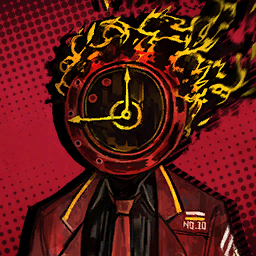

        * เสียงในหัว

            ```
            The bus wasn’t all that lively.
            บัสไร้ชีวิตชีวา
            ```
            ```
            I could hear Rodya’s occasional quips, or Heathcliff starting pointless quarrels with someone—probably Don Quixote or Sinclair.
            ผมได้ยินมุกตลกของโรดย่าเป็นครั้งคราว เสียงฮิธคลิฟฟ์ที่กำลังทะเลาะอย่างไม่มีแก่นสารกับใครบางคน—ที่น่าจะเป็นดอนกิโฆเต้ ไม่ก็ซินแคร์
            ```
            ```
            And Ryōshū’s demanding a source of heat to light her cigarette, having run out of lighter fluid.
            และเรียวชูที่ต้องการแหล่งกำเนิดความร้อนเพื่อจุดบุหรี่ จากการที่ของเหลวในไฟแช็คของเธอหมดลง
            ```
            ```
            Amidst the gripes and disorder, Gregor was pretty much the only Sinner I could rely on to willingly turn the mood around...
            ท่ามกลางความเจ็บปวด และโกลาหล เกรกอร์ดูจะเป็นคนบาปเพียงคนเดียวที่ผมสามารถพึ่งพา ให้บรรยากาศที่ขมุกขมัวนี้จางลง...
            ```

        ---

        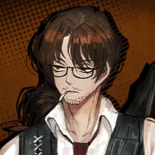

        ```
        Gregor: ......
        เกรกอร์: ......
        ```

        ---

        

        * เสียงในหัว
    
            ```
            One thing was for sure.
            สิ่งเดียวที่ผมพูดได้ตอนนี้ก็คือ
            ```
            ```
            If anyone were to blame for trashing the mood on the bus, it’d be Vergilius.
            ถ้าจะให้โทษใครที่ทำให้บรรยากาศเลวร้ายแบบตอนนี้ ก็คงต้องเป็นวอร์จิลิอุใส
            ```
            ```
            The road to the Golden Bough was an awfully arduous one...
            ถนนหนทางสู่กิ่งทองเป็นเส้นทางที่ยากลำบาก...
            ```
            ```
            Putting us on the brink of death (and some past that) several times, not to mention the occasions when we almost ended up unemployed.
            การจับพวกเรามาอยู่บนเส้นด้ายแห่งความตาย (และอดีตอันโหดร้าย) อีกหลายหน นี้ไม่นับรวมกับการที่พวกเราเกือบจะตกงานจากการทำภารกิจล้มเลวอีก   
            ```
            ```
            Yet Vergilius refused to see from our perspective.
            ถึงกระนั่นวอร์จิลิอุสปฎิเสธที่จะเห็นใจ และมองดูความรู้สึกในมุมพวกเรา
            ```
            ```
            Given the circumstances, it’s only natural for our Sinners to be palpably disgruntled.
            ดังนั้นจากสถานการณ์ที่เกิด มันเป็นเรื่องธรรมชาติอยู่แล้วที่เหล่าสหายคนบาปจะพากันรู้สึกไม่พอใจ
            ```
            ```
            Tired of the silent treatment, Ishmael spoke up.
            ด้วยความเบื่อหน่ายจากบรรยากาศที่เต็มไปด้วยความเงียบงันอันไม่จบสิ้น อิชมาเอลพูดขึ้นว่า
            ```

        ---

        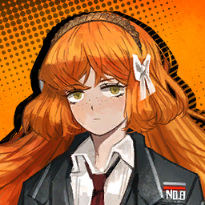
        
        ```
        ishmael: Couldn’t you tell me where our next destination is now, at least?
        อิชมาเอล: อย่างน้อย ๆ นี้คุณไม่คิดจะบอกฉันหน่อยรึไงคะว่าจุดหมายต่อไปที่เรากำลังมุ่งหน้าคือที่ไหน?
        ```

        ---

        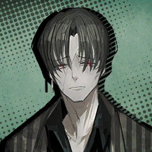

        ```
        Vergilius: Oh, sorry about that.
        วอร์จิลิอุส: โอ้ ขอโทษสำหรับเรื่องนั่นด้ยล่ะกัน
        ```
        ```
        Vergilius: I was wondering whether briefing the mission to you miscreants would be worth the effort.
        วอร์จิลิอุส: ฉันเองก็กำลังสงสัยอยู่เหมือนกันว่าการที่ฉันนั่งพูดโน่นพูดนี้คร่าว ๆ เกี่ยวกับภารกิจ มันจะคุ่มค่าอะไรกับไอพวกที่ล้มเลวในหน้าที่อย่างพวกแก
        ```

        ---
    
        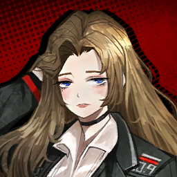

        ```
        Rodion: Pah, you’re hurting me with your cold shoulder. Don’t you know that kids falling behind need more love?
        โรเดียน: เน่ รู้ไหวว่าคุณกำลังทำฉันเจ็บด้วยคำพูดที่แสนเย็นชาพวกนั่นอยู่ คุณไม่รู้หรือไง ว่าเด็ก ๆ พวกนี้ที่ถูกคุณทิ้งขว้างก็ต้องการความรักเหมือนกัน
        ```

        ---

        

        ```
        Vergilius: And let me plead you not to embarrass me this time.
        วอร์จิลิอุส: และฉันเองก็ขอร้อง ขอให้ครั้งนี้เธอจะไม่ทำฉันขายหน้าอีกเป็นครั้งที่สอง
        ```
        ```
        Vergilius: I sure don’t want to look like a teacher taking a bunch of gradeschoolers out for a picnic.
        วอร์จิลิอุส: ฉันมั่นใจได้เลยว่าฉันไม่ได้อยากเป็นคุณครูที่มีหน้าที่ต้องมาคอยดูแล พาเหล่าเด็กนักเรียนผู้ไร้เดียงสาไปปิกนิกกลางทุ่งดอกไม้หรอกนะ
        ```
        ```
        Vergilius: I have high hopes for you in particular, Rodion. You might just make a good guide for this tour.
        วอร์จิลิอุส: ฉันหวังกับเธอไว้สูงนะ โรเดียน รอบนี้เธอคงเป็นประโยชน์อย่างมากในการนำเที่ยวพวกเราในการเดินทางครั้งนี้  
        ```

        ---

        

        ```
        Rodion: Huh? I know I’m a big deal, but I don’t think I can be a guide for a place I don’t know...
        โรเดียน: หะ? ฉันรู้นะว่าฉันสำคัญ แต่ฉันไม่คิดว่าฉันจะนำเที่ยวที่ไหนที่ฉันไม่รู้จักได้หรอกนะ...
        ```

        ---

        

        ```
        Vergilius: No worries. We’re heading to a location you should be more than familiar with.
        วอร์จิลิอุส: เรื่องนั่นไม่ต้องเป็นห่วงไป เพราะยังไงสถานที่ที่เรากำลังมุ่งหน้าเป็นที่ที่เธอคงคุ่นเคยดี
        ```
        ```
        Vergilius: A Nest of hedonism where you can drown in money or be drained of everything you have:
        วอร์จิลิอุส: เนสแห่งสุขนิยม คือ สถานที่ที่ผู้คนจมไปในกองเงิน หรือไม่ก็ สูญสิ้นทุกอย่างที่ตัวเองมี:
        ```
        ```
        Vergilius: J Corp’s.
        วอร์จิลิอุส: บริษัทจี
        ```

        ---

        

        ```
        Rodion: ......
        โรเดียน: ......
        ```

        ---

        

        * เสียงในหัว

            ```
            Great, even Rodya has gone quiet now.
            เยี่ยมเลย ทีนี้โรดย่าก็เงียบไปอีกคน
            ```

        ---

        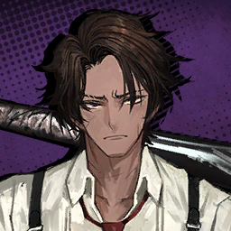

        ```
        Heathcliff: Well, I suppose it wouldn’t be so bad to win big while we’re at it.
        ฮิธคลิฟฟ์: ถ้างั้น ฉันคิดว่ามันคงไม่เป็นไรใช่ไหมถ้าจะตบรางวัลใหญ่สักสองสามรางวัลตอนที่เราอยู่ที่นั่นน่ะ
        ```
        ```
        Heathcliff: Oi, someone wake me up when we’re there.
        ฮิธคลิฟฟ์: อ่ย ใครก็ได้ปลุกฉันตอนที่ถึงแล้วด้วย
        ```

        ---

        

        ```
        Vergilius: ...Coincidentally, the bus will be unable to take you right to the branch building this time, dear passenger.
        วอร์จิลิอุส: ... เรียนท่านผู้โดยสารโปรดทราบ ขออภัยในความไม่สะดวก ด้วยความบังเอิญ ครั้งนี้รถบัสของเราจะไม่สามารถนำส่งทุกท่านเข้าไปยังอาคารบริษัทได้ 
        ```
        ```
        Vergilius: Charon, park it.
        วอร์จิลิอุส: ชอรอน เทียบรถตรงนี้
        ```

        ---

        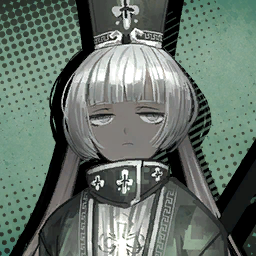

        ```
        Charon: ......
        ชารอน: ......
        ```

        ---

        

        ```
        Vergilius: ...? Charon?
        วอร์จิลิอุส: ...? ชารอน? 
        ```

        ---

        

        ```
        Charon: What's "park"?
        ชารอน: อะไรคือ "เทียบรถ"?
        ```

        ---

        

        ```
        Vergilius: It means stop.
        วอร์จิลิอุส: มันหมายความว่าหยุดรถ
        ```

        ---

        

        ```
        Charon: Stops are red. Red tastes bad to Charon.
        ชารอน: หยุดถ้าเจอสีแดง สีแดงไม่อร่อยสำหรับชารอน 
        ```

        ---

        

        * เสียงในหัว

            ```
            Grumbling, Charon hit the brakes without warning, sending most of the Sinners flying face-first into the seats ahead and flinging others off theirs.
            ชารอนบ่นพึมพำก่อนจะเหยียบเบรคอย่างกระทันหัน ส่งเหล่าคนบาปตัวลอยหน้ากระแทกเบาะด้านหน้า และพลัดตกจากที่นั่ง
            ```
            ```
            I was, of course, powerless against the inertia.
            ผมเองก็ไม่ต่างกัน ไร้พลังใดที่จะต่อต้าน
            ```
            ```
            A cacophony of complaints and shouts erupted.
            เสียงดังเจี๊ยวจ๊าวของคำด่าทอ และตะโกนประทุขึ้น
            ```
            ```
            Although I didn’t get to hear the Sinners’ ramblings in clear detail...
            ถึงผมจะได้ยินไม่ชัดว่าเหล่าคนบาปพูดอะไรกันก็ตาม...
            ```

        ---

        

        ```
        Vergilius: Good to see you all full of energy. Now out.
        วอร์จิลิอุส: ดีที่ได้เห็นพวกคุณเต็มเปี่ยมไปด้วยพลังงาน ทีนี้ไสหัวออกไปได้แล้ว
        ```

        ---

        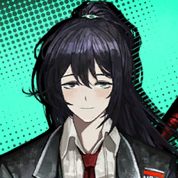

        ```
        Hong Lu: Hmm... The destination still seemed rather far... Ah! Will you call a taxi for us?
        ฮงหลู่: หืม... ดูเหมือนว่าที่หมายจะยังอยู่ไกลอยู่เลยนะครับ... อ้า! คุณจะเรียกเท็กซี่ให้พวกเราหรอครับ?
        ```
        
        ---

        

        ```
        Vergilius: ...As Ms. Faust will explain in detail, this mission is going to be quite different from our last, Dante.
        วอร์จิลิอุส: ...อ้างอิงจากที่คุณเฟาสท์จะอธิบายให้กับพวกคุณ ภารกิจนี้จะค่อนข้างแตกต่างจากภารกิจก่อนหน้า ดันเต้
        ```
        ```
        Vergilius: This is because the location of the Golden Bough...
        วอร์จิลิอุส: นี้ก็เป็นเพราะที่อยู่ของกิ่งทอง เป้าหมายในภารกิจนี้...
        ```
        ```
        Vergilius: ...is in the underground of a casino.
        วอร์จิลิอุส: ...อยู่ภายชั้นใต้ดินของคาซิโน
        ```

        ---

        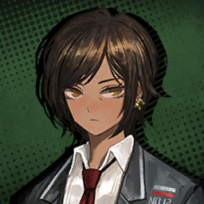

        ```
        Outis: Do you mean to tell us that it’s among the brightly lit buildings standing at the center of that street?
        เอาทิส: กำลังจะบอกพวกเราว่ามันอยู่ภายในหนึ่งในตึกสว่างพวกนี้ที่เรียงรายกัน ณ ใจกลางถนนนั่นน่ะเหรอ
        ```

        ---

        

        ```
        Vergilius: That’s right, it’s one of those.
        วอร์จิลิอุส: ถูกต้อง มันอยู่ภายในหนึ่งในพวกนั่น
        ```

        ---

        

        ```
        Ishmael: The Lobotomy Branch Facility we infiltrated last time was one that had been neglected for quite a while.
        อิชมาเอล: สาขาโลโบโตมี่ที่เราบุกไปครั้งก่อนเป็นแห่งที่ถูกทิ้งร่างสักพักใหญ่
        ```

        ---

        

        ```
        Sinclair: So you mean that... that was the exception?
        ซินแคร์: แต่นี้มัน... ไม่เหมือนกันเลยนะครับ?
        ```

        ---

        

        ```
        Vergilius: See, it’s times like this that remind me our team doesn’t necessarily lack critical thinkers... It really does make me wonder how you managed to blunder your previous mission even more.
        วอร์จิลิอุส: เห็นไหมล่ะ ในเวลาแบบนี้เนี้ยแหละที่ฉันเห็นว่าทีมของเราไม่ได้ขาดคนฉลาดที่มีหัวคิด... แล้วมันยิ่งทำฉันสงสัยเข้าไปใหญ่ว่าทำไมมันถึงเกิดข้อผิดพลาดในครั้งก่อนได้
        ```

        ---

        

        ```
        Ishmael: ......
        อิชมาเอล: ......
        ```

        ---

        

        ```
        Vergilius: The Golden Bough is a potent energy source, holding the essence of many technological marvels.
        วอร์จิลิอุส: กิ่งทองเป็นแหล่งพลังงานอันมีศักยภาพที่เก็บงำแก่นแท้ของเทคโนโลยีล้ำสมัยที่น่าอัศจรรค์ทั้งหลายในยุคนี้
        ```
        ```
        Vergilius: Such founts of energy will attract flows of wealth and people, and in no time, a whole civilization is built on top of it.
        วอร์จิลิอุส: แค่เพียงเศษเสี้ยวของพลังงานก็สามารถดึงดูดสายธารแห่งความร่ำรวยมั่งคั่ง และผู้คนเป็นกอบเป็นกำอย่างหาที่ไหนไม่ได้ แล้วในอีกไม่ช้าประชากรก็จะตกอยู่ภายใต้การปกครองของมัน
        ```

        ---

        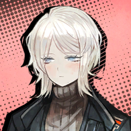

        ```
        Faust: Therefore, it’s likely that future destinations will have been occupied by other factions and their structures.
        เฟาสท์: ดังนั่น มันจึงมีความเป็นไปได้ว่าภาพที่ก่อร่างในอนาคตจะถูกแทรกแทรง และปกครองโดยชนกลุ่มอื่นด้วยโครงสร้างการปกครองของพวกเขา
        ```
        ```
        Faust: ...Which, in turn, indicates that we should be prepared to visit a wide variety of venues in addition to this casino.
        เฟาสท์: ...ซึ่งเป็นเหตุผลที่ว่าทำไมพวกเราถึงต้องเตรียมตัวที่จะเยี่ยมเยือนสถานที่อื่น ๆ รวมถึงคาซิโนนี้ด้วยค่ะ
        ```

        ---

        

        ```
        Vergilius: It also means that your first mission was a relatively easy one, yet you somehow snatched defeat from the wide-open maws of success.
        วอร์จิลิอุส: และมันก็ยังหมายความว่าภารกิจแรกของพวกคุณเป็นภารกิจที่ง่ายบรมง่าย แต่ถึงจะเป็นงั้น พวกคุณก็ยังอุตสาห์หาทางทำให้ภารกิจที่ควรจะสำเร็จไปได้ด้วยดีล้มเลวลงได้ซะอย่างงั้น
        ```

        ---

        

        ```
        Dante: <...Does he usually hold grudges that long?>
        ดันเต้: <...ไอหมอนี้เป็นคนขี้แค้นขนาดนี้เลยเหรอ?>
        ```

        ---

        

        ```
        Gregor: ...Ahem.
        เกรกอร์: ...อแหม
        ```

        ---

        

        ```
        Rodion: Don’t ask me~ We haven’t known him much longer than you have.
        โรเดียน: อย่าถามฉันเลยน้า~ เราก็ไม่รู้จักเขาไปมากกว่าเธอหรอก
        ```
        ```
        Rodion: What’d he say again? Something like, “Welcome to Limbus Company. I’m your guide, Vergilius” and all that...
        โรเดียน: ก็แบบเขาเคยพูดว่าไงนะ? อะไรสักอย่างประมาณว่า "ยินดีต้อนรับเข้าสู้บริษัทลิมบัส ฉันคือไกด์ของพวกเธอ วอร์จิลิอุส" แค่นั่นแล้วก็เป็นอย่างที่เห็น...
        ```
        ```
        Rodion: Hah! Pretty good impression, wasn’t it?
        โรเดียน: ฮ่า! เมื่อกี้ฉันแสดงสมบทบาทเลยใช่ม้าา?
        ```

        ---

        

        ```
        Gregor: You got his authoritative tone down to a tee, I’ll give you that. I had to hold myself back from asking if I could resign right after joining.
        เกรกอร์: ขอยอมรับเลยว่าเธอเลียนแบบไอ้น้ำจอมเสียงเผด็จการนั่น ของเขาได้เป๊ะจนน่าขนลุกเลย ฉันนี้แทบต้องห้ามตัวเองไม่ให้ฉี่ราด ขอลาออกหลังจากพึ่งสมัครงานเข้ามาวันแรก
        ```

        ---

        

        ```
        Dante: <I get the feeling the rest of you thought the same.>
        ดันเต้: <ผมรู้ว่าทุกคนก็คงคิดเหมือนกัน>
        ```

        ---

        

        ```
        Don Quixote: Nonsense! ‘Twas a day to go down in history! Beckoned by the Red Gaze himself! Truly, there is no honor greater than a Color addressing your―
        ดอน กิโฆ้เต้: ไร้สาระสิ้นดี! นี้คือวันที่จะถูกจารึกลงบนหน้าประวัติศาสตร์! การที่เราถูกเพรียกหาจากท่านนัตตาสีชาดด้วยตัวของเขาเอง! ถือเป็นเกียรติ์ที่ยิ่งใหญ่ที่สุดเหนือสิ่งใด ไม่มีสิ่งไหนจะเป็นบุญไปมากกว่าการที่คัลเลอร์กล่วาถึง―
        ```

        ---

        
        
        ```
        Gregor: Huh, I guess he does have a fan after all.
        เกรกอร์: อ่า ฉันเดาว่าเขาเองก็คงมีแฟนคลับอยู่บ้างล่ะเนอะ
        ```

        ---

        

        ```
        Rodion: Ufuhu, true that.
        โรเดียน: หุหุหิ ก็จริง
        ```

        ---

        

        * เสียงในหัว

            ```
            With their spirits lifted, Rodya and Gregor began to chuckle.
            อนึ่งจิตวิญญาณ และจิตใจของพวกเขาถูกอุ้มชู โรดย่ากับเกรกอร์ก็กลับมายิ้มแย้มพากันสรวลเสเฮฮ่าอีกครั้ง
            ```

        ---

        

        ```
        Vergilius: That’s more talking than necessary. I really do not wish for there to be impetus behind a third rule for this bus ride.
        วอร์จิลิอุส: ฉันว่านั่นเป็นการคุยกันที่เกินกว่าคำว่าพอควร แล้วฉันเองก็ไม่ได้อยากที่จะมีเหตุผลให้ต้องเพิ่มกฎข้อที่สามขึ้นมาเพื่อล้อมคอกสิ่งที่สัตว์อย่างพวกแกหรอกนะ
        ```

        ---

        

        ```
        Rodion: C’mon, give the employees some room to badmouth their boss. You’re being totally petty.
        โรเดียน: เอาน่า กระอีแค่ปล่อยให้พวกพนักงานมีพื้นที่กรนด่าหัวหน้าบ้างก็ไม่เห็นเป็นไรเลย คุณออกจะเนื้อหอม
        ```

        ---

        

        ```
        Vergilius: Next time, do it out of earshot.
        วอร์จิลิอุส: ครั้งหน้า ก็ช่วยพูดไกล ๆ ฉันหน่อย
        ```
        ```
        Vergilius: I’m more fragile than I look, you see.
        วอร์จิลิอุส: เพราะ ฉันเปราะบางกว่าที่พวกแกเห็น
        ```
        ```
        Vergilius: Right, time to get up and at it. I sure hope you come back with a Golden Bough in your hands this time.
        วอร์จิลิอุส: เอาหละ ถึงเวลาลุกขึ้น และทำงานได้แล้ว ฉันมั่นใจว่ารอบนี้พวกแกจะกลับมาพร้อมกับกิ่งกองในมือ
        ```

        ---

        

        ```
        Heathcliff: And if we bugger it twice?
        ฮิธคลิฟฟ์: แล้วถ้ารอบนี้หลุดมือไปอีกจะเป็นยังไง? 
        ```

        ---

        

        ```
        Vergilius: Who knows? Charon might suddenly forget what button to press to open the door for you.
        วอร์จิลิอุส: ใครจะรู้ล่ะ? จู่ ๆ บางทีชารอนก็อาจลืมว่าปุ่มไหนเป็นหุ่มเปิดประตูบัสให้พวกแกก็ได้มั่ง
        ```

        ---

        

        ```
        Charon: Button, red. Yucky color.
        ชารอน: ปุ่ม สีแดง สีขยะแขยง
        ```

        ---

        

        ```
        Heathcliff: ...You’re one daft bloke...
        ฮิธคลิฟฟ์: ...แกมันไอ่โง่...
        ```

        ---

        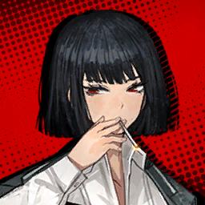

        ```
        Ryoshu: UITGAAN.
        เรียวชู: อพงลรดล.
        ```

        ---

        

        ```
        Heathcliff: And that means?
        ฮิธคลิฟฟ์: แล้วนั่นหมายความว่าไง?
        ```

        ---

        

        ```
        Ryoshu: Shorthand for “Useless idiotic travelers go and abscond, now”.
        เรียวชู: มันย่อมาจาก "ไอพวกโง่ลงรถได้แล้ว"
        ```

        ---

        

        * เสียงในหัว

            ```
            Heathcliff glared at Ryōshū, insults welling up in his throat, only to then expel a loud sigh.
            ฮิธคลิฟฟ์จ้องมองไปที่เรียวชู ด้วยคำกรนด่าที่เติมเต็มไปทั่วลำคอ ก่อนที่จะถอนหายใจเฮือกใหญ่
            ```
            ```
            He resigned uncharacteristically, as if he came to the realization that killing her wouldn’t solve anything.
            เขายอมถอยอย่างไม่สมเป็นตัวเองเสมือนว่าเขาคิดได้ว่าการฆ่าฟันกันจะไม่ได้ทำให้อะไรดีขึ้น
            ```

    ---

    * **Episode: 2 | ตอนที่ 2<br>Location: Pawn Avenue | ถนนพอน (จำนำ)**

        

        ```
        Faust: Allow me to give a rundown of the plan.
        เฟาสท์: โปรดให้ฉันได้อธิบายภาพรวมของแผนการก่อนนะคะ
        ```
        ```
        Faust: Our primary objective is to infiltrate the casino unsuspected; it will be critical for the successful recovery of the Golden Bough.
        เฟาทส์: เป้าหมายหลักของเราในครั้งนี้ก็คือการบุกเข้าไปในคาซิโนโดยไม่ถูกสงสัย; เพราะนั่นเป็นหัวใจสำคัญในการเก็บกู้กิ่งทองให้ได้สำริดผล
        ```
        ```
        Faust: According to the information we’ve acquired, the casino has three entrances.
        เฟาทส์: อ้างอิงจากข้อมูลที่พวกเรามี คาซิโนจะมีทางเข้าเพียงสามทางเท่านั่น
        ```
        ```
        Faust: One for ordinary visitors, one reserved for VIPs, and lastly, the backdoor used by employees.
        เฟาทส์: ทางแรกจะเป็นทางสำหรับผู้เยี่ยมชมทั่วไป ทางที่สองสำหรับวีไอพี และทางสุดท้าย ประตูหลังสำหรับพนักงาน
        ```
        ```
        Faust: We’ll split into three groups of four Sinners to cover each entrance... Four of us will disguise as croupiers, four will pose as guests, and four will play the role of VIPs.
        เฟาทส์: พวกเราจะแบ่งเป็นสามกลุ่ม กลุ่มละสี่คน เฉลี่ยกันสำหรับทุก ๆ ทางเข้า... พวกเราสี่คนจะปลอมตัวเป็นเจ้ามือ สี่คนต่อมาจะทำตัวเป็นแขแ และอีกสี่คนที่เหลือเล่นบทวีไอพีค่ะ
        ```

        ---

        

        ```
        Outis: Working in smaller groups will certainly draw less attention.
        เอาทิส: แบ่งกันทำงานในกลุ่มเล็ก ๆ เพื่อลดความสนใจงั้นสินะ
        ```

        ---

        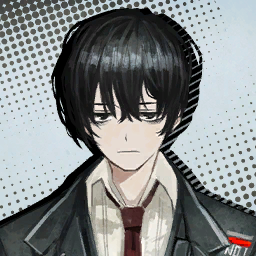

        ```
        Yi Sang: It is wiser to divide rather than unite.
        ยี่ซัง: เป็นการฉลาดมากกว่าที่จะแยกกันอยู่แทนที่จะอยู่ร่วมกัน
        ```

        ---

        

        ```
        Faust: Open the envelopes I gave out to confirm the role you’ve been assigned.
        เฟาสท์: กรุณาเปิดซองที่ดิฉันมอบให้เพื่อยืนยันตำแหน่งหน้าที่ของแต่ละคนที่ได้รับหมอบหมายได้เลยนะคะ
        ```
        ```
        Faust: Also, the higher-ups expressed concern over our performance.
        เฟาทส์: แล้วก็ ตอนนี้เหล่าคนใหญ่คนโตขององค์กรแสดงท่าทีกังวลอย่างชัดเจนกับผลงานที่ล้มมเลวไปครั้งก่อน
        ```
        ```
        Faust: They stress that the company’s future plans hinge on whether we can retrieve the Golden Bough through this operation.
        เฟาสท์: พวกเขาเครียด ลุกลี้ลุกลน รู้สึกกลัว ว่าแผนการที่สร้างขึ้นมาอย่างประณีตของบริษัทจะไม่สามารถดำเนินการตามกำหนดการที่วางเอาไว้ได้ อันเป็นผลเนื่องมาจากการที่กิ่งทองนั่น มีความสำคัญเชิงลูกโซ่กับขั้นปฎิบัติการต่าง ๆ ที่ต้องทำเป็นลำดับ
        ```
        ```
        Faust: Therefore, we will collaborate on a joint operation.
        เฟาสท์: ดังนั่นเอง พวกเราจึงได้รับผิดชอบหน้าที่การดำเนินการปฎิบัติการข้อต่อที่สำคัญต่อปฎิบัติการต่อ ๆ ไปนั่นเองค่ะ
        ```

        ---

        

        ```
        Dante: <Joint operation?>
        ดันเต้: <ปฎิบัตการข้อต่อ?>
        ```

        ---

        

        ```
        Faust: Our partner is a special forces unit consisting of professionals and veterans...
        เฟาสท์: พันธมิตรของเราคือหน่วยรบพิเศษที่เพรียบพร้อมไปด้วยผู้เชี่ยวชาญ และทหารผ่านศึก...
        ```
        ```
        Faust: I believe they are now monikered the ‘LCC’, short for the Limbus Company Clearance Department. Rest assured that they are our betters, at least in espionage operations.
        เฟาสท์: ถ้าฉันจำไม่ผิด ดิฉันเชื่อว่าพวกเขามีชื่อเล่นว่า "กลลบ" ที่ย่อมาจาก แผนกกวาดล้างแห่งบริษัทลิมบัส มั่นใจได้เลยว่าพวกเขาดีกว่าพวกเรา ที่อย่างน้องที่สุดก็เรื่องการสอดแนม
        ```

        ---

        

        ```
        Ishmael: I thought twelve people was already a crowd.
        อิชมาเอล: ฉันก็นึกว่าคนตั้งสิบสองคนจะเยอะแล้วนะเนี้ย
        ```

        ---

        
        
        ```
        Gregor: Guess someone finally realized that more isn’t always merrier.
        เกรกอร์: ดูเหมือนว่าใครบางคนจะรู้แล้วนะคนเยอะไม่ได้จะทำให้ร่าเริงยิ่งขึ้น
        ```

        ---

        

        ```
        Hong Lu: Wowzer! I haven’t met staff from other teams before. Just where could they be?
        ฮงหลู่: ว้าวซ่า! ผมไม่เคยพบเจ้าหน้าที่จากทีมอื่นมาก่อนเลย พวกเขาอยู่ไหนเหรอครับ?
        ```

        ---

        

        * เสียงใสหัว

            ```
            Hong Lu looked around, expecting Faust to bring them forward for introductions any second.
            ฮงหลู่มองไปรอบ ๆ คาดหวังว่าเฟาสท์จะพาพวกเขามาแนะนำตัวในอีกไม่ช้า
            ```
            ```
            ...Needless to say, no one showed up like he expected.
            ...แต่ไม่ต้องพูดก็รู้ สุดท้ายแล้วก็ไม่มีใครโผล่มาเหมือนที่เขาคาดหวังเลยสักนิด
            ```

        ---

        

        ```
        Faust: We’ll be heading to the pawnshop.
        เฟาสท์: พวกเราจะมุ่งหน้าไปที่โรงรับจำนำ
        ```

        ---

        

        ```
        Gregor: Is pawning still a thing these days?
        เกรกอร์: เดี๋ยวนี้ยังจำนำกันอยู่อีกเหรอ?
        ```

        ---

        

        ```
        Faust: We’re in the so-called pawnbroker’s avenue. Most businesses double as pawnshops here.
        เฟาสท์: ตอนนี้พวกเรากำลังเดินอยู่บนถนนอันเลื่องชื่อที่ผู้คนต่างเล่าขานในชื่อถนนโรงรับจำนำ นั่นก็เป็นเพราะธุรกิจที่พากันเปิดตัวเรียบถนนเส้นนี้ ล้วนแล้วแต่เป็นธุรกิจโรงรับจำนำทั้งสิ้น
        ```
        ```
        Faust: That place is our rendezvous. Let’s head inside.
        เฟาสท์: และที่นั่นก็คือสถานที่นัดพบของพวกเรา รีบเข้าไปกันเถอะค่ะ
        ```

    ---

    * **Episode: 3 | ตอนที่ 3<br>Location: A Pawn Shop | โรงรับจำนำ**

        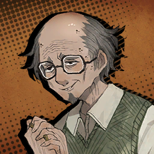

        ```
        Pawnbroker: Ain’t ya too many visitors at once? The shop’s cramped as is...
        นายหน้าโรงรับจำนำ: ลูกค้าอย่างพวกเธอทำไมมาพร้อมกันเยอะอย่างนี้ล่ะหะ? ร้านก็แคบแค่นี้เองแท้ ๆ...
        ```
        ```
        Pawnbroker: Y’all prefer your luck of the draw from trumps or mahjong?
        นายหน้าโรงรับจำนำ: แล้วพวกอยากเสี่ยงดวงด้วยไพ่ฝรั่ง หรือไพ่นกกระจอกดีล่ะ?
        ```

        ---

        

        * เสียงในหัว

            ```
            As we entered the shop, we were met with the gruff greeting of an old pawnbroker.
            ทันทีที่เราย่างกร่ายเข้ามาในร้าน พวกเราก็เจอเข้ากับคำต้อนรับอันหยาบคายจากนายโรงรับจำนำผู้แก่เฒ่า
            ```
        
        ---

        

        ```
        Heathcliff: What’s that blighter on about?
        ฮิธคลิฟฟ์: แล้วไอแก่นี้เกี่ยวอะไร?
        ```

        ---

        

        ```
        Ishmael: ...Am I the only one here who read up on Nest J? Vergilius gave us a pamphlet to peruse before we left.
        อิชมาเอล: นี้ฉันเป็นคนเดียวหรือเปล่าที่รู้เกี่ยวกับเรื่องในเนสเจ? ก่อนหน้านี้วอร์จิลิอุสให้แผ่นพับนี้มาเพื่ออ่าน
        ```

        ---

        

        ```
        Gregor: Well, I think I remember glancing at the cover...
        เกรกอร์: อ่า ฉันก็เหมือนจะอ่านผ่าน ๆ ตามาเหมือนกัน
        ```

        ---

        

        ```
        Ishmael: Here, you’ll get loaned different amounts depending on your fortune for the day.
        อิชมาเอล: ในสถานที่นี้ นายจะได้รับค่าจำนวนตอบแทนต่างกันขึ้นอยู่กับโชคขอนายในวันนั่น
        ```
        ```
        Ishmael: If you draw a great boon, you get extra cash, while misfortune means far less than what the pawn is worth.
        อิชมาเอล: ถ้านายจั่วได้ของดี นายก็จะได้เงินเพิ่ม ในขณะที่ถ้านายโชคไม่ดีมันก็หมายความว่านายจะได้รับเงินในมูลค่าที่น้อยกว่ามูลค่าสิ่งของแรกเริ่มที่นำมา
        ```

        ---

        

        ```
        Hong Lu: Ah~ That reminds me, our family had hired dedicated fortunetellers.
        ฮงหลู่: อ้า~ เจ้านี้ทำเอาเราคิดถึงต้นตระกูลของเราที่คว้านซื้อเหล่าหมดดูทั้งหลายมาประจำตำแหน่งเป็นหมอดูประจำเรือนเลย
        ```
        ```
        Hong Lu: They drew a greater boon for me in the divination they performed before I left. That must’ve been a sign that I would join all of you wonderful people on our journey.
        ฮงหลู่: ก่อนที่เราจะออกมา พวกเขาก็ทำพิธีศักดิ์สิทธ์เพื่อเสริมดวงให้เป็นสิริมงคลกับเราด้วย บางทีนี้อาจจะเป็นสัญญะว่าเราจะได้เข้าร่วมกับพวกท่านผู้เพรียบพร้อม และประเสริฐทุกคนในการเดินทางของพวกเรา
        ```

        ---

        

        ```
        Ishmael: Wow, really, so indulging in lofty leisure on your grand estate was your fated life. Maybe I should pray that I’m born that rich if there’s a next time.
        อิชมาเอล: ว้าว ถ้าการที่นายได้ดื่มดำช่วงเวลาว่างอันน่าสูงส่งบนกองมรดกอันหรูหรา และใหญ่โตคือชีวิตที่โชคชะตานายกำหนดไว้ งั้นบางทีถ้าชาติหน้ามีจริงฉันก็คงต้องสวดภาวนาให้ชาติหน้าฉันเกิดมาร่ำรวยบ้างงั้นสิ
        ```

        ---

        

        ```
        Heathcliff: I’m good. It’s well-off folks like him that tend to play dirty.
        ฮิธคลิฟฟ์: ส่วนฉันไม่ดีกว่า ไอพวกคนรวยแบบมันหน้าไหว้หลังหลอก ชอบเล่นสกปรกโสโครก เป็นได้แค่ไอตัวน่ารังเกลียดเท่านั่น
        ```

        ---

        

        ```
        Hong Lu: You might be right. I didn’t like to get along with my younger sibling in childhood. Always trying to cheat and grouch if things didn’t go as desired.
        ฮงหลู่: ที่ท่านพูดมาก็ถูกนะครับ ตอนเด็ก ๆ เราเข้าไม่ได้กับน้องที่เด็กกว่าเรา บางครั้งเราก็เลยพยายามที่จะโกง แล้วก็บ่นทุกครั้งที่ไม่ได้อะไรดั่งใจ
        ```

        ---

        

        ```
        Heathcliff: No, that’s NOT what I was getting at! 
        ฮิธคลิฟฟ์: ไม่ นั่นไม่ใช่สิ่งที่ฉันอยากจะสื่อเว้ย!
        ```

        ---

        

        ```
        Pawnbroker: So you wanna get your fortune or not?
        นายหน้าโรงรับจำนำ: แล้วพวกเธอจะรับโชคหรือเปล่าล่ะ?
        ```
        ```
        Pawnbroker: Forget about that... Do you people even have anything to pawn? I’m not seeing any wealth on ya...
        นายหน้าโรงรับจำนำ: ชั่งมันเถอะ... พวกเธอมีอะไรจะจำนำหรือเปล่าเนี้ย? ฉันไม่เห็นของมีค่าสักแดงเดียวอยู่กับตัวพวกเธอเลย... 
        ```

        ---

        

        * เสียงในหัว

            ```
            The pawnbroker glanced over each Sinner with a dubious look until his eyes landed on me.
            นายหน้าคนนั่นจ้องมองไปยังคนบาปแต่ละคนด้วยสายตาที่เคลือบแคลงสงสัย จนกระทั่งสายตานั่นของเขาหยุด และจ้องมองมาที่ผม
            ```

        ---

        

        ```
        Pawnbroker: Oho... That clockhead might be worth a good sum.
        นายหน้าโรงรับจำนำ: โอ๊ะโอ้... หัวนาฬิกานั่นก็ดูมีค่าอยู่บ้าง
        ```

        ---

        

        ```
        Rodion: How much do you think they sell for, old pal?
        โรเดียน: แล้วคุณคิดว่าจะขายได้ประมาณเท่าไหร่เหรอคะ คุณลุง?
        ```

        ---

        

        ```
        Dante: <Rodya... I’m not for sale...>
        ดันเต้: <โรดย่า... ฉันไม่ใช่ของขายนะ...>
        ```

        ---

        

        ```
        Faust: As you were likely contacted in advance, we are from Limbus Company, and...
        เฟาสท์: พวกเราน่าจะได้ติดต่อไปก่อนหน้านี้แล้วค่ะ พวกเรามาจากบริษัทลิมบัส และ...
        ```

        ---

        

        * เสียงในหัว

            ```
            Unfortunately, neither the Sinners nor the pawnbroker were paying any attention to Faust’s words
            โชคไม่ดีเลย ที่ทั้งเหล่าคนบาป หรือแม้แต่นายหน้าโรงรับจำนำก็ดี ไม่มีใครให้ความสนใจคำพูดเฟาสท์ที่พูดออกมาเลย
            ```

        ---

        

        ```
        Hong Lu: Oh, I did bring this handkerchief with me when I left home...
        องหลู่: โอ้ ตอนจากมา เราเอาผ้าเช็ดหน้านี้ติดตัวมาด้วย
        ```
        
        ---

        

        ```
        Pawnbroker: Oho... A dragon embroidered on silk. That’s some meticulous needlework, which might net... let’s see, seven million... Ahn?
        นายหน้าโรงรับจำนำ: โอ๊ะโอ้... ลายมังกรบนผ้าไหมนี้ ถือเป็นงานเย็บปักถักร้อยที่ประณีตมาก ซึ่งนั่นก็อาจทำให้ราคาตกอยู่ราว ๆ... ดูซิ ประมาณเจ็ดล้านได้ล่ะมั่ง?
        ```

        ---

        

        ```
        Heathcliff: A crummy piece of cloth is worth that much?! Have your eyes rotted out, old geezer?!
        ฮิธคลิฟฟ์: ไอเศษผ้าขี้ริ้วเนื้อร่วนนี้มันจะไปมีค่าขนาดนั่นได้ไง?! นี้ตาแกเน่าหมดแล้วหรือไงหะ ไอตาเฒ่าแก่?!
        ```

        ---

        

        ```
        Pawnbroker: Wha? You don’t recognize the value of this quality—­­ Beh, now I see. You’re wearing a shabby ring like it’s true treasure... Tsk-tsk.
        นายหน้าโรงรับจำนำ: ไรนะ? แกไม่รู้มูลค่าของในคุณภาพระดับนี้รึ— เอ๋ นั่นมัน ไหนดูซิ แกกำลังใส่แหวนซ่อมซ่อมอมแมมประดั่งว่ามันเป็นสมบัติอย่างงั้นแหละ... จิ๊-จิ๊
        ```

        ---

        

        ```
        Heathcliff: ...What did you just say.
        ฮิธคลิฟฟ์: ...เมื่อกี้แกพูดอะไร
        ```

        ---

        

        ```
        Rodion: Geez, cut it out! Dante~ Please shut them up~
        โรเดียน: เวรกรรม เฮ้! หยุดเลยแยกกัน! ดันเต้~ ช่วยห้ามพวกเขาทีได้ไหม~  
        ```

        ---

        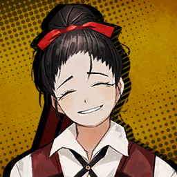

        ```
        Saude: You had us worried, Faust.
        เซาเด: คุณทำเราเป็นห่วงแทบแย่เลยนะคะ คุณเฟาสท์
        ```

        ---

        

        * เสียงในหัว

            ```
            Amidst the chaos, a most gentle voice softly landed on my ears.
            ท่ามกลางความวุ่นวายโกลาหล เสียงอันนุ่มนวล และสุภาพกระทบหูทั้งสองข้างของผม
            ```

        ---

        

        ```
        Saude: We were meant to meet each other at 4, but fifteen minutes had passed already. Surely you couldn’t have forgotten how to read a clock, right?
        เซาเด: ไม่ใช่ว่าเรานัดเจอกันตอนสี่โมงเหรอคะ แต่นี้เล่นเลทมาตั้งห้าสิบนาทีแนะ คุณคงไม่ได้ลืมวิธีใช้นาฬิกาใช่ไหม?
        ```

        ---

        

        ```
        Faust: Certainly not. There was little I could do to alter the driver of the bus.
        เฟาสท์: ไม่อยู่แล้วค่ะ เป็นปัญหาที่เกิดจากคนขับซึ่งฉันก็ทำอะไรเพื่อแก้ไขไม่ได้มากน่ะค่ะ
        ```

        ---

        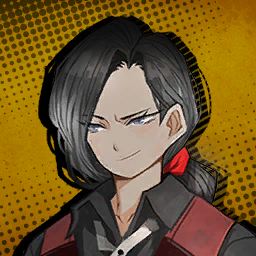

        ```
        Effie: Aha, so you’re taking a clock-person with you to help with the time? I suppose they didn’t come with an alarm.
        เอฟฟี่: อ้อเหรอ เพราะงั้นเธอถึงพามนุษย์นาฬิกามาด้วยเพื่อช่วยดูเวลารึไง? งั้นให้เดารุ่นนี้คงจะไม่มีฟังก์ชันปลุกเมื่อถึงเวลาล่ะสิท่า
        ```
        
        ---

        

        * เสียงในหัว

            ```
            The gentle voice was soon followed by one that didn’t even attempt to hide their disdain.
            ไม่นานจากเสียงอันสุภาพที่เปล่งออก กลับตามมาด้วยเสียงดูถูกที่ไม่แม้แต่จะพยายามเพื่อปกปิด
            ```

        ```
        Dante: <Come on, that’s a little harsh. Let’s try to leave better first impressions...>
        ดันเต้: <เอาน่า นั่นหยาบคายไปหน่อยนะครับ พวกเรามาทำแนะนำตัว และทำความรู้จักกันใหม่ดีกว่านะครับ...>
        ```

        * เสียงในหัว

            ```
            I know my voice won’t be heard by anyone other than the Sinners, but I still can’t help but get upset at rude remarks.ผมรู้ว่าเสียงของผมคงไม่อาจส่งถึงใครอื่นที่ไม่ใช่เหล่าคนบาปได้ แต่มันก็ช่วยไม่ได้ที่จะไม่รู้สึกโมโหกับสิ่งที่เจ้านั่นพูดออกมา
            ```

        ---

        

        ```
        Effie: Oh, so it was you? You guys are the team that botched the Golden Bough retrieval last time?
        เอฟฟี่: โอ้ งั้นนั่นก็คือพวกคุณเองเหรอ? มือทีมที่ล้มเลว ปล่อยให้กิ่งทองที่เป็นเป้าหมายโดยแย่งชิงไปเมื่อครั้งก่อนน่ะ?
        ```
        ```
        Effie: Folks had high expectations for your team, what with some of the smartest people in the City being on it.
        เอฟฟี่: ผู้คนต่างอุตสาห์คาดหวังในตัวพวกคุณเอาไว้สูง โดยที่มีบุคลากรตั้งหลายคนในทีมที่ได้ชื่อว่าเป็นอัจริยะ หรือฉลาดหลากแหลมอาจจะไม่ใช่ที่สุดในเดอะซิตี้ แต่ก็ใช่
        ```

        ---

        

        ```
        Saude: No wonder... Ms. Faust wasn’t looking very pleased.
        เซาเด: มิน่าละค่ะ... สีหน้าคุณเฟาสท์ถึงดูไม่สบอารมณ์ขนาดนั่น
        ```

        ---

        

        ```
        Faust: My face has remained constant.
        เฟาสท์: สีหน้าของฉันคงที่ไม่เปลี่ยนแปลง
        ```

        ---

        

        ```
        Heathcliff: Ey, what’re you standing around for? Go on now. This fellow here is also the brainy sort. Don’t brush him off.
        ฮิธคลิฟฟ์: นี้ แล้วแกจะมายืนป้วเปี้ยนตรงนี้ทำซากอะไรวะ? ไปตรงนู่นสิเว้ย เอ้า ไอหมอนี้ก็เป็นพวกมันสมองเหมือนกัน อย่าเมินมันสิ้
        ```

        ---

        

        * เสียงในหัว

            ```
            Heathcliff gave Yi Sang a sideways glance, but what he got in response was lukewarm.
            ฮิธคลิฟฟ์ส่งสายตาเหลือบมองยี่ซังด้วยหางตา แต่สิ่งเดียวที่เขาตอบกลับมีเพียงการเมินเฉย และไม่กระตือรือร้น
            ```

        ---

        

        ```
        Yi Sang: I shall not, as that would be a hollow vaunt.
        ยี่ซัง: ไม่ล่ะครับ ถ้าพูดแบบนั่นไป ก็คงไม่ต่างอะไร กับคำพูดโอ้อวดอันกลวงโบ้ และไร้แก่นสาร
        ```

        ---

        

        ```
        Heathcliff: But you were a lot more talkative down in that basement? Who are you and what did you do with Yi Sang?
        ฮิธคลิฟฟ์: แต่ไม่ใช่ว่าแกพูดมากกว่านี้หรือไงตอนที่อยู่ชั้นใต้ดินนั่น? แกเป็นใครกันแน่ และแกทำอะไรกับยี่ซังตัวจริง?
        ```

        ---

        

        ```
        Yi Sang: I am and have always been whom I match in the mirror.
        ยี่ซัง: ผมเป็นตัวผม และเป็นคนเดียวกันกับภาพสะท้อนในกระจก
        ```

        ---

        

        ```
        Heathcliff: You― Haah, forget it.
        ฮิธคลิฟฟ์: แก― อ้าาก ชั่งแม่ง
        ```

        ---

        

        ```
        Faust: Our first mission was devised with failure in mind.
        เฟาสท์: ภารกิจแรกของเราถูกวางแผนโดยคำนึงว่าจะเกิดความล้มเลวแต่แรกเริ่มแล้ว
        ```
        ```
        Faust: We needed an opportunity to see what potential our Sinners held.
        เฟาสท์: พวกเราต้องการโอกาศที่จะได้มองเห็นศักยภาพที่เหล่าคนบาปแต่ละคนพึงมี 
        ```

        ---

        

        ```
        Gregor: ...Wait, it was?
        เกรกอร์: ...เดี๋ยวนะ มันเป็นแบบนั่นเหรอ?
        ```

        ---

        

        ```
        Outis: A plan whose purpose is to fail? That could hardly qualify as a proposal.
        เอาทิส: แผนที่มีวัตถุประสงค์ให้ล้มเลวอย่างงั้นเหรอคะ? แบบนั่นดูเป็นไปได้ยากในการอนุมัติให้เป็นแผนการตั้งแต่แรกเลยนะคะ
        ```

        ---

        

        ```
        Saude: By the way, where is Vergilius? I agreed to assist with the operation mainly for a chance to get to see him. 
        เซาเด: ยังไงก็เถอะ คุณวอร์จิลิอุสอยู่ไหนงั้นเหรอคะ? ฉันตกลงที่จะให้การช่วยเหลือในปฎิบัติการนี้ หลัก ๆ ก็เพราะโอกาศที่จะได้พบเขา
        ```

        ---

        

        ```
        Effie: He must’ve been embarrassed. Imagine accompanying people like these.
        เอฟฟี่: เขาก็คงรู้สึกอายอยู่ล่ะมั่ง ลองนึกภาพเขาที่ต้องทำงานร่วมกับคนพวกนี้เซ่
        ```

        ---

        

        ```
        Heathcliff: Tch... Is that why he dropped us so far away from the place? Because he was ashamed of us?!
        ฮิธคลิฟฟ์: ชิ... งั้นนั่นก็คือสาเหตุที่เขาแตะพวกเราลงรถซะไกลขนาดนั่น? เป็นเพราะเขารู้สึกอายกับพวกเราเนี้ยนะ?!
        ```

        ---

        

        ```
        Ishmael: ...Doesn’t anyone have a thing to say about us being belittled?
        อิชมาเอล: ...ไม่มีใครมีอะไรจะพูดกับเรื่องที่พวกเราโดนหมิ่นกันต่อหน้าต่อตาแบบนี้เลยหรือไง?
        ```
        ```
        Ishmael: And won’t all the boasting and bluffing not do much if we don’t introduce ourselves first?
        อิชมาเอล: แถมไอการพูดโอ้อวด แล้วก็บลัฟอะไรพวกนี้แม่งไม่ช่วยเxี้ยอะไรทั้งนั่น ถ้าพวกเราไม่ได้แนะนำตัวให้รู้จักกันเลยด้วยซ้ำ?
        ```

        ---

        

        ```
        Faust: These two will be our cooperators for this mission. They’re from the Limbus Company Clearance department, also known as the LCC.
        เฟาสท์: ทั้งสองคนนี้จะเป็นผู้ร่วมงานของเราในภารกิจนี้ พวกเขามาจากแผนกกวาดล้างแห่งบริษัทลิมบัส หรือที่รู้จักกันในชื่อย่อ กลลบ
        ```

        ---

        

        ```
        Saude: The Before Team of Clearance, please. Ah, I’m Saude, and this here is Effie.
        เซาเด: ขอสวัสทุกคนจากทีมปฎิบัติการ อ่า ดิฉันชื่อว่าเซาเด และที่อยู่ตรงนี้ชื่อว่าเอฟฟี่ 
        ```

        ---

        

        ```
        Heathcliff: What, are we supposed to clap or...
        ฮิธคลิฟฟ์: เอาไงล่ะ ทีนี้พวกเราต้องปรบมือด้วยไหม
        ```

        ---

        

        ```
        Hong Lu: Wonderful! It’s a pleasure!
        ฮงหลู่: ชั่งเป็นเรื่องที่มหัศจรรค์ยิ่งนักครับ! ชั่งเป็นเกียรติอย่างมาก!
        ```

        ---

        

        * เสียงในหัว

            ```
            Hong Lu was the only person on the team welcoming them with total sincerity. (He almost even gave a standing ovation.)
            ฮงหลู่เป็นเพียงคนเดียวในทีมที่ต้องรับพวกเขาด้วยความจริงใจโดยสุดจริต (เขาเกือบจะยืนปรบมือให้ด้วยซ้ำ)
            ```
            ```
            A good half of the rest stared at the two with cold eyes, and the others wary, until introductions were finished.
            อย่างดีครึ่งหนึ่งพากันจ้องมองมาที่ทั้งสองคนด้วยสายตาที่เย็นชา และอีกครึ่งทีเหลือแสดงท่าทีระมัดระมัง และไม่ไว้ใจ จนกระทั่งการแนะตัวจบลง
            ```

    ---

    * **Episode: 4 | ตอนที่ 4<br>Location: A Pawn Shop | โรงรับจำนำ**

        

        ```
        Saude: Now... For this mission, we’ll basically spoon-feed you everything. All you have to do is open wide and chew up your simple tasks.
        เซาเด: เอาล่ะ... ในภารกิจครั้งนี้ พวกเราจะเป็นคนจัดการทุกอย่างให้เองค่ะ สิ่งที่พวกคุณต้องทำก็แค่ปล่อยสมองให้โล่งเข้าไว้ และทำตัวเป็นลูกนกตัวน้อย ๆ คอยทำงานง่าย ๆ ที่แม่นกทั้งสองหมอบหมายให้ ก็พอค่ะ
        ```
        ```
        Saude: Check the documents in this envelope, and do exactly, preciiiiisely as the papers say.
        เซาเด: ขอให้ทุกคนตรวจสอบเอกสารในซอง และทำทุกอย่างที่เขียนในนั่นให้แม่นนนนที่สุดนะคะ
        ```

        ---

        

        * เสียงในหัว

            ```
            The way Saude dragged out that vowel needled me a bit, but I decided not to argue.
            การลากเสียงคำแบบที่เซาเดทำเมื่อครู่พาผมรู้สึกฉุนนิดหน่อย แต่ผมก็ตัดสินใจที่จะไม่โต้เถียง
            ```
            ```
            Even if I did, the ticking of a clock would be all she’d hear.
            ถึงแม้ว่าผมจะทำมันลงไปจริง ๆ เธอก็คงได้ยินแค่เสียงติ๊กของนาฬิกาเดินเพียงเท่านั่น
            ```

        ---

        

        ```
        Gregor: There’s not a lot of joining together at all in this “joint operation”, is there? You’re just telling us to follow from behind.
        เกรกอร์: นี้ฉันเข้าใจอะไรผิดไปเปล่า เพราะดูเหมือนใน "ปฎิบัติการข้อต่อ" นี้ ฉันไม่เห็นว่าจะมีการร่วมมืออะไรสมกับชื่อข้อต่อเลยสักนิด? สิ่งที่เธอต้องการให้พวกเราทำก็แค่ตามจากด้านหลังแค่นั่นเองไม่ใช่หรือไงกัน
        ```

        ---

        

        ```
        Ishmael: This is insulting. Are they taking us for lubbers or what?
        อิชมาเอล: นี้มันดูถูกกันชัด ๆ พวกมันคิดว่าเราเป็นเด็กรึไงกัน?
        ```
        ```
        Ishmael: Look, Manager, we’ve got to put our foot down and...
        อิชมาเอล: ดูสิคะ คุณผู้จัดการ พวกเราต้องยืนกรานในจุดยืนของเรานะคะ แต่... 
        ```
        ```
        Ishmael: And...
        อิชมาเอล: แต่...
        ```
        ```
        Ishmael: ...do as they say, I guess?
        อิชมาเอล: ...สุดท้ายก็คงต้องทำตามที่เขาบอกอยู่ดีล่ะมั่งคะ?
        ```

        ---

        

        ```
        Dante: <Huh?> 
        ดันเต้: <หะ?>
        ```

        ---

        

        ```
        Ishmael: ...The documents they gave us. They’re flawless.
        อิชมาเอล: ...ก็แบบ ไม่ว่าดูยังไงเอกสารที่พวกเขาให้เรามามันก็ไร้จุดบอด
        ```
        ```
        Ishmael: Look at this. It has routes drawn out and everything. It’s been ages since I saw a plan this clear and meticulous.
        อิชมาเอล: ดูนี้สิคะ มันมีเส้นทางวาดเอาไว้ และทุก ๆ อย่างที่จำเป็นต่อการดำเนินปฎิบัติการ เป็นชาติแล้วล่ะมั่งคะที่ดิฉันเคยเห็นแผนการที่ละเอียด และเคลียร์ขนาดนี้
        ```

        ---

        

        ```
        Outis: Mhm, surely. This is certainly indicative of their knowledge in writing up proper plans of operation.
        เอาทิส: อืมม แน่นอนค่ะ ว่านี้คือองค์ความรู้ของพวกเขาที่เขียนลงเป็นแผนการอย่างถูกต้อง และเหมาะสมต่อสภาพการณ์ของปฎิบัติการครั้งนี้ค่ะ
        ```
        ```
        Outis: Ah, this isn’t to say that it holds a candle to the level of forethought you display, Manager.
        เอาทิส: อ่า แต่กระนั่นก็ยังไม่เท่าระดับของการคาดเดาล่วงหน้าอันสุดยอดไร้ที่ใดเปรียบของท่านแต่อย่างใดค่ะ
        ```

        ---

        

        * เสียงในหัว

            ```
            Convinced by Ishmael’s commendation, I opened the envelope and carefully read the rundown of the operation. 
            อนึ่งถูกโน้มน้าวด้วยคำชมเชยของอิชมาเอล ผมตัดสินใจเปิดซองเอกสาร และอ่านภาพรวมแผนของปฎิบัติการ
            ```
            ```
            The goal could be summarized as the following:
            เป้าหมายสามารถถูกย่อยออกเป็นดังนี้: 
            ```
            ```
            ‘Reach the top floor of the casino.’
            ‘ไปถึงชั้นบนสุดของคาซิโน’
            ```
            ```
            The main reason behind organizing this plan was the first-place prize for the table game to be held today.
            สาเหตุหลักเบื้องหลังแผนการนี้ก็คือรางวัลชนะเลิศของโต๊ะเกมที่จะจัดขึ้นในวันนี้
            ```
            ```
            According to the papers, winning the competition held on the top floor of the casino is the only way to gain access to the area with the Golden Bough.
            อ้างอิงจากเอกสารเหล่านี้ พบว่าการชนะการแข่งขันบนชั้นบนสุดของคาซิโนเป็นเพียงหนทางเดียวที่จะได้เข้าถึงพื้นที่ของเป้าหมายกึ่งทอง
            ```
            ```
            Four Syndicates that jointly bid on the casino will be playing in this game of chance...
            ซินดิเคททั้งสี่เองที่ะร่วมลงประมูลคาซินโน ในวันนี้มีโอกาศที่พวกเขาจะมาร่วมเล่นเกมแห่งโอกาศนี้ด้วยเหมือนกัน...
            ```
            ```
            Of the four... We will be using the name of the infamous...
            จากทั้งสี่... พวกเราจะใช้หนึ่งในชื่อของพวกเขาที่โด่งดัง และเป็นที่รู้จักกันในชื่อว่า...
            ```

        ---

        

        ```
        Dante: <Tingtang Gang?>
        ดันเต้: <กลุ่มแก๊งติงตังเนี้ยนะ?>
        ```

        ---

        

        ```
        Faust: A name doesn’t necessarily reflect the nature of an organization. That’s a shallow prejudice. 
        เฟาสท์: ชื่อไม่ได้เป็นสิ่งสำคัญที่กำหนดสภานภาพทางธรรมชาติ ภาพลักษณ์ และพฤติกรรมขององค์กรแต่อย่างใด การที่พูดแบบนั่นจะถือเป็นการใช้อคตินะคะ 
        ```

        ---

        

        ```
        Yi Sang: It is unideal for one to choose to see things through the tinted lens that is bias.
        ยี่ซัง: มันเป็นเรื่องเพ้อเจ้อกับการที่ใครคนใดคนหนึ่งเลือกที่จะมองสิ่งต่าง ๆ ผ่านเลนส์ย้อมสีที่เรียกว่าความลำเอียง
        ```

        ---

        

        ```
        Dante: <...Right.>
        ดันเต้: <...งั้นสินะ>
        ```

        * เสียงในหัว

            ```
            ...Back to the plan, we’ll disguise as the boss of the ‘Tingtang Gang’ and win that game of chance.
            ...กลับมาเรื่องแผน พวกเราจะปลอมตัวเป็นบอสของ ‘แก๊งติงตัง’ และเอาชนะเกมแห่งโอกาศ 
            ```
            ```
            Afterwards, we have to go to the underground floors where the Golden Bough lies.
            หลังจากนั่น พวกเราต้องไปชั้นใต้ดิน ณ สถานที่ที่กิ่งทองอยู่
            ```
            ```
            Leading up to the game, we’ll use the items and clothing we can find in pawnshops to disguise as our given roles, enter the casino, and wait for the team on the top floor to win the game.
            ก่อนเริ่มเกม เราจะใช้สิ่งของ และเสื้อผ้าต่าง ๆ ที่เราสามารถหาได้ในโรงรับจำนำแห่งนี้ เพื่อปลอมตัวตามแต่หน้าที่ที่แต่ละคนได้รับหมอบหมาย จากนั่นเข้าไปในคาซิโน และรอทีมที่อยู่ชั้นบนสุดชนะเกม
            ```
            ```
            That’s about it for the outline of this plan, I think...
            นั่นน่าจะเป็นเค้าโครงทั้งหมดในแผนการครั้งนี้
            ```
            ```
            Hey, wait a second. Won’t this entire thing fall apart if our player doesn’t win?
            แต่เดี๋ยวก่อน ไม่ใช่ว่าทุกอย่างที่ทำมาจะพังเหรอ ถ้าเกิดผู้เล่นของเราเกิดไม่ชนะขึ้นมา?
            ```

        ---

        

        ```
        Saude: We’ve prepared fake identification as well. It’s just in case the casino security runs random inspections on visitors.
        เซาเด: พวกเราได้เตรียมตัวตนปลอมพวกนี้มาด้วยเหมือนกัน ในกรณีที่เจ้าหน้าที่รักษาความปลอดภัยของคาซิโนตรวจสุ่มตรวจผู้เยี่ยมชม
        ```

        ---

        

        ```
        Gregor: Alright, that’s all fine and dandy... But how do you plan to win once you’re at the top floor?
        เกรกอร์: โอเค ทั้งหมดนั่นดูสุดยอด และสวยหรูดี... แต่เมื่อถึงชั้นบนสุด เธอมีแผนจะชนะเกมนั่นยังไงกันล่ะ?
        ```

        ---
        
        

        ```
        Effie: What do you think our outfits are for?
        เอฟฟี่: แล้วแกคิดว่าชุดของพวกเรามีไว้ทำอะไรกันล่ะ? 
        ```
        ```
        Effie: We practiced for months to pass off as bona fide croupiers.
        เอฟฟี่: พวกเราฝึกเป็นเดือน ๆ เพื่อที่จะสามารถผ่านเข้าไปในนั่นได้ ในฐานะดีลเลอร์ตัวจริงของแท้
        ```
        ```
        Effie: We’ll give you good luck. The game is in your bag, all you need is a pair of functioning eyes.
        เอฟฟี่: พวกเราจะเป็นคนส่งของดีให้กับพวกแก เพียงเท่านี้ เกมนี้ก็จะตกอยู่ในกำมือของพวกแกแล้ว สิ่งเดียวที่แกต้องมีก็แค่ตาที่ใช้การได้ก็พอ
        ```

        ---

        

        * เสียงในหัว
        
            ```
            Effie mumbled the last part to himself again while casting a sidelong scowl at our group.
            เอฟฟี่พึมพำส่วนสุดท้ายนั่นกับตัวเองอีกครั้ง ในขณะที่ส่งสายตา ใบหน้าบิ้งตึงมาทางกลุ่มของพวกเรา
            ```
            ```
            He’s making it painfully obvious he has no faith in us.
            เขาแสดงออกอย่างชัดเจนว่าเขาไม่มีความศรัทธาอะไรในตัวพวกเราทั้งนั่น
            ```

        ---

        

        ```
        Gregor: And how are we gonna take the place of the Tingtang Gang’s boss?
        เกรกอร์: แล้วพวกเราจะทำยังไงในการที่จะแทนที่บอสของแก๊งติงตังที่อยู่ในงานล่ะ? 
        ```

        ---

        

        ```
        Saude: We’ll put sedatives in the food served at the casino. We’ve already finished negotiating the details with the head chef.
        เซาเด: พวกเราจะแอบใส่ยากล่อมประสาทลงไปในอาหารที่จัดเสริฟ์ในคาซิโน และพวกเราก็ฮั้วเรื่องนั่นกับหัวหน้าเชฟเป็นที่เรียบร้อยแล้ว
        ```

        ---

        

        ```
        Yi Sang: Sedatives...
        ยี่ซัง: ยากล่อมประสาท...
        ```

        ---

        

        * เสียงในหัว

            ```
            Saude and Effie winked at each other.
            เซาเด และเอฟฟี่ขยิบตาให้กัน
            ```
            ```
            It was a gesture demonstrating that the two were ideal partners, able to tell each other’s thoughts just from exchanging glances.
            มันเป็นท่าทางการแดสงออกที่บ่งบอกว่าทั้งสองเป็นคู่หูคู่แท้ที่รู้ใจกัน สามารถบอกความคิดของอีกฝ่ายได้เพียงแค่สบตา
            ```

        ---

        

        ```
        Saude: Hey, Dear Pawnbroker~ We’ll be taking a look at the goods on showcase from here to there~
        เซาเด: นี้ คุณลุงโรงจำนำคะ~ จะเป็นอะไรไหมถ้าพวกเราจะขอดูของในตู้โชว์จากตรงนี้ไปถึงตรงนั่นน่ะ~
        ```
        
        ---

        

        ```
        Pawnbroker: Hyes? Oh! No yeah, sure, of course. Please take your time, ma’am.
        นายหน้าโรงรับจำนำ: เห้? โอ้! ได้สิไม่มีปัญหาหรอก แน่อน เชิญตามสบายเลยครับ คุณผู้หญิง
        ```

        ---

        

        * เสียงในหัว

            ```
            The pawnbroker’s attitude took a sharp turn from disdainful to kowtowing.
            ท่าทีของนายหน้าเปลี่ยนไปจากสายตาที่ดูถูกเหยียดหยามเป็นเลียแข้งเลียขาในทันที
            ```

        ---

        

        ```
        Saude: Now then, let’s take what we need from the display.
        เซาเด: ถ้างั้น เรามาเอาสิ่งที่เราต้องการจากตู้โชว์พวกนี้กันเถอะ
        ```

        ---

        

        ```
        Hong Lu: Oh my! This is a Guppcha Designer Brooch, isn’t it?
        ฮงหลู่: ตายแล้ว! นี้มันเข็มกลัดที่ออกแบบโดยดีไซน์เนอร์กุปชะงั้นเหรอ?
        ```
        
        ---

        

        ```
        Pawnbroker: Hyah~ What discerning eyes you have there, sir. This beaut is the mainstay of our shop’s catalogue. Only 10 of those were ever made, so its worth is positively un­—
        นายหน้าโรงรับจำนำ: ไฮย่า~ ท่านนี้ชั่งมีดวงตาที่เฉียบคมอะไรเช่นนี้ สุดสวยคนนี้เป็นตัวหลักของร้านเราน่ะครับ ปัจจุบันมีเพียงแค่ 10 เส้นเท่านั่นที่ถูกผลิตออกมา จึงมีค่าอยู่ราว ๆ ไม่ต่ำกว่—
        ```

        ---

        
        
        ```
        Hong Lu: My dog used to have one of these on its collar whenever we took it out for walkies. It’s so nice to see something that brings back pleasant memories!
        ฮงหลู่: หมาที่เราเคยเลี้ยงเองก็เคยใส่มันเป็นปลอกคอเหมือนกัน เวลาที่เราพามันไปเดินเล่น นี้มันชั่งดียิ่งนักที่ได้เห็นอะไรที่ย้อนช่วงความทรงจำที่ชวนคิดถึงพวกนั่นกลับมา
        ```

        ---

        

        ```
        Pawnbroker: ......
        นายหน้าโรงรับจำนำ: ......
        ``` 

        ---

        

        ```
        Rodion: I’m down for these cowhide gloves. Whoever had ‘em must’ve been a fashionista~
        โรเดียน: ฉันอยากได้ถุงมือหนังวัวพวกนี้จัง ใครที่ได้ใส่มันคงดูมีเทสแบบพวกเฟชั่นนิสต้าแหงเลย~
        ```

        ---

        
        
        ```
        Saude: Please take items that suit what’s written in the envelopes. You have roles to play.
        เซาเด: โปรดเอาสิ่งของที่เข้ากับสิ่งทีถูกเขียนในเอกสารที่ฉันแจงแจงไปให้นะคะ พวกคุณมีบทบาทที่ต้องเล่น
        ```

        ---

        

        ```
        Don Quixote: Pardon, but the envelope I have received says “janitor”, this must be an error of some sort!
        ดอน กิโฆเต้: ประทานโทษนะขอรับ แต่ภายในซองเอกสารที่ข้าน้อยได้รับ มันถูกเขียนเอาไว้ว่า “ภารโรง” ข้าว่ามันจะต้องเกิดข้อผิดพลาดอะไรบางอย่างแหงเลยขอรับ!
        ```
        
        ---

        

        ```
        Gregor: Okay, it’s good and all, but... Do you have the money to pay for all this?
        เกรกอร์: โอเค ทุกอย่างไปได้สวย แต่ว่า... พวกคุณมีเงินพอที่จะจ่ายสำหรับทั้งหมดนี้ด้วยเหรอ?
        ```

        ---

        

        ```
        Effie: Worrying about spendings? Who do you think we are, some low-rank hirelings? There’s nothing I can’t afford using this ‘Black Card’.
        เอฟฟี่: กังวลเรื่องเงินอยู่เหรอ? นี้นายคิดว่าพวกเราใครกัน ไอพวกลูกจ้างลิ่วล้อกี่กี้เบี้ยล่างหรือไง? ไม่มีอะไรทั้งนั่นที่ฉันจ่ายไม่ได้วยไอนี้ที่ฉันมี "การ์ดดำ"
        ```

        ---

        

        ```
        Rodion: Dante! What’s this about?! You told me we can’t have prime beef ‘cause we don’t have the budget!
        โรเดียน: ดันเต้! เรื่องนี้มันอะไรกัน?! ไหนนายบอกฉันว่าพวกเรากินเนื้อวัวเอไฟท์นั่นไม่ได้ เพราะว่าไม่มีเงินกันน่ะ!
        ```

        ---

        

        ```
        Faust: So the rumors were true that teams with notable performance are given a company card with no spending limit.
        เฟาสท์: ถ้างั้นข่าวลือนั่นก็เป็นเรื่องจริงสินะคะ ทีว่าทีมที่สามารถทำผลงานได้อย่างยอดเยี่ยม และน่าพึงพอใจ จะได้รับเครดิตการ์ดของบริษัทที่ไม่จำกัดวงเงิน
        ```

        ---

        

        * เสียงในหัว
        
            ```
            While everyone was shocked by the proven existence of the fabled Black Card...
            ในขณะที่ทุกคนกำลังตกตะลึงในพยานหลักฐานการมีตัวตนอยู่ขคองการ์ดดำที่เหมือนจะอยู่แค่ในเรื่องราวเทพนิยาย
            ```
            ```
            A loud voice came from outside.
            เสียงพูดก็ดังขึ้นมาจากข้างหลัง
            ```

        ---

        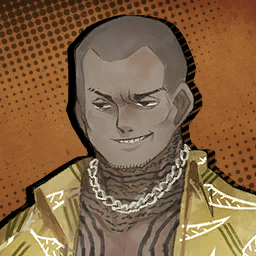

        ```
        Rustic-souding Tingtanger: Oi, dotard! Didn’t I say ya payment was due today?
        ติงแตงเกอร์ที่ดูบ้านนอก: อ่ย ไอแก่สมองเลอะเลือน! ไม่ใช่ว่าฉันบอกแกไปหรือไงว่าต้องจ่ายวันนี้? 
        ```

        ---

        

        * เสียงในหัว

            ```
            Someone who clearly belongs to a vicious Syndicate entered the pawnshop.
            ใครบางคนที่เห็นได้ชัดว่าเป็นหนึ่งในสมาชิกของซินดิเคตเข้ามาในโรงรับจำนำ
            ```
            
        ---

        

        ```
        Pawnbroker: P-Please... give me one more chance. I swear I’ll have the money ready.
        นายหน้าโรงรับจำนำ: ด-ได้โปรด... ให้โอกาศฉันอีกครั้งด้วยเถอะ ฉันสาบานเลยว่าครั้งนี้ ฉันจะหาเงินมาจ่ายให้ได้
        ```

        ---

        

        ```
        Rustic-sounding Tingtanger: One more? Can’t ya do basic math? Ya said the same thing last time! Boss won’t like me wasting precious time reteaching you kindergarten, ya hear?
        ติงแตงเกอร์ที่ดูบ้านนอก: อีกครั้ง? นี้แกคิดเลขง่าย ๆ ไม่เป็นหรือไง? ครั้งก่อนแกก็พูดแบบนี้! บอสไม่ชอบให้ฉันต้องทำเสียเวลาอันมีค่าในการที่จะต้องมานั่งสอนอนุบาลแกไหมแล้ว เข้าใจไหม?
        ```

        ---

        

        ```
        Pawnbroker: I-I’m just a frail old man standing on doddery feet, there’s really nothing you’ll get out of shaking me down...!
        นายหน้าโรงรับจำนำ: ผ-ผมก็เป็นแค่ชายแก่อ่อนแอที่กะอีแค่ยืนก็จวนจะล้มอยู่แล้ว ได้โปรดล่ะครับ มันไม่มีอะไรที่ผมให้คุณได้อีกแล้ว...!
        ```

        ---

        

        * เสียงในหัว

            ```
            Pleading with an overtly loud voice, the pawnbroker looked at us.
            อ้อนวอนด้วยเสียงพูดที่ดังอย่างเปิดเผย ชายแก่จ้องมองมาที่เรา
            ```

        ---

        

        ```
        Rustic-sounding Tingtanger: Eh? Ya talking back now? Yeah, go on then, get mad! I won’t feel so guilty that way!
        ติงแตงเกอร์ที่ดูบ้านนอก: เอ๋อ? เมื่อกี้แกเถียงฉันกลับงั้นเหรอ? อ่อใช่สิ เอาเลย โกรธเลยสิ! ถ้าเป็นแบบนี้ฉันจะได้ไม่ต้องรู้สึกผิด! 
        ```

        ---

        

        * เสียงในหัว

            ```
            In a way, he looked like he was covertly begging us to help him, based on his expression.The Sinners’ attention was naturally drawn to the ongoing row.
            สายตาที่เขาจ้องมองพวกเรามันเหมือนกับ ว่าเขากำลังแอบขอร้องพวกเราให้ช่วยเขาจากสีหน้าที่แสดงออก ความสนใจของเหล่าคนบาปพากันหันเหไปยังสถานการณ์ที่เกิดขึ้นอย่างธรรมชาติ
            ```
            ```
            The Sinners’ attention was naturally drawn to the ongoing row.
            ```

        ---

        

        ```
        Rustic-sounding Tingtanger: What’re ya lookin’ at? Ya think I’m playing?!
        ติงแตงเกอร์ที่ดูบ้านนอก: พวกmึงมองเxี้ยอะไรกันหะ? พวกแกคิดว่าฉันเล่นด้วยรึไง?!
        ```

        ---

        

        ```
        Ishmael: Gee... That was so stereotypical, I didn’t even get an urge to reply. Can’t people be more creative about throwing taunts?
        อิชมาเอล: เวรกรรม... พูดได้โคตรซ้ำซากฉิบหาย ทำเอาฉันหมดอารมณ์จะตอบเลยจริง ๆ ไอพวกคนแบบแกไม่มีหัวคิดคำยั่วยุที่ดูสร้างสรรค์กว่านี้แล้วเหรอ?
        ```

        ---

        

        ```
        Sinclair: Shouldn’t we... help out, maybe?
        ซินแคร์: พวกเรา... จะไม่ช่วยเขาหน่อยเหรอครับ?
        ```

        ---

        

        * เสียงในหัว

            ```
            Unlike Ishmael, who scoffed at the goon, Sinclair anxiously glanced over.
            ไม่เหมือนอิชมาเอล ผู้ที่เยาะเย้ยกุ๊ยที่อยู่ตรงหน้า ซินแคร์กลับจ้องมองด้วยสายตาที่หวาดหวั่นวิตกกังวล
            ```

        ---

        

        ```
        Saude: We have no choice, the Backstreets have their own rules and order. We aren’t the ones to disturb that complex web of their society.
        เซาเด: พวกเราไม่มีทางเลือกค่ะ เบลคสตรีทมีกฎ และระเบียบของตัวมันเอง เราไม่ใช่คนที่จะมาขัดขวาง หรือรบกวนโครงข่ายอันซับซ้อน ที่ถูกทอขึ้นเพื่อสังคมพวกเขาหรอกค่ะ
        ```
        ```
        Saude: Outsiders like us will only cause a bigger scene if we try to step in.
        เซาเด: คนนอกอย่างพวกเราจะทำได้ก็แต่ทำให้เรื่องมันลุกลามใหญ่โตเท่านั่น ถ้าก้าวขาเข้าไปยุ่ง
        ```

        ---

        

        * เสียงในหัว

            ```
            Pleased by the Sinners choosing to stay away, the goon continued with the extortion.
            เหล่าคนบาปต่างพากันเห็นด้วย และเลือกที่จะอยู่ห่าง ๆ กุ๊ยนั่นจึงขู่กรรโชกชายแก่ต่อไป
            ```

        ---

        

        ```
        Rustic-sounding Tingtanger: Hmph, if y’ain’t got money, why don’t ya pay your dues in that instead? We keep telling you.
        ติงแตงเกอร์ที่ดูบ้านนอก: หืมม ถ้าแกไม่มีเงินเหลือจ่าย ทำไมแกถึงไม่จ่ายหนี้ด้วยวิธีนั่นแทนล่ะ? ทั้งที่เราก็เคยบอกแก
        ```

        ---

        

        ```
        Pawnbroker: A-Anything but that... Please...
        นายหน้าโรงรับจำนำ: อ-อะไรก็ได้ แต่ไม่เอาไอนั่น... ได้โปรด...
        ```

        ---

        

        ```
        Dante: <...Is it really okay to leave them be?>
        ดันเต้: <...นี้มันจะโอเคแล้วจริง ๆ เหรอ ที่จะปล่อยพวกเขาไป?>
        ```

        ---

        

        ```
        Outis: Shall I settle the dispute for them so it does not bother you, Manager?
        เอาทิส: ให้ฉํนระงับการทะเลาะวิวาทของพวกเขา เพื่อที่มันจะได้ไม่กวนใจท่านไหมคะ ท่านผู้จัดการ?
        ```

        ---

        

        ```
        Gregor: What does that toughster mean by “that”, anyway?
        เกรกอร์: ว่าก็ว่าเถอะไอ "สิ่งนั่น" ที่เจ้ากุ๊ยนั่นพูดหมายถึงคืออะไรเหรอ?
        ```

        ---

        

        ```
        Faust: ...A currency more valuable than money exists in this District.
        เฟาสท์: ...สกุลเงินที่มีค่ามากกว่าเงินจริง ๆ ที่มีอยู่ในเขตนี้
        ```
        ```
        Faust: It’s well known that J Corp’s Singularity is a powerful security technology capable of locking anything.
        เฟาสท์: มันเป็นที่รู้กันว่าเทคโนโลยีซิงกูราลิตี้ของบริษัทเจนั่น เป็นเทคโนโลยีรักษาความปลอดภัยที่ทรงพลังในการล็อคได้ทุกสิ่งที่ปราธนา
        ```
        ```
        Faust: What is less known, however, is the extensive cultural and historical background of the Backstreets of Nest J that lead to the Singularity’s creation.
        เฟาสท์: แต่ถึงกระนั่น อีกสิ่งหนึ่งที่น้อยคนจะรู้ก็คือ ประเพณี และประวัติศาสตร์อันครอบคลุมเบื้องหลังเบลคสตรีทของเนสเจ ที่นำไปสู่การอุบัติ สร้างขึนของซิงกูราลิตี้ 
        ```

        ---

        

        ```
        Heathcliff: H, history...? Are you seriously about to lecture us here and now...? I was never told about any mandatory education when I joined this company!
        ฮิธคลิฟฟ์: ป ประวัติศาสตร์เนี้ยนะ...? นี้เธอจะมาบรรยายพวกเราที่นี้ ตอนนี้จริง ๆ หรือไง...หะ? ตอนที่ฉันสมัครเข้าบริษัทห่านี้ ไม่เห็นจะมีใครบอกฉันเกี่ยวกับการศึกษาภาคบังคับเลยนะ
        ```

        ---

        

        * เสียในหัว

            ```
            In spite of the opposition, Faust went on with her explanation.
            แม้จะมีการต่อต้านก็ตาม เฟาสท์ก็ยังคงอธิบายต่อไป
            ```

        ---

        

        ```
        Faust: Here, a technology exists to extract ‘wishpower’ from people.
        เฟาสท์: นี้คือเทคโนคโลยีที่มีตัวตนอยู่ เพื่อสกัด ‘แรงปราถนา’ จากผู้คน 
        ```
        ```
        Faust: Though it’s not widely known outside this District since it didn’t quite have the generality to be recognized as a Singularity.
        เฟาสท์: ถึงแม้ว่ามันจะเป็นเรื่องที่รู้กันในวงเล็ก ๆ ข้างนอกเขตนี้ เพียงเพราะมันไม่ได้มีลักษณะทั่วไปที่ถูกพิจารณาให้เป็นประเภทเดียวกับซิงกูราลิตี้
        ```
        ```
        Faust: In essence, it’s processing ‘luck’ into a commodity that can be traded. Like a form of money.
        เฟาสท์: แต่สาระสำคัญก็คือ มันสามารถประมวล บีบอัด หรือแปลรูปสิ่งนามธรรมที่เรียกว่า ‘โชค’ ให้กลายเป็นสินค้าโภคภันณฑ์ที่สามารถแลกเปลี่ยนสิ่งต่าง ๆ ไม่ต่างอะไรจากเงินตรา
        ```
        ```
        Faust: It brought forth the need for a way to stop others from forcibly extracting this wishpower, leading to the creation of a security technology that ultimately developed into the Singularity we know today.
        เฟาสท์: มันทำให้เกิดความจำเป็นในการหยุดยั้งใครก็ตามที่สกัดแรงปราถนาจากผู้คนโดยไม่จำยอม นำไปสู่การสร้างขึ้นของเทคโนโลยีรักษาความปลอดภัยล้ำหน้า ที่ปัจจุบันจะถูกพัฒนาเป็นซิงกูราลิตี้อย่างที่เรารู้จักกัน
        ```

        ---

        

        ```
        Effie: Gee-wee, Faust~ Must be tiring having to teach these dunces in ways they can get it.
        เอฟฟี่: ต๊าย-ตาย คุณเฟาสท์~ คงเหนื่อยมากเลยใช่ไหมครับ ที่ต้องมานั่งสอนไอพวกโง่พวกนี้ด้วยวิธีที่พวกมันเข้าใจ
        ```

        ---

        

        ```
        Faust: It’s fine, this was within my anticipated scenario.
        เฟาสท์: ไม่เป็นไรหรอกค่ะ นี้ยังคงเป็นสถานการณ์ที่อยู่ภายใต้การคาดการณ์ของฉันค่ะ
        ```

        ---

        

        ```
        Heathcliff: I don’t like the way you say that...
        ฮิธคลิฟฟ์: ฉันไม่ชอบวิธีที่เธอพูดเอาซะเลย...
        ```

        ---

        

        ```
        Saude: Come on now, gather the items to help with your disguises so we can leave.
        เซาเด: เอาน่าทุกคน ตอนนี้รีบเก็บของที่ต้องใช้ในการปลอมตัว แล้วเราจะได้ออกจากร้าน
        ```

        ---

        

        * เสียงในหัว

            ```
            Saude flapped the document full of scheduled plans to emphasize that we’d be busy.
            เซาเดกระพือเอกสารที่เต็มไปด้ยแผนการที่ถูกกำหนดไว้อย่างเด่นชัด เพื่อเน้นย้ำว่าพวกเรากำลังยุ่งอยู่
            ```

        ---

        

        ```
        Saude: We’re salaried workers, not “heroes” fighting for justice.
        เซาเด: พวกเราเป็นแค่พนักงานเงินเดือน ไม่ใช่ “เหล่าฮีโร่” ที่ต่อสู้เพื่อความยุติธรรม 
        ```

        ---

        

        ```
        Dante: <Wait... Not that word...!>
        ดันเต้: <เดี๋ยว... อย่างพูดคำนั่น...!>
        ```

        ---

        * เสียงในหัว

            ```
            A bad feeling rushing through my head prompted me to count the Sinners I could see.
            ความรู้สึกแย่ ๆ พุ่งพล่านเข้ามาในหัวของผม กระตุ้นให้ผมเร่งรัดนับจำนวนคนบาปที่ผมเห็น
            ```
        
        ```
        Dante: <That... does not align with a certain someone’s... beliefs...>
        ดันเต้: <นั่น... ไม่ตรงกับความเชื่อของใครบางคน...>
        ```

        * เสียงในหัว

            ```
            And it’s one that would severely provoke her principles...!
            และคำพูดนั่นคือสิ่งที่กระตุ้นต่อมคติของเธออย่างร้ายแรง...!
            ```

        ---

        

        ```
        Ishmael: ...!
        อิชมาเอล: ...!
        ```

        ---

        * เสียงในหัว

            ```
            Ishmael seems to have noticed what I meant, and hurriedly looked around.
            ดูเหมือนอิชมาเอลจะเข้าใจสิ่งที่ฉันสื่อ และหันไปมาอย่างเร่งรีบเพื่อมองหา
            ```

        ---

        

        ```
        Don Quixote: Thou darest try to pilfer the valuables of others? This behavior can only be seen as wholehearted villainy!
        ดอน กิโฆ้เต้: เจ้ากล้าดียังไงถึงคิดจะลักขโมยของมีค่าของผู้อื่น? พฤติกรรมเช่นนี้มีแต่จะถูกมองว่าเป็นความต่ำช้าสุดกู่ของยอดวายร้ายอย่างบริสุทธิ์หัวใจ
        ```

        ---

        

        ```
        Dante: <Oh no...! Don Quixote...!>
        ดันเต้: <โอ้ไม่...! ดอน กิโฆ้เต้...!>
        ```

        * เสียงในหัว

            ```
            But it was a moment too late.
            แต่ในจังหวะนั่นมันสายเกินไปแล้ว
            ```
            ```
            Don Quixote had already sprinted forward and was swinging her lance at the Tingtanger who gripped the pawnbroker by the collar.
            ดอนกิโฆ้เต้พุ่งตัวไปข้างหน้าแล้ว และกวัดแกว่งหอกของเธอไปทางที่เจ้ากุ๊ยติงแตงเกอร์ ผู้ซึ่งจับตัวชายแก่ที่คอ
            ```
            ```
            WHACK!  
            แว๊ก!
            ```
            ```
            Caught completely unaware, the goon was hit right on the head with the blunt side of her lance.
            โดยไม่ทันตั้งตัว กุ๊ยถูกตีเข้าไปที่ข้างศรีษะด้านขวาอย่างจังด้วยผิวข้างของหอก
            ```
            ```
            Knocked out on the floor in a frisky swing, the fainted goon became the center of attention for all of us inside the pawnshop for a solid minute.
            ล้มสลบเหมือดลงบนพื้นด้วยการกวัดแกว่งที่เต็มไปด้วยความเริงร่า กุ๊ยที่หมดสติกลายเป็นเป้าสนใจของพวกเราทุกคนภายในโรงรับจำนำไปเป็นนาที
            ```

        ---

        

        ```
        Saude: ......
        เซาเด: ...... 
        ```

        ---

        

        ```
        Faust: Ah, for your information, keeping the Sinners in check is not part of my job description. That would be the job of this person here.
        เฟาสท์: อ้า บอกให้รู้ไว้ก่อน การจับตาดู และดูแลเหล่าคนบาปให้อยู่ในร่องในรอยไม่ได้เป็นส่วนหนึ่งของหน้าที่ที่ฉันรับผิดชอบอีกต่อไปแล้ว ปัจจุบันสิ่งนั่นเป็นส่วนงานที่คนที่ยืนอยู่ตรงนี้รับหน้าที่อยู่
        ```

        ---

        

        ```
        Dante: <Don’t give me that look. There’s nothing in my abilities to keep her under control...>
        ดันเต้: <อย่ามองฉันอย่างงั่นซิ้ มันไม่มีอะไรที่ฉันทำเพื่อควบคุมเธอได้ในสถานการณ์แบบนั่นหรอก...>
        ```

        * เสียงในหัว

            ```
            I couldn’t stop myself from defending my position even when I was aware that my voice wouldn’t reach anyone besides the Sinners.
            ฉันอดไม่ได้ที่จะปกป้องจุดยืนของตัวเอง แม้จะรู้อยู่แล้วว่าไม่มีใครได้ยินนอกจากพวกคนบาป
            ```
            ```
            Oh well. It’s not like my defense would’ve made them look any less baffled towards me if they could hear it.
            โอ้ไงก็เถอะ มันก็ใช่ว่าการที่ผมปกป้องจุดยืนของตัวเอง จะทำให้พวกเขารู้สึกงงงวยใส่ผมน้อยลงเลยสักหน่อย ถ้าพวกเขาได้ยินผม
            ```

        ---

        

        ```
        Pawnbroker: Oooh...!
        นายหน้าโรงรับจำนำ: อู้ววว...!
        ```

        ---

        

        * เสียงในหัว

            ```
            The pawnbroker was the only one chuffed by this turn of events.
            นายหน้าแก่เป็นเพียงคนเดียวที่หัวเราะคิกคักกับเหตุการณ์ที่พลิกกลับตาลปัตร
            ```

        ---

        

        ```
        Pawnbroker: Great work, ma’am. Serves that hooligan right! But I’ll say, you could’ve whopped ‘em a tad harder, maybe.
        นายหน้าโรงรับจำนำ: เยี่ยมยอดมากครับ คุณผู้หญิง สมน้ำหน้าไอกุ๋ยนั่น! แต่ผมก็ต้องบอกเลยว่าอันที่จริง คุณน่าจะฟาดให้แรงกว่านี้
        ```

        ---

        

        ```
        Don Quixote: Vergilius advised me that while I am free to deliver justice unto villains, I must do so without unduly involving irrevelants in our mission! Thus, I showed moderation!
        ดอน กิโฆ้เต้: ท่านวอร์จิลิอุสเคยแนะนำข้าน้อยมาน่ะขอรับ ว่าเมื่อยามที่ข้ามีอิสระในการลงทัณฑ์เหล่าร้ายด้วยความยุติธรรม เราก็ควรทำมันให้ไม่กระทบกับภารกิจของเราจนเกินพอดี! เช่นนั่นเองข้าจึงลงมืออย่างพอประมาณขอรับ!
        ```

        ---

        

        * เสียงในหัว

            ```
            Her proud expression never looked so provoking.
            ใบหน้าที่ดูภูมิใจของเธอไม่เคยเร้าใจขนาดนี้มาก่อน
            ```

        ```
        Dante: <Uh-huh. So you remembered his words and still leapt forward?>
        ดันเต้: <อ่า-หะ งั่นเธอก็จำคำของเขาได้ แต่ก็ยังพุ่งตัวไปข้างหน้าน่ะหะ?>
        ```

        ---

        

        ```
        Don Quixote: ‘Twas a necessary action to stay true to my creed. Please understand my virtuous violence!
        ดอน กิโฆ้เต้: มันเป็นการลงมือที่จำเป็นเพื่อที่จะรักษาความสัตย์จริงในความเชื่อของข้า ท่านดันเต้ผู้บริหารแห่งเรา ได้โปรดเข้าใจในความรุนแรงที่เปี่ยมไปด้วยคุณธรรมของข้าด้วยเถิด!
        ```

        ---

        

        ```
        Pawnbroker: Not to kill the mood, but... That ruffian isn’t actually dead, right?
        นายหน้าโรงรับจำนำ: ไม่ได้จะขัดบรรยากาศนะ แต่เจ้า... กุ๊ยนั่นไม่ได้ตายไปจริง ๆ ใช่ไหม? 
        ```

        ---

        

        ```
        Gregor: I thought you wanted her to get straight to wallops, old sport?
        เกรกอร์: ผมนึกว่าลุงอยากให้เธอซัดเขาติดกำแพงซะอีกไม่ใช่หรือไง ตาแก่?
        ```

        ---

        

        ```
        Pawnbroker: I did, I did... But things would get fairly complicated if the Yurodiviye showed up, you know.
        นายหน้าโรงรับจำนำ: ก็ใช่ ฉันพูดแบบนั่น... แต่ว่าเรื่องมันจะบานปลายไปใหญ่ถาเกิดเจ้ายูโรดิวีโผล่ขึ้นมา รู้ไหม
        ```

        ---

        

        ```
        Rodion: The Yurodiviye? What are they doing here... No, forget that, why are you worrying about them?
        โรเดียน: ยูโรดีวี? พวกเขามาทำอะไรที่นี้... ไม่ชั่งมันเถอะ ทำไมคุณถึงเป็นห่วงเรื่องนั่นล่ะ?
        ```

        ---

        

        ```
        Pawnbroker: Not up to date with the news, are you, ma’am? They’ve been causing trouble here for months now.
        นายหน้าโรงรับจำนำ: ไม่ตามข่าวเลยนะ คุณผู้หญิง? พวกเขาสร้างปัญหาที่นี้มาเป็นเดือน ๆ แล้วล่ะ
        ```

        ---

        

        ```
        Don Quixote: Are they villains as well?!
        ดอน กิโฆเต้: พวกเขาเป็นวายร้ายเหมือนกันรึเปล่า?! 
        ```

        ---

        

        ```
        Pawnbroker: Oh, they’re villains to us humble merchants for sure. They were going on about, what was it, roughing up greedy peddlers keeping money to themselves, and giving it to those who need it. Distributing something, they said...
        นายหน้าโรงรับจำนำ: โอ้ แน่นอน พวกเขาเป็นวายร้ายตัวฉกาจสำหรับพวกเราชาวพ่อค้า พวกเขาทำสิ่งนั่นที่เรียกว่าไงนะ แบบรีดไถเหล่าพ่อค้าที่โลภมาก เก็บเงินไว้กับตัวเอง แล้วก็แจกจ่ายเงินพวกนั่นให้กับผู้คนที่ต้องการ การแจกจ่ายอะไรสักอย่าง ที่เขาว่า...
        ```

        ---

        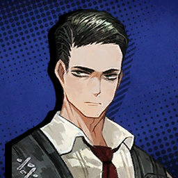

        ```
        Meursault: The redistribution of wealth.
        เมอร์โซลต์: การแจกจ่ายความมั่งคั่ง
        ```

        ---

        

        ```
        Pawnbroker: Aah~ That’s it, yes. Those scoundrels are robbing us poor saps of what little wealth we have. And they don’t even do the dirty work themselves, it’s always the local brutes they send. Can you believe it?
        นายหน้าโรงรับจำนำ: อ้า~ นั่นแหละใช่เลย แล้วก็ไอพวกชั่วนั่นกำลังปล้นเอา ๆ คอยสูดเลือดสูดเนื้อ เงินเล็ก ๆ น้อย ๆ ที่พวกคนซวยอย่างมีไปจนหมด แถมยังไม่ลงมือด้วยตัวเองด้วยซ้ำ เอาแต่ส่งพวกนักเลงแถวนี้มาทำแทนตลอดเลย เชื่อไหมล่ะ? 
        ```
        ```
        Pawnbroker: Anyhoo, life has been hard for us because of those self-righteous bunches. Looked like they were here to find something at first, but all they do now is squeeze money outta us...
        นายหน้าโรงรับจำนำ: ยังไงก็เถอะ ที่ชีวิตเราต้องทนทุกข์ อยู่ในขุมนรก ที่ชีวิตยากขนาดนี้ มันก็เป็นเพราะไอพวกชั่วนั่น ที่เอาแต่เอาดีเข้าตัว ตอนแรกก็เหมือนมาที่นี้เพื่อมองหาบางอย่าง แต่ไป ๆ มา ๆ สิ่งที่พวกมันทำตอนนี้ก็คือขูดรีดเงินจากพวกเรา...
        ```

        ---

        
        
        ```
        Rodion: ...Ah! I-I just realized, shouldn’t we take our leave now? More toughies from the Tingtang Gang might be coming this way.
        โรเดียน: ...อ้า! ฉ-ฉันพึ่งรู้ตัว พวกเราต้องออกแล้วไม่ใช่เหรอ? ไม่งั้นเดี๋ยวไอพวกกุ๊ยพวกนั่นจะยกโขยงมากันแล้วนะ
        ```

        ---

        

        * เสียงในหัว

            ```
            It seemed like Rodya deliberately cut off the pawnbroker in a hurry, but I had little time to think about the implications.
            มันดูเหมือนว่าโรดย่าจงใจตัดบทคุณลุงนายหน้าด้วยความเร่งรีบ แต่ผมก็มีเวลาเพียงน้อยนิดที่จะหาเหตุผลว่าทำไม
            ```

        ---

        

        ```
        Effie: Sigh, what a hassle... You’re making the problem bigger than it had to be.
        เอฟฟี่: เห้อ ยุ่งยากอะไรแบบนี้... รู้ไหมว่าเธอกำลังทำให้ปัญหามันใหญ่กว่าที่มันควรจะเป็น
        ```

        ---

        

        ```
        Gregor: Hey, Muffin and Sablé, was it? Don’t be so tart now. There are plenty of pawnshops around here, right? We can always find a different—
        เกรกอร์: นี้ มัฟฟิน กับ เซเบิลใช่ไหม? ตอนนี้อย่าพึ่งอารมณ์เสียไปเลย มันยังพอมีโรงรับจำนำอีกตั้งหลายแห่งที่นี้ไม่ใช่หรือไง? เดี๋ยวเราค่อยหาที่ใหม่ก็ได้— 
        ```

        ---

        

        ```
        Saude: It’s Effie and Saude. Please don’t mistake our names for confections.
        เซาเด: ชื่อว่าเอฟฟี่ กับ เซาเด โปรดอย่าพูดชื่อพวกเราสลับกับชื่อขนมเด็ดขาดค่ะ
        ```
        ```
        Saude: And your statement that there are plenty of pawnshops in the vicinity won’t mean much...
        เซาเด: และคำพูดของคุณที่ว่ายังมีโรงรับจำนำอีกหลายแห่งใกล้กันนี้ก็คงไม่มีความหมายอะไรนักหรอก...
        ```
        ```
        Saude: ...When said pawnshops notice the trouble happening here and close...
        เซาเด: ... ถ้าเกิดทุกร้านสังเกตเห็นปัญหาที่เกิดขึ้นที่นี้ และพากันปิดตัวลง
        ```

        ---

        

        ```
        Dante: <Don Quixote...!>
        ดันเต้: <ดอน กิโฆเต้...!>
        ```

        ---

        
        
        ```
        Effie: I’m getting tired of lecturing these idiots on every little thing. We should just leave.
        เอฟฟี่: ฉันเริ่มเบื่อที่จะต้องสอนทุกอย่างให้ไอพวกโง่พวกนี้ฟังแล้ว พวกเราออกกันเถอะ
        ```

        ---

        

        * เสียงในหัว

            ```
            Right as I tried to leave, someone wearing similar thuggish clothes to the one we’d just knocked out—with a face that looked just as rough—stormed into the shop.
            ตอนที่ผมจะออกจากร้าน มีใครบางคนสวมชุดที่เหมือนกับเสื้อผ้าของกุ๋ยที่เราพึ่งซัดล้มไปเมื่อครู่ ด้วยใบหน้าที่บูดบิ้งประดั่งพายุฝนฟ้าคะนองละลอกใหม่ซัดเข้ามาในร้าน
            ```

        ---

        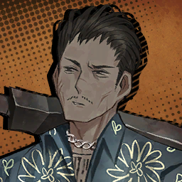

        ```
        Chest-puffing Tingtanger: Ayo, codger, have you seen our li’l—
        ติงแตงเกอร์ผู้อกพอง: นี้ตาแก่ แกพอจะเห็นไอจิ๋—
        ```
        ```
        Chest-puffing Tingtanger: 	Wee slimmy! Just what’s going on here?!
        ติงแตงเกอร์ผู้อกพอง: วี สลิมมี่! เกิดอะไรขึ้นที่นี้?!
        ```

        ---

        

        * เสียงในหัว

            ```
            We did our best to pretend to be innocent customers who just happened to be in the pawnshop at the wrong time.
            พวกเราพยายามอย่างเต็มที่ ที่จะแสร้งว่าพวกเราเป็นผู้บริสุทธิ์ ผู้ซึ่งอยู่ในโรงรับจำนำผิดที่ผิดเวลาก็เท่านั่น
            ```
            ```
            However, in an unfortunate concurrence of events, the goon came back to senses...
            แต่กระนั้น โชคไม่ดีเลยที่จู่ ๆ ก็เกิดเหตุการณ์สืบเนื่องที่ไม่คาดคิด เจ้ากุ๋ยนั่นดันกลับมามีสติซะได้...
            ```

        ---

        
        
        ```
        Chest-puffing Tingtanger: Who did this?! Tell me now! That bean is gonna regret the day they grew stems!
        ติงแตงเกอร์ผู้อกพอง: ใครทำแบบนี้กับนาย?! บอกฉันมา! ไอถั่วนั่นที่ทำกับแกจะต้องรู้สึกเสียใจนับตั้งแต่ที่มันงอกออกมาจากต้นอ่อน!
        ```

        ---

        

        ```
        Rustic-souding Tingtanger: Gnh... O... Over there...
        ติงแตงเกอร์ที่ดูบ้านนอก: อั่ก... ต... ตรงนั่น...
        ```
        ```
        Rustic-sounding Tingtanger: That red... timepuss...
        ติงแตงเกอร์ที่ดูบ้านนอก: ไอเจ้านาฬิกาสีแดง... เวรนั่น...
        ```

        ---

        

        * เสียงในหัว

            ```
            The direction that finger was pointing was simply too unambiguous for me to pretend otherwise.
            ทิศทางของนิ้วนั่นที่ชี้มา ดูชัดเกินกว่าที่ผมจะแสร้งทำเป็นไม่รู้เรื่อง
            ```
            ```
            Plus, there’s no point in denying that I was meant by “red timepuss”, as I’m sure there would be literally no one else matching that description in this entire District.
            อีกอย่างก็คือ มันไม่มีเหตุผลอะไรในการปฎิเสธว่าผมไม่ใช่เจ้านาฬิกาที่ไอกุ๋ยบ้านั่นหมายถึง ก็แบบ ผมค่อนข้างมั่นใจว่ามันคงไม่มีใครที่ไหนในเขตนี้อีกแล้วที่มีรูปร่างหน้าตาตรงกับรูปพันสันฐานแบบนั่น
            ```

        ---

        

        ```
        Pawnbroker: Just so you don’t get the wrong idea, I have nothing to do with these people or what happened here. I was just about to bring a towel to cool this poor fellow’s head.
        นายหน้าโรงรับจำนำ: อย่าเข้าใจผิดไปล่ะ ฉันไม่ได้มีอะไรเกี่ยวข้องกับคนพวกนี้ หรืออะไรที่เกิดขึ้นในร้านทั้งนั่น ฉันแค่จะเอาผ้าเช็ดตัวมาให้พ่อหนุ่มผู้น่าสงสารที่อยู่ตรงนี้
        ```

        ---

        

        ```
        Heathcliff: That smarmy gaffer...
        ฮิธคลิฟฟ์: ไอแก่กระล่อนนี้...
        ```

        ---

        

        ```
        Ishmael: I had no expectations for him in the first place, but that man really has a shaky reed for his backbone.
        อิชมาเอล: ฉันไม่ได้คาดหวังอะไรในตัวตาแก่นั่นตั้งแต่แรกอยู่แล้ว แต่ก็ไม่คิดเลยว่าสุดท้ายจะเป็นกิ้งก่าจอมผลัดเสื้อผลัดสีแบบนี้
        ```

        ---
    
        

        * เสียงในหัว

            ```
            Although the pawnbroker switching sides in a heartbeat and the finger-pointing clock slander—over something I wasn’t responsible for, too—hurt me a little, I was determined to stand firm.
            ถึงแม้ว่าชายแก่จะเปลี่ยนฝั่งในชั่วอึดใจ และกำลังชี้นิ้วมาที่ผมผู้ซึ่งมีหัวเป็นนาฬิกา ทั้งยังใส่ร้ายต่าง ๆ นานากับสิ่งที่ผมไม่ได้กระทำเลยด้วยซ้ำ พอเห็นแบบนั่นก็ทำเอาใจผมรู้สึกเจ็บเปล็บไปนิดนึง ผมทำได้แต่ยืนนิ่งเฉยอยู่ตรงนั่น 
            ```

        ---

        

        ```
        Chest-puffing Tingtanger: Jah... Frijolitos over there... Stop. Freeze in your tracks.
        ติงแตงเกอร์ผู้อกพอง: อ่า... ฟรีโฮเลสอยู่ตรงนั่น... หยุดอยู่กับที่ซะ
        ```

        ---

        

        * เสียงในหัว

            ```
            Mostly because it was clear that we had to run right now.
            หลัก ๆ มันก็ชัดเจนแล้วว่าตอนนี้คือเวลาที่เราต้องวิ่งหนี
            ```
            ```
            If I kept letting small things bother me, I would be reduced to a pulp sooner rather than later.
            ถ้าผมยังปล่อยให้เรื่องเล็ก ๆ พวกนี้คอยบั่นทอนผมต่อไปเรื่อย ๆ ผมคงได้ตายเร็วแหง
            ```

        ---

        

        ```
        Ryoshu: Bah. No need to run. Let’s just kill them all and be done with it.
        เรียวชู: เชอะ ไม่เห็นจำเป็นต้องวิ่งหนีเลยนี้ ก็แค่ฆ่าพวกมันให้หมดก็พอแล้ว
        ```

        ---

        

        ```
        Effie: What’s next? You’re going to wipe out the whole Syndicate?
        เอฟฟี่: แล้วจะทำไงต่อล่ะ? เธอจะฆ่าล้างบางพวกซินดิเคทที่เหลือรึไง?
        ```

        ---

        

        ```
        Ryoshu: Heh. That doesn’t sound too bad.
        เรียวชู: เฮอะ นั่นก็ฟังดูไม่แย่
        ```

        ---

        

        ```
        Don Quixote: The forces of evil must be uprooted with haste in order to raise the banner of justice high!
        ดอน กิโฆเต้: กองกำลังความชั่วร้ายต้องถูกถอนรากถอนโคนโดยเร่งด่วน เพื่อที่จะยกธงแห่งความยุธิธรรมขึ้นสูงเหนือความชั่วร้ายทั้งปวง
        ```

        ---

        

        ```
        Effie: Uh, so, is there seriously no one on your team who’s in their right mind?
        เอฟฟี่: เออ นี้ ไม่มีใครในทีมเธอที่ปกติเลยบ้างเลยรึไง?
        ```

        ---

        

        * เสียงในหัว

            ```
            Ishmael looked insulted by this remark and seemed to be thinking of a counterargument, but the Tingtang goons arming themselves were a more pressing matter.
            อิชมาเอลดูไม่ชอบใจคำพูดเมื่อครู่ และดูเหมือนกำลังคิดที่จะโต้แย้ง แต่เรื่องนั่นเอาไว้ก่อน เพราะพวกกุ๋ยแก๊งติงแตงที่ติดอาวุธที่อยู่ตรงหน้าเป็นปัญหาที่ใหญ่หลวงกว่า
            ```

        ```
        Dante: <Let’s just...>
        ดันเต้: <พวกเราต้อง...>
        ```
        ```
        Dante: <Let’s get outta here first!>
        ดันเต้: <วิ่งหนีออกจากที่นี้ก่อน!>
        ```
    ---

    * **Episode: 5 | ตอนที่ 5<br>Location: Pawn Avenue | ถนนพอน (จำนำ)**

        
        
        * เสียงในหัว

            ```
            As Saude predicted, all the pawnbrokers were busy closing their street entrances to avoid trouble.
            เหมือนอย่างที่เซาเดคาดการเอาไว้ เหล่านายหน้าโรงรับจำนำต่างพากันง่วนอยู่กับการปิดร้านเพื่อหลีกเลี่ยงปัญหา
            ```

        ---
        
        
        
        ```
        Chest-puffing Tingtanger: Ey you pricks!! Stop right where you’re standin’!
        ติงแตงเกอร์ผู้อกพอง: เอ้ย ไอพวกเหลือขอ!! หยุดตรงที่แกยืนอยู่เดี๋ยวนี้!
        ```
        ```
        Chest-puffing Tingtanger: Ya think you can get away with messing with our family, tiny fave?
        ติงแตงเกอร์ผู้อกพอง: พวกแกคิดว่าจะสามารถหนีรอดไปไดเ หลังจากที่มายุ่งกับครอบครัวของเราหรือไง ไอตัวจ้อย? 
        ```

        ---

        

        ```
        Ishmael: What’s with brutish Syndicates and their pretend families? Is that the only thing they can think of to bond with each other?
        อิชมาเอล: ไอซินดิเคตที่ต้องมาพร้อมกับความป่าเถื่อน กับครอบครัวที่แสร้งทำพวกนี้คืออะไร? นี้เป็นสิ่งเดียวแล้วหรือไงที่พวกมันคิดได้เพื่อที่จะผูกพันธะสัมพันธ์ระหว่างกัน
        ```

        ---

        
        
        ```
        Chest-puffing Tingtanger: 	Look at the bump you made on our precious young’un’s head!
        ติงแตงเกอร์ผู้อกพอง: ดูรอยช้ำพวกนี้ที่แกทำกับหัวน้องเล็กสุดที่รักของเราสิ!
        ```

        ---

        

        ```
        Ishmael: ......
        อิชมาเอล: ......
        ```

        ---

        

        ```
        Effie: Good gracious... This was not part of the plan...
        เอฟฟี่: ชั่งใจดีอะไรเช่นนี้... ทั้ง ๆ ที่นี้ไม่ใช่แม้แต่จะเป็นส่วนหนึ่งของแผนเราด้วยซ้ำ แต่อุตสาห์สร้างเรื่องซะขนาดนี้...
        ```

        ---

        

        * เสียงในหัว

            ```
            Effie clutches his forehead as if it were aching.
            เอฟฟี่เกาหน้าผากตัวเองด้วยความปวดหัว
            ```
            ```
            I thought about goading him to keep some headache pills at hand if this was enough to cause him pain, but I refrained.
            ผมคิดที่จะบอกเชาให้กินยาพาราไว้ก่อน ถ้ามันสามารถช่วยบรรเทาอาการให้ทุเลาลงได้บ้าง แต่ผมก็ไม่ได้ทำ
            ```
            ```
            My lack of a head would’ve made the message far less impactful, anyway.
            อนึ่งการที่ผมไม่มีศรีษะที่สามารถพูดคุยได้อย่างปกติ อาจทำให้สารที่ผมต้องการสื่อมีพลังน้อยลง
            ```

        ---

        

        ```
        Outis: You two, you thought we were worthless scum until now, didn’t you?
        เอาทิส: ทั้งสองคน จนถึงตอนนี้พวกคุณคงคิดว่าเราเป็นได้แค่เศษสวะไร้ประโยชน์อยู่ใช่ไหมล่ะ?
        ```
        ```
        Outis: I know you’ve been seeing our group as sewage full of waste!
        เอาทิส: ฉันรู้นะ ว่าพวกเธอกำลังมองกลุ่มพวกเราเป็นน้ำเน่าที่เต็มไปด้วยของเสีย!
        ```

        ---

        

        ```
        Gregor: I don’t think anyone spoke of us that harshly, Outis...
        เกรกอร์: ฉันไม่คิดว่ามีใครพูดถึงเราแรงขนาดนั่นนะ เอาทิส...
        ```

        ---

        

        ```
        Outis: Have you not wondered why we have been charged with the momentous mission of claiming Golden Boughs despite that?
        เอาทิส: นี้นายไม่สงสัยบ้างเลยหรือไง ว่าทำไม พวกเราถึงยังถูกมอบหมายให้ทำภารกิจที่สำคัญยิ่ง ในการเก็บกู้กึ่งทอง หลังเรื่องที่เกิดขึนในภารกิจก่อนหน้า?
        ```

        ---

        

        ```
        Effie: Wh, why is... that?
        เอฟฟี่: แล้ว เรื่องนั่นมัน... ทำไมกันล่ะ? 
        ```

        ---

        

        * เสียงในหัว

            ```
            Even Effie seemed to be taken aback by Outis’s imposing attitude.
            แม้แต่เอฟฟี่ก็ยังผงะกับท่าทีของเอาทิส
            ```

        ---

        

        ```
        Outis: Although I won’t disagree that the others are rubbishes drenched in foul water...
        เอาทิส: ถึงแม้ว่า ฉันจะไม่เห็นด้วย เรื่องทีว่าคนอื่นเป็นขยะเปียกในน้ำอันแสนสกปรกโสโครก...
        ```

        ---

        

        ```
        Gregor: No, seriously, you’re the only one who says that...
        เกรกอร์: ไม่ นี้เอาจริง ๆ นะ ตอนนี้เธอคือคนเดียวที่พูดแบบนั่น...
        ```

        ---

        

        ```
        Sinclair: O-Oh, that’s what Ms. Outis had been thinking all this time...
        ซินแคร์: อ-โอ้ นั่นคือสิ่งที่คุณเอาทิสคิดอยู่ในหัวมาตลอดสินะครับ...
        ```

        ---

        

        ```
        Outis: I have remained undefeated, and our manager is capable of resuscitating us, making us practically incapable of death.
        เอาทิส: ฉันจะยังคงไม่แพ้ใครโดยเด็ดขาด และท่านผู้จัดการของเรามีความสามารถในการชุบชีวิตพวกเรา ทำให้ในทางปฎบัติพวกเราไม่สามารถตายได้
        ```
        ```
        Outis: In fact, just the two of us should be sufficient. Though that weasel Vergilius seems to disagree...
        เอาทิส: เอาเข้าจริง แค่พวกเราสองคนก็น่าจะเกินพอแล้วด้วยซ้ำ แต่ดูเหมือนไอเจ้าวอร์จิลิอุสบ้า พังพอนบ้านั่นจะไม่เห็นด้วย...
        ```
        ```
        Outis: The point is, these detrites won’t be scrapped even after countless battles. They will come back as the exact same piles of trash they were before death.
        เอาทิส: ที่จะบอกก็คือ ไอพวกเศษเดนพวกนี้จะไม่มีวันถูกทิ้งไม่ว่าจะต้องสู้อีกกี่ศึกก็ตาม พวกมันจะกลับมาดังเดิมในสภาพกองขยะที่พวกมันเคยเป็นก่อนตาย
        ```

        ---

        

        ```
        Gregor: ...Sigh.
        เกรกอร์: ...เห้อ *.ถอนหายใจ*
        ```

        ---

        

        ```
        Ishmael: That was a very inspiring way of reaffirming that we’re living, breathing garbage to you.
        อิชมาเอล: เป็นวิธีการพูดตอกง้ำที่ได้กำลังใจดีมากเลยค่ะ ว่าพวกเราเป็นแค่กองขยะที่มีชีวิต คอยหายใจไปวัน ๆ สำหรับคุณ
        ```

        ---

        

        ```
        Effie: ...Morons.
        เอฟฟี่: ...อีแก่โง่
        ```

        ---
        
        

        ```
        Outis: Enemies are approaching. Are you prepared, Manager?
        เอาทิส: ศัตรูกำลังเข้ามาใกล้ค่ะ ท่านพร้อมหรือยังคะ ท่านผู้จัดการ?
        ```

    ---

    * **Episode: 6 | ตอนที่ 6<br>Location: Backstreets of District 10 | เบลคสตรีทของเขต 10**

        

        ```
        Ryoshu: They made for pathetic foes. That was absolutely nothing.
        เรียวชู: พวกมันเป็นศัตรูที่น่าสมเพซ ไร้ค่าชะมัด 
        ```    

        ---

        

        ```
        Effie: The Tingtang Gang had tight control over this area. This is not going to be the end of―
        เอฟฟี่: แก๊งติงตังควบคุมพืันที่นี้อย่างหนาแน่น เรื่องนี้ไม่มีคงจบง่า―
        ```

        ---

        

        * เสียงในหัว

            ```
            Just then, more Tingtangers began showing up from the street corners.
            ชั่วครู่เดียว สมาชิกแก๊งติงตังก็โผล่ปรากฎตัวจากขอบถนน
            ```

        ---

        

        ```
        Chest-puffing Tingtanger: Who sent ya haricots to mess with us?!
        ติงแตงเกอร์ผู้ปอดพอง: ใครเป็นคนส่งถั่วอย่างพวกแกมาแหย่มกับพวกเรา?!
        ```
        
        ---

        

        ```
        Don Quixote: We are the proud soldiers of Limbu― Hmgh...
        ดอน กิโฆเต้: พวกเราเป็นทหารที่ภาคภูมิจากบริษัทลิมบั― อืมมม... *.เสียงปิดปาก*
        ```

        ---

        

        * เสียงในหัว
        
            ```
            Effie quickly covered Don Quixote’s mouth.
            เอฟฟี่เอามือปิดปากดอนกิโฆ้เต้ด้วยความรวดเร็ว
            ```

        ---

        

        ```
        Effie: Have you lost it? Do you want the entire District after us?
        เอฟฟี่: นี้แกบ้าไปแล้วหรือไง? แกอยากให้ทั้งเขตวิ่งไล่กวดพวกเราใช่ไหม?
        ```

        ---

        

        ```
        Outis: More are coming! Give us your command, Manager!
        เอาทิส: ศัตรูกำลังมาเพิ่ม! โปรดออกคำสั่งด้วยค่ะ ท่านผู้จัดการ!
        ```

    ---

    * **Episode: 7 | ตอนที่ 7<br>Location: Backstreets of District 10 | เบลคสตรีทของเขต 10**

        
        
        ```
        Heathcliff: Dammit, they just won’t stop coming!
        ฮิธคลิฟฟ์: เวรเอ้ย พวกแม่งมาไม่หยุดเลย!
        ```
        ```
        Heathcliff: We’ll all wear our lives out before we can even take a step inside the casino. 
        ฮิธคลิฟฟ์: พวกเราคงได้เสียชีวิต ก่อนได้ใส่ชุดนี้แน่ ทั้งที่เรายังไม่แม้แต่จะก้าวเท้าเข้าคาซิโนได้เลยด้วยซ้ำ
        ```

        ---

        

        ```
        Hong Lu: Don’t fret, Heathcliff. As long as the manager is with us, we won’t die from fatigue or other things—
        ฮงหลู่: อย่ากลุ้มใจไปเลย ฮิธคลิฟฟ์สหายเรา ตราบใดที่สหายผู้จัดการยังอยู่กับเรา พวกเราก็ไม่มีทางตายจากความเหนื่อย หรืออะไรทั้งนั่—
        ```

        ---

        

        ```
        Heathcliff: That’s NOT the point at ALL! #@$@#$!!!
        ฮิธคลิฟฟ์: นั่น ไม่ใช่ สิ่งที่ฉันจะสื่อเลยสักนิดเว้ย! #@$@#$!!!
        ```

        ---

        

        ```
        Meursault: The solution is simple: Any organization can be brought down by deposing its leader; with the head gone, the meat supporting it will break apart
        เมอร์โซลต์: ทางแก้ก็ง่ายนิดเดียวครับ: ทุกองค์กรต่างสามารถถูกดึงลงมาแทบเท้าได้ทั้งสิ้น เพียงแค่เราเชือดหัวหน้าของพวกมันทิ้ง; เมื่อหัวขาดสะบั้นไปแล้ว เนื้อหนังที่อุ้มชูก็พังทลายตามตกกันมา
        ```

        ---

        

        ```
        Heathcliff: You. You’re the only one speaking my tongue here.
        ฮิธคลิฟฟ์: แก นายเป็นคนเดียวเลยที่คิดเหมือนกันกับฉัน
        ```
        ```
        Heathcliff: I’m proper miffed, so let’s go break some bones, head, whatever.
        ฮิธคลิฟฟ์: และตอนนี้ฉันแม่งโตรตอารมณ์เสียเลยว่ะ ไปบดขยี้กระดูก หรือหัว อะไรก็ชั่งนั่นกันเถอะ
        ```

        ---

        

        ```
        Don Quixote: Hence, onward we travail!
        ดอน กิโฆ้เต้: เช่นนั่น พวกเราเร่งมุ่งหน้าไปกันเถอะขอรับ!
        ```

        ---

        

        ```
        Effie: Wait! Come back here!
        เอฟฟี่: เดี๋ยวก่อน! กลับมานี้!
        ```

        ---

        
        
        ```
        Effie: ...This is the crowd you’re supposed to accompany, Faust?
        เอฟฟี่: ...พวกนี้คือคนที่เธอต้องทำงานด้วยเหรอ เฟาสท์?
        ```

        ---

        

        ```
        Faust: Life is full of mysteries.
        เฟาสท์: ชีวิตเต็มไปด้วยปริศนามากมาย
        ```

        ---

        

        ```
        Yi Sang: That, perhaps, is what makes it an ideal reflection, no?
        ยี่ซัง: นั่นอาจเป็นสิ่งที่ทำให้มันเป็นภาพสะท้อนของอุดมคติก็ได้
        ```

        ---

        

        * เสียงในหัว

            ```
            Heathcliff grabbed a mook by the collar and shook it about violently. To me, it looked as if anything still conscious had left already.
            ฮิธคลิฟฟ์กระชากคอเสื้ออัธพาลคนหนึ่ง และเขย่าไปมาอย่างรุนแรง จากทีผมเห็น  สิ่งที่เรียกว่าสติคงไม่เหลืออยู่แล้ว
            ```
            ```
            ...And maybe even more than that.
            ...และอาจจะมากไปกว่านั่น
            ```
        
        ---

        

        ```
        Chest-puffing Tingtanger: The sea heart... is gonna be at the car pagoda...
        ติงแตงเกอร์ผู้ปอดพอง: หัวใจแห่งทะเล... จะต้องอยู่ที่เจดีย์รถ...
        ```

        ---

        

        ```
        Heathcliff: The what? Where the hell is that?! Make sense!
        ฮิธคลิฟฟ์: เจดีย์ไรนะ? แล้วที่ห่าเหวนั่นมันอยู่ไหนกันฟะ?! พูดได้โคตรสมเหตุสมผลสุด ๆ เลย!
        ```

        ---

        

        ```
        Effie: It’s probably the scrapyard nearby.
        เอฟฟี่: มันก็คงเป็นสุสานเศษเหล็กแถวนี้นั่นแหละ
        ```
        ```
        Effie: Really though, are you actually planning to take down the gang’s boss?
        เอฟฟี่: ให้พูดก็พูดเถอะ นี้แกวางแผนที่จะโค่นหัวหน้าแก๊งจริง ๆ เหรอ?
        ```
        ```
        Effie: That won’t be reflected in your employee performance review or anything, you know?
        เอฟฟี่: ถึงทำแบบนั่นไป สิ่งที่แกทำก็จะไม่ถูกสะท้อนออกมาผ่านเอกสารทบทวนผลลัพธ์ของพนักงานหรอก รู้ใช่ไหม?
        ```

        ---

        

        ```
        Ishmael: He’s not sharp enough to calculate such things into his actions.
        อิชมาเอล: คนอย่างเขาไม่ฉลาดพอจะคิดอะไรก่อนที่จะทำหรอก
        ```

        ---

        

        ```
        Outis: He’s waste, bearing little relation to schemes or plots. On the other hand, he flirts closely with nonsense.
        เอาทิส: เขาเป็นของเสีย ที่มีความสัมพันธ์อันน้อยนิดกับแผนการ หรือโครงสร้าง จะให้พูดง่าย ๆ ก็คือเขาจีบ และมีความสนิชิดเชือกับความไม่สมเหตุสมผล
        ```

        ---

        

        ```
        Saude: No... I do think that makes sense.
        เซาเด: ไม่... ฉันคิดว่านั่นมันสมเหตุสมผล
        ```
        ```
        Saude: Nothing to worry about, Effie. We always keep a Plan B, don’t we?
        เซาเด: ไม่ต้องห่วงไป เอฟฟี่ เรามีแผนสำรองเสมอใช่ไหม?
        ```

        ---

        

        * เสียงในหัว

            ```
            Saude spoke with a serene face.
            เซาเดพูดออกมาด้วยใบหน้าที่เรียบเฉย
            ```
            ```
            However, I could see her consciously trying to maintain calm from time to time, giving me reason to suspect that she’s putting on a veil of kindness.
            ถึงจะพูดแบบนั่น แต่ผมก็เห็นเธอพยายามเตือนสติตัวเองให้ใจเย็นเป็นครั้งคร่าว ทำให้ผมเกิดข้อสงสัย ว่าบางทีแล้ว เธออาจจะกำลังปกปิดความรู้สึกแท้จริงของตัวเอง ด้วยหน้ากากของความเมตตาจอมปลอมที่สวมอยู่
            ```

        ---

        

        ```
        Saude: If disguising as your given roles is out of the question...
        เซาเด: ถ้าการปลอมตัวเป็นบทบาทที่ได้รับหมอบหมายเป็นสิ่งที่ไม่สามารถเกิดขึ้นได้แล้วงั้น...
        ```
        ```
        Saude: You can all get up as members of the Tingtang Gang instead.
        เซาเด: พวกเธอทั้งหมดยังสามารถเข้าไปในฐานะสมาชิกของแก๊งติงตังแทนได้
        ```
        ```
        Saude: That way, you won’t arouse much suspicion moving in a large group, and you’ll be able to reach the top floor without much trouble.
        เซาเด: ด้วยวิธีนั่น พวกเธอก็จะไม่ถูกสงสัยในการเดินเป็นกลุ่มใหญ่ แถมยังสามารถขึ้นไปบนชั้นบนสุดได้โดยไม่เป็นปัญหา
        ```
        ```
        Saude: And we could siphon some wishpower from the Tingtang Gang while we’re at it.
        เซาเด: แล้วก็พวกเราน่าจะสามารถขโมยแรงปราถนาจากแก๊งติงตังสักนิดสักหน่อยได้ ตอนที่เราอยู่นี้ 
        ```

    ---

    * **Episode: 8 | ตอนที่ 8<br>Location: Casino Entrance | ทางเข้าคาซิโน**

        

        ```
        Don Quixote: Ohh...? Come hither, fellows, and lend me your gazes!
        ดอน กิโฆ้เต้: โอ้...? เชิญมาตรงนี้เถิดสหายข้า และช่วยสาดสายตามองสิ่งนี้ด้วยขอรับ!
        ```

        ---

        

        ```
        Sinclair: ...What is all this?
        ซินแคร์: ...พวกนี้มันอะไรเนี้ย?
        ```
        
        ---

        

        ```
        Yi Sang: Cars are heaped upon each other as if to form a tower.
        ยี่ซัง: รถยนต์พวกนี้ถูกเอามากองถมกันไปกันมาจนกลายเป็นหอคอย
        ```

        ---

        

        ```
        Meursault: Sombre.
        เมอร์โซลต์: มืดครึ้ม / ซอมเบร *.ทับศัพท์*
        ```

        ---

        

        * เสียงในหัว

            ```
            The structures that seemed towerlike at a distance were actually cars stacked upon each other.
            d
            โครงสร้างสถาปัตยกรรมที่ดูเหมือนหอคอยที่อยู่ไกลออกไป แท้จริงแล้วคือรถจริง ๆ หลายคันซ้อนกันอยู่
            ```

        ---

        

        ```
        Sinclair: Why are so many piled up like this...?
        ซินแคร์: ทำไมมันถึงซ้อนกันมากขนาดนั่นได้น่ะครับ...?
        ```

        ---

        

        ```
        Don Quixote: Oho, some have scripts upon their wind-shields! It must have been their families’ writing!
        ดอน กิโฆ้เต้: โอ้โฮ บางคันมีข้อความเขียนอยู่บนกระจกหน้าด้วยล่ะ! ต้องเป็นข้อความที่ครอบครัวเขาเขียนไว้แน่ ๆ!
        ```

        ---

        

        ```
        Sinclair: This one says... “I miss you.” The owners... are coming back soon for them, right...?
        ซินแคร์: อันนี้เขียนว่า... "คิดถึงเธอ" บางทีเจ้าของพวกนี้... อาจกำลังกลับมาหาพวกมัน ใช่ไหมครับ...? 
        ```

        ---

        

        ```
        Rodion: Not a chance.
        โรเดียน: ไม่มีทาง
        ```
        ```
        Rodion: Even if they did return from the casino, they wouldn’t be in the right state to happily reunite with their loving families~
        โรเดียน: ถึงแม้ว่าพวกเขาจะกลับมาจากคาซิโนจริง ๆ พวกเขาก็คงไม่อยู่ในสภาวะที่พร้อม ที่จะกลับไปพบหน้าคนในครอบครัวที่รักได้ อย่างมีความสุขหรอกน้า~
        ```

        ---

            

        ```
        Outis: ......
        เอาทิส: ......
        ```

        ---

        

        ```
        Saude: Well... To play the auxiliary role of your tour guide, this here is the hidden landmark of the street.
        เซาเด: เห้อ... สงสัยว่าฉันต้องรับหน้าที่เพิ่มเป็นไกด์นำเที่ยวให้พวกคุณด้วยสินะคะ ที่นี้คือ แลนมาร์กที่ถูกซ่อนเอาไว้ของถนนเส้นนี้ค่ะ
        ```

        ---

        

        ```
        Effie: The bitter end of gamblers.
        เอฟฟี่: จุดจบที่น่าขมขื่นของนักพนัน
        ```

        ---

        

        ```
        Saude: And this served as a stepping stone for the Tingtang Gang to amass wealth and power by dealing used cars.
        เซาเด: และนี้ก็เป็นบันไดที่แก๊งติงตังให้เพื่อก้าวเหยียบสู่เส้นทางที่เต็มไปด้วยเงินตรา และอำนาจจากการซื้อขายรถยนต์มือสอง
        ```

        ---

        

        ```
        Gregor: So Rodya, you’ve been to places like this pretty often, right? Got anything to add? Bet you could tell us some pretty interesting trivia.
        เกรกอร์: งั้น โรดย่า ฉันเดาว่าเธอต้องเคยมาที่นี้บ่อยแล้วใช่หรือเปล่าล่ะ? ไม่มีอะไรจะพูดเพิ่มอีกรึไง? พนันได้เลยว่าเธอคงบอกเกร็ดเล็กเกร็ดน้อยที่น่าสนใจได้บ้าง
        ```

        ---

        

        ```
        Rodion: Gah~ Dunno, dunno. Don’t ‘member a thing. I decided to forget all about the past and focus on what’s in front.
        โรเดียน: แหม~ ไม่รู้สิ ไม่รู้น่ะ จำอะไรไม่ได้ทั้งนั่นแหละ ฉันเลือกที่จะทิ้งอดีตทั้งหมดพวกนั่นไปหมดแล้ว และจะสนใจกับสิ่งตรงหน้าเท่านั่น
        ```
        ```
        Rodion: ...And I would be able to keep to that self-promise if not for irritants like them. Heh.
        โรเดียน: ...อีกอย่าง ฉันก็คงสามารถรักษาสัญญาของตัวเองไว้ได้ ถ้าหากไม่มีไอพวกสารเลวน่าลำคาญอย่างพวกมันอยู่ละก็ เหอะ
        ```

        ---

        

        ```
        Bean-hating Tigntanger: Oi, bohnen! Who do ya think you are to goof around our turf?
        ติงแตงเกอร์ผู้เกลียดถั่ว: อ่ย ไอพวกถั่วที่อยู่ตรงนั่นน่ะ! แกคิดว่าแกเป็นใครกัน ถึงได้มาเดินโง่อยู่แถวนี้หะ?
        ```
        ```
        Bean-hating Tingtanger: Or what, ya here to sell ya car?
        ติงแตงเกอร์ผู้เกลียดถั่ว: หรือพวกแกจะมาขายรถกันล่ะ?
        ```

        ---

        

        ```
        Don Quixote: Nay! We mount an omnibus!
        ดอน กิโฆ้เต้: หาไม่! พวกเราเพียงจะขึ้นม้าโดยสารน่ะขอรับ!
        ```

        ---

        

        ```
        Bean-hating Tingtanger: We don’t deal in organs, though? Hmm, well, I guess a pair of eyes with pupils as specially-colored as yours might sell...
        ติงแตงเกอร์ผู้เกลียดถั่ว: พวกเราไม่รับแลกเปลี่ยนด้วยอวัยวะนะ รู้ใช่ไหม? หืมม แต่จะว่าก็เถอะ ฉันว่าตาคู่นั่นกับรูม่านตาที่มีสีพิเศษของแก บางทีก็อาจจะทำเงินได้บ้าง...
        ```

        ---

        

        ```
        Don Quixote: So we have come to the right place! We are here for your leader!
        ดอน กิโฆ้เต้: งั้นพวกเราก็มาถูกที่แล้วขอรับ! พวกเรามาที่นี้เพื่อพบนายเหนือหัวของคุณ!
        ```

        ---

        

        ```
        Bean-hating Tingtanger: Ya pretty bold in facing a gang. Who do ya work for?
        ติงแตงเกอร์ผู้เกลียดถั่ว: แกกล้าดีนี้กว่า ที่เผชิญหน้ากับสมาชิกแก๊งด้วยสีหน้าแบบนั่น ฉันล่ะสงสัยจริง ๆ ว่าพวกแกทำงานให้ใคร?
        ```

        ---

        

        ```
        Don Quixote: We serve under Limb—!
        ดอน กิโฆ้เต้: พวกเราทำงานให้กับลิม—!
        ```
        ```
        Don Quixote: Kehm...
        ดอน กิโฆ้เต้: อื้มม...
        ```

        ---

        

        * เสียงในหัว

            ```
            An awkward silence passed.
            เสียงเงียบงันที่น่าอึดอัดผ่านไป
            ```

        ---

        

        ```
        Bean-hating Tingtanger: I asked you a question! Don’t stop midway!
        ติงแตงเกอร์ผู้เกลียดถั่ว: ฉันถามคำถามแกนะเฟ้ย! จะมาหยุดพูดกลางคันทำซากอะไร ห๊า!
        ```

    ---

    * **Episode: 9 | ตอนที่ 9<br>Location: Casino Entrance | ทางเข้าคาซิโน**

        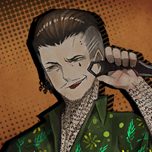

        ```
        Tingtang Boss: Hm? What’s up?
        หัวหน้าแก๊งติงตัง: หะ? มีอะไร?
        ```

        ---

                

        ```
        Bean-hating Tingtanger: Boss! Some fasole who haven’t even told where they’re from rolled into town all of a sudden!
        ติงแตงเกอร์ผู้เกลียดถั่ว: หัวหน้าครับ! มีพวกถั่วที่ไม่ได้บอกว่าพวกมันพึ่งเข้าเมืองมาครับ!
        ```

        ---

        

        ```
        Tingtang Boss: Who sent ya? The way you’re dressed tells me it ain’t Los Habaneros or the Butchers...
        หัวหน้าแก๊งติงตัง: ใครเป็นคนส่งพวกแกมา? ชุดนั่นที่พวกแกใส่กำลังบอกฉันว่ามันคงไม่ใช่ลอสฮาเบเนรอส หรือจะเป็นบุสเชอร์ก็ตามที... 
        ```
        ```
        Tingtang Boss: I’ll give you a chance to grovel fer forgiveness. Do that and I’ll let ya leave with your limbs in tow.
        หัวหน้าแก๊งติงตัง: ฉันจะให้โอกาศพวกแกหมอบคลาน และข้อร้องความเห็นใจจากฉัน ทำมันซะ แล้วฉันจะปล่อยพวกแกไปโดยที่ยังมีแขนขาเหลืออยู่
        ```

        ---

        

        ```
        Yi Sang: ...We should gladly part if you were to take off your clothing for us.
        ยี่ซัง: ...พวกเราจะรู้สึกปลื้มปลิ่มยินดีที่จะขาดเป็นชิ้น ๆ อย่างยิ่งครับ ถ้าคุณ จะกรุณาช่วยถอดเสื้อผ้าของคุณให้เราหน่อย
        ```

        ---

        

        ```
        Gregor: That makes it sound kinda weird.
        เกรกอร์: พูดแบบนั่นทำให้มันดูแปลกนะ
        ```
        ---

        

        ```
        Bean-hating Tingtanger: Boss... I think they might be the... odd pods people have been talking about... y’know, rumored to fadangle with people’s odors.
        ติงแตงเกอร์ผู้เกลียดถั่ว: ท่านหัวหน้า... บางทีแล้ว  ผมคิดว่าพวกมันอาจจะเป็น... ไอ้พวกประหลาดที่ช่วงนี้เขาลือกันก็ได้... ที่ว่ากันว่าชอบหลอกดมกลิ่นตัวของคนอื่นน่ะ... 
        ```

        ---

        

        ```
        Tingtang Boss: Greh... Disgusting bunch... Lemme tell ya, that’s no way to live...
        หัวหน้าแก๊งติงตัง: อึก... ไอพวกช่อดอกไม้น่ารังเกลียด... ให้ฉันบอกพวกแกไว้ก่อนเลย ว่าพวกแกไม่รอดแน่ 
        ```

        ---

        

        * เสียงในหัว

            ```
            Now, our assumed big boss of the gang is looking at us with genuine disgust.
            ตอนนี้ คนที่เราคาดว่าเป็นหัวหน้าใหญ่ของแก๊ง กำลังจ้องมองมาที่พวกเราด้วยสายตาที่เต็มไปด้วยความเกลียดชังอย่างแท้จริง
            ```

        ```
        Dante: <...I have not wanted to win a fight as desperately as I do now.>
        ดันเต้: <...ผมไม่เคยรู้สึกอยากที่จะชนะการวิวาทเท่าตอนนี้มาก่อนเลย>
        ```
        
    ---

    * **Episode: 10 | ตอนที่ 10<br>Location: Casino Entrance | ทางเข้าคาซิโน**

        

        ```
        Tingtang Boss: Ya... tarned little roaches...
        หัวหน้าแก๊งติงตัง:
        ```
        ```
        Tingtang Boss: Who the hell do ya work for...? ‘S about time... ya told us...
        ห้วหน้าแก๊งติงตัง: 
        ```

        ---

        

        ```
        Gregor: We...
        เกรกอร์: เรา...
        ```
        ```
        Gregor: ...are from Limbus Company.
        เกรกอร์: ...มาจากบริษัทลิมบัส 
        ```
        ```
        Gregor: Finally. One less millstone ‘round the neck.
        เกรกอร์: ในที่สุด โม่หินถ่วงคอก็หายไปอีกหนึ่ง
        ```

        ---

        

        ```
        Tingtang Boss: That...doesn’t...help at all...!
        หัวหน้าแก๊งติงตัง: นั่น...ไม่ช่วยห่าอะไรสักอย่าง...!
        ```

        ---

        

        ```
        Saude: Oh, and for reference, Effie and I work in a different department. Please don’t associate us with them.
        เซาเด: โอ้ บอกให้รู้ไว้ด้วย ว่าเอฟฟี่กับฉันทำงานในคนละแผนก เพราะงั้นโปรดอย่าเหมารวมเรากับไอพวกนี้ด้วย 
        ```

        ---

        

        ```
        Tingtang Boss: ......
        หัวหน้าแก๊งติงตัง: ......
        ```

        ---

        

        * เสียงในหัว

            ```
            The sheer frustration over our aversion to conversing sensibly must’ve played a considerable role in causing the boss to pass out.
            ความหงุดเงี่ยวอันบริสุทธิ์ที่เออล้นเหนือความเกลียดชังที่มีต่อพวกเราขณะสนทนา อาจเป็นสิ่งที่ทำให้เขาหมดสติไปในท้ายที่สุด
            ```
            ```
            My condolences to the poor fellow’s patience.
            ฉันต้องขอแสดงความเสียใจกับความอดทนของเพื่อนร่วมโลกที่น่าสงสาร
            ```

        ---

        

        ```
        Rodion: Do we seriously have to wear these, though? Stuff reeks of sweat and blood and... smells grody, too.
        โรเดียน: นี้พวกเราต้องใส่ไอพวกนี้จริงเหรอ? ชุดที่หมักหมมไปด้วยเหงื่่อ และคราบเลือด แถมยังมี... กลิ่นซกมกพวกนี้อีก
        ```

        ---

        

        * เสียงในหัว

            ```
            Rodya complained, lifting the shirt she took from a Tingtang member with two fingers like she was handling trash.
            โรดย่าบ่น พร้อมยกเสื้อที่ได้มากจากสมาชิกแก๊งติงตังคนหนึ่งด้วยสองนิ้ว ประดั่งว่าเธอกำลังจับเศษขยะ
            ```

        ---

        

        ```
        Rodion: Yuck, some hair, too... This is the first time I’m jealous of Dante’s missing eyes.
        โรเดียน: ยี่ย์อีย์ บางตัวก็มีขนอะไรติดอยู่ด้วย... นี้เป็นครั้งแรกเลยทีฉันรู้สึกอิจฉาดันเต้ที่ไม่มีตา 
        ```

        ---

        

        ```
        Dante: <I can see, by the way...>
        ดันเต้: <ถึงไม่มี แต่ผมก็มองเห็นอยู่นะครับ...>
        ```

        ---

        

        ```
        Effie: This looks... pretty dandy, actually? I guess their business was more successful than I thought.
        เอฟฟี่: นี้ดู... หรูใช่ได้ใช่ไหมล่ะ? ฉันเดาว่าธุรกิจของพวกเขาคงประสบความสำเร็จมากกว่าที่ฉันคาดไว้ซะอีก
        ```

        ---

        

        ```
        Ryoshu: I want that. Bagsy.
        เรียวชู: ฉันอยากได้อันนั่น จองนะ
        ```

        ---

        

        ```
        Effie: I-I can’t, it’s been tailor-made.
        เอฟฟี่: ฉ-ฉันให้ไม่ได้ มันสั่งตัดพิเศษสำหรับฉันเท่านั่น
        ```

        ---

        

        ```
        Dante: <...The label here says it’s good for all girths.>
        ดันเต้: <...มีตัวอักษรเขียนไว้ว่า รับรองทุกขนาดเส้นรอบวงเหรอ>
        ```

        * เสียงในหัว

            ```
            Noticing that my gaze was fixed on the label of his clothing, Effie barked.
            เมื่อรู้ตัวว่าสายตาของผมกำลังจ้องมองไปที่ข้อความที่ถูกเขียนอยู่บนเสื้อผ้าของเขา ทันใดนั่นเอง เอฟฟี่เห่า(?)
            ```

        ---

        

        ```
        Effie: Grr... W-We wouldn’t be doing any of this if you hadn’t caused that ruckus in the pawnshop.
        เอฟฟี่: กรอด... ร-เราคงไม่ต้องทำแบบนี้หรอก ถ้าไม่ใช่เพราะแกที่ก่อความวุ่นวายในโรงจำนำนั่น
        ```

        ---

        

        ```
        Ishmael: To be honest, I’m a little nervous. It’s been a while since I’ve worked in disguise.
        อิชมาเอล: พูดตรง ๆ เลยนะ ว่าฉันรู้สึกประหม่าเล็กน้อย นี้มันก็สักพักแล้วที่ฉันไม่ได้ทำภารกิจที่ต้องปลอมตัว
        ```

        ---

        

        ```
        Ryoshu: I don’t feel like it. This is the coward’s way.
        เรียวชู: ส่วนฉันไม่มีอารมณ์จะทำเลยสักนิด นี้มันวิถีของพวกขี้หลาด 
        ```

        ---

        

        ```
        Saude: Sorry, but can someone please keep her mouth shut?
        เซาเด: ประทานโทษนะคะ แต่ใครบางคนช่วยหุบปากสักทีจะได้ไหม? 
        ```

        ---

        

        ```
        Gregor: ...You’re free to try as long as you’re good with your ribs being cut apart.
        เกรกอร์: ...เธออยากจะทำอะไรก็ทำเถอะ ถ้าเธอโอเคกับการที่กระดูกซี่โครงอาจแตกเป็นเสี่ยง ๆ ได้ทุกเมื่อล่ะก็นะ
        ```

        ---

        

        * เสียงในหัว

            ```
            Gregor’s softly spoken riposte got the Sinners to crack up.
            คำพูดสวนกลับอันนุ่มนวลของเกรกอร์ทำเอาเหล่าคนบาปพากันหัวเราะก๊าก
            ```
            ```
            For a moment, Effie and Saude seemed to wonder how they should take it...
            ขณะนั่นเอง เอฟฟี่ และเซาเดดูสับสนว่าตนเองควรมีปฎิกิริยาตอบกลับอย่างไร...
            ```
            ```
            Before deciding that it’s not worth mulling over and moving on. Effie then lifted a small container that appeared to be inlaid with nacre.
            ก่อนตัดสินใจได้ว่า มันไม่คุ่มค่าที่จะมานั่งคิดเรื่องไม่เป็นเรื่องไร้สาระ และเดินหน้าต่อไป ก่อนที่ เอฟฟี่ยกคอนเทนเนอร์ขนาดเล็กที่เลี่ยมไปด้วยหอยมุก 
            ```

        ---

        

        ```
        Effie: ...This is a wish canister we seized from the Tingtang Gang’s boss.
        เอฟฟี่: ...นี้คือกระป๋องเก็บปฎิธานที่เรายึดมาจากหัวหน้าแก๊งติงตัง
        ```
        ```
        Effie: Manager, here’s a simple role you can play.
        เอฟฟี่: คุณผู้จัดการ นี้เป็นบทบาทกล้วย ๆ ที่คุณน่าจะเล่นได้
        ```

        ---

        

        ```
        Dante: <What are you...?>
        ดันเต้: <ทำอะไรน่ะ...?>
        ```

        ---

        

        ```
        Saude: I guess we owe you an explanation, judging from your clueless motions.
        เซาเด: ฉันเดาว่าเรายังติดคำอธิบายกับคุณไว้อยู่สินะคะ จากท่าทางการเคลื่อนไหวของคุณ ที่ดูจะไม่ทราบอะไรเลย
        ```

        ---

        

        ```
        Effie: The long and short of it is that this thing contains J Corp’s other Singularity. This is a tool that sucks up ‘wishes’ from people and stores them in some form of energy.
        เอฟฟี่: สรุปสั้น ๆ ก็คือ ไอเจ้าสิ่งบรรจุอีกหนึ่งซิงกูราลิตี้ ขององค์กรเจอยู่ภายในตัวมัน มันเป็นเครื่องมือทีดูดสิ่งที่เรียกว่า ‘ปธิธาน’ จากผู้คน และกักเก็บเอาไว้ในรูปแบบของพลังงาน
        ```

        ---

        

        ```
        Saude: When the time is right, squeeze that wishpower onto a sheet of paper, and voilà! You get a one-use stick-on tattoo that boosts your luck to high heavens.
        เซาเด: เมื่อถึงเวลาที่ถูกต้อง ให้บีบแรงปราธนาพวกนั่นออกมาลงบนแผ่นกระดาษ แล้วจากนั่นก็วัวลา! (เรียบร้อย!) คุณได้รับรอยสักติดตัวสำหรับใช้ครั้งเดียวที่เพิ่มโชคของคุณสูงจนถึงสวรรค์
        ```

        ---

        

        ```
        Effie: Seems the plan was to try to win the game on the top floor by scraping up others’ luck... Imagine, the boss of some lowly gang was carrying one of these.
        เอฟฟี่: และแผนการก็คือการพยายามจะชนะเกมบนชั้นบนสุด ด้วยการใช้โชคที่ถูกริป (rip) มาของคนอื่น... แต่ลองนึกดูซิ ถ้าเกิดมีบอสของแก๊งอื่นที่มีไอนี้อยู่เหมือนกันจะเป็นไง
        ```
        ```
        Effie: Manager... Dante, right? I want you to hold on to this when we enter the casino.
        เอฟฟี่: ผู้จัดการ... ดันเต้ ใช่ไหมครับ? ผมอยากให้คุณถือเจ้านี้ไว้ตอนที่เราเข้าไปในคาซิโน
        ```

        ---

        

        ```
        Dante: <Am I really allowed to carry such a big responsibility?>
        ดันเต้: <นี้ผมถูกไว้วางใจขนาดให้แบกรับความรับผิดชอบที่ใหญ่ขนาดนั่นเลยเหรอครับ?>
        ```

        ---

        

        ```
        Effie: You don’t look like you’re oozing confidence. We do have reasons for assigning you to this task.
        เอฟฟี่: คุณดูไม่ค่อยมีความมั่นใจเลยนะครับ แต่ไม่ต้องเป็นห่วงไป พวกเรามีเหตุผลที่มอบหมายหน้าที่นี้ให้กับคุณ
        ```
        ```
        Effie: First off, a poker face is going to be vital when you’re gambling.
        เอฟฟี่: อย่างแรก โปกเกอร์เฟซ (poker face) เป็นสิ่งที่จำเป็นอย่างมากเมื่อคุณกำลังพนันอยู่ 
        ```
        ```
        Effie: No matter how good they are at reading expressions, they won’t be able to tell what emotions to read from a clock.
        เอฟฟี่: ถึงพวกมันจะอ่านสีหน้าท่าทางได้ดีแค่ไหน แต่พวกมันไม่มีทางที่จะอ่านความรู้สึกของนาฬิกาได้หรอก 
        ```

        ---

        

        ```
        Dante: <......>
        ดันเต้: <......>
        ```

        ---

        

        ```
        Effie: Second, I trust that they’ve appointed you as manager for a reason.
        เอฟฟี่: อีกอย่างก็คือ ผมเชื่อใจว่าพวกเขาต้องมีเหตุผลที่แต่งตั้งให้คุณเป็นผู้จัดการ
        ```
        ```
        Effie: Call it a hunch, but something tells me you’ll be more useful than those Sinners you’re leading.
        เอฟฟี่: อาจจะเป็นแค่ลางสังหรณ์ก็ได้ แต่ว่า มันมียางอย่างกำลังบอกผมว่าคุณจะเป็นประโยชน์มากกว่าพวกคนบาปที่คุณนำอยู่
        ```

        ---

        

        * เสียงในหัว

            ```
            Come to think of it, he had a point.
            พอมาคิด ๆ ดูแล้ว ที่เขาพูดก็มีเหตุผล
            ``` 
            ```
            I was given the title of manager, but never had a chance to be the charismatic leader I’d envisioned; instead of showing respect, my Sinners would constantly berate and threaten me.
            ผมได้รับตำแหน่งผู้จัดการ แต่ยังไม่เคยแม้แต่จะมีโอกาศได้เป็นผู้นำ ที่เปี่ยมไปด้วยบารมีอย่างที่เคยจินตนาการไว้เลยสักครั้ง; แทนที่การแสดงความเครพ เหล่าคนบาปต่างพากันด่าทอ และข่มขูผมอยู่เสมอ
            ```
            ```
            The only real role I could afford to play was bringing them back to life.
            หน้าที่เดียวที่ผมสามารถทำได้ก็มีเพียง การนำพวกเขากลับมาจากความตาย เท่านั่น
            ```
            ```
            While the Sinners were engaged in fierce battle, all I would do is cower behind them, anxiously praying that their heads and hearts were unscathed.
            ในขณะที่เหล่าคนบาปกำลังต่อสู้ในสนามรบที่เต็มไปด้วยความโหดร้าย สิ่งเดียวที่ผมทำได้ก็มีแต่หลบหลังพวกเขา สวดภาวนาอย่างกระวนกระวายใจว่าศรีษะ และหัวใจของพวกเขาจะปราศจากอันตราย
            ```
            ```
            With a heavy heart, I nodded to let him know I was ready.
            ด้วยหัวใจที่หนักอึ้ง ผมพงกหัวเพื่อบอกเขาว่าผมพร้อมที่จะทำมัน
            ```

        ---

        

        ```
        Effie: Alright. Put this on your arm. You’ll become the luckiest person in the City for a short while.
        เอฟฟี่: เอาล่ะ เพียงคุณกอดสิ่งนี้ไว้ในอ้อมแขน คุณก็จะกลายเป็นชายที่โชคดีที่สุดในเดอะซิตี้ในช่วงเวลาสั้น ๆ 
        ```

        ---

        

        ```
        Saude: Now then, you’ll act as Tingtangers, and we’ll be croupiers. Break a leg, everyone.
        เซาเด: ถ้างั้น คุณจะต้องแสดงเป็นพวกแก๊งติงตัง และพวกที่เหลือจะเป็นเจ้ามือ เข้าใจนะ? ถ้าเข้าใจแล้ว ก็แยกย้าย และขอให้ทุกคนโชคดี
        ```

        ---

        
        
        * เสียงในหัว

            ```
            Vowing that we’ll see this operation to success no matter what...
            ขอสาบานว่า ไม่ว่ายังไง เราก็จะทำปฎิบัติการนี้ให้สำเร็จลุล่วง...
            ```
            ```
            We opened the door to the casino.
            จากนั่นพวกเราก็เปิดประตูสู่คาซิโน
            ```

    ---

    * **Episode: 11 | ตอนที่ 11<br>Location: Casino 1F | คาซิโน ชั้นที่ 1**

        

        * เสียงในหัว

            ```
            The casino could be best described as “busy”.
            คำที่อธิบายคาซิโนนี้ได้ดีที่สุดก็คงเป็น "ยุ่งวุ่นวาย"
            ```
            ```
            Excessively cheery sounds blared from slot machines.
            ทั้งเครื่องสล็อตที่ส่งเสียงรื่นเริงสนุกสนานจนเกินเบอร์
            ```
            ```
            The lights were so bright that some of our Sinners had to cover their eyes.
            กับแสงไฟที่สว่างจ้าซะจน คนบาปบางคนต้องเอามือป้องตาเพื่อหลบหนี
            ```
            ```
            And the security guards took note of our garish outfits to give us a customary nod.
            แถมยังจะมีการ์ดรักษาความปลอดภัย ที่พอเห็นชุดเสื้อผ้าของเราที่ฉูดฉาด ก็พากันพยักหน้าตอบรับเป็นมารยาท
            ```
            ```
            Saude and Effie, dressed as croupiers, discreetly nodded at us as they accompanied Rodya to the casino’s cage.
            เซาเดกับเอฟฟี่แต่งตัวเป็นเจ้ามือ พยักหน้าอย่างสุขุมมาทางพวกเราขณะที่พวกเขาพาโรดย่าไปยังกรงของคาซิโน
            ```
            ```
            I was amazed by their ability to feign expertise; from the way they carried themselves to the facial expressions they made, few would doubt that they’re long-time employees.
            ผมรู้สึกตื่นตาตื่นใจกับความสามารถในการแสแสร้งเป็นผู้เชี่ยวชาญของพวกเขา; จากการทีพวกเขาประคองสีหน้าได้อย่างหน้าตาเฉยจนบางคนถึงกับสงสัยว่าบางทีแล้วพวกเขาอาจเป็นพนักงานที่ทำงานมานานแล้วเป็นได้
            ```

        ---

        

        ```
        Don Quixote: Wha... What manner of sorcery are these dazzling contraptions?
        ดอน กิโฆ้เต้: อะไร... กันละเนี้ย เจ้าเครื่องจักรที่น่าตื่นตาพวกนี้เป็นเวทย์มนต์แบบใดกัน?
        ```

        ---

        

        ```
        Gregor: Try not to go saucer-eyed at everything like a fascinated kid, Don Quixote. You’ll seem fishy...
        เกรกอร์: ช่วยพยายามอย่าทำตาโตใส่ทุกอย่างที่อยู่ทีนี้เหมือนเด็กน้อยที่กำลังตราตรึงกับทุกสิ่งที่อยู่ตรงหน้าหน่อยสิ ดอนกิโฆ้เต้ มันดูน่าสงสัย
        ```

        ---

        

        ```
        Ishmael: The guests here look dead inside with their dim eyes, and they smell worse than the Tingtang schmucks we faced. Do they even wash...
        อิชมาเอล: พวกแขกที่อยู่ที่นี้ ดวงตาที่ริบหรี่พวกนั่นอย่างกับตายไปแล้วเลย อีกอย่าง กลิ่นเหม็นพวกนี้มันแย่ซะยิ่งกว่าไอพวกกุ๋ยติงตังพวกนั่นที่เราเจออีก นี้พวกมันได้อาบน้ำบ้างไหมเนี้ย...
        ```

        ---

        

        ```
        Gregor: I don’t think they’d be too happy about you holding your nose right before their faces, Ishmael...
        เกรกอร์: ฉันไม่คิดว่าพวกเขาจะชอบใจที่เธอปิดจมูกต่อหน้าพวกเขานะ อิชมาเอล...
        ```

        ---

        
        
        ```
        Ishmael: But, this is the kind of bilgy stench I’d only ever caught from deckhands...
        อิชมาเอล: แต่จะทำไงได้ล่ะ ก็นี้มันเหม็นอย่างกับกลิ่นสาปทะเล ตอนที่ฉันยังทำงานอยู่บนดาดฟ้าเรือนั่น...
        ```

        ---

        

        * เสียงในหัว

            ```
            Fortunately, most of them were too focused on the machines to care about what we were doing.
            โชคยังดี ที่พวกมันส่วนมากง่วนอยู่กับเครื่องเล่นมากกว่าที่จะสนใจสิ่งที่เราทำ
            ```

        ---

        

        ```
        Don Quixote: Manager Esquire! Hath you seen such a thing?
        ดอน กิโฆ้เต้: ท่านอัศวินผู้จัดการขอรับ! ท่านเคยเห็นอะไรแบบนี้หรือเปล่าขอรับ?
        ```
        ```
        Don Quixote: What must I do to hear the jolly bells as the other patrons are?
        ดอน กิโฆ้เต้: ข้าน้อยต้องทำยังไงถึงจะได้ยินเสียงระฆังอันหฤหหรษ์เช่นเดียวกับลูกค้าคนอื่น ๆ หรือขอรับ?
        ```

        ---

        

        ```
        Dante: <I don’t think I’ve been to one of these places before, so I wouldn’t know...>
        ดันเต้: <ผมไม่คิดว่าผมเคยมาที่นี้มาก่อน เพราะงั้นผมเลยไม่รู้เหมือนกัน แต่...>
        ```

        * เสียงในหัว

            ```
            Looking at all the flashy symbols and numbers spinning had slowly eroded my resolve to act the part of a stern manager.
            พอมองดูสัญลักษณ์อันฉูดฉาดแวบไป แวบมา และตัวเลขที่หมุนไกวไปเรื่อย ๆ รู้ตัวอีกทีผมก็หมดความอบทนที่จะทำหน้าที่ในฐานะของผู้จัดการจอมเข้มงวดไปซะแล้ว
            ```

        ```
        Dante: <I, I guess a little peek is fine?>
        ดันเต้: <ผม เห้อ *.ถอนหายใจ* ฉันว่าลองเล่นสักนิดสักหน่อยก็ไม่เสียหายนะ?>
        ```

        ---

        

        ```
        Don Quixote: It says here to press the button! Is pressing it what one ought to do?
        ดอน กิโฆ้เต้: มันบอกตรงนี้ให้กดปุ่มด้วยล่ะขอรับ! งั้นบางทีสิ่งที่เราต้องทำอาจจะเป็นการกดปุ่มนะขอรับ!
        ```

        ---

        

        * เสียงในหัว

            ```
            The hand I’d swiftly outstretched to stop Don Quixote from touching the machine unexpectedly fumbled and landed smack on the button—
            มือนั่นที่เอื้อมไปอย่างรวดเร็วเพื่อหยุดยั้งดอนกิโฆ้เต้ไม่ให้จับต้องเครื่อง จู่ ๆ ก็ไถลลื่น และตบลงบนปุ่มอย่างแรงโดยไม่คาดคิด—
            ```
        
        ```
        Dante: <Yikes!>
        ดันเต้: <ฉิบแล้วไง!>
        ```

        * เสียงในหัว

            ```
            —and in an unpredictable series of coincidences, someone had left a token in it, enough for one game.
            —และจากชุดความบังเอิญที่มิอาจคาดเดา กลับมีใครบางคนดันลืมตั๋วตัวเองอยู่ภายในนั่น เพียงพอสำหรับเล่นเกมหนึ่งพอดี
            ```
            ```
            Reels started spinning under fanfare...
            แล้ววงล้อยก็เริ่มหมุนท่ามกลางเสียงประโคมอันครึกครื้น...
            ```
            ```
            We could only watch as the chain of events unfolded.
            พวกเราทำได้แต่มองดูลูกโซ่ของเหตุการที่ไม่คาดฝันค่อย ๆ คลายออก
            ```

        ---

        

        ```
        Saude: By the way, I hope Dante handles the wish stickers we took from the Tingtang Gang with care.
        เซาเด: ยังไงก็เถอะ ดิฉันหวังว่าคุณดันเต้จะดูแลสติ๊กเกอร์ที่เราเอามาจากแก๊งติงตังด้วยความใส่ใจนะคะ
        ```

        ---

        

        ```
        Effie: That manager? It was the only favor we asked of them, they’d better be doing a good job.
        เอฟฟี่: ผู้จัดการคนนั่นน่ะเหรอ? มันก็เป็นเพียงคำขอเดียวที่เราขอเขา เขาก็ควรทำมันให้ดีล่ะนะ
        ```

        ---

        

        ```
        Rodion: You can count on Dante, dear duo~ They’re one of the few sensible pals who gets what’s up.
        โรเดียน: วางใจเถอะ พวกคุณหวังพึ่งดันเต้ได้แน่ คุณคู่หูสุดที่เลิฟทั้งสอง~ เขาเป็นหนึ่งในเพื่อนไม่กี่คนที่มีไหวพริบ ฉลาด และรอบคอบ เป็นคนที่เข้าใจว่าต้องทำยังไง 
        ```

        ---

        

        ```
        Saude: That’s good to hear. With so many sheets attached, they should be able to win any game with ease.
        เซาเด: ดีแล้วค่ะที่ได้ยินแบบนั่น ด้วยม้วนกระดาษที่แปะซ้อนหลายแผ่น เพียงเท่านั่น ก็สามารถทำให้เขาชนะเกมแห่งดวงชะตาทุกเกมได้อย่างง่ายดาย
        ```
        ```
        Saude: We just need to be careful not to draw attention here.
        เซาเด: ทีนี้ เราแค่ต้องระวังตัว ไม่ให้เป็นจุดสนใจก็พอแล้ว
        ```

        ---

        

        * เสียงในหัว

            ```
            JAAACKPOT!
            เจ็คคคพ็อต!
            ```
            ```
            The players next to us stared with jaws dropped so far that their chins could touch the floor...
            เหล่าผู้เล่นถัดจากพวกเราต่างจ้องมองตื่นตกใจ อ้าปากค้าง กระทั้งกรามของพวกเขาตกลงจนคางแตะพื้น... *.เล่นคำ*
            ```
            ```
            Waves of casino chips plunged from the machine, so many that I wouldn’t dare try to gather them up.
            คลื่นชิปละลอกใหญ่พรวดพราดออกมาจากเครื่องเล่น จนกองเรี้ยราดอยู่บนพื้นเป็นจำนวนมาก มันเยอะซะจนผมไม่กล้าที่หยิบพวกมันเลยด้วยซ้ำ 
            ```
            ```
            I’m so sorry, Effie, Saude.
            ผมขอโทษนะ เอฟฟี่ เซาเด
            ```
            ```
            I came here determined to do something right, and it fell apart all so soon.
            ทั้ง ๆ ที่ผมตัดสินใจแล้วแท้ ๆ ว่าจะมาที่นี้เพื่อทำในสิ่งที่ถูกต้อง แต่สุดท้ายทุกอย่างก็พังทลายก่อนที่มันจะเริ่มซะอีก
            ```

        ---

        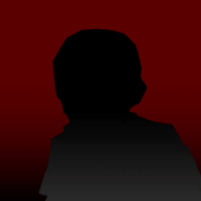

        ```
        One Casinogoer: A jackpot? What machine is it?
        ผู้ชมคาซิโนคนหนึ่ง: เจ็คพ็อต? จากเครื่องเล่นไหนกัน?
        ```

        ---

        

        ```
        Another Casinogoer: Just like that, no warning? Right now?
        ผู้ชมคาซิโนอีกคน: แบบนั่นอีกแล้ว ไม่เตือนอะไรเลย? เนียนะ? 
        ```

        ---

        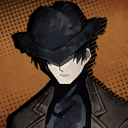

        ```
        Rigid Security: A moment, please...
        การ์ดรักษาความปลอดภัยผู้เข้มงวด: กรุณารอสักครู่นะครับ...
        ```
        ```
        Rigid Security: Let me just check your ID.
        การ์ดรักษาความปลอดภัยผู้เข้มงวด: ขอผมเช็คบัตรประจำตัวของคุณหน่อย
        ```

        ---

        

        ```
        Heathcliff: What’s with the aggro? Is it a crime to win big at a casino?
        ฮิธคลิฟฟ์: ไอท่าทีก้าวร้าวชวนทะเลาะแบบนั่นคืออะไรกันหะ? ทำอย่างกับว่ามันเป็นอาชญากรรมที่จะตกรางวัลได้ในคาซิโนงั้นแหละ?
        ```

        ---

        

        ```
        Faust: Chance in this place doesn’t work the way we think it usually does. You could accumulate your luck for a big payout or trickle in small amounts to break even, but winning the jackpot on your first try should be a literal impossibility here.
        เฟาสท์: โอกาศ ความน่าจะเป็น ของที่นี้ไม่ได้ทำงานในรูปแบบเดียวกันตามสามัญสำนึกที่เราคาดคิดตามปกติ ณ ที่นี้ นายอาจรวบรวมโชคของนายเพื่อรางวัลใหญ่ในคราวเดียว หรือค่อย ๆ สะสมมูลค่ารางวัลเล็ก ๆ ทีละเล็กทีละน้อย ให้เทียบเท่ากับรางวัลใหญ่ก็ถือเป็นเรื่องที่เป็นไปได้ แต่การที่ชนะรางวัลเจ็คพ็อตด้วยการเล่นครั้งเดียวในทฤษฎีแล้ว ถือเป็นเรื่องที่เป็นไปไม่ได้โดยเด็ดขาด
        ```

        ---

        

        ```
        Don Quixote: Chips are raining down like shooting stars!
        ดอน กิโฆ้เต้: ชิปกำลังตกลงมาราวกับดาวตกเลยขอรับ!
        ```

        ---

        

        ```
        Ishamel: I’d hoped you of all people would have a sense of responsibility... Yet all it took was Don Quixote’s siren plea for you to give in.
        อิชมาเอล: ฉันก็อุตสาห์หวังว่าคนอย่างนายจะเป็นคนที่มีความรับผิดชอบอยู่บ้าง... แต่สุดท้ายนายก็ยอมมัน เพียงเพราะยัยดองกิโฆ้เต้บ้านั่นมันเป่าหู อ้อนวอนนาย ด้วยเสียงไซเรนจากวรรณคดี นิยาย หรืออะไรก็ชั่งที่มันชอบนักชอบหนางั้นใช่ไหม
        ```
        ```
        Ishmael: I’m disappointed. You’re none other than our manager, and I expected you to show your capability and clear the disgrace of failure from us.
        อิชมาเอล: ฉันล่ะโคตรผิดหวังในตัวนายเลย ทั้ง ๆ ที่นายไม่ใช่ใครอื่นแต่เป็นผู้จัดการของพวกเรา ฉันก็เลยคาดหวังให้นายแสดงความสามารถที่มี และความผิดหวังที่ชัดเจนต่อความล้มเลวของพวกเราที่ทำไว้
        ```

        ---

        

        * เสียงในหัว

            ```
            Ishmael’s barrage of scathing whispers was something to marvel at, as Gregor muttered in awe.
            ห่าเสียงกระซิบของอิชมาเอลที่สอดไส้ไปด้วยความเกลียดชังเป็นสิ่งที่น่าประหลาดใจ ในขณะที่เกรกอร์กำลังพึมพำด้วยความตกใจ
            ```
            ```
            On top of that, her piercing gaze I had never felt before...
            ยิ่งกว่านั่น ก็คงเป็น สายตาทิ่มแทงของเธอที่ผมไม่เคยได้สัมผัสมาก่อน...
            ```
            ```
            ...It made me want to weasel away under a rock, if there were one.
            ...มันเท่าเอาผมอยากที่จะมุดดินหนีไปให้จบ ๆ ถ้าทำได้
            ```
            ```
            For once, I thanked my clock for lacking eyes to meet her glare.
            และเป็นครั้งแรกเลยที่ผมรู้สึกขอบคุณเจ้าศรีษะนาฬิกานี้ที่ไม่มีตาให้ต้องประทะสายตากับเธอ
            ```

        ---

        

        ```
        Gregor: ...Now hold on, that might not be our only problem...
        เกรกอร์: ...เฮ้ เดียวก่อนสิทุกคน ฉันว่านี้คงไม่ใช่แค่ปัญหาเดียวที่พวกเรามีตอนนี้แล้วล่ะ...
        ```

        ---

        

        * เสียงในหัว

            ```
            Gregor was fretfully looking in every direction, until he stopped to point at the shocking discovery he’d just made.
            เกรกอร์มอบไปรอบ ๆ ด้วยท่าทีที่รุกลี้ลุกรน จนกระทั่งเขาหยุด และชี้ไปที่สิ่งที่เขาพึ่งค้นพบ 
            ```
            ```
            And where he pointed—
            และที่ ๆ เขาชี้ไป—
            ```

        ---

        

        ```
        Gregor: How long have you been off your disguise, Ryōshū?
        เกรกอร์: นี้เธอถอดถอดปลอมตัวชุดตั้งแต่ตอนไหนฟะเนี้ย เรียวชู?
        ```

        ---

        

        * เสียงในหัว

            ```
            —was a sullen Ryōshū, wearing the same clothes she’s always worn.
            —ก็คือเรียวชูที่กำลังทำหน้าบูดบิ้ง ที่กำลังใส่ชุดเดิมที่เธอใส่มาโดยตลอด
            ```

        ---

        

        ```
        Ryoshu: I don’t put on others’ discarded clothing.
        เรียวชู: ฉันไม่ใส่ชุดทิ้งขว้างของคนอื่นเด็ดขาด
        ```

        ---

        

        ```
        Gregor: Gah... Manager Bud, today isn’t our day, huh...
        เกรกอร์: เวร... สหายผู้จัดการ เดาว่าวันนนี้คงไม่ใช่วันของเรางั้นสินะ...
        ```

        ---

        

        ```
        Dante: <Yup... Looks like we’re screwed. Royally...>
        ดันเต้: <ถูกเป๋ง... ดูเหมือนว่าเราจะซวยเต็มพิกัดระดับราชวงค์เลยสินะ...>
        ```

        ---

        

        ```
        Effie: This can’t be... All the work we did to put this plan in motion...
        เอฟฟี่: เป็นไปไม่ได้... สิ่งที่เราทำมาทั้งหมดเพื่อทำให้แผนนี้เป็นจริง...
        ```
        ```
        Effie: Faust, what were you thinking volunteering to bring these fools along for your missions? You’re supposed to have near-unparalleled brilliance, right? Then use it!
        เอฟฟี่: เฟาสท์ นี้เธอคิดอะไรอยู่ถึงได้อาสาที่จะเอาพวกวิปลาสพวกนี้มาทำภารกิจด้วยกันกับเธอด้วย? ไม่ใช่ว่าเธอควรที่จะมีปัญญาไร้ที่สิ้นสุดที่ไม่มีใครเทียบเคียงได้ไม่ใช่หรือไง? ถ้างั้นก็ใช้มันซะสิ! 
        ```

        ---

        

        ```
        Faust: Even though I haven’t worked with them for long, I was able to realize something:
        เฟาสท์: ถึงแม้ว่าฉันจะไม่ได้ทำงานกับพวกเขาเป็นระยะเวลานาน แต่ตัวฉันก็ตระหนักได้ถึงบางสิ่ง: 
        ```
        ```
        Faust: I ought to become a Faust that believes in uncertainty.
        เฟาสท์: ว่าฉันต้องกลายเป็นเฟาสท์ผู้เชื่อในความไม่แน่นอน
        ```
        ```
        Faust: When the lack of a plan becomes the plan, all variables become constants.
        เฟาสท์: เมื่อแผนการที่ไร้รูปร่าง ไร้ตัวตนกลายเป็นแผนการขึ้นมาจริง ๆ ตัวแปรต่าง ๆ ที่แปรผันก็จะแปรสภาพจากความไม่แน่นอนไม่เสถียรเป็นคงทีพร้อมใช้งาน
        ```
        ```
        Faust: That is what my ‘plan’ entails.
        เฟาสท์: นั่นแหละคือสิ่งที่เรียกว่า ‘แผนการ’ ของฉัน
        ```

        ---

        

        ```
        Effie: ......
        เอฟฟี่: ......
        ```

        ---

        

        ```
        Ishmael: ...Sigh.
        อิชมาเอล: ...เห้อ *.ถอนหายใจ*
        ```

        ---

        

        * เสียงในหัว

            ```
            Faust turned to me with a tranquil face.
            เฟาสท์หันมาฉันด้วยใบหน้าที่นิ่งเฉย
            ```
            ```
            Thanks to her, my role right now became clear.
            ต้องขอบคุณเธอ ที่ในตอนนี้หน้าที่ของผมมันกระจ่างชัดแล้ว
            ```

        ```
        Dante: <Alright... It’s time for our usual gig...>
        ดันเต้: <เอาหละทุกคน... เอาไงเอากัน *.พูดกับตัวเอง* ได้เวลากลับมาเป็นคนเดิมแล้ว...>
        ```
        ```
        Dante: <Let’s kill and be killed.>
        ดันเต้: <มาฆ่า และถูกฆ่ากันดีกว่า>
        ```

    ---

    * **Episode: 12 | ตอนที่ 12<br>Location: Casino 1F | คาซิโน ชั้นที่ 1**

        

        ```
        Ryoshu: I can’t stand watching this charade.
        เรียวชู: ฉันทนไม่ไหวแล้ว ที่ต้องมาทนดูการแสดงกระหลั่วพวกนี้
        ```
        ```
        Ryoshu: How much time are you going to waste fighting those small fries?
        เรียวชู: นี้ฉันต้องอีกกี่ครั้ง ว่าเธอจะมามัวเสียเวลาสู้กับพวกเฟรนซ์ฟรายขี้ก้างพวกนี้อีกนานแค่ไหน?
        ```

        ---

        

        ```
        Ishmael: It’s often the case that grumbling people don’t have a clear solution to contribute.
        อิชมาเอล: มันก็มีถมเถไปนี้ที่พวกคนที่ชอบบ่นนู่นบ่นนี้ และเอาแต่เลือกทางแห่งความรุนแรงที่เต็มไปด้วยการนองเลือด มักจะ... ไม่มีวิธีดี ๆ ที่จะมีส่วนร่วม
        ```

        ---

        

        * เสียงในหัว

            ```
            Listening to Ishmael’s disapproval, Ryōshū shook her head and assumed a confident look.
            หลังฟังความไม่พอใจจากอิชมาเอล เรียวชูส่ายหัว ก่อนที่จะทำท่าทำทางที่ดูมั่นใจ และพูดว่า...
            ```

        ---

        

        ```
        Ryoshu: ...This is art.
        เรียวชู: ...นี้คือศิลปะ
        ```
        ```
        Ryoshu: Poetaster, gimme the knife.
        เรียวชู: เจ้านักกวี ส่งมีดให้ฉันหน่อยสิ
        ```

        ---

        

        ```
        Yi Sang: You may forever take it from my hands.
        ยี่ซัง: คุณอาจจะสามารถเอามันไปจากมือผมได้เสมอ
        ```
        ```
        Yi Sang: The blade will be better off parting ways to wander about the air for however long.
        ยี่ซัง: แต่คมดาบที่ถูกมอบให้ อีกไม่นานคงต้องลาจาก และบินไสว พุ่งทะลวงอากาศธาตุทั้งหลายไปอีกนานสองนาน
        ```

        ---

        

        ```
        Ryoshu: Thank.
        เรียวชู: ขอบใจ
        ```

        ---

        

        * เสียงในหัว

            ```
            Ryōshū held his dagger and threw it straight into the air.
            เรียวชูถือมืดสั้นอยู่ในมือ ก่อนที่จะปามันไปในอากาศ
            ```
            ```
            It struck an anchorage on the ceiling that kept the chandelier still, causing it to sway precariously.
            พุ่งตัวไปจนกระทั่งทิ้งตัวติดกับพนังฝาที่ทำหน้าที่ตรึงให้แชนเดอเลียร์เอาไว้ อันเป็นสาเหตุที่ทำให้มันแกว่งไปแกว่งมาอย่างโครงแครง 
            ```
            ```
            Indeed... Ryōshū may be weakened from what she once was because she became a Sinner, but nevertheless...
            ใช่เลย... เรียวชูอาจดูอ่อนแอจากแต่ก่อนที่เธอเคยเป็น เพราะตอนนี้ที่เธอกลายมาเป็นคนบาป แต่ถึงอย่างนั่น...
            ```
            ```
            She was still the best swordswoman we had, able to cut through steel like a proverbial hot knife.
            เธอก็ยังเป็นนักดาบที่เก่งที่สุดที่เรามี ผู้ซึ่งสามารถตัดผ่าโลหะเหมือนดั่งมืดร้อน
            ```
            ```
            Sure, she treats my words with less respect than she would a wad of gum, but that wasn’t a problem.
            มั่นใจเลยว่า เธอตอบรับคำพูดของฉันด้วยความเครพน้อยกว่าแผงหมากฝรั่งที่เธอเคี้ยวซะอีก แต่ว่านั่นไม่ใช่ปัญหา
            ```
            ```
            Everyone’s eyes turned to the swinging chandelier...
            สายตาของทุก ๆ คนสาดส่องไปยังแชนเดอเลียร์ที่กำลังแกว่งไปแกว่งมา...
            ```
            ```
            And eventually, flustered by all the gazes falling upon it...
            และทันใดนั่นเอง ทุกสายตาที่สาดส่องก็สับสนกับการร่วงหล่นของมัน...
            ```

        ---

        

        ```
        Yi Sang: Thus, in a haze, it succumbs.
        ยี่ซัง: ด้วยเหตุนี้ มันจึงยอมจำนนลงท่ามกลางความพร่ำเลือน
        ```

        ---

        

        ```
        Rigid Security: Huh?
        การ์ดรักษาความปลอดภัยผู้เข้มงวด: หะ?
        ```

        ---

        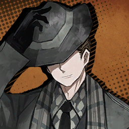

        ```
        Security Chief: W-Watch out!
        หัวหน้ารักษาความปลอดภัย: ร-ระวัง!
        ```

        ---

        

        * เสียงในหัว

            ```
            WHAAAM!
            โครม!
            ```

        ---
    
        **Location: Topsy-turvy Casino 1F | คาซิโนสุดปั่นป่วน ชั้นที่ 1**

        ---

        

        * เสียงในหัว

            ```
            The chandelier crashed to the floor in full force, making a tremendous noise.
            แชนเดอเลียร์ล่วงหล่นมาที่พื้นอย่างเต็มแรง ก่อนที่จะส่งเสียงดังกึกก้องไปทั่วบริเวณ
            ```
            ```
            ......
            ```
            ```
            And... that’s just all it did.
            และนั่น... คือทั้งหมดที่มันเกิดขึ้น
            ```
            ```
            Nothing else happened.
            ไม่มีอะไรเกิดขึ้นหลังจากนั่นอีก
            ```
            ```
            Both parties were left staring at the fallen light fixture in the middle of the floor.
            ทั้งสองฝ่ายต่างพากันยืนจ้องมองดวงไฟติดเพดานที่ตกลงมาใจกลางพื้น
            ```

        ```
        Dante: <So, uh, what was that for? Ryōshū?>
        ดันเต้: <เออ... นั่น เธอทำไปทำไมน่ะ? เรียวชู>
        ```

        ---

        

        ```
        Ryoshu: ...A performance.
        เรียวชู: ...เพื่อการแสดง
        ```

        ---

        

        ```
        Gregor: You just made that up, didn’t you?
        เกรกอร์: ที่พูดมาแค่ข้ออ้างใช่ปะ นี้เธอกันเล่นใช่ไหมเนี้ย?
        ```

        ---

        

        ```
        Sinclair: Still, I’m glad none of us were hurt!
        ซินแคร์: แต่ก็ยังดีนะครับ ทีพวกเราไม่มีใครเจ็บตัว!
        ```

        ---

        

        ```
        Ishmael: ...We’ll have to see about that.
        อิชมาเอล: ...เรื่องนั่นเดียวเราจะได้รู้กัน
        ```

        ---

    * **Episode: 13 | ตอนที่ 13<br>Location: Casino 1F | คาซิโน ชั้นที่ 1**

        

        ```
        Saude: Just to make sure...
        เซาเด: ขอถามให้แน่ใจก่อนนะคะ...
        ```
        ```
        Saude: You all know that our goal is to win the game being held on the top floor, not reduce the ground floor of the casino to rubble, right?
        เซาเด: พวกคุณทุกคนรู้ใช่ไหมคะว่าเป้าหมายของเราก็คือการชนะเกม ที่อยู่ที่ชั้นบนสุด ไม่ใช่การอาละวาดทำลายนู่นทำลายนี้ถล่มคาซิโนนี้ให้ราบเป็นหน้ากลอง ใช่ไหมคะ?
        ```

        ---

        

        * เสียงในหัว

            ```
            I was certain that some definitely didn’t know or care, but I figured I’d rather not remind her.
            ผมค่อนข้างมั่นใจว่าบางคนคงไม่รู้ หรือสนใจเรื่องนั่นด้วยซ้ำไป แต่ผมก็รู้ตัว ว่าไม่ควรที่จะทักท้วงเธอเรื่องนั่น
            ```

        ---

        

        ```
        Saude: Not only must we reach the top, we also have to win the game as our objective states...
        เซาเด: มันไม่ใช่แค่พวกเราต้องขึ้นไปให้ถึงชั้นบนสุด แต่พวกเราก็ต้องชนะเกมที่เป็นเป้าหมายหลักของเราด้วย...
        ```
        ```
        Saude: Thus, we need the wishpower to make it happen.
        เซาเด: เพราะงั้น เราถึงจำเป็นต้องมีแรงปราถนาเพื่อนฤมิตรให้สิ่งนั่นเกิดขึ้น
        ```
        ```
        Saude: I won’t bother reviewing in detail how the wishpower we had managed to collect went down the drain for preposterous reasons. It’ll only hurt our morale.
        เซาเด: ฉันจะไม่เสียเวลามานั่งอธิบายรายละเอียดหรอกนะ ว่าทำไมจู่ ๆ แรงปราถนาทั้งหมดที่พวกเราอุตสาห์หามา พริบตาเดียวก็หายวับไปกับเรื่องไม่เป็นเรื่องพรรคนี้ พูดไปก็มีแต่จะบั่นทอนจิตใจเปล่า ๆ
        ```

        ---

        

        * เสียงในหัว

            ```
            I had to keep my head down, feeling the pricks of conscience poking at my heart.
            ผมต้องก้มหัวลง และรู้สึกถึงความเจ็บปวดของหนามแห่งจิตสำนึกที่กำลังทิ่มแทงดวงใจที่สั่นไหวของผม
            ```

        ---

        

        ```
        Outis: Where can we secure the most wishpower in this place?
        เอาทิส: แล้วเราสามารถหาแรงปราถนาพวกนั่นที่สูญหายได้ภายในสถานที่นี้ได้ที่ไหนล่ะ?
        ```

        ---

        

        ```
        Saude: That roulette next to the entrance. People who visit the casino try their daily luck using that roulette, and take or yield wishpower depending on the outcome.
        เซาเด: ตอนเข้ามาเธอเห็นรูเล็ตเกมที่อยู่ถัดจากทางเข้าไหม? ผู้คนที่เข้ามาที่นี้ต่างพากันเดิมพันโชคของพวกเขาเป็นประจำทุกวันกับเกมนั่น และการที่ช่วงชิงโชค หรือถูกช่วงชิงแรงปราถนาก็ขึ้นอยู่กับหน้าผลลัพธ์ของรูเร็ต 
        ```

        ---

        

        ```
        Outis: Is that so? Then I’ll seek out an opportunity to snatch the container attached to it.
        เอาทิส: เป็นอย่างนั่นเองสินะ? ถ้างั้นก็แค่ต้องหาจังหวะไปจิ๊กกล่องที่ติดอยู่กับเครื่องเล่นนั่นก็พอแล้ว
        ```

        ---

        

        ```
        Dante: <Think you can pull that off?>
        ดันเต้: <เธอคิดว่าตัวเองจะดึ่งมันออกมาได้เหรอ?>
        ```

        ---

        

        ```
        Outis: I have carried out countless operations much greater in scale.
        เอาทิส: ดิฉันเคยแบกรับปฎิบัติการที่โหดหินมากกว่านี้มานับครั้งไม่ถ้วนแล้วค่ะ
        ```
        ```
        Outis: Your preposterous blunder amounts to nothing in the grander scheme of things, Manager.
        เอาทิส: กับความผิดพลาดอันเกิดจากความเหลวไหลเพียงเล็กน้อยที่ท่านก่อขึ้นโดยไม่ได้ไตร่ตรองแล้วนั่น น้ำหนักมันเทียบไม่ได้กับสิ่งที่ฉันเคยฝันฝ่ามาก่อนเลยค่ะ ท่านผู้จัดการ
        ```
        ```
        Outis: It has to have been the fault of the drudging dredges who obfuscated your ability to make sensible decisions! Don’t let their words deter you!
        เอาทิส: แต่ท่านก็อย่าโทษตัวเองไปเลยนะคะ เพราะต้นเหตุแท้จริงไม่ใช่ท่าน แต่เป็นไอพวกตัวถ่วงน่ารำคาญพวกนั่นต่างหาก ที่บั่นทอน ทำลาย ความสามารถในการตัดสินใจอันสมเหตุสมผลของท่านไป! อย่าได้ใส่ใจคำพูดของพวกมันที่เปรียบดั่งอุปสรรคที่คอยขวางทางท่านเลยนะคะ!
        ```

        ---

        

        ```
        Dante: <Preposterous... I see... Wait!>
        ดันเต้: <เหลวไหลสินะ... เข้าใจแล้— เดี๋ยวสิ!>
        ```

        * เสียงในหัว

            ```
            While we were busy discussing backup plans...
            ในขณะที่พวกเรากำลังง่วนอยู่กับการพูดคุยเกี่ยวกับแผนสำรอง...
            ```
            ```
            Heathcliff was already making a mad dash for the entrance.
            รู้ตัวนอีกที ฮิธคลิฟฟ์ก็ดันพุ่งตัวเข้าไปข้างในแล้ว
            ```
            ```
            Were we too focused on the conversation, or did we collectively lose our minds?
            นี้เราคุยมากเกินไปหรือไง หรือว่าพวกเราเสียเส้นไปแล้วกันแน่?
            ```
            ```
            In either case, none of us had a clue what he was up to.
            แต่ไม่ว่าจะแบบไหน พวกเราก็ไม่มีใครรู้เลยว่าเขาคิดจะทำอะไร
            ```

        ```
        Dante: <Heathcliff?!>
        ดันเต้: <ฮิธคลิฟฟ์!>
        ```

        ---

        

        ```
        Heathcliff: Dammit, isn’t it time we stopped chatting and moved up already?
        ฮิธคลิฟฟ์: เวรเอ้ย นี้ไม่ใช่เวลาที่เราจะหยุดคุย แล้วขยับก้นไปทำงานหรือไงกัน?
        ```

        ---
    
        

        * เสียงในหัว

            ```
            Then he shouted at security from the top of his lungs.
            จากนั่น เขาก็ตะโกนใส่การ์ดรักษาความปลอดภัยสุดปอดว่า...
            ```
        
        ---

        

        ```
        Heathcliff: Aren’t you ashamed of yourselves?!
        ฮิธคลิฟฟ์: นี้พวกแกกันไม่อายบ้างหรือยังไง?!
        ```
        ```
        Heathcliff: That blondie over there is a rookie who’s as unfledged as he gets.
        ฮิธคลิฟฟ์: ทั้ง ๆ ที่ไอเด็กน้อยผมบลอนที่อยู่ตรงนั่นเป็นแค่มือใหม่ที่หมoยคงยังไม่ขึ้นด้วยซ้ำ 
        ```
        ```
        Heathcliff: This is what you’re struggling against? What a joke... 
        ฮิธคลิฟฟ์: แต่ถึงขนาดต้องดิ้นรนสู้แทบตายเพื่อเอาชนะมันเนี้ยนะ? ตลกเป็นบ้า...
        ```

        ---

        

        ```
        Security Chief: Ngh... D-Damn, you...
        หัวหน้าการ์ดรักษาความปลอดภัย: อึก... ห-หน่อยแก...
        ```

        ---

        

        ```
        Sinclair: H-Heathcliff... That was too harsh...
        ซินแคร์: ค-คุณฮิธคลิฟฟ์... พูดแรงไปนะครับ...
        ```

        ---

        

        ```
        Dante: <Hear, hear. Much too mean, Heathcliff.>
        ดันเต้: <ได้ยินแล้วใช่ไหม พูดแบบนั่นฮิธคลิฟฟ์มันหยาบเกินไป>
        ```

        ---
        
        

        ```
        Heathcliff: And last thing, that club you’re holding deserves a better owner.
        ฮิธคลิฟฟ์: และอีกอย่าง คลับที่แกถือครองอยู่ สมควรที่จะมีเจ้าของที่ดีกว่า
        ```

        ---

        

        ```
        Security Chief: You cocky little...!
        หัวหน้าการ์ดรักษาความปลอดภัย: ไอสารเลวเอ้ย...!
        ```

        ---

        

        * เสียงในหัว

            ```
            The infuriated security guard swung the club with a furious whish, exploding towards Heathcliff...
            ท่าทีของการ์ดรักษาความปลอดภัยที่โกรธเคืองเหวี่ยงตระบองไปมา ฟาดนู่นฟาดนี้ไปทั่วด้วยความเกรี้ยวกราดอย่างหาที่สุดไม่ได้ ประทุเข้าใส่ฮิธคลิฟฟ์...
            ```
            ```
            ...and as Heathcliff swerved out of its way, the roulette behind him bore the force, being smashed to pieces.
            ...และถึงแม้ฮิธคลิฟฟ์ก็เบี่ยงหลบออกมาได้ แต่เครื่องรูเลตที่อยู่ข้างหลังเขา กลับถูกฟาดเต็มแรง พังเป็นชิ้น ๆ
            ```

        ---

        

        ```
        Saude: The, the wish container...!
        เซาเด: ทำบ้าอะไร เดี๋ยวกล่องเก็บพรก็...!
        ```

        ---

        

        * เสียงในหัว
            
            ```
            Spouts of what I assume was once wishpower until moments ago poured through the poor remains of the roulette.
            น้ำพุของสิ่งที่คาดว่าเป็น "แรงปราถนา" ไม่กี่อึดใจก่อน พากันไหลพวยพุ่งออกมาจากซากปรหักพักอันน่าสังเวทของวงล้อรูเล็ท
            ```
            ```
            As if in death throes, Saude let out an agonized scream before clapping her hands over her mouth... I couldn’t help but turn away from this tragic sight.
            พร้อมกันกับอาการกระสับกระส่ายปางจะตาย เซาเดปลดปล่อยเสียงกรีดร้องที่เต็มปวดด้วยความเจ็บปวดทุกข์ทรมาร ก่อนตบหน้าตัวเองด้วยมือทั้งสองข้าง... ผมไม่รู้ว่าผมต้องทำตัวยังไงกับสถานการณ์นี้ ผมก็เลย... เอาแต่หลบหน้าจากสายตาคู่นั่นของเธอที่ดูเศร้าโศกเหลือเกิน
            ```
            ```
            “When I grow up, I wanna be a wish sticker, giving hope to everybody!”
            “ตอนที่ฉันโตขึ้น ฉันอยากที่เป็นสติ๊กเกอร์พร เพื่อมอบความหวังกับทุกคน”
            ```
            ```
            I could almost hear the unfulfilled dreams of those lost wishes in my imagination.
            มันเหมือนกับว่าผมกำลังได้ยินเสียงของความฝันที่ยังไม่ถูกเติมเต็มของผู้คนที่สูญเสียพรเหล่านั่นภายในหัวของผม
            ```

        ---

        

        ```
        Heathcliff: Oi, listen up, you thickos.
        ฮิธคลิฟฟ์: โอ่ย ฟังนะ ไอบื้อ
        ```
        ```
        Heathcliff: Do you want to admit to your boss ‘bout breaking this thing while fighting us and get lambasted for it?
        ฮิธคลิฟฟ์: แกอยากไปยอมรับกับนายแกตรง ๆ ไหมล่ะ เรื่องที่แกเผลอทำลายไอเจ้านี้ไปในขณะต่อสู้กับพวกเรา คงถูกด่ากลับมาแหง ๆ ฮ่าฮ่า *.ขำในลำคอ*
        ```
        ```
        Heathcliff: Or, do you want to make it our fault and let us through?
        ฮิธคลิฟฟ์: หรือว่าแกจะให้มันกลายเป็นความผิดของเรา และให้เราผ่านไปดีล่ะ?
        ```

        ---

        

        ```
        Ridig Security: T-This was... a month’s worth of luck...
        การ์ดรักษาความปลอดภัยผู้เข้มงวด: น-นี้มัน... โชคของทั้งเดือน...
        ```

        ---

        

        ```
        Security Chief: ......
        หัวหน้าการ์ดรักษาความปลอดภัย: ......
        ```
        ```
        Security Chief: It won’t be any safer for you upstairs... 
        หัวหน้าการ์ดรักษาความปลอดภัย: ฉันขอไม่แนะนำให้แกทำอย่างนั่นหรอก ขึ้นไปก็มีแต่จะตายเปล่า ๆ...
        ```

        ---

        

        ```
        Heathcliff: Eh, never been too close to safety anyway. ‘Preciate the advice.
        ฮิธคลิฟฟ์: อ้อเหรอ ก็ชั่งมันประไร ยังไงซะชีวิตของพวกฉันก็ไม่เคยมีคำว่าปลอดภัยอยู่แล้ว ไงก็ขอบใจสำหรับคำแนะนำ
        ```

        ---

        

        * เสียงในหัว

            ```
            Heathcliff came to me with one of his shoulders dislocated, likely when he was grazed by the club
            ฮิธคลิฟฟ์เดินเข้ามาหาผมโดยที่ไหล่ข้างหนึ่งหลุดออกจากข้อต่อ สภาพเหมือนกับว่าเขาโดนตีถาก ๆ จากไม้ตระบองนั่น
            ```

        ---
        
        
        
        ```
        Heathcliff: What’s the look? Do your thing and fix me up.
        ฮิธคลิฟฟ์: มัวมองอะไรของแกอยู่หะ? รีบทำหน้าที่ของแก แล้วรักษาฉันได้แล้ว 
        ```

        ---

        

        ```
        Dante: <......>
        ดันเต้: <......>
        ```

        ---

        

        ```
        Saude: I’ve made up my mind. Starting now, I won’t ever try to discuss plans or anything similar with these people.
        เซาเด: ฉันตัดสินใจได้แล้วล่ะ จากนี้เป็นต้นไป ฉันจะไม่คุยพยายามจะคุยแผน หรืออะไรกับพวกนายอีกต่อไปแล้ว
        ```

        ---

        

        ```
        Faust: Took you long enough to realize.
        เฟาสท์: ใช่เวลานานเหมือนกันนะกว่าเธอจะเข้าใจ
        ```

        ---

        

        ```
        Effie: Faust... This is one of those times when it’s better to keep your mouth shut.
        เอฟฟี่: เฟาสท์... นี้เป็นช่วงเวลาดีเลยที่เธอต้องหุบปาก
        ```

        ---

        

        * เสียงในหัว

            ```
            With that, we dragged ourselves up to the next floor.
            เพราะงั้นพวกเราจึงลากตัวเองมายังชั้นต่อไป
            ```

    ---

    * **Episode: 14 | ตอนที่ 14<br>Location: Casino 2F | คาซิโน ชั้นที่ 2**

        

        ```
        Faust: The atmosphere here seems rather different. It appears that another Syndicate has taken hold of this floor.
        เฟาสท์: บรรยากาศที่นี้ดูค่อนข้างแปลกประหลาด ดูเหมือนว่าซินดิเคทพวกอื่นจะคุมที่นี้อยู่
        ```

        ---
        
        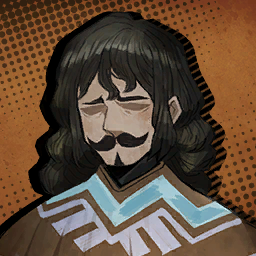

        ```
        Mariachi Alegre: Hey, oigan! What’s with all the doom and gloom you’re wearing on that face of yours?
        มาริอาชี อาเลเกร: เฮ้ ว่าไงทุกคน! ทำไมพวกเธอถึงทำหน้าอย่างกับว่ามีอะไรฉิบหายเกิดขึ้น แล้วก็หม่นหมองขนาดนั่นล่ะ?
        ```
        ```
        Mairachi Alegre: Don’t you know the rules here? Sour looks are a no-no, so put a hat over your long face!
        มาริอาชี อาเลเกร: หรือว่าพวกเธอไม่รู้กฎที่นี้หรือยังไงกัน? หน้าบิ้งถือว่าไม่ผ่าน ไม่ปังอย่างแรง เพราะงั้นก็หาอะไรมาปิดหน้าหงอย ๆ พวกนั่นของเธอซะ!
        ```

        ---

        

        ```
        Ryoshu: Why do you say that while looking at me? I. Will. SYNC on you.
        เรียวชู: ทำไมถึงพูดแบบนั่นตอนกำลังจ้องฉันอยู่กันล่ะ? เดี๋ยวฉันก็ หคหต. แกซะหรอก 
        ```

        ---

        

        ```
        Mariachi Alegre: What's that mean?!
        มาริอาซี อาเลเกร: หะ นั่นมันหมายความว่าไงกัน?!
        ```

        ---

        

        ```
        Ryoshu: Snap your neck completely, that’s what.
        เรียวชู: หคหต แปลว่า: หักคอให้ตาย นั่นแหละที่มันหมายถึง
        ```

        ---

        

        ```
        Dante: <Easy, Ryōshū... You shouldn’t be so prone to starting fights—>
        ดันเต้: <ใจเย็นน่า เรียวชู... เธอไม่จำเป็นต้องตัดสินทุกอย่างด้วยการรบราฆ่าฟันกันตลอดหรอกนะ—>
        ```

        ---

        

        ```
        Mariachi Alegre: Ey, never mind that. This one has an even more problematic face, no? Which hand is supposed to be your eyes?
        มาริอาซี อาเลเกร: เอ๋ ชั่งมันเถอะ เดี๋ยวนะ... นี้สหาย! ดูไอเจ้าหมอนี้สิ มีใครเคยเห็นหน้าที่เxี้ยขนาดนี้มาก่อนไหมล่ะ? อยากรู้จริง ๆ ว่ามือข้างไหนกันที่เป็นตาของแก?
        ```

        ---

        

        ```
        Dante: <...Ryōshū, are you ready?>
        ดันเต้: <...เรียวชู พร้อมลุยไหม?>
        ```

        ---

        
        
        ```
        Ryoshu: You bet, Dante.
        ดันเต้: จัดให้ ดันเต้
        ```

    ---

    * **Episode: 15 | ตอนที่ 15<br>Location: Casino 2F | คาซิโน ชั้นที่ 2**

        

        ```
        Bawling Casinogoer: GAAH!!! NOT AGAIN!!!
        ผู้ชมคาซิโนที่ตะโกนโหวกเหวก: ย้าาก!! ต้องไม่ใช่แบบนี้สิ!!!
        ```
        ```
        Bawling Casinogoer: I lost once again, damn! When will this end?
        ผู้ชมคาซิโนที่ตะโกนโหวกเหวก: แพ้อีกแล้ว แม้งเอ้ย! เมื่อไรมันจะจบได้สักที? 
        ```

        ---

        

        ```
        Mariachi Alegre: Oye, espera, time out! Our dear customer here needs a little care!
        มาริอาซี อาเลเกร: เฮ้ เดี๋ยวก่อน หมดเวลาแล้ว! สงสัยคุณลูกค้าสุดที่รักของเราต้องได้รับการดูแลสักหน่อย! 
        ```
        ```
        Mariachi Alegre: Dear Customer, I hope you haven’t forgotten our rule, have you?
        มาริอาซี อาเลเกร: คุณลูกค้าครับ ผมหวังว่าคุณจะยังไม่ลืมกฎของพวกเราใช่ไหมครับ?
        ```

        ---

        

        ```
        Bawling Casinogoer: B-But... That was all the money I had...
        ผู้ชมคาซิโนที่ตะโกนโหวกเหวก: ต-แต่ว่า... นั่นคือเงินทั้งหมดที่ฉันมีแล้ว...
        ```

        ---

        

        ```
        Mariachi Alegre: If you keep dampening the mood of the table, we might throw a pañata party out of you.
        มาริอาซี อาเลเกร: ถ้าคุณยังคงทำให้บรรยากาศของโต๊ะกร่อยอยู่อย่างนี้ ผมคิดว่าเราคงต้องบังคับให้คุณมาร่วมปาญาตางานปาร์ตี้ซะแล้ว
        ```

        ---

        

        ```
        Gregor: (Uh, what’s a pañata party?)
        เกรกอร์: (เออ อะไรคือปาร์ตี้ปาญาตา?)
        ```

        ---

        

        ```
        Dante: <I don’t think I want to know...>
        ดันเต้: <ผมคิดว่าผมไม่อยากรู้เรื่องนั่นเลยแหะ...>
        ```

        * เสียงในหัว

            ```
            Pressured by gentle intimidation, the weeping guest stood up from their seat.
            เมื่อถูกกดดันโดยการข่มขู่ที่สุภาพนั่น แขกคนนั่นที่ร้องไห้ก็ลุกยืนจากที่นั่ง
            ```
            ```
            And then, being handed a pair of maracas from the staff, they...
            และจากนั่นก็ถือมาราคัสคู่หนึ่งที่ได้จากพนักงาน ก่อนที่พวกเขา...
            ```
            ```
            ...Started dancing, sobbing all the way...
            ...จะเริ่มเต้นไปเต้นมา พร้อมกับร้องไห้ตลอดทาง...
            ```

        ---

        

        ```
        Heathcliff: What’s this now...?
        ฮิธคลิฟฟ์: แล้วไงต่อล่ะ...?
        ```

        ---

        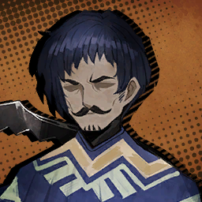

        ```
        Mariachi Vivaz: There’s a rule every visitor to this floor must follow—una tradición mariachi, if you will.
        มาริอาชี วีวาซ: มันมีกฎที่แขกทุกคนที่อยู่ชั้นนี้ต้องทำตามอยู่น่ะครับ—จะเรียกว่าเป็นประเพณีอะไรบางอย่างที่เรียกว่า มารีอาซี ประมาณนั่นก็ได้ล่ะมั่งครับ
        ```
        ```
        Mariachi Vivaz: Gambling is entertainment, an activity done purely for fun; thus, all the sadness and pain brought to you must be sublimated into dance.
        มาริอาชี วีวาซ: การพนันถือเป็นสิ่งที่ทำเพื่อเพื่อความบันเทิง เป็นกิจกรรมเพื่อความสุขอย่างแท้จริง; เพราะงั้น ความเศร้า และความเจ็บปวดทั้งหลายที่เกิดขึ้นกับคุณ ก็สมควรที่จะชะล้างไปให้หมดด้วยการเต้น
        ```

        ---

        

        ```
        Don Quixote: Allow this knight to demonstrate what dancing is about!
        ดอน กิโฆ้เต้: โปรดให้ตัวข้า อัศวินผู้นี้ ได้แสดงให้พวกท่านได้ประจักษ์ถึงการเต้นที่แท้จริงว่ามันเป็นยังไง!
        ```

        ---

        

        * เสียงในหัว

            ```
            Alas, they were harsher judges than they seemed.
            อนิจจา ถึงพวกเขาจะดูเป็นอย่างนั่น แต่พวกเขาตัดสินกันโหดพอตัวเลย
            ```

        ---

        

        ```
        Mariachi Alegre: This one won’t do.
        มาริอาชี อาเลเกร: ท่านั่นไม่ผ่านครับ
        ```

        ---

        

        ```
        Mariachi Vivaz: Her movement is insincere.
        มาริอาชี วิวาซ: การเคลื่อนไหวของเธอยังขาดความจริงใจ
        ```

        ---

        

        ```
        Don Quixote: What on earth do you mean?!
        ดอน กิโฆ้เต้: พูดแบบนั่นหมายความว่ายังไงน่ะขอรับ?!
        ```

        ---

        

        ```
        Mariachi Alegre: Dance is a window to the heart.
        มาริอาซี อาเลเกร: การเต้นคือหน้าต่างสู่หัวใจ
        ```

        ---

        

        ```
        Mariachi Vivaz: Without a clear and pure heart, it loses all meaning.
        มาริอาซี วิวาซ: หากขาดความโปร่งใส และจิตใจที่บริสุทธิ์ ในท้ายที่สุดมันจะสูญเสียความหมายของมันไป
        ```

        ---

        

        ```
        Don Quixote: ......
        ดอน กิโฆ้เต้: ......
        ```
        ```
        Don Quixote: ...I find thine assessment rather disgracious.
        ดอน กิโฆ้เต้: ...ข้าว่าการประเมินของพวกท่านค่อนข้างน่าอาย และตื้นเขินเป็นอย่างมาก
        ```

        ---

        

        ```
        Effie: This is getting further out of hand... What are you doing, Saude?
        เอฟฟี่: นี้มันชักจะไปกันใหญ่แล้ว... แล้วเธอมัวทำอะไรอยู่น่ะ เซาเด?
        ```

        ---

        

        ```
        Saude: Oh, I was writing our letter of apology in advance.
        เซาเด: อ้อ นี้น่ะเหรอ ฉันกำลังเขียนจดหมายขอโทษล่วงหน้าน่ะ
        ```

    ---

    * **Episode: 16 | ตอนที่ 16<br>Location: Casino 2F | คาซิโน ชั้นที่ 2**

        

        ```
        Ishmael: As absurd as it sounds, if we want to leave this floor early...
        อิชมาเอล: ถึงมันจะฟังดูไร้สาระยังไงก็เถอะ แต่ถ้าเราอยากออกไปจากชั้นนี้เร็ว ๆ สิ่งเดียวที่เราต้องทำก็คือ... 
        ```
        ```
        Ishmael: We’re going to need to touch their hearts with a powerful dance.
        อิชมาเอล: เราต้องชนะใจพวกเขาด้วยท่าเต้นที่ทรงพลัง
        ```

        ---

        

        ```
        Dante: <As you all know, my memories are hazy, so... dance, is it...? Can’t say I’m all too familiar.>
        ดันเต้: <ก็อย่างที่พวกเธอรู้ เรื่องที่ว่าตอนนี้ความทรงจำของฉันมันเลือนลางมาก เพราะงั้น... เรื่องเต้นเนี้ย...? ฉันไม่คิดว่าฉันสัดทัดสักเท่าไหร่>
        ```

        * เสียงในหัว

            ```
            Amnesia came in handy as an excuse to opt-out of things at times like this.
            อาการความจำเสื่อมดันมามีประโยชน์ในเวลาแบบนี้ ที่ฉันใช้มันเพื่อเป็นข้ออ้างไว้ถอนตัว
            ```
            ```
            Of course, I haven’t actually forgotten what dance is, but there’s no need to be too honest about it, is there?
            แต่มันก็ต้องแน่นอนอยู่แล้ว ว่าฉันไม่มีทางลืมว่าเต้นคืออะไร แต่มันก็ไม่เห็นจำเป็นที่จะต้องเป็นคนซื่อขนาดนั่นก็ได้ ใช่ไหมล่ะ?
            ```

        ```
        Dante: <Say, Hong Lu, have you taken dance lessons or anything?>
        ดันเต้: <ว่ากว่าเถอะ ฮงหลู่ นี้นายเคยเรียนเต้นรำ หรืออะไรทำนองนั่นบ้างไหมล่ะ?>
        ```

        ---

        

        ```
        Hong Lu: I learned a little bian lian, though I only had three instructors teaching me. To perform it, I’ll need a few masks, fans, makeup, and...
        ฮงหลู่: เรื่องนั่น ผมเคยเรียนเบียนเลียนนิดหน่อยน่ะครับ แต่แม้ว่าผมจะมีอาจารย์ตั้งสามคนรุมสอนผม แต่ในการที่ผมจะเต้นได้ ผมจำเป็นต้องมีหน้ากาก แฟน ๆ เมคอัพ แล้วก็...
        ```

        ---

        

        ```
        Dante: <...We aren’t gonna find them here. Next.>
        ดันเต้: <...คือแบบว่า พวกเราคงหาพวกเขาที่นี้ไม่ได้หรอกเพราะงั้นขอโทษด้วยนะ แต่ คนต่อไป>
        ```

        ---

        

        ```
        Heathcliff:	Well, I did step on a good few feet of snobbish aristocrats at balls.
        ฮิธคลิฟฟ์: เออ ฉันเองก็เคยใช้ฝีเท้าเหยียบไอพวกขุนนางที่ชอบดูถูกด้วยความมั่นใจอยู่บ้าง
        ```

        ---

        

        ```
        Yi Sang: My inner voice expresses fear.
        ยี่ซัง: เสียงข้างในตัวผมรู้สึกกลัว
        ```

        ---

        

        ```
        Ishmael: ...Me? I spent half of my life on a ship.
        อิชมาเอล: ...ฉันเหรอ? คงไม่ได้หรอก จะบอกให้รู้ไว้ว่าฉันใช้ชีวิตมากกว่าครึ่งหนึ่งทำงานอยู่บนเรือ แล้วจะให้ฉันไปมีเวลาที่ไหนเต้นล่ะ
        ```

        ---

        

        ```
        Don Quixote: Dance is where I—! Hrrmph! Cease this relentless obstruction of my words!
        ดอน กิโฆ้เต้: ข้าน้อยพอมีประสบการณ์เคยเต้นที่—! อ-อื้ม! *.จะพูดอะไรบางอย่างแต่หยุดกลางคัน* หมายถึงไม่ ข้าไม่เคยเต้นรำมาก่อนเลย ท่านช่วยลืมสิ่งที่ข้าพูดไปเมื่อครู่ด้วยเถิด!
        ```

        ---

        

        ```
        Ryoshu: A sword dance for the first time in a while doesn’t sound bad. I’ll kill it on the floor.
        เรียวชู: การรำดาบครั้งแรกก็ฟังดูไม่แย่เท่าไหร่เลยนะ ฉันจะฆ่าพวกมันให้กองลงบนพื้นอย่างงดงามเอง
        ```

        ---

        

        ```
        Outis: Though the only beats I have danced to throughout my life were morning exercise programs during roll call, if the manager so demands, I will immediately see to it that—
        เอาทิส: ถึงแม้จังหวะเดียวที่ฉันเคยเต้นมาทั้งชีวิตจะเป็นจากโปรแกรมออกกำลังกายตอนเช้าในขณะเช็คชื่อ แต่หากท่านผู้จัดการต้องการให้ฉันทำล่ะก็ ดิฉันก็พร้อมที่จะทำมันในทันทีค่ะ
        ```

        ---

        

        ```
        Rodion: W-Well, Dante... I’m good at most things, buuut, my dancing is kinda... embarrassing... Hahah!
        โรเดียน: ก-ก็นะ ดันเต้... ฉันเก่งหลายอย่างก็จริงอยู่ แต่ว่าน่าาาา การเต้นของฉันมันค่อนข้างแบบว่า... น่าอายน่ะ... ฮาฮ่า! 
        ```

        ---

        

        ```
        Gregor: I don’t mind, except my arm might rage out of control from the stimulation and charge for the audience’s heads.
        เกรกอร์: สำหรับฉันไม่ถืออะไรหรอกนะถ้าจะต้องทำ เพียงแต่ บางทีแขนฉันอาจกระตุ้นให้คลุ่มคลั่งขึ้นมา แล้วโจมตีใส่หัวผู้ชมเนี้ยสิ
        ```

        ---

        

        ```
        Meursault: ......
        เมอร์โซลท์: ......
        ```

        ---

        

        ```
        Faust: Faust doesn’t necessarily enjoy dancing for leisure, but I could gladly perform a routine if it’s for the mission’s sake.
        เฟาสท์: เฟาสท์ไม่ได้รู้สึกสนุกกับการเต้นในยามว่าง แต่ดิฉันก็เต็มใจที่จะทำมันหากการกระทำนี้สามารถสร้างผลประโยชน์ต่อภารกิจได้อย่างมีนัยยะสำคัญ
        ```
        ```
        Faust: However, it’s not technical perfection they want. They’re looking for something unstable and unpolished, rather...
        เฟาสท์: แต่กระนั้น ท่าเต้นของฉันคงไม่ได้สมบูรณ์แบบในแบบที่พวกเขาถูกใจ พวกเขาต้องการบางอย่างที่ไม่เสถียร อิสระ และตรงไปตรงมามากกว่าน่ะค่ะ...  
        ```

        ---

        

        ```
        Rodion: Sinclair!
        โรเดียน: ซินแคร์!
        ```

        ---

        

        ```
        Sinclair: Wha?!
        ซินแคร์: อะไรเหรอครับ?!
        ```

        ---

        

        ```
        Rodion: You busted a move or two as a kid, didn’t you?
        โรเดียน: เธอคงเคยเต้นสักท่าสองท่าตอนเป็นเด็กใช่ไหม?
        ```

        ---

        

        ```
        Sinclair: B-Bust? I suppose I... took a basic maracas course at school as a liberal arts class...
        ซินแคร์: ต-เต้นเหรอครับ? ก็เคยอยู่นะครับ ผม... เคยเรียนคอร์ดสอนเต้นมาราคัสตอนอยู่โรงเรียนในคลาสสอนศิลปะน่ะครับ
        ```

        ---

        

        ```
        Dante: <He came from a rich family too? How’d you figure that out, Rodya?>
        ดันเต้: <นี้เขาเองก็มาจากครอบครัวที่มีฐานะเหมือนกันเหรอเนี้ย? ว่าแต่เธอรู้เรื่องนั่นได้ยังไงเหรอ โรดย่า?>
        ```

        ---

        

        ```
        Rodion: I can tell from the way he walks and talks.
        โรเดียน: ฉันพอบอกได้จากท่าทางเวลาเขาเดิน แล้วก็พูดน่ะ
        ```
        ```
        Rodion: On the other hand, uncultured ones... Pfheh... It shows, y’know?
        โรเดียน: ในทางกลับกัน ไอเจ้าคนไร้วัฒนธรรมนั่น... ฟิ่บ... *.กลั้นขำ* ดูก็รู้ว่าไม่ได้เนอะ?
        ```

        ---

        
        
        * เสียงในหัว

            ```
            Rodya quietly giggled while looking at Heathcliff, then snuck up behind Sinclair to wrap her arms around his shoulders.
            โรดย่าขำอย่างเงียบ ๆ ในขณะที่กำลังจ้องมองไปที่ฮิธคลิฟฟ์ จากนั่นก็เข้ามาจากข้างหลังซินแคร์แล้วโอบกอดไหล่ของเขา
            ```

        ---

        

        ```
        Rodion: ‘Kay now~ My little Sinclair, I have a very, veeeery important task for you.
        โรเดียน: เคเลย~ ซินแคร์ตัวน้อยของฉันจ๊ะ ตอนนี้ฉันมีงานที่สำคัญมาก ๆ อยากให้เธอทำน่ะจ๊ะ
        ```

        ---

        

        ```
        Sinclair: Huh? Hey? Rodya? Where are you...
        ซินแคร์: หา? เอ๋? คุณโรดย่า? ไปไหนน่ะครับ...
        ```

        ---

        

        * เสียงในหัว

            ```
            Moments later, Sinclair solemnly walked onto the stage.
            ไม่นานนัก ซินแคร์ก็เดินขึ้นมาบนเวทีด้วยท่าทีที่เคร่งขรึม
            ```

        ```
        Dante: <Sinclair... You can do this.>
        ดันเต้: <ซินแคร์ นายทำได้>
        ```

        ---

        

        ```
        Ishmael: Yeah, think of all the times when Heathcliff trampled over you...
        อิชมาเอล: ใช่แล้ว คิดถึงช่วงเวลาทั้งหมดที่ฮิธคลิฟฟ์เคยเหยียบย่ำนายเอาไว้...
        ```

        ---

        

        ```
        Sinclair: I, I’m...
        ซินแคร์: ผม ผมน่ะ...
        ```

        ---

        

        * เสียงในหัว

            ```
            Sinclair turned to Rodya, still looking anxious.
            ซินแคร์หันไปหาโรดย่าด้วยใบหน้าที่เต็มไปด้วยความกังวล
            ```

        ---

        

        ```
        Sinclair: Am I... really able to do this?
        ซินแคร์: ผมจะ... ทำมันได้จริง ๆ เหรอครับ?
        ```

        ---

        

        ```
        Rodion: Wrong question, Sinclair.
        โรเดียน: พูดอะไรของเธอน่ะซินแคร์ ไม่เห็นมีอะไรต้องกังวลเลย
        ```
        ```
        Rodion: This is something only you can do.
        โรเดียน: เพราะนี้คือสิ่งที่มีเพียงนายคนเดียวเท่านั่นที่ทำได้
        ```

        ---

        

        * เสียงในหัว

            ```
            He returned a determiend nod.
            เขาพยักหน้าตอบกลับด้วยสีหน้าที่มุ่งมั่น
            ```

        ---

        

        ```
        Mariachi Alegre: The wrist-rocking... That pensive expression... Restrained rhythm... Perfection!
        มาริอาชี อาเลเกร: 
        ```

        ---

        

        ```
        Mariachi Vivaz: It’s calm... Yet it’s the calmness that stirs my heart... This young man—he’s channeling something from within...
        มาริอาซี วีวาซ: ทวงท่านั่น มันชั่งดูสงบเหลือเกิน... แต่ถึงอย่างนั่น มันก็เป็นความสงบที่ทำให้ใจเต้นได้อย่างบอกไม่ถูก... อย่างกับว่าชายหนุ่มคนนี้—กำลังถ่ายทอดบางสิ่งจากด้านใน
        ```
        ```
        Mariachi Vivaz: How sublime...
        มาริอาซี วีวาซ: ช่างประเสริฐอะไรเยี่ยงนี้...
        ```
        ```
        Mariachi Vivaz: He is fighting repressed darkness and inner turmoil with the body’s motion...!
        มาริอาซี วีวาซ: เขากำลังต่อสู้กับความมืดมิดที่อดกลั้น และความวุ่นวายยุ่งเหยิงที่อยู่ภายใน ด้วยการเคลื่อนไหวของร่างกาย...!
        ```
        ```
        Mariachi Vivaz: Ohhh... The embers linger in glowing ash... heating the rhythm... for gestures to be struck along... This conjures an image, one of a bonfire that has burnt through the whole night! And we are witnessing the cotillion of ash dancing atop its remnant!
        มาริอาซี วีวาซ: โอ้... ประดั่งว่า เศษถ่านที่คงเหลือในกองเพลิงที่ส่องสว่าง... คอยเร่งจังหวะ... เพื่อให้ท่วงท่าตามทัน... ก่อให้เกิดภาพของกองไฟที่เผาไหม้อยู่อย่างนั่นต่อไปชั่วคืน! และพวกเรากำลังเป็นสักขีพยานงานราตรีคอทิลเลียนที่เหล่าเถ้าธุลีเศษพากันเต้นรำบนกองซากที่ไหม้เกรียม!
        ```

        ---

        

        ```
        Dante: <Sorry, what?>
        ดันเต้: <เดี๋ยว อะไรนะ?>
        ```

        ---

        

        ```
        Mariachi Alegre: Young man, won’t you consider joining us? You have the potential to grow big.
        มาริอาซี อาเลเกร: หนุ่มน้อย เธอไม่คิดที่จะเข้าร่วมกับพวกเราหน่อยเหรอ? เธอน่ะ มีศักภาพที่จะเติบใหญ่เป็นคนใหญ่คนโตได้
        ```

        ---

        

        ```
        Saude: That boy belongs to our company. You should know that siphoning valuable talent from their current employment without permission is a serious crime.
        เซาเด: ขออภัยจริง ๆ นะคะที่ต้องขัดแบบนี้ แต่ว่าเด็กหนุ่มคนนั่นเป็นคนของบริษัทเราเองคะ คุณคงรู้ดีอยู่แล้วใช่ไหมคะว่าการดึงตัว หรือยื่นข้อเสนอให้กับบุลคากรที่มีพรสวรรค์ซึ่งยังดำรงตำแหน่งหน้าที่การงานปัจจุบันในบริษัทอื่นอยู่ก่อนแล้วโดยที่ไม่ได้รับอนุญาติ ถือเป็นการก่ออาชญากรรมอย่างหนึ่งเลยนะคะ
        ```

        ---

        

        * เสียงในหัว

            ```
            Just a few hours ago, Sinclair was only one moron in our band of blunderheads, but now he’s been elevated to the company’s valuable asset.
            แค่ไม่กี่ชั่วโมงก่อน ซินแคร์ยังเป็นแค่เด็กโง่คนหนึ่งในหมู่พวกทึ่มอย่างพวกเราเท่านั่น แต่ตอนนี้ เขากลับถูกเชิดชูให้กลายเป็นสิ่งของที่มีมูลค่าของบริษัทไปแล้วซะอย่างนั่น
            ```

        ---

        

        ```
        Mariachi Alegre: What a fine performance. You wish to get to the top floor, right?
        มาริอาซี อาเลเกร: เป็นการแสดงที่เยี่ยมยอดอะไรปางนี้ เธออยากที่จะขึ้นไปยังชั้นบนสุดใช่ไหม? 
        ```

        ---

        

        ```
        Mariachi Vivaz: You may pass. You have earned the right.
        มาริอาซี วีวาซ: เชิญเธอผ่านไปได้เลย เธอเหมาะสมที่จะได้รับสิทธิ์นั่น
        ```

        ---

        

        ```
        Mariachi Alegre: Be warned, though, the folks upstairs won’t be as reasonable. They have no concept of festivity in their heads.
        มาริอาซี อาเลเกร: แต่ขอเตือนไว้ก่อน เจ้าพวกที่อยู่ชั้นบนนั่นอาจดูเป็นพวกที่ไม่ค่อยมีเหตุผลไปบ้าง นั่นก็เพราะพวกเขาไม่ได้ตีความสิ่งที่เรียกว่าเทศกาลกับการพนันไงล่ะ
        ```

        ---

        

        * เสียงในหัว

            ```
            Sinclair came back to us with an invigorated look.
            ซินแคร์มองกลับมาที่พวกเราด้วยท่าทีที่ร่าเริง
            ```

        ---

        

        ```
        Sinclair: The things welling up inside me... This is what it was about.
        ซินแคร์: จู่ ๆ สิ่งต่าง ๆ ที่อยู่ในตัวผมมันก็พุ่งพรวดออกมา... ผมรู้สึกว่ามันเป็นอย่างนั่น
        ```
        ```
        Sinclair: It makes me wonder why I thought it would be hard. I feel much more comfortable now.
        ซินแคร์: มันทำเอาผมรู้สึกสงสัยว่าทำไมตอนแรกผมถึงคิดว่ามันยากกัน ทั้ง ๆ ที่ตอนนี้ผมกลับรู้สึกสบายใจอย่างบอกไม่ถูก 
        ```

        ---

        

        * เสียงในหัว

            ```
            I was curious to know the inner struggle he’d expressed through dance that had touched the Syndicate to their core.
            ฉันรู้สึกสงสัยเกี่ยวกับเรื่องราวภายในใจ การดิ้นรนของเขา ที่แสดงออกมาโดยไม่รู้ตัวผ่านการเต้นกับท้วงทำนองที่สามารถจับใจซินดิเคตพวกนั่นได้ถึงแก่น
            ```
            ```
            And what kind of hardship a young gentleman like him could have gone through...
            และความยากลำบากแบบไหนกันที่สุภาพบุรุษหนุ่มอย่างเขาผ่านพ้นมา...
            ```
            ```
            But those questions could wait; for now, we headed upstairs to the third floor.
            แต่เรื่องนั่นไว้ถามทีหลังก็ได้; ตอนนี้ เราต้องเร่งมือขึ้นไปยังชั้นถัดไป ชั้นที่ 3
            ```

    ---

    * **Episode: 17 | ตอนที่ 17<br>Location: Casino 3F | คาซิโน ชั้นที่ 3**

        

        ```
        Threatening Crewman: What d’we have ‘ere?
        ลูกเรือจอมข่มขู่: ดูซิว่าเรามีใครอยู่ตรงนี้?
        ```

        ---

        

        ```
        Flexing Crewman: D’you fellers have any idea what you’ve just walked into?
        ลูกเรือจอมอวดเบ่ง: พวกแกรู้บ้างไหมว่าพึ่งเดินมาเจอกับอะไร?
        ```

        ---

        

        ```
        Threatening Crewman: Try mucking about and we’ll make the most acrobatic poses known to man outta you.
        ลูกเรือจอมข่มขู่: ลองพูดกวนประสาทดูสักคำสิ แล้วเดี๋ยวเราจะจับแกดัดเป็นท่ากายกรรมสุดพิสดารที่มนุษย์คนหนึ่งจะสามารถเห็นได้เอง
        ```

        ---

        

        ```
        Flexing Crewman: Then we’ll lop off your digits joint by joint and make purdy mahjong tiles with ‘em.
        ลูกเรือจอมอวดเบ่ง: จากนั่นเราจค่อย ๆ สับนิ้วแกออกทีละข้อ แล้วเอาไปทำเป็นไพ่นกกระจอกสวย ๆ ซะ
        ```

        ---

        

        ```
        Ishmael: Sheesh... Some warm welcome that was.
        อิชมาเอล: ให้ตายเถอะ... ต้อนรับได้อบอุ่นซะไม่มี
        ```

        ---

        
        
        ```
        Heathcliff: Feh, I’m not one to let introductions like that go unanswered. Oi! Dust up!
        ฮิธคลิฟฟ์: เหอะ ฉันไม่ใช่คนที่จะปล่อยให้การแนะนำตัวงี่เง่าพันธ์นั่นจบไปโดยที่มีมีใครตอบหรอกเนอะ โอ่ย! พวกแก มาช่วยรุบกระทืบไอนี้ซะ!
        ```

    ---

    * **Episode: 18 | ตอนที่ 18<br>Location: Casino 3F | คาซิโน ชั้นที่ 3**

        

        ```
        Flexing Crewman: You’d better keep your noggin safe and sound, ‘cause for kick the can we might need somethin’ around.
        ลูกเรือจอมอวดเบ่ง: ระวังหัวแกไว้ให้ดี ๆ ล่ะ เพราะตอนเล่นเตะกระป๋อง พวกเราอาจต้องหาอะไรกลม ๆ มาใช้แทนอยู่พอดี
        ```

        ---

        

        ```
        Effie: I almost forgot... These are the ones known for their coarse language...
        เอฟฟี่: ฉันเกือบลืมไปเลย... ว่าไอพวกนี้เป็นพวกที่เป็นที่รู้จักจากการใช้ภาษาที่หยาบคายของมัน...
        ```
        ```
        Effie: Rumor has it they took down dozens of rival Syndicate members with just the psychological damage inflicted via their tongues...
        เอฟฟี่: เคยมีข่าวลือที่ว่าพวกมันสามารถเอาชนะสมาชิกซินดิเคทคู่อริ โดยการพูดกร่นด่าฝ่ายตรงข้าม ถากถาง ด้วยฝีปากที่เผ็ดร้อนเพื่อโจมตีทางจิตใจ...
        ```

        ---

        

        ```
        Heathcliff: Oi! You watch your mouths while I’m—
        ฮิธคลิฟฟ์: โอ่ย! ระวังปากแกไว้ให้ดีในตอนที่ฉันกำลั—
        ```

        ---

        

        ```
        Flexing Crewman: Who’re you gazing nitwits? Keep us out of sight, won’tcha? Them big bulgin’ doggy eyeballs are unnerving...
        ลูกเรือจอดอวดเบ่ง: 
        ```

        ---

        

        ```
        Threatening Crewman: Who’re you gazing nitwits? Keep us out of sight, won’tcha? Them big bulgin’ doggy eyeballs are unnerving... 
        ลูกเรือจอมข่มขู่: นี้แกคิดว่าแกกำลังจ้องใครอยู่กันวะ ไอเด็กน้อยปัญญานิ่ม? ใสตาเน่า ๆ ของแกไปไกล ๆ จากพวกเราซะเข้าใจไหม?
        ```

        ---

        

        ```
        Flexing Crewman: Well brush me sideways, they don’t even got a string o’ egg noodle for brains? What’s the round thing on their shoulders, then? A bag o’ gas?
        ลูกเรือจอมอวดเบ่ง: ให้ตายสิ! นี้พวกมันไม่มีแม้แต่เส้นบะหมี่สักเส้นในกระบาลพวกมันบ้างเลยหรือไง? แล้วอะไรกลม ๆ ที่อยู่ระหว่างไหล่ทั้งสองข้างนั่นล่ะ? ถุงลมหรือไง?
        ```

        ---

        

        ```
        Heathcliff: ......
        ฮิธคลิฟฟ์: ......
        ```

        ---

        

        ```
        Gregor: Hm, think they all take lessons in assholery from the same class?
        เกรกอร์: หืม ฉันพนันเลยว่าพวกเขาคงได้เรียนเรื่องการทำตัวเป็นเศษสวะมาจากคลาสเดียวกันแหงะ ๆ?
        ```
        
        ---

        

        ```
        Rodion: ...Pft.
        โรเดียน: ...ฟิ่บ *.กลั้นขำ*
        ```
        ```
        Rodion: I—I mean, it was kinda funny. N-not sure what you’re looking at me for~
        โรเดียน: ฉ-ฉันหมายถึง มันก็ดูตลกดีออก ฉันม-ไม่เข้าใจเลยว่าทำไมนายถึงมองฉันอย่างนั่นล่าาา~
        ```

        ---

        

        ```
        Heathcliff: ...Dead.
        ฮิธคลิฟฟ์: ...ตาย
        ```
        ```
        Heathcliff: ...You’re all bloody dead!!
        ฮิธคลิฟฟ์: ...พวกแกต้องตายให้หมด!
        ```

    ---

    * **Episode: 19 | ตอนที่ 19<br>Location: Casino 3F | คาซิโน ชั้นที่ 3**

        

        ```
        Dante: <What should we do? We won’t get anywhere if we keep fighting...>
        ดันเต้: <เราต้องทำไงดี? ถ้าขืนยังมัวสู้แบบนี้ต่อไป เราคงไม่ได้ไปไหนสักที...>
        ```

        * เสียงในหัว

            ```
            To my surprise, Ishmael let out a chuckle.
            เหนือความคาดหมายของฉัน จู่ ๆ อิชมาเอลก็หัวเราะออกมา
            ```

        ---

        

        ```
        Ishmael: What’s to consider? We have our trump card.
        อิชมาเอล: ต้องคิดอะไรด้วยรึไง? ในเมื่อพวกเราก็ยังมีไพ่ตายในมืออยู่แท้ ๆ 
        ```

        ---

        

        ```
        Dante: <We have what now?>
        ดันเต้: <เรามีอะไรตอนนี้ด้วยเหรอ?>
        ```

        ---

        

        ```
        Ishmael: Just the right person to teach them something “legit”.
        อิชมาเอล: ก็มีคนทีจะสอนพวกเขาว่าอะไรคือสิ่งที่ “ถูกต้อง” ไง
        ```

        ---

        

        ```
        Ryoshu: After you give it a good @#$@#$ and @$#% it up, go $#%@#$ on it.
        เรียวชู: หลังจากที่เธอมั่นใจว่า @#$@#$ มัน และ @$#% มันอย่างดีแล้ว ก็ให้ $#%@#$ มันต่อเลย
        ```
        ```
        Ryoshu: Next up, you @%$#$^ the @$%@$% and then soak it in #$#@.
        เรียวชู: ต่อจากนั้นก็ @%$#$^ เจ้า @$%@$% แล้วเอาไปแช่ใน #$#@.
        ```
        ```
        Ryoshu: Lastly...
        เรียวชู: และท้ายที่สุด...
        ```

        ---

        

        * เสียงในหัว

            ```
            I never knew it was possible for the human tongue to give such detailed accounts of something so sickeningly gruesome.
            ฉันไม่เคยคาดคิดว่าก่อนเลยว่ามันจะเป็นไปได้ด้วยที่ปากของมนุษย์จะสามารถสบถรายละเอียดที่ลึกซึ้งของบางสิ่งที่ที่สยดสยองชวนอ้วกได้มากขนาดนี้
            ```
            ```
            The thugs’ eyes were uncharacteristically twinkling—some were even taking notes.
            สายตาของเหล่าอันธพาลขยิบไปมาอย่างไม่เป็นตัวเอง—บางคนถึงขนาดจดสิ่งที่เธอพูดเอาไว้ในโน้ตด้วยซ้ำ
            ```

        ---

        

        ```
        Threatening Crewman: I'll be damned, she had me struck.
        ลูกเรือจอมข่มขู่: ให้ตายสิ หล่อนเล่นเอาอิ้งไปเลย
        ```

        ---

        

        ```
        Flexing Crewman: Hoowee, that snap couldn’t be bolder... You’re what they call the wizardess o’ the tongue, eh, lady?
        ลูกเรือจอมอวดเบ่ง: ให้ตายสิ เป็นคำพูดตอกกลับที่ชั่งแรง และเผ็ดร้อนอะไรขนาดนี้... เธอนี้คือสิ่งผู้คนต่างเรียกกันว่าแม่มดแห่งวาจาหรือเปล่าเนี้ยแม่สาว
        ```

        ---

        
    
        ```
        Heathcliff: No. That has to be the gob of a witch, yeah.
        ฮิธคลิฟฟ์: จะแม่มงแม่มดอะไรกันล่ะ อย่างนางนั่นมันก็แค่ปากหมาเท่านั่นนั้นแหละ
        ```

        ---

        

        * เสียงในหัว

            ```
            Even Heathcliff, the man who must have had a rougher life than most in the Backstreets, shuddered by the end.
            กระทั่งฮิธคลิฟฟ์ ชายผู้ที่น่าจะมีชีวิตที่โหดร้ายกว่าเหล่าผู้คนที่อาศัยอยู่ในเบลคสตรีทส่วนมาก ก็ยังยอมศิโรราบตัวสั่นไม่หยุดไม่ต่างกัน
            ```

        ---

        

        ```
        Yi Sang: I cannot help but applaud the creativity. Indeed, the pen... Nay, the tongue is mightier than the sword.
        ยี่ซัง: ผมคงทำอะไรไม่ได้นอกจากปรบมือกับความคิดสร้างสรรค์ของคุณเรียวชูในการประดิษฐ์ประด่อยประโยคเหล่านั่นขึ้นมาอย่างแท้จริง หรือจะให้พูดก็คือ ปากกา... ไม่สิ คำพูดจากลมปากคมเสียยิ่งกว่าดาบเล่มใด
        ```

        ---

        

        ```
        Ishmael: I thought I was pretty familiar with the sailor’s mouth, being a seafarer for half my life...
        อิชมาเอล: ฉันว่าฉันก็คุ้นเคยกับปากพวกกาลาสีอยู่บ้าง จากการทีเป็นชาวทะเลมามากกว่าครึ่งชีวิต...
        ```
        ```
        Ishmael: But this made me realize my vocabulary was only the tip of the iceberg.
        อิชมาเอล: แต่เมื่อกี้นี้ทำเอาฉันได้รู้ว่าคลังคำศัพท์ที่ฉันมียังเป็นแค่ยอดของภูเขาไอซ์เบร์กเพียงเท่านั่น
        ```

        ---

        

        ```
        Saude: ......
        เซาเด: ......
        ```
        ```
        Saude: I honestly couldn’t fathom why the higher-ups would organize a team of people like you.
        เซาเด: ฉันล่ะไม่เข้าใจเลยจริง ๆ ว่าทำไมพวกคนใหญ่คนโตถึงได้จัดทีมที่เต็มไปด้วยคนอย่างเธอ
        ```

        ---

        

        ```
        Faust: I don’t suppose the lineup was meant to be understood by the likes of us.
        เฟาสท์: ฉันไม่คิดว่าเหตุผลเบื้องหลังการเลือกสมาชิกจากองค์กรจะเป็นสิ่งที่เราสามารถเข้าใจ และหยั่งถึงได้ด้วยคนอย่างพวกเราหรอก
        ```

        ---

        ```
        Saude: And I’m still having trouble figuring out the meaning of this personnel measure...
        เซาเด: อ่าใช่ และฉันก็ยังไม่รู้เลยว่าอะไรเป็นหลักเกณฑ์ของการคัดเลือกบุคคลากรแบบนี้...
        ```
        ```
        Saude: But, I guess... this isn’t so bad after all.
        เซาเด: แต่ฉันก็คิดว่า... นี้ก็ไม่ได้แย่ขนาดนั่นล่ะมั่ง
        ```

        ---

        

        ```
        Faust: Saude, you’ve finally reached the stage of acceptance. Congratulations.
        เฟาสท์: เซาเด ในที่สุดเธอก็ถึงระยะแห่งการยอมรับแล้ว ดีใจด้วย
        ```

    ---

    * **Episode: 20 | ตอนที่ 20<br>Location: High Rollers Floor | ชั้นบนสุด**

        

        ```
        Dante: <This isn’t good. We’ve reached the top floor, but we don’t have nearly enough wishpower...>
        ดันเต้: <นี้ไม่ได้เลย เรามาถึงชั้นบนสุดได้ก็จริงอยู่ แต่เแรงปราถนาที่เรามีไม่ใกล้กับคำว่าพอเลยด้วยซ้ำ...>
        ```

        ---

        

        ```
        Rodion: Aah~ No worries. I’ve been itching to tell you this, and it’s finally time.
        โรเดียน: อ้า~ ถ้าเรื่องนั่น ไม่ต้องกังวลไป เอาจริง ๆ ฉันคันปากอยากจะบอกนายเรื่องนี้มาได้สักพักแล้ว และตอนนี้วันถึงก็ถึงเวลา
        ```
        ```
        Rodion: I actually pinched a little wishpower back at the pawnshop. It’s not a lot, but it should be just enough, right?
        โรเดียน: อันที่จริงตอนที่อยู่ที่โรงรับจำนำ ฉันก็แอบจิ๊กแรงปราถนาจากที่นั่นมานิดหน่อย มันก็ไม่ได้เยอะแยะอะไรนักหรอก แต่เท่านี้ก็น่าจะพอแล้วใช่ไหม?
        ```

        ---

        

        * เสียงในหัว

            ```
            Rodya showed us a wish sticker sheet with a few labels left on it.
            โรดย่าแสดงแผ่นสติ๊กเกอร์พรโดยที่บนแผ่นมีความข้อความบางอย่างถูกเขียนเอาไว้
            ```

        ---

        

        ```
        Saude: Why didn’t you tell us earlier?
        เซาเด: แล้วทำไมก่อนหน้านี้เธอถึงไม่บอกพวกเรา?
        ```

        ---

        

        ```
        Rodion: Like you said, gambling is all about keeping a poker face. Wouldn’t want to see one of us slip and complicate things.
        โรเดียน: ก็อย่างที่เธอบอก การพนันมันเป็นเรื่องของการรักษาภาพพจน์ที่แสดงออก และเก็บสีหน้า อีกอย่างฉันไม่อยากที่จะเห็นพวกเธอหกล้ม แล้วทำให้เรื่องที่ควรจะง่ายยุ่งยากน่ะ
        ```
        ```
        Rodion: As for the boss role~ Mind if I borrow it for a sec, Dante?
        โรเดียน: เพราะงั้นในฐานะของหัวหน้า~ คงไม่ว่ากันนะถ้าฉันจะขอยื่มไปสักเดี๋ยวน่ะ ดันเต้?
        ```

        ---

        

        * เสียงในหัว

            ```
            I nodded, seeing as I wasn’t really doing much in this guise anyways.
            ฉันพยักหน้าตอบตกลง เมื่อเล็งเห็นว่าตัวฉันเองในตอนนี้ไม่สามารถทำอะไรได้เลยในฐานะหัวหน้า
            ```
            ```
            Even if I were committed to the act, it would only be right for me to forfeit it with my knees bent, since things played out the way they did.
            ถึงแม้ว่าฉันคิดที่จะลงมือทำอะไรจริง ๆ แต่สุดท้ายแล้วเรื่องนี้ก็คงต้องยอมให้มันเลยตามเลยอยู่ดี อย่างยิ่งหลังจากที่เรื่องมันดันมาลงเอยแบบนี้
            ```

        ---

        

        ```
        Saude: ...I would’ve been vehemently against this only hours ago. But now...
        เซาเด: ...ถ้าเป็นฉันเมื่อไม่กี่ชั่วโมงก่อนก็คงไม่เอาด้วย แล้วก็ขัดค้านหัวชนฝาแน่ แต่ตอนนี้...
        ```
        
        ---

        

        ```
        Rodion: Good thinking. I’ve never lost once in anything where money was involved.
        โรเดียน: คิดได้ดีแล้วล่ะ ฉันน่ะไม่เคยแพ้ในอะไรทั้งนั่นที่มีเงินมาเอี่ยวด้วย
        ```
        ```
        Rodion: Alright...
        โรเดียน: เอาล่ะ ถ้างั้น...
        ```

        ---

        **Location: Private Room | ห้องส่วนตัว**

        ---

        
        
        ```
        Rodion: The contestant enters~
        โรเดียน: ผู้เข้าแข่งขันเข้าที่~
        ```
        ```
        Rodion: Wait, I’m not the last? Aw, there goes my cool entry.
        โรเดียน: เอ๋ เดี๋ยวนะ นี้ฉันไม่ใช่คนสุดท้ายหรอกเหรอ? โถ่ แย่จัง อุตสาห์เปิดตัวเท่ ๆ ไปแล้วเชียว
        ```
        
        ---
    
        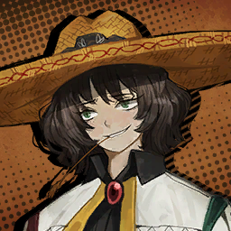

        ```
        ???: You are...?
        บุคคลปริศนา: เธอคือ...?
        ```

        ---

        

        ```
        Rodion: My name’s Rodion. I’m here to gamble for the right to access the basement.
        โรเดียน: ฉันมีชื่อว่าโรเดียน มานี้เพื่อพนันเอาสิทธิ์เข้าถึงชั้นใต้ดิน
        ```

        ---

        

        ```
        ???: Pwfhah!
        บุคคลปริศนา: พรวดฮ่า! *.กลั้นขำไม่อยู๋*
        ```
        ```
        ???: I was looking forward to finally meeting the infamous “wishpower whisker” in person, and look who we get instead. Aren’t you a little too confident for some unidentified stranger?
        บุคคลปริศนา: ฉันก็อุตสาห์นึกไปว่าในที่สุดจะได้เจอกับคุณ "หนวด เจ้าแห่งแรงปราถนา วิสเกอร์" ซะอีก แต่ที่ไหนได้กลับมาเป็นยัยป้าไม่รู้หัวนอนปลายเท้าคนหนึ่งที่จู่ ๆ ก็โผล่มาจากที่ไหนก็ไม่รู้ แล้วก็ความมั่นหน้านั่น เธอไม่คิดบ้างหรือไงว่าตัวเองมีความมั่นใจมากเกินไปกับการที่เป็นแค่คนแปลกหน้าไร้ชื่อคนหนึ่งก็เท่านั่น
        ```

        ---

        

        ```
        Rodion: What a dull take~ It’s not who you are that matters in this world, right? It’s about who wins.
        โรเดียน: คิดแบบนั่นมันน่าเบื่อจะตาย~ มันไม่สำคัญหรอกว่าเราจะเป็นใครในโลกใบนี้ ที่สำคัญก็คือใครผู้ชนะต่างหาก ใช่ม้า?
        ```

        ---

        

        ```
        ???: Well, you aren’t wrong there. The fact that you were able to get here is proof enough that you’re qualified.
        บุคคลปริศนา: งั้นเหรอ จะพูดแบบนั่นมันก็ไม่ผิด ความจริงที่ว่าเธอสามารถมายืนอยู่ ณ สถานที่แห่งนี้ได้นั่นก็เป็นข้อพิสูจน์ที่มากเกินพอแล้วล่ะว่าเธอเป็นผู้ผ่านเกณฑ์
        ```
        ```
        Aida: A pleasure. I’m Aida.
        ไอด้า: อาจจะสายไปสักหน่อย แต่ยินดีที่ได้รู้จัก ฉันมีชื่อว่าไอด้า
        ```
        ```
        Aida: And this is...
        ไอด้า: และคน(?)ที่อยู่ตรงนี้ก็คือ...
        ```

        ---

        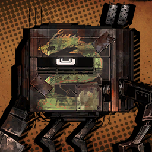

        ```
        Crew Boss: Golly, my back’s hurtin’.
        หัวหน้ากลุ่ม: ให้ตายสิ! ปวดหลังชะมัด
        ```

        ---

        

        ```
        Rodion: ...A robot? No, a prosthetic...?
        โรเดียน: ...หุนยนต์? ไม่สิ ร่างเทียมสินะ...?
        ```

        ---

        

        ```
        Crew Boss: What’s that stare? Never seen a full-body prosthetic before?
        หัวหน้ากลุ่ม: สายตาที่จ้องมองนั่นคืออะไร? ไม่เคยเห็นร่างเทียมแบบฟูลบอดี้มาก่อนหรือไง?
        ```

        ---

        

        ```
        Rodion: Isn’t that model... a bit too antiquated? It kinda looks like it belongs in a museum.
        โรเดียน: ก็ไม่ใช่ว่ารุ่นนี้มันดู... โบราณไปหน่อยเหรอคะ? มันเหมือนกับของที่ควรจัดแสดงอยู่ในพิพิธภัณฑ์ย้อนยุคมากกว่าเลยนะคะ  
        ```

        ---

        

        ```
        Crew Boss: Old is gold, as they say. Patched it up a few times, and now it’s sturdier than most new ones.
        หัวหน้ากลุ่ม: ของเก่าน่ะเจ๋งสุดแล้ว อย่างที่พวกเขาพูดกันนั่นแหละ แค่ซ้อมนิดซ้อมหน่อย แล้วเดี๋ยวมันก็แข็งแรงมั่นคงยิ่งกว่าของใหม่แล้ว
        ```
        ```
        Crew Boss: Why’s that boy bein’ so sluggish about comin’ here anyway? Arrogant brat thinks he can show up late to serious business, eh?
        หัวหน้ากลุ่ม: ว่าแต่ทำไมไอหนุ่มนั่นถึงยังมาไม่ถึงสักทีล่ะ? หรือไอเด็กเวรจอมอวดดีนั่นมันคิดว่าตัวเองมีเสน่ถึงขนาดถ้ามาช้าก็ไม่ผิดหรือยังไงกันล่ะเนี้ย?  
        ```

        ---

        

        ```
        Sonya: Pardon me. I had an urgent matter.
        ซอนย่า: ขออภัยด้วยนะครับ พอดีว่าผมติดธุระที่ต้องเร่งจัดการน่ะครับ เลยมาช้า
        ```

        ---

        

        ```
        Rodion: ?!
        โรเดียน: ?!
        ```

        ---

        

        ```
        Aida: You think the world revolves around you, Sonya? Do you crave attention so much that you have to arrive late and be showered in glares?
        ไอด้า: นี้นายคิดว่าโลกนี้หมุนรอบตัวนายหรือไง ซอนย่า? พูดก็พูดให้จริงหน่อยเถอะ ไม่ใช่ว่านายก็แค่หิวแสงก็เลยอยากมาช้าเพื่อให้ผู้คนพากันจ้องมองนายหรอกใช่ไหม?
        ```

        ---

        

        ```
        Sonya: Haha, I didn’t mean to. If anything, you’d fit better as the protagonist of life, Aida.
        ซอนย่า: ฮาฮ่า แหม พูดตรง ๆ ฉันก็ไม่ได้หวังอะไรแบบนั่นหรอก อีกอย่างถ้าจะให้พูดก็พูดเถอะ ฉันว่าเธอน่าจะเหมาะกับบทตัวเอกมากกว่านะ ไอด้า
        ```

        ---

        

        ```
        Rodion: ......
        โรเดียน: ......
        ```
        
        ---

        

        ```
        Sonya: It's been a while, Rodya.
        ซอนย่า: นี้มันก็พักใหญ่แล้วนะ โรดย่า
        ```

        ---
    
        

        ```
        Aida: What’s up? You two know each other?
        ไอด้า: อะไรล่ะนั่น? พวกเธอรู้จักกันเหรอ?
        ```

        ---

        

        ```
        Sonya: Let’s say that we... share a hometown. Isn’t that right, Rodya?
        ซอนย่า: ถ้าจะให้พูด พวกเราทั้งคู่... มากจากบ้านเกิดเดียวกันน่ะ ใช่ไหม โรดย่า? 
        ```

        ---

        

        ```
        Rodion: So, are you... still leading the Yurodiviye, then?
        โรเดียน: งั้นนายก็... ยังคงเป็นคนนำพวกยูโรดิวีอยู่เหมือนเดิมสินะ?
        ```

        ---

        

        ```
        Sonya: Dunno, it might be too early to say “still”... You were the one who left on your own just like that.
        ซอนย่า: ไม่รู้สิ ฉันว่ามันคงจะเร็วเกินไปที่จะพูดว่า "ยังคง"... ในเมื่อเธอเป็นคนที่ขอออกจากกลุ่มด้วยตัวของเธอเอง
        ```

        ---

        

        ```
        Aida: Now now, that’s enough chatting. Since we have all the players, let’s go over the rules again.
        ไอด้า: เอาล่ะ เอาล่ะ คุยกันพอแค่นั่นแหละ พวกเราทุกคนที่อยู่ที่นี้ก็ต่างเป็นผู้เล่นกันทั้งนั่น เพราะงั้นเรามาเริ่มทบทวนกฎของของเกมดูอีกครั้งกันเถอะ
        ```
        ```
        Aida: The four bidders for the casino are all here: Sonya, Aida, the Tieqiu, and... representing the Tingtang Gang’s boss... a suspicious yet shameless stand-in...
        ไอด้า: ผู้ประมูลสี่คนของคาซิโนอยู่ที่นี้กันครบหมดแล้ว ได้แก่: ซอนย่า ฉัน เที่ยชิว และ... คนผู้มาแทนที่ในตำแหน่งหัวหน้าของแก๊งติงตังที่ไม่ได้มาในวันนี้... ตัวแทนที่ดูน่าสงสัย และไร้ยางอาย... 
        ```
        ```
        Aida: No cheats or sleights of hand are allowed during the game. The moment you’re spotted in the act, you’re out.
        ไอด้า: ไม่อนุญาติให้มีการโกง หรือใข้กลลวงมือใด ๆ ทั้งนั่นตลอดการเล่นเกม และถ้าจับได้ก็จะถือว่าผู้โกงต้องออกจากเกมในทันที
        ```
        ```
        Aida: It should go without saying that anything involving wishpower is forbidden as well.
        ไอด้า: อีกข้อถึงแม้มันจะเรื่องที่ไม่จำเป็นต้องพูดแล้วก็ตาม แต่พูดกันไว้ก่อนก็คงดีกว่าแก้ อะไรก็ตามที่เกี่ยวข้องกับแรงปราถนาถือเป็นสิ่งต้องห้ามในเกมนี้เช่นกัน
        ```

        ---

        

        ```
        Crew Boss: Soon as you’re caught, you’re on the choppin’ block! You’ll sorely regret it!
        หัวหน้ากลุ่ม: ถ้าแกถูกจับได้เมื่อไหร่ แกได้กลายเป็นชิ้น ๆ แน่! แล้วแกจะได้เสียใจ!
        ```

        ---

        
        
        ```
        Rodion: ......
        โรเดียน: ......
        ```

        ---

        

        ```
        Aida: We’ll play three games in total, and the one with the most chips wins. Simple enough?
        ไอด้า: พวกเราจะเล่นกันทั้งหมดสามเกม โดยใครที่มีชิปมากที่สุดในตอนสุดท้ายจะถือเป็นผู้ชนะ 
        ```
        ```
        Aida: The winner will get to take the elevator to the underground portion where the Golden Bough is.
        ไอด้า: ผู้ชนะจะได้ลงลิฟไปชั้นใต้ดินที่ซึ่งจัดเก็บกิ่งทองเอาไว้
        ```
        ```
        Aida: It’s the treasure the former owner of this casino was so desperate to claim, digging a whole tunnel to unearth it.
        ไอด้า: มันเป็นสมบัติของเจ้าของบ่อนคนก่อนที่ต้องการครอบครองกิ่งไว้แต่เพียงผู้เดียว จึงเป็นสาเหตุที่เขาได้ตัดสินใจขุดอุโมงค์ได้ดิน
        ```
        ```
        Aida: But then they suddenly croaked for reasons unknown, making us the “lucky” bidders...
        ไอด้า: แต่แล้วเขาก็ตายโดยไม่ทราบสาเหตุ ทำให้เรากลายเป็นนักประมูลที่ "โชคดี" ไปโดยปริยาย...
        ```

        ---

        

        ```
        Rodion: ...What an elegant way to put that they died under shady circumstances.
        โรเดียน: ...ชั่งเป็นวิธีการตายที่ดูสง่างามใช่เล่นเลยน้า ยิ่งกับสถานการณ์ที่คลุมเคลือแบบนี้ก็แล้วใหญ่
        ```

        ---
        
        

        ```
        Sonya: Haha, oh Rodya. You’re still as cynical as ever, huh?
        ซอนย่า: ฮาฮ่า แหม โรดย่า เธอนี้ก็ยังเป็นคนที่ชอบดูถูกคนอื่นเหมือนยังเคยเลยนะ?
        ```

        ---

        

        ```
        Rodion: ...Shut it. How do you guys all know about the Golden Bough, though? Didn’t think it would be so widely known to the public.
        โรเดียน: ...หุบปาก แล้วพวกเธอรู้เกี่ยวกับเรื่องกิ่งทองนั่นได้ยังไง? ฉันไม่คิดว่าเรื่องพวกนี้จะเป็นเรื่องทั่วไปที่ใคร ๆ ก็รู้หรอกนะ
        ```
        
        ---

        

        ```
        Aida: Any Syndicate worth its name has caught wind of the stories. Those about the Golden Bough buried down here... and the riches and fame it’ll bring to the owner.
        ไอด้า: ทุกกลุ่มซินดิเคทที่มีชื่อต่างก็รู้เรื่องนี้กันทั้งนั่น เรื่องที่ว่ากิ่งทองถูกฝังกลบอยู่ด้านใต้ที่นี้... และความร่ำรวยรวมถึงชื่อเสียงที่มันมอบให้กับผู้ถือครอง
        ```

        ---

        
        
        ```
        Sonya: The Golden Bough can be used to achieve far greater things, Rodya. My purpose has stayed the same. To destroy the system of oppression and exploitation, preventing the concentration of wealth...
        ซอนย่า: กิ่งทองสามารถใช้เพื่อบรรลุสิ่งต่าง ๆ ที่ใหญ่กว่าได้ โรดย่า ตั้งแต่วันนั่นความปราถนาของฉันยังคงเป็นเหมือนเดิม เพื่อทำลายระบบแห่งการขดขี่ และแสวงหาผลกำไรเพื่อหลีกเลี่ยงความความมั่งคั่งทีกระจุกตัวในประชากรเฉพาะกลุ่ม...
        ```

        ---

        

        ```
        Crew Boss: Yeesh, there he goes again with the grand words. Someone stop ‘im.
        หัวหน้ากลุ่ม: ให้ตายสิ... ไอคำพูดใหญ่โตพวกนั่นมาอีกแล้ว ใครก็ได้หยุดเขาที
        ```

        ---

        
        
        ```
        Sonya: My apologies. It reminded me of the old times.
        ซอนย่า: ขอโทษจากใจจริง ๆ ครับ ก็แค่มันทำให้ผมนึกถึงช่วงเวลาเก่า ๆ ก็เท่านั่นแหละครับ
        ```
        ```
        Sonya: It’s funny. I used to keep you from your obsession with gambling and money.
        ซอนย่า: มันน่าขันนะ ที่ครั้งหนึ่งฉันเคยเป็นคนที่ห้ามเธอจากความรู้สึกหมกหมุ่นกับการพนัน และเงินตรา
        ```
        ```
        Sonya: Yet here we are at the same table, keeping our hands of cards from each other in a gamble with our goals on the line.
        ซอนย่า: แต่ดูตอนนี้สิ เรากลับมานั่งอยู่โต๊ะเดียวกัน เก็บมือไม้อย่างทะมัดทะแมงเพื่อซ่อนไพ่ให้ห่างจากสายตาของผู้อื่น นั่นก็เพื่อการพนันที่อาจหมายถึงเป้าหมาย หรือโชคชะตาที่สามารถพลิกได้บนเส้นด้ายเดียวกัน
        ```
        ```
        Sonya: What is your goal?
        ซอนย่า: แล้วอะไรคือเป้าหมายของเธอล่ะ?
        ```

        ---

        

        ```
        Rodion: ...To win.
        โรเดียน: ...เพื่อชนะ
        ```

        ---

        

        ```
        Sonya: ...Of course.
        ซอนย่า: ...แน่นอนสิ
        ```

    ---

    * **Episode: 21 | ตอนที่ 21<br>Location: Private Room | ห้องส่วนตัว**

        

        ```
        Aida: We’re at the final round. You all keeping a good eye on your chips?
        ไอด้า: พวกเรามาถึงรอบสุดท้ายกันเป็นที่เรียบร้อย แล้วพวกเธอจะใส่กันเท่าไหร่ดีล่ะ?
        ```

        ---

        

        ```
        Rodion: Hm, I’m all in.
        โรเดียน: หืม ฉันออลอิน
        ```

        ---

        

        ```
        Aida: ...All in?
        ไอด้า: ...ออลอิน?
        ```

        ---

        

        ```
        Sonya: Ooh~ Dealt a nice hand, huh, Rodya?
        ซอนย่า: แหม~ คงจะได้ไพ่ดีเลยสิท่าใช่ไหม โรดย่า?
        ```

        ---

        

        ```
        Crew Boss: Hah~ That swagger of yours’s been rubbin’ me the wrong way, y’know that? You’re pushin’ yourself to the edge, so what’re you counting on?
        หัวหน้ากลุ่ม: อา~ ความมั่นหน้าของเธอกำลังขัดใจฉันอยู่ รู้ไหม? เธอเอาแต่ผลักตัวเองไปที่ขอบหน้าผา และหวังว่าจะได้อะไรกลับมาอยู่ตลอด? 
        ```

        ---

        

        ```
        Rodion: I’m the kind of gal who bets everything she has at the end.
        โรเดียน: ก็แบบว่า... *.ล่ก* ฉันเป็นผู้หญิงประเภทที่ชอบพนันทุกอย่างที่มีตอนจบไง
        ```
        ```
        Rodion: ......
        โรเดียน: ......
        ```

        ---

        

        ```
        Crew Boss: Stop right there. Pull your sleeve up. Don’t think I didn’t see you bein’ sneaky.
        หัวหน้ากลุ่ม: หยุดอยู่ตรงนั่น แล้วถกแขนเสื้อให้ฉันดูหน่อยสิ อย่าคิดว่าฉันจะไม่เห็นว่าเธอกำลังเล่นตุกติกอยู่
        ```

        ---

        

        ```
        Rodion: Huh?!
        โรเดียน: หะ?!
        ```

        ---

        

        ```
        Crew Boss: You just put one of them wish stickers you got from the Tingtang bossman on your arm.
        หัวหน้ากลุ่ม: เธอพึ่งจะติดสติ๊กเกอร์พรที่ได้จากหัวหน้าแก๊งติงตังบนแขนของเธอ
        ```
        ```
        Crew Boss: You were tryin’ to rake in all the chips this round so you can have the Golden Bough all to yourself.
        หัวหน้ากลุ่ม: และเธอก็กำลังพยายามที่จะกอบโกยชิปทั้งหมดในรอบนี้เพื่อที่เธอจะได้ครอบครองกิ่งทองเป็นของตัวเอง
        ```
        ```
        Crew Boss: Look, everyone! Right ‘ere ‘neath her hand, this thing. ‘S got to be the sticker, ey?
        หัวหน้ากลุ่ม: ดูสิ ทุกคน! ตรงนี้ใกล้ ๆ กับมือของเธอ สิ่งนี้ต้องเป็นสติ๊กเกอร์นั่นไม่ผิดแน่?
        ```

        ---

        

        ```
        Rodion: ...Got proof?
        โรเดียน: ...ไหนหลักฐานล่ะ?
        ```

        ---

        

        ```
        Sonya: Sorry, Rodya, but can I take a look at your wrist for a second?
        ซอนย่า: ขอโทษนะ โรดย่า แต่ฉันขอดูข้อมือเธอสักเดี๋ยวได้หรือเปล่า?
        ```

        ---

        

        ```
        Rodion: ......
        โรเดียน: ......
        ```

        ---

        

        ```
        Crew Boss: Nah, you aren’t! Don’t you touch ‘er. Far as I know, you two might be in cahoots.
        หัวหน้ากลุ่ม: หยุดเลย แกห้าม! อย่าคิดที่จะจับตัวเธอโดยเด็ดขาด เพราะเท่าที่ฉันรู้มาพวกแกเคยรู้จักกันมาก่อนใช่ไหมล่ะ ถ้างั้นพวกแกก็อาจสมรู้ร่วมคิดรู้เห็นในการโกงการแข่งขันในครั้งนี้ก็เป็นได้
        ```
        ```
        Crew Boss: Nooow, I’ll lay ‘er arm bare, so keep your eyes peeled, aight? I knew this sly little fox would play dirty.
        หัวหน้ากลุ่ม: เพราะงั้นฉันจะเป็นคนถกเสื้อเธอขึ้นเอง แล้วพวกแกก็จับตาดูอย่าให้คลาดสายตาซะล่ะ? ฉันรู้อยู่แล้วว่านังจิ้งจอกกระจ่อยร่อยอย่างมันจะเล่นสกปรก
        ```

        ---

        

        ```
        Aida: Hold on now... This situation... and dialogue... all feel awfully familiar. Have I seen this before somewhere?
        ไอด้า: เดี๋ยวก่อนสิ... สถานการณ์... แล้วก็คำพูด... ทั้งหมดนี้ ทำไมมันถึงรู้สึกคุ้นเคยอย่างบอกไม่ถูกอย่างนี้ล่ะ หรือฉันเคยเห็นมันมาจากที่ไหนมาก่อนกัน? 
        ```

        ---

        

        ```
        Rodion: Small-minded for someone so big. Do you really have to be petty about this?
        โรเดียน: ความคิดคุณชั่งคับแคบยิ่งนักสำหรับคนใหญ่คนโตในสังคมอย่างคุณ นี้เราจะต้องมาสนใจเรื่องจิ๊บจ๊อยพันธ์นี้จริง ๆ น่ะเหรอ?
        ```

        ---

        

        ```
        Crew Boss: And didn’t they teach you that with stolen wishpower comes strict responsibility?
        หัวหน้ากลุ่ม: แล้วพวกเขาไม่สอนเธอหรือไงว่าเวลาใช้แรงปราถนาที่โขมยมาก็ควรต้องระมัดระวังมากกว่านี้?
        ```

        ---

        

        ```
        Rodion: ...You’ve watched too many movies man. What’s stolen?
        โรเดียน: ...ลุงคงดูหนังมากเกินไปแล้วล่ะ ใครโขมยอะไรกัน?
        ```
        ```
        Rodion: If you find nothing, will you fold and walk out? 
        โรเดียน: ถ้าเกิดว่าไม่เจออะไร ลุงจะยอมแพ้ และออกจากเกมไหมล่ะคะ?
        ```

        ---

        

        ```
        Crew Boss: Hah, you’ve got guts. Fine, I’ll bet all my stakes that there’s a piece o’ the wishpower on your wrist. What do you say?
        หัวหน้ากลุ่ม: ฮา ใจกล้าไม่เบานี้ ก็ได้ ฉันขอเดิมพันเงินทั้งหมดของฉันว่ามันมีสติ๊กเกอร์พรบนข้อมือของเธอ ว่าไงล่ะ?
        ```

        ---

        

        ```
        Rodion: Same as yours. So, one of us is about to go bust then? Scared, are you?
        โรเดียน: เหมือนกันค่ะ ถ้างั้น หนึ่งในพวกเราคนใดคนหนึ่งคงต้องถอนตัวจากเกมสินะคะ? แล้วลุงกลัวหรือเปล่า?
        ```

        ---

        

        ```
        Crew Boss: Pahahahah! Oh that’s cute, you get that somewhere? Anyway, that means your words’re final, ey?
        หัวหน้ากลุ่ม: ฮาฮ่าฮ่าฮ่า! โอ้ น่ารักดีนี้ ไปเอาคำพูดนั่นมาจากไหนล่ะนั่น? ไงก็เถอะ นี้ก็หมายความว่าเธอพูดแล้วจะไม่คืนคำสินะ? 
        ```

        ---

        

        ```
        Aida: Oh my... This is going exactly how I remember... I’m pretty sure the conclusion was...
        ไอด้า: โอ้พระเจ้า... นี้มันแบบเดียวกับที่ฉันจำได้เลย... ฉันมั่นใจว่าบทสรุปของเรื่องนี้ก็คือ...
        ```

        ---

        

        ```
        Crew Boss: Here goes, let us confirm then~
        หัวหน้ากลุ่ม: เอาหละ ไหนขอป๊ะป๊าดูหน่อยซิ~
        ```
        ```
        Crew Boss: ......
        หัวหน้ากลุ่ม: ......
        ```
        ```
        Crew Boss: Wuhuh? What’s going on ‘ere?
        หัวหน้ากลุ่ม: ฮะอะไรกัน? นี้มันอะไร?
        ```
        ```
        Crew Boss: I saw it. I saw the little fox rub ‘er wrist! There’s—there’s no way...
        หัวหน้ากลุ่ม: ฉันเห็นจริง ๆ นะ ฉันเห็นตอนนังจิ้งจอกกระจ่อยร่อยนี้กำลังลูบข้อมือตัวเอง! ไม่มัน-มันไม่มีทางเป็นไปได้...
        ```

        ---

        

        ```
        Sonya: That means you’re out. What a pity.
        ซอนย่า: นั่นก็หมายความว่าคุณหมดสิทธิ์ออกจากเกม ช่างเป็นเรื่องน่าเสียดายนะครับ
        ```

        ---

        

        ```
        Rodion: What happens to the loser, then? Lop off a hand or something?
        โรเดียน: แล้วจะเกิดอะไรขึ้นกับผู้แพ้ล่ะ? จะตัดแขน หรืออะไรดี?
        ```

        ---

        

        ```
        Sonya: You’re joking, right, Rodya? There’s no point in removing a prosthetic hand.
        ซอนย่า: นี้เธอล้อกันเล่นใช่ไหมเนี้ย โรดย่า? มันจะไปมีประโยชน์อะไรกับการตัดมือเทียมกัน
        ```

        ---

        

        ```
        Crew Boss: No, this is... This can’t be right...
        หัวหน้ากลุ่ม: ไม่ นี้มัน... เป็นได้ไม่ได้...
        ```

        ---

        

        ```
        Sonya: The defeated will be shown generosity, but false accusations need to be taken care of with more caution.
        ซอนย่า: ผู้แพ้สมควรได้รับน้ำใจ แต่การกล่าวหาเกินจริงเป็นสิ่งที่ต้องจัดการด้วยความระมัดระวังที่มากยิ่งกว่านี้ 
        ```

        ---

        

        ```
        Aida: Hang on, are you...?
        ไอด้า: เดี๋ยวก่อน นี้นายจะทำอะไร...?
        ```

        ---

        

        ```
        Rodion: ......
        โรเดียน: ......
        ```
        ```
        Rodion: Gweh... What in the...!
        โรเดียน: อึก... *.อุทานแบบตกใจกลัว* อะไรกัน...!  
        ```

        ---

        

        ```
        Aida: For Wings’ sake, can you PLEASE give me a warning—just a little one!
        ไอด้า: เชี่ยเอ้ย ช่วยกรุณาให้สัญญาณเตือน—แค่นิดเดียวไม่ได้เลยหรือไง!
        ```
        ```
        Aida: Ugh... Look at all the grease and spinal fluid... Bwegh.
        ไอด้า: อั่ก... *.ขยะแหยงกับสภาพศพ* ดูเลือดพวกนั่นกับน้ำไขสันหลังที่ไหลนองเพวกนั่นสิ... แหวะ
        ```

        ---

        

        ```
        Sonya: Remember, Rodya? It’s a trash compactor we saw at the waste disposal in our Backstreets.
        ซอนย่า: จำมันได้หรือเปล่าล่ะ โรดย่า? เครื่องบีบอัดขยะที่เราเคยเห็นในหลุมฝังกลบ จากเบลคสตรีทที่พวกเราเคยจากมา
        ```

        ---

        

        ```
        Rodion: ......
        โรเดียน: ......
        ```
        ---

        

        ```
        Sonya: I told you back then.
        ซอนย่า: ฉันเคยบอกเธอไปแล้ว
        ```
        ```
        Sonya: That we proletarians should unite to take down the ruling class and build a new society.
        ซอนย่า: ว่าพวกเราชนชั้นแรงงานควรจะอยู่ร่วมกันเพื่อฉุดกระชากชนชั้นปกครอง ดึงพวกมันลงมาแทบเท้า และสร้างสังคมใหม่ขึ้นมา
        ```
        ```
        Sonya: So then you replied:
        ซอนย่า: จากนั่นเธอก็ตอบฉัน:
        ```
        ```
        Sonya: “If you mean we should round up the rich and flatten ‘em under one of those compactors, then I’m all for it.”
        ซอนย่า: “ถ้านั่นหมายถึงการที่เราจะปัดความรวย และเหยียบย่ำพวกมันใต้เครื่องอัดพวกนั่นจนแบนแล้วล่ะก็ ฉันเอาด้วย”
        ```

        ---

        

        ```
        Rodion: ...Small correction: I said “crush and pop ‘em”.
        โรเดียน: ...ต้องปรับนิดหน่อย ตอนนั่นฉันพูดว่า “บดขยี้ และบีบพวกมัน” ต่างหาก
        ```

        ---

        

        ```
        Sonya: 	...Is that so.
        ซอนย่า: ...นั่นสินะ
        ```
        ```
        Sonya: Rodya, are you still unwilling to return to the Yurodiviye?
        ซอนย่า: โรดย่า เธอจะยังคงตั้งใจที่จะไม่กลับมาเป็นยูโรดิวีอยู่รึเปล่า?
        ```

        ---

        

        ```
        Rodion: I...
        โรเดียน: ฉัน...
        ```

        ---

        

        ```
        Gregor: Didn’t you all... hear a loud slam just now?
        เกรกอร์: คือก็ไม่ใช่ว่าอยากจะขัดอะไรหรอกนะ แต่เมื่อกี้นี้... พวกเธอได้ยินเสียงอะไรดัง ๆ เหมือนกันหรือเปล่า?
        ```

        ---

        

        ```
        Saude: Undoubtedly. After a quarrel about... wishpower and the like.
        เซาเด: ใช่อย่างไม่ต้องสงสัยเลย เป็นเสียงที่ได้ยินหลังจากที่ทะเลาะกันเรื่อง... แรงปราถนา แล้วก็เป้าหมายไรงั้น
        ```

        ---
    
        

        ```
        Heathcliff: What? Did they find out? Oi, quit gawking and turn that clock.
        ฮิธคลิฟฟ์: อะไรกัน? หรือว่าพวกมันจะรู้ตัวแล้ว? โอ่ย หยุดยืนอาปากค้างแล้วก็ไปปลุกไอนาฬิกานั่นได้แล้ว 
        ```

        ---

        

        ```
        Ishmael: Gosh, please stop pushing. ...Aaah!
        อิชมาเอล: พระเจ้าช่วย พวกนายช่วยหยุดดันฉันสักทีจะได้ไหมเนี้ย ...อั่ก!
        ```

        ---

        

        ```
        Sinclair: Huh, woah—?!
        ซินแคร์: หะ โว้ว—?!
        ```

        ---

        

        * เสียงในหัว

            ```
            Unfortunately, the door we were leaning against was a flimsy wooden frame covered with rice paper.
            โชคร้ายที่ประตูที่พวกเราพิงอยู่ตอนนี้ ดันเป็นเพียงกรอบไม้อันบอบบางที่ปิดทับด้วยกระดาษสาเพียงเท่านั่น
            ```
            ```
            We all tumbled into the room as the door fell.
            พวกเราจึงล้มหน้าคะมำเข้าไปในห้องเล่นเกมตามประตูที่ล่วงหล่น
            ```

    ---

    * **Episode: 22 | ตอนที่ 22<br>Location: Private Room | ห้องส่วนตัว**

        

        ```
        Aida: Uh... What are you supposed to be...?
        ไอด้า: เออ... พวกเธอเป็นใครกันล่ะเนี้ย...?
        ```

        ---

        

        ```
        Dante: <Rodya, how did it go?!>
        ดันเต้: <โรดย่า ไปได้สวยไหม?!>
        ```

        ---

        

        ```
        Sonya: Made new friends in the meantime, have you, Rodya?
        ซอนย่า: แหม มีเพื่อนใหม่บ้างแล้วเหรอ โรดย่า?
        ```

        ---

        

        * เสียงในหัว

            ```
            Sonya laid his hand of cards open on the table.
            ซอนย่าวางไพ่บนมือลงบนโต๊ะอย่างผาเผย
            ```

        ---

        

        ```
        Sonya: The game is over.
        ซอนย่า: เกมนี้จบแล้ว 
        ```
        ```
        Sonya: You win, Rodion. I have no objections.
        ซอนย่า: เธอชนะอย่างไม่ต้องมีข้อสงสัย โรเดียน
        ```

        ---

        

        * เสียงในหัว

            ```
            He then left through the door and didn’t return.
            จากนั่นเขาก็เดินออกจากประตู และไม่กลับมาอีก
            ```
            ```
            Instead, a deafeningly hollow clap suddenly filled the room.
            กลับกันจู่ ๆ ก็มีเสียงปรบมือดังกึกก้องไปทั่วห้อง
            ```

        ---

        

        ```
        Aida: Haha, caramba... I enjoyed the spectacle, but...
        ไอด้า: ฮาฮ่า คุณพระ... ฉันเพลิดเพลินกับการแสดงนี้มาก แต่ว่า...
        ```
        ```
        Aida: I’m not as cool as Sonya.
        ไอด้า: ฉันไม่ได้เจ๋งเหมือนซอนย่า
        ```
        ```
        Aida: Since you brought your friends, why don’t I introduce some of mine as well?
        ไอด้า: ไหน ๆ เธอก็พาเพื่อนของเธอมาแล้ว มันก็คงเป็นเรื่องเสียมารยาทถ้าฉันจะไม่นำแนะนำตัวเพื่อนของฉันบ้าง?
        ```

        ---

        

        ```
        Gregor: ...Y’know, uh, I’m pretty sure I heard a member of your Syndicate say that gambling was purely entertainment for you.
        เกรกอร์: ...คุณรู้อะไรไหม เออ ผมค่อนข้านมั่นใจว่าผมได้ยินสมาชิกคนหนึ่งที่สังกัดอยู่ซินดิเคทของคุณ เขาพูดว่าการพนันเป็นกิจกรรมที่ทำเพื่อความบันเทิงสำหรับคุณเพียงเท่านั่น
        ```

        ---

        

        ```
        Aida: Mhm. So isn’t this more entertaining than accepting defeat right away?
        ไอด้า: อืมม ก็ไม่ใช่ว่าการทำแบบนี้มันสนุกกว่าการยอมรับความพ่ายแพ้หรือไง?
        ```

        ---

        

        ```
        Rodion: You were gonna push on with force regardless of who won, weren’t you?
        โรเดียน: เห้อ ไม่ว่าใครจะชนะยังไงเธอก็คงจะใช้กำลังเพื่อแย่งชิงกิ่งทองจากมือผู้ชนะอยู่แล้วไม่ใช่เหรอ?
        ```

        ---

        

        ```
        Aida: Pfh. Think about it. I have strength and manpower, so why would I give up on the Golden Bough ‘cause a round or three of a game said so?
        ไอด้า: แหม พอคิดเรื่องนั่นดูแล้ว ฉันที่มีทั้งพละกำลัง และกำลังคน แล้วเหตุผลอะไรกันที่ฉันต้องยอมทิ้งกิ่งทองที่แสนล้ำค่ากะอีแค่เกมแค่เกมเดียวหรือสามเกมด้วยล่ะ? 
        ```

        ---

        

        ```
        Rodion: Aight, then. I’m actually glad you’re a rebel.
        โรเดียน: เชิญเลย ฉันเองก็ดีใจเหมือนกันที่เธอขัดขืน
        ```
        ```
        Rodion: I was starting to get bored of sitting around too.
        โรเดียน: นั่งหลังคดหลังแข็งมาตั้งนานเพื่อเล่นเกมงี่เง่านี้จนเริ่มรู้สึกเบื่อแล้วก็เมื่อยแล้ว
        ```

    ---

    * **Episode: 23 | ตอนที่ 23<br>Location: Private Room | ห้องส่วนตัว**

        

        * เสียงในหัว

            ```
            Trying our best not to step on the crushed remains of the Tieqiu Crew’s boss—Sinclair barely managing to hold back the urge to gag—we reached the elevator.
            พวกเราพยายามก้าวอย่างสุดความสามารถเพื่อจะได้ไม่เผลอเหยียบร่างของหัวหน้ากลุ่มเทียคิวที่นอนกองอยู่บนพื้นหลังถูกบดขยี้—กับซินแคร์ที่เกือบจะกลั้นอ้วกไม่อยู่—ทันใดนั่นเองพวกเราก็เดินมาถึงลิฟ
            ```

        ---

        **Location: Elevator Inside | ข้างในลิฟ**

        ---

        

        * เสียงในหัว

            ```
            Rodya was the first to complain about dead insects during our last expedition, but here, she got to the lift and pressed the basement button without a grumble.
            โรดย่าเป็นคนแรกที่บ่นเรื่องร่างแมลงที่ตายเกลือนกลาดในการเดินทางครั้งก่อน แต่ที่นี้... จากนั่นเมื่อเธอเข้าลิฟ ก็กดปุ่มไปยังชั้นใต้ดินโดยไม่รีรอ
            ```
            ```
            And once the group quieted down...
            และเป็นอีกครั้งที่กลุ่มพากันเงียบ...
            ```
            ```
            Saude hit Rodya with a barrage of pent-up questions.
            เมื่อเห็นว่าไม่มีใครพูด เซาเดจึงอัดโรดย่าด้วยกองคำถามนานับข้อที่เธอสงสัย
            ```

        ---

        

        ```
        Saude: ...How did you manage to win without even using any wishpower?
        เซาเด: ...เธอชนะได้ไงโดยที่ไม่ได้ใช้แรงปราถนาเลย?
        ```
        ```
        Saude: No, before any of that, what made you so sure that you’ll win regardless?
        เซาเด: ไม่สิ ก่อนหน้านั่น อะไรคือสิ่งที่ทำให้เธอมั่นใจได้ว่าไม่ว่ายังไงเธอจะเป็นผู้ชนะล่ะ?
        ```

        ---

        

        ```
        Rodion: Yikes, hold your horses, gal... One question at a time. Okay?
        โรเดียน ว้าย ใจเย็นก่อนสาวน้อย... ค่อย ๆ ถามทีละคำถามโอเคไหม? 
        ```

        ---

        

        * เสียงในหัว

            ```
            Rodya spun around talking Saude into calming down, and then slowly began to elaborate.
            โรดย่าพูดโน่นพูดนี้เพื่อให้เซาเดใจเย็นลง ก่อนที่จะเริ่มพูดอธิบาย
            ```

        ---

        

        ```
        Rodion: The Tieqiu Crew’s boss had been keeping a wary eye on the Tingtang Gang’s all along.
        โรเดียน: ฉันรู้ว่าบอสของกลุ่มเทียคิวเอาแต่คอยสอดส่องแก๊งติงตังด้วยสายตาที่เต็มไปด้วยความไม่ไหววางใจมาโดยตลอด
        ```

        ---

        

        ```
        Meursault: How did you know that? You couldn’t have read the tells from his mechanical body.
        เมอร์โซลท์: แล้วเธอรู้เรื่องนั่นได้ไงกัน? ในเธอเองก็ไม่น่าจะสามารถอ่านสายตากับร่างกายที่เต็มไปด้วยเศษเหล็กนั่นไม่ใช่เหรอ
        ```

        ---

        

        ```
        Rodion: He had every reason to. After all, it was a well-known fact to them that the Tingtang Gang owned a wishpower extractor.
        โรเดียน: นั่นก็เพราะเขามีเหตุผลทุกข้อที่จะทำมัน ยังไงซะ มันก็เป็นความจริงที่ทุกคนรู้กันว่าแก๊งติงตังมีเครื่องสกัดแรงปราถนา
        ```
        ```
        Rodion: He must’ve been totally sure that the boss or someone representing him would make use of it for this game.
        โรเดียน: เพราะงั่นเขาก็เลยมั่นใจมากว่าบอส หรือใครก็ตามที่มาแทนเขาจะต้องใช้มันในเกมนี้แน่นอน
        ```

        ---

        

        ```
        Effie: So... You deliberately made it look like you were using a sticker so that he’d call you out on it?
        เอฟฟี่: จากนั่น... เธอก็แสร้งทำเหมือนกับว่าเธอใช้สติ๊กเกอร์เพื่อล่อซื้อให้เขาเรียกร้องออกมา?
        ```

        ---

        

        ```
        Rodion: Yup! Then I declared I’m going all in~ I needed to seem suspiciously ballsy in his eyes.
        โรเดียน: ถั่วต้ม! จากนั่นฉันก็แค่ประกาศออกไปว่าจะออลอิน~ เพื่อให้ฉันดูมั่นใจอย่างน่าสงสัยในสายตาเขา
        ```
        ```
        Rodion: A winning gambler creates her own momentum and rides it. Fuhu.
        โรเดียน: นักพนันที่ประสบความสำเร็จต้องสร้างโมเมนตัมของตัว แล้วขี่มันให้ได้ วู้ฮู้
        ```

        ---

        

        ```
        Saude: ......
        เซาเด: ......
        ```

        ---

        

        ```
        Rodion: I mean, look. Even you guys thought I’d popped the wish stickers, right?
        โรเดียน: ฉันหมายถึง ดูสิ ขนาดพวกเธอยังคิดว่าฉันจิ๊กสติกเกอร์พรจากโรงจำนำนั่นมาได้จริง ๆ เหมือนกันใช่ไหมล่ะ
        ```
        ```
        Rodion: If I’m being real, wish stickers and all that stuff are just hopes and desires given important-sounding labels in the end.
        โรเดียน: ถ้าให้พูดตรง ๆ สติ๊กเกอร์พรอะไรพวกนั่นมันก็เป็นแค่คำโปรยบนฉลากที่มีไว้ก็เพื่อมอบความหวังลม ๆ แล้ง ๆ กับความปราถนาที่ไม่อาจเป็นจริงได้
        ```
        ```
        Rodion: To someone with unshakable faith in themselves, it’s nothing more than a weird piece of paper.
        โรเดียน: แต่สำหรับใครที่มีความเชื่อมั่นในตัวเองที่ไม่อาจสั่นคลอน มันก็ไม่ได้เป็นอะไรมากกว่าแค่เศษกระดาษแผ่นหนึ่งเท่านั่น
        ```

        ---

        

        ```
        Saude: That can’t be true... J Corp’s wishpower-related tech is an officially approved semi-Singularity with widely proven efficacy.
        เซาเด: ไม่มีทาง... เทคโนยีเก็บเกี่ยวแรงปราถนาของบริษัทจีเป็นเซมิซิงกูราลิตี้ที่ถูกยืนยันอย่างเป็นทางการแล้วว่ามีประสิทธิภาพการทำงานที่สูงด้วยการพิสูจน์ให้เป็นที่ประจักษ์อย่างทั่วกัน
        ```
        ```
        Saude: Thousands of people rely on wishpower for every aspect of their lives...
        เซาเด: ผู้คนนับพันต่างพาพึ่งพาพลังงานจากแรงปราถนาในทุกแง่มุมของชีวิต
        ```

        ---

        

        ```
        Rodion: I guess there’s nothing like it to give people a confidence boost in this day and age.
        โรเดียน: ฉันเดาว่ายุคนี้คงไม่มีอะไรที่สามารถมอบความมั่นใจใหัเหล่าผู้คนได้ล่ะมั้ง
        ```
        ```
        Rodion: But me? I’m different.
        โรเดียน: แต่ฉันน่ะเหรอ? ฉันแตกต่าง
        ```
        ```
        Rodion: I’ve always believed in myself.
        โรเดียน: เพราะฉันเชื่อมั่นในตัวเองเสมอ
        ```

        ---

        
        
        ```
        Yi Sang: ...To have faith means that the mind may avoid crashing into the depths.
        ยี่ซัง: ... การมีศรัทธา หมายถึงการที่จิตใจอาจหลีกเลี่ยงการดิ่งลงสู่ห้วงลึกได้
        ```
        ```
        Yi Sang: Pray tell, how does one go about acquiring that faith?
        ยี่ซัง: ช่วยบอกหน่อย ว่าเราจะได้รับศรัทธานั่นได้อย่างไร?
        ```

        ---

        

        ```
        Rodion: Oh, that? It’s actually super simple. I’ll let you in on the secret, so listen up.
        โรเดียน: โอ้ นั่นน่ะเหรอ? จริง ๆ มันก็ง่ายมากเลยนะ แต่ถ้านายอยากรู้ งั้นฉันจะแอบบอกความลับให้สักหน่อยก็ได้ ฟังให้ดีล่ะ 
        ```

        ---

        

        ```
        Sinclair: Ooh...
        ซินแคร์: โอ้...
        ```

        ---

        

        ```
        Rodion: Just think: “I’m the most awesome person in the world, so whatever anyone else says is crock shit!”
        โรเดียน: ก็แค่ต้องคิดว่า: "ฉันคือคนที่มหัศจรรษ์ที่สุดในโลกนี้ เพราะงั้นไม่ว่าใครจะพูดอะไรก็ชั่งแม่งไปให้หมด!"
        ```

        ---

        

        ```
        Faust: That certainly makes sense. Faust agrees as well.
        เฟาสท์: นั่นก็สมเหตุสมผลดีนะคะ เฟาสท์เห็นด้วยเหมือนกัน
        ```

        ---

        

        ```
        Sinclair: ......
        ซินแคร์: ......
        ```

        ---

        

        ```
        Yi Sang: ...Perhaps I shouldn’t have asked at all.
        ยี่่ซัง: ...บางทีฉันก็ไม่ควรที่ถามตั้งแต่แรก
        ```

        ---

        

        ```
        Dante: <Rodya... Don’t tell me that’s how you’ve been treating my words...?>
        ดันเต้: <โรดย่า... อย่าบอกฉันนะว่านี้คือสิ่งที่เธอทำกับคำพูดของฉัน...?>
        ```

        * เสียงในหัว

            ```
            Sadly, the victor’s joy didn’t last for long.
            น่าเศร้าที่ความสุขของผู้ชนะไม่จีรัง
            ```

        ---

        **Location: Casino Mine B1 | ใต้คาซิโน ชั้น บี1**

        ---

        

        * เสียงในหัว

            ```
            The cavern was filled with the sounds of pickaxes struck against craggy walls, and we saw security guards keeping strict watch over a vault.
            ถ้ำถูกเติมเต็มไปด้วยเสียงของพลั่วที่กระทบกับกำแพงที่ขรุขระ แล้วเราก็เห้นการ์ดรักษาความปลอดภัยที่กำลังเฝ้าระวังห้องนีรภัยอย่างแน่นหนา
            ```
            ```
            It felt as though it were sending us a note of warning that we wouldn’t reach the bottom so easily.
            ประดั่งว่ามันกำลังส่งสัญญาณเตือนที่บอกว่าเรามิอาจลงไปยังก้นบิ้งได้โดยง่าย
            ```

        ---

        
        
        ```
        Rodion: Hold on a sec! There was no point in us winning the game then!
        โรเดียน: เดี๋ยวก่อนสิ! ถ้ามันจะมีพวกยามคอยเฝ้าทางอยู่แบบนี้ แล้วมันจะมีประโยชน์อะไรในการชนะเกมเล่า!
        ```
        ```
        Rodion: Why do we have to be so sneaky about this? And who are those slaves picking away at rocks?
        โรเดียน: ทำไมเราต้องทำตัวลับ ๆ ล้อ ๆ ด้วย? และพวกทาสตรงนั่นที่พากันแบกหินไปมาคือใครกัน?
        ```

        ---

        

        ```
        Saude: Although we’ve earned ownership... we have nothing proper to show as proof that we won, and we’re more or less intruders to them.
        เซาเด: ถึงแม้ว่าเราจะได้รับสิทธิ์เป็นเจ้าของแล้วก็ตาม... แต่เราก็ยังไม่มีหลักฐานอะไรที่บ่งบอกว่าเราเป็นผู้ชนะ เพราะงั้นในสายพวกเขาเราคงเป็นได้แค่ผู้บุกรุก
        ```

        ---

        

        * เสียงในหัว

            ```
            In all fairness, anyone would’ve thought of us as thieves if they saw us awkwardly hiding near the vault.
            ว่ากันตามตรง ไม่ว่าเป็นใครเห็นก็คงคิดว่าพวกเราเป็นโจรถ้าเกิดพวกเขาเห็นเราแอบอยู่ใกล้ ๆ ห้องนีรภัยด้วยท่าทีที่ชวนน่าอึดอัด
            ```

        ---

        

        ```
        Ishmael: Quite the grand excavation. They even made space to insert vaults, all the while digging a tunnel.
        อิชมาเอล: เป็นอุโมงค์ที่ดูใหญ่ใช่เล่น ทั้งพื้นที่ที่ขุดที่ไว้สำหรับใส่ห้องนีรภัยแล้ว ก็ยังมีพื้นที่ที่ยังขุดต่อไปข้างหน้าอีก
        ```

        ---

        

        ```
        Rodion: What a stunning sight... When I die, please bury me in a mound of cash like that. I want to fill my lungs with the scent of bills for my final breath.
        โรเดียน: เป็นทัศนภาพที่สวยอะไรเช่นนี้... ตอนฉันตาย ช่วยฝังฉันลงในกองเงินแบบนี้หน่อยสิ ฉันอยากที่จะเติมเต็มปอดของฉันไปด้วยกลิ่นของธนบัตร ในช่วงลมหายใจสุดท้าย
        ```

        ---

        

        ```
        Gregor: By the way, about that man who was at the table... Did you know him from somewhere?
        เกรกอร์: ไงก็เถอะ เกี่ยวกับไอผู้ชายที่ก่อนหน้านี้คุยกันที่โต๊ะนั่น... เธอรู้จักเขาเหรอ?
        ```

        ---

        

        Rodion: ...A friend from back home.
        โรเดียน: ...ก็แค่เพื่อนคนหนึ่งจากบ้านเกิดฉันน่ะ

        ---

        

        ```
        Dante: <Something tells me the history between you two runs deeper than just that.>
        ดันเต้: <งั้นเหรอ แต่บางอย่างบอกฉันว่าพวกเธอสองคนดูเป็นอะไรที่มากกว่าแค่เพื่อนนะ>
        ``` 

        ---

        

        ```
        Rodion: Greg, love, reunions are always uncomfortable. Didn’t you feel the tension that time you ran into your former comrades?
        โรเดียน: เกรก ความรัก และการกลับมาเจอกันเป็นความรู้สึกที่ชวนน่าอึดอัดใจที่สุด ๆ เลยว่ามั้ย ในตอนนั่นเองนายก็น่าจะเข้าใจถึงความรู้สึกตึงเครียดที่จู่ ๆ ก็พุ่งเข้ากลางอก ตอนที่พบหน้ากับสหายเก่าเหมือนกันใชไหมล่ะ?
        ```

        ---

        

        ```
        Gregor: ...Can’t argue with that.
        เกรกอร์: ...ไม่เถียง
        ```

        ---

        

        ```
        Hong Lu: Things are moving inside these cages.
        ฮงหลู่: มีบางสิ่งเคลื่อนไหวอยู่ภายในกรง
        ```
        ```
        Hong Lu: Are they pets they might be raising, perhaps?
        ฮงหลู่: หรือว่าพวกมันอาจจะเป็นสัตว์เลี้ยงที่พวกเขาเลี้ยงไว้หรือเปล่า?
        ```

        ---

        

        ```
        Ishmael: ...Does your family usually count creatures violently shaking their cages as pets?
        อิชมาเอล: ...ถามจริง นี้ครอบครัวนายนับสัตว์ประหลาดที่เขย่ากรงขังตัวเองว่าเป็นสัตว์เลี้ยงด้วยหรือไง?
        ```

        ---

        

        ```
        Faust: It’s the Peccatula.
        เฟาสท์: มันคือเป็กคาทูลา
        ```

        ---

        

        ```
        Dante: <Did they think they could tame Abnormalities?>
        ดันเต้: <หรือว่าพวกเขาคิดที่จะทำให้สัตว์ประหลาดพวกนี้เชื่อง?>
        ```

        ---

        

        ```
        Gregor: Dear Yuri would’ve knocked three grown adults out cold with a scoff if she heard that.
        เกรกอร์: ถ้าเป็นงั้นคุณยูริที่มีชีวิตอยู่ก็อาจเผลอฆ่าผู้ใหญ่สามคนได้ชิว ๆ ถ้าเกิดพวกนั่นมาเยาะเย้ย แล้วเธอมาได้ยินเข้า
        ```

        ---

        

        ```
        Sinclair: Oh, Yuri...
        ซินแคร์: โอ้ คุณยูริ...
        ```

        ---

        

        ```
        Faust: It should be theoretically possible.
        เฟาสท์: ในทางทฤฎีเป็นไปได้
        ```
        ```
        Faust: Provided that they possess a similar level of intelligence to humans and that an empirically proven method of managing them exists, that is.
        เฟาสท์: จากที่พวกมันมีระดับสติปัญญาที่เทียบเคียงกับมนุษย์ กับตัวตนที่มีอยู่ของวิธีการอันถูกยืนยัน และที่ประจักษ์แล้วว่าสามารถใช้เพื่อจัดการพวกมันได้
        ```

        ---

        

        ```
        Ishmael: Huh... If it did work out, I guess they could’ve made good guard dogs.
        อิชมาเอล: หะ... ถ้ามันทำได้จริง ฉันว่าพวกมันก็คงเป็นสุนัขเฝ้าบ้านที่ดีเหมือนกัน 
        ```

        ---

        

        ```
        Hong Lu: Oh? I’m taking a closer look, and these people have fingers or other parts of their bodies bitten off.
        ฮงหลู่: โอ้? พอเพ่งสายตาดูใกล้ ๆ ดูเหมือนว่าคนพวกนี้จะมีนิ้วบางส่วน หรือร่างกายส่วนอื่นถูกกัดแหว่งไป
        ```

        ---

        

        * เสียงในหัว

            ```
            Thankfully, he didn’t add “Is this in fashion?” or other obnoxious remarks this time.
            ชั่งน่าขอบคุณ ที่เครั้งนี้เขาไม่ได้พูดประมาณว่า "นี้เป็นเฟชั่นหรือเปล่า?" หรือคำพูดอะไรน่ารังเกลียดเทือกนั่น
            ```

        ---

        

        ```
        Hong Lu: ...Is this in fashion these days?
        ฮงหลู่: ...เดี๋ยวนี้เขาฮิตแฟชั่นแบบนี้เหรอ?
        ```

        ---

        

        ```
        Dante: <......>
        ดันเต้: <......>
        ```

        * เสียงในหัว

            ```
            Almost. Almost didn’t
            ก็เกือบจะไม่
            ```

    ---

    * **Episode: 24 | ตอนที่ 23<br>Location: Casino Mine B1 | ใต้คาซิโน ชั้น บี1**

        

        ```
        Gregor: Tch... We’ve got security guards and Peccatula... This is starting to be a bother...
        เกรกอร์: ชิ... ทีนี้พวกเราก็มีทั้งการ์ดรักษาความปลอดภัย แล้วก็เป็กคาทูลาอีก... เรื่องนี้ชักจะยุ่งยากขึ้นทุกทีแล้วน้า... 
        ```

        ---

        

        ```
        Rodion: Got any ideas, Greg? You fought on the frontlines before. Try something.
        โรเดียน: มีไอเดียอะไรบ้างไหม เกรก? นายเองก็เคยสู้ในแนวหน้ามาก่อน ทำสักอย่างทีสิ
        ```

        ---

        

        ```
        Gregor: What does that have— Hey, don’t push!
        เกรกอร์: แล้วไอเรื่องนั่นมันเกี่ยวอะไรด้วยเล่— นี้ อย่าผลักสิ!
        ```

        ---

        

        * เสียงในหัว

            ```
            Being shoved out of cover by Rodya, Gregor stumbled forward, separated from us...
            โรดย่าผลักเกรกอร์ออกจากที่กำบังทำให้สะดุดล้มไปข้างหน้าออกจากกลุ่มพวกเรา
            ```
            ```
            ...Then bumping into a slave who was busy digging away at rocks.
            ...ก่อนที่จะชนเข้ากับทาสคนหนึ่งที่กำลังยุ่งอยู่กับการขุดหิน
            ```

        ---

        

        ```
        Captive Debtor: ......?
        นักโทษติดหนี้: ......?
        ```

        ---

        

        ```
        Gregor: ......
        เกรกอร์: ......
        ```

        ---

        

        * เสียงในหัว

            ```
            They seemed to pause for a moment in awkwardness.
            ดูเหมือนว่าเขาจะหยุดนิ่งไปสักพักด้วยความรู้สึกชวนน่าอึดอัด
            ```

        ---

        

        ```
        Gregor: H... Hey there, looks like the way things are going here isn’t all too pretty for the both of us, ‘ne? How about we let this slide?
        เกรกอร์: ง... ไงพวก ดูเหมือนเรื่องที่เกิดขึ้นข้างล่างนี้จะไม่ดูไม่เป็นใจสำหรับเราทั้งสองเลยเนอะ? คิดไงกับการปล่อยพวกเราไปล่ะ?
        ```

        ---

        

        ```
        Captive Debtor: ......
        นักโทษติดหนี้: ......
        ```

        ---

        

        ```
        Gregor: We’re not after the cash stored in that vault.
        เกรกอร์: พวกเราไม่ได้มาที่นี้เพื่อเอาเงินที่เก็บอยู่ในห้องนีรภัยนั่นหรอกไม่ต้องกล้ว
        ```
        ```
        Gregor: I mean, wouldn’t say no if we were offered it—but the point is, we’re just looking for a way downstairs.
        เกรกอร์: ฉันหมายถึง ฉันจะไม่พูดว่าเราโดนขอร้องให้ทำงั้นหรืออะไร—เพียงแต่ เรื่องของเรื่องก็คือ พวกเรากำลังตามหาทางลงไปชั้นล่างน่ะ
        ```
        ```
        Gregor: Not here to make any fuss. Why don’t we pretend this never happened and go our own ways?
        เกรกอร์: ไม่ได้มาที่นี้เพื่อก่อปัญหาอะไรทั้งนั่นนั้นแหละ เพราะงั้นทำไมเราไม่แกล้งทำเหมือนเรื่องนี้ไม่เคยเกิดขึ้น แล้วแยกไปทางใครทางมันดีล่ะ?
        ```
        
        ---

        

        ```
        Captive Debtor: F... Four...
        นักโทษติดหนี้: ส... สี่...
        ```
        ```
        Captive Debtor: Forty-seven million, nine hundred and twenty thousand...
        นักโทษติดหนี้: สี่สิบเจ็บล้านเก้าแสนสองหมื่น...
        ```
        ```
        Captive Debtor: Forty-seven million, nine hundred and ten thousand... Forty-seven million, nine hundred thousand...
        นักโทษติดหนี้: สี่สิบเจ็ดล้านเก้าแสนหนึ่งหมื่น... สี่สิบเจ็ดล้านเก้าแสน...
        ```

        ---

        

        ```
        Ryoshu: Speak some sense, or I’ll BARF on your hands.
        เรียวชู: พูดให้มันสมเหตุสมผลหน่อย หรือจะให้ฉัน หนทล บนมือของแกดีล่ะ
        ```

        ---

        

        * เสียงในหัว

            ```
            For someone who often speaks in riddles herself, Ryōshū’s patience sure wore out quickly. She gripped the sheath of her sword as she threatened the worker.
            สำหรับใครบางคนที่มักพูดเป็นปริศนาคำทายอย่างเธอแล้ว เรียวชูเป็นคนที่หมดความอดทนไวมาก แล้วเธอก็จับฝักดาบพร้อมกับขู่เข็นทาสคนนั่นไปพร้อม ๆ กัน           
            ```

        ---

        

        ```
        Sinclair: I can’t say for sure, but I think she meant she’ll “break all the remaining fingers” on that person’s hands...
        ซินแคร์: ผมก็ไม่แน่ใจนักหรอกครับ แต่ผมคิดว่าสิ่งเธอหมายถึงก็คือ "หักนิ้วที่เหลือ" บนมือของคนนั่นให้หมดน่ะครับ... 
        ```

        ---

        

        ```
        Dante: <...At this point, I’m more scared of how quickly you got that.>
        ดันเต้: <...พอถึงจุดนี้แล้ว ฉันว่าฉันชักรู้สึกกลัวกับความไวในการเข้าใจสิ่งนั่นของนายเลยแฮะ>
        ```

        ---

        

        ```
        Captive Debtor: Must repay...
        นักโทษติดหนี้: ต้องจ่ายคืน...
        ```
        ```
        Captive Debtor: Repay all the debt... before I can go back to my family...
        นักโทษติดหนี้: จ่ายคืนหนี้ทุกอาน... ก่อนที่ฉันจะได้กลับไปหาครอบครัวของฉัน...
        ```
        ```
        Captive Debtor: They said they’ll take off 1 Ahn for every swing... Forty-seven... How much...was it... Aack! Don’t talk to me! I have to count...
        นักโทษติดหนี้: พวกเขาบอกว่าฉันจะคืนหนี้ 1 อานทุก ๆ ครั้งที่ฉันแกว่งพลั่วนี้... สี่สิบเจ็ด... มันเท่าไหร่นะ... แล้วนะ... อั่ก! อย่าคุยกับฉัน! ฉันต้องนับ...
        ```

        ---

        

        ```
        Rigid Security: Hold on? What’s that noise over there?
        การ์ดรักษาความปลอดภัยผู้เข้มงวด: เสียงโหวกเหวกอะไรตรงนั่นน่ะ? 
        ```

        ---

        

        ```
        Gregor: Ah, shoot...
        เกรกอร์: เวรล่ะไง...
        ```

        ---

        

        * เสียงในหัว

            ```
            Cornered, Gregor suddenly started shouting in a remarkably out-of-character voice.
            ด้วยความตื่นตระหนก จู่ ๆ เกรกอร์ก็เริ่มตะโกนอะไรออกมาด้วยน้ำเสียงที่ดูหลุดจากเขาอย่างน่าทึ่ง 
            ```

        ---

        

        ```
        Gregor: We... We can’t live like this anymore!
        เกรกอร์: เรา... เราทนอยู่แบบนี้ต่อไปไม่ได้อีกแล้ว!
        ```
        ```
        Gregor: This is... outrageous... tyranny! To tie people up and force them to dig!
        เกรกอร์: นี้มัน... เผด็จการ... ชัด ๆ! แกจับคนมารวมกัน แล้วก็บังคับให้พวกเขาต้องก้มหน้าก้มตาขุดเพื่ออิสระภาพที่ไม่มีอยู่จริง!
        ```
        ```
        Gregor: Let us all... rise up... and fight our oppressors...! Go, onwaaard!!
        เกรกอร์: เพื่อนพี่น้องเอ้ย มันถึงเวลาที่เราต้อง... ลุกฮือ... และต่อสู้กับพวกมันจอมเผด็จการ...! ตั้งแต่นี้เป็นต้นไป!! 
        ```

        ---

        

        ```
        Dante: <......>
        ดันเต้: <......>
        ```

        ---

        

        ```
        Captive Debtor: ......
        นักโทษติดหนี้: ......
        ```

        ---

        

        ```
        Rigid Security: ......
        การ์ดรักษาความปลอดภัยผู้เข้มงวด: ......
        ```

        ---

        

        ```
        Heathcliff: The hell was that?
        ฮิธคลิฟฟ์: เxี้ยอะไรวะนั่น? 
        ```

        ---

        

        ```
        Meursault: Propaganda. His effort has regrettably ended in failure.
        เมอร์โซลท์: โพรพากันดา ความพยายามของเขาจบลงอย่างน่าเจ็บใจด้วยความผิดพลาด
        ```

        ---

        

        ```
        Rodion: Greg, sweetie... Here’s the thing about those people... They ended up here by living their whole lives as scum—exploiters and exploitees.
        โรเดียน: เกรก ที่รัก... บางทีอาจจะผิดที่ฉันเองที่ไม่ได้บอกนาย แต่ว่าสาเหตุคนพวกนั่น ต้องมีชะตากรรมติดอยู่นี้ก็เพราะ... พวกเขาที่ครั้งหนึ่งเคยใช้ชีวิตทั้งชีวิตทำแต่เรื่องชั่ว เช่น การหลอกลวง หรือไม่ก็คดโกง 
        ```
        ```
        Rodion: You weren’t expecting some half-baked speech to be enough to wake up the revolutionary inside them, were you?
        โรเดียน: เพราะงั้น นายอย่าหวังเลยว่าคำพูดที่จู่ ๆ ก็คิดได้พวกนั่นจะเพียงพอที่จะปลุกให้จิตวิญญาณแห่งการปฎิวัติในตัวพวกเขาตื่นขึ้น แล้วลุกฮือได้หรอกนะ?
        ```

        ---

        

        ```
        Outis: ...Before you attempt an instigation operation next time, be sure to train your acting skills to at least an intermediate level.
        เอาทิส: ...ก่อนที่นายจะทำภารกิจอะไรที่ต้องพูดยุยงปลุกปั่น ฉันว่านายควรฝึกทักษะการแสดงให้อยู่ในระดับพอใช้ให้ได้ก่อนเถอะ
        ```

        ---

        

        ```
        Rodion: Oh, Greg... Have you never tried acting in your whole life?
        โรเดียน: ฮาฮ่า ถึงจะฟังดูแรงไปหน่อยแต่ เกรก... เอาจริง ๆ นายเคยแสดงสักครั้งในชีวิตไหม? 
        ```

        ---

        

        ```
        Gregor: Scheibenkleister... Look, I’m embarrassed myself...
        เกรกอร์: บ้าชะมัด... ขนาดฉันยังรู้สึกอายแทนเลย...
        ```

        ---

        

        * เสียงในหัว

            ```
            Gregor’s terrible acting must have even agitated the security as well.
            การแสดงที่ย่ำแย่ระดับภัยพิบัติขอเกรกอร์คงทำให้แม้แต่การ์ดรู้สึกกระวนกระวายใจไม่ต่างกัน
            ```
            ```
            That’d explain them opening up those locked cages in a potentially risky move.
            เพราะนั่นจะอธิบายได้ว่าทำไมพวกมันถึงเปิดกรงที่ถูกล็อคเอาไว้แทนที่จะเคลื่อนที่เข้ามาด้วยความเสี่ยง
            ```

    ---

    * **Episode: 25 | ตอนที่ 25<br>Location: Casino Mine B1 | ใต้คาซิโน ชั้น บี1**

        

        ```
        Rigid Security: W—Wait... Why are they coming this way?! Stop! I said stop!
        การ์ดรักษาความปลอดภัยผู้เข้มงวด: ด-เดี๋ยวก่อน... ทำไมมันถึงมาทางนี้?! หยุด! ฉันบอกให้หยุดไง!
        ```
        ```
        Rigid Security: G-Get them away from me! Hurry!
        การ์ดรักษาความปลอดภัยผู้เข้มงวด: อ-เอามันออกไปจากตัวฉัน! เร็วเข้า!  
        ```

        ---

        

        ```
        Captive Debtor: ...Forty-seven million, nine hundred...
        นักโทษติดหนี้: ...สี่สิบเจ็ดล้านเก้าแสน
        ```

        ---

        

        * เสียงในหัว

            ```
            The debtors kept on swinging their pickaxes; forty-seven million, nine hundred thousand picks left and counting down.
            นักโทษผู้ติดหนี้เอาแต่แกว่งพลั่วไปมา; พร่างพูดพึมพัมในลำคอ “เหลืออีกสี่สิบเจ็ดล้านเก้าแสนครั้ง” และจำนวนก็นับถอยหลังลงเรื่อย ๆ 
            ```
            ```
            We were able to find our way down using this opportunity.
            พวกเราเลยสามารถหาทางลงมาได้โดยใช้โอกาสนี้
            ```

        ---

        

        ```
        Gregor: So we did get help from the debtors after all.
        เกรกอร์: สุดท้ายแล้วเราก็ได้รับการช่วยเหลือจากคนติดหนี้พวกนั่นอยู่ดี
        ```

        ---

        

        ```
        Rodion: Just a coincidence.
        โรเดียน: ก็แค่บังเอิญน่า
        ```

        ---

        

        * เสียงในหัว

            ```
            Rodya replied with an apathetic look.
            โรดย่าตอบด้วยท่าทางไม่แยแส
            ```

    ---

    * **Episode: 26 | ตอนที่ 26<br>Location: Casino Mine B2 | ใต้คาซิโน ชั้น บี2**

        

        ```
        Meursault: It’s a freight container made of smooth and colorful plastic.
        เมอร์โซลท์: มันเป็นคอนเทนเนอร์สินค้าที่ทำมาจากพลาสติกที่เรียบเนียน และมีสีสัน
        ```
        ```
        Meursault: The prevalence of peculiar materials suggests that this is not a simple manufacturing facility.
        เมอร์โซลท์: แถมยังเป็นแบบนี้ทุกตู้อีก สงสัยว่าที่นี้คงไม่ใช่โรงงานสายพานผลิตที่ธรรมดาซะแล้วสิ
        ```

        ---

        

        * เสียงในหัว

            ```
            As soon as Meursault finished, the colorful yet ominously designed container activated with a cheery tune.
            ทันทีที่เมอร์โซลท์พูดจบ ตู้คอนเทนเนอร์ที่เต็มไปด้วยสีสันแต่แฝงความรู้สึกน่าหวาดหวั่นก็ทำงานขึ้นพร้อมกับเสียงดนตรีทำนองร่าเริง
            ```

        ---

        

        ```
        Sinclair: I’ve got a bad feeling...
        ซินแคร์: ผมรู้สึกสังหรณ์ใจไม่ดีเลย...
        ```
        ```
        Sinclair: Why aren’t there any security guards around now?
        ซินแคร์: ทำไมที่นี้ถึงไม่มีการ์ดรักษาความปลอดภัยอยู่เลยสักคนเดียว?
        ```

        ---

        

        * เสียงในหัว

            ```
            “Well...” was all I could mutter before the answer revealed itself to us.
            “ก็นะ...” เป็นเพียงคำเดียวที่ฉันสามารถพึมพัมออกมา ก่อนที่คำตอบจะเผยออกให้เราเห็น
            ```
            ```
            The doors of the container opened as it finished operating, and inside...
            ประตูของคอนเทนเนอร์เปิดออกเมื่อมันทำงานเสร็จสิ้น และข้างใน...
            ```

        ---

        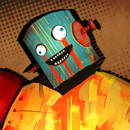

        ```
        You Want To Get Beat? Hurtily?: Ah. Ah.
        อยากจะโดนอัด? แบบเจ็บ ๆ หรือไง?: อ้า อ้า
        ```
        ```
        You Want To Get Beat? Hurtily?: Highly excited!!!
        อยากจะโดนอัด? แบบเจ็บ ๆ หรือไง?: ตื่นเต้นมาก!!!
        ```
        ```
        You Want To Get Beat? Hurtily?: Ahh~ 
        อยากจะโดนอัด? แบบเจ็บ ๆ หรือไง?: อ้าา~
        ```
        ```
        You Want To Get Beat? Hurtily?: Thoroughly amusing!!! 
        อยากจะโดนอัด? แบบเจ็บ ๆ หรือไง?: ชั่งรื่นรมณ์อะไรเยี่ยงนี้!!!
        ```
        ```
        You Want To Get Beat? Hurtily?: Da GAME of DEATH!
        อยากจะโดนอัด? แบบเจ็บ ๆ หรือไง?: เกมแห่งความตาย!
        ```

        ---

        

        ```
        Faust: ......
        เฟาสท์: ...... 
        ```

        ---

        

        ```
        You Want To Get Beat? Hurtily?: ATH.
        อยากจะโดนอัด? แบบเจ็บ ๆ หรือไง?: อัท
        ```
        ```
        You Want To Get Beat? Hurtily?: ATH!!
        อยากจะโดนอัด? แบบเจ็บ ๆ หรือไง?: อัท!!
        ```
        ```
        You Want To Get Beat? Hurtily?: ATH!!!! ATH!!!! ATH!!!!
        อยากจะโดนอัด? แบบเจ็บ ๆ หรือไง?: อัท!!!! อัท!!!! อัท!!!!
        ```

        ---

        

        ```
        Faust: Hm... It appears they redoubled excavation efforts from this point onward.
        เฟาสท์: หืม... ดูเหมือนว่าพวกเขาจะเร่งมือในการขุดเจาะเป็นสองเท่าตั้งแต่จุดนี้เป็นต้นไป
        ```
        ```
        Faust: I can’t think of any other reason to augment humans on a conveyor belt...
        เฟาสท์: ฉํนคิดเหตุผลอื่นไม่ออกเลยว่าทำไมถึงต้องติดมนุษย์เสริมเข้ากับสายพาน...
        ```

        ---

        

        ```
        Dante: <Yeah, yeah, I get it, now let’s move! They’re pointed right at us singing that spooky song!>
        ดันเต้: <ช่าย ช่าย เข้าใจเลย ทีนี้ก็รีบเร่งฝีเท้าได้แล้ว! มันกำลังมองมาที่เราพร้อม ๆ กับร้องเพลงชวนสยองนั่น!>
        ```

    ---

    * **Episode: 27 | ตอนที่ 27<br>Location: Casino Mine B3 | ใต้คาซิโน ชั้น บี3**

        

        ```
        Sinclair: Feels like it’s getting colder and colder.
        ซินแคร์: รู้สึกเหมือนกับว่ามันหนาวขึ้นเรือ่ย ๆ เลยนะครับ
        ```
        ```
        Sinclair: What’s up with all this ice around...?
        ซินแคร์: น้ำแข็งที่ติดรอบ ๆ พวกนี้คืออะไรกัน...?
        ```

        ---

        

        ```
        Faust: An increase in the frequency of anomalies should ideally be strong, positive reflections.
        เฟาสท์: การเพิ่มขึ้นของความถี่ในการปรากฎตัวของเหล่าสิ่งผิดปกติ ควรจะเป็นภาพสะท้อนเชิงบวกที่ชัดเจน
        ```

        ---

        

        ```
        Yi Sang: Did you call?
        ยี่ซัง: เมื่อกี้ เรียกฉันหรือเปล่า?
        ```

        ---

        

        ```
        Ishmael: ...Sigh. I hope that wasn’t your attempt at a joke. Thanks to you, I’m feeling even colder.
        อิชมาเอล: ...เห้อ หวังว่านั่นจะไม่ใช่มุขที่นายพยายามจะเล่นนะ ขอบคุณมาก เพราะที่นี้ฉันยิ่งรู้สึกหนาวกว่าเดิมอีก 
        ```

        ---

        

        * เสียงในหัว

            ```
            Putting aside Ishmael’s grievance, I thought about what Faust had said.
            นอกจากความไม่พอใจที่อิชมาเอลแสดงออกมา ฉันคิดเกี่ยวกับคำพูดที่เฟาสท์เคยพูดเอาไว้
            ```

        ```
        Dante: <...Because that means we’re getting close to the Golden Bough... right?>
        ดันเต้: <...ถ้างั้นนั่นก็หมายถึงพวกเรากำลังเข้าใกล้กิ่งทองแล้ว... ใช่ไหม?>
        ```

        * เสียงในหัว

            ```
            It was a pretty solid answer if I do say so myself.
            ถ้าจะให้ถามฉัน คำตอบมันก็ชัดอยู่แล้ว
            ```

        ---

        

        ```
        Faust: Yeah, sure.
        เฟาสท์: ใช่ค่ะ แน่นอน
        ```

        ---

        

        * เสียงในหัว

            ```
            But Faust’s reply was discouragingly dull, or at least that’s how I heard it.
            แต่คำพูดตอบกลับของเฟาสท์กลับทืออย่างน่าท้อใจ หรืออย่างน้อยที่สุดนั่นก็เป็นแบบที่ผมได้ยิน
            ```

    ---

    * **Episode: 28 | ตอนที่ 28<br>Location: Ice Castle Where Neighbors Lie | ปราสาทน้ำแข็งที่ซึ่งพี่น้องล่วงหล่น**

        
        
        * เสียงในหัว

            ```
            Before us stood a monumental castle of ice, and frozen pillars that seemed unbreakable.
            เบื้องหน้าเราปรากฎอนุสาวรีย์ปราสาทน้ำแข็งขนาดใหญ่ และเสาเข็มที่ถูกแช่แข็งที่ดูจะพังไม่ได้
            ```
            ```
            And there stood a person...
            แล้วก็ใครบางคนยืนอยู่...
            ```
            ```
            A man with hyaline hair, clear as ice, waiting for us.
            ชายผู้มีผมโปร่งแสง ใสสะอาดเฉดเช่นเดียวกับน้ำแข็ง กำลังรอพวกเรา
            ```

        ---

        

        ```
        Sonya: I came here often whenever I felt the need to clear my thoughts, even though there’s no rocking chairs or whisky you like...
        ซอนย่า: ฉันมักจะมาที่นี้ตอนที่ฉันรู้สึกว่าต้องการชะล้างความคิดของฉัน ถึงแม้ว่ามันจะไม่มีเก้าอี้โยก หรือเหล้าแบบที่เธอชอบ แต่...
        ```
        ```
        Sonya: The chill dominating this place pierces even the thickest coat. It helps me restore a lucid mind.
        ซอนย่า: กับความเย็นยะเยือกของที่นี้ที่เจาะทะลุได้แม้กระทั่งเสื้อโค้ตตัวหนา สิ่งนั่นมันช่วยให้ฉันฟื้นคืนสติ ให้จิตใจกลับมาปลอดโปรง
        ```

        ---

        

        * เสียงในหัว

            ```
            While the rest of us were frozen stiff, stuck watching, Rodya made a slow step forward to face him.
            ในขณะที่พวกเราที่เหลือกำลังยืนตัวแข็ง จ้องมองสิ่งที่เกิดขึ้น โรดย่าก้าวเท้าไปข้างหน้าอย่างช้า ๆ เพื่อเผชิญหน้ากับเขา
            ```

        ---

        

        ```
        Rodion: Didn’t expect you to be here first.
        โรเดียน: ไม่คิดเลยนะว่านายจะอยู่ที่นี้เป็นแรก 
        ```

        ---

        

        ```
        Sonya: My men and I knew of a shortcut leading here.
        ซอนย่า: คนของฉัน แล้วก็ฉันรู้ทางลัดที่นำมาที่นี้ดี
        ```
        ```
        Sonya: It was something we learned through the local ruffians, all in search of the whereabouts of a buried, great power, waiting to be used for the greater good.
        ซอนย่า: มันเป็นสิ่งที่เราเรียนรู้จากพวกอัธพาลเจ้าถิ่น ทั้งหมดนี้ก็เพื่อตามหาที่อยู่ของสิ่งที่ถูกฝัง พลังที่ยิ่งใหญ่ ที่กำลังรอที่จะถูกใช้เพื่อสิ่งที่ดีกว่า
        ```
        ```
        Sonya: Alas, this... area surrounding the Golden Bough was as far as we could go; we didn’t see any way to get closer.
        ซอนย่า: แต่น่าเสียดาย ที่... พื้นที่นี้ ที่ห้อมล้อมกิ่งทองมันไกลเกินกว่าที่เราจะเอี่อมถึง และเราก็ไม่เห็นทางที่จะไปใกล้ได้มากกว่านี้ 
        ```

        ---

        

        ```
        Rodion: Thought you’d never leave District 25, but seeing you now—resorting to the tactics gangsters would use—maybe you should’ve stayed a country boy.
        โรเดียน: เคยคิดว่านายจะไม่มีวันออกจากเขตที่ 25 ซะอีก แต่พอมาเห็นนายแบบนี้ที่—เปลี่ยนไปกลายเป็นพวกนักเลงจอมแผนการแล้ว—บางที ฉันก็คิดว่าว่านายควรเป็นแค่เด็กบ้านนอกแบบเดิมน่าจะดีกว่า
        ```
        ```
        Rodion: Sonya, your lackeys have been taking from shopkeeps who weren’t even rich to begin with.
        โรเดียน: ซอนย่า รู้บ้างไหม ลูกน้องของนายรีดไถกับพวกพ่อค้าแม่ค้าที่ไม่แม้แต่จะมีเงินตั้งตัวเลยด้วยซ้ำ
        ```

        ---

        

        ```
        Sonya: ...Did you know, Rodya? This was little more than a somewhat eccentric hollow with frosty walls.
        ซอนย่า: ...แล้วเธอรู้หรือเปล่าล่ะ โรดย่า? ว่าตอนแรกที่นี้ก็เป็นแค่กำแพงน้ำแข็งที่มีโพรงประหลาดก็เท่านั่น
        ```
        ```
        Sonya: Yet look at this. Now there’s a giant castle and thick columns of ice.
        ซอนย่า: แต่ลองมาดูนี้สิ ตอนนี้มันมีปราสาทยักษ์ และแนวน้ำแข็งหนา
        ```
        ```
        Sonya: This change happened the instant you walked in.
        ซอนย่า: นี้เปลี่ยนไปในทันทีที่เธอก้าวเท้าเข้ามา
        ```

        ---

        

        ```
        Rodion: ...You sound like you figured this would happen on my arrival. How’d you know?
        โรเดียน: ...นายพูดอย่างกับว่านายรู้อยู่แล้วว่าถ้าฉันมามันจะเกิดขึ้น นายรู้ได้ไง?
        ```

        ---

        

        ```
        Sonya: I have many sources... But that’s none of your business, Rodya.
        ซอนย่า: ฉันก็มีแหล่งข่าวที่ฉันรู้จักเยอะพอสมควร... แต่นั่นก็ไม่ใช่ธุระกงการอะไรของเธอ โรดย่า
        ```

        ---

        

        ```
        Rodion: What makes you so sure that I made this happen in the first place? I’m not some kinda Backstreets witch or anything.
        โรเดียน: แล้วอะไรทำให้นายแน่ใจกันว่านี้มันเกิดขึ้นเพราะฉัน? ฉันก็ไม่ใช่แม่มดแห่งเบลคสตรีทหรืออะไรอย่างงั้นนะ
        ```

        ---

        

        ```
        Sonya: It’s not hard at all to figure out. Observing those faces encased in ice says enough.
        ซอนย่า: เรื่องนั่นมันก็ไม่ยาก แค่เธอลองสังเกตหน้าเจ้าพวกนั่นที่ถูกแช่แข็งภายในน้ำแข็งก็น่าจะรู้แล้ว
        ```
        ```
        Sonya: Take a peek. They’re ones you loved yet looked down on, are they not?
        ซอนย่า: ลองดูสิ ทั้ง ๆ ที่เป็นคนที่เธอรักแต่พวกมันกลับดูถูกเหยียดหยามหยามเธอใช่ไหมล่ะ?
        ```

        ---

        

        ```
        Wicked Tax Collector: Two-fifty thousand Ahn.
        สรรพกรผู้ชั่วร้าย: สองแสนห้าหมื่นอาน
        ```

        ---

        

        ```
        Resident: That’s all it’s worth? It’s not possible...
        ผู้อยู่อาศัย: ทั้งหมดได้แค่นี้เองเหรอ? เป็นไปไม่ได้...
        ```

        ---

        

        ```
        Wicked Tax Collector: You said precisely why, though? Its age is showing in all the scratches and lack of polish.
        สรรพกรผู้ชั่วร้าย: ฉันว่าฉันก็อธิบายไปชัดเจนแล้วนะ? อายุของมันที่ปรากฎผ่านรอยขีดข่วน และการปราศจากการขัดเงาบ่งบอกว่ามันมีอายุ
        ```
        ```
        Wicked Tax Collector: To be frank, others wouldn’t pay any more than two hundred thousand for this.
        สรรพกรผู้ชั่วร้าย: บอกตามตรง คงไม่มีใครอยากจ่ายให้มากถึงสองแสนกับของกิ้งก้องแบบนี้หรอกนะ
        ```
        ```
        Wicked Tax Collector: And the rest... All worthless garbage.
        สรรพกรผู้ชั่วร้าย: และที่เหลือ... ก็เป็นขยะไร้ค่าทั้งหมด
        ```
        ```
        Wicked Tax Collector: That makes the taxes you owe four hundred thousand Ahn in total.
        สรรพกรผู้ชั่วร้าย: นั่นทำให้รวมทั้งหมดแล้วเธอยังติดหนี้ฉันอยู่อีกสี่แสนอาน
        ```

        ---

        

        ```
        Rodion: Why do the poor only grow poorer the harder they work?
        โรเดียน: ทำไมความยากจนถึงเอาแต่โตเอาโตเอาทุก ๆ ครั้งที่พวกเขาทำงานหนักขึ้น?
        ```
        ```
        Rodion: It’s ridiculous, isn’t it? While stacks of cash piled up in the pawnbroker’s vault...
        โรเดียน: ชั่งวิเศษไปเลยใช่ไหมล่ะ? ในขณะที่เงินเป็นฟ้อนถูกกองในห้องนีรภัยของโรงรับจำนำ...
        ```
        ```
        Rodion: Our neighborhood was being wrung dry, heirlooms weighed for what little monetary value they had.
        โรเดียน: ระแวกบ้านของเรากลับถูกคั้นจนแห้ง มรดกที่ถูกสืบทอดเองก็มีค่าแค่ไม่กี่กระตัง
        ```
        ```
        Rodion: Sonya rallied people, delivering speeches using big words.
        โรเดียน: ซอนย่ารวบรวมผู้คนด้วยคำพูดที่ดูใหญ่โต
        ```
        ```
        Rodion: They organized a group under the name of the ‘Yurodiviye’.
        โรเดียน: แล้วเขาก็ก่อตั้งกลุ่มภายใต้ชื่อ ‘ยูโรดิวี’
        ```
        ```
        Rodion: It went okay at first. Even the thickest folks were inspired by Sonya’s words to help the impoverished in the Backstreets.
        โรเดียน: ตอนแรกมันก็โอเค แม้แต่พวกรุ่นใหญ่ก็ยังคล้อยตามกับคำพูดของซอนย่า ที่ว่าจะช่วยเหลือปัญหาปากท้องในเบลคสตรีท
        ```
        ```
        Rodion: But, Sonya still had a dissatisfied expression.
        โรเดียน: แต่ซอนย่ากลับมีท่าทีที่ยังไม่พอใจ
        ```
        ```
        Rodion: Ultimately, the Yurodiviye warped into an organization that cared more for debating about how best to change the streets and the Nest, rather than going out to help those in need.
        โรเดียน: และในท้ายที่สุด ยูโรดิวีก็กลายสภาพเป็นองค์กรที่สนใจเพียงแค่วิธีการที่ดีที่สุดที่จะเปลี่ยนสตรีท และเนส แทนที่จะเป็นการช่วยเหลือเหล่าผู้คนยากไร้ที่ทุกข์ยาก
        ```
        ```
        Rodion: That’s why I left them.
        โรเดียน: เพราะงั้นฉันถึงทิ้งพวกเขา
        ```
        ```
        Rodion: Being an armchair revolutionary wasn’t going to feed our starving neighbors!
        โรเดียน: การเอาแต่นั่งวิจารณ์นู่นวิจารณ์นี้แล้วหวังให้เกิดการปฎิวัติ ไม่มีทางเลี้ยงปากท้องพี่น้องเราได้หรอก!
        ```

        ---

        

        ```
        Sonya: But I told you time and time again, Rodya. That we must wait for the right moment.
        ซอนย่า: แล้วฉันก็บอกเธอไปครั้งแล้วครั้งเล่า โรดย่า ว่าเราแค่ต้องรอจังหวะที่ถูกต้อง
        ```

        ---

        

        ```
        Rodion: Sonya, I’m sorry, but that “moment” you kept talking about...
        โรเดียน: ซอนย่า ฉันไม่อยากจะพูดแบบนี้เลย แต่ไอ “จังหวะ” ที่นายเอาแต่พร่ำบอกมาตลอด...
        ```
        ```
        Rodion: It didn’t come when the Yurodiviye’s youngest... when little Ivan had to sate his hunger with food from the garbage.
        โรเดียน: มันไม่ได้มาหลังจากที่หนูน้อยยูโรดิวีคนนั่น... ตอนที่อีแวนตัวน้อยต้องประทังความหิวโหยของตัวเองด้วยอาหารจากขยะ
        ```
        ```
        Rodion: Nor did it arrive after he suffocated to death.
        โรเดียน: และก็ไม่ใช่หลังจากที่เขาหายใจไม่ออกจนตาย
        ```

        ---

        

        ```
        Sonya: To achieve a monumental task, well-thought policies and a great power to carry them are required. All to make the redistribution of wealth happen.
        ซอนย่า: ในการที่จะทำงานชิ้นใหญ่ให้เสร็จสิ้น เราจำเป็นต้องมีนโยบายที่คิดมาอย่างดี และพลังอันยิ่งใหญ่เพื่อแบกรับพวกเขาเอาไว้ ทั้งหมดก็เพื่อเนรมิตให้การแจกจ่ายความมั่งคั่งอุบุติขึ้นอย่างแท้จริง
        ```
        ```
        Sonya: And in the process of moving towards progress, such minor troubles on a personal level are inevitable.
        ซอนย่า: และในระหว่างทางที่เราก้าวเดินไปข้างหน้า การเกิดปัญหาส่วนตัวเล็กน้อยก็เป็นสิ่งที่ไม่อาจเลี่ยงได้
        ```

        ---

        

        ```
        Rodion: That’s minor to you? The whole thing was personal, we started this to help others.
        โรเดียน: นั่นเล็กน้อยสำหรับนายเหรอ? ทุกสิ่งมันเป็นเรื่องส่วนตัวมาตั้งแต่วินาทีที่พวกเราตัดสินใจที่จะเริ่มช่วยคนอื่นแล้ว
        ```
        ```
        Rodion: What you and the Yurodiviye were doing wasn’t what I’d hoped for.
        โรเดียน: แต่สิ่งที่นายกับยูโรดิวีกำลังทำอยู่ ไม่ใช่สิ่งที่ฉันหวัง
        ```

        ---

        

        ```
        Sonya: Is that why you decided to take matters into your own hands?
        ซอนย่า: เพราะงั้นเธอเลยตัดสินใจที่จะจัดการเรื่องนี้ด้วยตัวเองเหรอ?
        ```

        ---

        

        ```
        Rodion: Absolutely. What our town needed...
        โรเดียน: ถูกต้อง สิ่งที่เมืองเราต้องการ...
        ```
        ```
        Rodion: Wasn’t an empty promise telling people to sit on their hands for who knows when.
        โรเดียน: ไม่ใช่คำมั่นสัญญากลวงโบ๋ที่เอาแต่บอกให้ผู้คนคอยนั่งอยู่เฉย ๆ รอคอยบางวันนั่นที่ไม่มีใครรู้ว่าจะมาถึงเมื่อไหร่
        ```
        ```
        Rodion: But someone who wouldn’t hesitate to pick up the axe.
        โรเดียน: แต่เพียงใครบางคนที่ไม่ลังเลที่จะทำอะไรสักอย่าง
        ```
        ```
        Rodion: I bet most of my neighbors had been starving for four nights straight that day.
        โรเดียน: ฉันพนันได้เลยว่าเหล่าพี่น้องแต่ละคนคงอดอยากเป็นเวลาไม่ต่ำกว่าสี่วันหลังจากวันนั่น
        ```
        ```
        Rodion: Yet the biting wind kept hounding without mercy, clawing at the chapped skin of the famished peasants.
        โรเดียน: แต่กระนั้นลมที่เกาะกัดยังคงโหมกระหน่ำอย่างไร้ความเมตตา ข่วนไปบนผิวหนังที่แตกกร้านของผู้คนที่หิวโหย
        ```
        ```
        Rodion: And I happened to know whose safe kept more than enough money to treat my neighbors to a feast for days and still be just as full.
        โรเดียน: และที่ฉันรู้พวกคนที่ปลอดภัยล้วนแล้วแต่มีเงินมากถึงขนาดที่อาจเลี้ยงปากท้องเหล่าพี่น้องของฉันไปได้หลายวันโดยที่พวกเขาไม่อดตาย
        ```

        ---

        
        
        ```
        Sonya: So, what did you do?
        ซอนย่า: แล้วเธอทำยังไงล่ะ?
        ```

        ---

        

        ```
        Rodion: ...Gimme a sec. Can’t I pull out of this now?
        โรเดียน: ...ให้เวลาฉันสักเดี๋ยว ทำไมฉันถึงยังออกไปตอนนี้ไม่ได้?
        ```

        ---

        

        ```
        Sonya: This is a confessional created for you as a result of the Golden Bough resonating with your psyche.
        ซอนย่า: นี้เป็นที่สารภาพบาปที่ถูกสร้างขึ้นมาสำหรับเธอ จากกิ่งทองที่สร้างภาพสะท้อนภายในจิตใจ
        ```
        ```
        Sonya: Moreover, a confessional’s purpose is to lead a sinner to the path of penance.
        ซอนย่า: อีกอย่าง ที่สารภาพบาปมีเป้าหมายเพื่อนำพาคนบาปไปสู่เส้นทางแห่งการยอมรับ
        ```

        ---

        

        ```
        Wicked Tax Collector: ... ...... ... .... ...... .. ....
        สรรพกรผู้ชั่วร้าย: ... ...... ... .... ...... .. ....
        ```

        ---

        

        ```
        Rodion: If only that old woman had changed her mind before it came to an end...
        โรเดียน: ก็ถ้าเกิดยายเฆ่าคนนั่นเปลี่ยนใจก่อนที่ทุกอย่างจะมาถึงจุดจบ...
        ```

        ---

        

        ```
        Sonya: But Rodya...
        ซอนย่า: แต่โรดย่า...
        ```
        ```
        Sonya: You must have known that a terminal leech upon her neighbors would never turn over a new leaf.
        ซอนย่า: เธอเองก็น่าจะรู้ว่า คนที่คอยเกาะกินคนรอบข้างไปทั่วอย่างนังนั่น ไม่มีทางที่จะกลับตัวกลับใจได้
        ```
        ```
        Sonya: You know she wasn’t the kind of person who’d give up that life to turn into a generous philanthropist.
        ซอนย่า: เธอรู้ว่านางนั่นไม่ใช่คนที่จะยอมทิ้งชีวิตแบบนั่นของตัวเองไปเพื่อเปลี่ยนเป็นคนใจบุญผู้โอบอ้อมอารี
        ```
        ```
        Sonya: You wouldn’t have knocked on her door with an axe in hand otherwise.
        ซอนย่า: ไม่อย่างนั่น เธอก็คงไม่ไปเคาะประตูบ้านของนางนั่นพร้อมกับขวานที่อยู่ในมือหรอก
        ```

        ---
    
        

        ```
        Wicked Tax Collector: Poor Rodion, dear, you seem to be under the delusion that you’re some sort of savior...
        สรรพกรผู้ชั่วร้าย: โรเดียนผู้น่าสงสาร ที่รัก ดูเหมือนว่าเธอจะหลงผิด คิดว่าตัวเองเป็นฮีโร่ผู้กอบกู้อะไรทำนองนั่น...
        ```
        ```
        Wicked Tax Collector: Demanding my money so brazenly to my face won’t change anything.
        สรรพกรผู้ชั่วร้าย: แต่การที่มาขอเงินฉันตรง ๆ ต่อหน้า ก็ไม่ได้เปลี่ยนอะไรหรอกนะจ๊ะ
        ```
        ```
        Wicked Tax Collector: You vermin are no different from the paupers in the Backstreets.
        สรรพกรผู้ชั่วร้าย: วัชพืชอย่างเธอก็ไม่ได้ต่างอะไรกับพวกขอทานที่อยู่ในเบลคสตรีท
        ```

        ---

        

        ```
        Rodion: That’s right.
        โรเดียน: ใช่แล้ว
        ```
        ```
        Rodion: I’m the one who put an axe through her head.
        โรเดียน: ฉันนี้แหละคือคนที่เอาขวานนั่นสับเข้าไปที่หัวของเธอ
        ```
        ```
        Rodion: Like cutting open the belly of the goose that laid golden eggs, I chopped that hag’s skull.
        โรเดียน: เหมือนการผ่าท้องห่านที่วางไข่ทองคำ ฉันสับกะโหลกของยายเฆ่าคนนั่นจนแน่นิ่ง
        ```
        ```
        Rodion: I mean, someone had to do it. Am I wrong?
        โรเดียน: ยังไงซะ ก็ต้องมีบางคนทำมันอยู่แล้ว งั้นฉันผิดหรือไง? 
        ```
        ```
        Rodion: Unlike the foolish cottager in the fable who gave in to greed and lost out on becoming richer...
        โรเดียน: ไม่เหมือนเจ้าของผู้โง่เขลาในนิทาน ผู้ยอมผลีกายให้ความโลภ และสูญเสียทุกสิ่งเพื่อรวยยิ่งขึ้น... 
        ```
        ```
        Rodion: We were overcome with hunger and misery, and could have gladly eaten out her brains.
        โรเดียน: พวกเราก้าวข้ามความหิวโหย และความทุกข์ยาก ปิติยินดีที่จะได้กินสมองของยายเฆ่าอย่างมีความสุข
        ```
        ```
        Rodion: And her “belly” was full of golden eggs, unlike that of the goose.
        โรเดียน: และ “ท้อง” ของเธอก็เต็มไปด้วยไข่ทองคำ ไม่เหมือนกับห่านที่อยู่ในนิทาน
        ```

        ---

        

        ```
        Sonya: Yes, the old lady you killed was a tax collector wielding considerable authority in District 25.
        ซอนย่า: ใช่ ยายเฆ่าที่เธอฆ่าเป็นคนเก็บภาษีผู้ถือครองอำนาจหลายประการในเขต 25
        ```
        ```
        Sonya: But what gave her so much power... was her sibling’s status as a member of the Middle.
        ซอนย่า: แต่สิ่งที่ทำให้เธอมีพลังมากขนาดนั่นไม่ใช่เธอ... แต่เป็นสถานภาพที่ญาติเธอเป็นหนึ่งในสมาชิกของเดอะมิลเดิล 
        ```

        ---

        

        ```
        Rodion: I... struck her down to save my dying neighbors. Is that so wrong?
        โรเดียน: ฉัน... แค่ฆ่าเธอก็เพื่อช่วยพี่น้องที่กำลังล้มตายของฉัน แล้วมันผิดขนาดนั่นเลยเหรอ?
        ```

        ---

        

        ```
        Sonya: No, you held that axe for your own good.
        ซอนย่า: ไม่ ที่เธอถือขวานนั่นทั้งหมดก็เพื่อผลประโยชน์ของเธอเอง
        ```
        ```
        Sonya: You couldn’t stand the fact that you weren’t anyone special.
        ซอนย่า: เธอยอมรับความจริงที่ว่าเธอไม่ใช่คนพิเศษไม่ได้
        ```
        ```
        Sonya: Did you know? The Middle... never lets anyone who touches their family go unpunished.
        ซอนย่า: เธอรู้หรือเปล่า? เดอะมิลเดิลน่ะ... ไม่เคยปล่อยใครก็ตามที่แตะต้องครอบครัวของพวกเขาไปโดยที่ไม่ลงโทษ
        ```
        ```
        Sonya: They aren’t too interested in finding *who* exactly did it; rather, they like to demonstrate clearly *what* happens to the poor fools that dare disturb them.
        ซอนย่า: พวกเขาไม่ได้สนใจที่จะหาว่า *ใคร* กันแน่เป็นคนทำ; แต่กลับกัน พวกเขาต้องการจะแสดงให้เห็นอย่างชัดเจนว่า *อะไร* จะเกิดขึ้นกับพวกโง่เง่าน่าสงสารที่บังอาจรบกวนพวกเขา
        ```
        ```
        Sonya: The Backstreets residents who’d tasted the joy of quality meat for the first time in their lives soon made towering cadaverous pillars out on the roads.
        ซอนย่า: ผู้อยู่อาศัยในเบลคสตรีทที่พึ่งลิ้มรสของเนื้อที่มีคุณภาพเป็นครั้งแรกในชีวิต ไม่นานก็ถูกฆ่าเป็นพะเนินกองซากศพบนถนน
        ```
        ```
        Sonya: Not much different from the car pagodas outside the casino.
        ซอนย่า: คล้ายกันกับเจดีย์รถข้างนอกคาซิโน
        ```
        ```
        Sonya: I’m well aware of how much pain and guilt you’ve been burdened with ever since then.
        ซอนย่า: ฉันรู้ดีถึงความเจ็บปวด และความรู้สึกผิดที่ฝังเธอไว้ตั้งแต่วันนั่น
        ```
        ```
        Sonya: Living with the realization that you really weren’t so different from the foolish cottager after all.
        ซอนย่า: การที่ต้องมีชีวิตอยู่โดยรู้ดีอยู่แก่ใจว่าสุดท้ายแล้วตัวเองก็ไม่ได้อะไรกับเจ้าของผู้โง่เขลา
        ```

        ---

        

        ```
        Rodion: Since that day... Nothing I held truly felt like it was mine.
        โรเดียน: ตั้งแต่วันนั่น... ไม่มีอะไรเลยทีฉันมีแล้วรู้สึกเป็นของตัวเอง
        ```
        ```
        Rodion: All because of me...
        โรเดียน: ทุกอย่างก็เป็นเพราะฉัน...
        ```

        ---

        

        ```
        Sonya: It’s all fine, Rodya.
        ซอนย่า: ไม่เป็นไร โรดย่า
        ```
        ```
        Sonya: For you see, Rodya.
        ซอนย่า: อย่างที่เธอเห็น
        ```
        ```
        Sonya: To change the world, I perused hundreds of books and thousands of documents...
        ซอนย่า: เพื่อที่จะเปลี่ยนโลก ฉันได้อ่านหนังสือเป็นร้อย ๆ เล่ม และเอกสารอีกพัน ๆ ฉบับ
        ```
        ```
        Sonya: And I met various people all around the City.
        ซอนย่า: และฉันก็พบผู้คนมากมายในเดอะซิตี้
        ```
        ```
        Sonya: Picturing a world where the oppressed can escape from the exploitative dominion of the ruling class and find liberation in the truest sense.
        ซอนย่า: วาดภาพโลกที่ผู้ถูกกดขี่สามารถหลีกหนีการปกครองอันเอารัดเอาเปรียบจากชนชั้นปกครอง และค้นหาการปลดแอกที่แท้จริง
        ```
        ```
        Sonya: To make that world a reality.
        ซอนย่า: เพื่อที่จะสร้างโลกนั่นให้เป็นจริง
        ```
        ```
        Sonya: However, the answer didn’t lie in changing what was already there. Once a page of history is written, there’s no way to go back and revise it.
        ซอนย่า: ถึงจะเป็นอย่างนั่น คำตอบกลับกลับไม่ได้อยู่กับการเปลี่ยนิ่งที่มีอยู่แล้ว ครั้นหน้าในประวัติศาสตร์ถูกเขียนไปแล้ว มันก็ไม่มีทางย้อนกลับไปแก้ไขมันได้อีก
        ```
        ```
        Sonya: Look. This is the world we can reach.
        ซอนย่า: ดูสิ นี้คือโลกที่เราจะเอี่อมถึง
        ```
        ```
        Sonya: A world... that can be created using the Golden Bough with which you resonated.
        ซอนย่า: โลกที่... ถูกสร้างขึ้นมาได้โดยใช้กิ่งทองที่สะท้อนตัวเธออยู่ 
        ```
        ```
        Sonya: May there be no one upon this earth suffering from starvation.
        ซอนย่า: ขออย่าให้มีใครบนโลกนี้ต้องทุกข์ทรมาณจากความหิวโหยอีก
        ```
        ```
        Sonya: May every individual enjoy the right to pursue psychological and intellectual delights.
        ซอนย่า: ขอให้ทุก ๆ คนรู้สึกเพลิดเพลินกับสิทธิ์ที่จะไล่ตามความสุขทั้งทางกาย และใจ
        ```
        ```
        Sonya: ...Join hands with me, and I’ll give you that world as a gift.
        ซอนย่า: ...เพียงจับมือฉันเอาไว้ และฉันจะมอบโลกใบนั่นให้เธอเป็นของขวัญ
        ```
        ```
        Sonya: As if nothing up to this point had ever happened at all.
        ซอนย่า: ประดั่งว่าทุกสิ่งทุกอย่างจนถึงจุดนี้ไม่มีอะไรเคยเกิดขึ้นมาก่อน
        ```

        ---

        

        ```
        Rodion: Ah.
        โรเดียน: อ้า
        ```
        ```
        Rodion: A feeling nobody else would understand.
        โรเดียน: ความรู้สึกที่มิอาจมีใครเข้าใจได้
        ```
        ```
        Rodion: Even a glimpse of that world felt so dreamlike.
        โรเดียน: แม้เพียงเสี้ยวเดียวของโลกนั่นก็ให้ความรู้สึกเหมือนความฝัน
        ```
        ```
        Rodion: I wanted to etch that mesmerizing instant into my memory.
        โรเดียน: ทำเอาซะ ฉันอยากที่จะสลักโลกทีชวนหลงไหลนั่นเข้าไปในความทรงจำ
        ```
        ```
        Rodion: If this was a dream, I’d even wish I was part of it so that I would never have to leave it.
        โรเดียน: ถ้านี้เป็นความฝัน ฉันก็คงขอให้ตัวเองเป็นส่วนหนึ่งของมัน เพื่อที่ฉันจะได้ไม่ต้องออกไปอีก
        ```
        ```
        Rodion: And yet...
        โรเดียน: แต่กระนั้น...
        ```
        ```
        Rodion: Sorry, I’m still turning down your offer.
        โรเดียน: ขอโทษนะ ที่ฉันต้องปฎิเสธข้อเสนอของนาย
        ```
        ```
        Rodion: How to put it...
        โรเดียน: จะว่าไงดีล่ะ...
        ```
        ```
        Rodion: I don’t wanna bathe in warmth just yet. I feel like I oughta be in this cold a bit longer.
        โรเดียน: ฉันยังไม่อยากอาบไออุ่น อย่างน้อย ๆ ก็ไม่ใช่ตอนนี้ ฉันรู้สึกว่าตัวเองควรจะอยู่ในหนาวเหน็บนี้ไปอีกสักพัก
        ```
        ```
        Rodion: Think I’ll stay this way until I find my answer to the question of when 
        it’ll be okay to warm myself.
        โรเดียน: คิดว่าฉันก็คงอยู่ต่อไปแบบนี้ จนกว่าตัวเองจะหาคำตอบของคำถาม ที่ว่าเมื่อไหร่มันถึงโอเคที่ฉันจะทำให้ตัวเองอุ่น
        ```
        ```
        Rodion: And also, Sonya...
        โรเดียน: และก็ซอนย่า...
        ```
        ```
        Rodion: You knew my temper would get the best of me and get me to kill her, didn’t you?
        โรเดียน: นายรู้ดีอยู่แล้วว่าสุดท้ายอารมณ์ของฉันจะเอาชนะฉันได้ และทำให้ฉันฆ่าเธอในท้ายที่สุด ใช่ไหมล่ะ?
        ```

        ---

        

        ```
        Sonya: ......
        ซอนย่า: ......
        ```
        ```
        Sonya: Rodya, this will probably elude you, but you don’t have the mark.
        ซอนย่า: โรดย่า เรื่องนี้อาจทำให้เธอสับสน แต่เธอไม่ไม่เครื่องหมายนั่น
        ```
        ```
        Sonya: I came here hoping to see you possess it, but I’m seeing it on a few of your friends instead.
        ซอนย่า: ฉันมาที่นี้หวังจะได้เห็นว่าเธอมีมันอยู่ แต่สิ่งที่ฉันเห็นกลับเป็นเพื่อน ๆ ของเธอแทน
        ```

        ---

        

        ```
        Rodion: The mark? What do you...
        โรเดียน: เครื่องหมาย? หมายความว่าไง...
        ```

        ---

        

        ```
        Sonya: Besides, you can’t see the mark, either. In other words... you don’t have what it takes to be a leader.
        ซอนย่า: อีกอย่างเธอก็มองไม่เห็นเครื่องหมายเหมือนกัน หรือจะให้พูดก็คือ... เธอไม่มีคุณสมบัติในการเป็นหัวหน้า
        ```
        ```
        Sonya: But I’m different. So, to make a better world—
        ซอนย่า: แต่ฉันน่ะแตกต่างออกไป เพราะงั้น เพื่อสร้างโลกที่ดีกว่า—
        ```

        ---

        

        ```
        Rodion: Yepper, I think I ‘member hearing you say something like that while sat at a desk buried in books.
        โรเดียน: ใช่แล้ว ฉันคิดว่าฉันจำได้ว่านายเคยพูดอะไรแบบนั่นตอนนั่งอยู่ที่โต๊ะที่เต็มไปด้วยกองหนังสือ
        ```
        ```
        Rodion: ...That’s why I can’t join you.
        โรเดียน: ...เพราะงั้น ฉันถึงร่วมกับนายไม่ได้
        ```
        ```
        Rodion: I still believe that it’s not big words behind closed doors that feed your neighbors.
        โรเดียน: ฉันยังคงเชื่อว่ามันไม่ใช่คำพูดใหญ่โตหลังบานประตูที่ถูกปิดที่เลี้ยงปากท้องของพี่น้อง
        ```
        ```
        Rodion: And as I’m sure you’ve learned by now...
        โรเดียน: และจากที่ฉันแน่ใจว่าตอนนี้นายคงรู้แล้ว...
        ```
        ```
        Rodion: There’s no way a rowdy rascal like me would fit under some dweeb’s leadership, right? Hahah!
        โรเดียน: ว่ามันไม่มีทางที่อันธพาลจอมเสเพอย่างฉันจะเข้ากับตำแหน่งผู้นำสุดเฉิ่มนั่นหรอก ใช่ไหม? ฮาฮ่า!
        ```

        ---

        

        ```
        Sonya: ......
        ซอนย่า: ......
        ```
        ```
        Sonya: The Golden Bough awaits inside the castle, Rodya.
        ซอนย่า: กิ่งทองรอเธออยู่ข้างในปราสาท โรดย่า
        ```
        ```
        Sonya: I hope you’ll be able to find what you seek.
        ซอนย่า: ฉันหวังว่าเธอจะเจอสิ่งที่เธอตามหา
        ```

        ---

        

        * เสียงในหัว

            ```
            We walked past Sonya, and then made our way into the icy castle he indicated.
            พวกเราเดินผ่านซอนย่าเข้าไปยังปราสาทน้ำแข็งที่เขาบอกก่อนหน้า
            ```

        ---

        **Location: Within the Ice Castle | ข้างในปราสาทน้ำแข็ง**

        ---

        

        * เสียงในหัว

            ```
            THOOM!
            ตูมมมม!
            ```

        ```
        Dante: <What the...?>
        ดันเต้: <อะไรกัน...?>
        ```

        * เสียงในหัว

            ```
            The castle trembles intensely as frosty rubble falls around us from above.
            ปราสาทสั่นอย่างรุนแรงจนเศษหินตกมารอบ ๆ ตัวพวกเราจากด้านบน
            ```

        ```
        Dante: <Wait, if this keeps up...>
        ดันเต้: <เดี๋ยว ขืนมันยังสั่นต่อไปแบบนี้...>
        ```

        * เสียงในหัว

            ```
            A foreboding idea flashes in my head.
            จู่ ๆ ลางสังหรณ์ก็แว่บเข้ามาในหัวของฉัน
            ```
            ```
            The ticking of my clock was like a reminder of how much time we had left.
            เสียงติ๊กของนาฬิกาฉันทำหน้าที่เหมือนกับสิ่งที่ช่วยเตือนใจว่าพวกเราเหลืออีกเวลาอีกมากแค่ไหน
            ```

        ```
        Dante: <Out... Outside, now!>
        ดันเต้: <ออกไป... ข้างนอก เดี๋ยวนี้!>
        ```

        ---

        **Location: Ice Castle Where Neighbors Lie | ปราสาทน้ำแข็งที่ซึ่งพี่น้องล่วงหล่น**

        ---

        

        * เสียงในหัว

            ```
            We evacuated from it in a hurry.
            พวกเราอพรพจากมันด้วยความเร่งรีบ
            ```

        ---

        

        ```
        Ishmael: ...Am I seeing this right?
        อิชมาเอล: ...นี้ฉันไม่ได้ตาฝาดไปใช่ไหม? 
        ```
        ```
        Ishmael: The castle isn’t falling apart, it’s like...
        อิชมาเอล: ปราสาทไม่ได้กำลังถล่ม แต่เหมือนกับ...
        ```

        ---

        

        ```
        Faust: Indeed, it’s most certainly rising to its feet.
        เฟาสท์: ใช่แล้ว มันต้องกำลังลุกขึ้นยืนอย่างแน่นอน
        ```

        ---

        

        ```
        Gregor: Don’t look back! Just run!
        เกรกอร์: อย่ามองกลับไป! วิ่งก็พอ!
        ```

        ---

        

        ```
        Dante: <Hoogh... Gahh... I, we ran quite a bit, but what now...?>
        ดันเต้: <ฮูว... แฮ่ก... *.เสียงหอบ* ฉัน พวกเราวิ่งมาสักพักแล้ว แต่นี้เสียงอะไรอีก...?>
        ```

        ---

        

        ```
        Meursault: Footfalls. Not of a human. Rather slow and heavy.
        เมอร์โซลท์: เสียงก้าวเท้า ไม่ใช่ของมนุษย์ ดูเชื่องช้า และหนักกว่า
        ```

        ---

        

        ```
        Ishmael: ...You could just say that something mammoth is after us!
        อิชมาเอล: ...นี้นายกำลังจะบอกว่ามีตัวอะไรสักอย่างขนาดเท่าแมมมอธตามเราอยู่งั้นรึไง!
        ```

        ---

        

        ```
        Meursault: That may have served better.
        เมอร์โซลท์: เป็นนั่นอาจจะดีกว่า
        ```

        ---

        

        ```
        Rodion: D—Dante! Our job here’s done, so we can just book it! Cool?
        โรเดียน: ด-ดันเต้! งานของเราที่นี้เสร็จแล้ว เพราะงั้นจองตั๋วบัสตอนนี้เลย! ได้ใช่ไหม?
        ```

        ---

        

        ```
        Dante: <G-Gimme a second! I never considered what to do after getting down here...>
        ดันเต้: <ห-ให้เวลาฉันเดี๋ยวเซ่! ฉันไม่ได้คิดว่าต้องทำอะไรเลยหลังจากที่ลงมาที่นี้...>
        ```

        ---

        

        ```
        Gregor: The bus... Where’s the bus?
        เกรกอร์: รถบัส... บัสอยู่ที่ไหน? 
        ```

        ---

        

        ```
        Heathcliff: Stop yapping useless rubbish! We’re running the hell away!
        ฮิธคลิฟฟ์: ช่วยหยุดเห่าคำพูดขยะไร้ประโยชน์สักทีจะได้ไหม! ยิ่งในขณะที่เรากำลังใส่เกียร์หมาวิ่งป่าราบอยู่! 
        ```
        
        ---

        
        
        ```
        Faust: That might be the first logical statement I’ve heard leave your mouth, Heathcliff.
        เฟาสท์: นั่นคงจะเป็นประโยคคำพูดที่มีเหตุผลประโยคแรกที่ฉันได้ยินออกมาจากปากของนายเลย ฮิธคลิฟฟ์:
        ```

        ---

        

        ```
        Heathcliff: ...I’m smashing your skull to pieces later.
        ฮิธคลิฟฟ์: ...ไว้จบเรื่องนี้่ก่อนเถอะ เดี๋ยวฉันจะเบิ่ดกะโหลกแกเป็นชิ้น ๆ 
        ```

    ---

    * **Episode: 29 | ตอนที่ 29<br>Location: Ice Castle Where Neighbors Lie | ปราสาทน้ำแข็งที่ซึ่งพี่น้องล่วงหล่น**

        

        ```
        Ishmael: I see the exit over there!
        อิชมาเอล: ฉันเห็นทางออกตรงนั่น!
        ```

        ---

        

        ```
        Heathcliff: Gah, persistent rotters.
        ฮิธคลิฟฟ์: อึก ไอพวกขี้แพ้จอมดื้อดึงเอ้ย
        ```

        ---

        

        ```
        Dante: <We’ll have to distract them somehow before we can get away...>
        ดันเต้: <พวกเราต้องหาวิธีเบี่ยงเบนความสนใจของพวกมันสักอย่าง ก่อนที่พวกเราจะหนีออกไปได้...>
        ```

        ---

        

        ```
        Ryoshu: Why don’t you throw one of us at ‘em? You can bring them back later anyway.
        เรียวชู: ทำไมนายไม่โยนพวกเราสักคนใส่มันล่ะ? ในเมื่อยังไงนายก็ดึงพวกเรากลับมาจากความตายได้อยู่แล้ว
        ```

        ---

        

        ```
        Sinclair: Why are you looking at me while you say that?!
        ซินแคร์: ทำไมถึงมองมาที่ผมตอนที่กำลังพูดอยู่ล่ะครับ?! 
        ```

        ---

        

        ```
        Sonya: Leave this to me.
        ซอนย่า: ปล่อยให้เป็นหน้าที่ฉันเอง
        ```

        ---

        

        ```
        Rodion: Sonya?! What are you playing at?
        โรเดียน: ซอนย่า?! นายคิดว่านายกำลังเล่นสนุกอะไรอยู่?
        ```

        ---

        

        ```
        Dante: <Rodya! What’s with your attitude? We have to take all the help we can get!>
        ดันเต้: <โรดย่า! ท่าทีอย่างนั่นของเธอคืออะไร? ตอนนี้พวกเราต้องให้ทุกคนมารวมพลังกันเพื่อเอาชีวิตรอดนะ!>
        ```

        ---
        
        

        ```
        Rodion: I’ve seen people who’d offer to help without asking for anything, and they’d usually have some ulterior motive.
        โรเดียน: ฉันเคยเห็นผู้คนที่เสนอตัวช่วยเหลือคนอื่นโดยไม่หวังผลตอบแทน และพวกเขาก็มักเป็นคนในแบบที่มีแรงจูงใจแอบแฝง
        ```

        ---

        

        ```
        Sonya: ......
        ซอนย่า: ......
        ```
        ```
        Sonya: It’s just like how you simply couldn’t hold yourself back from using your axe that day.
        ซอนย่า: มันเหมือนกับตอนที่เธอควบคุมตัวเองไม่ได้หลังจากที่ใช้ขวานเมื่อวันนั่น
        ```
        ```
        Sonya: I’m discovering that I might have a similarly... inexplicable drive pushing me.
        ซอนย่า: ฉันค้นพบว่าตัวเองก็อาจมีบางอย่างที่เหมือนกัน... บางอย่างที่คอยดันฉันไปข้างหน้าอย่างอธิบายไม่ถูก
        ```
        ```
        Sonya: Dante, I take it that your organization is working to make a better world in its own right, yes?
        ซอนย่า: ดันเต้ ถ้าฉันเข้าใจไม่ผิด องค์กรของนายกำลังทำงานเพื่อสร้างโลกที่ดีกว่าด้วยวิธีของตัวเองอยู่ใช่ไหม?
        ```

        ---

        

        ```
        Dante: <I... Uh-huh?>
        ดันเต้: <ฉัน... เออ-ฮะ?>
        ```

        * เสียงในหัว

            ```
            What does a better world entail?
            โลกที่ดีกว่าหมายถึงอะไร?
            ```
            ```
            For the first time, I was reminded that I had never questioned the motivations of Limbus Company.
            เป็นครั้งแรก ที่ฉันฉุกคิดว่าตัวเองไม่เคยตั้งคำถามกับแรงจูงใจของบริษัทลิมบัสเลยสักครั้ง
            ```
            ```
            Thankfully, none of my contemplative fudging reached Sonya, and he took my lack of a response as a sign of agreement.
            แต่ต้องขอบคุณ ที่ท่าทีครุ่นคิดอันดูเหลวไหลของฉันไปไม่ถึงซอนย่า และเขาก็ตี๋ ต่างท่าทางที่ไร้การแสดงออกของฉันเป็นสัญญะของคำตกลง    
            ```

        ---

        

        ```
        Sonya: Silence sometimes speaks volumes. I’ll take that as a positive.
        ซอนย่า: บางทีความเงียบก็พูดดังกว่าที่ได้ยิน ฉันจะเข้าใจว่าตกลงแล้วกันนะ
        ```
        ```
        Sonya: And one more thing... That child will soon visit you, too.
        ซอนย่า: แล้วอีกเรื่องหนึ่ง... อีกไม่นาน เด็กคนนั่นจะมาเยี่ยมคุณเหมือนกัน 
        ```

        ---

        

        ```
        Dante: <Child?>
        ดันเต้: <เด็กเหรอ?>
        ```

        ---

        

        ```
        Sinclair: Huh?
        ซินแคร์: ฮะ?
        ```

        ---

        

        ```
        Sonya: Ah... Sorry. My eyes must have fooled me. I thought I saw something on his forehead for a second...
        ซอนย่า: อ้า... โทษที ฉันคงตาถั่วไปเอง เมือกี้นี้ฉันนึกว่า ตัวเองเห็นอะไรอยู่บนหน้าผากเขาแปปนึ่งน่ะ...
        ```

        ---

        

        * เสียงในหัว

            ```
            Sonya nudges his chin at something behind him.
            ซอนย่าเชิดคางไปทางบางอย่างที่อยู่ด้านหลังเขา
            ```
            ```
            A faint light was shining between the fallen blocks of ice, giving a distinctive glow...
            แสงจาง ๆ เปล่งออกมาระหว่างบล็อกน้ำแข็งที่ถล่ม ปรากฎเรืองแสงเรืองที่เป็นเอกลักษณ์
            ```

        ```
        Dante: <The Golden Bough...>
        ดันเต้: <กิ่งทอง...>
        ```

        ---

        

        ```
        Sonya: Don’t expect me to act on the same impulse of kindness next we meet, though.
        ซอนย่า: ยังไงก็อย่าหวังให้ฉันใจดีอย่างครั้งนี้เมื่อเราเจอกันครั้งหน้าล่ะ
        ```
        ```
        Sonya: If a clear path towards prosperity of the many shows itself before my eyes, I’ll take it without hesitation.
        ซอนย่า: เพราะถ้าเส้นทางที่ชัดแจ้งโผล่ออกมาให้ฉันเห็นเมื่อไหร่ ฉันจะคว้าทางนั่นมาโดยไม่ลังแลอีก
        ```

        ---

        

        * เสียงในหัว

            ```
            After Sonya left us with a mysterious message, the Yurodiviye began to show up one after the other.
            หลังจากที่ซอนย่าทิ้งพวกเรากับข้อความสั่งเสียปริศนา พวกยูโรดีวีก็พากันปรากฎตัวคนแล้วคนเล่า
            ```
            ```
            Well... This may have been as good a time as any for touching farewells like “I won’t forget you!”
            ก็นะ... นี้ก็คงเป็นช่วงเวลาอันดีที่จะได้กอดลาพรางพูดอะไรที่มันโรแมนติกอย่างเช่น “ฉันจะไม่ทางลืมนาย!”
            ```
            ```
            ...Then I saw that Rodya was the first to sprint for the exit.
            ...ก่อนที่ฉันจะเห็นว่าโรดย่าเป็นคนแรกที่วิ่งไปยังทางออก
            ```

        ---

        

        ```
        Yi Sang: Rodion. Are you not concerned?
        ยี่ซัง: โรเดียน นี้เธอไม่เป็นห่วงหน่อยเหรอ?
        ```

        ---

        

        ```
        Rodion: What's up?
        โรเดียน: อะไรนะ?
        ```

        ---

        

        ```
        Yi Sang: Irrespective of consequential differences, he was nevertheless a friend of yours.
        ยี่ซัง: ถึงแม้ว่าผลสุดท้ายจะไร้ซึ่งความแตกต่าง แต่เขาก็เป็นถึงเพื่อนคนหนึ่งของเธอนะ
        ```

        ---

        

        ```ํ
        Rodion: Ah, that~ Eh, he’s a clever sort, so I’m sure he’ll figure out a way to live and all that jazz.
        โรเดียน: อ้า นั่นน่ะเหรอ! เออ เขาเป็นคนที่ฉลาด เพราะงั้นฉันเลยมั่นใจว่า ไม่ว่ายังไงเขาก็ต้องหาทางเอาตัวรอด และอะไรทำนองนั่น
        ```

        ---

        

        ```
        Yi Sang: ...Truly, an ideal form of friendship.
        ยี่ซัง: ...เป็นมิตรภาพในแบบอุมคติอย่างแท้จริง
        ```

        ---

        

        * เสียงในหัว

            ```
            Sometime later...
            ต่อมา...
            ```
            ```
            Though I was dead tired, Vergilius wouldn’t spare me from his fierce gaze until I gave him a brief verbal report of what we went through today.
            ถึงแม้ว่าฉันจะเหนื่อยเจียนตายแค่ไหน วอร์จิลิอุสก็ไม่ปราณีฉันจากสายตาที่เต็มไปด้วยความโกรธแค้นของเขา จนกระทั่งฉันรายงานปากเปล่าเกี่ยวกับสิ่งที่ต้องเผชิญในวันนี้
            ```

        ---

        **Location: Aboard Mephistopheles | บนรถเมฟิสโตเฟเลส**

        ---

        

        ```
        Vergilius: ...I see, so that’s your story. There’s just one thing that bothers me, though.
        วอร์จิลิอุส: ...เข้าใจแล้ว ว่านั่นเป็นเรื่องราวของนาย แต่มีเรื่องเดียวที่ยังตะกิดใจฉันอยู่
        ```
        ```
        Vergilius: This man... Sonya, was it? His actions during those final moments don’t quite seem to match the beliefs he told you.
        วอร์จิลิอุส: ผู้ชายคนนั่น... ซอนย่า ใช่ไหม? การกระทำของเขาในโค้งสุดท้ายพวกนั่น ดูไม่เข้ากับความเชื่อที่เขาบอกนายเลยสักกะนิด
        ```
        ```
        Vergilius: Which is why we should scrutinize his true intentions...
        วอร์จิลิอุส: ซึ่งเป็นเหตุผลว่าทำไมเราถึงควรกลั่นกลองความตั้งใจแท้จริงของเขา
        ```

        ---

        

        ```
        Rodion: Hey, time out, tiiime out!!!
        โรเดียน: เฮ้ เวลานอก เวววลานอก!!! 
        ```
        ```
        Rodion: First Yi Sang, and now you too? Why does everyone care more about Sonya than me? The bottom line is that we got the Golden Bough.
        โรเดียน: ตอนแรกก็ยี่ซัง แล้วตอนนี้ก็นายอีกเหรอ? ทำไมทุกคนถึงเอาแต่แคร์ซอนย่ามากกว่าฉัน? ทั้ง ๆ ที่เส้นใต้ก็ขีดสรุปไว้ชัดเจนอยู่แล้ว ว่าในท้ายที่สุดเราได้กิ่งทองมา
        ```
        ```
        Rodion: As a plus... Check this out, everyone~
        โรเดียน: นอกจากนี้... ดูนี้สิทุกคน~
        ```

        ---

        

        * เสียงในหัว

            ```
            From her pockets, Rodya pulled out a colorful bunch of gaming chips in her hands.
            ทันใดนั่น โรดย่าก็หยิบชิปเล่นเกมสีสันสดใสเต็มกำมือจากกระเป๋าเสื้อ
            ```

        ---

        

        ```
        Rodion: We can exchange these cuties for cash at any casino, so we should drop by one.
        โรเดียน: เราแลกเปลี่ยนเจ้าพวกน่ารักพวกนี้เป็นเงินได้ทุกคาซิโน เพราะงั้นเราจะแวะสักที่
        ```
        ```
        Rodion: I nabbed ‘em while our manager dazzled the floor with their jackpot.
        โรเดียน: ฉันแอบหยิบพวกมันมาในตอนที่คุณผู้จัดการของเราเป็นลมกับเจ็คพ็อตแตก
        ```

        ---

        

        ```
        Dante: <I’m impressed that you thought to snatch that stuff amidst all the chaos.>
        ดันเต้: <ฉันขอซูฮกเธอจริง ๆ ที่คิดเรื่องจิ๊กของพวกนี้ท่ามกลางความโกลาหลที่เกิดขึ้นทั้งหมด>
        ```

        ---

        

        ```
        Rodion: Well, Verg? What do you say to a juicy serving of prime sirloin steak to celebrate our abounding success today?
        โรเดียน: งั้น วอร์ค? นายว่าไงถ้าจะให้เราได้กินสเต็กสันนอกชั้นดีเป็นการฉลองสำหรับความสำเร็จครั้งยิ่งใหญ่ในวันนี้?
        ```

        ---

        

        ```
        Vergilius: ...What do you think, Charon?
        วอร์จิลิอุส: ...เธอคิดว่าไงล่ะ ชารอน?
        ```

        ---

        

        ```
        Charon: ...Mmm.
        ชารอน: ...อืมมม
        ```
        ```
        Charon: Seems Mephi wants it too. Fresh, succulent, juicy meat.
        ชารอน: ดูเหมือนว่าเมฟิสเองก็อยากกินเหมือนกัน เนื้อสด ๆ ชุ่มฉ่ำ
        ```

        ---

        

        ```
        Gregor: Gah, of all the things you could mention...
        เกรกอร์: เห้อ ในบรรดาสิ่งที่เธอพูดได้...
        ```

        ---

        

        ```
        Vergilius: Alright, then. I’ll leave Rodion to pick a restaurant in District 10 for us.
        วอร์จิลิอุส: ก็ได้ ถ้างั้น ฉันจะให้โรเดียนเลือกร้านในเขต 10 ให้เรา
        ```

        ---

        

        ```
        Charon: Okay. Vroom-vroom.
        ชารอน: โอเค บรึ้น-บรึ้น
        ```

        ---

        
        
        ```
        Rodion: Now we’re talking, Verg.
        โรเดียน: อย่างนี้สิค่อยเข้าท่า วอร์ค
        ```
        ```
        Rodion: After all’s said and done...
        โรเดียน: หลังจากทุกอย่างจบลงแล้ว...
        ```

        ---

        

        * เสียงในหัว

            ```
            Beneath her grin, Rodya’s eyes were shaking with distress, but she soon covers it up with a guise of joviality as if nothing ever happened.
            ภายใต้รอยยิ้มกว้างของเธอ สายตาของโรดย่าสั่นไปมาด้วยความทุกข์ แต่ไม่ทันไรเธอก็ปกปิดมันด้วยหน้ากากที่เรียกว่าความร่าเริงประดั่งว่าไม่มีอะไรเกิดขึ้น
            ```

        ---

        

        ```
        Rodion: I’m pretty rad, aren’t I?
        โรเดียน: ฉันนี้โคตรเท่เลยว่าไหม?/ฉันเจ๋งไปเลยใช่ไหมล่ะ
        ```

        ---

        **Location: Somewhere in the Backstreets | สักที่ในแบลคสตรีท**

        ---

        

        ```
        Hermann: Impressive, Yurodivy.
        เฮอแมน: ยอดเยี่ยมมาก ยูโรดิวี
        ```
        ```
        Hermann: Not only did you manage to clear out the legion of foes...
        เฮอแมน: ไม่ใช่แค่พวกเธอสามารถจัดการกับพยุหะอริศัตรูของเราได้...
        ```
        ```
        Hermann: You also burned all that cash.
        เฮอแมน: พวกเธอยังเผาเงินทั้งหมดพวกนั่นไปได้อีกด้วย
        ```

        ---

        

        ```
        Sonya: You should know, Hermann, that I’ve never been friends with money.
        ซอนย่า: คุณควรรู้ไว้นะครับ คุณเฮอแมน ว่าผมไม่เคยเป็นเพื่อนกับเงิน
        ```

        ---

        

        ```
        Hermann: I will admit, you are not like most idealists who are all theory and no action.
        เฮอแมน: ฉันคงต้องยอมรับว่า เธอไม่เหมือนกับนักอุมคติพวกนั่นที่มีดีแต่ทฤษฎีแต่อ่อนปฎิบัติ
        ```
        ```
        Hermann: You would’ve earned my praise had you secured the Golden Bough on top of everything.
        เฮอแมน: และเธอก็ควรได้รับคำชมจากฉันหากแต่เธอสามารถเก็บกู้กิ่งทองนอกเหนือจากความดีทั้งหมดนั่น
        ```

        ---

        

        ```
        Sonya: ...I showed Rodya that world.
        ซอนย่า: ...ผมแสดงโลกนั่นให้กับโรดย่า 
        ```
        ```
        Sonya: The ideal reality that fascinated me.
        ซอนย่า: ความเป็นจริงในอุมคติที่ทำให้ผมหลงใหล
        ```
        ```
        Sonya: Alas...
        ซอนย่า: แต่น่าเศร้า...
        ```

        ---

        
        
        ```
        Hermann: I suppose it didn’t win her over.
        เฮอแมน: ฉันเดาว่ามันคงไม่ชนะใจเธอ
        ```

        ---

        

        ```
        Sonya: It seems the method you suggested was wrong after all, Hermann.
        ซอนย่า: มันดูเหมือนว่าวิธีที่คุณแนะนำมาสุดท้ายแล้วก็ผิดอยู่ดีนะ คุณเฮอแมน
        ```
        ```
        Sonya: She wasn’t the kind of person to let a few words change her mind.
        ซอนย่า: เธอไม่ใช่คนประเภทที่จะปล่อยให้คำพูดไม่กี่คำเปลี่ยนความคิดของเธอได้
        ```

        ---

        

        ```
        Hermann: So, do you find this... regrettable?
        เฮอแมน: แล้วเธอมองว่านี้เป็นเรื่อง... น่าเสียดายไหมจ๊ะ?
        ```

        ---

        

        ```
        Sonya: Well...
        ซอนย่า: ก็นะ...
        ```
        ```
        Sonya: Part of me might’ve wished that she’d follow me like in the past.
        ซอนย่า: ส่วนหนึ่งของผมลึก ๆ แล้วคงหวังให้เธอกลับมาตามผมเหมือนเมื่อก่อน
        ```
        ```
        Sonya: But no, I think I’m actually relieved to find that she’s the same as before.
        ซอนย่า: แต่ไม่ ผมคิดว่าตัวเองรู้สึกโล่งใจที่รู้ว่าเธอยังเป็นเธอคนเดิมเหมือนเมื่อก่อน
        ```
        ```
        Sonya: Rodya wasn’t wishing for a perfect world with no flaws whatsoever.
        ซอนย่า: โรดย่าไม่ได้หวังโลกที่สมบูรณ์แบบที่ไร้ซึ่งข้อบกพร่องใด ๆ ทั้งนั่น 
        ```
        ```
        Sonya: Rather, she might have felt...
        ซอนย่า: กลับกัน เธอคงรู้สึก...
        ```
        ```
        Sonya: That it would be boring to live in such a world, since there’d be no way to affirm that she’s special.
        ซอนย่า: ว่ามันน่าเบื่อที่จะใช้ชีวิตในโลกแบบนั่น เพราะมันคงไม่มีทางที่เธอจะยืนกรานว่าตัวเองเป็นคนพิเศษ
        ```
        ```
        Sonya: That’s the impression I got.
        ซอนย่า: นั่นคือความประทับใจที่ผมได้รับ
        ```

        ---

        

        ```
        Hermann: I thought her to be a woman of virtue, principles unshakable...
        เฮอแมน: ฉันก็นึกว่าเธอจะเป็นผู้หญิงที่เปี่ยมไปด้วยคุณธรรม เป็นรากฐานที่มิอาจสั่นคลอนได้ซะอีก...
        ```
        ```
        Hermann: But hearing this, she was a dreamer just like you, wasn’t she?
        เฮอแมน: แต่พอได้ยินแบบนี้ เธอเองก็เป็นแค่คนชั่งฝันเหมือนกับเธอเลยเนอะ?
        ```

        ---

        

        ```
        Sonya: She still has a long way to go, I’m sure.
        ซอนย่า: ผมมั่นใจว่า เธอยังมีเส้นทางอีกยาวไกลที่ต้องไป 
        ```
        ```
        Sonya: ...She won’t want to admit it, though.
        ซอนย่า: ...ถึงอย่างนั่น เธอก็ไม่อยากที่จะยอมรับมัน
        ```

        ---

        

        ```
        Hermann: I got your point. I’ll keep it in mind for future considerations on our course of action.
        เฮอแมน: ฉันเข้าใจสิ่งที่เธอจะสื่อ เอาเป็นว่าฉันจะเก็บเรื่องนี้ไปคิดสำหรับกำหนดแนวทางต่อจากนี้ของพวกเรา
        ```

        ---

        

        ```
        Sonya: You won’t scold me for this? I was unable to complete the job you gave me.
        ซอนย่า: คุณไม่ดุผมเรื่องนี้เหรอ? ในเมื่อผมไม่สามารถทำงานที่คุณมอบหมายให้สำเร็จลุล่วงได้
        ```
        
        ---

        

        ```
        Hermann: Reprimands won’t make the Bough appear at our feet, will they?
        เฮอแมน: การตำหนิไม่ช่วยให้กิ่งมาอยู่ที่เท้าของเราหรอก ใช่ไหมจ๊ะ?
        ```
        ```
        Hermann: It’s fine. Wherever the Boughs may be right now...
        เฮอแมน: มันเป็นเรื่องช่วยไม่ได้ ไม่ว่าตอนนี้กิ่งจะอยู่ไหนก็ตาม...
        ```
        ```
        Hermann: What matters more is who claims the bundle at the end.
        เฮอแมน: สิ่งที่สำคัญกว่าก็คือในตอนจบใครจะเป็นผู้ครอบครองทุกสิ่ง
        ```
---

### เพิ่มเติม
* <*ยังไม่เสร็จ> หมายถึง ยังไม่ครบถ้วนหรือยังขาดหายเนื้อหาบางส่วนอยู่
* <*รูปภาพ> หมายถึง มีการใช้รูปภาพภายในข้อความแล้วไม่สามารถใส่ได้ไม่ว่ากรณีใดก็ตาม
* <*ไม่แน่ใจ> หมายถึง บทสนทนาที่แปลหรือประโยคคำพูดที่อาจไม่ตรงตามวัตถุประสงค์หรือบริบท์แท้จริง
* <*ระดับภาษา> หมายถึง บทสนทนนาที่เแปลแล้วอาจไม่ตรงบริบทของตัวละครในเชิงของระดับภาษา เช่น สรรพนามที่ใช้เรียกตัวเองหรือผู้อื่น คำลงท้ายประโยค