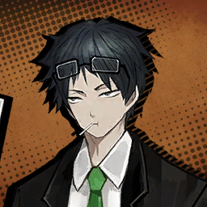
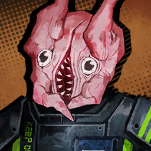
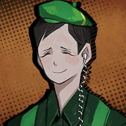
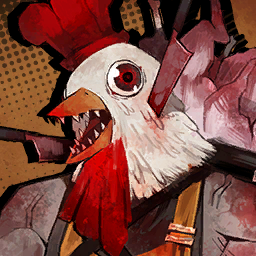
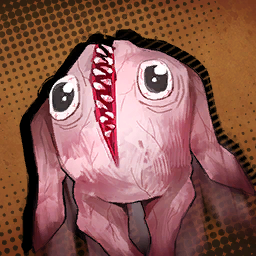
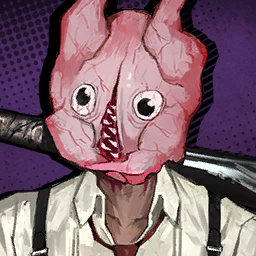
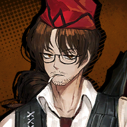

### Chapter 3.5

---

* ***Hell's Chicken*** **(ไก่นรก)**

    * **Episode: 1 | ตอนที่ 1<br>Location: Nest K Downtown Alley | ตรอกซอกซอยย่านใจกลางเมืองเนสเค**

        

        ```
        Faust: Off the bus, everyone. This is where we’re supposed to meet the client for our next mission.
        เฟาสท์: ลงบัสได้ทุกคน ที่นี้คือที่ที่เราจะมาพบกับลูกค้านายจ้างภารกิจต่อไป
        ```

        ---

        

        ```
        Heathcliff: Gimme a break. Now we’re taking requests like we’re frou-frou errand boys?
        ฮิธคลิฟฟ์: ไม่เอาน่า นี้เราต้องลดตัวไปคอยรับใช้และทำตามคำสั่งคนอื่นตั้งแต่เมื่อไหร่กัน?
        ```

        ---

        

        ```
        Gregor: Hm? Say, what’s that over there? It’s got a long line in front of it.
        เกรกอร์: หืม? นี้ ตรงนั่นอะไรน่ะ? ดูท่าคนจะยืนต่อแถวยาวซะจนยืดออกมาจากร้านเลยนะนั่น 
        ```

        ---

        

        ```
        Rodion: Ahh~ Can’t you recognize this stirring scent? It’s fried chicken, Greg!! Deep fried chicken brought to a crisp in expensive oil!
        โรเดียน: อ้าา~ นายจำกลิ่นที่ปลุกเร้าอารมณ์ของมันไม่ได้หรือไง? มันคือไก่ทอดไงล่ะ เกรก!! ไก่ที่อาบชะโลมไปด้วยน้ำมันราคาแพงจนกรอบไปทั้งตัว!
        ```

        ---

        

        ```
        Samjo: It seems you haven’t seen much of Nest K if you have yet to learn of Bodhisattva Chicken, the hottest trend around these parts.
        แซมโจ: ดูเหมือนว่าพวกคุณจะยังไม่ได้เที่ยวชมเนสเคมากถึงขนาดนั่นนะครับ ถ้าพวกคุณยังไม่รู้จักอาหารที่เรียกว่าไก่โพธิสัตว์ อาหารที่เป็นที่นิยมในย่านแถวนี้
        ```

        ---

        

        * เสียงในหัว

            ```
            A man with a fastidious impression suddenly cut in on the Sinners’ conversation as if he belonged to our group.
            ชายที่ดูจู้จี้จุกจิกปรากฎตัวอย่างกระทันหันผ่ากลางบทสนทนาของเหล่าคนบาป ราวกับว่าตัวเองเป็นคนที่อยู่ในกลุ่ม
            ```

        ---

        

        ```
        Hong Lu: Oho… Bodhisattva Chicken, is it? What is that?
        ฮงหลู่: โอ้โห... ไก่โพธิสัตว์หรือขอรับ? มันคืออะไร?
        ```

        ---

        

        ```
        Samjo: Permit me… to answer.
        แซมโจ: ขออนุญาติ... ให้ผมตอบด้วย 
        ```
        ```
        Samjo: Bodhisattva Chicken is a highly renowned restaurant known for its six-legged, eight-winged poultry whose blissful tastes and gracious quantities really make you feel great compassion.
        แซมโจ: ไก่โพธิสัตว์เป็นร้านอาหารที่มีชื่อเสียงเลื่องลือในเรื่องไก่หกขา สัตว์แปดปีกที่แทรกทุกอณูไปด้วยรสชาติแห่งความสุข และปริมาณที่เปี่ยมล้นไปด้วยเมตตา ที่จะทำให้คุณลูกค้ารู้สึกถึงความเห็นอกเห็นใจจากเพื่อนมนุษย์อย่างแท้จริง
        ```
        ```
        Samjo: What’s more, they’re prepared for every preference. The buzzworthy biddy with the right amount of tenderness, the chubby capon with plentiful flesh to dig into, the chewy cockerel that’s perfectly al dente, and more. Now tell me, what do you want?
        แซมโจ: มากกว่าไปกว่านั่น พวกเขายังเตรียมพร้อมทุกระดับประทับใจ ไม่ว่าจะเป็นมนุษย์ป้าที่กำลังเป็นที่ฮือฮากับชิ้นเนื้อที่ระดับความนุ้มพอเหมาะ หรือจะเป็นเจ้าไก่อ้วนกับชิ้นเนื้อแน่นแปล้จนเต็มคำ ไก่หนุ่มเนื้อเหนียวหนึบที่สุกกำลังดีแบบอัลเดนเต และอีกมากมาย ทีนี้ก็บอกผมหน่อยสิว่าคุณต้องการแบบไหน?
        ```

        ---

        

        ```
        Yi Sang: …I may have heard of it erst.
        ยี่ซัง: ...เหมือนว่าตัวเราจะเคยได้ยินเกี่ยวกับที่นั่นในอดีตแฮะ
        ```

        ---

        

        ```
        Rodion: Isn’t this a surprise~ Our Yi Sang of all people is keeping up with the fads from under his rock?
        โรเดียน: โอ้ นับเป็นเรืองเซอร์ไพรส์เลยนะนั่น~ ที่ยี่ซังของเรายังตามเทรนด์ได้ ทั้ง ๆ เอาแต่เก็บตัวอยู่ใน หิน/กะลา?
        ```

        ---

        

        ```
        Heathcliff: …So what’re you supposed to be?
        ฮิธคลิฟฟ์: ...เออ แล้วแกเป็นใครกันมิทราบ?
        ```
        ```
        Heathcliff: Can hazard a guess you don’t know who we are either, seeing as you brazenly shoved yourself in while we’re talking.
        ฮิธคลิฟฟ์: พนันได้เลยว่าแกเองก็ไม่รู้ด้วยซ้ำว่าพวกเราเป็นใคร เพราะแกดันหน้าด้านแทรกเข้ามาตอนที่พวกเรากำลังคุยกันอยู่
        ```

        ---

        

        ```
        Ishmael: …Can you even explain who we are?
        อิชมาเอล: ...นายพอจะอธิบายได้บ้างไหมว่าพวกเราเป็นใคร?
        ```

        ---

        
        
        ```
        Samjo: Gracious, what could those things roaming around the restaurant possibly be? They don’t appear very normal to me.
        แซมโจ: ให้ตาย! ทำไมจู่ ๆ ถึงมีเจ้าพวกนั่นถึงเดินไปเดินมา รอบ ๆ ร้านได้ล่ะเนี้ย? ปกติพวกมันไม่เคยโผล่หัวมาเลยไม่ใช่หรือไง
        ```

        ---

        

        * เสียงในหัว

            ```
            Turning around, I spotted rather strange-looking people with just as strange behavior.
            พอหันกลับไป ผมก็เจอผู้คนที่ดูนค่อนข้างแปลกที่มาพร้อมกับพฤติกรรมประหลาด
            ```
        
        ```
        Dante: <I–Isn’t that K Corp’s staff…? What are they doing?>
        ดันเต้: <ม-ไม่ใช่ว่านั่นคือเจ้าหน้าที่ของเคคอร์ปเหรอ...? พวกเขากำลังทำอะไร?>
        ```

        ---

        

        ```
        Meursault: I see individuals covering their heads with strange masks.
        เมอร์โซลท์: จากตรงนี้ ผมมองเห็นกลุ่มบุคคลที่ปกปิดใบหน้าของพวกเขาด้วยหน้ากากประหลาดบางอย่างครับ
        ```

        ---

        

        ```
        Sinclair: M—Maybe they’re some kind of mascot? It could be pretty cute when we look up close…
        ซินแคร์: บ-บางทีหน้ากากพวกนั่นอาจเป็นมาสคอตอะไรแบบนั่นก็ได้นะครับ? มันก็ดูค่อนข้างน่ารักเวลาเราลองมองใกล้ ๆ... 
        ```

        ---
    
        

        ```
        Ishmael: Those “mascots” have people running and screaming, though?
        อิชมาเอล: อ้า... แล้วทำไม ไอ “มาสคอต” พวกนั่นถึงกำลังทำให้ผู้คนวิ่งหนี และกรีดร้องด้วย? 
        ```

        ---

        

        ```
        Gregor: Seems a bit off, but let’s leave ‘em be. Doesn’t look like they’re coming this way, and I don’t particularly feel like getting wrapped up in something bothersome—
        เกรกอร์: มีบางอย่างแปลกออกไป แต่ชั่งหัว เขา/มัน ไปเถอะ พวกมันเองก็ไม่ได้กำลังมาทางนี้ และฉันก็ไม่ได้รู้สึกว่าพวกเรากำลังตกอยู่ภายใต้สถานการณ์ที่ยากลำบากอะไ—
        ```

        ---

        

        ```
        Samjo: You’re right. They aren’t necessarily approaching us.
        แซมโจ: คุณพูดถูก พวกเขาไม่ได้กำลังเจาะจงมาทางพวกเราจริงด้วย
        ```

        ---

        

        ```
        Gregor: And just what are you up to with that rock from the roadside, mysterious fella?
        เกอรกอร์: และคนที่แอบอยู่หลังโขดหินตรงริมถนนตรงนั่น แกมัวทำอะไรของแกอยู่น่ะไอเพื่อนจอมลึกลับ?
        ```

        ---

        

        ```
        Chickenhead: !
        มนุษย์หัวไก่: !
        ```

        ---

        

        ```
        Dante: <What in the world did you do?!>
        ดันเต้: <นายทำบ้าอะไรของนายน่ะ?!>
        ```

        * เสียงในหัว

            ```
            Hit by the rock, it started looking around…
            เมื่อโดนหินที่ปาใส่ มันเริ่มที่จะมองไปรอบ ๆ...
            ```
            ```
            Then, it began to slowly shamble in our direction.
            ก่อนที่มันจะค่อย ๆ เดินอย่างโซซัดโซเซมาทางพวกเรา
            ```

        ---

        

        ```
        Chickenhead: Giiiii... Giiii...
        มนุษย์หัวไก่: ก-กกี้... ก-กี้... 
        ```

        ---

        

        ```
        Samjo: Yikes, I’ve made such a clumsy mistake. What will we do?
        แซมโจ: เวรแล้วไง ผมดันซุ่มซ่ามทำพลาดไปซะแล้ว เราจะทำไงดี?
        ```

        ---

        

        ```
        Rodion: Likely story, kozyol… You aimed straight for its head…
        โรเดียน: ใครจะไปเชื่อเรื่องหลอกเด็กนั่นกันล่ะ เจ้าทึ่ม... ก็นายเล่นเล็งไปที่หัวมันเลยไม่ใช่หรือไง...   
        ```

        ---

        

        ```
        Hong Lu: Wow~ Your form was impressively stable.
        ฮงหลู่: ว้าว~ รูปโฉมของท่านช่างหนักแน่นน่าประทับใจจัง
        ```

        ---

        

        ```
        Samjo: Why thank you. I once aspired to be a big-City baseball player.
        แซมโจ: โอ้ ขอบคุณครับ พอดีว่าครั้งหนึ่ง ผมเคยฝันว่าอยากเป็นนักเบสบอลในลีกใหญ่ด้วยน่ะครับ
        ```

        ---

        

        ```
        Ryoshu: I’ll play ball with you alright. Stay right there so I can knock your noggin outta the park.
        เรียวชู: ฉันจะเล่นเบสบอลกับนายเอาไหม เดี๋ยวนายช่วยยืนนิ่ง ๆ อยู่ตรงนั่น แล้วฉันจะได้ฟาดหัวนายออกจากที่ให้ดูเอง
        ```

        ---

        

        ```
        Samjo: They’re approaching faster now. Shouldn’t you deal with them first before working up a slugger with my head?
        แซมโจ: พวกมันกำลังเข้ามาเร็วขึ้นแล้วนะครับ ไม่ใช่ว่าพวกคุณควรที่จะจัดการกับพวกมันก่อนที่จะมาตีหัวผมหรอกเหรอครับ?
        ```

        ---

        

        * เสียงในหัว

            ```
            As Ryōshū furiously reached for her sheath, those things came right for us…
            ครั้นเรียวชูเอื่อมมือไปยังฝักดาบ เจ้าพวกนั่นก็ตรงเข้ามาหาพวกเรา...
            ```

        ---

        

        ```
        Faust: They have chicken heads.
        เฟาสท์: พวกเขามีศรีษะที่ถูกแทนที่ไปด้วยไก่
        ```

        ---

        

        ```
        Rodion: Yup, whole chickens.
        โรเดียน: ถั่วต้ม ไก่ทั้งตัวเลยด้วย
        ```

        ---

        

        ```
        Ishmael: Raw ones at that, too.
        อิชมาเอล: แถมยังสดอยู่อีกต่างหาก
        ```

        ---

        

        ```
        Gregor: It’s like the ghosts of dead chickens’re clucking back from hell for revenge…
        เกรกอร์: มันเหมือนกับว่าภูติผีของเหล่าบรรพไก่ที่ตายจากกำลังถูกปลุกกลับมาจากนรกเพื่อแก้แค้นยังไงอย่างงั้น... 
        ```
        ```
        Gregor: So, uh… You guys think it’s because Sinclair left a chicken wing uneaten that one time since it was a hassle to get the meat off? Can’t think of anything else we might’ve done to call up hen havoc…
        เกรกอร์: เออ ใช่... พวกนายคิดว่านี้เป็นเพราะเรื่องที่ซินแคร์ทิ้งปีกไก่ที่ยังกินไม่หมดในตอนนั่น เพราะ มันยุ่งยากเกินไปที่จะแทะเนื้อติดกระดูกออกมาเหมือนกันไหม? พอดีว่าฉันคิดถึงประเด็นอื่นไม่ได้แล้วที่อาจเป็นต้นตอของเหตุวุ่นวายแห่งเล้าไก่ในครั้งนี้... 
        ```

        ---

        

        ```
        Sinclair: Teasing like that won’t get to me anymore, you know… Besides, Rodya licked that one clean anyways…
        ซินแคร์: การหยอกล้อแบบนั่นทำอะไรผมไม่ได้อีกแล้วล่ะ เอ่อ... นอกจาก ตอนที่โรดย่าเลียเจ้านั่นซะสะอาดล่ะก็นะ...
        ```

        ---

        

        ```
        Samjo: Hm, it appears that combat is going to be our sole recourse.
        แซมโจ: หืม ดูเหมือนว่าการต่อสู้จะไม่ใช่แค่สิ่งเดียวที่ฉันควรพึ่งพาแฮะ
        ```

        ---

        

        ```
        Dante: <So why is this guy taking cover behind me then?>
        ดันเต้: <อา แล้วทำไมไอเจ้านี้ถึงมาแอบอยู่หลังฉันได้ล่ะเนี้ย?>
        ```

        * เสียงในหัว

            ```
            Before I could complain further, the chicken-headed crowd attacked us.
            ก่อนที่ผมจะบ่นอะไรไปมากกว่านี้ ฝูงเจ้าหัวไก่ก็ดาหน้าเข้ามาโจมตีพวกเรา
            ```

    ---

    * **Episode: 2 | ตอนที่ 2<br>Location: Bodhisattva Chicken | ร้านไก่โพธิสัตว์**

        

        ```
        Gregor: Right, now that that’s been all sorted out, why don’t we get back to the point, friendly four-eyed stranger?
        เกรกอร์: เอาหล่ะ หลังจากเรื่องทั้งหมดนั่นคลี่คลายลงแล้ว ทำไมเราถึงไม่กลับมาเข้าเรื่องกันดีล่ะ ใช่ไหมคุณคนแปลกหน้าสี่ตาผู้เป็นมิตร?
        ```

        ---

        

        ```
        Samjo: I must object to such a moniker; especially so when it comes from a fellow glasses-bearer.
        แซมโจ: ผมขอคัดค้านชื่อเรียกนั่น; โดยเฉพาะอย่างยิ่งเมื่อมันมาจากคนที่สวมแว่นตาเหมือนกัน
        ```

        ---

        

        ```
        Gregor: O—Oh, is that so… Sorry ‘bout that, I guess.
        เกรกอร์: อ—โอ้ ถ้าคำพูดฉันทำให้รู้สึกแย่... ก็ต้องขอโทษด้วยล่ะกัน
        ```

        ---

        

        ```
        Meursault: Basic personal information, such as one’s identity, can be easily acquired from the registration of one’s death.
        เมอร์โซลท์: ข้อมูลส่วนบุคคลโดยทั่วไป อย่างเช่น ข้อมูลระบุตัวตน สามารถสืบหาได้อย่างง่ายดายผ่านทะเบียนการเสียชีวิตของบุคคลนั่น
        ```

        ---

        

        ```
        Samjo: …Ah, I did neglect to introduce myself. Here’s my business card. You may call me Samjo.
        แซมโจ: ...อา ผมช่างเสียมารยาทอะไรเช่นนี้ถึงยังไม่ได้แนะนำตัวเลยว่าตัวเองเป็นใคร นี้นามบัตรผม พวกคุณสามารถเรียกผมว่าแซมโจครับ
        ```

        ---

        

        * เสียงในหัว

            ```
            Disregarding the growing hostility surrounding him, the man handed us his card straight away.
            เขาผู้นั่นแสดงท่าทีที่ไม่คำนึงถึงภัยอันตรายรอบข้างที่กำลังห้อมล้อมเขาอยู่ ก่อนที่เขาจะยื่นบัตรของตัวเองมาให้พวกเราโดยไม่ใส่ใจ
            ```

        ---

        

        ```
        Heathcliff: A K Corp… Affiliate of the Department of Food Resource Development’s Research Center…
        ฮิธคลิฟฟ์: เจ้าหน้าที่สังกัดเคคอร์ป... ประจำศูนย์วิจัยแห่งกรมพัฒนาทรัพยากรอาหาร..
        ```
        ```
        Heathcliff: ......
        ฮิธคลิฟฟ์: ......
        ```
        ```
        Heathcliff: Hah! Thought we’d be fooled by a bunch of big fancy words?
        ฮิธคลิฟฟ์: ฮา! คิดว่าพวกเราโง่พอที่จะถูกหลอกด้วยคำพูดสวยหรูไม่กี่คำพวกนี้รึไง?
        ```

        ---

        

        ```
        Samjo: Of course. Persuasion and explanation are where I excel, so please stay calm and listen.
        แซมโจ: แน่นอน การโน้มน้าวใจ และการอธิบายคือสิ่งที่ผมเก่งกาจ เพราะงั้น ได้โปรดรับฟังสิ่งที่ผมจะพูดต่อไปนี้อย่างใจเย็นด้วยนะครับ
        ```
        ```
        Samjo: I was most impressed by the feats of your battle just moments ago.
        แซมโจ: ผมพึ่งได้ประจักษ์ประทับใจกับผลงานในการต่อสู้ของคุณเมื่อไม่นานนี้
        ```
        ```
        Samjo: In particular, the instances where you continued to assault your foes in blatant disregard for a dying colleague nearby. A few others even laughed at the sight
        แซมโจ: โดยเฉพาะอย่างยิ่ง ในตอนที่คุณรุดสู้ต่อไปอย่างไม่หยุดยั้งเข้าใส่เหล่าศัตรูที่อยู่ตรงหน้าอย่างบ้าบิ่น โดยที่ไม่แม้แต่กลับมามองเหล่าพวกพ้องที่แดดิ้นทุรนทุรายอยู่ไม่ห่าง พร้อมกันกับเหล่าพวกทีพากันหัวเราะเยาะเมื่อเห็นภาพนั่น
        ```

        ---

        

        ```
        Outis: Heh… Friend or foe, those who dare impede must be promptly removed.
        เอาทิส: เหอะ... ไม่ว่าจะมิตรหรือศัตรู เจ้าพวกคนที่กล้ามาขัดขวางพวกเราก็ต้องถูกกำจัดทิ้งในทันที
        ```

        ---

        

        * เสียงในหัว

            ```
            Outis replied to his remark with a look full of pride, even though it didn’t sound close to a compliment at all.
            เอาทิสตอบกลับคำหวานของเขาด้วยใบหน้าที่เต็มไปด้วยความหยิ่งทะหนง แม้ว่าคำพูดเหล่านั่นจะฟังดูไม่ใกล้เคียงกับคำชมเลยด้วยซ้ำ
            ```

        ---

        

        ```
        Samjo: As you can see, those chickenheads of unknown origin which are occupying this restaurant’s front have been causing considerable damage.
        แซมโจ: อย่างที่พวกคุณเห็นว่าเจ้าหัวไก่ที่ไร้ที่มาพวกนั่นกำลังทำให้หน้าร้านอาหารแห่งนี้เกิดความเสียหายเป็นปริมาณนับไม่ถ้วน
        ```

        ---

        

        ```
        Heathcliff: …So what?
        ฮิธคลิฟฟ์: ...แล้วไง?
        ```

        ---

        

        ```
        Samjo: The venue’s manager has also been bedridden until just now.
        แซมโจ: ผู้ดูแลสถานที่เองก็กำลังนอนติดเตี้ยงจนถึงตอนนี้ 
        ```

        ---

        

        * เสียงในหัว

            ```
            Another man with a haggard face tottered to us, making it somewhat apparent that Samjo wasn’t lying about the restaurant’s owner falling ill with worry.
            ชายอีกคนที่มีใบหน้าซูบซีดและอิดโรยเดินโซเซมาที่เรา ทำให้เห็นได้ชัดว่าสิ่งที่แซมโจพูดไม่ใช่เรื่องโกหกเกี่ยวกับเจ้าของร้านที่ล้มป่วยไปเพราะอาการเครียดหนักจากความกังวล
            ```

        ---

        

        ```
        Samjo: You may speak now.
        แซมโจ: เอาล่ะ คุณพูดได้เลย
        ```

        ---

        

        ```
        Bodhisattva Chicken's Manager: Erm… So, things’ve been… Our fryhouse opened up a few months ago just across from Eunbong’s Bar & Fryers.
        ผู้จัดการร้านไก่โพธิสัตว์: เอิ่ม... คือเรื่องมันเป็นอย่างนี้น่ะครับ... ร้านไก่ทอดของเราพึ่งเปิดได้ไม่กี่เดือนก่อนตรงข้ามกันกับร้านไก่ทอดและเหล้าอึนบง
        ```
        ```
        Bodhisattva Chicken's Manager: Our franchise offers generous servings of good-tasting food using poultry with a supreme pedigree, so it was natural that we would draw all the customers from Eunbong’s.
        ผู้จัดการร้านไก่โพธิสัตว์: แฟรนไชส์ของเรามุ่งเน้นไปที่ความใจกว้างด้วยการเซฟอาหารรสดีจากไก่ยอดสายพันธ์ เพราะงั้น มันจึงเป็นเรื่องปกติที่เหล่าลูกค้าจากอึนบงจะสนใจ และเข้ามาแแวะเวียนที่ร้านของพวกเรามากขึ้น
        ```
        ```
        Bodhisattva Chicken's Manager: But one day, out of the blue, the owner of Eunbong’s started acting real strange. Losing his customers must’ve shocked him or somethin’, and now he’s trying to ruin all of our businesses.
        ผู้จัดการร้านไก่โพธิสัตว์: แต่อยู่มาวันหนึ่ง จู่ ๆ เจ้าของร้านอึบบงก็เริ่มที่จะทำตัวแปลกออกไป อาจเพราะผลจากการสูญเสียลูกค้าคงจะทำให้เขารู้สึกช็อคไม่น้อย และตอนนี้เองเขาก็กำลังพยายามที่จะทำลายธุรกิจของพวกเราทั้งคู่
        ```

        ---

        

        ```
        Gregor: I mean, it’s not uncommon for competitors to throw jabs at each other, right—
        เกรกอร์: คือว่า มันก็ไม่ใช่เรื่องผิดแปลกอะไรสำหรับคู่แข่งที่จะขัดแข้งขัดขากันไม่ใช่เหรอครั—
        ```

        ---

        

        * เสียงในหัว

            ```
            As if to attest to the restaurant owner’s woes, screams echoed from the other side of the street.
            ราวกับเป็นเครื่องยืนยันแห่งความทุกข์ของเจ้าของร้าน ทันใดนั้นเองเสียงกรีดร้องก็ดังก้องขึ้นมาจากอีกฝั่งหนึ่งของถนน
            ```

        ---

        

        ```
        Nest Resident: Kyaaaugh!!! What the hell!!!
        ผู้อยู่อาศัยเนส: ย๊ากกกกกก!!! นั่นตัวบ้าอะไร!!!
        ```

        ---

        

        ```
        Eunbong's Bar & Fryers Owner: Khh… Ghh… Kagh…
        เจ้าของร้านไก่ทอดและร้านเหล้าอึนบง: เออ... คิ๊ก... เฮือก...
        ```

        ---

        * เสียงในหัว

            ```
            As the supposed owner of Eunbong’s swung his arm while muttering something, the chickens responded in unison.
            เมื่อคนที่คาดว่าจะเป็นเจ้าของของร้านฮึนบงสบัดแขนของเขาไปข้างหน้า ในขณะที่กำลังพูดพึมพำอะไรบางอย่าง เจ้าไก่สดพวกนั่นก็ตอบสนองการเคลื่อนไหวของแขนเขาอย่างพร้อมเพรียงกัน
            ```
            ```
            The raw chickens… jumped at people.
            ก่อนที่พวกมัน... จะกระโจนใส่ผู้คน
            ```

        ---

        

        ```
        Ishmael: …What in the world? Is he commanding the chickens?
        อิชมาเอล: ...นี่มันเรื่องบ้าอะไรกันเนี้ย? นี่ฉันกำลังฝันไปหรือเขาพึ่งสั่งการไก่พวกนั่น?
        ```

        ---

        

        ```
        Gregor: That’s definitely strange behavior. How spiteful does someone have to be to resort to that kind of stuff…?
        เกรกอร์: ยังไงนั่นก็เป็นพฤติกรรมที่แปลกประหลาดจริง ๆ คนเราต้องแค้นระดับไหนกันถึงมืดบอดขนาดที่ต้องพึ่งของพวกนั่น...? 
        ```

        ---

        
        
        ```
        Bodhisattva Chicken's Manager: I don’t know if they’re augmented or what, but those plucked and prepped hens would break into the restaurant and destroy things… 
        ผู้จัดการร้านไก่โพธิสัตว์: ผมไม่ทราบเลยครับว่าเขาโกรธอะไรผมหรือเปล่า แต่เจ้าพวกไก่ที่ถูกถอนขนเตรียมทอดพวกนั่นอาจพังเข้ามาในร้าน แล้วทำลายข้าวของ...
        ```

        ---

        **Location: Front of Eunbong’s Bar & Fryers | หน้าร้านไก่ทอดและเหล้าอึนบง**

        ---

        

        ```
        Bodhisattva Chicken's Manager: And now there’s people wearing those chickens on their heads, too… If this keeps up, our restaurant is gonna lose so much money…
        ผู้จัดการร้านไก่โพธิสัตว์: และทีนี้ก็ยังมีไอพวกคนที่สวมไก่ไว้บนหัวอีก... ถ้าขืนเป็นแบบนี้ต่อไป ร้านอาหารเราคงต้องเสียเงินมากแน่ ๆ...
        ```

        ---

        

        ```
        Samjo: Such is his feathery song.
        แซมโจ: นี้แหละคือเสียงร้องแห่งหมู่มวลปักษาของเขา
        ```

        ---

        

        ```
        Yi Sang: Hmmm...
        ยี่ซัง: หืมมม...
        ```

        ---

        

        ```
        Samjo: This has been his tear-jerking reflection. Would you be willing to deal with this case?
        แซมโจ: นี้คือใบหน้ารีดน้ำตาที่เปรอะเปื้อนไปด้วยหยาดฝนแห่งความทุกข์ใจ เศร้าโศก และอาลัยอาวรณ์ถึงธุรกิจร้านไก่ทอดที่กำลังจะล้มสลายในไม่ช้า เช่นนั้น พวกคุณจะกรุณาช่วยเหลือเฒ่าแก่ผู้สงสารผู้นี้ได้หรือไม่?
        ```

        ---

        

        ```
        Dante: <That ruffled your feathers, huh, Yi Sang?>
        ดันเต้: <คำพูดเมื่อกี้ทำ ให้ปีกนายย่น/นายอารมณ์เสีย เหรอ ยี่ซัง>
        ```

        ---

        

        ```
        Yi Sang: Mrrm...
        ยี่ซัง: อืมมม...
        ```

        ---

        

        ```
        Heathcliff: Tear-jerking or whatever, we still don’t take requests from a chicken p—
        ฮิธคลิฟฟ์: จะหน้ารีดน้ำตาหรืออะไรก็ช่าง ยังไงพวกเราก็ไม่สนใจที่จะรับคำขอจากร้านไก่ทอ—
        ```

        ---

        

        ```
        Samjo: A lifetime voucher.
        แซมโจ: บัตรกำนัล/วอยเชอร์ ตลอดชีวิต
        ```
        ```
        Samjo: Handle this request, and I’ll offer you groundbreaking benefit: the right to free orders from this restaurant for the rest of your lives.
        แซมโจ: รับคำขอนี้ แล้วผมจะมอบสิทธิพิเศษที่ไม่มีใครเคยมีมาก่อนให้คุณ; สิทธิ์ที่จะกินไก่ทอดฟรีจากร้านอาหารแห่งนี้ไปตลอดชีวิตของคุณ
        ```

        ---

        

        ```
        Bodhisattva Chicken’s Manager: A lifetime voucher?! I never heard of such a—
        ผู้จัดการร้านไก่โพธิสัตว์: บัตรกินกำนัล/วอยเชอร์ ตลอดชีวิต?! ผมไม่เคยได้ยินว่าเราจะทำอย่างนั่—
        ```

        ---

        

        ```
        Samjo: I have even prepared a few free samples for you.
        แซมโจ: แถมผมยังเตรียมไก่ทอดพวกนี้ให้พวกคุณลองทานด้วย
        ```

        ---

        

        ```
        Bodhisattva Chicken's Manager: You what?!
        ผู้จัดการร้านไก่โพธิสัตว์: คุณว่าไงนะ?!
        ```

        ---

        

        * เสียงในหัว

            ```
            Samjo personally distributed pieces of fried chicken that he suddenly had his hands on.
            แซมโจแจกจ่ายชิ้นไก่ทอดที่เขาพึ่งหยิบติดมือมาให้เราด้วยตัวเอง
            ```

        ---

        

        ```
        Samjo: Now now, stand in line and keep things orderly. I’ve brought samples for different pedigrees, so you’re free to pick and choose. Each one comes with a unique brand of tastiness, demonstrating its strengths in differing cuts of meat.
        แซมโจ: เอาหล่ะ เอาหล่ะ ช่วยยืนให้เป็นแถว แล้วก็ทำตัวให้อยู่ในกฎระเบียบกันด้วยนะครับ ผมพึ่งได้เอาตัวอย่างไก่ทอดหลากหลายพันธ์จากในร้านมา เพราะงั้น ก็เลือกตามใจชอบได้เลยนะครับ แต่ละชิ้นจะมาพร้อมกับความอร่อยเฉพาะตัว ที่ทำให้เห็นได้ชัดถึงจุดแข็งที่แตกต่างกันในแต่ละชิ้น
        ```

        ---

        

        ```
        Don Quixote: Mmmmh… Must I choose only one flavor to taste? They all appear equal in gustatory greatness…
        ดอน กิโฆเต้: อืมมมม... ข้าจำเป็นที่ต้องเลือกลิ้มลองแค่รสชาติเดียวหรือขอรับ? ทั้ง ๆ ที่พวกมันทั้งหมดก็ต่างดูมีรสชาติยิ่งใหญ่มากถึงเพียงนี้...
        ```

        ---

        

        ```
        Samjo: Let me suggest this, then: Leave the other flavors as something to anticipate for your future meals. It won’t be a problem once the lifetime voucher is in your hands.
        แซมโจ: ก็จริงนะครับ อย่างที่โบราณเขาว่าไว้เลือกพี่เสียดายน้อย แต่ผมจะแนะนำอย่างนี้ละกัน: ให้เลือกกินซักชิ้นหนึ่งที่คุณอยากลองก่อน แล้วเดี๋ยวชิ้นที่เหลือไม่ว่ายังไงคุณก็ได้ลิ้มลองรสชาติพวกมันอยู่แล้ว ถ้าเกิดคุณได้ครอบครอง บัตรกินกำนัล/วอยเชอร์
        ```

        ---

        

        ```
        Don Quixote: Oho… Indeed, ‘tis an infallible proposition…
        ดอน กิโฆเต้: โอ๊ะโฮ... จริงสินะท่าน ชั่งเป็นข้อเสนอที่คุ้มค่าอะไรเยี่ยงนี้...
        ```

        ---

        

        * เสียงในหัว

            ```
            It seems Samjo has won the hearts of most of the Sinners with his compelling words and fine poultry samples.
            ดูเหมือนว่าแซมโจจะชนะใจเหล่าคนบาปส่วนมากด้วยถ้อยคำชวนสนใจกับไก่ทดลองทานแสนอร่อย
            ```

        ---

        

        ```
        Samjo: What do you say?
        แซมโจ: ว่าไงล่ะครับ?
        ```

        ---

        

        ```
        Heathcliff: ......
        ฮิธคลิฟฟ์: ......
        ```

        ---

        

        * เสียงในหัว

            ```
            This might be the first time I’ve seen Heathcliff go quiet at someone’s words.
            นี้อาจเป็นคร้ังแรกเลยที่ผมเห็นว่าจู่ ๆ ฮิธคลิฟฟ์ก็เงียบไปด้วยคำพูดของใครสักคน
            ```

        ---

        

        ```
        Heathcliff: That’s… not half bad at all…
        ฮิธคลิฟฟ์: นั่น... ก็ไม่ได้แย่ซะทีเดียว...
        ```

        ---

        

        ```
        Ishmael: Hello…? Aren’t we supposed to be looking for Golden Boughs, not golden drumsticks? Since when did we—
        อิชมาเอล: ฮัลโหล...? ไม่ใช่ว่าเราควรที่จะไปตามหากิ่งทอง แทนที่จะเป็นน่องทองหรือไง? ตั้งแต่ตอนไหนกันที่พวกเรา—
        ```

        ---

        

        ```
        Heathcliff: Didn’t you hear him? We’re dining on free crispy chicken forever!
        ฮิธคลิฟฟ์: แล้วเธอไม่ได้ยินทีเขาพูดหรือไง? เราจะได้กินไก่ทอดกรอบ ๆ ตลอดชีวิตเลยนะ!
        ```

        ---

        

        ```
        Rodion: It doesn’t have limited use, right? It’s actually free chickens forever, right? Yeah? Takeout counts too?
        โรเดียน: มันไม่มีจำนวนจำกัดด้วยใช่ม้า? ถ้างั้นมันก็คือขุมทรัพย์ไก่ฟรีตลอดชีวิตเลยนะ? สั่งกลับบ้านนี้นับด้วยไหม?
        ```
        ```
        Rodion: Hah, this takes me back to older days. Wonder if anyone remembers it~ Y’know, HamHamPangPang’s freshly fried chicken that was totes delish.
        โรเดียน: ฮา ทำเอาฉันนึกถึงวันเก่า ๆ สงสัยจังเลยว่าจะมีใครยังจำได้ไอนั่นไหม~ แบบว่า เจ้าไก่ทอดร้านแฮมแฮมแปงแปง ที่พึ่งทำสด ๆ จากเตา อันที่อร่อยสุด ๆ นั่นน่ะ
        ```

        ---

        

        ```
        Heathcliff: I sure do. I’d have a cheeky one with the lads whenever our Syndicate earned a proper lump of dosh.
        ฮิธคลิฟฟ์: จำได้สิ ฉันจะไปกินไก่ที่นั่นกับพวกหนุ่ม ๆ ทุกครั้ง ที่ซินดิเคตของเราได้เงินก้อนโตมา  
        ```

        ---

        

        ```
        Ishmael: Ugh, Ms. Faust, can you have them cut the crap already? Shouldn’t there be some company clause against fried chicken requests?
        อิชมาเอล: เห้อ คุณเฟาสท์คะ คุณช่วยให้พวกเขาเลิกพูดเรื่องไร้สาระพวกนี้สักทีจะได้ไหม? ไม่ใช่ว่ามันไม่ควรจะมีองค์กรไหนมารับคำขอเพื่อไก่ทอดหรอกใช่ไหมคะ?
        ```

        ---

        

        * เสียงในหัว

            ```
            Faust was deep in thought by her lonesome.
            เฟาสท์จมดิ่งไปในความคิดกับความโดดเดียวของเธอ
            ```

        ---

        

        ```
        Faust: Alright, we will take your request.
        เฟาสท์: เข้าใจแล้ว พวกเราจะรับคำขอของคุณค่ะ
        ```

        ---

        

        ```
        Ishmael: Excuse me?!
        อิชมาเอล: ประธานโทษ?!
        ```

        ---

        

        * เสียงในหัว

            ```
            This might also be the first time I’ve seen Ishmael taken aback to this extent.
            และนี้อาจครั้งแรกเหมือนกันที่ผมเห็นว่าอิชมาเอล ตกใจ/อึ้ง ถึงขนาดนี้
            ```

        ---

        

        ```
        Ishmael: I’m sorry, Faust… but did you… go out of your mind for a second there?
        อิชมาเอล: ขอโทษนะ เฟาสท์... แต่ เมื่อกี้นี้/นี้เธอ... เธอเสียสติไปแล้วหรือไง?
        ```

        ---

        

        ```
        Gregor: Yeesh, Ishmael, no need to be so biting there…
        เกรกอร์: ใจร่ม ๆ น่า อิชมาเอล ไม่เห็นจำเป็นต้องจิกกัดเลย...
        ```

        ---

        

        ```
        Faust: It’s hard to say. Faust’s mind tends to be out there most of the time.
        เฟาสท์: ถ้าจะให้พูดก็พูดยากนะคะ สติของเฟาสท์ก็มักจะหลุดร่วงอยู่แบบนี้เสมอนั่นแหละค่ะ
        ```

        ---

        

        ```
        Heathcliff: Hahah! Guess we’re all right and chummy for once, eh?
        ฮิธคลิฟฟ์: ฮาฮา! ดูเหมือนว่าพวกเราจะเห็นพ้องต้องกันได้สักเรื่องแล้วนะ?
        ```

        ---

        

        ```
        Dante: <Faust… Are you serious? You’re taking a request over free chicken?>
        ดันเต้: <เฟาสท์... นี้เธอเอาจริงเหรอ? เธอกำลังจะรับคำขอเพื่อไก่ฟรีเนี้ยนะ?>
        ```

        ---

        

        ```
        Faust: To be more precise… this is to resolve a case of the ‘Distortion Phenomenon’, Dante.
        เฟาสท์: พูดให้ถูกก็คือ... ทั้งหมดนี้ก็เพื่อคลี่คลายต้นตอของปัญหาที่อาจลุกลาม เป็น ‘ปรากฎการณ์บิดเบี้ยว’ น่ะ ดันเต้
        ```

        ---

        

        ```
        Dante: <Distortion Phenomenon?>
        ดันเต้: <ปรากฎการณ์บิดเบี้ยว?>
        ```

        ---

        

        ```
        Hong Lu: Distortions… What are they?
        ฮงหลู่: บิดเบี้ยว... คืออะไรเหรอครับ?
        ```

        ---

        

        ```
        Faust: It is a term I’m sure is unclear to most. Although it has been occurring all around the City, no official announcement of the phenomenon has been made to the general public.
        เฟาสท์: มันเป็นคำที่น้อยคนจะเข้าใจ ถึงแม้ว่ามันจะเป็นเหตุการณ์ที่เกิดขึ้นอยู่ตลอดรอบ ๆ เดอะซิตี้ แต่กลับไม่มีประกาศอย่างเป็นทางการถึงปรากฎการณ์ดังกล่าวที่สร้างผลกระทบต่อสาธารณชนเป็นวงกว้าง
        ```

        ---

        

        ```
        Hong Lu: Oh...
        ฮงหลู่: โอ้...
        ```

        ---

        

        ```
        Meursault: To my knowledge, it is a phenomenon where an individual morphs into a form often unfit to be considered “human”. It has no known causes, and the appearances were all different.
        เมอร์โซลท์: เท่าที่ผมเข้าใจ/จากที่ผมเข้าใจ มันเป็นปรากฎการณ์ที่ตัวบุคคลแปรเปลี่ยนร่างกายเป็นรูปสภาพที่เกินกว่าจะเรียกว่า “มนุษย์” อย่างไร้สาเหตุ และแตกต่างกัน
        ```

        ---

        

        ```
        Hong Lu: Hmm… That doesn’t make it clear enough. Are they like Abnormalities?
        ฮงหลู่: หืมม... ยังไม่ค่อยเข้าใจเท่าไหร่เลยน่ะครับ พวกเขาเหมือนกับพวก แอบนอร์มาลิตีส์/สัตว์ประหลาด หรือเปล่า? 
        ```

        ---

        

        ```
        Meursault: Not exactly, as unlike Abnormalities, they do not shrink into eggs; it is possible for them to fully expire.
        เมอร์โซลท์: ไม่เชิงครับ สิ่งที่พวกเขาแตกต่างจากพวก แอบนอร์มาลิตีส์/สัตว์ประหลาด ก็คือการที่พวกเขาไม่หดตัวไปเป็นไข่; หรือจะให้พูดก็คือพวกเขาแก่ตายได้
        ```
        ```
        Meursault: I have witnessed a number of cases in the past.
        เมอร์โซลท์: เมื่อก่อนผมเคยเห็นอยู่บ้าง
        ```

        ---

        

        ```
        Faust: Our company has the LCD, a department housing consultant Fixers dedicated to matters regarding the Distortions. Though its size is small, it nevertheless signifies the company’s interest in the phenomenon.
        เฟาสท์: องค์กรของเรามี เอล-ซี-ดี แผนกที่รวบรวมเหล่าฟิกเซอร์ที่ปรึกษาผู้เชี่ยวชาญด้านการจัดการปัญหาที่เกียวข้องกับการบิดเบี้ยว แม้จะมีขนาดเล็ก แต่มันก็ไม่เคยนิยามได้ถึงความสนใจที่องค์กรนี้ทุ่มเทให้กับปรากฎการณ์เหล่านั้น
        ```

        ---

        

        ```
        Dante: <So the owner of Eunbong’s… has… turned into one of those Distortion things?>
        ดันเต้: <งั้นก็คือ เจ้าของร้านอึนบง... ได้... กลายร่ายเป็นแบบเดียวกันกับพวกบิดเบี้ยวพวกนั่นใช่ไหม?>
        ```

        ---

        

        ```
        Faust: That’s correct. One does not simply gain the ability to lead an army of raw chickens by losing their mind.
        เฟาสท์: ถูกต้องแล้วล่ะ เจ้านั่นไม่ได้จู่ ๆ ก็ได้พลังในการควบคุมกองทัพไก่สดจากการเสียสติ
        ```

        ---

        

        ```
        Dante: <I see...>
        ดันเต้: <ฉันพอจะเก็ตแล้วล่ะ...>
        ```

        ---

        

        ```
        Ishmael: So that’s what it’s about? Phew… I almost got worried that I might have to knock some sense back into you, Faust.
        อิชมาเอล: อ้อ งั้นเองซินะก็ว่าล่ะ? วุ้ย... ฉันก็กังวลซะ เกือบที่จะคิดว่าตัวเองต้องแขกเขกมะเหงกเรียกสติเธอซะแล้ว เฟาสท์
        ```

        ---

        

        ```
        Gregor: Is that why you were clutching your mace so tight, Ishmael…?
        เกรกอร์: ไม่ใช่ว่านั่นคือสาเหตุว่าทำไม เธอถึงกำ กระบอง/คทา ตัวเองไว้แน่นขนาดนั้นหรอกใช่ไหม อิชมาเอล...?
        ```

        ---

        

        ```
        Don Quixote: Rightly so! We must act before this commotion results in any casualty. Ñam-ñam…
        ดอน กิโฆเต้: ก็สมควรแล้วล่ะ! เราต้องรีบจัดการก่อนที่ความวุ่นวายนี้จะทำให้ใครบาดเจ็บล้มตาย... ง่ำ-ง่ำ...
        ```

        ---

        

        ```
        Rodion: Oh? You got sauce on your face, chiquita!
        โรเดียน: โอ้? หน้าเธอเลอะซอสหมดแล้วน้า สาวน้อย!
        ```

        ---

        * เสียงในหัว

            ```
            I watched as Rodya wiped Don Quixote’s mouth clean.
            ผมมองโรดย่าที่กำลังเช็ดปากดอนกิโฆเต้จนสะอาด
            ```

        ---

        

        ```
        Samjo: I’ll take that as a yes, and will be waiting for your contact.
        แซมโจ: ผมจะถือว่านั้นเป็นอันตกลงก็แล้วกันนะครับ ผมจะรอสัญญาของพวกคุณตรงนี้ 
        ```

    ---

    * **Episode: 3 | ตอนที่ 3<br>Location: Front of Eunbong’s Bar & Fryers | หน้าร้านไก่ทอดและร้านเหล้าของอึนบง**

        

        ```
        Dante: <What are we supposed to do to resolve a Distortion?>
        ดันเต้: <แล้วพวกเราต้องทำไงถึงจะรักษาอาการบิดเบี้ยวได้?>
        ```

        ---

        

        ```
        Faust: It's simple.
        เฟาสท์: มันง่ายนิดเดียวค่ะ
        ```

        ---

        

        * เสียงในหัว

            ```
            Faust seemed to have a habit of prefacing her expositions with a disclaimer about their simplicity.
            ดูเหมือนว่าเฟาสท์จะติดนิสัยชอบพูดเกริ่นนำก่อนที่เธอจะอธิบายอะไรบางอย่าง และย้ำเตือนว่าสิ่งที่เธอพูดนั้นเป็นเรื่องเข้าใจง่าย 
            ```

        ---

        

        ```
        Faust: What we will do is open up the heart of the Distorted.
        เฟาสท์: สิ่งที่เราต้องทำก็คือการเปิดใจของผู้บิดเบี้ยว
        ```
        ```
        Faust: Disarm their mind’s guard and coax them into opening up.
        เฟาสท์: ปลดกลไกเฝ้าระวังทางใจทิ้ง และเกลี้ยกล่อมให้เขาเปิดมัน
        ```

        ---

        

        ```
        Ryoshu: I see. Do we remove the scapula first? Or perhaps the sternum?
        เรียวชู: งี้นี้เอง แล้วเราต้องตัดอะไรออกก่อนดีล่ะระหว่างกระดูกสะบัก? หรือกระดูกสันอก?
        ```

        ---

        

        ```
        Faust: Hmm, a physical revelation of the heart… An interesting proposal.
        เฟาสท์: หืมม การเปิดใจทางกายภาพสินะคะ... โดยรวมแล้วก็เป็นข้อเสนอที่น่าสนใจไม่น้อย
        ```

        ---

        

        ```
        Dante: <Er, first off… We probably should visit that Eunbong’s place and figure some things out.>
        ดันเต้: <เออ อย่างแรก... พวกเราควรที่จะเข้าไปในร้านของอึนบงและทำความเข้าใจให้ได้ว่าเกิดอะไรขึ้น>
        ```

        ---

        

        ```
        Sinclair: Euh… Raw poultry is walking around. That can’t be hygienic…
        ซินแคร์: เออ... ไก่สดกำลังเดินแผ่นผ่านไปมาอยู่รอบ ๆ นั่นดูจะไม่ค่อยถูกสุขลักษณะเท่าไหร่เลยนะครับ...
        ```

        ---

        

        ```
        Dante: <They look like the things that were on those people’s heads earlier.>
        ดันเต้: <พวกมันดูเหมือนเจ้าตัวที่อยู่บนหัวของผู้คนก่อนหน้านี้ไม่มีผิด>
        ```
        ```
        Dante: <I dunno what they are, but we shouldn’t get too close to…>
        ดันเต้: <ฉันไม่รู้ว่าเจ้าพวกนี้คืออะไร แต่ความรู้สึกมันฟ้องว่าเราไม่ควรที่จะเข้าใกล้มัน...>
        ```

        * เสียงในหัว
        
            ```
            Unfortunately, I had forgotten that around 80% of the Sinners valued my suggestions less than the cooing of a random pigeon on the roadside.
            เป็นเรื่องน่าเสียดาย ที่ผมดันลืมไปสนิทว่าคนบาปกว่าแปดสิบเปอร์เซ็นท์ในหมู่เราจะเห็นค่าของคำแนะนำที่ผมมอบให้น้อยเสียยิ่งกว่าเสียง ขัน/กระจู๋กระจิ๋ ของนกพิราบข้างทางซะอีก
            ```

        ---

        

        ```
        Chicken1: Kieeeh!
        ไก่สด1: แก้กกก!
        ```

        ---

        

        ```
        Heathcliff: So we can have free chicken for life after we’re done whacking these pullets, eh?
        ฮิธคลิฟฟ์: ก็คือพวกเราจะได้หม่ำไก่ฟรีทั้งชีวิตหลังจากที่เราซัดไอไก่อ่อนพวกนี้ งั้นใช่ไหม?
        ```

        ---

        

        ```
        Ryoshu: Cute. Let's STAB.
        เรียวชู: น่ารัก สเต็ป/STAB เลยดีไหม
        ```

        ---

        

        ```
        Dante: <......>
        ดันเต้: <......>
        ```
        ```
        Dante: <I get it! That one was “slice them all bare”!>
        ดันเต้: <ฉันเข้าใจแล้ว! ไอเมื่อกี้นี้น่าจะหมายถึง “เฉือนให้เกลี้ยง”!>
        ```

        ---

        

        ```
        Ishmael: …Huh.
        อิชมาเอล: ...หะ
        ```

        ---

        

        ```
        Ryoshu: Nod.
        เรียวชู: ตามนั่น/พนักหน้า
        ```

        ---

        

        * เสียงในหัว

            ```
            Provoked, the raw chickens leapt into the air…
            เมื่อถูกยั่วยุ เหล่าไก่ดิบก็พากันกระโจนไปในอากาศ ก่อนที่...
            ```

        ---

        

        ```
        Sinclair: Huh, Heathcliff?!?!
        ซินแคร์: หะ คุณฮิธคลิฟฟ์?!? 
        ```

        ---

        

        * เสียงในหัว

            ```
            Heathcliff’s face was then devoured by one of them.
            ใบหน้าของฮิธคลิฟฟ์จะถูกกลืนกินโดยหนึ่งในพวกมัน
            ```

        ---

        

        ```
        Heathcliff: ......
        ฮิธคลิฟฟ์: ......
        ```

        ---

        

        ```
        Dante: <...Heathcliff?!!>
        ดันเต้: <...ฮิธคลิฟฟ?!!>
        ```

        ---

        

        ```
        Heathcliff: ......
        ฮิธคลิฟฟ์: ......
        ```

        ---

        

        * เสียงในหัว

            ```
            Heathcliff stood in silence with the raw chicken adorning his head…
            ฮิธคลิฟฟ์ยืนนิ่งเงียบด้วยความสงบพร้อมกันกับหัวเขาที่ถูก ประดับประดา/แทนที่ ด้วยไก่สด...
            ```
            ```
            It was quite the sight, much to my terror.
            มันเป็นภาพที่ตื่นที่ตะลึงและน่ากลัวมากสำหรับผม
            ```

        ---

        

        ```
        Ishmael: I think I like Heathcliff better this way, y’know? He actually seems intelligent now.
        อิชมาเอล: ฉันคิดว่าฉันชอบฮิธคลิฟฟ์ที่เป็นอย่างนี้มากกว่าแต่ก่อนแฮะ ว่าไหม? ตอนนี้ เขาดูมีหัวคิดมากกว่าเดิมซะอีก
        ```

        ---

        

        ```
        Rodion: Oh gosh, what do we do, Dante? Wait, quick! Your clock!
        โรเดียน: โอ้พระเจ้า เราต้องทำไง ดันเต้? เดี๋ยว เร็วเข้า! นาฬิกานาย!
        ```

        ---

        

        ```
        Dante: <B—But then…>
        ดันเต้: <ต—แต่ว่าตอนนี้...>
        ```

        * เสียงในหัว

            ```
            Nothing would stop me from rewinding here. But the problem is…
            ไม่มีอะไรจะหยุดผมจากการย้อนเวลาที่นี้ แต่ปัญหาก็คือ...
            ```

        ```
        Dante: <What if my head turns into a chicken while the clock’s working?>
        ดันเต้: <จะเกิดอะไรขึ้นถ้าหัวฉันกลายเป็นไก่ขึ้นมาในระหว่างที่นาฬิกากำลังทำงานล่ะ?>
        ```

        ---

        

        ```
        Ryoshu: S.D.
        เรียวชู: ซ-ซ
        ```

        ---

        

        ```
        Sinclair: Same difference?!
        ซินแคร์: แซมแซมไม่ต่าง?!
        ```

        ---

        

        ```
        Ryoshu: Clockhead, chickenhead—they’re no different, so I don’t get being huffy over it.
        เรียวชู: หัวนาฬิกากับหัวไก่—ทั้งสองแบบก็ไม่ได้ต่างอะไรกันเลย เพราะงั้น ฉันไม่ติดหรอกนะถ้านายจะเปลี่ยน
        ```

        ---

        

        * เสียงในหัว

            ```
            It looked like Sinclair was the only one actually worried about Heathcliff.
            มันดูเหมือนว่าซินแคร์จะเป็นเพียงคนเดียวที่ เป็นห่วง/กังวลเกี่ยวกับ ฮีธคลิฟฟ์
            ```

        ---

        

        ```
        Sinclair: Mister Heathcliff! Are you alright in there?
        ซินแคร์: คุณฮิธคลิฟฟ์ครับ! คุณไม่เป็นไรใช่ไหม?
        ```

        ---

        

        ```
        Heathcliff: Ghii… Ghii… 
        ฮิธคลิฟฟ์: กิ... กิ...
        ```

        ---

        

        ```
        Rodion: Say, why don’t we keep him as our mascot if the thing never comes off?
        โรเดียน: ว่าก็ว่าเถอะ ทำไมเราถึงไม่เก็บเขาเป็นมาสคอตในกรณีที่ไอเจ้านั่นไม่ยอมออกมาล่ะ?
        ```

        ---

        

        ```
        Dante: <What’s the deal with you and mascots anyway…?>
        ดันเต้: <ตกลงว่าเธอเป็นอะไรกับมาสคอตกันแน่เนี้ย...?>
        ```

        ---

        

        ```
        Heathcliff: Ghii… Cooh…
        ฮิธคลิฟฟ์: กิ... คูล...
        ```

        ---

        

        ```
        Don Quixote: Ohhhh! Lead your eyes thither! Heathcliff is communicating with the other hens!
        ดอน กิโฆเต้: โอ้อออ! สอดส่องสายตาของพวกท่านไปที่นั่นเร็ว! ท่านฮิธคลิฟฟ์กำลังสื่อสารกับไก่ตัวอื่นด้วยล่ะ!
        ```

        ---

        

        ```
        Chickenhead: Bubawkgi! Bubawkgicludoo. Buhbawkgigi!
        มนุษย์หัวไก่: กุ๊กกิ๊กกั๊ก! กุ๊กกั๊กกั๊กเกี๊ยวกุ๊ก กั๊กกั๊ก! 
        ```

        ---

        

        ```
        Heathcliff:	Bubawgi… Doodlegidoo… Buhbawk…
        ฮิธคลิฟฟ์: เกว๊กเก๊กเก๊ว... เกว๊กเก๊กกุ๊ก...
        ```

        ---

        

        ```
        Hong Lu: Fuhu, Heathcliff’s become quite the chatterbox.
        ฮงหลู่: เหอะเห๊อะ ฮิธคลิฟฟ์ดูกลายเป็นคนชั่งพูดไปเลยนะครับ
        ```

        ---

        

        ```
        Faust: It appears that the chicken sitting on his face is using his mouth to communicate, rather than Heathcliff himself.
        เฟาสท์: มันดูเหมือนว่าไก่ที่ถูกสวมอยู่บนหัวเขาจะใช้ปากของเขาเพื่อสื่อสาร แทนที่จะเป็นตัวฮิธคลิฟฟ์เอง
        ```

        ---

        

        ```
        Don Quixote: Sniff… I cannot leave Sir Heathcliff in these straits… I had wished to cosplay with him as two “Fixers del Atardecer Ardiente” someday… We would only be subject to mockery if he were to engage in mummery with that chickened head…
        ดอน กิโฆเต้: ฟุดฟิดฟุดฟิด... ข้ามิอาจที่จะปล่อยให้เซอร์ฮิธคลิฟฟ์ต้องทนทุกข์ทรมาณในความลำบากเหล่านี้เพียงลำพัง... ข้าหวังมาตลอดว่าสักวันหนึ่งข้ากับเขาจะได้คอสเพลย์ด้วยกันเป็น “วีรชนผู้กอบกู้ ฟิกเซอร์แห่งอาทิตย์อัสดงเพลิง”... หากแต่เราคงถูกประณามเยาะเย้ยให้กับแสดงจำอวดภายใต้ศรีษะไก่นั่น...
        ```

        ---

        

        * เสียงในหัว

            ```
            To avoid the gathering crowd, we shoved Heathcliff into the interior of Eunbong’s Bar & Fryers and followed behind him.
            เพื่อหลีกเลี่ยงไม่ให้เกิดฝูงชน พวกเราเลยผลักฮิธคลิฟฟ์เข้าไปในร้านไก่ทอดและเหล้าอึนบง แล้วตามเขาเข้าไป
            ```

        ---

        **Location: Eunbong’s Bar & Fryers | ร้านไก่ทอดและเหล้าอึนบง**

        ---

        

        ```
        Heathcliff: Ghiii… Ghiii…
        ฮิธคลิฟฟ์: กิกี... กีกิ...
        ```

        ---

        

        ```
        Outis: I can’t stand his clucking anymore. I’ll bring him back to his senses sharply.
        เอาทิส: ดิฉันทนฟังเสียงไก่ร่ำไห้ของเขาต่อไปไม่ได้อีกแล้ว ฉันจะดึงสติเขากลับมาเดี๋ยวนี้เอง
        ```

        ---

        

        * เสียงในหัว

            ```
            Outis grabbed the raw chicken on Heathcliff’s head with one hand and began to slap it ruthlessly with her spare.
            เอาทิสจับไปที่ไก่ดิบบนหัวของฮิธคลิฟฟ์ด้วยมือเดียว และเริ่มที่จะตบตีมันอย่างโหดเหี้ยมด้วยมืออีกข้าง
            ```
            ```
            Furiously…
            อย่างโกรธเกรี้ยว...
            ```

        ---

        

        ```
        Heathcliff: Kwi… Giidoough…
        ฮิธคลิฟฟ์: เก๊ก... เกรี้ยวเรี้ยว...
        ```

        ---

        

        ```
        Meursault: …The sound of the impacts was comparable to when she was interrogating a captive enemy.
        เมอร์โซลท์: ... เสียงของแรงมือที่ตกกระทบลงบนหน้าเทียบได้กับตอนที่เธอกำลังรีดไถข้อมูลจากเชลยศึกที่ถูกจับกุม
        ```

        ---

        

        ```
        Outis: I don’t see him ever recovering on his own. This leaves us no choice. I will remove the chicken head as a whole.
        เอาทิส: ดิฉันไม่เห็นวี่แววว่าเขาจะฟื้นคืนสติด้วยตัวของตัวเองได้เลย ขืนเป็นแบบนี้ต่อไปเราอาจช่วยเขาไม่ได้ทันการ ฉันไม่เหลือทางเลือก นอกจากที่เราจำเป็นที่จะต้องกำจัดหัวไก่นั่นในทันที 
        ```

        ---

        

        ```
        Rodion: Is it really okay to yank it off like that? You might peel his face right off with it!
        โรเดียน: มันโอเคแล้วแน่นะที่จะกระชากมันออกมาแบบนั่น? ไม่แน่เธออาจจะดึงหนังหน้าเขาติดมาด้วยก็ได้นะ!
        ```

        ---

        

        ```
        Outis: Grow a backbone. Even if his skin were to be removed, it’s perfectly fine as our executive manager is here to handle it.
        เอาทิส: เลิกเยาะแยะสักทีเถอะ ถึงแม้ว่าเนื้อหนังของเขาจะถูกดึงออกไป แต่มันก็ไม่มีอะไรที่ต้องกังวลเลยสักนิด ในเมื่อเรามีท่านผู้จัดการ สูงสุด/ระดับสูง อยู่กับเราทั้งคน
        ```

        ---

        

        ```
        Dante: <No, seriously… It’s really not fine for me, Outis, and I can’t just—>
        ดันเต้: <ไม่ พูดจริง ๆ นะ... มันไม่โอเคสำหรับฉัน เอาทิส และฉันก็ทนดูไม่ไ—>
        ```

        * เสียงในหัว

            ```
            Despite her opposition, Outis began jostling the chicken with all her might.
            แม้จะคัดค้านเธอแค่ไหน แต่เอาทิสกลับพุ่งตัวกระโจนเข้ากระแทกใส่ไก่ที่อยู่หัวเขาด้วยแรงทั้งหมดที่เธอมี
            ```

        ---

        

        ```
        Heathcliff: Kiiiiih khiiiiiih!!!
        ฮิธคลิฟฟ์: ก๊าก ก๊ก ก๊า ก๊าก ก๊าาา!!!
        ```

        ---

        

        ```
        Dante: <I heard something tear… It didn’t actually come off, did it? Huh?>
        ดันเต้: <ฉํนได้ยินเหมือนบางสิ่งที่ฉีกออก... มันคงไม่ได้ลอกออกมาด้วยใชไหม? หะ?>
        ```

        ---

        

        ```
        Heathcliff: Kuff… Kaff… Gehg…
        ฮิธคลิฟฟ์: อ้วก... อ้วก... เห๊กแหวะ...
        ```

        ---

        

        ```
        Outis: Back with us soldier?
        เอาทิส: กลับมาหาเราแล้วใช่ไหม พลทหาร?
        ```

        ---

        

        ```
        Heathcliff: Urgh… What’s with this barmy soup in my mouth…
        ฮิธคลิฟฟ์: เออเห้อ... อะไรคือรสชาติซุปประหลาดนี้ในปากฉัน...
        ```

        ---

        

        ```
        Rodion: Heath… You were having some serious discussion with those chickens, clucking weird stuff. Remember?
        โรเดียน: ฮิธ... นายพึ่งได้คุยอย่างจริงจังกับไก่พวกนั่นไป แล้วนายก็กระต๊ากคำพูดบางอย่างออกมา จำได้ไหม?
        ```

        ---

        

        ```
        Heathcliff: Huh, now that you say it… I think I did hear some gabbing in my head…
        ฮิธคลิฟฟ์: เหอะ พอเธอพูดเรื่องนั่น... ฉันก็นึกขึ้นได้ว่าเหมือนตัวเองจะได้ยินเสียงใครบางคนที่คุยกันในหัวฉัน...
        ```
        ```
        Heathcliff: W-What were they on about… Some sort of recipe got lost, I guess…
        ฮิธคลิฟฟ์: ส-ส่วนเรื่องที่พวกมันพูดถึง... ถ้าจำไม่ผิดก็น่าจะเกี่ยวกับสูตรอาหารที่หายไป อะไรประมาณนั่นล่ะมั่ง...
        ```
        ```
        Heathcliff: Was the cornerstone of this eatery, but once it was gone… He stopped getting customers…
        ฮิธคลิฟฟ์: เอาแต่พร่ำบอกอยู่ซ้ำ ๆ ว่าสิ่งนั่นคือเสาหลักของร้านแห่งนี้ แต่พอมันหายไป... เจ้าหมอนั่นก็ไม่ได้ลูกค้าอีกเลย...
        ```
        ```
        Heathcliff: That’s when the master started acting off… and infected us all…
        ฮิธคลิฟฟ์: และนั่นก็เป็นตอนที่ ตาเฒ่า/เฒ่าแก่ เริ่มที่จะทำตัวแปลกออกไป... ก่อนที่จะแพร่เชื่อใส่พวกเราทั้งหมด...
        ```

        ---

        

        ```
        Ishmael: Pft… Did you just say those chickens were “us”?
        อิชมาเอล: ฟิ่บ... นี้นายจะกำลังบอกว่าไก่พวกนั่นเคยเป็นเหมือน “เรา” มาก่อนงั้นเหรอ? 
        ```

        ---

        

        ```
        Heathcliff: …Bugger, I’m still recovering from those headhens… This is confusing…
        ฮิธคลิฟฟ์: ...ให้ตายสิ ฉันยังรู้สึกปวดหัวจากไอพวกไก่บ้านั่นอยู่เลย... เรื่องนี้มันชักจะสับสนขึ้นทุกทีแล้วแฮะ
        ```

        ---

        

        ```
        Sinclair: That’s what you decided to call them…?
        ซินแคร์: นั่นเป็นชื่อที่คุณใช้เรียกพวกเขาเหรอครับ...?
        ```

        ---

        

        ```
        Dante: <If the Distortion happened because he lost his recipe…>
        ดันเต้: <ถ้าเกิดว่าการบิดเบี้ยวนั่นเกิดขึ้นมา เพราะ เรื่องที่เขาสูญเสียสูตรอาหารของเขาไป...>
        ```
        ```
        Dante: <Then maybe we can somehow recreate it for him?>
        ดันเต้: <งั้นบางที พวกเราอาจแค่ต้องสร้างสูตรอาหารนั่นขั้นมาอีกครั้งก็พอแล้ว?>
        ```

        ---

        

        ```
        Faust: You’ve gotten close enough to an answer.
        เฟาสท์: ที่คุณพูดมาก็ใกล้เคียงอยู่นะคะ
        ```
        ```
        Faust: Though much about the Distortion remains unknown, one of the noted particulars is that it occurs when the good and evil… No, when the mind crumbles to figurative pieces.
        เฟาสท์: ถึงแม้ว่าข้อมูลเกี่ยวกับการบิดเบี้ยวจะยังคงเป็นปริศนา แต่หนึ่งในรายละเอียดที่เด่นชัดบงชี้ว่ามันจะเกิดขึ้นต่อเมื่อความดีและความชั่วร้าย... ไม่สิ ในตอนที่จิตใจแตกสลายเป็นเสี่ยง ๆ ในเชิงเปรียบเปรย
        ```

        ---

        

        ```
        Dante: <Sounds like you just pivoted away from “good and evil” because that version would get too long for you to bother…>
        ดันเต้: <ดูเหมือนว่าเธอจู่ ๆ ก็เปลี่ยนทิศกลางทางจากที่จะพูดเกี่ยวกับ “ความดีและความชั่วร้าย” คงไม่ใช่เพราะเวอร์ชันนั่นยาวเกินจนเธอขี้เกียจอธิบายหรอกใช่ไหม...>
        ```

        ---

        

        ```
        Faust: For instance, let’s say that Hong Lu held a belief he was certain would be an unchanging constant as he lived in the City.
        เฟาสท์: ตัวอย่าง เช่น สมมุติว่าฮงหลู่ยึดมั่นในความเชื่อที่ว่าเขาจะไม่มีวันเปลี่ยนแปลงตลอดช่วงเวลาที่เขาใช้ชีวิตในเดอะซิตี้
        ```
        ```
        Faust: Or, it could be a hope for some other psychological sustainment that has supported his life.
        เฟาสท์: หรือ บางทีมันก็อาจมีความหวังที่คอยค้ำจุน และรักษาขวัญกำลังใจที่คอยประคบประหงมชีวิตเขาให้มุ่งหน้าต่อไป
        ```

        ---

        

        ```
        Hong Lu: …Hmm.
        ฮงหลู่: ...หืมม
        ```

        ---

        

        ```
        Faust: If that support suddenly collapses in a massively shocking event that causes one to let their “ego” go, his mind would crumble, so to speak.
        เฟาสท์: แล้วถ้าเกิดวันหนึ่ง จู่ ๆ สิ่งนั่นที่คอยเกื้อกูลเขามาโดยตลอดหายไป ไม่ว่าจะด้วยเหตุการณ์สะเทือนใจครั้งยิ่งใหญ่ หรือ อดีตอันโหดร้ายที่ไล่ต้อนขาจนจนมุม เหตุการณ์เหล่านั่นล้วนเป็นเชื้อเพลิงแห่งกองไฟทีจะมอดไหม้ “อีโก้/ตัวตน” ของเขาจนแตกดับและหายสิ้น ประมาณนั่น
        ```

        ---

        

        ```
        Hong Lu: …Well, I could see that happening.
        ฮงหลู่: ...อื้ม ผมก็พอนึกภาพออกนะว่าเป็นยังไง
        ```

        ---
        
        
        
        ```
        Heathcliff: What could be so shocking for a well-off cuss like you? Getting your privy purse snatched away?
        ฮิธคลิฟฟ์: เรื่องอะไรกันน้าที่จะทำให้คุณหนูโง่อย่างแก่รู้สึกช็อคอย่างนั่นได้? โดนกระชากกระเป๋าตังส่วนตัวไปหรือไง? 
        ```

        ---

        

        ```
        Hong Lu: Oh, no, I never received an allowance. There was no need for such a thing when I could spend any amount whenever I wanted.
        ฮงหลู่: อา ไม่ถึงขนาดนั่นหรอกครับ ผมไม่เคยได้เบี้ยเลี้ยง เพราะ มันไม่มีความจำเป็นอะไรที่ต้องมีติดตัว ในเมื่อผมสามารถใช้เงินเท่าไหร่ก็ได้ตามที่ต้องการ
        ```

        ---

        

        ```
        Rodion: Really? What else is it, then?
        โรเดียน: จริงเหรอเนี้ย? ถ้าไม่ใช่ แล้วมันจะเป็นอะไรไปได้อีกล่ะ?
        ```

        ---

        

        ```
        Hong Lu: Hm… I thought I knew, but I can’t seem to elaborate on it with words right now.
        ฮงหลู่: อืม... ผมคิดว่าผมรู้นะ แต่แค่ตอนนี้ยังไม่แน่ใจว่าตัวเองต้องเล่าออกมายังไง หรือ ใช้คำพูดแบบไหนน่ะครับ
        ```

        ---

        

        ```
        Faust: To return to the point and sum things up…
        เฟาสท์: งั้นเรากลับมาเข้าเรื่องและสรุปกันดีกว่า...
        ```
        ```
        Faust: The Distortion… is a phenomenon that arises from deeply personal psychological shock.
        เฟาสท์: การบิดเบี้ยว... คือ ปรากฎการณ์ที่เกิดขึ้นจากภาวะ ช็อกทางจิตใจ/ตื่นตกใจทางจิต อย่างรุนแรง
        ```
        ```
        Faust: The affected will have walled off their heart with a solid defense.
        เฟาสท์: ส่งผลให้กลไกทางใจของบุคคลเหล่านั่นสร้างกำแพงขึ้นมาเพื่อปกป้องหัวใจที่บอบช้ำของพวกเขา
        ```
        ```
        Faust: This wall has to be brought down using methods that the Distorted would approve.
        เฟาสท์: โดยที่กำแพงนี้สามารถถูกทลายลงได้ ด้วยวิธีการใด ๆ ที่ผู้บิดเบี้ยวยอมรับ
        ```

        ---
    
        

        ```
        Gregor: And in this case, the Distortion would want…
        เกรกอร์: และในกรณีนี้ สิ่งที่ผู้บิดเบี้ยวต้องการก็คือ...
        ```
        ```
        Gregor: …Chicken-based cooking, right.
        เกรกอร์: ...เมนูอาหารจากไก่ ถูกไหม
        ```

        ---

        

        * เสียงในหัว

            ```
            Gregor took a confident step forward after saying that.
            เกรกอร์ก้าวออกมาข้างหน้าด้วยความมั่นอกมั่นใจ หลังจากที่พูดสิ่งนั่น
            ```

        ---

        

        ```
        Gregor: I cooked up a good few meals using leftovers and cans for my comrades in arms during the war.
        เกรกอร์: ฉันเคยทำอาหารอยู่บ้างด้วยของเหลือกับอาหารกระป๋องให้พวกพ้องฉันในสนามรบ
        ```
        ```
        Gregor: Those traumatized soldiers were moved to tears by my dishes as they gobbled up the stuff.
        เกรกอร์: ก่อนที่พวกทหารที่ชอกช้ำพวกนั่นจะหลั่งน้ำตาแห่งความปลื้มปิติออกมาเพราะอาหารฉันในตอนที่พวกมันเขมือบสิ่งที่ฉันทำ
        ```

        ---

        

        ```
        Ryoshu: Hmph.
        เรียวชู: หื้มมม
        ```

        ---

        
        
        ```
        Gregor: …Hey now, is it just me… or did I hear somebody scoff at that?
        เกรกอร์: ...เฮ้ เดี๋ยว มีแค่ฉันคนเดียวหรือเปล่า... ที่ได้ยินเหมือนมีใครเยาะเย้ยฉัน?
        ```

        ---

        

        ```
        Ryoshu: How droll. What does a C.F. know about cooking? You’d be better off flipping hamburger patties with your pincer.
        เรียวชู: ช่างน่าขำเสียจริง ที่ ม.ก.ข. จะรู้อะไรเกี่ยวกับการทำอาหาร? อย่างนายก็คงทำได้แค่กลับด้านแป้งแฮมเบอร์เกอร์ไปมาด้วยคีมหนีบก็เท่านั่นแหละ
        ```

        ---

        

        ```
        Hong Lu: Ooh~ If Mr. Gregor opened a business, he’d be a boss with big meaty claws!
        ฮงหลู่: โอ้~ ถ้าคุณเกรกอร์ทำธุรกิจ เขาก็คงเป็น หัวหน้า/บอส ที่มีกรงเล็บเนื้อใหญ่เบิ้ม!
        ```

        ---

        

        ```
        Gregor: …Ryōshū, that’s short for “crawling furball”, isn’t it? But I’ll say, I do like the idea of being the guy with big meaty claws… Eh? My head just got a sting…
        เกรกอร์: ...เรียวชู ม.ก.ข. ที่เธอพูดถึงคงย่อมาจาก “แมลงก้อนขน” งั้นสิ? แต่จะว่าไป ฉันก็ชอบไอเดียของชายผู้มีกรงเล็บเนื้อใหญ่เบิ้ม... เหมือนกันนะ? ทำเอาหัวแล่นเลยล่ะ...
        ```

        ---

        

        ```
        Ryoshu: A true chef… follows their tongue and blade.
        เรียวชู: เชฟที่แท้จริง... จะตามลิ้นและคมดาบของพวกเขา
        ```
        ```
        Ryoshu: Could you really say that food haphazardly mashed together in a warzone is real cuisine?
        เรียวชู: นายกล้าพูดได้จริง ๆ เหรอ ว่าอาหารที่เอามายำรวมส่งเดชในสมรภูมิรบจะเป็นจานอาหารของจริงได้?
        ```

        ---

        

        ```
        Rodion: Ohhh~ That’s one for the cookbooks!
        เรียวชู: โอ้ออ~ สูตรนี้คงต้องจดเก็บไว้ในตำราอาหารซะแล้ว!
        ```

        ---

        

        ```
        Sinclair: Ms. Ryōshū, she’s speaking with full words for once!
        ซินแคร์: ในที่สุด คุณเรียวชูก็พูดเต็มคำแล้ว!
        ```

        ---

        

        ```
        Gregor: Grr… It sounded cool, but I’m not sure you’re one to be giving out advice…
        เกรกอร์: หน่อยแน่... ฟังดูเจ๋งดี แต่ฉันไม่คิดว่าเธอจะเป็นฝ่ายที่สมควรจะให้คำแนะนำน้า...
        ```
        ```
        Gregor: Actually, hold on, have you even cooked before, Ryōshū?
        เกรกอร์: ก็แบบดูสิ้ อย่างเธอเคยทำอาหารมาก่อนด้วยหรือไง เรียวชู?
        ```

        ---

        

        ```
        Ryoshu: Obvs. I have crafted dishes on a level that you as a trifling cook can’t dare imagine.
        เรียวชู: ก็แหงอยู่แล้ว ว่าฉันเคยที่จะรังสรรค์เมนูด้วยระดับอาหารในแบบที่ขี้ประติ๋วอย่างนายไม่มีทางนึกภาพออกได้
        ```

        ---

        

        ```
        Gregor: Okay, now I’m starting to get mad…
        เกรกอร์: โอเค ตอนนี้ฉันเริ่มชักจะฉุนซะแล้วสิ...
        ```

        ---

        

        ```
        Rodion: Let’s see, then… I’m on Shū’s side!
        โรเดียน: ถ้างั้นก็มาวัดกันไปเลย... ฉันอยู่ฝั่งชู!
        ```

        ---

        

        ```
        Gregor: Why are we splitting up into teams now?
        เกรกอร์: เราจะแบ่งทีมไปเพื่ออะไร?
        ```

        ---

        

        ```
        Rodion: Ahaha, I mean, it’s fun~
        โรเดียน: อาฮาฮา ก็แบบนี้ มันสนุกกว่า~
        ```

        ---

        

        ```
        Gregor: And why did you end up siding with her?
        เกรกอร์: แล้วทำไมเธอถึงต้องไปอยู่ฝั่งยัยนั่นด้วย?
        ```

        ---

        

        ```
        Rodion: Greg, darling, we’ve been stuck too close for too long. Why don’t we try a little distance just for today?
        โรเดียน: เกรกสุดที่รักของฉัน พวกเราตัวติดกันมานานเกินไปแล้ว เพราะงั้น ฉันว่าวันนี้เราแยกกันซะหน่อยจะเป็นไรไป?  
        ```

        ---

        

        * เสียงในหัว

            ```
            Heathcliff, having shaken off the dizziness, walked to Gregor’s side.
            หลังจากที่ฮิธคลิฟฟ์สลัดอาการเวียนหัวออกไป เขาก็เดินไปที่ฝั่งของเกรกอร์
            ```

        ---

        

        ```
        Heathcliff: So we win by pulping ‘er up, aye?
        ฮิธคลิฟฟ์: เราจะชนะด้วยการบดหัวยัยนั่นจนแหลกใช่ไหม?
        ```

        ---

        

        ```
        Gregor: No no, we aren’t crushing anyone with force…
        เกรกอร์: ไม่ ไม่ เราจะไม่บดขยี้ใครด้วยกำลังทั้งนั่น...
        ```

        ---

        

        ```
        Outis: You admit to feeding your men canned food? You’re a disgrace of a soldier. For your reference, I much prefer instant foods.
        เอาทิส: งั้นนายก็ยอมรับแล้วสินะว่านายเลี้ยงปากท้องคนของตัวเองด้วยอาหารกระป๋อง? นายนี้ช่างเป็นทหารที่น่าอายซะจริง จะบอกไว้เป็นข้อมูลนะ ว่าฉันชอบกินอาหารสำเร็จรูปมากกว่า
        ```

        ---

        

        ```
        Gregor: That reference is just a preference!
        เกรกอร์: ข้อมงข้อมูลอะไรกันเล่า นั่นมันก็แค่ความชอบไม่ใช่หรือไง!
        ```

        ---

        

        ```
        Ishmael: This is childish, really. Do you guys seriously want to take sides over this?
        อิชมาเอล: มัวเล่นกันเป็นเด็กอยู่ได้ พวกนายจะมามัวทะเลาะด้วยเรื่องปะติ๋วพันธ์นี้เพื่อแบ่งฝ่ายว่าตัวเองจะอยู่ฝั่งไหนจริง ๆ ใช่ไหม?
        ```

        ---

        
        
        ```
        Rodion: Tell us, why don’t you tell us? Which side are you, Ishy? If you had to choose between Greg and Ryōshū to serve food for us Sinners…
        โรเดียน: บอกหน่อยสิ ทำไมเธอถึงไม่บอกเราล่ะ? ว่าเธอจะอยู่ฝั่งไหน อิชชี่? ถ้าเกิดวันหนึ่งเธอต้องเลือกระหว่างเกรกกับเรียวชูว่าจะให้ใครเซรฟอาหารให้กับเราชาวคนบาป... 
        ```

        ---
        

        ```
        Gregor: Don’t you try and coax her. I know Ishmael and I have been thick as thieves since early on.
        เกรกอร์: ไม่ต้องพยายามเกลี้ยกล่อมเธอเลย ฉันรู้อยู่แก่ใจว่าอิชมาเอลกับฉันสนิทกันซะยิ่งกว่ากองโจรที่ร่วมทุกข์กันมาทั้งชีวิต ตั้งแต่ตอนที่เรามาเจอกันที่รถบัส
        ```

        ---

        

        * เสียงในหัว

            ```
            In spite of Gregor’s confidence, Ishmael’s face and posture betrayed a sense of awkwardness.
            แม้ว่าคำพูดของเกรกอร์จะเต็มไปด้วยความมั่นใจ แต่ใบหน้าของอิชมาเอลและท่าทีของเธอกลับดูอึดอัดสวนทางกับสิ่งที่เขาพูด
            ```

        ---

        

        ```
        Gregor: I—Ishmael…?
        เกรกอร์: อ—อิชมาเอล...?
        ```

        ---

        

        ```
        Ishmael: Sorry, Gregor, but if it’s canned goods we’re talking about… I ate more than I ever want on the ship…
        อิชมาเอล: ขอโทษนะ เกรกอร์ แต่ถ้าจะให้ฉันต้องเลือกอาหารกระป๋อง... ฉันก็กินมันมาตลอดชีวิตบนเรือมากกว่าที่นายคิดซะอีก...
        ```

        ---

        

        ```
        Gregor: C’mon, why won’t you look me in the eyes, Ishmael? Eh?
        เกรกอร์: เอาเถอะน่า ไม่ต้องไปใส่ใจกับเรื่องอาหารกระป๋องนั่นก็ได้ ทำไมเธอถึงไม่สบตาฉันล่ะ? อิชมาเอล?
        ```

        ---

        

        * เสียงในหัว

            ```
            Ishmael took a few sluggish steps backward to stand next to Ryōshū.
            อิชมาเอลถอยหลังกลับด้วยท่าทีที่เฉื่อยชา ก่อนที่เธอจะยืนอยู่ข้างเรียวชู
            ```
            ```
            Her eyes never looked up to meet Gregor.
            โดยเธอไม่แม้แต่จะมองขึ้นมาเพื่อสบตากับเกรกอร์
            ```

        ---

        

        ```
        Gregor: ......
        เกรกอร์: ......
        ```

        ---

        

        ```
        Ryoshu: Heh.
        เรียวชู: เหอะ
        ```

        ---

        

        * เสียงในหัว

            ```
            Even though there wasn’t much rapport to begin with… I could hear what little trusting bond existed between the two fall apart.
            ถึงแม้เราจะไม่ได้สนิทกันขนาดนั่นตั้งแต่เริ่มต้น... แต่ผมกลับได้ยินเสียงของสายสัมพันธ์ของความเชื่อใจระหว่างสองคนนั่นกำลังค่อย ๆ แตกเป็นเสี่ยง ๆ  
            ```
            ```
            Don Quixote had glued herself to Gregor’s back before I noticed. Her face was off-color.
            รู้ตัวอีกที ดอนกิโฆเต้ก็ติดหนึบอยู่ติดหลังของเกรกอร์ พร้อมกันกับใบหน้าของเธอที่ดู ซีดเซียว/ไม่สู้ดี
            ```

        ---

        

        ```
        Don Quixote: A—As a matter of truth, while we were banqueting upon skewered chicken on the bus… I… bore witness… to that woman’s most awful deed…
        ดอน กิโฆเต้: ต—ตามหลักความเป็นจริงแล้ว ในขณะที่พวกเรากำลังกินเลี้ยงไก่เสียบไม้บนรถบัส... ข้าน้อยได้เป็นพยาน... ถึงวีรกรรมอันเลวร้ายที่สุดของท่านหญิงคนนั่น...
        ```

        ---

        

        ```
        Gregor: What’d she do with the chicken kebab?
        เกรกอร์: เธอทำอะไรกับไก่เคบับเหรอ?
        ```

        ---

        

        ```
        Don Quixote: I— That is… Nay, I cannot… begin to put it to words…
        ดอน กิโฆเต้: ข้า— เรื่องนั่น... ไม่ ข้ามิอาจ... จักเริ่มต้นที่จะกล่าวถ้อยคำ... 
        ```

        ---

        

        ```
        Ryoshu: Ahh, well, well… You saw it, did you? Huhu, that was a secret technique of mine to bring out the dak-kkochi’s ultimate flavor…
        เรียวชู: อ้าา แหม แหม... เธอเห็นมันแล้วใช่ไหมล่ะ? เหอะเห๊อะฮู่ นั่นเป็นเทคนิคลับของฉันเองเพื่อที่จะรีดรสชาติที่อร่อยที่สุดของทักโกชิออกมา...
        ```

        ---

        

        * เสียงในหัว

            ```
            Don Quixote shuddered violently.
            ดอนกิโฆเต้สั่นเป็นเจ้าเข้า
            ```
            ```
            Soon enough, Hong Lu went to Gregor’s side with a sparkle in his eyes.
            ก่อนที่ไม่นาน ฮงหลู่จะเดินมายังฝั่งของเกรกอร์พร้อมกับประกายระยิบระยับในตาเขา
            ```

        ---

        

        ```
        Hong Lu: Hoho, it would be a unique experience to try dishes comparable to pet food once in my life, right? I’ll be rooting for you, Gregor!
        ฮงหลู่: เหอะเห๊อะ มันต้องเป็นประสบการณ์ที่แปลกใหม่มากแน่ ๆ ที่จะได้ลิ้มลองรสชาติที่เปรียบได้กับอาหารหมาสักครั้งในชีวิตสินะ? ผมจะตั้งตาเอาใจช่วยนะครับ คุณเกรกอร์! 
        ```

        ---

        

        ```
        Gregor: Er, right. Thanks a lot, Hong Lu…
        ฮงหลู่: เออ อืม ขอบใจมากนะ ฮงหลู่...
        ```
        
        ---

        

        * เสียงในหัว

            ```
            Hong Lu stood behind Gregor, wearing a kind smile on his face.
            ฮงหลู่เดินไปยืนข้างหลังเกรกอร์ ในขณะที่เขากำลังสวมรอยยิ้ม
            ```

        ---

        

        ```
        Gregor: Faust! I can count on you of all people to make the rational choice, yeah?
        เกรกอร์: เฟาสท์! ฉันคงหวังพึ่งคนอย่างเธอที่มีเหตุผลและคิดก่อนทำทุกครั้งได้ใช่ไหม?
        ```

        ---

        

        ```
        Faust: I don’t know, as Faust… can enjoy a risky venture from time to time.
        เฟาสท์: ไม่รู้สิ ในฐานะของเฟาสท์... ฉันชอบที่จะเสี่ยงทำอะไรใหม่ ๆ บ้างเป็นบางครั้ง
        ```

        ---

        

        * เสียงในหัว

            ```
            With that profound remark, Faust took her place behind Ryōshū.
            เพราะถ้อยคำที่กินใจของเกรกอร์ เฟาสท์เลยตัดสินใจที่จะเดินไปอยู่ข้าง ๆ เรียวชู
            ```

        ---

        

        ```
        Sinclair: I really don’t get it… Why are we splitting our group into opposing teams?
        ซินแคร์: ผมไม่ เก็ต/เข้าใจ เลย... ว่าทำไมเราถึงต้องแบ่งกันเป็นสองกลุ่มด้วย?
        ```

        ---

        

        ```
        Ryoshu: Hey, CHICK. Pick a way to survive or buzz off.
        เรียวชู: นี้ ชิค/CHICK เลือกทางรอดซะหรือไม่ก็ไสหัวไป
        ```

        ---

        

        ```
        Sinclair: Ch… Chirping hesitation isn’t cool, kiddo…?! T—Then…
        ซินแคร์: ชิค/CHICK นี้หมายถึง... ไอหนูจอมลังเลเอาแต่จิ๊บแม่งไม่เจ๋ง...?! ถ-ถ้างั้น...
        ```

        ---

        

        ```
        Dante: <Sinclair… You might be linked to Ryōshū on a spiritual level at this point.>
        ดันเต้: <ซินแคร์... ฉันว่าถ้าจะขนาดนี้นายน่าจะเชื่อมต่อกับเรียวชูในระดับวิญญาณไปแล้วล่ะมั้ง>>
        ```

        * เสียงในหัว

            ```
            Ryōshū’s ruthless remark made Sinclair trudge to her side.
            คำพูดที่ไร้ปราณีของเรียวชูทำให้ซินแคร์เดินเข้าฝั่งเธอด้วยท่าทีที่ดูอิดโรย
            ```

        ---

        

        ```
        Gregor: Isn’t it unfair to threaten him to join you? That’s cheating!
        เกรกอร์: มันแฟร์หรือไงที่เธอขู่เข็ญเขาให้เข้าทีมน่ะ? นี้มันโกงกันชัด ๆ!
        ```

        ---

        

        ```
        Yi Sang: ......
        ยี่ซัง: ......
        ```
        ```
        Yi Sang: I shan’t choose, and instead, I humbly await your selection.
        ยี่ซัง: เรายังเลือกไม่ได้ว่าจะอยู่ฝั่งไหน และแทนที่เราจะตัดสินใจ เราจะรอให้พวกเจ้าเลือกเราไปเอง
        ```

        ---

        

        ```
        Ryoshu: Don’t need that. You take it.
        เรียวชู: ไม่อยากได้ นายเอาไป
        ```

        ---

        

        ```
        Yi Sang: ......
        ยี่ซัง: ......
        ```

        ---

        

        * เสียงในหัว

            ```
            Yi Sang was placed on Gregor’s team without him moving a muscle.
            ยี่ซังถูกจัดให้อยู่ในทีมของเกรกอร์โดยที่เขาไมได้ขยับกล้ามเนื้อเลยแม้เพียงมัดเดียว
            ```
            ```
            Lastly, Meursault quietly stood behind Gregor.
            และท้ายที่สุด เมอร์โซลท์ก็ค่อย ๆ เดินเข้ามา ก่อนที่จะยืนอยู่ข้างหลังเกรกอร์โดยไม่พูดอะไร
            ```

        ---

        

        ```
        Gregor: M-Meursault…
        เกรกอร์: ม-เมอร์โซลท์...
        ```
        ```
        Gregor: I’m a little touched. I know we never got to talk much, but you still decided to come and stand by me in my time of need, I’m so—
        เกรกอร์: ฉันซาบซึ้งนิดหน่อยแฮะ ฉันรู้ว่าเราไม่ได้คุยกันบ่อย แต่นายก็ยังเลือกที่มาหา และยืนเคียงข้างฉันในเวลาที่ฉันต้องการ ฉันขอบคุณนายมา—
        ```

        ---

        

        ```
        Meursault: I have only done so because joining the team with fewer members would set the balance right.
        เมอร์โซลท์: ผมทำไปก็เพราะถ้าเข้าทีมที่มีจำนวนสมาชิกน้อยกว่าก็จะทำให้มันสมดุลก็เท่านั่น
        ```

        ---

        

        * เสียงในหัว

            ```
            Some will proclaim that they saw tears well up in Gregor’s eyes at that moment.
            บางคนคงยืนยันว่าพวกเขาเห็นน้ำตาที่ไหลพรากจากดวงตาของเกรกอร์ในตอนนั้น
            ```
            ```
            With the teams decided, we entered the kitchen of Eunbong’s, looking for a suitable place to cook.
            เมื่อตัดสินใจได้แล้วว่าทีมจะมีใครบ้าง พวกเราก็เดินเข้าไปในห้องครัวของอึนบง เพื่อมองหาสถานที่ที่เหมาะสมกับการทำอาหาร
            ```
            ```
            It had become a long neglected mess with traces of fowl rampage.
            มันกลายเป็นซากปรักหักพังที่ถูกปล่อยปละละเลยเป็นเวลานาน และมีร่องรอยการอาละวาดของนกเต็มไปหมด
            ```
            ```
            However, Ryōshū and Gregor kicked stray plates and utensils out of their way like it was none of their business, and then took their spots.
            ถึงอย่างนั้น เรียวชู และ เกรกอร์ ก็เตะจานชามที่ขวางทาง และอุปกรณ์เครื่องครัวที่ถูกทิ้งระเกะระกะตามทางเดิน ราวกับว่ามันไม่ใช่ของที่พวกเขาต้องใช้ ก่อนที่พวกเขาจะได้สถานีทำอาหารของตัวเอง
            ```

        ```
        Dante: <Hang on, are we allowed to do all this in someone else’s restaurant?>
        ดันเต้: <เดี๋ยวก่อน นี้พวกเราได้รับอนุญาติให้ทำเรื่องพวกนี้ในร้านคนอื่นแล้วหรือไง?>
        ```

        ---

        

        ```
        Ryoshu: It’s a RAFTS, so why care.
        เรียวชู: ก็มัน ราฟ/RAFTS แล้ว ใครจะสนล่ะ
        ```

        ---

        

        ```
        Sinclair: You can’t call it a restaurant already fated to shut—we’re trying to help!
        ซินแคร์: คุณจะเรียกที่นี้ว่าร้านอาหารที่ชะตากำหนดให้โดนปิดไม่ได้นะครับ—ในเมื่อเรากำลังพยายามที่จะช่วยอยู่!
        ```

        ---

        

        ```
        Gregor: Yeah. Our goal is to deal with the Distortion, isn’t it?
        เกรกอร์: ช่าย เป้าหมายของพวกเราก็คือจัดการกับการบิดเบี้ยวใช่ไหมล่ะ?
        ```

        ---

        

        ```
        Chicken1: Bwabawkbawkbawk!!!
        ไก่สด1: ก๊อกกร๊อกเก๊!!!
        ```

        ---

        

        * เสียงในหัว

            ```
            An angered flock of chickens fluttered to intimidate the sudden intruders, but much to their dismay…
            ฝูงไก่สดที่ฉุนเฉียวกระพือปีกของมันเพื่อข่มขู่ผู้บุกรุกที่จู่ ๆ ก็ปรากฎตัว แต่สิ่งที่ทำให้พวกมันต้องผิดหวังอย่างแรง ก็คือ...
            ```

        ---

        
        

        ```
        Gregor & Ryoshu: Get in my way and you’re all getting chopped! Get in my way and you’re all getting sliced!
        เกรกอร์และเรียวชู: ลองมาขว้างฉันสิ้ แล้วเดียวพวกแกจะได้โดนสับให้หมด! เข้ามา แล้วฉันหั่นพวกแกเป็นชิ้น ๆ!
        ```

        ---

        

        ```
        Dante: <You guys look more in sync now…>
        ดันเต้: <ทีแบบนี้ พวกนายดูเข้ากันดีนะ...>
        ```

    ---

    * **Episode: 4 | ตอนที่ 4<br>Location: Eunbong’s Bar & Fryers Kitchen | ห้องครัวร้านไก่ทอดและร้านเหล้าของอึนบง**

        

        * เสียงในหัว

            ```
            Ryōshū and Gregor radiated a burning viciousness.
            เรียวชู และ เกรกอร์ ปล่อยรังสีออมหิตที่ชวนเผาไหม้
            ```
            ```
            Is this… murderous aura supposed to be part of the culinary experience…?
            ไอ ออร่า/กลิ่นอาย ... ที่ราวกับจะฆ่าให้ตายนี้เป็นส่วนหนึ่งของประสบการณ์ทำอาหารจริงเหรอ...? 
            ```

        ---

        
        
        ```
        Ryoshu: What recipe are you even gonna show, more canned crapola?
        เรียวชู: แล้วนายจะงัดสูตรอะไรออกมาโชว์ล่ะ อาหารกระป๋องสุดเส็งเคร็งนั่นน่ะเหรอ?
        ```

        ---

        

        ```
        Gregor: There’s no dish that beats the taste of survival.
        เกรกอร์: ไม่มีอาหารจานไหนจะดีไปกว่ารสชาติแห่งการอยู่รอดหรอก
        ```

        ---

        

        ```
        Ryoshu: Hey, champagne hair! Get me a hen.
        เรียวชู: นี้ ไอหนูหัวแชมเปญ! ส่งไก่มาให้ฉัน
        ```

        ---

        

        ```
        Sinclair: Huh? Okay…!
        ซินแคร์: ครับ? โอเค...!
        ```

        ---

        

        ```
        Gregor: Yi Sang! Sorry, but can you open this can for me?
        เกรกอร์: โทษทีนะยี่ซัง! แต่นายช่วยเปิดไอนี้ให้ฉันหน่อยได้ไหม?
        ```

        ---

        

        ```
        Yi Sang: As you so wish.
        ยี่ซัง: ตามที่เจ้าปราถณา
        ```

        ---

        

        * เสียงในหัว

            ```
            The sights and sounds filling the kitchen seemed at least somewhat proper.
            ถึงจะวุ่นวายไปหน่อย แต่อย่างน้อย ๆ ภาพและเสียงที่ดังก้องไปทั่วครัวก็ดูถูกต้อง
            ```
            ```
            I can hear knives hitting the cutting boards, broth boiling up in pots…
            ผมได้ยินเสียงมีดกระทบกับเขียง น้ำซุบที่เดือดปุดปุดในหม้อ...
            ```
            ```
            …and fire sizzling on cigarettes.
            ...และเสียงไฟที่กำลังฉ่าอยู่บนบุหรี่
            ```

        ```
        Dante: <…HUH?!! Why do I hear smoking in the kitchen?!>
        ดันเต้: <...หะ?!! ทำไมฉันถึงได้ยินเสียงบุหรี่ในห้องครัว?!>
        ```

        ---

        

        ```
        Gregor: ......
        เกรกอร์: ......
        ```

        ---

        

        * เสียงในหัว

            ```
            The two remained silent.
            ทั้งคู่อยู่ในความเงียบ
            ```
            ```
            Of course, as expected, the sound of a cigarette being snuffed out only came from Gregor’s side.
            ก็แหงล่ะ เป็นอย่างที่ผมคิดไว้ไม่มีผิด เสียงดับบุหรี่มันดังมาจากฝั่งเกรกอร์แค่ฝั่งเดียว
            ```

    ---

    * **Episode: 5 | ตอนที่ 5<br>Location: Eunbong’s Bar & Fryers Kitchen | ห้องครัวร้านไก่ทอดและร้านเหล้าของอึนบง**

        

        * เสียงในหัว

            ```
            I stared at Gregor’s dish for a good while.
            ผมเฝ้าดูจานอาหารของเกรกอร์มาได้สักพักแล้ว
            ```

        ```
        Dante: <What uh, is this, Gregor?>
        ดันเต้: <เออ นี้ทำเมนูอะไรเหรอครับ เชฟเกรกอร์?>
        ```

        ---

        

        ```
        Gregor: A military survivalist meal… or something like that?
        เกรกอร์: มื้ออาหารเอาชีวิตรอดในกองทัพ... อะไรเทือกนั้นล่ะมั่ง?
        ```

        ---

        

        ```
        Dante: <Do they… really eat this in the military?>
        ดันเต้: <พวกเขา... กินแบบนี้จริง ๆ เหรอในกองทัพ?>
        ```

        ---

        

        ```
        Gregor: Look, Manager Bud, didn’t you say you’re an amnesiac? Since when were you such a delicate food critic, huh?
        เกรกอร์: ฟังนะ สหายผู้จัดการ ไม่ใช่ว่านายเคยบอกว่าตัวเองความจำเสื่อมเหรอ? ถ้าความจำเสื่อมแล้วนายกลายเป็นนักวิจารย์อาหารจอมเคร่งครัดไปตั้งแต่ตอนไหนกันหะ?
        ```

        ---

        

        * เสียงในหัว

            ```
            Gregor lost his usual calm demeanor and suddenly snapped at me.
            เกรกอร์ไม่ใจเย็นอย่างที่เคยเป็น และตะคอกใส่ผม
            ```
            ```
            I looked at Ryōshū’s serving next.
            ผมมองไปยังอาหารที่เรียวชูกำลังจะเสิร์ฟ
            ```
            ```
            I felt like I was looking at a brand-new work of art.
            มันรู้สึกราวกับว่าผมกำลังมองไปยังผลงานศิลปะสมัยใหม่
            ```
            ```
            As in, I had no idea what it was supposed to be.
            ที่หมายถึง ว่าผมไม่รู้เลยว่ามันควรที่จะเป็นอะไร
            ```

        ```
        Dante: <......>
        ดันเต้: <......>
        ```
        ```
        Dante: <Ryōshū, just to make sure, you didn’t mistake our objective with assassinating the Distorted restaurant owner, did you?>
        ดันเต้: <เรียวชู แค่อยากถามให้แน่ใจ ว่าเธอไม่ได้สับสนเป้าหมายของเราสลับกับการลอบสังหารเจ้าของร้านที่บิดเบี้ยวใช่ไหม?>
        ```

        ---

        

        ```
        Ryoshu: S.T.C.U.
        เรียวชู: เอส.ที.ซี.ยู./S.T.C.U.
        ```

        ---

        

        ```
        Sinclair: She wants to shut the clock up…
        ซินแคร์: เธอบอกว่าอยากซัดนาฬิกาให้หุบปาก...
        ```

        ---

        

        * เสียงในหัว

            ```
            Heathcliff and Meursault had caught the owner of Eunbong’s and put him in a seat in the meantime…
            ฮิธคลิฟฟ์ กับ เมอร์โซลท์ ได้จับตัวเจ้าของรานอึนบง ก่อนที่จะพาเขามานั่งที่โต๊ะอาหารในระหว่างนั้น...
            ```
            ```
            We started by feeding him Ryōshū’s cooking.
            พวกเราเริ่มป้อนเขาด้วยอาหารของเรียวชูเป็นคนแรก
            ```

        ---

        

        ```
        Eunbong's Bar & Fryers Owner?: Grr… Urgh… Hrrgh…
        เจ้าของร้านไก่ทอดและร้านเหล้าอึนบง?: คะคึก... เออ เห้อ เอ่อออ...
        ```

        ---

        

        ```
        Faust: The Distortion’s language is difficult to parse. It will take me at least 70 hours to decipher it based on the speech pattern and cadence.
        เฟาสท์: ภาษาผู้บิดเบี้ยวคนนี้เป็นอะไรที่ยากต่อการวิเคราะห์โครงสร้าง ฉันต้องใช้เวลาอย่างน้อยที่สุดก็ประมาณเจ็ดสิบชั่วโมงเพื่อถอดรหัส อิงจากแพทเทิร์นและจังหวะการพูด
        ```

        ---

        

        ```
        Sinclair: That long? We can’t be frying chickens for all that time!
        ซินแคร์: นานขนาดนั่นเลย? แล้วเราทำอะไรไม่ได้นอกจากรอเลยเหรอครับ!
        ```

        ---

        

        ```
        Dante: <Wait...!>
        ดันเต้: <เดี๋ยว...!>
        ```
        ```
        Dante: <I think I can hear his voice in my head.>
        ดันเต้: <ฉันคิดว่าฉันได้ยินเสียงของเขาในหัวฉัน>
        ```

        ---

        

        ```
        Faust: Hmm, how curious. This could be due to the influence of the Golden Boughs we’ve collected resonating with Manager Dante’s head.
        เฟาสท์: หืมมม ชั่งน่าประหลาดใจ บางทีนี้อาจเป็นอิทธิพลจากการที่กิ่งทองสอดสะท้อนกับศรีษะของดันเต้ก็ได้
        ```

        ---

        

        * เสียงในหัว

            ```
            Ugh… I think I just heard a staggering statement, but the owner’s cries are too distracting…
            เออ... ผมคิดว่าเมื่อกี้ผมพึ่งได้ยินบางอย่างที่น่าตกตะลึงไป แต่ถึงอย่างนั้น เสียงร้องโหยหวนของเจ้าของร้านมันก็ดังเกินไปที่จะตั้งใจฟัง...
            ```

        ---

        

        ```
        Eunbong's Bar & Fryers Owner: Gruh…Urg…Arrh…
        เจ้าของร้านไก่ทอดและร้านเหล้าอึนบง: เกออ...อาา...เอออาา...
        ```

        ---

        

        ```
        Ryoshu: What is he trying to say?
        เรียวชู: เขาพยายามจะพูดอะไร?  
        ```

        ---

        

        ```
        Dante: <“A funeral procession in my mouth…”>
        ดันเต้: <มันรสชาติเหมือน “ขบวนแห่ศพในปากของฉัน...”>
        ```

        ---

        

        ```
        Eunbong's Bar & Fryers Owner: Grh… Urhh…erh…
        เจ้าของร้านไก่ทอดและร้านเหล้าอึนบง: เกอ... เออ...เออ...
        ```

        ---

        

        ```
        Dante: <“Is your cooking theme ‘poultry apocalypse’”, he asks…>
        ดันเต้: <“ธีมมื้ออาหารของเธอคือ ‘ไก่ ในวันสิ้นโลก/มฤตยู’ หรือเปล่า?” เขาถามงั้น...>
        ```

        ---

        

        ```
        Ryoshu: Right… Today will be the day I rip that clock from its stem.
        เรียวชู: อ้อเหรอ... สงสัยวันนี้จะเป็นวันที่ฉันจะได้ถอนรากถอนโคนนาฬิกาเห่ย ๆ นั่นจากลำตัวซะแล้วสิ
        ```

        ---

        

        ```
        Dante: <I was just relaying his review!>
        ดันเต้: <อย่ามาเหมารวมกันสิ ฉันก็แค่พูดในสิ่งที่เขาบอกก็เท่านั้น!> 
        ```

        ---

        

        ```
        Ryoshu: Then the two of you can go to hell together.
        เรียวชู: ถ้างั้น พวกแกทั้งคู่จะได้ไปทัวร์นรกด้วยกัน
        ```

        ---

        

        ```
        Gregor: Got too cocky, eh, Ryōshū? Confidence is good and all, but it’s no match for hard-boiled experience.
        เกรกอร์: ที่แท้ก็เก่งแต่ปากนี้หว่า เรียวชู? ความมั่นใจเป็นสิ่งที่ดี แต่มันก็เทียบไม่ได้กับประสบการณ์อาบน้ำร้อนมาก่อนของผู้ใหญ่หรอกนะ
        ```
        ```
        Gregor: Alright, guess it’s my turn. Open wide now, pal.
        เกรกอร์: เอาล่ะ เดาว่านี้ถึงตาฉันแล้ว อ้ากว้าง ๆ หน่อยนะพวก 
        ```

        ---

        

        ```
        Eunbong's Bar & Fryers Owner: Ghh… Urhh… Urrg…
        เจ้าของร้านไก่ทอดและร้านเหล้าอึนบง: เกอ... เออ... เอออ... *อ้วก* 
        ```

        ---

        

        ```
        Dante: <......>
        ดันเต้: <......>
        ```

        ---

        

        ```
        Gregor: Aha, is he starting to open up his heart?
        เกรกอร์: อาห้า เป็นไงล่ะ ทีนี้เขาเปิดใจแล้วหรือยัง?
        ```

        ---

        

        ```
        Dante: <He’s wondering if it was sludged up from the food waste dumpster outside…>
        ดันเต้: <เขาสงสัยน่ะว่าไอเมื่อกี้ที่ให้เขากินเป็นกากตะกอนจากเศษอาหารที่เหลืออยู่จากกองขยะข้างนอกหรือเปล่า...>
        ```

        ---

        

        ```
        Gregor: ......
        เกรกอร์: ......
        ```

        ---

        

        ```
        Dante: <Looks like both your dishes failed…>
        ดันเต้: <ดูเหมือนว่าจานอาหารที่พวกนายทั้งคู่ทำจะไม่ถูกปากคุณลูกค้าอย่างแรงเลยนะ...> 
        ```

        * เสียงในหัว

            ```
            The owner and his chickens came at us with growls.
            เจ้าของร้าน และ เหล่าบริวารไก่ของเขาคำรามมาที่เรา
            ```
            ```
            As if to express their master’s anger in full…
            ราวกับเพื่อแสดงออกว่านายท่านของพวกมันกำลังโกรธถึงขีดสุด...
            ```

    ---

    * **Episode: 6 | ตอนที่ 6<br>Location: Eunbong’s Bar & Fryers Kitchen | ห้องครัวร้านไก่ทอดและร้านเหล้าของอึนบง**

        

        ```
        Eunbong's Bar & Fryers Owner: ......
        เจ้าของร้านไก่ทอดและร้านเหล้าอึนบง: ......
        ```

        ---

        

        ```
        Heathcliff: …What’re these numbers?
        ฮิธคลิฟฟ์: ...เลขบ้าอะไรวะเนี้ย?
        ```

        ---

        

        ```
        Yi Sang: It may be an indicator… alerting us of squandering two out of five opportunities…
        ยี่ซัง: บางทีมันอาจเป็นตัวชี้วัด... เพื่อเตือนเราที่ใช้โอกาศอย่างทิ้งขว้างไปแล้วสองหนจากโอกาศทั้งหมดห้าครั้งก็ได้...
        ```

        ---

        

        ```
        Dante: <I guess each team can prepare another dish then. How's that sound?>>
        ดันเต้: <>
        ```

        * เสียงในหัว

            ```
            And just like that…
            ```
            ```
            Thus began Limbus Company’s petite cooking competition…
            ```

        ---

        ```
        Gregor: Right, now… Let’s assign each of us a role. Not that it’ll make a difference, but…
        เกรกอร์: 
        ```
        ```
        Gregor: Say, Hong Lu… Have you ever seen a kitchen before?
        เกรกอร์: 
        ```

        ---

        ```
        Don Quixote: Ahem...!
        ดอน กิโฆเต้: 
        ```

        ---

        ```
        Hong Lu: Well, my room didn’t have any kitchenettes. Though, I did sneak into the grand dining hall on the second floor a few times for snacks when I was a kid.
        ฮงหลู่: 
        ```

        ---

        ```
        Don Quixote: AaaaHEM!!
        ดอน กิโฆเต้: 
        ```

        ---

        ```
        Gregor: Next up, we have Yi Sang…
        เกรกอร์: 
        ```

        ---

        ```
        Heathcliff: Wasn’t he the only one who came out fine when we drank that spoilt milk the other day?
        ฮิธคลิฟฟ์: 
        ```

        ---

        ```
        Yi Sang: Mmmmmh… The smell was a sensual one, permeating my pulmonary depths.
        ยี่ซัง: 
        ```

        ---

        ```
        Don Quixote: AHKEHMMMMM!!!
        ดอน กิโฆเต้: 
        ```

        ---
---

### เพิ่มเติม
* <*ยังไม่เสร็จ> หมายถึง ยังไม่ครบถ้วนหรือยังขาดหายเนื้อหาบางส่วนอยู่
* <*รูปภาพ> หมายถึง มีการใช้รูปภาพภายในข้อความแล้วไม่สามารถใส่ได้ไม่ว่ากรณีใดก็ตาม
* <*ไม่แน่ใจ> หมายถึง บทสนทนาที่แปลหรือประโยคคำพูดที่อาจไม่ตรงตามวัตถุประสงค์หรือบริบท์แท้จริง
* <*ระดับภาษา> หมายถึง บทสนทนนาที่เแปลแล้วอาจไม่ตรงบริบทของตัวละครในเชิงของระดับภาษา เช่น สรรพนามที่ใช้เรียกตัวเองหรือผู้อื่น คำลงท้ายประโยค
* <*คล้าย> หมายถึง คำที่ถูกใช้ในบทสนทนามีความซ้ำซากกับบทสนทนาอื่น