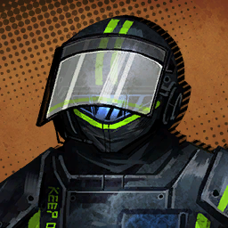
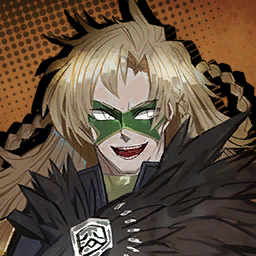
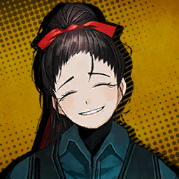
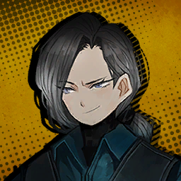
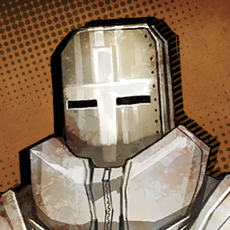
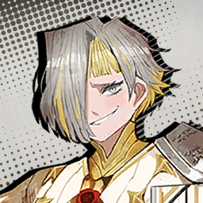
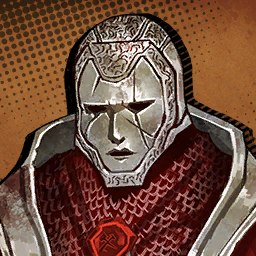
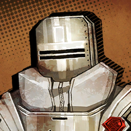
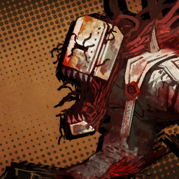
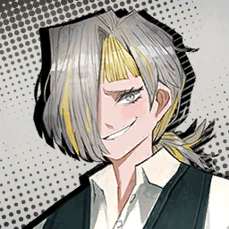

### Chapter 3

---

* ***The Unconfronting*** **(ผู้ขลาดเขลา)**

    * **Episode: 1 | ตอนที่ 1<br>Location: Aboard Mephistopheles | บนรถเมฟิสโตเฟเลส**

        

        ```
        Charon: ... ... ......
        ชารอน: ... ... ......
        ```

        ---

        

        * เสียงในหัว

            ```
            Charon's humming a song while driving.
            ชารอนฮัมเพลงไปขับรถไป
            ```
            ```
            I found myself singing along in my head to that strangely familiar tune.
            รู้ตัวอีกทีฉันก็ร้องตามเสียงนั่นในหัว กับทำนองที่คุ้นเคยอย่างน่าประหลาด 
            ```

        ---

        

        ```
        Vergilius: The most beautiful of performances are born from broken and ruined things. Ironic, the way the world works.
        วอร์จิลิอุส: ท่วงทีที่งดงามที่สุดกำเนิดจากสิ่งที่พัง และบุบสลาย เป็นเรื่องตลกร้ายที่นั่นคือสิ่งที่โลกใบนี้เป็น
        ```

        ---

        

        * เสียงในหัว

            ```
            Vergilius spoke, having noticed that I was looking at the driver’s seat.
            วอร์จิลิอุสพูดออกมาในขณะที่สังเกตเห็นว่าฉันกำลังจ้องมองยังที่นั่งของคนขับ
            ```

        ---

        

        ```
        Vergilius: Alas, they have not the privilege to fully appreciate the glee of their own music… Oh, how unjust that is.
        วอร์จิลิอุส: แต่น่าเสียดาย ที่พวกเขาไม่อาจมีแม้กระทั่งสิทธิ์ ที่จะได้ชื่นชมยินดีปรีดากับเสียงเพลงของตัวเอง... โอ้ ชั่งไม่ยุติธรรมอะไรเยี่ยงนี้
        ```

        ---

        

        ```
        Dante: <......>
        ดันเต้: <......>
        ```

        ---

        

        ```
        Vergilius: Charon, you look like you’re in a good mood today.
        วอร์จิลิอุส: ชารอน วันนี้เธอดูอารมณ์ดีนะ
        ```

        ---

        

        * เสียงในหัว

            ```
            Charon nodded.
            ชารอนหยักหน้า
            ```

        ---

        

        ```
        Charon: Mhm, joy brings out singing.
        ชารอน: อื้อ เมื่อมีความสุข เราก็มักร้องเพลง
        ```

        ---

        


        ```
        Vergilius: I see.
        วอร์จิลิอุส: งั้นสินะ
        ```
        ```
        Vergilius: Although…
        วอร์จิลิอุส: แม้ว่า...
        ```
        ```
        Vergilius: As far as I remember, you would often hum that song when you felt down.
        วอร์จิลิอุส: เท่าที่ฉันจำได้ เธอจะฮัมเพลงนั่นตอนที่เธอรู้สึกแย่
        ```

        ---

        

        ```
        Charon: Charon has no such memories.
        ชารอน: ชารอนไม่มีความทรงจำอะไรทั้งนั่น
        ```
        ```
        Charon: Charon sings when she’s happy.
        ชารอน: ชารอนร้องตอนที่เธอมีความสุข
        ```

        ---

        

        * เสียงในหัว

            ```
            Vergilius’s eyes seemed to well with a subdued shade of dark.
            ในดวงตาของวอร์จิลิอุส คล้ายมีเงามืดอันหม่นลึกเอ่ออยู่ภายใน
            ```
            ```
            The kind of hue that would be picked right away if one wanted to express solitude as a color.
            เป็นเฉดสีแบบที่ใครก็คงเลือกทันที หากอยากถ่ายทอด ‘ความโดดเดี่ยว’ ออกมาเป็นสี
            ```
            ```
            But it only lasted for a brief moment…
            แต่มันอยู่เพียงชั่วครู่เดียวเท่านั่น...
            ```
            ```
            So I decided to dismiss it as the vivid sunset playing tricks with the light.
            เพราะงั้น ผมก็เลยตัดสินใจที่จะมองข้ามมัน คิดกับมันเพียงแค่แสงยามอาทิตย์ตกที่หลอกตา
            ```

        ---

        

        ```
        Vergilius: …The world Charon hums now is one that lacks sound and color.
        วอร์จิลิอุส: ...โลกที่ชารอนฮัมอยู่ตอนนี้ คือโลกที่ไร้ซึ่งเสียง และสีสัน
        ```
        ```
        Vergilius: She’s going through a long tunnel with no exit in sight.
        วอร์จิลิอุส: เธอกำลังก้าวไปข้างหน้าผ่านอุโมงค์ทอดยาวที่ไร้วี่แววของทางออกในระยะสายตา
        ```

        ---

        

        * เสียงในหัว

            ```
            I’m sure that, just like the history of my own life that I’ve forgotten…
            ผมมั่นใจว่า เรื่องนี้มันก็เหมือนกันกับอดีตของผมที่หายไป...
            ```
            ```
            Charon and Vergilius must have their own threads of cruel reminders.
            ชารอน และวอร์จิลิอุสเองก็คงมีสิ่งที่คอยย้ำเตือนถึงความเจ็บปวดของตัวเองเหมือนกัน
            ```

        ---

        

        ```
        Vergilius: Ah, pardon me. I believe that’s enough of personal stories, Dante.
        วอร์จิลิอุส: อ้า ขอโทษด้วยจริง ๆ ฉันว่านั่นคงมากพอแล้วสำหรับเรื่องส่วนตัว ดันเต้
        ```
        ```
        Vergilius: Your work is to manage your crew, not befriend this old guide.
        วอร์จิลิอุส: งานของนายคือดูแลจัดการลูกน้องของนาย ไม่ใช่เป็นเพื่อนกับไกด์แก่ ๆ อย่างฉัน
        ```

        ---

        

        * เสียงในหัว

            ```
            When I looked at his face again, that momentary hint of sadness had fleeted, replaced with a faint smile.
            จากนั่นฉันก็มองไปที่หน้าเขาอีกครั้ง จังหวะนั่นเองที่ร่องรอยแห่งความเศร้าได้หายวับไป และถูกแทนที่ด้วยรอยยิ้มจาง ๆ 
            ```
            ```
            I gave him a few nods, then turned around to check on the Sinners.
            ฉันพงักหน้าให้เขาเล็ก ๆ ก่อนที่จะหันไปรอบ ๆ เพื่อตรวจเช็คเหล่าคนบาป
            ```
            ```
            Our bus passengers have had lifted spirits for a while now.
            เหล่าผู้โดยสารบัสเราดูมีใจขึ้นมาได้สักพักแล้ว
            ```
            ```
            It helped that they did what they were assembled for and secured a Golden Bough for the first time.
            ถึงแม้จะเกิดเรื่องไม่คาดฝันมากมาย แต่ยังดีที่ในท้ายที่สุดพวกเขาก็สามารถบรรลุเป้าหมายที่รวมพวกเขาไว้ด้วยกัน และเก็บกู้กิ่งทองได้สำเร็จเป็นครั้งแรก
            ```
            ```
            All the Sinners were busy talking about their exploits in J Corp’s District.
            คนบาปต่างยุ่งกับการคุยเรื่องกลโกงที่พวกเขาใช้ในเขตของเจคอร์ป
            ```

        ---

        

        ```
        Rodion: You should’ve seen me show that card right there. Seriously, that was a real highlight~
        โรเดียน: เอาจริง นายต้องเห็นที่ฉันโชว์การ์ดนั่นนะ นั่นเป็นช็อตเด็ดฉันเลย~
        ```

        ---
        
        

        ```
        Gregor: …I’m starting to get sick of hearing the same story for the seventh time in a row, so let me change the subject: Where are we going this time?
        เกรกอร์: ...ฉันคิดว่าตัวเองเริ่มไข้ขึ้นจากการต้องฟังเรื่องเดิมเจ็ดรอบรวดแล้ว เพราะงั้นให้ฉันเปลี่ยนเรื่องคุยดีกว่า: ครั้งนี้เราจะไปที่ไหน?
        ```

        ---

        

        ```
        Vergilius: This time… we’re headed to K Corp’s Nest.
        วอร์จิลิอุส: ครั้งนี้... เราจะไปมุ่งหน้าไปที่เนสของเคคอร์ป
        ```

        ---

        

        ```
        Heathcliff: District 11, eh? Job’s taking me to all sorts of places I’d never have thought to visit.
        ฮิธคลิฟฟ์: เขต 11 งั้นเหรอ? งานนี้พาฉันไปทุกที่ที่ฉันไม่เคยไปมาก่อนเลยแฮะ
        ```

        ---

        

        ```
        Don Quixote: ‘Tis home to another great individual! And you are certain to find a souvenir shop there! I’ve always yearned for a limited-edition figurine set! 
        ดอน กิโฆ้เต้: นั่นเป็นบ้านของผู้ยิ่งใหญ่อีกคน! และนายก็มั่นใจได้เลยว่าจะเจอร้านของที่ละลึกที่่นั่น!  ข้าโหยหาเวลาที่จะได้ครอบครองเซทฟิกเกอร์ลีมีเตทอิดีชั่นมาโดยตลอด ในที่สุด!
        ```

        ---

        

        ```
        Rodion: Ooo~ Didn’t it also have a restaurant chain famous for its hamburg steak?
        โรเดียน: อู้วว~ ไม่ใช่ว่าที่นั่นมีเครือร้านอาหารที่ขึ้นชื่อเรื่องแฮมเบิร์กสเต๊กด้วยไม่ใช่เหรอ?
        ```

        ---

        

        ```
        Outis: Huff… Life has gotten much easier these days, hasn’t it? Back in my marching days, all I had was a pinch of salt in my mouth.
        เอาทิส: เฮ้อ... *.เสียงหายใจแรง* สมัยนี้ คงจะใช้ชีวิตง่ายกว่าสมัยก่อนมากใช่ไหมล่ะ? ในตอนที่ฉันยังสังกัดทหารฝึกหัด เดินสวนสนามอยู่ สิ่งเดียวที่ตกถึงท้องฉัน มีเพียงเกลือหยิบมือเดียวในปากของฉัน
        ```

        ---

        

        ```
        Ishmael: I know, right? The only food I could swallow during my voyage was canned soup that tasted like iron.
        อิชมาเอล: ใช่ไหมล้า? อาหารเพียงอย่างเดียวที่ฉันกลืนได้ตอนออกเรือ ก็มีเพียงซุปกระป๋องที่รสชาติเหมือนเหล็ก
        ```

        ---

        

        ```
        Rodion: …C-Can’t wait to try the steak~ Right, Ryōshū?
        โรเดียน: ...ช-ชักรอไม่ไว้ที่จะได้ลิ้มรสสเต็กแล้วสิ~ ใช่ไหม เรียวชู? 
        ```

        ---

        

        ```
        Ryoshu: Well, imagining the variances in blood-color by region does make me salivate.
        เรียวชู: เอ่อ พอนึกจิตนนาการถึงเลือดหลากสีในแต่ละส่วน ก็ทำเอาฉันน้ำลายสอ
        ```

        ---

        

        ```
        Sinclair: ......
        ซินแคร์: ......
        ```

        ---

        

        * เสียงในหัว

            ```
            Looking for someone to share tales with and have a sensible conversation, Rodya naturally turned to Sinclair.
            มองไปรอบ ๆ เพื่อหาใครสักคนที่จะแบ่งปันเรื่องราว และพูดคุยอย่างมีเหตุผล โรดย่าหัวไปหาซินแคร์ด้วยความเคยชิน
            ```
            ```
            However…
            อย่างไรก็ตาม...
            ```

        ---

        

        ```
        Rodion: Sinclair?
        โรเดียน: ซินแคร์?
        ```
        ```
        Rodion: Wha—?! Gosh, golly what’s wrong?
        โรเดียน: อะไ—?! พระเจ้าช่วย เธอเป็นอะไรหรือเปล่า?
        ```

        ---

        

        ```
        Meursault: He’s turned pale. He’s also suffering from hyperventilation and tremors.
        เมอร์โซลท์: เขาตัวซืด แล้วก็ทรมารจากภาวะหายใจเร็ว และสั่นเครือ
        ```

        ---

        

        ```
        Dante: <H—How long has he been like this?>
        ดันเต้: <ข-เขาเป็นแบบนี้มานานแค่ไหนแล้ว?>
        ```

        ---

        

        ```
        Meursault: Ever since Mister Vergilius mentioned K Corp.
        เมอร์โซลท์: ตั้งแต่ที่คุณวอร์จิลิอุสพูดถึงเคคอร์ปแล้ว
        ```

        ---

        

        ```
        Dante: <Why didn’t you tell me earlier?>
        ดันเต้: <แล้วทำไมนายนายไม่บอกฉันก่อนหน้านี้?>
        ```

        ---

        

        ```
        Meursault: …Because you did not order me to do so.
        เมอร์โซลท์: ...เพราะคุณไม่ได้สั่งให้ผมทำแบบนั่น
        ```

        ---

        

        * เสียงในหัว

            ```
            Meursault stared at me like I was at fault for not doing the obvious.
            เมอร์โซลท์จ้องมองมาที่ฉันเหมือนกับว่าฉันผิดที่ไม่ได้ทำในสิ่งที่ควรทำ
            ```

        ---

        

        ```
        Sinclair: I… I just got an upset stomach. Sorry.
        ซินแคร์: ผ... ผมแค่ท้องไส้ปั่นป่วน ขอโทษครับ
        ```

        ---

        

        ```
        Rodion: Really sure you’re okay…?
        โรเดียน: นี้แน่ใจเหรอว่าเธอโอเค...?
        ```

        ---

        

        ```
        Dante: <Now that I think about it…>
        ดันเต้: <ไม่อยากจะคิดแบบนี้หรอก แต่พอมาคิด ๆ ดูแล้ว...>
        ```
        ```
        Dante: <Faust, I’m noticing a trend where one of us has visceral reactions to the destinations that Vergilius reveals.>
        ดันเต้: <เฟาสท์ ฉันว่า ฉันสังเกตเห็นถึงแนวโน้มที่พวกเราคนใดคนหนึ่งจะมีปฎิกิริยาตอบสนองรุนแรงกับสถานที่ ที่วอร์จิลิอุสบอก>
        ```
        ```
        Dante: <Additionally, when we arrive, it turns out that the place does have a history with the person in question.>
        ตันเต้: <ยิ่งไปกว่านั่น พอเราถึงแล้ว มันก็กลับกลายเป็นว่า ที่ที่เราไปดันมีความเกี่ยวข้องกับคนที่มีอาการทุกที>
        ```
        ```
        Dante: <Does that have something to do with the reason we joined the company?>
        ดันเต้: <ฉันอยากรู้ ว่าเรื่องนี้ เกี่ยวอะไรกับเหตุผลที่เราถูกรับเลือกให้เข้ามาทำงานในบริษัทนี้หรือเปล่า?>
        ```

        ---

        

        ```
        Faust: …You just referred to the team as “we”.
        เฟาสท์: ...นายพึ่งจะกล่าวถึมถึงทีมว่า “เรา”
        ```

        ---

        

        ```
        Dante: <Huh?>
        ดันเต้: <หะ?>
        ```

        ---

        

        ```
        Faust: It’s a part of my mission to detect the slightest of changes.
        เฟาสท์: มันเป็นส่วนหนึ่งในภารกิจของฉัน ที่จะตรวจจับความเปลียนแปลงไม่ว่าจะเล็กเพียงใด
        ```
        ```
        Faust: As for your question, while I can’t tell you the reasons for recruiting the Sinners in detail…
        เฟาสท์: สำหรับคำถามของนาย ถึงฉันจะไม่สามารถบอกเหตุผลเบืัองหลังการคัดเลือกคนบาปได้โดยละเอียด...
        ```
        ```
        Faust: There’d be no point in denying that our destinations and the backgrounds of each Sinner are indeed related to a degree.
        เฟาสท์: แต่ก็ไม่มีเหตุผลอะไร ที่จะปฎิเสธว่าจุดหมายปลายทางของเรา และภูมิหลังของคนบาปแต่ละคนมีความเกี่ยวข้องกันจริง ๆ ในระดับหนึ่ง
        ```

        ---

        

        ```
        Heathcliff: …Do all uppish snobs have some condition that makes them yap on and on about things that can be answered with a plain yes or no?
        ฮิธคลิฟฟ์: ...ไอพวกคนหยิ่งยโสจองหองอย่างเธอเป็นโรคอะไรกันหรือเปล่า ที่ทำให้พวกมันเอาแต่พล่ามโน่นพล่ามนี้อยู่เรื่อย ในคำถามที่ตอบได้ง่าย ๆ ด้วยคำว่า ใช่ หรือ ไม่ น่ะ?
        ```

        ---

        

        ```
        Faust: Hysteron proteron isn’t always correct. Faust simply adopts the most effective mode of communication for the given situation.
        เฟาสท์: ฮิสเทอรอน โปรเทอรอน ไม่ใช่วิธีที่ถูกเสมอไป เฟาสท์เพียงปรับใช้วิธีสื่อสารที่มีประสิทธิภาพมากที่สุดภายใต้สถานการณ์ตรงหน้าก็เท่านั่น
        ```

        ---

        

        ```
        Heathcliff: Hyst… Hysterowhat?
        ฮิธคลิฟฟ์: ฮิส... ฮิสเทอรอ อะไรนะ?
        ```

        ---

        

        ```
        Faust: …It means that you’re struggling to understand Faust because you’re too uneducated, not that Faust is overeducated
        เฟาสท์: ...มันหมายความว่า คุณมีปัญหาในการทำความเข้าใจเฟาสท์ เพราะคุณไร้การศึกษาเกินไป และไม่ใช่ที่เฟาสท์หัวสูง
        ```

        ---

        

        ```
        Heathcliff: Why you…!
        ฮิธคลิฟฟ์: หน๋อยแก...!
        ```

        ---

        

        ```
        Sinclair: Euhgk…
        ซินแคร์: อั่ก...
        ```

        ---
        
        

        * เสียงในหัว

            ```
            Just as Heathcliff approached Faust with his bat shaking in fury…
            เพียงชั่วขณะที่ฮิธคลิฟฟ์เข้าหาเฟาสท์กับตระบองที่สั่นด้วยโทสะ
            ```
            ```
            Sinclair suddenly started throwing up on the floor.
            จู่ ๆ ซินแคร์ก็อ้วกลงบนพื้น
            ```
            ```
            The bus finally quieted down after that.
            แล้วในที่สุด บัสก็กลับมาเงียบอีกครั้ง
            ```

    ---

    * **Episode: 2 | ตอนที่ 2<br>Location: Aboard Mephistopheles | บนรถเมฟิสโตเฟเลส**

        

        * เสียงในหัว

            ```
            Shortly after the situation with Sinclair was dealt with…
            หลังเหตุการณ์ที่ซินแคร์ต้องเผชิญ...
            ```

        ---

        

        ```
        Gregor: By the way, you meant the Backstreets of District 11 when you said K Corp’s Nest, yeah?
        เกรกอร์: ยังไงก็เถอะ คุณคงหมายถึงเบลคสตรีทเขต 11 ตอนที่คุณพูดว่าเนสของเคคอร์ปใช่ไหม? 
        ```
        ```
        Gregor: I missed pointing it out earlier since everyone got a bit excited there…
        เกรกอร์: เมื่อกี้นี้ผมลืมท้วง เพราะทุกคนกำลังค่อนข้างตื่นเต้นกันอยู่...
        ```

        ---

        

        ```
        Vergilius: I rarely misspeak, if ever.
        วอร์จิลิอุส: นาน ๆ ทีฉันจะพูดผิด หรือก็ไม่เลย
        ```
        ```
        Vergilius: I know what I said, Gregor. K Corp’s Nest is where we’re going.
        วอร์จิลิอุส: ฉันรู้ว่าตัวเองพูดอะไร เกรกอร์ และใช่ จุดหมายปลายทางในครั้งนี้ที่เรากำลังมุ่งหน้าไปก็คือเนสของเคคอร์ป
        ```

        ---

        

        ```
        Gregor: Huh, alright, but if we’re entering a Nest…
        เกรกอร์: เออ งั้นสินะ แต่ถ้าเราจะเข้าไปในเนส...
        ```

        ---

        

        ```
        Vergilius: Indeed, there’s the immigration process.
        วอร์จิลิอุส: ใช่แล้ว ว่ามันต้องมีกระบวนการตรวจคนเข้าเมือง
        ```

        ---

        
        
        ```
        Rodion: I don’t have a K Corp. visa. Y’ain’t about to tell me everyone else got one, right?
        โรเดียน: แต่ฉันไม่มีวีซ่าเข้าเนสเคคอร์ปหรอกน้า หรือไม่ใช่ว่านายกำลังจะบอกฉันว่าทุกคนมีอยู่แล้ว ใช่ไหม?
        ```

        ---

        

        ```
        Heathcliff: What. Why’re you lookin’ at me?
        ฮิธคลิฟฟ์: อะไร ทำไมเธอถึงมองมาที่ฉัน?
        ```

        ---

        

        ```
        Ryoshu: The solution is simple: C. I.
        เรียวชู: ทางแก้ก็ง่ายมาก: ซี ไอ
        ```
        ```
        Ryoshu: And keep on D. E. R. ‘til we’ve breached the defense.
        เรียวชู: และคอย ดี อี อาร์ จนกว่าเราจะเจาะการป้องกันได้
        ```
        ```
        Ryoshu: In short, CIDER. Huhu…
        เรียวชู: เรียกสั้น ๆ ว่า ซีเดอร์ .*CIDER. ไงล่ะ ฮู่ฮู่...
        ```

        ---
    
        

        * เสียงในหัว

            ```
            Whatever that eccentric abbreviation means for Ryōshū, the Sinners have learned to stop questioning it.
            ไม่ว่าคำย่อนั่นจะมีความหมายอะไรสำหรับเรียวชู เหล่าคนบาปก็เรียนรู้ที่จะหยุดถามถึงมัน
            ```

        ---

        

        ```
        Ishmael: A company as big as ours might get a free pass.
        อิชมาเอล: บริษัทที่ใหญ่ระดับเราก็คงจะเข้าไปได้ฟรี ๆ
        ```
        ```
        Ishmael: Not to mention, breaking through using the method dear Ryōshū suggested will take ages. How badly must you underestimate a Nest actively governed by a Wing to say that?
        อิชมาเอล: ไม่ต้องพูดถึงแหกเข้าไปโดยใช้วิธีที่คุณเรียวชูสุดที่รักเสนอให้ คงใช้เวลาเป็นชาติ นี้เธอมองโบ๋เนสที่ถูกดูแลโดยวิงส์ต่ำแค่ไหนกัน ถึงกล้าพูดแบบนั่น?
        ```

        ---

        

        ```
        Dante: <Oh, I see, no one’s gonna take into account how much I’ll suffer for that CIDER, huh?>
        ดันเต้: <โอ้ ฉันก็ว่าล่ะ นี้ไม่มีใครสนใจคำย่อของเรียวชู แล้วปล่อยให้ฉันทรมาณกับ ซีเดอร์ นั่นน่ะเหรอ หะ?>
        ```

        * เสียงในหัว

            ```
            Sadly, none of our Sinners bothered to respond to me in any capacity.
            น่าเศร้า ที่ไม่มีคนบาปของเราคนไหน ที่สนใจจะตอบเลยแม้แต่น้อย
            ```

        ---

        

        ```
        Vergilius: As Ishmael said, we’ll pass the immigration without needing a visa.
        วอร์จิลิอุส: อย่างที่อิชมาเอลพูด พวกเราจะผ่านชั้นตรวจคนเข้าเมืองโดยไม่ต้องใช้วีซ่า
        ```
        ```
        Vergilius: Limbus Company has backing from the shareholders of a wide array of fields.
        วอร์จิลิอุส: ลิมบัสคอมเพนีมีผู้ถือหุ้นในหลายวงการคอยหนุนหลังพวกเราอยู่
        ```

        ---

        

        ```
        Hong Lu: Oh, do you happen to know the shareholder of H Corp, then?
        ฮงหลู่: โอ้ ถ้าเช่นนั่น ท่านพอจะทราบเกี่ยวกับเรื่องผู้ถือหุ้นจากเฮชคอร์ปบ้างไหม ขอรับ?
        ```
        ```
        Hong Lu: They once personally visited our home because my younger sibling insisted upon having a red passport as a kid.
        ฮงหลู่: ครั้งหนึ่ง พวกเขาเคยมาเยี่ยมบ้านข้า เพราะน้องคนเล็กเอาแต่ร้องงอแงยืนกรานว่าอยากมีพาสปอร์ตสีแดงตอนยังเด็ก
        ```

        ---

        

        ```
        Vergilius: Couldn’t say, I’m merely a humble guide who wouldn’t be in the position to know such a thing.
        วอร์จิลิอุส: ไม่รู้สิ ฉันก็เป็นแค่ไกด์ผู้ถ่อมตนที่ไม่ได้อยู่ในตำแหน่งที่จะรู้อะไร
        ```
        ```
        Vergilius: Otherwise, the question doesn’t seem like one that’s really worth answering.
        วอร์จิลิอุส: หรือไม่ คำถามที่ถามดูจะไม่คุ้มตอบ
        ```

        ---

        
        
        ```
        Hong Lu: How harsh…
        ฮงหลู่: ใจร้ายจัง...
        ```

        ---

        

        ```
        Vergilius: That leaves the route to the checkpoint as our concern.
        วอร์จิลิอุส: นั่นทำให้เส้นทางไปสู่จุดตรวจเป็นสิ่งที่เรากังวล
        ```
        ```
        Vergilius: Thorough inspection means that there are plenty of people looking for an easy way in, including those who’d take the pass by force
        วอร์จิลิอุส: การตรวจสอบที่ละเอียด หมายความว่า มันมีคนที่ต้องการเข้ามาอย่างง่าย ๆ รวมถึงพวกที่จะใช้กำลังเพื่อเข้าไป
        ```

        ---

        

        ```
        Meursault: …I hear several interlopers surrounding the bus.
        เมอร์โซลท์: ...ผมได้ยินเสียงผู้บุกรุกกำลังล้อมบัสเราอยู่
        ```

        ---

        

        ```
        Dante: <Welp… Have bus—will battle.>
        ดันเต้: <เอาเถอะ... ดูเหมือนจะได้เวลาต่อสู้แล้วสิ>
        ```

    ---

    * **Episode: 3 | ตอนที่ 3<br>Location: Aboard Mephistopheles | บนรถเมฟิสโตเฟเลส**

        

        ```
        Charon: Cock-a-hoop Charon’s cock-a-hoop parking.
        ชารอน: ปังปุรีเย่ ชารอนขับได้ปังปุรีเย่สุด ๆ
        ```

        ---

        

        ```
        Vergilius: Alright, off the bus. Time to get inspected.
        วอร์จิลิอุส: เอาล่ะ ลงจากบัสได้ ได้เวลาถูกตรวจแล้ว
        ```
        ```
        Vergilius: Ah, and let me add this just in case you’re feeling inclined to your usual antics.
        วอร์จิลิอุส: อ้า แล้วก็ขอเตือนไว้ก่อน เผื่อพวกแกกำลังคิดจะเล่นอะไรแผลง ๆ แบบที่ชอบทำเป็นประจำ
        ```
        ```
        Vergilius: Don’t go around making a scene expecting things to go your way…
        วอร์จิลิอุส: อย่าเที่ยวก่อเรื่องหวังว่าทุกอย่างจะเป็นไปตามใจตัวเองล่ะ...
        ```
        ```
        Vergilius: Because that will not be how it works in this particular place.
        วอร์จิลิอุส: เพราะนั่นจะไม่ใช่สิ่งที่ที่นี้เป็น
        ```

        ---

        

        * เสียงในหัว

            ```
            I thought his words were pretty intimidating, but despite the worries…
            ฉันคิดว่าคำพูดของเขาค่อนข้างเป็นการข่มขู่ แม้จะมีความกังวลอยู่บ้าง...
            ```

        ---

        **Location: K Corp. Checkpoint | ด่านตรวจเคคอร์ป**

        ---

        

        ```
        Annoucement: We welcome all visitors to K Corp’s Nest openheartedly.
        เสียงตามสาย: พวกเราขอต้อนรับแขกทุกท่านเข้าสู่เนสเคคอร์ปอย่างเปิดอกเปิดใจ
        ```
        ```
        Annoucement: Please form an orderly line as you enter, and stand where the instructions indicate. 
        เสียงตามสาย: โปรดเข้าเรียงแถวต่อกันเมื่อท่านเข้ามาให้เป็นระเบียบ และยืนในบริเวณที่คำสั่งระบุ
        ```

        ---

        

        * เสียงในหัว

            ```
            The menacing and interrogative atmosphere could subdue the temper of any first-time visitors—and the Sinners were no exception.
            บรรยากาศที่คุกคามของการซักถาม กดอารมณ์ของเหล่าแขกผู้มาเยือนเป็นครั้งแรก—และเหล่าคนบาปเองก็ไม่มีข้อยกเว้น
            ```
            ```
            I could occasionally hear Sinclair sniffling, followed by Rodya and Gregor calming him.
            ผมได้ยินซินแคร์สูดอากาศเป็นระยะ ๆ ตามมาด้วยโรดย่า และเกรกอร์ที่กำลังปลอบประโลมเขา
            ```
            ```
            Any of my questions why were met with heads shaken sideways.
            คำถามที่อยู่ในหัวฉันถูกเขย่าออกหูจนหมด
            ```

        ---

        

        ```
        Vergilius: Look here, how nice it is to see you all stay in line and behave. Like a brood of chicks on an outing.
        วอร์จิลิอุส: ดูตรงนี้สิ ชั่งเป็นภาพที่ดีอะไรอย่างนี้ที่ได้เห็นพวกแกเข้าแถว และทำตัวเหมือนกับลูกไก่ออกนอกบ้าน
        ```

        ---

        
        
        ```
        Dante: Wait, why’re you out here…
        ดันเต้: เดี๋ยว ทำไมนายถึงอยู่นี้...
        ```

        * เสียงในหัว

            ```
            Noticing my flustered reaction at the unexpected company, Vergilius opened his mouth.
            พอเห็นว่าผมเริ่มทำตัวไม่ถูกกับการมีคนอยู่ด้วยแบบไม่ทันตั้งตัว วอร์จิลิอุสก็เริ่มพูดขึ้นมา
            ```

        ---

        

        ```
        Vergilius: Because this is a Nest, Dante.
        วอร์จิลิอุส: เพราะว่านี้คือเนสของฉัน ดันเต้
        ```
        ```
        Vergilius: If one of you were to get into unexpected trouble here…
        วอร์จิลิอุส: ถ้าหนึ่งในพวกแกดันไปพัวพันกับปัญหาของที่นี้...
        ```
        ```
        Vergilius: Well, Dante, the responsibility will be a bit too heavy for you to bear alone.
        วอร์จิลิอุส: เพราะงั้น ดันเต้ ความรับผิดชอบมันคงหนักเกินไปสำหรับนายที่แบกรับไว้คนเดียว
        ```

        ---

        

        * เสียงในหัว

            ```
            When Vergilius put it like that…
            พอวอร์จิลิอุสพูดแบบนั่น...
            ```
            ```
            It sounded as if he were saying “You’re not reliable enough to be sent without supervision.”
            มันฟังเหมือนกับว่าเขากำลังพูดว่า “แกหวังพึ่งไม่ได้มากพอที่จะส่งไปโดยที่ไม่มีผู้ดูแล”
            ```
            ```
            …But I knew it’d be wise to keep this to myself.
            ...แต่ฉันรู้ว่ามันคงฉลาดกว่าถ้าจะเก็บเรื่องนี้ไว้กับตัวเอง
            ```

    ---

    * **Episode: 4 | ตอนที่ 4<br>Location: K Corp. Checkpoint | ด่านตรวจเคคอร์ป**

        

        ```
        Ishmael: The line’s moving quickly. It’ll be our turn in about 10 minutes at most.
        อิชมาเอล: แถวกำลังขยับอย่างรวดเร็ว อีกไม่เกิน 10 นาที เดี๋ยวก็ถึงคิวเราแล้ว
        ```
        ```
        Ishamael: Will all thirteen of us need to answer immigration questions? They won’t be able to understand Manager Dante, so what should we do?
        อิชมาเอล: แล้วพวกเราทั้งสิบสามคนจำเป็นต้องตอบคำถามตรวจคนเข้าเมืองไหมนะ? ถ้าถาม พวกเขาก็ไม่มีทางเข้าใจผู้จัดการดันเต้ แล้ว พวกเราจะเอาไง?
        ```

        ---

        

        * เสียงในหัว

            ```
            Ishmael seemed to have a habit of speaking quickly and being more inquisitive when she got anxious.
            ดูเหมือนอิชมาเอลจะมีนิสัยที่ชอบพูดเร็ว และชั่งถามในตอนที่เธอกังวล
            ```

        ---

        

        ```
        Vergilius: I was just about to get to that.
        วอร์จิลิอุส: ฉันกำลังจะพูดเรื่องนั่นพอดีเลย
        ```
        ```
        Vergilius: Listen up. The K Corp. official will only ask very simple questions to the passengers in this line.
        วอร์จิลิอุส: ฟังนะ เจ้าหน้าที่เคคอร์ป จะถามคำถามที่ง่ายมาก ๆ กับคนที่อยู่ในแถวนี้
        ```
        ```
        Vergilius: And your answers will be similarly concise.
        วอร์จิลิอุส: และคำตอบของพวกแกจะกระชับเหมือนกัน
        ```
        ```
        Vergilius: When the border official asks about the nature of your visit…
        วอร์จิลิอุส: ตอนที่เจ้าหน้าที่ตรวจคนถามเกี่ยวกับจุดประสงค์ของการมาเยือน...
        ```
        ```
        Vergilius: Say: “I’m here for business on the behalf of Limbus Company, please refer to my work visa.”
        วอร์จิลิอุส: ให้ตอบว่า: “ฉันมาที่นี้เพื่อติดต่อธุรกิจในนามของลิมบัสคอมเพนี กรุณาดูวีซ่าทำงานของฉันแทน”
        ```
        ```
        Vergilius: Remember this exact phrase so that you can recite it word for word.
        วอร์จิลิอุส: จำประโยคนี้ไว้ให้ขึ้นใจ แล้วพวกแกจะได้ท่องตาม
        ```
        ```
        Vergilius: I’ll take care of the rest, so you just have to prove that you aren’t here to cause trouble.
        วอร์จิลิอุส: และที่เหลือฉันจัดการเอง เพราะงั้นสิ่งที่พวกแกต้องทำก็มีแค่พิสูจน์ว่าตัวเองไม่ได้มาที่นี้เพือก่อเรื่อง
        ```

        ---

        

        ```
        Faust: If even memorizing that is too much of a burden for you, I suggest that you keep your mouth shut.
        เฟาสท์: ถ้าแม้การจำเป็นสิ่งที่ยากเกินไปสำหรับนาย ฉันแนะนำให้รูดซิปปากให้เงียบ
        ```
        ```
        Faust: You can present your employee card instead.
        เฟาสท์: แล้วแสดงตัวด้วยบัตรพนักงานแทน
        ```

        ---

        

        ```
        Dante: <Keep quiet and don’t cause trouble. Easiest tasks in the world.>
        ดันเต้: <เงียบเข้าไว้ และไม่ก่อปัญหา งานที่ง่ายที่สุดในโลก>
        ```

        * เสียงในหัว

            ```
            I sneakily mumbled a sarcastic remark.
            ฉันแอบพึมพัมคำพูดประชดประชัน
            ```
            ```
            I was worried that Faust might rat me out, but thankfully…
            ฉันกังวลว่าเฟาสท์จะฟ้องเรื่องที่ฉันพูด แต่โชคยังดี...
            ```
            ```
            Vergilius was idly staring off into space, sparing me from his scathing commentary.
            ที่วอร์จิลิอุสกำลังมองเรื่องเปื่อยไปยังพื้นที่ว่างเปล่า ไว้ชีวิตฉันจากคำวิจารณ์น่ารังเกียจของเขา
            ```

        ---

        

        ```
        Vergilius: Now, next up.
        วอร์จิลิอุส: เอาล่ะ ที่นี้ ต่อไป
        ```
        ```
        Vergilius: If you have a question, make sure to first ask yourself if it’s actually meaningful.
        วอร์จิลิอุส: ถ้าพวกแกมีคำถามอะไร ก็อย่าลืมถามตัวเองว่าสิ่งที่แกจะถามมีประโยชน์หรือเปล่า
        ```
        ```
        Vergilius: Then quietly raise your hand.
        วอร์จิลิอุส: จากนั่นก็ค่อย ๆ ยกมือของพวกแก
        ```

        ---

        

        * เสียงในหัว

            ```
            Several hands were lifted, including mine.
            เมื่อสิ้นสุดคำพูด มือหลายข้างถูกยกขึ้น มือผมก็เช่นกัน
            ```

        ---

        

        ```
        Vergilius: Rodion.
        วอร์จิลิอุส: โรเดียน 
        ```

        ---

        
        
        ```
        Rodion: Since this trip is for business, we can carry our weapons, yeah~?
        โรเดียน: ในเมื่อทริปนี้ก็มาเพราะเรื่องงาน งั้นเราก็แบกอาวุธของเราเข้าไปได้ ใช่ไหม~?
        ```

        ---

        

        ```
        Vergilius: Correct. Next.
        วอร์จิลิอุส: ถูกต้อง ต่อไป
        ```

        ---

        

        ```
        Rodion: Then, Greg’s creepy-crawly arm and Dante’s chichi clockhead’re getting a pass too?
        โรเดียน: แล้ว แขนกรงเล็บน่าขยะแขยงของเกรก กับ หัวนาฬิกาไฮโซของดันเต้จะผ่านได้เหมือนกันหรือเปล่า?
        ```

        ---

        

        ```
        Ishmael: That should be the case. For your reference, our manager’s head counts as a prosthetic rather than a weapon, which means it’d be approved even if what we had were a tourist visa, powers to revive notwithstanding.
        อิชมาเอล: ก็น่าจะเป็นแบบนั่น สำหรับอ้างอิง หัวผู้จัดการของเราจัดว่าเป็นอวัยวะเทียมมากกว่าอาวุธ ดังนั่นถึงพวกเราจะมีแค่วีซ่านักท่องเที่ยวก็น่าจะผ่านการอนุมัติอยู่ดี ถึงจะมีพลังชุบชีวิตด้วยก็เถอะ
        ```

        ---

        

        * เสียงในหัว

            ```
            Ishmael took the role of the model student and answered in Vergilius’s stead.
            อิชมาเอลรับบทเป็นนักเรียนตัวอย่าง แล้วตอบคำถามแทนวอร์จิลิอุส
            ```
            ```
            It feels like something changed about Ishmael’s attitude since the casino job…
            มันรู้สึกเหมือนว่ามีบางอย่างเปลี่ยนไปในทัศนคติของอิชมาเอลหลังงานคาซิโนนั่น...
            ```
            ```
            She seems to have decided to take matters into her own hands after I betrayed her expectations of my capabilities as a leader.
            เธอดูเหมือนตัดสินใจที่จะทำอะไรด้วยตัวเอง หลังจากที่ผมทรยศความคาดหวังของเธอ ที่เชื่อในความสามารถของผมในฐานะหัวหน้า
            ```

        ---

        

        ```
        Vergilius: Precisely.
        วอร์จิลิอุส: เป๊ะมาก
        ```

        ---

        

        * เสียงในหัว

            ```
            Gregor and I put our hands down at the same time.
            เกรกอร์ และผมเอามือลงพร้อมกัน
            ```

        ---

        

        ```
        Vergilius: And, Ryōshū. Put out your cigarette before you speak.
        วอร์จิลิอุส: และเรียวชู ช่วยวางบุหรี่ลงก่อนที่เธอจะพูด
        ```

        ---

        

        ```
        Ryoshu: …I didn’t raise my hand.
        เรียวชู: ...ฉันไม่ได้ยกมือ
        ```

        ---

        

        ```
        Don Quixote: ......
        ดอน กิโฆ้เต้: ...... 
        ```

        ---

        

        * เสียงในหัว

            ```
            Vergilius was doing his best to ignore Don Quixote’s arm stretched skyward…
            วอร์จิลิอุสพยายามอย่างสุดความสามารถที่จะเมินแขนของดอนกิโฆ้เต้ที่ชูสุดข้อไปบนอากศ...
            ```
            ```
            But he finally caved and gave the woman with an adamantly raised hand the chance to speak.
            แต่สุดท้าย เขาก็ใจอ่อน และมอบโอกาศให้กับผู้หญิงผู้ยืนกรานที่จะชูมือ เพียงเพื่อโอกาศจะได้พูด
            ```

        ---

        

        ```
        Vergilius: …Fine, Don Quixote. What is it?
        วอร์จิลิอุส: ...ก็ได้ ดอน กิโฆ้เต้ อะไรล่ะ?
        ```

        ---

        

        ```
        Don Quixote: For what purpose doth that barrier of glass serve?
        ดอน กิโฆ้เต้: เจ้ากำแพงแก้วพวกนั่นมีไว้เพื่อทำหน้าที่อันใดหรือขอรับ?
        ```

        ---

        

        * เสียงในหัว

            ```
            Following Don Quixote’s finger, our attention was drawn to the glass wall stood in the middle of the building.
            เมื่อมองตามนิ้วของดอนกิโฆเต้ที่ชี้ไป ความสนใจของเราก็บรรจบบนกำแพงแก้ว ที่ตั้งตระหง่านอยู่ใจกลางอาคาร
            ```
            ```
            On the other side of that clear dividing wall…
            ณ อีกฝั่งหนึ่งของกำแพงที่แบ่งแยก...
            ```
            ```
            Were countless people waiting in line.
            คือผู้คนนับไม่ถ้วนที่กำลังรออยู่ในแถว
            ```

        ---

        

        ```
        Gregor: That line’s slowed to a crawl, people are sat on the floor waiting for it to move.
        เกรกอร์: แถวนั่นช้าอย่างกับเต่า ผู้คนต่างพากันนั่งบนพื้น รอให้แถวขยับ
        ```
        ```
        Gregor: Looks like they’ve been there for quite some time.
        เกรกอร์: ดูเหมือนว่าพวกเขาจะอยู่ตรงนั่นมาได้พักใหญ่แล้ว
        ```

        ---

        

        ```
        Meursault: There are many armed guards as well. Three times as many compared to this side.
        เมอร์โซลท์: แถมยังมีการ์ดถืออาวุติ มากกว่าฝั่งนี้ตั้งสามเท่า
        ```

        ---

        

        ```
        Vergilius: …Most of the glass walls you find inside buildings are there for safety reasons.
        วอร์จิลิอุส: ...กำแพงแก้วที่พวกแกเห็นภายในตึกมีอยู่ก็เพื่อเหตุผลด้านความปลอดภัย
        ```

        ---

        

        ```
        Rodion: Well~ Simply put, that line’s for Backstreets folks. Each Nest handles immigration differently, but wherever it may be, it’s super-duper hard to get into another Nest without a proper visa.
        โรเดียน: ก็นะ~ พูดง่าย ๆ ก็คือ แถวนั่นเป็นแถวสำหรับพวกเบลคสตรีท แต่ละเนสมีมาตรการในการตรวจคนเข้าเมืองต่างกัน แต่ไม่ว่าจะเป็นที่ไหน มันก็เป็นเรื่องยาก-มากที่จะเข้าไปในเนสอื่นได้หากไม่มีวีซ่าที่ถูกต้อง
        ```
        ```
        Rodion: Why’d you think those bullies jumped us on the way to the checkpoint? They wanted our visa so they could enter the Nest.
        โรเดียน: ลองคิดดูสิ ทำไมบูลลี่พวกนั่นถึงเข้าจู่โจมเราในระหว่างทางถึงด่านตรวจ? นั่นก็เพราะ พวกเขาต้องการวีซ่าของเราเพื่อที่พวกเขาจะได้เข้าไปในเนส
        ```

        ---

        

        ```
        Vergilius: …A problem we are not in our power to resolve.
        วอร์จิลิอุส: ...ปัญหาที่พวกเราไม่ได้มีพลังที่จะแก้ไขด้วยตัวเอง
        ```

        ---

        

        * เสียงในหัว

            ```
            However, that answer didn’t satisfy Don Quixote.
            อย่างไรก็ตาม คำตอบนั่นไม่ได้ทำให้ดอนกิโฆ้เต้พอใจ
            ```
            ```
            Whether it was the fault of the gloomy yet oppressive atmosphere of the area beyond the wall…
            ไม่ว่ามันจะเป็นความผิดของบรรยากาศอึมครึมชวนกดดันที่ปกคลุมพืันที่หนือกำแพง...
            ```
            ```
            Or the disturbances happening in there, I couldn’t say.
            หรือความไม่สงบที่เกิดขึ้นข้างในนั่น ฉันก็ตอบไม่ได้
            ```

        ---

        

        ```
        Outis: Manager, it’s our turn now.
        เอาทิส: ท่านผู้จัดการ มันถึงคิวเราแล้วค่ะ
        ```

        ---

        

        ```
        Dante: <Huh? Right…>
        ดันเต้: <หะ? ใช่...> 
        ```

        * เสียงในหัว
        
            ```
            Our line moved at such a quick pace, we barely had time to chat before it was our turn to answer the official’s questions.
            แถวเราขยับอย่างรวดเร็ว จนแทบจะไม่มีเวลาให้พูดคุย ก่อนจะถึงคิวเราที่ต้องตอบคำถามคุณเจ้าหน้าที่ 
            ```

        ---

        

        ```
        Ishmael: Remember: When you’re asked about the purpose of your visit…
        อิชมาเอล: จำเอาไว้: เมื่อเธอโดนถามว่ามาทำอะไรที่นี้...
        ```

        ---

        

        ```
        Ryoshu: …Remind me one more time and I’ll show SANGRIA to you and the official or whatever.
        เรียวชู: ...ลองเตือนฉันอีกรอบ แล้วฉันจะแสดง SANGRIA ให้เธอ กับ ไอเจ้าหน้าที่ห่าเหวอะไรนั่นดู 
        ```

        ---

        

        * เสียงในหัว

            ```
            Despite Ishmael’s worries, our inspection was smooth sailing.
            แม้อิชมาเอลจะมีความกังวล แต่ขั้นตอนการตรวจก็ผ่านไปได้อย่างราบรื่น
            ```

        ---

        

        ```
        Checkpoint Official: Please state your affiliation and purpose of visit.
        เจ้าหน้าที่ประจำด่านตรวจ: โปรดระบุสังกัดที่ท่านประจำอยู่ และวัตถุประสงค์ในการเข้าเยี่ยม
        ```
        
        ---

        

        ```
        Gregor: Ah, I’ve come from Limbus Company on business. Here’s my employee card.
        เกรกอร์: อ้า ฉันถูกส่งมาจากลิมบัสคอมเพนีเพื่อทำงาน นี้บัตรพนักงานของฉัน
        ```

        ---

        

        ```
        Checkpoint Official: …All checked out. Next.
        เจ้าหน้าที่ประจำด่านตรวจ: ...ทุกอย่างเรียบร้อยดี ต่อไป
        ```

        ---

        
        
        ```
        Rodion: From Limbus Company. Business reasons. Take a look at my card and all that.
        โรเดียน: มาจากลิมบัสคอมเพนี เพื่อทำงาน เอาบัตรฉันไปดู และจบกัน 
        ```

        ---

        

        ```
        Checkpoint Official: …All checked out. Next.
        เจ้าหน้าที่ประจำด่านตรวจ: ...ทุกอย่างเรียบร้อยดี ต่อไป
        ```

        ---

        

        * เสียงในหัว

            ```
            After our first Sinner proved who we work for, it was a breeze for the rest of us.
            หลังจากคนบาปคนแรกพิสูจน์ว่าเราทำงานให้ใคร ที่เหลือก็เป็นเรื่องง่าย และผ่านไปไวดั่งสายลม
            ```
            ```
            The official asked the same question in the same dry tone, took a cursory glance at our faces and employee cards―though based on their speed, it seemed more like a customary gesture rather than an actual look over―then let each Sinner pass.
            เจ้าหน้าที่ถามคำถามเดิม ๆ ซ้ำ ๆ ด้วยน้ำเสียงที่เหือดแห้งเหมือนอย่างเคย พลางเหลือบมองหน้าคร่าว ๆ และบัตรพนักงาน―อ้างอิงจากความเร็วของพวกเขา มันเหมือนขั้นตอนที่ทำเป็นพิธีมากกว่าจะตั้งใจ―ก่อนที่จะปล่อยให้คนบาปแต่ละคนผ่าน
            ```

        ---

        
        
        ```
        People in Line: ...... ......
        คนในแถว: ...... ......
        ```

        ---

        

        ```
        Ishmael: …Something’s amiss over there.
        อิชมาเอล: ...มีบางอย่างผิดปกติอยู่ตรงนั่น
        ```

        ---

        

        * เสียงในหัว

            ```
            The glass wall standing between us and them was thick enough to block out sound.
            กำแพงแก้วที่ขวางกั้นระหว่างเรากับพวกเขาหนาพอที่จะกันเสียงไม่ให้ลอดผ่าน
            ```
            ```
            It was hard for us to tell what was going on through the wall. 
            มันยากสำหรับเราที่จะบอกได้ว่าอีกฝากหนึ่งของกำแพงกำลังเกิดอะไรขึ้น
            ```
            ```
            However, I could see what was happening unambiguously; someone with cuffed hands was being dragged away by security.
            แต่ถึงอย่างนั่น ฉันก็มองเห็นสิ่งที่กำลังเกิดขึ้นได้อย่างชัดเจน; มีใครบางคนที่ใส่กุญแจมือกำลังถูกลากออกไปโดยการ์ด
            ```
            ```
            And a small child was crying next to them, clearly scared and confused.
            และเด็กน้อยที่กำลังร้องไห้อยู่ไม่ห่าง มีสีหน้าที่หวาดกลัว และสับสนอย่างชัดเจน
            ```

        ---

        

        ```
        Ishmael: …We shouldn’t bother. I don’t know what happened, but I guess someone broke a taboo.
        อิชมาเอล: ...พวกเราไม่ควรยื่นมือเข้าไปยุ่ง ฉันไม่รู้หรอกว่าเกิดอะไรขึ้น แต่เดาว่า คงมีใครบางคนทำผิดกฎ
        ```

        ---

        

        ```
        Heathcliff: Yeah, sure. Those impoverished vandals and their audacity to break the taboo of not stuffing enough cash in the right people’s pockets, am I right?
        ฮิธคลิฟฟ์: ใช่สิ แน่นอน พวกรากหญ้าจอมป่าเถื่อนพวกนั่น กับ ความไร้มารยาทของพวกมันที่บังอาจแหกกฎ ไม่ยอมยัดเงินใส่กระเป๋าคนที่ต้องได้ ฉันพูดถูกหรือเปล่า?
        ```

        ---

        

        ```
        Ishmael: …Are you mocking me right now?
        อิชมาเอล: ...นี้นายจะมาเยาะเย้ยฉันตอนนี้เนี้ยนะ?
        ```

        ---

        

        ```
        Heathcliff: Huh. What, I thought you didn’t care? Guess someone’s knickers are in a twist.
        ฮิธคลิฟฟ์: ฮะ อะไร ฉันนึกว่าเธอไม่แคร์ซะอีก? สงสัยใครบางคนจะกำลังหัวเสีย
        ```

        ---

        

        * เสียงในหัว

            ```
            While I was distracted by Heathcliff loudly celebrating his first successful tease on Ishmael…
            ในขณะที่ฉันถูกเบี่ยงเบนความสนใจจากฮิตคลิฟฟ์ที่กำลังเฉลิมฉลองให้กับความสำเร็จครั้งแรกในการยั่วอิชมาเอลอย่างเสียงดัง...
            ```
            ```
            Our usual suspect sprang forth at her least expected moment yet again.
            ผู้ต้องสังสัยคนดีคนเดิมก็กระโจนออกไปในจังหวะที่เผลอตัวมากที่สุด อีกแล้ว
            ```

        ---

        

        ```
        Checkpoint Official: Please state your affiliation and purpose of visit.
        เจ้าหน้าที่ประจำด่านตรวจ: โปรดระบุสังกัดที่ท่านประจำอยู่ และวัตถุประสงค์ในการเข้าเยี่ยม
        ```

        ---

        

        ```
        Don Quixote: ......
        ดอน กิโฆ้เต้: ......
        ```
        ```
        Don Quixote: I am come to liberate the weak and powerless!
        ดอน กิโฆ้เต้: ข้ามาที่นี้เพื่อปลดปล่อยผู้คนที่อ่อนแอ และไร้พลัง!
        ```

        ---

        

        * เสียงในหัว

            ```
            An emotion is expressed for the first time on the checkpoint official’s face.
            ทันใดนั่นเอง อารมณ์ก็ถูกระบายบนในหน้าของเจ้าหน้าที่ประจำด่านตรวจเป็นครั้งแรก
            ```
            ```
            Flabbergastation.
            ความงุงงง
            ```
            ```
            They looked up at Don Quixote with a face screaming that it was flabbergasted.
            พวกเขามองไปที่ดอนกิโฆ้เต้ด้วยใบหน้าที่กู่ร้องด้วยความงุงงง
            ```

        ---

        

        ```
        Don Quixote: Release them at once! Can you not see that they are suffering?
        ดอน กิโฆ้เต้: ปล่อยพวกเขาเดี๋ยวนี้! นี้เจ้ามิเห็นรึว่าพวกเขากำลังทรมาณ? 
        ```

        ---
        
        

        ```
        Checkpoint Official: …Please state your affiliation and purpose of visit.
        เจ้าหน้าที่ประจำด่านตรวจ: ...โปรดระบุสังกัดที่ท่านประจำอยู่ และวัตถุประสงค์ในการเข้าเยี่ยม
        ```

        ---

        

        * เสียงในหัว

            ```
            The official ignored her demand and parroted the same question.
            เจ้าหน้าที่เมินเฉยต่อความปราถนาของเธอ และพูดซ้ำคำถามเดิมอีกครั้ง
            ```
            ```
            All the while, Don Quixote was getting more upset by the minute.
            ตลอดเวลาที่เดินไปข้างหน้า ดอนกิโฆ้เต้ก็มีแต่จะโมโหมากขึ้นเรื่อย ๆ ทุกวินาทีที่เลยผ่าน
            ```
            ```
            And then…
            จนกระทั่ง...
            ```
            ```
            In looking through the transparent wall again…
            พอได้มองเข้าไปในกำแพงแก้วอีกครั้ง...
            ```
            ```
            I saw the desperate child mouth a scream at the man dragged away in handcuffs:
            ฉันเห็นเด็กผู้หมดหวังตะโกนไปที่ชายผู้โดนจับกุมที่กำลังโดนลากออกไปว่า:
            ```

        ---

        

        ```
        Child: “Daaaaaddy!”
        เด็ก: “พ่อจ๊าาาาาาาา!”
        ```

        ---

        

        ```
        Don Quixote: If you are unwilling to take action, then I shall myself!
        ดอน กิโฆ้เต้: หากท่านมิไม่มีความปราถนาที่จะช่วยเหลือ เช่นนั่น เราจะจัดการเอง!
        ```

        ---

        

        ```
        Checkpoint Official: …Hoo.
        เจ้าหน้าที่ประจำด่านตรวจ: ...ฮู่วว
        ```
        ```
        Checkpoint Official: Code purple. Code purple. Violation of Taboo K185 on site.
        เจ้าหน้าที่ประจำด่านตรวจ: รหัสม่วง รหัสม่วง กระทำการผิดร้ายแรงต่อกฎ เค-หนึ่ง-แปด-ห้า ในอาคาร
        ```
        ```
        Checkpoint Official: Requesting Thrombocyte units. Repeat, requesting Thrombocyte…
        เจ้าหน้าที่ประจำด่านตรวจ: ร้องขอกำลังหน่วยทรอมโบไซต์ ย้ำอีกครั้ง ร้องขอกำลังหน่วยทรอมโบไซต์...
        ```

        ---

        

        * เสียงในหัว

            ```
            Veering away from inquiry like a broken record, the official spoke an intimidating immune response to the radio.
            ครั้นหันเหจออกากการสอบถามประดั่งประวัติที่มีมลฑิล เจ้าหน้าที่พูดตอบกลับวิทยุสื่อสารด้วยน้ำเสียงแข็งทื่อที่ดูน่ากลัว
            ```

        ---

        

        ```
        Annoucement: Attention all personnel: Code purple. Code purple. Circulation Hall 2, Inspection Booth 14. Thrombocyte, Leukocyte.
        เสียงตามสาย: เจ้าหน้าที่ทุกท่านโปรดทราบ: รหัสม่วง ขอย้ำ รหัสม่วง โถงทางเวียนเลือด 2 บูธ 14 แจ้งทรอมโบไซต์ ลิวโคไซต์
        ```

        ---

        

        * เสียงในหัว

            ```
            Blaring sirens accompanied the perplexing announcement, all the while thick metal gates shut around us.
            เสียงไซเรนดังประโคมพร้อมกันกับประกาศที่งงงวย ในขณะที่ประตูเหล็กหนารอบ ๆ ตัวค่อย ๆ ถูกปิดทีละบาน
            ```

        ---

        

        ```
        Heathcliff: …Should’ve smashed her skull in and carried her in a body sack.
        ฮิธคลิฟฟ์: ...น่าจะทุบกระโหลกยัยนั่นซะตั้งแต่แรก แล้วค่อยแบกไปมาด้วยถุงเก็บศพ
        ```

        ---

        

        ```
        Ishmael: I doubt that would’ve made much of a difference.
        อิชมาเอล: ฉันเองก็สังสัยว่าถ้าทำแบบนั่นแล้วเรื่องเฮงซวยพวกนี้จะแตกต่างออกไปหรือเปล่า
        ```

        ---

        

        ```
        Yi Sang: Thrombo, Leuko… I believe they refer to platelets and white blood cells respectively.
        ยี่ซัง: ทรอมโบ ลิวโค... ฉันคิดว่าพวกเขาน่าจะตั้งชื่ออ้างอิงจากเกล็ดเลือด และเม็ดเลือดขาว
        ```

        ---

        

        ```
        Faust: It must be them. Fitting for K Corp, I’d say.
        เฟาสท์: คงเป็นฝีมือของเจ้าพวกนั่น ก็ตั้งชื่อได้สมกับเป็นเคคอร์ปดี ว่าไหมล่ะ
        ```

        ---

        

        * เสียงในหัว

            ```
            Looking in the direction Faust indicated, we all saw what she meant.
            พอมองไปยังทิศทางที่เฟาสท์พูด พวกเราก็เข้าใจในสิ่งที่เธอหมายถึง
            ```
            ```
            Security forces wearing menacing uniforms were staring at us.
            กองกำลังรักษาความปลอดภัยที่สวมชุดยูนิฟอร์มอันน่าเกรงขามกำลังจ้องมองมาที่เรา
            ```

    ---

    * **Episode: 5 | ตอนที่ 5<br>Location: K Corp. Checkpoint | ด่านตรวจเคคอร์ป**

        

        ```
        Dante: <I’ve gotten used to this sort of situation, but it looks pretty serious.>
        ดันเต้: <ฉันก็เคยชินกับสถานการณ์แบบนี้อยู่บ้าง แต่ครั้งนี้มันดูจริงจังกว่าทุกครั้ง>
        ```

        ---

        

        ```
        Faust: Indeed. We’ve violated a taboo of the Wing, after all.
        เฟาสท์: ก็แน่อยู่แล้วล่ะ ในเมื่อพวกเราดันไปฝ่าข้อห้ามของวิงส์เข้า
        ```

        ---

        

        ```
        Dante: <It’s not like anyone was hurt—can’t we just talk this through?>
        ดันเต้: <มันไม่ใช่เรื่องที่จะต้องมีใครเจ็บตัวสักหน่อย—เราคุยกันไม่ได้เหรอ?>
        ```

        * เสียงในหัว

            ```
            Faust looked straight into my face.
            เฟาสท์จ้องมาที่หน้าของฉัน
            ```
            ```
            For Faust to face someone directly when she usually stares into empty space as she speaks can only indicate one thing:
            การที่เฟาสท์จ้องหน้าใครตรง ๆ แทนที่จะเป็นความว่างเปล่าเวลาเธอพูด เป็นสัญญารณเตือนอย่างดีว่า:
            ```
            ```
            I must have said something incredibly frustrating.
            ฉันพึ่งพูดอะไรที่ทำให้เธอรู้สึกหงุดหงิดไปอย่างไม่น่าเชื่อ
            ```

        ---

        

        ```
        Faust: No matter the Wing, infringement of a taboo means—
        เฟาสท์: ไม่ว่าจะเป็นวิงส์ข้างใดก็ตาม การฝ่าฝืนกฎก็ล้วนหมายความ—
        ```

        ---

        

        * เสียงในหัว

            ```
            A loud explosion left Don Quixote dismembered where she stood.
            ระเบิดเสียงดังทำให้ดอนกิโฆ้เต้แหลกเป็นเสี่ยง ๆ ตรงที่เธอยืนอยู
            ```

        ---

        

        ```
        Faust: —that lethal measures can be taken against the violator without warning.
        เฟาสท์: —ถึงมาตรฐานรุนแรงที่จะถูกนำมาใช้กับผู้ละเมิดกฎโดยไม่มีการเตือนเป็นครั้งที่สอง
        ```

        ---

        

        * เสียงในหัว

            ```
            It looks like border control isn’t willing to forgive us until they dismember the rest of the Sinners…
            ดูเหมือนว่าผู้คุมด่านจะไม่อยากให้อภัยเราจนกว่าพวกเขาจะทำให้คนบาปที่เหลือกลายเป็นจุน
            ```
            ```
            Armed security staff was surrounding us on all sides.
            เจ้าหน้าที่ติดอาวุธหลายนายกำลังล้อมรอบเราจากทุกทิศ
            ```

        ---

        

        ```
        Vergilius: …You never cease to surprise me.
        วอร์จิลิอุส: ...พวกแกไม่เคยพลาดจะทำให้ฉันตกตะลึงเลย
        ```
        ```
        Vergilius: You managed to wring out the last drop of expectation I had left for you.
        วอร์จิลิอุส: สุดท้าย พวกแกก็หาทางรีดความคาดหวังหยดสุดท้ายที่ฉันมีออกจนได้
        ```
        ```
        Vergilius: I’m keeping out. Pin the whole thing on her, or take responsibility, or whatever.
        วอร์จิลิอุส: ฉันไม่ขอมีเอี่ยวด้วย เรื่องนี้พวกแกจะโยนความผิดทั้งหมดให้กับเธอ หรือรับผิดชอบร่วมกัน ก็แล้วแต่
        ```

        ---

        

        ```
        Ishmael: I thought you accompanied us to handle situations that our manager can’t alone?!
        อิชมาเอล: ฉันนึกว่าที่นายมากับเราก็เพื่อรับมือสถานการณ์ที่ผู้จัดการเรารับมือไม่ได้ด้วยตัวคนเดียวไม่ใช่หรือไง?!
        ```

        ---

        
        
        ```
        Vergilius: I came with you to take care of inevitable problems, not have a pissing session in the wind.
        วอร์จิลิอุส: ฉันมาที่นี้กับพวกแกแค่เพื่อดูแลปัญหาที่เลี่ยงไม่ได้ ไม่ได้มาเพื่อยืนฉี่สวนลมฆ่าเวลา
        ```

        ---

        

        * เสียงในหัว

            ```
            Vergilius casually pushed his way through the line of armed guards and leaned against a wall.
            วอร์จิลิอุสดันเหล่าการ์ดติดอาวุธที่ขวางตนออกจากทางของเขา และพิงตัวกับกำแพง
            ```
            ```
            He then crossed his arms, as if to further drive home that he’ll remain a spectator.
            จากนั่นเขาก็กอดอก ราวกับต้องการย้ำให้ชัดว่าเขาไม่คิดจะเข้ามายุ่ง
            ```

    ---

    * **Episode: 6 | ตอนที่ 6<br>Location: K Corp. Checkpoint | ด่านตรวจเคคอร์ป**

        

        ```
        Dante: <Really just gonna watch from there?>
        ดันเต้: <จะเอาแต่ดูจากตรงนั่นจริง ๆ เหรอ?>
        ```

        ---

        

        ```
        Vergilius: You won’t sway me with that look, Manager.
        วอร์จิลิอุส: อย่าทำฉันใจอ่อนด้วยหน้าตาแบบนั่นเลย คุณผู้จัดการ
        ```
        ```
        Vergilius: I’m nothing more than a guide that none pay heed to; it would be impertinent of me to brandish my weapon.
        วอร์จิลิอุส: ฉันไม่ได้เป็นอะไรไปมากกว่าแค่ไกด์คนหนึ่งที่ไม่มีใครเห็นหัว; เพราะงั้นมันคงเป็นเรื่องเสียมารยาท ถ้าฉันจะกวัดแกว่งอาวุธของฉันเพื่อช่วยนาย
        ```
        ```
        Vergilius: Well, to meddle one final time: K Corp’s Singularity takes the form of healing bullets that restore most wounds in the blink of an eye.
        วอร์จิลิอุส: อาจดูใจร้ายไปหน่อย งั้น ฉันจะช่วยนายเป็นครั้งสุดท้ายก็แล้วกัน: ซิงกูลาริตี้ของเคคอร์ปมาในรูปแบบของกระสุนฟื้นฟูที่รักษาแผลส่วนมากได้เพียงกระพริบตา
        ```
        ```
        Vergilius: suppose it could be compared to that ability of yours.
        วอร์จิลิอุส: ก็หวังว่า มันจะเทียบได้กับความสามารถที่นายมี
        ```

        ---

        

        ```
        Dante: <Hey, wait...!>
        ดันเต้: <เฮ้ เดี๋ยว...!>
        ```

        * เสียงในหัว

            ```
            Completely ignoring my feeble plea—not that they could hear it—K Corp’s security guards closed in on us.
            เมินเฉยต่อคำข้อร้องอ้อนวอนสุดแสนอ่อนแอของผมอย่างไม่แยแส—แต่เขาก็คงได้ยินหรอก—ในเมื่อตอนนี้พวกการ์ดพากันกรู่เข้ามาปิดล้อมพวกเราหมดทุกทาง
            ```

    ---

    * **Episode: 7 | ตอนที่ 7<br>Location: K Corp. Checkpoint | ด่านตรวจเคคอร์ป**

        

        * เสียงในหัว

            ```
            K Corp’s Singularity: HP Bullets.
            ซิงกูราลิตี้ของเคคอร์ป: เฮช-พี บูเลต
            ```
            ```
            Any would-be fatal injuries we managed to inflict were healed away with a single shot of those regenerative rounds.
            แผลที่อาจเป็นอันตรายถึงชีวิตสามารถถูกรักษาในทันทีด้วยการยิงกระสุนฟืันฟูเพียงหนึ่งนัด
            ```
            ```
            It was only a matter of time before the thread by which Heathcliff’s patience was hung snapped.
            มันขึ้นอยู่กับเวลาเท่านั่นก่อนที่เส้นด้ายแห่งความอดทนของฮิธคลิฟฟ์จะขาดสะบั้น
            ```

        ---

        

        ```
        Heathcliff: I can’t take it anymore! This has got to be the most pointless fight in the world! Can’t you see?
        ฮิธคลิฟฟ์: ฉันทนไม่ไหวแล้ว! นี้แม่งคงเป็นการต่อสู้ที่ไร้ค่าที่สุดในโลก! พวกแกไม่เห็นหรือไง?
        ```

        ---

        

        ```
        Faust: I told you. Entering into conflict with a Wing is an exercise in futility.
        เฟาสท์: ฉันบอกแล้ว ว่าการเข้าไปเกี่ยวพันปัญหากับวิงส์เป็นการออกกำลังที่เปล่าประโยชน์
        ```

        ---

        

        ```
        Meursault: The flesh regrows as soon as it’s removed.
        เมอร์โซลท์: เนื้อหนังโตกลับมาทันทีที่ขาดออก
        ```
        ```
        Meursault: It is difficult to continue on with combat.
        เมอร์โซลท์: มันยากเกินไปที่จะยืนกรานต่อสู้ต่อไป
        ```

        ---

        

        ```
        Ryoshu: ......
        เรียวชู: ......
        ```
        ```
        Ryoshu: Really… Art can be rubbish like this, huh…
        เรียวชู: จริงหรือนี้... ศิลปะเองก็สามารถเป็นขยะเช่นนี้ได้เหมือนกัน สินะ...
        ```

        ---

        

        * เสียงในหัว

            ```
            Ryōshū made the most pained expression I’ve seen from her, begrudgingly swinging her sheath around.
            เรียวชูแสดงสีหน้าที่เจ็บปวดมากที่สุดเท่าที่ฉันเคยเห็น ในขณะที่เธอกำลังกวัดแกว่งฝักไปรอบ ๆ ด้วยความไม่เต็มใจ
            ```
            ```
            Cuts and slashes will mend before even a drop of blood can spill from them. There couldn’t be a worse battle for Ryōshū to fight.
            รอยตัด และเฉือนจะสมานก่อนที่เลือดเพียงสักหยดจากพวกเขาจะไหลรินลงสู่พื้นพสุธา มันคงไม่มีการต่อสู้ใดที่จะแย่ไปกว่าสำหรับเรียวชูอีกแล้ว
            ```

        ```
        Dante: <Isn’t there anything we can do…?>
        ดันเต้: <ไม่มีอะไรที่เราทำได้เลยเหรอ...?>
        ```

        ---

        

        ```
        Faust: HP, or Helapoiesis, is a bioengineered technology that allows for the continuous repair of damaged or lost cells.
        เฟาสท์: เอช-พี หรือ เฮลาโปอิซิส คือเทคโนโลยีวิศวกรรมชีวภาพที่ใช้เพื่อรักษาเซลท์ที่ได้รับความเสียหาย หรือสูญหายในจังหวะต่อเนื่อง
        ```
        ```
        Faust: One dose already lasts considerably long, so imagine what that means for those in the Nest who receive constant supplies…
        เฟาสท์: เพียงโดสเดียวผลก็สามารถคงอยู่ได้เป็นระยะเวลานานหลายนาที ทีนี้ลองคิดดูว่าหากเป็นพวกที่อยู่ในเนสที่ได้รับเสบียงอย่างต่อเนื่องเป็นเวลาหลายปีจะเป็นยังไง
        ```
        ```
        Faust: To put it simply, you can’t reasonably defeat them in combat.
        เฟาสท์: ถ้าให้พูดง่าย ๆ ก็คือ เราไม่มีทางเอาชนะพวกเขาได้ในการต่อสู้
        ```

        ---

        

        * เสียงในหัว

            ```
            Even Faust was shaking her head in despondency, but then…
            แม้กระทั่งเฟาสท์ก็ยังส่ายหัวด้วยความสิ้นหวัง แต่ทันใดนั่นเอง...
            ```

        ---

        

        ```
        Siegfried: Mwahahahahaha!!! In the height of chaos, I have arrived at last!!
        ซีคฟรีด: มู่ฮ่าฮ่าฮ่าฮ่าฮ่า!!! ในนามของความโกลาหล ในที่สุดข้าก็ปรากฎตัว!!
        ```

        ---

        

        * เสียงในหัว

            ```
            A peal of overwhelmingly energetic laughter rang through the air.
            เสียงหัวเราะที่เต็มไปด้วยพลังอย่างล้นเหลือดังระงมไปยังอากาศทั่วบริเวณ
            ```

    ---

    * **Episode: 8 | ตอนที่ 8<br>Location: K Corp. Checkpoint | ด่านตรวจเคคอร์ป**

        

        * เสียงในหัว

            ```
            A figure approached us with terrifying force, reminiscent of a frenzied beast.
            ร่างของบุคคลปริศนาพุ่งเข้าใส่เราด้วยแรงอันน่าสะพรึงกลัว ประดั่งสัตว์ร้ายที่บ้าคลั่ง
            ```

        ---

        

        ```
        Heathcliff: ‘Ey, what the… What’s that thing running at us?
        ฮิธคลิฟฟ์: เอ๋ อะไรวะนั่น... ไอสิ่งที่นั่นที่กำลังวิ่งเข้าใส่เราคืออะไร?
        ```

        ---

        

        ```
        Meursault: ETA is three seconds. Manager, your judgement?
        เมอร์โซลท์: เวลาที่คาดว่าจะมาถึงคือสามวินาทีครับ ท่านผู้จัดการ ท่านคิดว่าไง? 
        ```

        ---

        
        
        ```
        Dante: <I… I dunno, I’m not sure what to…>
        ดันเต้: <ฉ... ฉันไม่รู้ ฉันไม่มั่นใจว่าต้องทำอะไร...>
        ```

        * เสียงในหัว

            ```
            Vergilius was the only one who showed no surprise.
            วอร์จิลิอุสเป็นเพียงคนเดียวที่ไม่แสดงท่าทีตกใจ
            ```
            ```
            To be more clear, he was more displeased than unsurprised at this apparently expected arrival.
            พูดให้ถูกคือ เขาดูไม่พอใจมากกว่าที่จะไม่ตกใจกับการมาถึงในครั้งนี้ ราวกับว่ามันเป็นสิ่งที่ถูกคาดเดาไว้ก่อนแล้ว
            ```

        ---

        

        ```
        Vergilius: Ah, there you are. K Corp’s superstar.
        วอร์จิลิอุส: อ้า มาได้สักทีนะ คุณซุปเปอร์สตาร์แห่งเคคอร์ป
        ```

        ---

        

        * เสียงในหัว

            ```
            A jovial-looking man appeared amidst the chaos with an obnoxious laugh.
            ชายผู้ดูร่าเริงปรากฎตัวท่ามกลางความโกลาหลพร้อมเสียงหัวเราะที่น่ารังเกียจ
            ```

        ---

        

        ```
        Siegfried: Greetings one and all! You are free to share stories of the heroic feats you are to witness here, but photographs and more will require permission from K Corp!
        ซีคฟรีด: ว่าไงทุกคน! เชิญพวกเจ้าแบ่งปันเรื่องราววีรกรรมของวีรบุรุษผู้อาจหาญ ที่พวกเจ้าจะได้เป็นพยายในวันนี้ได้ตามสบาย แต่ถ้าเป็นรูปถ่าย หรืออะไรก็ตามที่มากกว่านั่นจำเป็นต้องได้รับคำอนุมัติจากเคคอร์ปก่อน!
        ```
        ```
        Siegfried: Alas, I must attend a magazine interview in half an hour, so I cannot overlinger. I pray you to understand!
        ซีคฟรีด: แต่ชั่งน่าเสียดาย ที่ข้าจำเป็นต้องเข้าร่วมสัมภาษณ์นิตยสารในอีกครึ่งชั่วโมง เพราะงั้นข้าคงจะอยู่อ้อยอิงไม่ได้ ขอให้พวกเจ้าเข้าใจ!
        ```

        ---

        

        ```
        Vergilius: Was wondering when you’d come.
        วอร์จิลิอุส: กำลังสงสัยอยู่เลยว่าแกจะมาเมื่อไหร่
        ```
        ```
        Vergilius: I heard you became a wagie serving a Wing, Siegfried.
        วอร์จิลิอุส: ฉันได้ยินว่าแกกลายเป็นมนุษย์เงินเดือน ทำงานรับใช้วิงส์อยู่ ใช่หรือเปล่า ซิงฟรีด
        ```

        ---

        

        ```
        Siegfried: Ahaha! I see your tongue is as sharp as ever, dear fellow!
        ซิคฟรีด: อาฮ่าฮ่า! ข้าเห็นแล้วล่ะ ว่าแกก็ยังปากดีเหมือนเดิม ไอเพื่อนยาก!
        ```
        ```
        Siegfried: I rushed here at once in response to code purple, and methinks your friends were the perpetrators!
        ซีคฟรีด: ข้ารีบรุดมาที่นี้เพราะมีรหัสม่วงแจ้งมา และดูเหมือนว่าเพื่อนของเจ้าจะเป็นผู้กระทำผิด!
        ```

        ---

        

        ```
        Vergilius: Not exactly friends. I hope you understand that I have nothing to do with the commotion.
        วอร์จิลิอุส: ไม่ใช่เพือนสักหน่อย ฉันหวังว่านายจะเข้าใจว่า ฉันไม่มีส่วนเกี่ยวข้องอะไรกับเรื่องวุ่นวายที่เกิดขึ้น
        ```

        ---

        

        ```
        Siegfried: In that case…
        ซิคฟรีด: ถ้าอย่างนั่น...
        ```

        ---

        

        ```
        Vergilius: Yup, I’m counting on you to give them a spicy lesson.
        วอร์จิลิอุส: เออ ฉันขอฝากนาย ให้บทเรียนที่เผ็ดร้อนกับพวกมันหน่อยก็แล้วกัน
        ```

        ---

        

        ```
        Heathcliff: What are you two muttering about? Don’t bode well.
        ฮิธคลิฟฟ์: พวกแกสองคนกำลังพูดพึมพัมอะไรกันอยู่? ลางไม่ดีเลยแฮะ
        ```

        ---

        

        ```
        Ryoshu: Agreed. From under what stone did he come out?
        เรียวชู: เห็นด้วย จู่ ๆ ก็โผล่มากจากไหนไม่รู้?
        ```

        ---

        

        ```
        Outis: He treats us like worshippers on the streets. How dare y—
        เอาทิส: ไอหมดนั่นทำกับเราเหมือนพวกผู้นับถือบนถนนไม่มีผิด กล้าดียังไ—
        ```

        ---

        

        ```
        Don Quixote: OOOOHHHHHHHHHHHHHHHHHHHHHHHHHHHHHHHHHHHHHHHH!!!
        ดอน กิโฆ้เต้: โออออ้วววววววววววววววววววววววววววววววววววววววววววว!!!
        ```

        ---

        

        ```
        Dante: <Don Quixote, what’s wrong?>
        ดันเต้: <ดอน กิโฆ้เต้ เป็นอะไรหรือเปล่า?>
        ```

        ---

        

        ```
        Don Quixote: Th, tha, the, tha, th-tha, the, th, th, tha, that, TH, THE, HH, THAT MAN, HE, HIM, THE MAN HIMSELF!!!!!!!!!!!!!!!!
        ดอน กิโฆ้เต้: ข ข ข ข ข-เขา ค ค คน นั่น เขาคนนั่น เขา ผู้นั่น ตัวจริงเสียงจริง!!!!!!!!!!!!!!!!
        ```

        ---

        

        ```
        Vergilius: We’re in a hurry, so get this done within one minute if possible. And keep that clockhead out of this.
        วอร์จิลิอุส: พวกเรากำลังรีบอยู่ เพราะงั้นช่วยทำให้มันจบภายในหนึ่งนาทีถ้าเป็นไปได้ แล้วก็ปล่อยไอหัวนาฬิกานั่นจากเรื่องนี้ 
        ```

        ---

        

        ```
        Siegfried: Hmm… A prosthetic, is it? Right then, make it 50 seconds!!!
        ซิคฟรีด: หืมม... เจ้าคนที่มีหัวเทียมสินะ? จัดไป ฉันจะทำให้มันจบใน 50 วินาที!!! 
        ```

        ---

        

        * เสียงในหัว

            ```
            Both a skilled fighter and talented performer, I could only watch in awe as he proved himself to be nothing short of a “hero”.  
            เป็นทั้งนักสู้ที่มีทักษะ และนักแสดงที่มีพรสวรรค์ นั่นคือสิ่งที่ฉันเห็นในตัวเขา ฉันได้แต่จ้องมองทุกสิ่งกำลังค่อย ๆ เกิดขึ้นด้วยความกลัว ภาพที่เห็นพิสูจน์ว่าเขาไม่ได้เป็นสิ่งใดที่ใกล้เคียงกับคำว่า “ฮีโร่” เลยสักนิด
            ```

        ---

        

        ```
        Heathcliff: Khgh!
        ฮิธคลิฟฟ์: อั่ก!
        ```

        ---

        

        ```
        Siegfried: Now, look here once more! I’m sure our fans will love it!
        ซิคฟรีด: ที่นี้ ก็ดูท่านี้อีกรอบ! ฉันมั่นใจเลยว่าแฟน ๆ ของเราต้องชอบมัน!
        ```

        ---

        

        ```
        Ryoshu: This blighter… is too damn strong.
        เรียวชู: ไอเจ้านี้... แข็งแกร่งชะมัด
        ```

        ---

        

        ```
        Siegfried: Hm? What did you do just now? Hahahah! Well, isn’t that cute!
        ซิคฟรีด: หืม? เจ้าทำอะไรของเจ้าน่ะ? ฮาฮ่าฮ่าฮ่า! ก็น่ารักดีนี้!
        ```

        ---

        

        ```
        Ryoshu: Gah...!
        เรียวชู: อ๊าก...!
        ```

        ---

        

        * เสียงในหัว

            ```
            One after another, he made short work of the Sinners.
            ล้มลงคนแล้วคนเล่า เขาสังหารคนบาปที่ดาหน้าเข้ามาทีละคน ๆ อย่างง่ายดาย
            ```
            ```
            Vergilius watched the carnage with a pleased expression.
            วอร์จิลิอุสมองดูเหตการณ์สังหารหมู่ด้วยใบหน้าที่พึงพอใจ
            ```

        ```
        Dante: <......>
        ดันเต้: <......>
        ```

        ---

        

        ```
        Vergilius: About time they learned what happens if they kick up a ruckus in a Nest thinking they can get away with it.
        วอร์จิลิอุส: ในที่สุดเจ้าพวกนั่นจะได้เรียนรู้สักที ว่าจะเกิดอะไรขึ้น ถ้าพวกมันก่อความวุ่นวายในเนส แล้วคิดว่าตัวเองจะหนีรอดไปได้
        ```
        ```
        Vergilius: …Dante, you may not remember it at the moment, but at one point you used to be something of a bigwig… so to speak.
        วอร์จิลิอุส: ...ดันเต้ บางทีนายอาจยังจำมันตอนนี้ไม่ได้ แต่ที่จุดหนึ่ง นายเคยเป็นบางสิ่งที่ยิ่งใหญ่... ถ้าจะให้พูด
        ```

        ---

        

        ```
        Dante: <I… I was?>
        ดันเต้: <ฉัน... เคยเหรอ?>
        ```

        * เสียงในหัว

            ```
            I just couldn’t picture it.
            ฉันนึกภาพไม่ออกเลย
            ```
            ```
            Right now, I’m just a powerless leader who fumbles in any emergency—constantly being chewed up, spat out, and ignored in the trash by my Sinners.
            ในตอนนี้ ฉันก็เป็นแค่ผู้นำไร้น้ำยาที่ทำอะไรไม่ถูกด้วยซ้ำเวลาที่เกิดเรื่องไม่คาดคิด—โดนเคี้ยวอยู่ตลอด โดนถุ้ย แล้วก็โดนถูกเมินให้ต้องอยู่ในกองขยะโดยเหล่าคนบาป
            ```
            ```
            They’ve even started treating me as the team’s field medic; to think that this miserable manager used to be the respected leader of many sometime in the past.
            จนพวกเขาเริ่มที่จะปฎิบัติตัวกับฉันไม่ต่างอะไรกับแพทย์สนามของทีม; ถ้าจะ ให้คิดว่า ไอผู้จัดการจอมเฮงซวยน่าสมเพชแบบฉันเคยเป็นผู้นำที่ถูกเครพรักจากหลายช่วงเวลาในอดีต
            ```
            ```
            I felt a genuine desire to ask Faust for another way to recover my memories.
            ฉันก็รู้สึกปราถนาสุดก้นบิ้งหัวใจ อยากถามเฟาสท์ตรง ๆ ว่ามัน พอจะมีทางอื่นที่จะฟื้นคืนความทรงจำของฉันได้ไหม 
            ```

        ---

        

        ```
        Vergilius: However, your memory loss does not wholly excuse all the faults in your performance as the manager. I’m certain you understand what I mean.
        วอร์จิลิอุส: ไงก็เถอะ การที่แกสูญเสียความทรงจำของแกไป ก็ไม่ได้เป็นข้อแก้ตัวพ้นผิดให้กับความผิดพลาดทั้งหมดที่แกได้เคยก่อในฐานะผู้จัดการอยู่ดี ฉันว่านายเองก็เข้าใจในสิ่งที่ฉันหมายถึง
        ```

        ---

        

        ```
        Dante: <......>
        ดันเต้: <......>
        ```

        * เสียงในหัว

            ```
            I thought of the staff at the K Corp. checkpoint.
            ฉันคิดถึงเรื่องเจ้าหน้าที่ตอนด่านตรวจ
            ```
            ```
            They showed no pity for the family they were about to tear apart, treating it all as nothing more than part of the due procedure.
            พวกเขาไม่แม้แต่จะแสดงความสงสาร ให้กับครอบครัวที่พวกเขากำลังจะพังมัน ทำอย่างทำว่าเรื่องทุกอย่าง ไม่ได้เป็นอะไรไปมากกว่าแค่ขั้นตอนในมาตรการที่ถูกกำหนดเอาไว้
            ```
            ```
            Although Don Quixote got us into trouble when she sprang forth to rectify injustice…
            แม้ว่า ดอนกิโฆ้เต้จะทำให้เราต้องมาพัวพันกับปัญหา ในตอนที่เธอกระโจนไปออกไปเพื่อหยุดยั้งความอยุติธรรม...
            ```
            ```
            I just know it would’ve haunted my sleep for days if we turned a blind eye.
            ในใจลึก ๆ ฉันก็รู้อยู่แก่ใจ ว่ามันคงตามหลอกหลอนฉันทุกครั้งที่ข่มตานอน ถ้าหากพวกเราต้องยอมตาบอด มองข้ามผู้คนที่กำลังทุกข์ทรมาน ร่ำไห้ ต้องการความช่วยเหลือ เพียงเพื่อที่พวกเราจะได้ไม่ต้องเจ็บตัว
            ```
            ```
            And seeing Heathcliff tighten the grip on his weapon to veins as he witnessed the disturbance…
            และการที่ได้เห็นฮิธคลิฟฟ์กำอาวุธในมือของเขาไว้แน่น ในตอนที่เขากำลังจ้องมองเหตการณ์ที่เกิดขึ้น...
            ```
            ```
            If not Don Quixote, I feel at least one of us would have intervened.
            ถ้าเกิดไม่ใช่ดอนกิโฆ้เต้ที่ทำมัน ฉันรู้สึกว่าอย่างน้อย ๆ ก็ต้องมีหนึ่งในพวกเราที่จะขัดขว้างสิ่งที่เกิดขึ้น
            ```
            ```
            Truth be told, I didn’t do everything in my power to keep Don Quixote down. Vergilius isn’t necessarily wrong when he says the blame rests on me for causing this.
            พูดตามตรง ในตอนนั่น ฉันไม่ได้ทำอะไรเลยสักอย่าง ไม่ได้ทำ ไม่ได้พยายามที่จะใช้อำนาจที่มีเพื่อหยุดดอนกิโฆ้เต้ วอร์จิลิอุสก็ไม่ผิดหรอกที่จะโบ้ยทุกอย่างให้ฉันที่ปล่อยให้เรื่องแบบนี้เกิดขึ้น
            ```

        ```
        Dante: <Taking back my head might not be for the best after all, Vergilius.>
        ดันเต้: <พอมาคิดดูแล้ว การเอาหัวของฉันคืนมาก็อาจไม่ใช่เรื่องที่ดีที่สุดสินะ วอร์จิลิอุส>
        ```

        ---

        

        ```
        Vergilius: Ah, dear… I’ve got to tell them to put a microphone next time.
        วอร์จิลิอุส: อ้า ไอ้เพื่อนยาก... ฉันคงต้องบอกให้พวกมันติดไมโครโฟนไว้หน่อยรอบหน้า
        ```
        ```
        Vergilius: …I’ll take it that you’ve gotten my point.
        วอร์จิลิอุส: ...ฉันจะถือว่านายเข้าสิ่งที่ฉันสื่อ
        ```

        ---

        

        ```
        Siegfried: Hurrah! 46.5 seconds! Another day, another heroic tale of justice written!!
        ซิคฟรีด: ฮูเร่! 46.5 วินาที! เป็นอีกครั้งที่โลกปลอดภัย เป็นอีกเรื่องราวของวีรบุรุษแห่งความยุติธรรมที่ถูกเขียน!
        ```

        ---

        

        ```
        Vergilius: Ah, looks like the curtains have closed. Time to rewind, Dante.
        วอร์จิลิอุส อ้า ดูเหมือนว่าม่านการแสดงจะปิดฉากลงแล้ว งั้นก็ ได้เวลาย้อนกลับ ดันเต้
        ```

    ---

    * **Episode: 9 | ตอนที่ 9<br>Location: K Corp. Checkpoint | ด่านตรวจเคคอร์ป**

        


        * เสียงในหัว

            ```
            After twelve whirls of agony, the Sinners were all back in one piece.
            หลังจากการทนทุกข์ทรมาณครบสิบสองรอบ เหล่าคนบาปทุกคนก็กลับมาเป็นดังเดิม
            ```
            ```
            The massacre must’ve been humbling because it feels rather strange seeing them this quiet.
            ดูเหมือนเหตุการณ์สังหารหมู่จะทำให้พวกเขาถ่อมตัวขึ้น เพราะหลังจากเหตุการณ์ที่เกิดขึ้น มันค่อนข้างรู้สึกแปลกที่เห็นพวกเขาเงียบขนาดนี้
            ```

        ---

        

        ```
        Siegfried: How’s life been, Red Gaze? We’ve rarely had a chance to meet in recent times. Haven’t shown up to the ‘League of Excellent Nest-dwelling Fixers’ lately, either…
        ซิคฟรีด: ชีวิตเดี๋ยวนี้เป็นไงมั่งล่ะ เรดเกรส? ช่วงนี้ พวกเราไม่ค่อยได้มีโอกาศเจอหน้ากันเลยนะ แถมยังไม่โผล่หน้ามา ‘สมาพันธ์ฟิกเซอร์ดีเยี่ยม’ ไม่นานมานี้อีก...
        ```
        ```
        Siegfried: Were you unable to read the dozens of invitations I sent you?
        ซิคฟรีด: นายไม่ได้อ่านคำเชิญที่ฉันส่งให้เป็นโหลบ้างเลยเหรอ?
        ```

        ---

        

        ```
        Vergilius: Changed addresses. And I don’t have the time to lick top-brass boots like you’re doing.
        วอร์จิลิอุส: พอดีว่าเปลี่ยนที่อยู่ และฉันก็ไม่มีเวลามาเลียแข้งเลียขาเหมือนที่นายทำหรอก
        ```

        ---

        

        ```
        Dante: <I don’t know what happened between these two, but… Vergilius is a bit hostile here, right?>
        ดันเต้: <ฉันไม่รู้ว่าเกิดเรื่องอะไรระหว่างสองคนนั่น แต่... ท่าทีของวอร์จิลิอุสดูไม่เป็นมิตรสุด ๆ เลย ใช่ไหม?>
        ```

        ---

        

        ```
        Faust: The difference in disposition between them is rather clear, isn’t it, Dante?
        เฟาสท์: ทัศนคติของพวกเขาต่างกันสุดขั้วเลยใช่ไหมล่ะ ดันเต้?
        ```

        ---

        

        ```
        Dante: <In what ways?>
        ดันเต้: <ต่างกันแบบไหนล่ะ?>
        ```

        ---

        


        ```
        Faust: Simply put, Mr. Siegfried can be described as a pro-Wing Fixer based on the views he’s expressed.
        เฟาสท์: ถ้าพูดให้เข้าใจ คุณซิคฟรีดถูกมองเป็นฟิกเซอร์มือฉมังของวิงส์ อิงจากภาพลักษณ์ที่เขาแสดงออก
        ```
        ```
        Faust: On the other hand, our guide Vergilius sought independence as a Fixer.
        เฟาสท์: ในทางกลับกัน ไกด์ของพวกเรา วอร์จิลิอุส กลับเป็นผู้แสวงหาความอิสระในฐานะของฟิกเซอร์
        ```
        ```
        Faust: He believed that a Fixer loses sight of their core principles the moment they become subordinate to an influential entity.
        เฟาสท์: เขาเชื่อว่าฟิกเซอร์คนหนึ่งจะสูญเสียทศนภาพต่อหลักการที่พวกเขาเชื่อมั่น ในตอนที่พวกเขายอมน้อมรับบรรชาใตัอาณัติของตัวตนที่มีอำนาจ
        ```
        ```
        Faust: He is someone who is strict towards those with power, after all.
        เฟาสท์: หรือก็คือ เขาเป็นคนที่เข้มงวดต่อพวกที่มีพลังพวกนั่น
        ```

        ---

        

        * เสียงในหัว

            ```
            While speaking with Faust, I saw Don Quixote quake and approach Siegfried with shaky hands.    
            ในขณะที่กำลังคุยอยู่กับเฟาสท์ ฉันเห็นดอนกิโฆ้เต้ที่สั่นเทา เดินเข้าหาซิคฟรีดพร้อมกับมือที่กระสับกระส่าย
            ```
            ```
            She must’ve been honored to see him, even after being mincemeat by his hands mere moments ago.
            เธอคงรู้สึกเป็นเกียรติที่ได้พบเขา แม้จะเป็นช่วงเวลาหลังจากพึ่งโดนเขาสับเป็นเนื้อบดด้วยมือ เมื่อไม่นานนี้
            ```

        ---

        

        ```
        Don Quixote: F, fe, fa, feh, afa… a fan, I am! I have collected figurines sculpted after you! Though I’ve yet to get my hands on limited editions… I set my heart on becoming a magnificent Fixer such as you!
        ดอน กิโฆ้เต้: <*ไม่แน่ใจ> ฟ แฟ ฟา เฟอ ข... ข้าเป็นแฟนตัวยงท่าน! ข้าเก็บรูปปั้นที่แกะสลักท่าน! แม้ว่าข้าจะยังไม่มีรุ่นลิมิเต็ดอิดิชั่นก็ตาม... แต่ข้าก็ตั้งมั่นว่าตัวข้าจะต้องเป็นฟิกเซอร์ผู้งดงามเฉกเช่นท่านให้ได้!
        ```

        ---

        

        ```
        Siegfried: Aha! An aspiring Fixer! I have little time to spare, but more than enough for an autograph!
        ซิคฟรีด: อาฮ่า! ชั่งเป็นฟิกเซอร์ที่ทะเยอทะยานยิ่งนัก! แม้ข้าจะเหลือเวลาเพียงเล็กน้อย แต่มันก็มากพอสำหรับลายเซ็นต์ล่ะนะ!
        ```

        ---

        
        
        ```
        Don Quixote: I… Is that true? Then would you sign… an autograph… here… Ehehe…
        ดอน กิโฆ้เต้: จ... จริงหรือขอรับ? เช่นนั่น หากไม่เป็นการรบกวน โปรดลายเซ็นต์เซ็นท์... ให้ข้า... ตรงนี้หน่อยขอรับ... อฮิฮิ...
        ```

        ---

        

        ```
        Gregor: Slow breaths, Don Quixote…
        เกรกอร์: ค่อย ๆ หายใจ ดอน กิโฆ้เต้...
        ```

        ---

        

        ```
        Anoucement: Attention. Code purple, dismissed. Code purple, dismissed. All codes cleared.
        เสียงตามสาย: โปรดทราบ: สิ้นสุดรหัสม่วง สิ้นสุดรหัสม่วง สิ้นสุดทุกรหัส เคลียร์
        ```

        ---

        

        ```
        Siegfried: Huzzah! That’s a job done well!
        ซีคฟรีด: ฮูซซา! เซ็นท์เรียบร้อย!
        ```
        ```
        Siegfried: Now then, until next we meet! Hahahaha!!
        ซีคฟรีด: ถ้างั้น ไว้พบกันใหม่! ฮาฮ่าฮ่าฮ่า!!
        ```

        ---

        

        * เสียงในหัว

            ```
            Leaping with tremendous force, Siegfried vanished into the air…
            หลังพูดจบ เขาก็กระโจนออกตัวด้วยแรงมหาศาล ก่อนที่ซิคฟรีดจะหายไปในอากาศ...
            ```
            ```
            Although there was a small delay, we did get the travel permit in the end.
            อาจจะดูสายไปหน่อย แต่สุดท้ายแล้ว พวกเราก็ได้รับการอนุญาติให้เข้าเนสได้ในท้ายที่สุด
            ```
            ```
            Vergilius returned to the bus in the meantime. Or, perhaps he only got off knowing that we’d run into that Siegfried.
            ในระหว่างนี้วอร์จิลิอุสก็เดินทางกลับบัส หรือไม่ เขาก็มาที่นี้ เพียงเพราะเรื่องที่ต้องเจอกับซิคฟรีด
            ```
            ```
            He looked rather upset as he walked away, but no one else seemed to care that much…
            เขาดูโกรธตอนที่เดินกลับไป แต่ดูเหมือนว่าจะไม่มีใครสนใจมากนัก...
            ```

        ---

        

        ```
        Don Quixote: Ufu, wuhuhu…
        ดอน กิโฆัเต้: อุฟุฟุ หุหุหุ...
        ```

        ---

        

        * เสียงในหัว

            ```
            Clueless to the surrounding frigidness, Don Quixote was happy as a clam, caressing the sheet of paper autographed by Siegfried.
            ดอนกิโฆ้เต้ยิ้มแป้นอย่างไม่ไม่รู้ร้อนไม่รู้หนาว พลางกอดรัดแผ่นกระดาษที่ถูกเซ็นต์โดยซิคฟรีด
            ```

        ---

        

        ```
        Don Quixote: I must be caught in a dream! Manager Esquire! Will you pinch my cheek just once?
        ดอน กิโฆัเต้: ข้าต้องฝันอยู่แน่แน่! ท่านผู้จัดการขอรับ! โปรดท่านช่วยหยิกแก้มข้าสักทีได้หรือไม่?
        ```

        ---

        

        * เสียงในหัว

            ```
            Just as I was about to give the blissful Don Quixote a word while we walked out of the border checkpoint…
            ทันทีที่ฉันกำลังจะพูดกับดอนกิโฆเต้ผู้ความสุข ในขณะที่พวกเรากำลังเดินออกมาจากจุดตรวจ...
            ```
            ```
            An armored vehicle stopped before us.
            จู่ ๆ ก็มีรถหุ้มเกราะหยุดตรงหน้าเรา
            ```

        ---

        

        ```
        Outis: …A newfound foe? Bold of them to challenge us right in front of a Nest’s checkpoint.
        เอาทิส: ...ศัตรูคนใหม่เหรอ? แหมแก ชั่งกล้า ที่มาท้าทายพวกเราหน้าด่านตรวจแบบนี้
        ```
        
        ---

        

        ```
        Faust: This vehicle is from… LCC, the clearance department.
        เฟาสท์: รถนี้มาจาก... เอล-ซี-ซี แผนกเก็บกวาด
        ```

        ---

        

        * เสียงในหัว

            ```
            A couple of familiar faces appeared out of the car.
            สองหน้าที่คุ้นเคยปรากฎออกมาจากรถ พวกเขา...
            ```
            ```
            Effie, and Saude.
            เอฟฟี่ กับ เซาเด
            ```
            ```
            Even though their outfits had changed, their faces were greased with just as much confidence and poise.
            แม้แต่ชุดของพวกเขาก็เปลี่ยนไป กับใบหน้าที่ชโลมไปด้วยความมั่นใจ และความสุขุม
            ```

        ---

        

        ```
        Gregor: Oh, people from the Before Team, eh? Something about you looks different, I’ve gotta say.
        เกรกอร์: โอ้ พวกคนจากทีมลาดตะเวน เรอะ? แต่ต้องบอกเลยว่าดูแปลกตาไปนิดหน่อยแฮะ   
        ```

        ---

        

        ```
        Saude: That was a disguise we had in order to infiltrate the casino. It was ultimately useless, though.
        เซาเด: นั่นเป็นชุดปลอมตัวที่ใช้สำหรับปฎิบัติการแทรกซึมคาซิโน ซึ่งมันก็โคตรไร้ประโยชน์เลย
        ```

        ---

        

        ```
        Dante: <......>
        ดันเต้: <......>
        ```

        ---

        

        ```
        Gregor: …Still got that sharp tongue too, huh.
        เกรกอร์: ...ยังปากแจ๋วอยู่เหมือนเดิมเลยสิน้า เธอเนี้ย
        ```

        ---

        

        * เสียงในหัว

            ```
            My chest ached a little at the thought of the harmonious cacophony that was our last operation.
            พอคิดถึงเรื่องวุ่นวายที่โหมโรงในปฎิบัติการครั้งก่อน ก็ทำเอารู้สึกปวดอกนิดหน่อยแฮะ
            ```

        ---

        

        ```
        Effie: Pft… Saude, you see that hand on the clock trembling? You’ll make them cry.
        เอฟฟี่: ฟิ่บ... *.กลั้นขำ* เซาเด เห็นมือเจ้านาฬิกาที่กำลังสั่นอยู่ไหม? เดี๋ยวเธอก็ทำเขาร้องหรอก
        ```

        ---

        

        ```
        Saude: I was just being playful. While you had much room for improvement in regard to skill, I’ve made up my mind to admit that the LCB department has its own character.
        เซาเด: อะไรกัน ฉันแค่หยอกเล่นนิดหน่อยเอง ถึงแม้ว่าพวกเธอจะยังมีเรื่องฝีมือให้ต้องปรับปรุงอีกมาก แต่ฉันก็ทำใจยอมรับได้แล้วเรื่องที่ว่าแผนก เอล-ซี-บี เป็นแผนกที่เป็นตัวเองสูง
        ```
        
        ---

        

        * เสียงในหัว
            
            ```
            In spite of the rough path we took, it sounds like we did leave a positive impression on the two.
            แม้เราจะร่วมเดินทางในเส้นทางที่บากบั่น และยากลำบากสักแค่ไหน มันฟังดูเหมือน ว่าเราทิ้งความประทับใจให้พวกเขาประทับใจอย่างไงอย่างงั้น
            ```

        ---

        

        ```
        Faust: The Before Team was supposed to be on site at this hour, wasn’t it?
        เฟาสท์: ไม่ใช่ว่าชั่วโมงนี้ทีมลาดตระเวนต้องประจำตำแหน่งอยู่ที่นั่นแล้ว ไม่ใช่เหรอ?
        ```

        ---

        

        ```
        Effie: The others should be there already. We decided to wait for you because we had useful intel to share.
        เอฟฟี่: คนอื่น ๆ น่าจะอยู่ที่นั่นกันหมดแล้ว แต่พวกเราตัดสินใจจะรอพวกเธอ เพราะมีข่าวที่น่าจะเป็นประโยชน์มาแบ่งน่ะ
        ```

        ---

        

        ```
        Gregor: Hmm… In any case, you cared about us, right? 
        เกรกอร์: หืมม... สุดท้ายแล้ว พวกนายก็เป็นห่วงเรา งั้นใช่ไหม?
        ```

        ---

        

        ```
        Rodion: Pfhu, do we have a couple of new fans knee-deep in our charm? 
        โรเดียน: หึ นี้หรือว่าเราจะมีแฟนคลับคู่ใหม่ที่หลงในเสน่ห์ของเราหัวปักหัวปำกันนะ?
        ```
        ```
        Rodion: Y’know~ Something like—the sorta food that’s cooked from ghastly ingredients, but the end result’s a pleasant surprise.
        โรเดียน: รู้ไหม~ อะไรแบบ—อาหารจำพวกนั่นที่ทำมาจากวัตถุดิบชวนขนลุก แต่ผลลัพธ์สุดท้ายกลับเป็นที่น่าพึงพอใจอย่างไม่น่าเชื่อ
        ```

        ---

        

        ```
        Gregor: Yep, had a lot of that on the battlefield. Miserable to swallow, but somehow memorable…
        เกรกอร์: ก็ถ้าอะไรแบบนั่นก็มีในสนามรบ สถานการณ์ที่กลืนไม่เข้าคายไม่ออก แต่กลับจำได้ไม่ลืม...  
        ```

        ---

        

        ```
        Saude: …What kind of food have you two been eating?
        เซาเด: ...มันอาหารสปีชีย์ไหนที่พวกเธอกินกันล่ะนั่น?
        ```

        ---

        

        ```
        Hong Lu: Um, by the way, what’s the intel you were going to share with us?
        ฮงหลู่: อืม ยังไงก็เถอะ อะไรคือข่าวที่พวกท่านกำลังจะแบ่งให้กับเราเหรอครับ?
        ```

        ---

        

        ```
        Effie: It’s about our target location. It seems another faction has occupied the place already.
        เอฟฟี่: จะเรื่องอะไรได้อีกล่ะ นอกจากสถานที่ซึ่งเป็นเป้าหมายของเราในครั้งนี้ ดูเหมือนว่ากลุ่มอื่นจะมายึดที่นั่นไว้ก่อนแล้ว
        ```
        ```
        Effie: We’re putting in more manpower than usual as a result.
        เอฟฟี่: และผลก็คือการที่เราต้องนำกำลังพลมามากกว่าปกติ 
        ```

        ---

        

        ```
        Outis: Hmph, I bet they are yet another swarm of gadflies attracted by opportunity.
        เอาทิส: หืัม ฉันพนันว่าพวกมันก็คงไม่ต่างอะไรกับพวกแมงเม่าที่บินเข้ากองไฟที่ชื่อว่าโอกาศเหมือนเคย
        ```

        ---

        

        * เสียงในหัว

            ```
            As Outis pointed out, we weren’t new to encounters against groups of foes drawn near the Golden Boughs.
            อย่างที่เอาทิสบอก มันไม่ใช่เรื่องอะไรใหม่กับการต้องเผชิญหน้ากับกลุ่มศัตรูที่เข้าใกล้กิ่งทอง
            ```
            ```
            For our first mission, straggling soldiers from G Corp. took shelter in the abandoned facility.
            ในภารกิจแรกของเรา เหล่าทหารผู้พลัดพรากจากจีคอร์ป หลบซ่อน และใช้อาคารของบริษัทที่ถูกทิ้งร้างเป็นสถานที่พักพิง
            ```
            ```
            And on our second, a variety of gangs inhabited the casino.
            และในภายกิจที่สอง ก็มีกลุ่มแก๊งที่ตั้งตัวเป็นใหญ่ในคาซิโน
            ```

        ---

        

        ```
        Effie: Unfortunately, our opponents this time won’t be some crummy no-names like before.
        เอฟฟี่: น่าเสียดายหน่อย ที่ศัตรูที่พวกเราต้องเผชิญในครั้งนี้ไม่ใช่แค่พวกกระจอกไร้ชื่อเหมือนครั้งก่อน
        ```
        ```
        Effie: We took a peek at the immigration inspection records and found out that N Corp. dispatched a legion of employees a few weeks ago. Same destination as ours, too.
        เอฟฟี่: เราได้แอบดูบันทึกตรวจคนเข้าเมือง แล้วพบว่าเอนคอร์ปพึ่งส่งพนักงานกลุ่มหนึ่งเข้ามาในเนสเมื่อไม่กี่สัปดาห์ก่อน โดยมีจุดหมายปลายทางเดียวกับเรา
        ```

        ---

        

        ```
        Ishmael: From N Corp?
        อิขมาเอล: จาก เอ็นคอร์ป?
        ```

        ---

        

        ```
        Effie: Though this wasn’t an officially disclosed activity, seeing that K Corp. has let them pass means they might have made a deal under the table.
        เอฟฟี่: ถึงแม้เรื่องนี้จะยังไม่ได้ถูกประกาศอย่างเป็นทางการก็ตาม แต่การที่ได้เห็นเคคอร์ปปล่อยให้พวกเขาผ่านไปอย่างง่ายดายโดยไม่ทำอะไรเลย ก็หมายว่า เรื่องนี้ต้องมีลับลมคมในอะไรบางอย่างใต้โต๊ะเป็นแน่
        ```

        ---

        

        ```
        Saude: Which… if it’s true that N Corp. has sent staff in advance, then the journey won’t be a smooth one.
        เซาเด: หรือก็คือ... ถ้ามันความจริงเรื่องที่ว่าเอ็นคอร์ปได้ส่งเจ้าหน้าที่มานี้ก่อนแล้ว การเดินทางในปฎิบัติการครั้งนี้ก็คงจะไม่หมูอย่างที่คิด
        ```

        ---

        

        ```
        Gregor: …I see. I’m worried we might make enemies of several Wings as we go on.
        เกรกอร์: ...งั้นสินะ ฉันชักจะเริ่มรู้สึกกังวลแล้วสิ ว่าในท้ายที่สุด พวกเราอาจต้องเป็นศัตรูกับพวกวิงส์ถ้าเรายังคงเดินต่อไป
        ```

        ---

        

        ```
        Faust: In the long term, conflicts with Wings will be an unavoidable step in the process.
        เฟาสท์: ในระยะยาว ยังไงปัญหาความขัดแย้งกับเหล่าวิงส์ก็เป็นสิ่งที่ไม่อาจเลี่ยงได้บนเส้นทางที่พวกเราเลือกเดิน
        ```
        ```
        Faust: Judging from the fact that N Corp. hasn’t made this motion officially known, it could end as a simple conflict of interest.
        เฟาสท์: และเมื่อพิจารณาจากข้อเท็จจริงที่ว่าเอ็นคอร์ป ไม่ได้ป่าวประกาศให้การเคลื่อนไหวในครั้งนี้รู้โดยทั่วกัน สุดท้ายแล้ว มันก็อาจจะลงเอยเป็นเพียงประเด็นความขัดแย้งระหว่างผลประโยชน์เฉย ๆ 
        ```
        ```
        Faust: Furthermore… We can’t discount the possibility that it’s not the Golden Bough they’re after.
        เฟาสท์: ยิ่งไปกว่านั่น... พวกเราก็ไม่อาจตัดความเป็นไปได้ ว่าสิ่งที่พวกเขากำลังตามหาอาจไม่ใช่กิ่งทอง
        ```

        ---

        

        ```
        Gregor: Doesn’t change that we’re convenient pawns for our higher-ups to throw around either way…
        เกรกอร์: ชิ นั่นก็ไม่ได้เปลี่ยนเรื่องที่ว่าเราก็เป็นแค่หมากที่ใช้งานง่ายที่ให้พวกคนใหญ่คนโตโยนเราไปนู่นไปนี้อยู่ดี... 
        ```

        ---

        

        ```
        Effie: Oh, right, I heard some morons caused a scene at the K Corp. checkpoint. Did you guys see who they were?
        เอฟฟี่: โอ้ ใช่ ฉันได้ยินมาว่ามีพวกโง่บางกลุ่มที่ก่อความวุ่นวายที่หน้าด่านตรวจเคคอร์ป พวกนายพอเห็นบ้างหรือเปล่าว่าพวกนั่นเป็นใคร?
        ```

        ---

        

        ```
        Don Quixote: …R—Rumor travels with such haste. ‘Twas as though… astride Rocinante.
        ดาว กิโฆ้เต้: ...ข-ข่าวลือ แพร่สะพัดไปไวเสียจริง ประหนึ่งว่า... กำลังขี่โรซินันเตยังไงอย่างงั้น 
        ```

        ---

        

        * เสียงในหัว

            ```
            Don Quixote hung her head, possibly in embarrassment.
            ดอนกิโฆ้เต้ก้มหน้าของเธอ ด้วยความรู้สึกที่น่าจะอับอาย
            ```
            ```
            Perhaps she’s finally starting to learn that her reckless actions have repercussions.
            บางที นี้อาจเป็นโอกาศอันดี ที่เธอจะได้เริ่มเรียนรู้ว่าการกระทำที่ไม่คิดหน้าคิดหลังของเธอผลกระทบ
            ```
            ```
            …That, or I’m mistaken and she’s glad that more people know of what she’s done.
            ...หรือไม่ เธอก็ภูมิอกภูมิใจว่ามีคนที่รู้เรื่องที่เธอทำไปมากขึ้น
            ```

        ---

        

        ```
        Saude: A shame I missed it. That’s not the kind of spectacle you see every day.
        เซาเด: ชั่งน่าเสียดายที่ฉันไม่ได้ดูด้วยตาของฉันเอง นั่นไม่ใช่อะไรที่จะเห็นได้ทุกวัน
        ```
        ```
        Saude: Really, who in their right mind would mess with a Wing at a border checkpoint unless they had lives to spare…
        เซาเด: เอาจริง ๆ ใครบ้างที่สติดี ๆ เขาจะอยากมีเรื่องกับวิงส์ที่ด่านตรวจบ้าง เว้นซะแต่ไอพวกที่มีชีวิตสำรองให้ใช้...
        ```

        ---

        

        ```
        Dante: <......>
        ดันเต้: <......>
        ```

        ---

        

        ```
        Don Quixote: ......
        ดอน กิโฆ้เต้: ......
        ```

        ---

        

        ```
        Saude: …Please, don’t tell me.
        เซาเด: ...เดี๋ยว ล้อกันเล่นปะเนี้ย
        ```

        ---

        

        ```
        Ishmael: Come on, we don’t have much time, so we should get going.
        อิชมาเอล: ไงก็เถอะ พวกเราไม่มีเวลามาก เพราะงั้นเริ่มเดินทางกันเลยดีกว่า
        ```

        ---

        

        ```
        Effie: Ah, dear. Mr. Vergilius is nowhere to be seen again.
        เอฟฟี่: อ้าตายจริง ครั้งนี้ คุณวอร์จิลิอุสก็ไม่อยู่เหรอ
        ```

        ---
    
        

        ```
        Gregor: …Oh, him? He went back to the bus first.
        เกรกอร์: ...โอ้ เขาเหรอ? ถ้าเขาก็กลับไปที่บัสก่อนแล้วน่ะ
        ```

        ---

        

        ```
        Saude: What a pity. I didn’t want to miss my chance to say hello…
        เซาเด: ชั่งน่าเสียดาย ฉันอุตสาห์ไม่อยากพลาดโอกาศที่จะได้มาทักทายสักหน่อย...
        ```

        ---

        

        ```
        Effie: We’ll leave an impression on him next time, mark my words. I’m planning to ask him if we can join the team in your stead.
        เอฟฟี่: ไว้เราฝากความประทับใจให้เขาครั้งหน้าก็ได้ จำคำฉันไว้ให้ดีล่ะ ฉันว่าจะถามเขาเรื่องขอเข้าทีมแทนพวกนาย
        ```

        ---

        

        ```
        Dante: <What, that’s the reason you wanted to meet him?>
        ดันเต้:  <อะไร นั่นเป็นสาเหตุที่พวกเธออยากเจอเขาเรอะ?>
        ```

        ---

        

        ```
        Saude: That wasn’t entirely a joke. See you at the site, then.
        เซาเด: ก็ไม่ใช่มุขซะทีเดียวล่ะนะ งั้น ก็ไว้เจอกันที่สถานที่
        ```

        ---

        

        ```
        Effie: If you can get there in one piece, anyway.
        เอฟฟี่: ถ้าพวกนายไปถึงที่นั่นได้โดยที่ตัวไม่ขาดไปก่อนล่ะนะ
        ```

    ---

    * **Episode: 10 | ตอนที่ 10<br>Location: Abroad Mephistopheles | บนรถเมฟิสโตเฟเลส**

        
        
        * เสียงในหัว

            ```
            A pouty Charon and the cold stare of Vergilius awaited us on the bus…
            ชารอนหน้ามุ่ยกับสายตาจ้องมองของวอร์จิลิอุสที่เย็นชารอเราอยู่บนรถ...
            ```
            ```
            The air was heavy with a sense of oppression, leaving little room for lighthearted jokes.
            อากาศรอบข้างหนักอิ้งไปด้วยความรู้สึกอึดอัด เหลือเพียงที่น้อย ๆ สำหรับมุขตลกใจฟู
            ```

        ---

        

        ```
        Charon: You’re late. Charon counted to one hundred and you still didn’t come.
        ชารอน: วอร์จมาสาย ชารอนนับถึงหนึ่งร้อยแล้ว แต่วอร์จก็ยังไม่มา
        ```

        ---

        

        ```
        Vergilius: Charon.
        วอร์จิลิอุส: ชารอน
        ```

        ---

        

        * เสียงในหัว

            ```
            She seemed to have a few more words ready to be flung in that icy tone, but Vergilius put a hand on her shoulder and gave her a glance.
            ```

        ---

        

        ```
        Charon: Verg, Charon will remember this.
        ชารอน: วอร์จ ชารอนจะจำเรื่องนี้
        ```

        ---

        

        ```
        Vergilius: Sorry about that. I’ll buy you something sweet later.
        วอร์จิลิอุส: โทษทีนะ ไว้ฉันจะซื้อขนมหวานให้ทีหลัง
        ```

        ---

        

        * เสียงในหัว

            ```
            Charon sat in the driver’s seat without further complaint, and Vergilius slowly turned to us.
            ชารอนนั่งประจำที่นั่งคนขับโดยไม่บ่นอะไรอีก ก่อนที่วอร์จิลิอุสจะค่อย ๆ หันมาทางพวกเราอย่างช้า ๆ 
            ```
            ```
            If there was one thing the Sinners and I were all good at, it’d be sensing imminent danger and making way.
            ถ้ามันจะมีสิ่งไหนที่เหล่าคนบาป และฉันทำได้ดี ก็คงเป็นการสัมผัสถึงภัยอันตรายที่กำลังใกล้เข้ามา และหลบให้พ้น
            ```
            ```
            Dispersing from the group, we scuttled away into our seats…
            กลุ่มกระจัดกระจายออกจากกัน แล้วพวกเราก็วิ่งหนีกลับไปนั่งที่...
            ```
            ```
            Leaving only Don Quixote anxiously standing in the aisle of the bus.
            ทิ้งไว้เพียงดอนกิโฆ้เต้ที่กำลังยืนอย่างใจจดใจจ่อบนทางเดินของรถบัส
            ```

        ---

        

        ```
        Vergilius: Let’s hear your excuse, Don Quixote.
        วอร์จิลิอุส: เรามาฟังข้อแก้ตัวของเธอของเธอหน่อยดีกว่า ดอน กิโฆ้เต้
        ```

        ---

        

        ```
        Don Quixote: I… could not turn a blind eye to the weak being persecuted—
        ดอน กิโฆ้เต้: ข้า... ไม่อาจหันหนีผู้อ่อนแอที่กำลังถูกข่มเหงได้ขอรั— 
        ```

        ---

        

        ```
        Vergilius: No, wrong.
        วอร์จิลิอุส: ไม่ ผิดแล้ว
        ```

        ---

        

        * เสียงในหัว

            ```
            My vision couldn’t follow what happened in that instant.
            ตาฉันตามสิ่งที่เกิดขึ้นในชั่วพริบตานั่นไม่ได้
            ```
            ```
            I have nothing to blink, so it shouldn’t have been possible for me to miss a moment, and yet…
            ฉันไม่มีตาให้กระพริบ เพราะงั้นมันก็ไม่น่าจะเป็นไปได้ที่ฉันจะพลาดอะไรไปได้ แต่กระนั้น
            ```

        ---

        

        ```
        Don Quixote: Gahgk…! Ghk…
        ดอน กิโฆ้เต้: เฮือก...! ฮึก...
        ```

        ---

        

        * เสียงในหัว 

            ```
            When I caught up with the situation…
            เมื่อฉันตามสถานการณ์ที่เกิดขึ้นได้ทัน...
            ```
            ```
            The first thing that came into my sight was Don Quixote brought to the ground, shoulder trampled under Vergilius’s shoe.
            สิ่งแรกที่ฉันเห็นก็คือดอนกิโฆ้เต้ที่ฟุบตัวลงนอนบนพื้น พร้อมกันกับไหล่เธอที่ถูกเหยียบซ้ำใต้เท้าวอร์จิลิอุส
            ```

        ---

        

        ```
        Vergilius: I asked for an excuse, not a justification of your views.
        วอร์จิลิอุส: ฉันบอกว่าฉันขอข้อแก้ตัว ไม่ใช่เหตุผลลม ๆ แล้ง ๆ ที่สนับสนุนมุมมองของเธอ
        ```

        ---

        

        ```
        Don Quixote: Gnnngh…!
        ดอน กิโฆ้เต้: ฮึกกกก...!
        ```

        ---

        

        ```
        Vergilius: This isn’t the first time, either, Don Quixote. You’re responsible for three separate incidents already.
        วอร์จิลิอุส: นี้ก็ไม่ใช่ครั้งแรกนะ ดอน กิโฆ้เต้ รู้ไหมว่าเธอเป็นต้นเหตุของปัญหาที่เกิดขึ้นมาสามครั้งแล้ว 
        ```
        ```
        Vergilius: That’s three separate times you’ve jeopardized our work with your deranged behavior.
        วอร์จิลิอุส: สามครั้งสามเหตุการณ์ที่เป็นอิสระต่อกัน ที่เธอทำให้งานของเราต้องตกอยู่ในความเสี่ยง ด้วยพฤติกรรมที่ฟั่นเฟื่อนของเธอ
        ```
        ```
        Vergilius: What do you think? Speak.
        วอร์จิลิอุส: แล้วเธอคิดว่าไงล่ะ? พูด
        ```

        ---

        

        ```
        Don Quixote: Wh… While mine own actions did inconvenience my colleagues…
        ดอน กิโฆ้เต้: ม... แม้ว่าการกระทำของตัวข้าจะเป็นสาเหตุที่ทำให้สหายร่วมเดินทางต้องพบกับความลำบาก...
        ```
        ```
        Don Quixote: Hngk… GUAAAH!!!
        ดอน กิโฆัเต้: อั่ก... อ๊ากกก!!!
        ```

        ---

        

        * เสียงในหัว

            ```
            Don Quixote’s pained groan grew louder, but no one stepped in.
            เสียงคร่ำครวญรวดร้าวด้วยความเจ็บปวดของดอนกิโฆ้เต้ดังมากขึ้น แต่ไม่มีใครเลยที่กล้าจะยื่นมือไปช่วย
            ```
            ```
            Of course, she was being punished for her own actions…
            ก็แน่นอนสิ เพราะเธอกำลังถูกลงโทษในสิ่งที่เธอทำลงไป
            ```
            ```
            But more than anything, it was evident that disrupting this wasn’t going to make the situation better.
            แต่เหนือสิ่งอื่นใด มันก็เคยมีหลักฐานอยู่แล้ว ว่าการขัดขว้างไม่ได้ทำให้สถานการณ์ดีขึ้นได้เลย
            ```

        ---

        

        ```
        Vergilius: I was asking for your thoughts. Why do you not understand this?
        วอร์จิลิอุส: ฉันแค่ถามถึงสิ่งที่แกคิด แล้วทำไมแกถึงยังไม่เข้าใจ?
        ```

        ---

        
        
        ```
        Don Quixote: I—I was speaking only to be interrupted!
        ดอน กิโฆ้เต้: ข้า—ข้าก็พูดอยู่ก่อนที่ก็ถูกขัด!
        ```

        ---

        

        ```
        Vergilius: What you should’ve said to me at the get-go was an apology, Don Quixote.
        วอร์จิลิอุส: สิ่งที่เธอควรพูดกับฉันตั้งแต่แรกก็คือคำขอโทษ ดอน กิโฆ้เต้
        ```
        ```
        Vergilius: Anything you’d add should be an elaboration on how you plan to improve your conduct.
        วอร์จิลิอุส: และอะไรก็ตามที่เธอจะพูดเพิ่มก็ควรเป็นคำอธิบายอย่างละเอียดว่าเธอจะปรับปรุงตัวยังไง
        ```

        ---

        

        ```
        Don Quixote: What unjust… Agh! Thou’rt demanding a specific answer out of me…!
        ดอน กิโฆ้เต้: อะไรกัน นี้ชั่งไม่ยุติธรรมเอาซะเลย... อั่ก! ที่ท่านเอาแต่ร้องขอคำตอบที่ท่านต้องการ... แล้วรีดไถเอามันจากข้า...!
        ```

        ---

        

        ```
        Vergilius: Don’t you know? A company already has the “correct” answers for its employees. The questions are only asked to see if you can get it right.
        วอร์จิลิอุส: เธอไม่รู้หรือไง? ว่าบริษัทมีคำตอบที่ “ถูกต้อง” ให้กับเหล่าพนักงานตั้งแต่แรกอยู่แล้ว และคำถามก็มีไว้เพื่อถามว่าเธอตอบถูก
        ```
        ```
        Vergilius: You’re sorely mistaken if you believe the company is sincerely curious about your input.
        วอร์จิลิอุส: เธอคงจะคิดไปเองถ้าเชื่อว่าบริษัทจะอยากรู้จากใจจริงกับสิ่งที่เธอเลือก
        ```

        ---

        

        ```
        Don Quixote: Kagh… If—If the company insists so, then I—!
        ดอน กิโฆ้เต้: ฮ๊าก... ถ้า—ถ้าบริษัทยืนกรานที่จะทำแบบนั่น งั่นตัวข้า—!
        ```

        ---

        

        ```
        Vergilius: …I’m sick of this.
        วอร์จิลิอุส: ...ฉันชักจะทนไม่ไหวแล้วว่ะ
        ```

        ---

        

        * เสียงในหัว

            ```
            Vergilius kicked Don Quixote, tossing her to the floor.
            วอร์จิลิอุสแตะดอนกิโฆ้เต้ ทำให้เธอล่วงหล่นลงสู่พื้น
            ```
            ```
            Then, gripping her fall by the collar…
            ก่อนที่จะคว้าคอเสื้อเธอที่กำลังตกลง...
            ```

        ---

        

        ```
        Vergilius: I’m sure you remember what went down when you joined.
        วอร์จิลิอุส ฉันมั่นใจว่าเธอยังจำสิ่งที่เกิดขึ้นได้ตอนที่เธอเข้ามา
        ```

        ---

        

        ```
        Don Quixote: …!
        ดอน กิโฆ้เต้: ...! 
        ```

        ---

        

        ```
        Vergilius: I hope you haven’t forgotten the deal we struck that day. …Miss. Don. Quixote.
        วอร์จิลิอุส: ฉันหวังว่าเธอจะยังไม่ลืมข้อตกลงที่เราทำกันไว้วันนั่นนะ ...คุณ ดอน กิโฆ้เต้
        ```

        ---

        

        * เสียงในหัว

            ```
            Vergilius’s eyes glistened with a much brighter hue of red than usual…
            ดวงตาของวอร์จิลิอุสเปล่งประกายสีแดงมากกว่าปกติ...
            ```
            ```
            Staring directly into them, Don Quixote soon gave back a nod without another word.
            พอมองเข้าไปในพวกมัน ไม่นานดอนกิโฆ้เต้ก็พยักหน้าตอบกลับโดยไม่พูดอะไรอีก
            ```

        ---

        

        ```
        Vergilius: …That’s all. Back to your seat.
        วอร์จิลิอุส: ...แค่นั่นก็สิ้นเรื่อง ทีนี้ ก็กลับไปนั่งที่ได้แล้ว
        ```

        ---

        

        * เสียงในหัว

            ```
            Watching someone who usually exuded pride and confidence quickly shift to such a discouraged, crestfallen state didn’t exactly make for a pleasant sight.
            การได้มองดูใครที่มีทิฐิ และความมั่นใจอันเหลือล้นเปลี่ยนจากหน้ามือเป็นหลังมือ กลับกลายเป็นท้อแท้ คอตก เป็นสภาพที่ไม่น่าดูเอาซะเลย
            ```
            ```
            Though, a deal that got Don Quixote to go silent simply by bringing it up…
            แล้วก็ เรื่องข้อตกลงที่ทำให้ดอนกิโฆ้เต้เงียบสนิทเพียงแค่พูดถึง...
            ```
            ```
            It makes me wonder what it was about.
            มันทำเอาฉันสงสัยว่ามันเกี่ยวกับอะไร
            ```

        ---

        

        ```
        Vergilius: The same goes for the rest of you.
        วอร์จิลิอุส: พวกแกก็เหมือนกัน
        ```
        ```
        Vergilius: A company isn’t a platform for fulfilling egocentric dreams or preaching big ideas.
        วอร์จิลิอุส: บริษัทไม่ได้เป็นพืันที่ให้พวกแกเติมเต็มฝันอันเห็นแก่ตัว หรือพร่ำเพร้อถึงสิ่งที่ตัวเองคิด
        ```
        ```
        Vergilius: If you would still go against the terms of your employment contract to act unprompted, consider the consequences before you do.
        วอร์จิลิอุส: และถ้าพวกแกยังฝืนละเมิดข้อกำหนดในสัญญาจ้าง และลงมือทำอะไรตามใจตัวเองโดยไม่ได้รับสั่ง พวกแก... ก็เตรียมตัวเตรียมใจรับผลของสิ่งที่แกทำเอาไว้ได้เลย
        ```
        ```
        Vergilius: You’ll spend a grueling period of being unable to escape; not through death, nor through struggles at severance.
        วอร์จิลิอุส: แกจะได้ลิ้มรสความทรมานในสภาพที่อาจหนีไปไหนได้; ไม่ว่าจะด้วยความตาย หรือด้วยความพยายามที่จะตัดขาดจากมันก็ตาม
        ```

        ---

        

        ```
        Gregor: I guess getting help from that guy―who was that again, Mister… Zack Friture, or something―must’ve ruffled his feathers.
        เกรกอร์: ฉันเดาว่าการที่เราขอความช่วยเหลือจากชายคนนั่น―คนที่ชื่อว่า... อะไรนะ(?) คุณ... เซค ฟริตูร์ สักอย่าง―คงทำให้เขาหัวเสีย
        ```

        ---

        

        ```
        Don Quixote: It’s… Lord Siegfried…
        ดอน กิโฆ้เต้: เขาชื่อ... ลอร์ดซิคฟรีดน่ะขอรับ...
        ```

        ---

        

        ```
        Rodion: Sheesh, the mission hasn’t even started and we already got a scolding~ Have some tact before you act, ‘kay?
        โรเดียน: ให้ตายเถอะ ทั้ง ๆ ที่ภารกิจยังไม่เริ่มเลยแท้ ๆ แต่เรากลับโดนดุซะแล้ว~ ทีหลังก็คิดให้ดีก่อนจะทำอะไร เคไหม?
        ```

        ---

        

        ```
        Ishmael: Phew… I knew this day would come sooner or later. We should all be careful from now on.
        อิชมาเอล: วุ้ย... ฉ้นรู้อยู่แล้วว่าวันนี้ต้องมาถึง หลังจากนี้เราทุกคนก็ต้องระวังตัวให้มากขึ้น 
        ```

        ---

        

        ```
        Heathcliff: Why are you two birds gawking at me? Looking to get stoned?
        ฮิธคลิฟฟ์: แล้วทำไมยัยนกสองตัวอย่างพวกเธอถึงจ้องมาที่ฉันล่ะ? จะหาเรื่องหรือไง?
        ```

        ---

        

        ```
        Vergilius: ......
        วอร์จิลิอุส: ......
        ```

        ---

        

        ```
        Heathcliff: …Fine, I got it! Tsk.
        ฮฺิธคลิฟฟ์: ...เออ ก็ได้ เข้าใจแล้ว! ชิ 
        ```

    ---
    
    * **Episode: 11 | ตอนที่ 11<br>Location: Abroad Mephistopheles | บนรถเมฟิสโตเฟเลส**

        

        * เสียงในหัว

            ```
            With the conflict sorted out, the bus finally departed.   
            ด้วยความขัดแย้งที่ถูกคลี่คลาย ในที่สุด รถบัสก็ได้ออกตัว 
            ```
            ```
            Looking out the windows evoked a strange feeling in the passengers.
            การมองออกไปนอกหน้าต่างปลุกความรู้สึกแปลกประหลาดที่บอกไม่ถูกภายในเหล่าผู้โดยสาร
            ```

        ---

        

        ```
        Rodion: Check out those people, they look like they haven’t a care in the world…
        โรเดียน: ลองดูคนพวกนั่นสิ พวกเขา... ดูไม่แยแสโลกใบนี้เลยเนอะ...
        ```

        ---

        

        ```
        Dante: <This is way different from the roads we’ve been through.>
        ดันเต้: <นี้เป็นเส้นทางที่ต่างออกไปจากถนนที่เราเคยเดินทาง>
        ```

        ---

        

        ```
        Gregor: Aha, I guess this is our manager bud’s first time traveling in the middle of a Nest.
        เกรกอร์: อาฮะ ฉันเดาว่านี้คงเป็นครั้งแรกที่สหายผู้จัดการได้เข้ามาเดินทางในใจกลางเนส
        ```

        ---

        

        ```
        Ishmael: There’s a world of difference between the Nests and the Backstreets. Besides, each Nest has its own cultural heritage.
        อิชมาเอล: มันมีโลกของความแตกต่างระหว่างเนสกับเบลคสตรีท นอกนั้น ในแต่ละเนสก็มีมรดกทางวัฒนธรรมของพวกเขาเองที่พวกเขาสืบต่อกันรุ่นสู่รุ่น
        ```

        ---

        
        
        ```
        Vergilius: Attention, all.
        วอร์จิลิอุส: ทุกคน ฟังทางนี้
        ```
        ```
        Vergiilus: Our destination is the town of Calw, situated in Nest K. Investigation revealed that a passage connected to a Lobotomy Corp. branch exists somewhere in that village.
        วอร์จิลิอุส: จุดหมายของเราในครั้งนี้คือเมืองคาล์ฟ ที่ตั้งอยู่ในเนสเค จากผลการตรวจสอบพบว่ามีทางเชื่อมไปยังสาขาหนึ่งของโรโบโตมี่คอร์ปอยู่ที่ไหนสักแห่งในหมู่บ้านนั่น 
        ```

        ---

        

        ```
        Sinclair: …!
        ซินแคร์: ...!
        ```

        ---

        

        * เสียงในหัว

            ```
            As soon as the name ‘Calw’ was mentioned, Sinclair lapsed into fear once again and started trembling.
            ตอนที่ชื่อ ‘คาล์ฟ’ ถูกพูดถึง ซินแคร์ก็กลับไปสู่ความกลัวอีกครั้ง และเริ่มสั่นไปมา
            ```
            ```
            As if something were coming after him…
            อย่างกับว่ามีอะไรกำลังมาหาเขา...
            ```

        ---

        

        ```
        Vergilius: But, as you have told me, a third party has occupied the area surrounding that branch facility. That’s why I requested an additional recon operation from Clearance.
        วอร์จิลิอุส: แต่เท่าที่เธอบอกฉัน ว่ามือทีสามได้ยึดพื้นที่รอบ ๆ ตัวอาคารสาขาเป็นที่เรียบร้อยแล้ว เพราะงั้นฉันถึงร้องขอกำลังเสริมเพิ่มเติมจากหน่วยลาดตระเวนแผนกกวาดล้าง
        ```

        ---

        

        ```
        Faust: Preliminary Observation Unit 3 from the Before Team has been dispatched. Mr. Effie and Ms. Saude should be with them by now.
        เฟาสท์: หน่วยสังเกตการณ์เบื้องต้นที่ 3 จากทีมลาดตระเวนพึ่งถูกส่งตัวไป เพราะงั้นคุณเอฟฟี่ และคุณเซาเดเองก็น่าจะไปสมทบกับพวกเขาแล้วตอนนี้
        ```

        ---

        

        ```
        Vergilius: We’ll receive a report from them once they get a good grasp of the situation.
        วอร์จิลิอุส: เราจะได้รับรายงานจากพวกเขา เมื่อพวกเขามองภาพรวมของสถานการณ์ได้ชัดเจน
        ```

        ---

        

        * เสียงในหัว

            ```
            Shortly afterward, the bus entered a quiet woodland path leading to the village.
            ไม่นานนัก บัสก็เข้าสู่เส้นทางป่าไม้ที่นำไปสู่หมู่บ้าน
            ```
            ```
            Lush green trees rarely found in the Backstreets began to decorate the scene, providing a comforting sight. But that was soon disturbed by something odd.
            ต้นไม้สีเขียวชอุ่มที่จะเจอนาน ๆ ครั้งในเบลคสตรีท เริ่มปกคลุมฉากรอบข้างมากขึ้นและมากขึ้น เป็นทัศนาที่ทำให้รู้สึกสบายใจ ก่อนที่จะถูกรบกวนโดยบางสิ่งที่แปลกประหลาด
            ```
            ```
            I could see an ominous billow of smoke rise in the distance.
            จู่ ๆ ฉันก็มองเห็นกลุ่มควันดำลอยขึ้นจากไกล ๆ 
            ```

        ---

        

        ```
        Sinclair: Why is… smoke… coming from…
        ซินแคร์: ทำไม... ควัน... ถึงลอยมาจาก...
        ```

        ---

        

        ```
        Rodion: Sinclair...?
        โรเดียน: ซินแคร์จ๊ะ...?
        ```

        ---

        

        ```
        Vergilius: Charon, turn.
        วอร์จิลิอุส: ชารอน หักรถ
        ```

        ---

        

        ```
        Charon: Evasive maneuver. Rumble-tumble.
        ชารอน: ขับหลบเลี่ยง ดังก้อง-เกลือกกลิ้ง
        ```

        ---

        

        * เสียงในหัว

            ```
            The bus made a sharp turn to the left, shortly before a giant nail flew in and noisily embedded itself in the back window.
            รถบัสเลี้ยวหักซ้ายอย่างกระทันหัน เป็นช่วงเล็กน้อยก่อนที่ ตะปูเบอร์ใหญ่จะปลิวมา และติดตัวมันเข้ากับกระจกหลังด้วยเสียงดัง
            ```

        ---

        

        ```
        Heathcliff:	Wha… Who the hell was that?! I almost kicked it!
        ฮิธคลิฟฟ์: อะไร... ใครทำx่าอะไรวะ?! รู้ไหมว่ามันทำฉันเกือบตาย!
        ```

        ---

        

        ```
        Faust: Hmm… Though I hadn’t run a test with a projectile at such velocity, this does suggest that the windows need to be reinforced a little.
        เฟาสท์: หืมม... ถึงแม้ฉันจะไม่ได้ทดสอบด้วยโพรเจกไทล์ที่มีความเร็วระดับนั่น แต่นี้ก็เป็นข้อบ่งชี้แล้ว ว่ากระจกพวกนี้จำเป็นต้องได้รับการเสริมความทนทานให้อีกสักหน่อย
        ```

        ---

        

        ```
        Outis: That was aimed directly at us. They must be the faction the Before Team warned us about… The Employees of N Corp.
        เอาทิส: นั่นเล็งตรงมาที่เรา พวกมันต้องเป็นพวกที่ทีมลาดตะเวนเตือนเราก่อนหน้านี้แน่... พวกพนักงานจากเอ็นคอร์ป
        ```

        ---

        

        ```
        Charon: Verg, Mephi got hurt. Charon’s sad.
        ชารอน: วอร์จ เมฟิสเจ็บ ชารอนเสียใจ
        ```

        ---

        

        ```
        Vergilius: Doesn’t look like they’ll stop anytime soon.
        วอร์จิลิอุส: ดูเหมือนว่าพวกมันจะไม่หยุดยิงมาเร็ว ๆ นี้
        ```
        ```
        Vergilius: Off the bus, all.
        วอร์จิลิอุส: ทุกคน ลงจากบัส
        ```

        ---

        **Location: Path towards Calw | เส้นทางสู่เมืองคาล์ฟ**

        ---

        

        * เสียงในหัว

            ```
            As we got off the bus, a group stood in the way, clad from head to toe in rusty armor with faded coats of white.
            ทันทีที่เราลงจากบัส กลุ่มคนที่โจมตีก็ยืนประจันหน้า ขวางทางพวกเรา โดยที่หัวจรดเท้าถูกหุ้มไปด้วยชุดเกราะสีขาวซืด
            ```

        ---

        

        ```
        ???: Halt. You may not use this road.
        บุคคลปริศนา: ช้าก่อน พวกเจ้ามิอาจใช้ถนนเส้นนี้
        ```

        ---

        

        ```
        Gregor: You should’ve said so in the first place, ‘cause what about our windshield? Ah, bugger…
        เกรกอร์: เรื่องนั้นนายก็น่าจะพูดมาตั้งแต่แรกสิ แล้วทีนี้ใครจะรับผิดชอบกระจกบังลมเราล่ะ? อ้า ให้ตายสิ...
        ```

        ---

        

        ```
        Outis: You’re rather rude for someone who attacked without warning. Isn’t it at least common courtesy to state your affiliations?
        เอาทิส: พวกแกหยาบคายมากที่โจมตีเราก่อนโดยไม่ได้เตือน แล้วอีกอย่าง ไม่ใช่ว่ามันเป็นมารยาทขั้นพื้นฐานหรือไงที่จะแนะนำตัวเองเวลาเจอพูดกับคนอื่น?
        ```

        ---

        

        ```
        Inquisitor: We are Inquisitors. We are the nail that fixes the blasphemous, and the hammer that strikes down the sinful.
        ผู้ไต่สวน: เราคือผู้ไต่สวน เราคือดอกตะปูที่มีอยู่เพื่อซ่อมคำดูหมิ่น และค้อนที่ลงทัณฑ์ผู้ที่เปี่ยมไปด้วยบาป
        ```

        ---

        

        ```
        Ishmael: So, N Corp… That’s one convoluted way to tell someone that you’re an employee of Nagel und Hammer.
        อิชมาเอล: อ้อ งั้นเหรอ เอ็นคอร์ป... นั่นเป็นวิธีที่อ้อมค้อมดีนะกับอีแค่การบอกว่าตัวเองเป็นพวก นาเกิล อุนท์ ฮัมเมอร์
        ```

        ---

        

        ```
        Faust: …Also known as “Nail and Hammer.
        เฟาสท์: ...หรือที่รู้จักกันใสชื่อกลุ่ม “ตะปู และค้อน“
        ```

        ---

        

        ```
        Inquisitor: You shall not proceed as we are in the midst of cleansing heretical dissidents.
        ผู้ไต่สวน: พวกเจ้ามิอาจผ่านไปได้ บัดนี้พวกเรากำลังชำระล้างเหล่าคนนอกรีตผู้ละทิ้งหลักธรรมอยู่
        ```

        ---

        

        ```
        Gregor: Heretics? Hey now, we just want to pass through, not looking for any trouble. We’re on the, uh…
        เกรกอร์: คนนอกรีต? เดี๋ยวสิ พวกเราก็แค่อยากผ่านไปก็เท่านั่น ไม่ได้อยากมีเรื่องอะไร เพราะตอนนี้พวกเราก็ยังอยู่ในปฎิบัติ— เออ...
        ```
        ```
        Gregor: A tour…! That’s right, and this is a tour bus.
        เกรกอร์: ทัวน์น่ะ...! ใช่แล้ว พวกเรากำลังทัวน์กันอยู่ และนี้ก็บัสทัวน์เราเอง
        ```

        ---

        

        ```
        Dante: <......>
        ดันเต้: <......>
        ```

        * เสียงในหัว

            ```
            Labeled as tourists all of a sudden, the Sinners exchanged looks in silence.
            จู่ ๆ ก็มีสถานภาพเป็นนักท่องเที่ยวในชั่วขณะ เหล่าคนบาปต่างพากันหน้าเสียในความเงียบงัน
            ```
            ```
            To prevent another disastrous first impression, Gregor was doing what he could―even though his efforts fell flat for the most part―to gently appease the armored crowd.
            เพื่อที่จะหลีกเลี่ยงอีกหนึ่งความประทับใจแรกที่จะกลายเป็นหายนะ เกรกอร์ทำในสิ่งที่เขาทำได้อย่างสุดความสามารถ―แม้ว่าในหลายส่วนที่ออกมาจะเปี่ยมไปด้วยความตั้งใจที่ต่ำเตี้ยเลี่ยดินก็ตาม―ทั้งหมดนั่นก็เพื่อเอาใจฝูงชนหุ้มเกราะที่อยู่ตรงหน้า
            ```
            ```
            Accompanied by an attempt at the kind, harmless smile a tourist would wear.
            พร้อมกับความพยายามฝืนยิ้มแบบเป็นมิตร และไร้พิษภัยอย่างที่ท่องเที่ยวคนหนึ่งพึงมี
            ```

        ---

        

        ```
        Rodion: Greg, I’ve been thunkin’ this since the job at the mine, but… are you that into these kinds of bits…?
        โรเดียน: เกรก ฉันเองก็คิดเรื่องนี้ตั้งแต่งานในเหมือนนั่นแล้ว แต่... นายชอบอะไรพวกนี้งั้นเหรอ...?
        ```

        ---

        

        ```
        Gregor: That’s not exactly it…
        เกรกอร์: ไม่ใช่แบบนั่นสักหน่อย...
        ```

        ---

        

        * เสียงในหัว

            ```
            The quivering corners of his mouth roused pity in my heart.
            มุมปากของเขาที่กำลังสั่นปลุกให้ความสงสารที่อยู่ในใจฉันตื่นขึ้น
            ```

        ---

        

        ```
        Inquisitor: In that case, you shall prove yourselves to be untainted.
        ผู้ไต่สวน: ถ้าเช่นนั่น พวกเจ้าก็จงพิสูจน์ว่าตนเองเป็นผู้บริสุทธิ์
        ```

        ---

        

        ```
        Gregor: Fine, tell us how so we can get on with it.
        เกรกอร์: ได้ บอกเรามาสิว่าต้องพิสูจน์ยังไง
        ```

        ---

        

        * เสียงในหัว

            ```
            The Inquisitor suddenly pointed in my direction.
            จู่ ๆ ผู้ไต่สวนก็ชี้นิ้วมาทางฉัน
            ```

        ---

        

        ```
        Inquisitor: Behead that blasphemous traveler.
        ผู้ไต่สวน: จงตัดศรีษะของนักเดินทางนอกรีตผู้นั่นเสีย
        ```

        ---

        

        ```
        Dante: <M... Me?!>
        ดันเต้: <ฉ... ฉัน?!>
        ```

        ---

        

        ```
        Inquisitor: And kneel before our hammer as you consecrate their head to us.
        ผู้ไต่สวน: จากนั่นก็จงคุกเข่าเบื้องหน้าค้อนของพวกเรา ในขณะที่เจ้ากำลังถวายศรีษะนอกรีตนั่นให้เรา
        ```
        ```
        Inquisior: Such will prove that you are untainted ones, and your journey shall continue without hindrance.
        ผู้ไต่สวน: ถ้าทำเช่นนั่น ก็จักเป็นข้อพิสูจน์ว่าพวกเจ้าเป็นผู้บริสุทธิ์ และการเดินทางของพวกเจ้าจักดำเนินต่อไปได้โดยไร้อุปสรรค์
        ```
        ```
        Inquisitor: You will, of course, have to part with the defiled vehicle as well.
        ผู้ไต่สวน: และแน่นอน ว่าพวกเจ้าต้องสละขบวนเกวียนที่มีมลฑินนั่นเช่นกัน
        ```

        ---

        

        ```
        Heathcliff: Love to spew on, don’t you blokes? Oi, I don’t know who you think we are, but do we look daft enough to do as you say?
        ฮิธคลิฟฟ์: แกชอบแพล่มน้ำลายนักใช่ไหม? โอ่ย ฉันไม่รู้หรอกนะว่าแกคิดว่าพวกเราเป็นใคร แต่แกคิดว่าเราโง่พอที่จะทำตามที่แกบอกหรือไง?
        ```

        ---

        

        * เสียงในหัว

            ```
            Furious, Heathcliff was the first to quit playing as a harmless tourist.
            เปี่ยมไปด้วยโทสะ ฮิธคลิฟฟ์เป็นคนแรกที่เลิกเล่นบทเป็นนักท่องเที่ยวผู้ไร้พิษภัย
            ```

        ```
        Dante: <Heathcliff... You didn't have to...>
        ดันเต้: <ฮิธคลิฟฟ์... นายไม่จำเป็นต้อง...>
        ```

        ---

        

        ```
        Heathcliff: Proper trifling twits, tch. Who are you telling me to kneel?
        ฮิธคลิฟฟ์: ไอพวกทึ่มไร้สาระ ชิ แกกำลังบอกให้ใครก้มหัวอยู่กันหะ?
        ```

        ---

        

        * เสียงในหัว
        
            ```
            The Inquisitor—as was declared to us—nodded in response.
            ผู้ไต่สวน—ตัดสินตามที่เขาประกาศกร้าวให้เราทราบไปเมื่อครู่—ก่อนที่จะพยักหน้าตอบกลับ
            ```

        ---

        

        ```
        Inquisitor: Understood. Then I declare all of you to be heretics.
        ผู้ไต่สวน: เข้าใจแล้ว ถ้าเช่นนั่น ข้าก็ขอประกาศว่าพวกเจ้าทุกคนล้วนเป็นพวกนอกรีต
        ```

        ---

        

        * เสียงในหัว

            ```
            With that, the group of Inquisitors moved into position at once, ready to attack.
            ด้วยคำพูดนั่น กลุ่มของเหล่าผู้ไต่สวนก็เข้าประจำตำแหน่ง และพร้อมที่จะโจมตี
            ```

    ---

    * **Episode: 12 | ตอนที่ 12<br>Location: Abroad Mephistopheles | บนรถเมฟิสโตเฟเลส**

        

        * เสียงในหัว

            ```
            Getting back on the bus, Vergilius greets us by casually lifting a hand.
            พอกลับมาที่บัส วอร์จิลิอุสก็ต้อนรับเราด้วยการยกมือให้อย่างลวก ๆ 
            ```

        ---

        

        ```
        Vergilius: Weren’t they a little trickier to deal with than your usual foes?
        วอร์จิลิอุส: ไม่ใช่ว่าพวกมันมีเล่ห์เหลี่ยมมากกว่าศัตรูที่พวกแกจัดการตามปกติหรือไง?
        ```

        ---

        

        ```
        Rodion: I keep saying we could be done with ‘em a lot faster if you lent a hand~
        โรเดียน: ฉันก็จะพูดอยู่เหมือนเดิมว่าเราคงจัดการกับพวกมันได้เร็วกว่านี้มาก ถ้านายยื่นมือมาช่วย~
        ```

        ---

        

        ```
        Vergilius: And as I always answer, there won’t be any point to this if I help you.
        วอร์จิลิอุส: และฉันก็จะตอบเหมือนเดิมเสมอ ว่ามันคงไม่มีค่าอะไรถ้าฉันช่วยพวกแก
        ```

        ---

        

        ```
        Ishmael: Those people… They labelled us as heretics. Just what is their judgement based on?
        อิชมาเอล: คนพวกนั่น... พวกมันตรีตราพวกเราเป็นพวกนอกรีต แล้วพวกมันตัดสินพวกเราจากอะไร?
        ```

        ---

        

        ```
        Dante: <I think they were targeting me.>
        ดันเต้: <ฉันคิดว่าพวกเขาก็แค่เพ็งเล็งฉันที่แปลกประหลาด>
        ```

        ---

        

        ```
        Meursault: Nagel und Hammer… The Wing that values experience above all else.
        เมอร์โซลท์: นาเกิล อุนท์ ฮัมเมอร์... วิงส์ที่ให้ค่าประสบการณ์มากกว่าสิ่งใดทั้งปวง
        ```

        ---

        

        * เสียงในหัว

            ```
            Meursault muttered vaguely.
            เมอร์โซลท์พึมพัมบางอย่างอย่างคลุมเคลือ
            ```

        ---

        

        ```
        Meursault: Humans are made to have experiences and actions appropriate for their worth… That is what they say of it.
        เมอร์โซลท์: มนุษย์ถูกสร้างมาให้มีประสบการณ์ และการกระทำที่สอดคล้องกับคุณค่าของพวกเขา... นั่นคือสิ่งที่พวกนั่นคอยพร่ำบอก
        ```

        ---

        

        ```
        Outis: They told us to offer up the severed head of our manager.
        เอาทิส: พวกมันบอกให้เรามอบหัวที่ถูกตัดของท่านผู้จัดการ
        ```
        ```
        Outis: That means...
        เอาทิส: นั่นก็หมายความว่า...
        ```

        ---

        

        ```
        Sinclair: …They’re back. They didn’t forget. Coming back like that, to—
        ซินแคร์: ...พวกมันกลับมาแล้ว พวกมันไม่เคยลืม กลับมาแบบนั่น ก็เพื่อ—
        ```

        ---

        

        * เสียงในหัว

            ```
            Sinclair was almost having a fit at this point.
            ตอนนี้ซินแคร์แทบจะสติแตกอยู่รอมร่อแล้ว
            ```
            ```
            Rodya looked at him with pitying eyes, but there was little she could do about it.
            โรดย่ามองไปที่เขาด้วยสายตาที่เต็มไปด้วยความสงสาร แต่ก็มีสิ่งที่เธอทำได้เพียงน้อยนิดเพื่อช่วยเขาให้พ้นจากความเจ็บปวด
            ```

        ---

        

        ```
        Charon: Verg-verg, the sound box is being noisy.
        ชารอน: วอร์จ-วอร์จ กล่องดนตรีนี้ดังชะมัด
        ```

        ---

        

        ```
        Vergilius: …Looks like the advance team has words for us.
        วอร์จิลิอุส: ...ดูเหมือนว่าทีมกำลังเสริมจะมีอะไรบอกเรา
        ```

        ---

        

        * เสียงในหัว

            ```
            Various radio noises were emitted.
            เสียงรบกวนแทรกของหลายคลื่นวิทยุถูกปล่อยออกมา
            ```

        ---

        

        ```
        Effie: *Pzzt Zzzt Zzzt* This is… *Pzzz…*
        เอฟฟี่: *ซ่า แซ่ก แซ่ก* นี้... *ปรื๊ด...*
        ```
        ```
        Effie: *Zzzt Pzzt* Saude is… *Pzzz…*
        เอฟฟี่: *แซ่ก ซ่า* เซาเด... *ปรื๊ด...*
        ```

        ---

        

        ```
        Gregor: Gimme that.
        เกรกอร์: เอามาให้ฉัน
        ```
        ```
        Gregor: Effie, this is the bus. How are things over there?
        เกรกอร์: เอฟฟี่ นี้บัส ตรงนั่นเป็นไงบ้าง?
        ```

        ---

        

        * เสียงในหัว

            ```
            Hellish screams come through the speakers.
            เสียงกรีดร้องที่เจ็บปวดราวกับอยู่ในนรกแทรกออกมาผ่านลำโพง            
            ```

        ---

        

        ```
        Effie: “…You shall bear here your every sin and be purified.”
        เอฟฟี่: “...พวกแกจักต้องแบกรับทุกบาปที่แกกระทำที่นี้ และถูกชำระล้าง”
        ```

        ---

        

        ```
        Gregor: Effie?
        เกรกอร์: เอฟฟี่?
        ```

        ---

        

        ```
        Ishmael: Was that… Effie’s voice? Or something else?
        อิชมาเอล: นั่นเสียง... เอฟฟี่? หรืออะไร?
        ```
        ```
        Ishmael: No, actually… Was that even a human voice at all?
        อิชมาเอล: ไม่ เอาจริง ๆ ... นั่นเป็นเสียงมนุษย์ด้วยซ้ำหรือเปล่า?
        ```

        ---

        

        ```
        Sinclair: Whistles…
        ซินแคร์: เสียงกระซิบ...
        ```
        
        ---

        

        ```
        Rodion: Sinclair, what are you talking about?
        โรเดียน: ซินแคร์ เธอกำลังพูดถึงเรื่องอะไร?
        ```

        ---

        

        ```
        Sinclair: You heard the whistles! Right at the end… Faintly…
        ซินแคร์: คุณก็ได้ยินเสียงกระซิบนั่น! ในตอนท้าย... เป็นเสียงที่แผ่วเบา...
        ```

        ---

        

        ```
        Gregor: Was there now…?
        เกรกอร์: แล้วมันยังอยู่หรือเปล่า...?
        ```

        ---

        

        ```
        Sinclair: It’s her! That wretch is there! After all this time… To destroy the rest of our town…
        ซินแคร์: มันเป็นเธอ! ตัวร้ายอยู่ตรงนั่น! หลังจากที่ผ่านมาตั้งขนาดนี้... ก็เพื่อทำลายพวกที่เหลือในเมืองของเรา...
        ```

        ---

        

        ```
        Dante: <Calm down, Sinclair. What do you mean by whistles, and who is this “wretched” woman?>
        ดันเต้: <ใจเย็นก่อน ซินแคร์ นายหมายความว่าไงที่ได้ยินเสียงกระซิบ และใครคือนาง “ตัวร้าย” ที่นายพูดถึง?>
        ```

        ---

        

        ```
        Sinclair: She’s waiting for me. That was a message calling for me!
        ซินแคร์: เธอกำลังเฝ้ารอผม มันเป็นข้อความที่เพรียกหาผม!
        ```

        ---

        

        * เสียงในหัว

            ```
            Resentful tears were streaming from Sinclair’s face as he rambled.
            น้ำตาที่เต็มไปด้วยความอัดอั้นกำลังหลั่งออกจากใบหน้าของซินแคร์ พร้อมกันกับที่เขาเดินเหม่อลอย
            ```

        ---

        

        ```
        Ishmael: Hang on, there are people like the ones we met on the road up ahead…
        อิชมาเอล: เดี๋ยวก่อน นั่นมันพวกคนที่เหมือนกับที่เราพึ่งเจอไปข้างหน้า...
        ```

        ---

        

        ```
        Sinclair: We should go back…
        ซินแคร์: เราควรกลับไป...
        ```

        ---

        

        ```
        Dante: <What?>
        ดันเต้: <ว่าไงนะ?>
        ```

        ---

        

        ```
        Sinclair: Can’t we… just head back? I don’t wanna go—let’s just turn around. Just tip the steering wheel and…
        ซินแคร์: เราแค่... กลับไปไม่ได้เหรอ? ผมไม่อยากไป—เรากลับรถกันเถอะนะครับ แค่หักสุดพวงมาลัย แล้วก็...
        ```

        ---

        

        ```
        Rodion: Kiddo… What’s wrong? What’re you so worried you’ll walk into?
        โรเดียน: เจ้าหนู... เธอเป็นอะไรหรือเปล่า? เธอกังวลว่าจะไปเจออะไรหรือเปล่าจ๊ะ?
        ```

        ---

        

        ```
        Sinclair: We shouldn’t go. We’ll all die—we need to go back.
        ซินแคร์: เราไม่ควรไปต่อ เราจะตายกันหมด—เราต้องกลับไป
        ```

        ---

        

        ```
        Vergilius: Emil Sinclair. Don’t be absurd…
        วอร์จิลิอุส: เอมิล ซินแคร์ หยุดทำตัวไร้เหตุผล...
        ```

        ---

        

        ```
        Outis: ......
        เอาทิส: ......
        ```

        ---

        

        * เสียงในหัว

            ```
            Thud.
            โครม
            ```
            ```
            Outis was calmly flicking her wrist.
            เอาทิสสะบัดข้อมือของเธออย่างใจเย็น
            ```

        ---

        

        ```
        Outis: I delivered a light blow to the stomach to knock him unconscious for a short while, nothing more.
        เอาทิส: ฉันแค่อัดเขาเบา ๆ บริเวณหน้าท้องเพื่อน็อคเขาให้หมดสติไปสักระยะ ไม่มีอะไรมากกว่านั้น
        ```

        ---

        

        ```
        Vergilius: We’re in agreement for once, it seems. I was this close to stepping in.
        วอร์จิลิอุส: ในที่สุดเราก็เห็นด้วยในเรื่องเดียวกัน เกือบดูเหมือน ว่าฉันต้องเข้ามาจัดการเองซะแล้ว
        ```

        ---

        

        ```
        Outis: I don’t need cowards on my battlefield. Can’t I throw him out of the bus?
        เอาทิส: ดิฉันไม่ต้องการพวกขี้ขลาดในสนามรบของฉัน ให้ฉันโยนเขาออกจากบัสเลยไม่ได้เหรอคะ?
        ```

        ---

        

        ```
        Dante: <That… might be a bit too far.>
        เอาทิส: <นั่น... อาจทำเกินไปหน่อย>
        ```

        ---

        

        ```
        Outis: …If you say so, Manager.
        เอาทิส: ...ตามที่ท่านบรรชา ท่านผู้จัดการ
        ```

        ---

        

        * เสียงในหัว

            ```
            Outis looked down at Sinclair with a displeased face.
            เอาทิสก้มมองไปยังซินแคร์ที่หมดสติด้วยใบหน้าที่ไม่พอใจ
            ```
            ```
            Even though he was the timid sort, he’s never opposed something so strongly until now.
            ถึงแม้ว่าเขาจะเป็นคนประเภทขี้อาย แต่เขาก็ไม่เคยต่อต้านอะไรเป็นจริงเป็นจังเลยสักครั้งจนถึงตอนนี้ 
            ```
            ```
            This unprecedented behavior of his bothered me…
            พฤติกรรมที่ไม่คาดคิดนี้ของเขาทำฉันเป็นกังวล...
            ```
            ```
            But I couldn’t bring myself to ask him why, as he didn’t seem to be in any state to tell me.
            แต่ฉันก็ไม่กล้าถามเขาว่าทำไม เพราะตอนนี้เขาก็ดูจะไม่ได้อยู่ในสภาพที่จะตอบฉันได้
            ```
            ```
            Soon enough, Sinclair came back to his senses. He stared out the window with vacant eyes.
            ไม่นานนัก ซินแคร์ฟื้นคืนสติอีกครั้ง ก่อนที่เขาจะจ้องมองออกไปนอกหน้าต่างด้วยสายตาที่เหม่อลอย
            ```

        ```
        Dante: <…The others are all out fighting.>
        ดันเต้: <...คนอื่น ๆ กำลังสู้อยู่ข้างนอกน่ะ>
        ```

        ---

        

        ```
        Sinclair: I’m… sorry. I’ll go join them.
        ซินแคร์: ผม... ขอโทษ ผมจะไปร่วมกับพวกเขาเดี๋ยวนี้แหละ
        ```
        ```
        Sinclair: I can’t keep dragging others down.
        ซินแคร์: ผมจะเอาแต่ถ่วงแข้งถ่วงขาคนอื่นได้ไม่ได้
        ```

    ---

    * **Episode: 13 | ตอนที่ 13<br>Location: Calw - Town Square | เมืองคาล์ฟ - จัตุรัสกลางเมือง**

        

        * เสียงในหัว

            ```
            The smoke that was faintly visible through the bus windows covered the whole town.
            ควันดำที่มองเห็นลาง ๆ ผ่านหน้าต่างของรถบัส ตอนนี้กำลังปกคลุมไปทั่วทั้งเมือง
            ```

        ---

        

        ```
        Ishmael: Ugh… What a mess this is, huh.
        อิชมาเอล: อั่ก... เละเทะอะไรอย่างนี้เนี้ย เห้อ
        ```
        ```
        Ishmael: By the way… Don’t you hear a familiar song from somewhere?
        อิชมาเอล: ไงก็เถอะ... พวกนายไม่ได้ยินเสียงเพลงที่ฟังคุ้นหูดังมาจากที่ไหนเลยเหรอ?
        ```

        ---

        

        ```
        Heathcliff: Oh, yeah, I know this one. Used to hear this tune an awful lot on snowy days…
        ฮิธคลิฟฟ์: เออ ได้ยินอยู่ ฉันรู้จักเพลงนี้ เคยฟังทำนองนี้บ่อย ๆ ในวันที่หิมะตก...
        ```

        ---

        

        ```
        Gregor: They played it a bunch during wartime to raise our spirits. Did the exact opposite for me.
        เกรกอร์: พวกเขาเคยเล่นมันให้ฉันฟังตอนช่วงที่กำลังรบอยู่ เพื่อสร้างขวัญ และกำลังใจ แต่มันก็กลับให้ผลตรงข้ามกับฉัน
        ```

        ---

        

        * เสียงในหัว  

            ```
            The song evoked various memories in the group.
            เพลงที่ดังขึ้นปลุกหลากหลายความทรงจำของเหล่าคนบาปในกลุ่ม
            ```
            ```
            For me… I’m not sure. It’s definitely familiar, but it doesn’t bring up any clear images in my head.
            สำหรับฉัน... ก็ไม่ค่อยแน่ใจเท่าไร มันฟังดูคุ้นจริง ๆ แต่มันกลับไม่ได้ทำให้ฉันจำอะไรได้เลย
            ```
            ```
            However, I could still feel a faint splash of feeling from deep in my heart.
            ถึงอย่างนั่น ฉันก็ยังคงรู้สึกได้ถึงสีจาง ๆ ที่ถูกสาดของความรู้สึกฉัน ลึกลงไปในก้นบึ้งหัวใจ
            ```
            ```
            Maybe I knew this song before I lost my memory.
            บางที ฉันอาจรู้จักเพลงนี้ก่อนที่ฉันจะสูญเสียความทรงจำ
            ```
            ```
            This mist of emotion roused inside me, though… It doesn’t feel precious or warm.
            หมอกแห่งความรู้สึกลอยคละคลุ้งภายในตัวฉัน กระนั้น... มันไม่ได้ให้ความรู้สึกถึงบางสิ่งที่ล้ำค่า หรืออบอุ่น
            ```
            ```
            An ache.
            แต่กลับเป็นความเจ็บปวด
            ```
            ```
            An inexplicable sting is what I felt.
            ของการถูกต่อย คือสิ่งเดียวที่ฉันรู้สึก
            ```

        ---

        

        ```
        Sinclair: Right… That day…
        ซินแคร์: ใช่แล้ว... วันนั้น...
        ```
        ```
        Sinclair: It was snowy like this… and that song was playing…
        ซินแคร์: มันก็เป็นวันที่หิมะตกเหมือนวันนี้... และเพลงนั้นก็กำลังเล่น...
        ```

        ---

        

        * เสียงในหัว

            ```
            The trees before us were decorated with grim ornaments.
            ต้นไม้ที่อยู่ข้างหน้าเราถูกตกแต่งไปด้วยเครื่องประดับที่น่าขนลุก
            ```
            ```
            All sorts of internal organs and mechanical parts were hung from the branches, as if someone put people’s innards on full display.
            ทั้งเครื่องในทุกรูปแบบ และชิ้นส่วนกลไกที่ถูกห้อยลงมาจากกิ่งก้าน ราวกับว่ามีใครสักคนเอามันไปแขวนเพื่อจัดแสดงงานศิลปะให้เห็นกันเต็มตา
            ```

        ---

        

        ```
        Rodion: Bleck… Isn’t this going too far?
        โรเดียน: แหวะ... นี้มันไม่เกินไปหน่อยเหรอ?
        ```

        ---

        

        ```
        Ryoshu: A classic… but, more kitschy than anything.
        เรียวชู: ของคลาสสิค... แต่ไร้ค่าซะยิ่งกว่าอะไร 
        ```

        ---

        

        ```
        Meursault: …There are no survivors nearby.
        เมอร์โซลท์: ...ไม่มีผู้รอดชีวิตรอบ ๆ นี้
        ```

        ---

        

        * เสียงในหัว

            ```
            Then, everything finally fell into place.
            จากนั้น ในที่สุดทุกอย่างก็เข้าที่เข้าทาง
            ```
            ```
            It’s just like…
            มันเหมือนกับว่า...
            ```

        ---

        

        ```
        ???: Ah~ Ahh~! Mic test, mic test!!
        บุคคลปริศนา: อ้า~ อ้าา~! ไมค์เทส ไมค์เทส!!
        ```

        ---

        

        * เสียงในหัว

            ```
            A piercing sound caused the group to cover their ears.
            เสียงดังกึกก้องที่แทงแก้วหูทำให้ทุกคนต้องเอามือปิดหูตัวเอง
            ```

        ---

        

        ```
        ???: Enjoying your Noel, everyone?
        บุคคลปริศนา: ทุกคนสนุกกับเทศกาลคริสต์มาสไหม?
        ```
        ```
        ???: The night isn’t really silent, but it sure is holy.
        บุคคลปริศนา: คืนนี้ไม่ได้เงียบเหงาอย่างที่คิด แต่แน่นอนว่าศักดิ์สิทธิ์
        ```

        ---

        

        ```
        Dante: <…? Isn’t Christmas still a fair way off?>
        ดันเต้: <...? ไม่ใช่ว่าคริสมาสต์ยังอีกไกลเหรอ?>
        ```

        ---

        

        ```
        Ishmael: You’re right, it’s not any time soon.
        อิชมาเอล: ถูกของนาย มันไม่ใช่เร็ว ๆ นี้
        ```

        ---

        

        ```
        Kromer: My name is Kromer. I’m a humanitarian who loves purity, and the one who grips the hammer.
        โครเมอร์: ข้ามีนามว่าโครเมอร์ ข้าเป็นคนใจบุญผู้รักในความบริสุทธิ์ และเป็นผู้ถือครองค้อน 
        ```
        ```
        Kromer: I don’t know how you managed to get here, but you’re trespassing on private property.
        โครเมอร์: ข้าไม่รู้หรอกนะ ว่าพวกเจ้ามาที่นี้ได้ยังไงกัน แต่พวกเจ้ากำลังบุกรุกพื้นที่ส่วนบุคคลอยู่ 
        ```
        ```
        Kromer: As you can see… this hallowed ground is undergoing our nailing judgement. I hope you like the decorations I set up.
        โครเมอร์: อย่างที่เจ้าเห็น... ว่าผืนแผ่นดินอันศักสิทธิ์แห่งนี้กำลังอยู่ระหว่างการรับการพิพากษาแห่งตะปูของพวกเรา ข้าหวังว่าพวกเจ้าจะชอบการตกแต่งที่ข้าอุตสาห์ทำนะ
        ```
        ```
        Kromer: Well, let’s just say that you got lost… Turn back now and a fine will be all you have to pay.
        โครเมอร์: เช่นนั้น เรามาทำเหมือนกับว่าพวกเจ้าแค่หลงทาง... และหันหลังกลับไปตอนนี้ และแค่จ่ายค่าปรับนิดหน่อยก็เรียบร้อย
        ```
        ```
        Kromer:	I’m feeling generous… Today is the Nativity after all!
        โครเมอร์: วันนี้ข้ารู้สึกใจดีเป็นพิเศษ... ก็มันเป็นถึงวันแห่งประสูติเลยนี้เนอะ! 
        ```
        ```
        Kromer: Oh, before that. Is Guido there?
        โครเมอร์: โอ้ แต่ก่อนเรื่องนั่น กวีโดอยู่นี้หรือเปล่า?
        ```

        ---

        

        ```
        Guido: Here I stand.
        กวีโด: ข้ายืนอยู่นี้ขอรับ
        ```

        ---

        

        ```
        Kromer: Good. Just in case, do you see any heretics over there?
        โครเมอร์: ยอดเยี่ยม แค่กันไว้ก่อน แต่เจ้าเห็นพวกนอกรีตคนไหนอยู่ตรงนั้นบ้างหรือเปล่า?
        ```

        ---

        

        * เสียงในหัว

            ```
            The massive man named Guido who responded to her turns to us.
            ชายร่างใหญ่ที่ชื่อกวีโดตอบรับเธอ ก่อนที่จะหันมาทางเรา
            ```
            ```
            He intently stares into each of us, until his eyes fall upon me.
            เขาจ้องมองมาที่พวกเราแต่ละคนด้วยความตั้งใจ จนกระทั่งสายตาคู่นั้นของเขามาหยุดที่ผม
            ```
            ```
            He gazes at me for a very long time.
            เขาเพ่งมองมาที่ผมเป็นระยะเวลานานมาก
            ```
            ```
            Although he was wearing a mask, those eyes of his…
            แม้ว่า เขาจะใส่หน้ากากอยู่ แต่สายตาของเขา...
            ```
            ```
            They froze us completely still, as if his glare nailed us to the ground.
            กลับแช่แข็งพวกเราจนนิ่งสนิท ราวกับว่าสายตาของเขาตอกตะปูติดเรากับพื้น
            ```

        ---

        

        ```
        Guido: I see an impure one and their followers.
        กวีโด: ข้ามองเห็นผู้ไม่บริสุทธิ์ และเหล่าสาวกผู้ติดตามของมัน
        ```
        ```
        Guido: And with them… the child you spoke of.
        กวีโด: กับผู้นั้น... เด็กคนที่ท่านพูดถึง
        ```

        ---

        

        ```
        Kromer: Hahahah! Really! My Sinclair is back?
        โครเมอร์: ฮาฮ่าฮ่า! จริงเหรอ! ซินแคร์กลับมาแล้ว?
        ```
        ```
        Kromer: Come see me, Sinclair. I’ll be waiting at that familiar spot!
        โครเมอร์: มาพบข้าหน่อยสิ ซินแคร์ ข้าจะรอเจ้าอยู่ที่จุดนัดพบที่เราคุ้นเคย!
        ```

        ---

        

        ```
        Sinclair: Gr…hrrrkh… Kro…mer…
        ซินแคร์: ก... แค่ก... โคร... เมอร์...
        ```

        ---

        
        
        * เสียงในหัว

            ```
            I can hear Sinclair grinding and gnashing his teeth.
            ฉันได้ยินซินแคร์ที่กำลังกัด และขบฟันของเขา
            ```
            ```
            He made a dreadful noise; I couldn’t be sure if it was from hatred or fear.
            เขาส่งเสียงที่ฟังดูน่ากลัว; ฉันไม่แน่ใจเลยว่ามันเป็นเพราะความเกลียดชัง หรือความกลัว 
            ```

        ---

        

        ```
        Kromer: Take out the rest, Guido. Or should I myself? I wouldn’t mind.
        โครเมอร์: จัดการที่เหลือให้หมดด้วยล่ะ กวีโด หรือข้าจะทำเองดีน้า? ข้าเองก็ไม่ติดซะด้วยสิ
        ```

        ---

        

        ```
        Guido: I urge you to focus on hammering the impure, O One Who Grips.
        กวีโด: ข้าขอวิงวอนให้ท่านมุ้งเน้นไปกับการลงทัณฑ์ผู้ไม่บริสุทธิ์เถิด โอ้ ท่านผู้กุมกำ
        ```

        ---

        

        ```
        Kromer: Hahahahaha! Good, good!! Let’s keep up the purification!
        โครเมอร์: ฮาฮ่าฮ่าฮ่าฮ่า! ดี ดี!! จงชำระล้างต่อไปเสีย!
        ```
        ```
        Kromer: Now then, everyone. Merry Christmas!
        โครเมอร์: ถ้าเช่นนั่น ทุกคน เมอร์รี่ คริสมาสต์!
        ```

        ---

        

        * เสียงในหัว

            ```
            A number of Inquisitors gathered around Guido.
            ผู้ไต่สวนจำนวนมากมารวมตัวรอบ ๆ กวีโด
            ```
            ```
            He stands firm behind them.
            เขายืนอย่างมั่นคงไม่หวั่นไหวหลังพวกเขา
            ```
            ```
            …He’s not making any movement, but his presence alone is threatening enough.
            ...ทั้ง ๆ ที่เขาไม่ได้เคลื่อนไหวอะไรเลย แต่เพียงตัวตนของเขาเพียงอย่างเดียว ก็รู้สึกเป็นภัยมากเกินพอแล้ว
            ```
            ```
            An intense aura of hostility was radiating straight from him.
            กลิ่นอายของความเกลียดชังกำลังแผ่ออกมาจากตัวเขา
            ```

    ---

    * **Episode: 14 | ตอนที่ 14<br>Location: Calw - Town Square | เมืองคาล์ฟ - จัตุรัสกลางเมือง**

        

        ```
        Ishmael: …That was a tough opponent. We should move before they come back to their senses.
        อิชมาเอล: ...เป็นศัตรูที่หินชะมัด พวกเรารีบเผ่นก่อนที่พวกมันจะกลับมามีสติเถอะ 
        ```

        ---

        

        ```
        Outis: What a shameful thing to say. A soldier does not retreat before the enemy when victory is in sight.
        เอาทิส: เป็นคำพูดที่น่าอายยิ่งนัก ทหารจะไม่ถอยโดยเด็ดขาดหากชัยชนะกองอยู่ตรงหน้าแล้ว
        ```

        ---

        

        ```
        Ishmael: Can’t you save the military drill for a better time?
        อิชมาเอล: จะเลิกทำตัวเป็นหทารผู้เคร่งครัดสักพักไม่ได้หรือไง?
        ```

        ---

        

        ```
        Dante: <Ishmael is right. That’s not someone we can beat easily.>
        ดันเต้: <อิชมาเอลพูดถูก นั้นไม่ใช่คนที่เราสามารถเอาชนะได้ง่าย ๆ>
        ```

        ---

        

        ```
        Outis: …We will fall back.
        เอาทิส: ...รับทราบค่ะ เช่นนั้น เราจะถอยทัพ
        ```

        ---

        

        * เสียงในหัว

            ```
            Outis reluctantly backed down.
            เอาทิสยอมทำอย่างไม่เต็มใจ
            ```

        ```
        Dante: <Sinclair, do you know what that Kromer meant by “that familiar spot”?>
        ดันเต้: <ซินแคร์ นายรู้ไหมว่า “จุดนับพบที่คุ้นเคย” ที่โครเมอร์คนนั้นพูดถึงคืออะไร?>
        ```

        ---

        

        ```
        Sinclair: That’s… well…
        ซินแคร์: นั้น... เออ...
        ```

        ---

        

        * เสียงในหัว

            ```
            Sinclair shook. He was seemingly overwhelmed with dread.
            ซินแคร์ส่ายหัวไปมา เขาเออล้นไปด้วยความกลัวอย่างเห็นได้ชัด
            ```
            ```
            But I could also see a teeth-grinding anger in him that surpassed his fear.
            แต่ฉันก็มองเห็นความโกรธที่กำลังปะทุอยู่ในใจเขา ที่ก้าวข้าวความกลัวที่มีอยู่
            ```
            ```
            Looking at him, a thought blossomed in my mind.
            แล้วพอมองไปที่เขา จู่ ๆ ความคิดบางอย่างก็ผลุดขึ้นมาในหัว
            ```

        ```
        Dante: <You need to talk, Sinclair.>
        ดันเต้: <นายต้องพูดนะ ซินแคร์>
        ```
        ```
        Dante: <Tell us what you know, and you’ll prevent half the deaths we might suffer.>
        ดันเต้: <บอกพวกเราในสิ่งที่นายรู้ แล้วเราจะได้หลีกเลี่ยงความตายอีกมากกว่าครึ่งที่เราอาจต้องประสบ>
        ```

        ---

        
        
        ```
        Outis: It’ll also raise the likelihood of our success. I’m looking forward to hearing something useful.
        เอาทิส: แถมมันยังช่วยเพิ่มความน่าจะเป็นที่เราจะทำสำเร็จ ดิฉันกำลังรอฟังบางอย่างที่เป็นประโยชน์อยู่นะ
        ```

        ---

        

        * เสียงในหัว

            ```
            …I hope I’m doing the right thing as the manager.
            ...ฉันหวังว่าฉันจะกำลังทำในสิ่งที่ถูกต้องในฐานะผู้จัดการ
            ```
            ```
            Sinclair shook his head upon hearing my words, breathed in, and finally opened his mouth after some struggle.
            เมื่อได้ยินสิ่งที่ผมพูด ซินแคร์ก็ส่ายหัวอีกครั้ง ก่อนที่จะหายใจเข้า หายใจออก และในที่สุดเขายอมก็เปิดปากพูดบางสิ่งหลังจากที่พยายามอยู่นาน
            ```

        ---

        

        ```
        Sinclair: …My house. That’s where Kromer must be.
        ซินแคร์: ...บ้านของผม นั่นอาจเป็นที่ ๆ โครเมอร์อยู่
        ```

        ---

        

        ```
        Heathcliff: So, you know that bird?
        ฮิธคลิฟฟ์: งั้นแกก็รู้จักกับยัยนั้น?
        ```
        ```
        Heathcliff: Bollocks, my head is still pounding thanks to her shrill laugh.
        ฮิธคลิฟฟ์: เวรเอ๊ย! หัวฉันยังปวดตุบ ๆ อยู่เลย เพราะไอเสียงหัวเราะกวนประสาทของอีนางนั้น
        ```

        ---

        

        ```
        Sinclair: …I met her at school.
        ซินแคร์: ...ผมเจอเธอที่โรงเรียน
        ```

        ---

        

        ```
        Rodion: Oh boy, she’s a friend of yours? Whatever’s going on, sure hope you can talk it out…
        ซินแคร์: โอ้ เจ้าหนู เธอเป็นเพื่อนของเธอเหรอ? ไม่ว่าจะเกิดอะไรขึ้น ฉันหวังว่าเธอจะคุยแล้วเคลียใจกันได้นะ...
        ```

        ---

        

        ```
        Sinclair: She’s not my friend. Kromer killed my family.
        ซินแคร์: เธอไม่ใช่เพื่อนผม โครเมอร์เป็นคนฆ่าครอบครัวของผม
        ```

        ---

        

        ```
        Rodion: ......
        โรเดียน: ...... 
        ```
        ```
        Rodion: My bad.
        โรเดียน: โทษที/ฉันผิดเอง
        ```

        ---

        

        * เสียงในหัว

            ```
            A prosthetic head hanging from a tree slowly turned to face us.
            หัวเทียมที่ห้อยต่องแต่งจากต้นไม้ค่อย ๆ หันมามองกับพวกเราอย่างช้า ๆ
            ```
            ```
            Lights and sparks occasionally flickered within.
            พร้อมกันกับแสง และประกายที่ติด ๆ ดับ ๆ เป็นช่วง ๆ 
            ```

        ---

        

        ```
        A Prosthetic Head: Sin…cl…a…ir… Bzt… Pzzt… 
        ศรีษะเทียม: ซิน...แค...ร์... ครืด... ซ่า...
        ```
        ```
        A Prosthetic Head: Why… did you… return…
        ศรีษะเทียม: ทำไม... เธอ... ถึงกลับมา
        ```

        ---

        

        ```
        Rodion: …Sinclair, are those your neighbors?
        โรเดียน: ...ซินแคร์ พวกนั้นเพื่อนบ้านเธอเหรอ?
        ```

        ---

        

        * เสียงในหัว

            ```
            Rodya asked while looking at the dismembered prostheses.
            โรดย่าเอ่ยถามในขณะที่เธอกำลังจ้องมองไปยังอวัยวะเทียมที่ถูกชำแหละ
            ```

        ---

        

        ```
        Sinclair: It looks like they were… I really hope that isn’t the case, though…
        ซินแคร์: มันดูเหมือนว่าพวกเขาจะเคยเป็น... แต่ผมก็หวังอย่างสุดหัวใจว่าพวกเขาจะไม่ใช่...
        ```

        ---

        

        * เสียงในหัว

            ```
            Sinclair replied, watching with a grim look on his face as their bare wires sparked and short-circuited.
            ซินแคร์ตอบกลับ พลางมองดูด้วยใบหน้าที่เคร่งขรึมในระหว่างที่สายไฟเปลือยเปลือกหุ้มส่องประกายแสง ก่อนจะลัดวงจร
            ```
            ```
            The robotic head soon stopped moving, only emitting discordant things.
            ไม่นานนัก หัวของหุ่นยนต์ก็หยุดเคลื่อนไหว เหลือไว้แต่เพียงเสียงช็อตไปมาของประกายกระแสที่ไม่รงรอย
            ```
            ```
            Then, a song begins to fill the air.
            จากนั้น เพลงก็เริ่มเติมเต็มบรรยากาศ
            ```

        ---

        

        ```
        A Prosthetic Head: Silent night…
        ศรีษะเทียม: ค่ำคืนที่เงียบสงบ...
        ```
        
        ---

        

        * เสียงในหัว

            ```
            All the heads hung from the trees are singing the same song.
            ทุกหัวที่ถูกห้อยลงมาจากต้นไม้กำลังร้องเพลงเดียวกัน
            ```
            ```
            The carol leaking through the vocal units of so many lifeless heads lands on the flames below.
            บทเพลงสรรเสริญค่อย ๆ ไหลออกมาจากหน่วยเสียง ของบรรดาหัวไร้ชีวิตบนกองเพลิงที่พัดโหมกระหน่ำอยู่เบื้องล่าง
            ```

        ---

        

        ```
        A Prosthetic Head: Holy night…
        ศรีษะเทียม: ค่ำคืนอันศักดิ์สิทธิ์...
        ```

        ---

        

        ```
        Ishmael: It’s clearer than ever now… Prosthetic body parts are “heresy” to them.
        อิชมาเอล: ตอนนี้ มันชัดซะยิ่งกว่าชัดซะอีก... ว่าร่างกายเทียมถือเป็น “บาป” สำหรับพวกเขา
        ```

        ---

        

        ```
        Faust: Though it has been quite a while since prostheses were first introduced to the City…
        เฟาสท์: ถึงจะผ่านมาสักพักแล้วที่อวัยวะสังเคราะห์ถูกนำเสนอให้ชาวเมืองในเดอะซิตี้ได้เห็นโดยทั่วกัน...
        ```
        ```
        Faust: Many people still find them foreign and alienating.
        เฟาสท์: แต่หลายคนก็ยังมองว่ามันประหลาด และไม่คุ้นเคย
        ```

        ---

        

        ```
        Sinclair: …Our town.
        ซินแคร์: ...เมืองของเรา
        ```
        ```
        Sinclair: Our town was called… “The Holy Site of Nest K’s Prosthetic Industry”. Most of the residents worked in manufacturing high-end prosthesis components.
        ซินแคร์: เมืองของเราเคยถูกเรียกว่า... “พืันที่ศักดิ์สิทธิ์แห่งอุตสาหกรรมโครงสร้างสังเคราะห์ประจำเนสเค” ในขณะที่ผู้อยู่อาศัยส่วนมากพากันทำงานในสายพานการผลิตคอวัยวะเทียมคุณภาพสูง
        ```
        ```
        Sinclair: Kromer has been keeping an eye on our town for a long time.
        ซินแคร์: โครเมอร์ก็เฝ้าจับตาเมืองของเรามานานแล้ว  
        ```

        ---

        

        ```
        Gregor: So, was your family…
        เกรกอร์: งั้น ครอบครัวของนาย...
        ```

        ---

        

        ```
        Sinclair: Yeah, my father was the owner of a fledgling prosthetics company too.
        ซินแคร์: ใช่ พ่อของผมเองก็เป็นเจ้าของบริษัทอวัยวะเทียมที่เพิ่งก่อนตั้งได้ไม่นาน
        ```
        ```
        Sinclair: Is that why…
        ซินแคร์: นั้นอาจเป็นเหตุผลว่าทำไม... 
        ```

        ---

        

        ```
        Ishmael: No.
        อิชมาเอล: ไม่
        ```
        ```
        Ishmael: The way I see it, attributing it to a high-flown cause of any kind is giving them too much credit.
        อิชมาเอล: จากมุมมองที่ฉันเห็น การที่นายคิดว่าพวกมันทำไปเพราะมีอุดมการณ์อันสูงส่ง ถือเป็นเรื่องปัญญาอ่อนที่ยกยอพวกมันจากสิ่งที่พวกมันเป็น
        ```
        ```
        Ishmael: They’re… just lunatics, consumed by madness and violence.
        อิชมาเอล: พวกมัน... ก็เป็นแค่พวกคนบ้าที่รวมตัวกัน ถูกกลืนกินโดยความบ้าคลั่ง และความรุนแรง
        ```

        ---

        

        * เสียงในหัว

            ```
            Ishmael asserted to him.
            อิชมาเอลยืนยันกับเขาด้วยน้ำเสียงที่หนักแน่น
            ```
            ```
            After a while of staring at the “Christmas” trees decorated with his neighbors, Sinclair turned to me.
            หลังจ้องมองต้นไม้ “คริสมาสต์” ที่ถูกตกแต่งด้วยเพื่อนบ้านของเขาไปได้สักพัก ซินแคร์ก็หันมาหาฉัน และพูดว่า...
            ```

        ---

        

        ```
        Sinclair: Manager, I have a question if it’s alright with you.
        ซินแคร์: คุณผู้จัดการครับ ถ้ามันไม่กวนใจคุณ ผมมีคำถามที่อยากจะถามคุณ 
        ```

        ---

        

        ```
        Dante: <What is it?>
        ดันเต้: <อยากถามอะไรล่ะ?>
        ```

        ---

        

        ```
        Sinclair: Well… How does it feel?
        ซินแคร์: เออ... มันรู้สึกยังไงเหรอครับ?
        ```

        ---

        

        ```
        Dante: <Feel?>
        ดันเต้: <รู้สึก?>
        ```

        ---

        

        ```
        Sinclair: Yeah.
        ซินแคร์: ใช่
        ```
        ```
        Sinclair: I mean, how does it feel to have a prosthetic replacement for your head?
        ซินแคร์: ผมหมายถึง มันรู้สึกยังไงเหรอครับ ที่มีอวัยวะเทียมอยู่แทนที่ที่หัวของคุณควรอยู่?
        ```

        ---

        

        * เสียงในหัว

            ```
            I was a little taken aback since I’ve never had anyone ask that kind of question before.
            ฉันผงะเล็กน้อย เพราะตลอดมาไม่เคยมีใครถามคำถามแบบนั้นกับฉันมาก่อน
            ```
            ```
            The issue is that there’s no way to know how I might have felt before I got a clock for a head.
            แต่ปัญหาก็คือ มันไม่มีทางเลยที่ฉันจะรู้ว่าตัวเองเคยรู้สึกยังไง ก่อนที่จะสวมนนาฬิกานี้แทนหัว
            ```

        ```
        Dante: <Uhm… That’s…>
        ดันเต้: <อืมม... เรื่องนั้น...>
        ```

        ---

        

        ```
        Sinclair: Oh! It’s—um… I’m not trying to argue with you or anything.
        ซินแคร์: โอ้! มัน—อืม... ผมไม่ได้พยายามชวนคุณทะเลาะ หรืออะไรนะครับ
        ```
        ```
        Sinclair: …T-That was probably rude of me. I apologize.
        ซินแคร์: ...ผมคงจะปากพล้อยพูดอะไรหยาบคายออกไป ผมขอโทษ
        ```

        ---

        

        ```
        Dante: <No need, it’s alright.>
        ดันเต้: <ไม่จำเป็นหรอก ไม่เป็นไร>
        ```

        * เสียงในหัว

            ```
            The other Sinners were a billion times ruder to me with their daily interactions, anyway.
            ยังไงซะ พวกคนบาปคนอื่นก็หยาบคายกับฉันมากกว่านี้ตั้งหลายพันล้านเท่า กับสิ่งที่พวกเขาทำกับฉันเป็นประจำทุกวัน
            ```

        ```
        Dante: <I’m afraid I can’t answer that… I don’t remember a single thing about my life before this clock.>
        ดันเต้: <ฉันเกรงว่าฉันคงตอบคำถามนั้นไม่ได้... เพราะฉันจำอะไรไม่ได้เลยสักอย่างกับช่วงชีวิตก่อนมีนาฬิกานี้>
        ```

        ---

        

        ```
        Sinclair: I see…
        ซินแคร์: อย่างนั้นเองสินะครับ...
        ```
        ```
        Sinclair: I’ve always wondered what it feels like when there’s something sitting where your head should be…
        ซินแคร์: ผมสงสัยมาตลอดว่ามันรู้สึกยังไงเวลาที่ต้องมีอะไรมาแทนที่ที่หัวตัวเองควรอยู่...
        ```
        ```
        Sinclair: My family said it’s no different from wearing a hat or a watch…
        ซินแคร: ครอบครัวผมบอกว่ามันไม่แตกต่างอะไรกับการสวมหมวก หรือนาฬิกา...
        ```
        ```
        Sinclair: But I just couldn’t picture it well no matter how I approached it.
        ซินแคร์: แต่ไม่ว่าผมจะพยายามเข้าหามันยังไง ก็ไม่มีแม้สักครั้งที่ผมนึกภาพมันออก
        ```
        ```
        Sinclair: And now, I’m the only survivor thanks to that.
        ซินแคร์: และตอนนี้ ผมก็กลายเป็นผู้รอดชีวิตเพียงหนึ่งเดียวเพราะเรื่องนั้น
        ```

        ---

        

        ```
        Dante: <I’m sure the procedure seemed terrifying at such a young age. You don’t have to feel guilty about that.>
        ดันเต้: <ฉันมั่นใจว่าการผ่าตัดนั้นคงดูน่ากลัวมากสำหรับเด็กอายุแค่นั้น นายไม่จำเป็นต้องรู้สึกผิดกับเรื่องนั้นหรอก> 
        ```

        ---

        

        ```
        Sinclair: That’s not it…
        ซินแคร์ซ มันไม่ใช่อย่างนั้นหรอกครับ...
        ```
        ```
        Sinclair: It’s nothing like that…
        ซินแคร์: มันไม่ได้เป็นอะไรแบบนั้น...
        ```
        ```
        Sinclair: I’m afraid I’m not as innocent as you might think, Dante…
        ซินแคร์: ผมกลัวว่าผมอาจไม่ได้บริสุทธิ์อย่างที่คุณคิด ดันเต้
        ```

        ---

        

        * เสียงในหัว

            ```
            Sinclair quietly hung his head.
            ซินแคร์ก้มหน้าลงอย่างเงียบ ๆ
            ```
            ```
            I racked my brains for an appropriate reply, but no suitable words of comfort came up.
            ฉันรีดคั้นสมองทุกส่วนอย่างสุดความสามารถเพื่อตอบกลับให้ดีที่สุดเท่าที่จะทำได้ แต่กลับไม่มีคำใดเลยที่เหมาะสมกับการปลอบประโลมผลุดขึ้นมา
            ```
            ```
            Only the unpleasant sounds of sparks and flames filled the street.
            มีเพียงเสียงที่ไม่พึงประสงค์ของประกาย และเปลวเพลิงที่เติมเต็มถนน
            ```

    ---

    * **Episode: 15 | ตอนที่ 15<br>Location: Calw - Town Square | เมืองคาล์ฟ - จัตุรัสกลางเมือง**

        

        * เสียงในหัว

            ```
            Prosthetic bodies pile up like a landfill in a corner of the town.
            ซากร่างเทียมกองพะเนินอยู่ตรงมุมเมืองราวกับหลุมฝังกลบขยะ
            ```
            ```
            I could see that some of them were still conscious, letting out pained moans.
            ฉันยังมองเห็นพวกเขาบางคนคงมีสติสัมปชัญญะ และกรีดร้องออกมาด้วยความเจ็บปวด
            ```
            ```
            The Inquisitors paid no heed; they strenuously jammed nails through each of their victims’ chests, over and over, executing their “pure” intent.
            ในขณะที่เหล่าผู้ไต่สวนไม่แม้จะแยแสต่อสิ่งที่เกิดขึ้น; พวกเขายังคงตอกตะปูอย่างขมักเขม้นไปบนหน้าอกของเหล่าเหยื่อผู้เคราะร้าย ซ้ำแล้วซ้ำเล่า เพื่อตอกย้ำอุดุมการณ์อัน “บริสุทธิ์” ของพวกเขา
            ```

        ---

        

        ```
        An Inquisitor: I’ve surely pierced their heart, yet still a pulse remains in their body.
        ผู้ไต่สวนคนหนึ่ง: ข้ามั่นใจว่าข้าแทงทะลุหัวใจของมันไปแล้ว แต่กระนั้น ชีพจรของมันกลับยังเต้นตึบตับในร่างของมันอยู่เลย
        ```

        ---

        

        ```
        Fellow Inquisitor: It must be patched with steel. Even the core of their humanity has been tainted by heresy.
        สหายผู้ไต่สวน: หัวใจของมันคงถูกเสริมด้วยโลหะ แม้กระทั่งแก่นแท้แห่งความเป็นมนุษย์ของมันก็ยังแปดเปี้ยนไปด้วยบาป
        ```

        ---

        ```
        An Inquisitor: How filthy. A disgrace to flesh and bone.
        ผู้ไต่สวนคนหนึ่ง: ชั่งสกปรกอะไรเยี่ยงนี้ ถือเป็นอัปยศแก่เนื้อหนัง และกระดูก
        ```

        ---

        

        * เสียงในหัว

            ```
            The Inquisitor began carefully pouring a bottle of liquid over the prosthetic person in what looked like a solemn ritual.
            ผู้ไต่สวนค่อย ๆ รินขวดที่เต็มไปด้วยของเหลวบนคนผู้หนึ่งที่มีร่างเทียม ราวกับเป็นพิธีกรรมศักดิ์สิทธิ์บางอย่าง
            ```
            ```
            Judging from the pungent smell, it was most certainly oil.
            เมื่อพิจารณาจากกลิ่นฉุนที่ลอยคละคลุ้งออกมา มันจะต้องเป็นน้ำมันไม่ผิดแน่
            ```

        ---

        

        ```
        Fellow Inquisitor: Imbibe the oil of humanity, ye heretical soma.
        สหายผู้ไต่สวน: จงซึมซับน้ำมันแห่งมนุษยชาติเสีย เจ้าร่างอันแปดเปื้อน และมัวหมอง
        ```
        ```
        Fellow Inquisitor: Those who cannot return to the earth, find solace in scattering to smoke.
        สหายผู้ไต่สวน: พวกที่กลับมายังโลกไม่ได้ ก็จงพบความสงบในการมลายหายไปดังหมอกควันเสีย
        ```

        ---

        

        * เสียงในหัว

            ```
            A lit match was then thrown on the pile, letting rise a huge flame.
            จากนั้นไม้ขีดไฟก็ถูกโยนเข้าไปในกองร่างที่ชุ่มไปด้วยน้ำมัน ก่อนจะเกิดเปลวไฟขนาดใหญ่
            ```
            ```
            With the sounds of sparks flying about, the air is soon filled with an acrid smell.
            ท่ามกลางเสียงประกายไฟที่กระเด็นไปทั่ว ไม่นานนัก อากาศก็ถูกเติมเต็มไปด้วยกลิ่นฉุน
            ```
            ```
            It’s not quite like the smell of burning flesh.
            มันไม่เหมือนกับกลิ่นของเนื้อที่ถูกเผา
            ```
            ```
            The spreading fire finally brings the crackling glimmer in those prosthetic bodies to permanent darkness.
            เปลวไฟที่แพร่กระจายออก ในที่สุด ก็สามารถทำให้แสงหริบหรี่ที่ปะทุแตกพร่าดับสนิทสู่ความมืดมิด
            ```

        ---

        

        ```
        Ishmael: If this hellscape is their idea of purification, I’d rather stay unclean.
        อิชมาเอล: ถ้านรกบนดินนี้คือแนวคิดของการชำระล้าง งั้นฉันก็ขอสกปรกต่อไปดีกว่า 
        ```

        ---

        

        ```
        Meursault: Nagel und Hammer has always been devoted to scrutinizing the idea of humanity.
        เมอร์โซลท์: นาเกิล อุนท์ ฮัมเมอร์ อุทิศตนให้กับการตรวจสอบ และตั้งคำถามต่อแนวคิดเรื่องความเป็นมนุษย์มาโดยตลอด
        ```
        ```
        Meursault: Some criticized prosthetic use, as they believed that pain is a necessary component of the human experience. However, it never escalated to the extent of direct action that we are witnessing now.
        เมอร์โซลท์: โดยที่บางคนก็วิพากษ์วิจารณ์เกี่ยวกับการใช้ร่างเทียม ด้วยแนวคิดที่พวกเขาเชื่อว่า ความเจ็บปวดเป็นองค์ประกอบสำคัญของการเป็นมนุษย์ แต่ถึงอย่างนั้น มันก็ไม่เคยบานปลายเกินขอบเขตของการกระทำโดยตรงอย่างที่เรากำลังเป็นพยานอยู่
        ```

        ---

        

        ```
        Gregor: I’ve been meaning to ask… How do you know so much about N Corp?
        เกรกอร์: ฉันมีเรื่องอยากถาม... ทำไมนายถึงรู้เรื่องเอ็นคอร์ปมากขนาดนั้นล่ะ? 
        ```

        ---

        

        ```
        Meursault: …I was once employed by N Corp.
        เมอร์โซลท์: ...ผมเคยถูกจ้างงานจากเอ็นคอร์ปมาก่อน
        ```

        ---

        

        ```
        Gregor: Wha…? You used to work with those people?
        เกรกอร์: หะ...? นายเคยทำงานกับคนพวกนั้นเนี้ยนะ?
        ```

        ---

        

        ```
        Meursault: I have never worked with those specific individuals, but in terms of affiliation, you can say that I did.
        เมอร์โซลท์: ผมก็ไม่ได้ทำงานกับใครเป็นพิเศษหรอกครับ แต่ถ้าพูดในเชิงสังกัด ที่คุณพูดมาว่าผมเคยอยู่ก็ไม่ผิด
        ```

        ---

        

        * เสียงในหัว

            ```
            Come to think of it, this might be the first time I’ve heard Meursault actively talk about himself.
            พอมาคิด ๆ ดู นี้อาจเป็นครั้งแรกเลย ที่ฉันได้ยินเมอร์โซลท์พูดอะไรเกี่ยวกับตัวเองด้วยความตั้งใจ
            ```
            ```
            He would rarely recount anything related to him. Perhaps he felt it wasn’t necessary to speak at all.
            น้อยครั้งนัก ที่เขาจะเล่าเรื่องอะไรเกี่ยวกับตัวเอง หรือไม่ เขาก็คงรู้สึกว่ามันเป็นเรื่องไม่จำเป็นที่ต้องพูดออกมา
            ```

        ---

        

        ```
        Gregor: Why didn’t you tell us that earlier? You carry one of those freaky weapons then?
        เกรกอร์: แล้วทำไม นายถึงไม่บอกเราก่อนหน้านี้? นายเองก็มีอาวุธน่าขนลุกนั้นอยู่เหมือนกันสินะ?
        ```

        ---

        

        ```
        Meursault: Am I obligated to elaborate?
        เมอร์โซลท์: ผมจำเป็นต้องอธิบายรายละเอียดด้วยเหรอครับ?
        ```

        ---

        

        ```
        Heathcliff: The hell… Why don’t you explain what makes you different from those nutters, then?
        ฮิธคลิฟฟ์: x่าเอ้ย... งั้นก็อธิบายมาหน่อยสิ ว่าแกต่างจากพวกสติเพี้ยนพวกนั้นตรงไหน?
        ```
        ```
        Heathcliff: Listen, mate… As much as I like to call our daft manager clockface, I don’t think they deserve by any means to be on the stake or chopping block.
        ฮิธคลิฟฟ์: ฟังนะพวก... ถึงแม้ว่าฉันจะชอบเรียกไอผู้จัดการจอมโง่เง่าของเราว่าไอหน้านาฬิกา แต่ฉันก็ไม่เคยคิดว่ามันสมควรที่จะถูกส่งขึ้นแท่นประหาร เผาทั้งเป็น หรือตัดคอทิ้ง
        ```
        ```
        Heathcliff: Those buggers talk big about purifying and all that, but all I see are a bunch of loonies who just needed an excuse to kill, eh?
        ฮิธคลิฟฟ์: ไอพวกหน้าปลวกที่เอาแต่พูดใหญ่โตว่าจะชำระล้างนู้นชำระล้างนี้ แต่สิ่งเดียวที่ฉันเห็นจากพวกมันก็มีแต่ไอพวกบ้าจิตป่วยที่ต้องการข้อแก้ตัวที่จะฆ่าคนเพียงเท่านั่น?
        ```
        ```
        Heathcliff: Speak up, then. Are you like those screwloose bucketheads?
        ฮิธคลิฟฟ์: เพราะงั้น ก็จงพูดซะ ว่าแกเป็นแบบเดียวกันกับพวกหัวประป๋องเสียสติพวกนั้นหรือเปล่า?
        ```

        ---

        

        ```
        Meursault: There was a time when I thought about such things.
        เมอร์โซลท์: มันเคยมีช่วงเวลาที่ผมคิดเกี่ยวกับเรื่องนี้
        ```
        ```
        Meursault: Though I did not come to a conclusion.
        เมอร์โซลท์: แต่ถึงอย่างนั้น ผมก็ยังหาข้อสรุปไม่ได้
        ```

        ---

        

        ```
        Heathcliff: I want that damn conclusion now! Are you gonna up and butcher all the townsfolk if your manager just says so?
        ฮิธคลิฟฟ์: ฉันต้องการข้อสรุปนั้นเดี๋ยวนี้! แกจะไปฆ่าชาวเมืองทุกคนเพียงเพราะผู้จัดการสั่งหรือไง?
        ```

        ---

        

        ```
        Meursault: Must I give an answer? That does not aid us in handling our work.
        เมอร์โซลท์: นี้ผมต้องให้คำตอบด้วยเหรอครับ? ในเมื่อการกระทำเช่นนั้นไม่ได้ก่อเกิดประโยชน์ให้กับงานของเราเลยด้วยซ้ำ 
        ```
        ```
        Meursault: An employee must follow their employer’s orders. The terms Vergilius presented state as much.
        เมอร์โซลท์: พนักงานต้องทำตามคำสั่งของนายจ้างอย่างเคร่งครัด ข้อกำหนดที่คุณวอร์จิลิอุสเคยยื่นมาก็ระบุไว้เช่นนั้น
        ```
        ```
        Meursault: If the manager orders me to do such a thing, I will do it. I may provide my input if I am told that it is necessary, but I do not have a habit of rambling my thoughts unprompted.
        เมอร์โซลท์: หรือจะให้พูดก็คือถ้าผู้จัดการสั่งให้ผมทำอะไร ผมก็จะทำมัน ผมอาจแสดงความคิดเห็นบ้างปะปรายหากจำเป็น พอดีว่าผมไม่ใช่คนประเภทที่จะพูดอะไรออกมาโดยไม่มีผู้ฟัง
        ```

        ---

        

        ```
        Heathcliff: …Pardon? Are you ‘round the twist? Do you got a chunk of metal for your brains like the folks here?
        ฮิธคลิฟฟ์: ...ไงนะ? นี้แกเพี้ยนไปแล้วหรือไง? แกเองก็มีเศษเหล็กหุ้มสมองเหมือนไอพวกนี้ใช่ไหม?
        ```

        ---

        

        ```
        Meursault: I am 16% proteins, 60% water, 7% minerals, and so forth; I am clearly different in terms of composition.
        เมอร์โซลท์: ผมเป็นโปรตีน 16% น้ำ 60% เกลือแร่ 7% และอื่น ๆ; เพราะฉะนั้น ผมจึงแตกต่างชัดเจนในด้านของสารประกอบ
        ```
        ```
        Meursault: Moreover, unnecessary heavy metals do not comprise any portion of my body.
        เมอร์โซลท์: อีกอย่างก็คือ ในร่างกายของผมไม่มีโลหะหนักที่ไม่จำเป็นอยู่เลยแม้เสี้ยวเดียว
        ```
        ```
        Meursault: That is another difference.
        เมอร์โซลท์: เป็นความแตกต่างอีกประการ
        ```

        ---

        

        * เสียงในหัว

            ```
            Heathcliff’s face contorted with frustration.
            ใบหน้าของฮิธคลิฟฟ์บิดเบี้ยวไปด้วยความหงุดหงิด
            ```
            ```
            Meursault was already an enigma, and he only felt ever more distant after this conversation.
            ลำพังแค่ตัวตนของเมอร์โซลท์ก็เป็นปริศนาแย่อยู่แล้ว แต่พอเป็นแบบนี้ มันก็มีแต่ทำให้ระยะห่างระหว่างเขากับเราไกลมากกว่าเดิม
            ```

        ---

        

        ```
        Hong Lu: Now that you mention it, there’s something I’ve been wondering.
        ฮงหลู่: พอพูดถึงเรื่องนั้น มันก็มีบางอย่างที่ผมสงสัย
        ```
        ```
        Hong Lu: I’ve been thinking on whether Manager Dante should be seen as a “human”.
        ฮงหลู่: ผมครุ่นคิดมาตลอดเลย ว่าท่านผู้จัดการดันเต้ควรถูกมองเป็น “มนุษย์” คนหนึ่งหรือเปล่า
        ```

        ---

        

        ```
        Outis: What do you mean?
        เอาทิส: นายหมายความว่าไง?
        ```

        ---

        

        ```
        Hong Lu: What if… when dear Dante is speaking… it’s actually the clock and not the person we know as “Dante” behind those words?
        ฮงหลู่: ก็ถ้าเกิด... เวลาที่ท่านดันเต้พูด... แล้วคำพูดที่เราได้ยินเป็นคำพูดของตัวนาฬิกาเอง ไม่ใช่คนที่ชื่อ “ดันเต้” ที่เรารู้จัก ที่เป็นผู้พูดคำพูดเหล่านั้นออกมาล่ะขอรับ?
        ```

        ---

        
        
        ```
        Heathcliff: Eh? You trying to tell me we were being led by an actual clock?
        ฮิธคลิฟฟ์: เออ? นี้แกกำลังพยายามจะบอกฉันว่าพวกเรากำลังถูกนำโดยนาฬิกาจริง ๆ เนี้ยนะ?
        ```

        ---

        

        ```
        Ishmael: Good grief… You’re reaching uncharted depths of idiocy with your theories. I can’t even be bothered to refute them.
        อิชมาเอล: ให้ตายสิ... นายกับทฤษฏีโง่เหงาของนายนี้แม่งโง่บรม โง่จนลึกเลยก้นบ่อแห่งความโง่ที่ฉันที่เคยเจอมาทั้งชีวิต มันโง่ซะจนฉันไม่แม้แต่อยากที่จะพูดหักล้างทฤษฏีที่ดูถูกสติปัญญานั้นด้วยซ้ำ 
        ```

        ---

        

        ```
        Hong Lu: Don’t misunderstand, I do like our Dante with their clock-headedness.
        ฮิธคลิฟฟ์: อย่าเข้าใจผิดไปนะขอรับ ตัวข้าชอบท่านดันเต้กับศรีษะนาฬิกานั้นที่สุดเลย
        ```

        ---

        

        ```
        Rodion: Honestly, same. Why don’t you just give up finding your old head and stick with that one?
        โรเดียน: พูดตรง ๆ ฉันก็เหมือนกัน ทำไมนายไม่ยอมแพ้เรื่องตามหาหัวเก่าของตัวเอง แล้วใช้ชีวิตกับอันใหม่ล่ะ? 
        ```
        ```
        Rodion: I know it’s prob not gonna be the case, but what if Dante’s real head turned out to be super evil or something?
        โรเดียน: ฉันรู้แหละว่ามันคงไม่เหมือนกัน แต่ถ้าเกิด... ว่าหัวจริงของดันเต้ดันชั่วร้ายสุด ๆ เลยจะทำไง?
        ```

        ---

        

        ```
        Gregor: Well, there’s only one of us who’d know about our manager bud’s past…
        เกรกอร์: เออ... อันที่จริง ก็มีหนึ่งในพวกเราที่รู้เกี่ยวกับอดีตของสหายผู้จัดการอยู่นะ...
        ```

        ---

        

        * เสียงในหัว

            ```
            Gregor’s eyes naturally fell on Faust.
            สายตาของเกรกอร์อดส่องไปหาเฟาสท์อย่างเป็นธรรมชาติ
            ```

        ---

        

        ```
        Faust: …That’s confidential information. Its access is restricted to the highest security level.
        เฟาสท์: ...นั้นเป็นข้อมูลลับสุดยอด การเข้าถึงมันถูกจำกัดในระดับความปลอดภัยสูงสุด
        ```

        ---

        

        ```
        Dante: <…And I get the feeling I won’t be able to read it for myself.>
        ดันเต้: <...และฉันเองก็รู้สึกได้ว่าแม้แต่ตัวฉันก็คงไม่มีสิทธิ์อ่านมันเหมือนกัน>
        ```

        * เสียงในหัว

            ```
            It’s only natural.
            มันเป็นเรื่องธรรมชาติ
            ```
            ```
            I have no idea who or what I originally was, so I had nothing at my disposal to refute Hong Lu’s lighthearted accusation.
            ฉันไม่รู้เลยว่าตัวเองเคยเป็นใครมาก่อน หรือมาจากไหน เพราะงั้น ก็เลยไม่มีข้อแก้ตัวอะไรมาหักล้างคำครหาที่แสนจะเบาบางของฮงหลู่
            ```
            ```
            Maybe he’s right, and I really am just a clock.
            บางที เขาอาจจะพูดถูก และฉันก็เป็นแค่นาฬิกาจริง ๆ 
            ```
            ```
            Even if I ask Faust, there’s no telling if she’ll give me a real answer, and I wouldn’t be able to discern the truth in such a thing either.
            ถึงฉันจะถามเฟาสท์ไป แต่มันก็ไม่มีอะไรมายืนยันได้ว่าคำตอบที่เธอให้มาเป็นของจริง และฉันก็คงแยกแยะความจริงจากอะไรก็ตามที่เธอจะบอกฉันไม่ได้เหมือนกัน
            ```
            ```
            There’s even a slim chance that the real ‘Dante’ is hidden away somewhere, and that I’m some advanced imitation trained to believe I have free will.
            มันมีโอกาศเล็ก ๆ ที่ ‘ดันเต้’ ตัวจริงกำลังถูกซ่อนไว้ที่ไหนสักแห่ง ส่วนฉันก็เป็นเพียงบุคคลากรที่ถูกฝึกมาอย่างดีเพื่อเลียนแบบสิ่งที่ฉันคิดว่าฉันเป็น
            ```
            ```
            In any case, sitting here and ruminating won’t get me anywhere.
            แต่ไม่ว่าจะแบบไหน การที่ต้องนั่งรออยู่ที่นี้ แล้วครุ่นคิดต่อไปก็คงไม่ช่วยให้ฉันจำมันได้สักที
            ```

        ```
        Dante: <Who knows, maybe I’ll mount this thing on the wall when I find my real head.>
        ดันเต้: <ใครจะรู้ล่ะ บางทีฉันอาจจะแขวนเจ้านี้บนกำแพงโชว์ตอนที่ฉันเจอหัวจริงของตัวเองแล้วก็ได้>
        ```

        * เสียงในหัว

            ```
            Ishmael sent me a chastising glare for even suggesting something like that, but she had no choice other than to shrug.
            อิชมาเอลส่งสายตามองแรงมาทางฉันที่พูดเสนออะไรแบบนั้นออกไป ก่อนที่เธอจะยักไหล่ให้ด้วยความอับจนหนทาง/รู้สึกสิ้นไร้ไม้ตอก
            ```
            ```
            Well, it is true.
            ก็นะ มันจริงนี้นา
            ```

    ---

    * **Episode: 16 | ตอนที่ 16<br>Location: Calw - Town Square | เมืองคาล์ฟ - จัตุรัสกลางเมือง**

        

        ```
        Ishmael: Okay, what should we do now? If we move quietly, we might be able to pass by the other Inquisitors unnoticed.
        อิชมาเอล: โอเค แล้วตอนนี้เราควรทำอะไร? ถ้าเราค่อย ๆ เคลื่อนตัวไปอย่างเงียบ ๆ บางทีเราอาจสามารถผ่านพวกผู้ไต่สวนพวกนั้นได้โดยที่ไม่โดนเจอตัว
        ```

        ---

        

        ```
        Sinclair: Dante… I… I’d like to apologize in advance.
        ซินแคร์: คุณดันเต้ครับ... ผมอยากที่จะขอโทษล่วงหน้าเอาไว้ก่อน
        ```
        ```
        Sinclair: As you know… I’m not as experienced with fighting like the others…
        ซินแคร์: อย่างที่คุณรู้... ว่าผมไม่ใช่คนที่มีประสบการณ์การต่อสู้เหมือนคนอื่น...
        ```
        ```
        Sinclair: Our foes might jab me in the heart over and over for that…
        ซินแคร์: ศัตรูที่เราต้องเผชิญหน้าอาจฆ่าผมซ้ำแล้วซ้ำเล่าแบบนั้นก็ได้...
        ```
        ```
        Sinclair: Will you… bear that for me?
        ซินแคร์: เพราะงั้นคุณ... จะแบกรับมันเพื่อผมเหรอครับ?
        ```

        ---

        

        * เสียงในหัว

            ```
            Sinclair was trembling so badly that it’d be pitiful for anyone to witness.
            ซินแคร์กำลังสั่นเทาไปทั้งตัวไม่หยุด ขนาดที่ว่ามันคงน่าสงสารน่าดูที่จะให้ใครมาเห็น
            ```
            ```
            I could tell he was desperately trying to suppress his fear.
            ผมรู้สึกได้ว่าเขากำลังพยายามอย่างหนักเพื่อที่จะกดทับความกลัวของตัวเองเอาไว้
            ```
            ```
            It wouldn’t be the first time Sinclair has died. Whenever he bit the dust, I made sure to bring him back.
            มันไม่ใช่ครั้งแรกที่ซินแคร์เคยตาย และทุกครั้งที่เขาตาย ผมก็จะดึงเขากลับมาเสมอ
            ```
            ```
            But today, he’s newly asking for my understanding. He looked determined to confront them directly even if it means he’ll die again and again.
            แต่วันนี้ เขากลับถามใหม่ว่าผมเข้าใจหรือเปล่า เขาดูตั้งอกตั้งใจที่จะเผชิญหน้ากับเจ้าพวกนั้นตรง ๆ แม้ว่านั้นจะหมายถึง การที่เขาต้องตายแล้วตายอีก
            ```
            ```
            A feeling quite unlike the fright a usual battle evokes…
            เป็นกลิ่นอายของความรู้สึกที่ดูไม่เหมือนความตื่นตระหนกจากการปลุกเร้าผ่านการสมรภูมิทั่ว ๆ ไป
            ```
            ```
            Maybe he’s holding the kind of fear that comes with a certain courage.
            บางที เขาอาจเก็บงำความกลัวบางอย่างที่มาพร้อมกับความกล้าที่แปลกประหลาด
            ```
            ```
            In that case…
            ถ้าเป็นแบบนั้นจริง...
            ```

        ```
        Dante: <Are you scared, Sinclair?>
        ดันเต้: <นายกลัวหรือเปล่า ซินแคร์?>
        ```

        ---

        

        ```
        Sinclair: ...!
        ซินแคร์: ...!
        ```

        ---

        

        * เสียงในหัว

            ```
            Sinclair suddenly turned around and gave me a startled look.
            จู่ ๆ ซินแคร์ก็หันไปรอบ ๆ แล้วท่าทีตกใจให้ผม
            ```

        ```
        Dante: <Hmm? Did I say something weird?>
        ดันเต้: <หืมม? นี้ฉันพูดอะไรแปลก ๆ ออกไปหรือเปล่า?>
        ```

        ---

        

        ```
        Sinclair: No, it’s just… I was reminded of a friend who asked me the same question.
        ซินแคร์: ไม่ครับ มันก็แค่... ทำให้ผมนึกถึงเพื่อนคนหนึ่งที่เคยถามผมแบบเดียวกันน่ะครับ
        ```

        ---

        

        * เสียงในหัว

            ```
            Sinclair opened his mouth after a brief pause. His voice cracked.
            ซินแคร์เปิดปากพูดออกมาอีกครั้ง หลังจากชะงักไปพักหนึ่ง พร้อมกันกับเสียงของเขาที่แตกกร้าน
            ```

        ---

        

        ```
        Sinclair: …I agree with what Heathcliff said.
        ซินแคร์: ...ผมเห็นด้วยกับที่คุณฮิธคลิฟฟ์พูดนะครับ
        ```
        ```
        Sinclair: Prosthetic head or not, you would’ve been the same person regardless, Dante.
        ซินแคร์: ไม่ว่าจะเป็นหัวเทียมหรือไม่ ไม่ว่ายังไงคุณก็ยังเป็นคุณอยู่เสมอครับ คุณดันเต้ 
        ```
        ```
        Sinclair: I guess the same could be said for my family.
        ซินแคร์: เพราะงั้น ผมคิดว่าครอบครัวผมเองก็คงเหมือนกัน
        ```

        ---

        

        ```
        Dante: <Thanks, Sinclair.>
        ดันเต้: <ขอบคุณนะ ซินแคร์>
        ```

        ---

        

        ```
        Sinclair: ...Hoo.
        ซินแคร์: ...หู้วว
        ```
        ```
        Sinclair: It’s nothing. I can’t have you be too thankful when I’m about to make you suffer by throwing my life away. Haha.
        ซินแคร์: ไม่เป็นไรครับ เรื่องแค่นี้เอง เทียบกับที่คุณทำแล้ว ผมไม่รู้จะขอบคุณยังไงดีถึงจะพอ กับตัวผมที่เอาแต่ทำให้คุณต้องเจ็บปวดอยู่ซ้ำ ๆ ซาก ๆ ด้วยการโยนชีวิตของตัวเองทิ้งไปไม่รู้จบ ฮาฮ่า 
        ```

        ---

        

        * เสียงในหัว

            ```
            Just as I realized that I forgot to ask what he said in response to the same question his friend had…
            แล้วฉันก็พึ่งรู้ตัวว่าตัวเองดันลืมถามว่าเขาตอบยังไงกับคำถามเดียวกันนั้นที่เพื่อนเขาเคยถาม...
            ```
            ```
            Sinclair had already charged into the fray.
            แต่รู้ตัวอีกที ซินแคร์ในตอนนี้ก็เข้าสู่พืันที่ต่อสู้ไปซะแล้ว
            ```

    ---

    * **Episode: 17 | ตอนที่ 17<br>Location: The Old Sinclair Estate | ที่ดินเก่าของซินแคร์**

        

        * เสียงในหัว

            ```
            Sinclair’s home was the largest mansion in the neighborhood, standing at the innermost part of town.
            บ้านของซินแคร์เป็นคฤหาสน์ที่ใหญ่ที่สุดในระแวกบ้านแถวนี้ ที่ตั้งตระหง่านบนส่วนในสุดของเมือง
            ```
            ```
            One could see from a distance that a huge flame was engulfing the estate.
            ไม่ว่าจะไกลแค่ไหน หรือไม่ว่าจะเป็นใครก็ตาม ก็คงมองเห็นเปลวไฟขนาดใหญ่ที่กำลังพัดโหมกระหน่ำบ้านที่ควรอยู่
            ```
            ```
            I took a moment to try and imagine what this town could have looked like during its peaceful times.
            ฉันใช้เวลาสักพัก พยายามนึกภาพว่าเมืองนี้จะดูเป็นยังไงในตอนที่ทุกอย่างยังคงสงบสุข
            ```
            ```
            To bring to mind the times when the trees we saw near the town still had lush, verdant leaves.
            พอนึกย้อนถึงตอนที่เราเคยเห็นต้นไม้ใกล้เมืองที่ยังคงมีใบเขียวชอุ่มดกหนา
            ```
            ```
            How Sinclair would’ve been during those times.
            นั้นก็น่าจะเป็นสภาพที่ซินแคร์เคยอยู่
            ```
            ```
            Or when everyone around him had died.
            หรือจะเป็นตอนที่ทุกคนรอบตัวจากเขาไป
            ```
            ```
            I couldn’t paint a clear picture of either happiness or despair.
            ฉันก็ไม่อาจระบายภาพความรู้สึกของตัวเขาด้วยสีที่ตรงเฉด ไม่ว่าจะเป็นความสุข หรือความสิ้นหวัง
            ```
            ```
            Nonetheless, I only hope that Sinclair can brace himself for the misfortune he’ll soon have to face.
            ถึงอย่างนั้น ฉันก็ทำแต่หวังว่าซินแคร์จะโอบกอดตัวเขาปลอดประโลมตัวเองให้กับความโชคร้ายที่เขาต้องเผชิญหน้าในอีกไม่นาน
            ```

        ---

        

        ```
        Ishmael: This is… awful, to say the least…
        อิชมาเอล: นี้มัน... จะพูดว่าเลวร้ายก็ยังน้อยไป...
        ```

        ---

        

        ```
        Sinclair: The graves, they’re… dug up…?
        ซินแคร์: หลุมฝังศพ พวกเขา... ถูกขุดออกมาเหรอ...?
        ```

        ---

        

        * เสียงในหัว

            ```
            Following his gaze, I could see three graves that were violated.
            พอมองตามสายตาของเขาที่จ้องมองออกไป สิ่งที่ผมเห็นก็คือหลุมศพสามหลุมที่ถูกทำลายจนไม่เหลือชิ้นดี
            ```
            ```
            Sinclair’s expression alone was enough for me and all the other Sinners to guess who they were for.
            ลำพังเพียงใบหน้าของซินแคร์ก็มากเกินพอให้ผมกับคนบาปคนอื่น ๆ เดาได้ว่าหลุมศพพวกนี้เป็นของใคร
            ```

        ---

        

        ```
        Yi Sang: …To execute the dead—this is nothing short of a devil’s work.
        ยี่ซัง: ...การประหารผู้วายชนม์—นี้ไม่ต่างอะไรจากการกระทำของปีศาจเลย
        ```

        ---

        

        * เสียงในหัว

            ```
            Father, mother, and sister.
            พ่อ, แม่, และพี่สาว
            ```
            ```
            The family he mentioned… That’s where they should be resting.
            ครอบครัวที่เขาเคยพูดถึง... และนั่นเป็นที่ที่พวกเขาควรได้พักผ่อน
            ```

        ---

        

        ```
        Outis: Halt... One Uniform, straight ahead.
        เอาทิส: หยุดก่อน... มีศัตรูหนึ่งคนทางทิศสิบสองนาฬิกา 
        ```

        ---

        

        ```
        Sinclair: That whistling...
        ซินแคร์: เสียงผิวปากนั้น...
        ```

        ---

        

        ```
        ???: Kehehe. I mean, it’s just too funny when you think about it.
        บุคคลปริศนา: เคะเหะเหะ รู้ปะ ว่ามันตลกเกินไปแล้วพอมาลองคิดดู
        ```

        ---

        

        * เสียงในหัว

            ```
            Someone walked out of the burning household.
            ใครบางคนเดินออกมาจากครัวเรือน/หลังคาเรือน ที่กำลังมอดไหม้
            ```
            ```
            Her laugh was simply sinister in every way imaginable.
            เสียงหัวเราะของเธอชั่งชั่วร้ายในทุกทางที่ยากแท้หยั่งถึง
            ```

        ---

        

        ```
        Kromer: Why put so much effort into burying bodies that can’t even rot… Am I right?
        โครเมอร์: ทำไมถึงต้องลงแรงมากขนาดนั้นกับการฝั่งศพที่ไม่แม้แต่จะมีวันเน่าเปื่อยด้วยล่ะ... ฉันพูดถูกหรือเปล่า?
        ```

        ---

        

        ```
        Sinclair: Kromer…
        ซินแคร์: โครเมอร์...
        ```

        ---

        

        ```
        Kromer: I’m sure you’ll find ‘em around somewhere if you look hard enough. I do remember nailing those three.
        โครเมอร์: ฉันมั่นใจเลย ว่าเธอจะเจอพวกเขาแถว ๆ นี้บนเสาสักต้นนั้นแหละ ถ้ามองหามากพอล่ะก็นะ ฉันจำได้ว่าฉันตอกพวกมันสามตัวด้วยมือของฉันเอง
        ```
        ```
        Kromer: Be a good boy, and I might just tell you where they are…
        โครเมอร์: แล้วถ้าทำเป็นเด็กดีว่านอนสอนง่าย ฉันก็อาจบอกเธอก็ได้นะว่าพวกเขาอยู่ไหน...
        ```
        ```
        Kromer: Well, Sinclair? You’ve grown a spine, coming all the way here.
        โครเมอร์: เอาไงดีล่ะ ซินแคร์สุดที่รัก? เธอเองก็ปีกกล้าขาแข็งขึ้นแล้วนี้ มาได้ตั้งขนาดนี้
        ```
        ```
        Kromer: Enough of one to look at a few dead bodies too, right?
        โครเมอร์: คงโตมากพอที่จะมองศพไม่กี่ศพที่เรียงรายแล้วใช่ไหม?
        ```

        ---

        

        ```
        Sinclair: Why… Just… Why all this…?
        ซินแคร์: ทำไม... คุณถึง... ต้องทำเรื่องทั้งหมดนี้ด้วย...?
        ```

        ---

        

        * เสียงในหัว

            ```
            Sinclair couldn’t even speak properly.
            แค่พูดปกติซินแคร์ยังทำไม่ได้ด้วยซ้ำ
            ```

        ---

        

        ```
        Outis: Where did our Before Team get off to? They’ve got to turn up at this point…
        เอาทิส: ทีมลาดตระเวนของพวกเราที่ถูกส่งมาหายไปไหน? พวกเขาควรโผล่หัวมาแล้วไม่ใช่หรือไง...
        ```

        ---

        

        ```
        Kromer: Ah~ Sinclair’s got some buddies!
        โครเมอร์: อ้า~ ซินแคร์มีเพื่อนใหม่แล้วนี้นะ!
        ```
        ```
        Kromer: Looking for the other filthy ratlets that snuck in here?
        โครเมอร์: กำลังมองหาเจ้าหนูโสโครกตัวอื่นที่แอบลอบเข้ามาในนี้เหรอ?
        ```
        ```
        Kromer: Okay, okay. Watch closely. I’ll turn on the lights, so open your eyes wide!
        โครเมอร์: โอเค โอเค งั้นดูให้ดีล่ะ ฉันจะเปิดไฟแล้ว เพราะงั้นก็เบิกตาให้กว้างเข้าไว้!
        ```
        ```
        Kromer: Tadaa!
        โครเมอร์: ทาด้าา!
        ```

        ---

        

        ```
        Effie: Krgh, khaag…
        เอฟฟี่: อั่ก เฮือก...
        ```

        ---

        

        ```
        Gregor: Effie…?
        เกรกอร์: เอฟฟี่...?
        ```

        ---

        

        * เสียงในหัว

            ```
            Effie was barely breathing. His limbs had been cut away, and deformed prosthetics were crudely lodged in their place.
            เอฟฟี่กำลังหายใจอย่างโรยริน แขนขาของเขาถูกตัดออก โดยที่มีอวัยวะเทียมถูกยึดต่อเข้ากับข้อต่อที่ขาดอยู่อย่างหยาบกระด้าง
            ```

        ---

        

        ```
        Sinclair: Effie!!!
        ซินแคร์: เอฟฟี่!!!
        ```

        ---

        

        * เสียงในหัว

            ```
            He was too mutilated to even speak a single word.
            เขาบาดเจ็บมากเกินกว่าที่จะพูดอะไรออกมา
            ```

        ---

        

        ```
        Faust: ......
        เฟาทส์: ......
        ```
        ```
        Faust: In his current state, it will take around two days for him to completely die.
        เฟาทส์: ในสภาพปัจจุบันของเขา เหลือเวลาอีกประมาณสองวันก่อนที่เขาจะตายโดยสมบูรณ์
        ```
        ```
        Faust: And the pole piercing through him will only amplify his suffering.
        เฟาสท์: และเสาที่แทงทะลุตัวเขาก็มีแต่จะทวีความเจ็บปวดที่เขาต้องทนทุกข์ทรมาณไปเรื่อย ๆ
        ```
        
        ---

        

        ```
        Dante: <Then...>
        ดันเต้: <ถ้างั้น...>
        ```

        ---

        

        ```
        Outis: Manager, I happen to know of a method to end a life with as little pain as possible.
        เอาทิส: ท่านผู้จัดการ ดิฉันพอทราบวิธีการปลิดชีวิตให้เจ็บปวดน้อยที่สุดค่ะ
        ```
        ```
        Outis: It’s one that saw many uses, in fact…
        เอาทิส: มันเป็นวิธีที่ฉันเคยเห็นมาแล้วนับครั้งไม่ถ้วนในสนามรบ เพราะงั้น... 
        ```
        ```
        Outis: May I ask you to give me the order?
        เอาทิส: ดิฉันขอท่านโปรดเมตตามอบคำสั่งให้ฉันทำมันได้ไหมคะ?
        ```

        ---

        

        * เสียงในหัว

            ```
            I looked to both Gregor and Ishmael.
            ฉันมองไปหาทั้งเกรกอร์ และอิชมาเอล
            ```
            ```
            They gazed back at me, and… as if in acknowledgement, dropped their heads low and bit their lips.
            และพวกเขาก็จ้องมองกลับมาที่ฉัน... ราวกับทำใจยอมรับในสิ่งที่จะเกิดขึ้น ก่อนที่พวกเขาจะก้มหัวลง และกัดริมฝีปากของตัวเองด้วยความโศกเศร้า
            ```
            ```
            I understood what that meant.
            ฉันเข้าใจว่านั้นหมายความว่ายังไง
            ```

        ---

        

        ```
        Outis: …Rest in peace.
        เอาทิส: ...หลับให้สบาย
        ```

        ---

        

        * เสียงในหัว

            ```
            The collar of Outis’s clothes brushed against the wind.
            ปกเสือของเอาทิสเสียดสีกับสายลมที่พัดผ่าน
            ```
            ```
            Then silence.
            และทุกอย่างก็ตกอยู่ในความเงียบงัน
            ```
            ```
            And—it’s then broken by Kromer’s roaring laughter.
            ก่อนที่—มันจะถูกทลายลงจากเสียงหัวเราะราวกับคำรามของโครเมอร์
            ```

        ---

        

        ```
        Kromer: Pfh… Pwahahahaha!!
        โครเมอร์: ฟี่บ... วาฮ่าฮ่าฮ่าฮ่า!!
        ```

        ---

        

        ```
        Sinclair: Ah.
        ซินแคร์: อา
        ```

        ---

        

        * เสียงในหัว

            ```
            At the same time, I could hear something else break.
            ในจังหวะเดียวกัน ผมก็ยินอะไรบางอย่างที่ไม่ใช่เสียงหัวเราะแตกออก
            ```

        ---

        

        ```
        Kromer:	Really, it’s hilarious to watch you all care for each other when you’ll all meet the same fate anyway!
        โครเมอร์: เอาจริงนะ มันชั่งน่าขันที่ได้เห็นพวกแกทุกคนเป็นห่วงกัน และกัน ทั้ง ๆ ที่ยังไงพวกแกทั้งหมดก็ต้องมีชะตากรรมไม่ต่างกัน!
        ```
        ```
        Kromer: Brings you back, doesn’t it, Sinclair?
        โครเมอร์: ทำเอานึกถึงอดีตเลยเนอะ ซินแคร์?
        ```
        ```
        Kromer: Your face back then was real priceless.
        โครเมอร์: ใบหน้าของเธอในตอนนั้นเนี้ย... ชั่งล้ำค่าเหลือเกิน
        ```

        ---

        

        ```
        Sinclair: Kromer.
        ซินแคร์: โครเมอร์
        ```
        ```
        Sinclair: You have to die.
        ซินแคร์: แกต้องตาย
        ```
        ```
        Sinclair: Yeah, I think that’s the right way.
        ซินแคร์: ใช่แล้ว นั้นแหละคือทางที่ถูกต้อง
        ```
        ```
        Sinclair: You’ll die by my—!
        ซินแคร์: แกจะต้องตายด้วยน้ำมือขอฉั—!
        ```

        ---

        

        * เสียงในหัว

            ```
            He was interrupted by the sound of a nail dragging across the floor.
            เขาถูกขัดจังหวะโดยเสียงของตะปูที่ถูกลากยาวบนพื้น
            ```

        ---

        

        ```
        Outis: …It’s Guido.
        เอาทิส: ...นั้นกวีโด
        ```

        ---

        

        * เสียงในหัว

            ```
            We thought we had felled him with our best, but not a scratch was on his body now. It was as if all his injuries healed in that short time.
            พวกเรานึกว่าตัวเองสามารถจัดการเขาด้วยทุกอย่างที่เรามีแล้ว แต่ในตอนนี้ เขากลับไม่มีรอยขีดข่วนแม้แต่รอยเดียวอยู่บนร่างกายเลยด้วยซ้ำ อย่างกับว่า แผลของเขาทั้งหมดถูกฟื้นฟูจนหายดีในเวลาอันสั้น 
            ```
            ```
            Seeing him walk towards us in perfect condition fatigued the Sinners…
            การที่ได้เห็นเขาเดินเข้ามาหาพวกเราในสภาพสมบูรณ์พร้อม ทำเอาเหล่าคนบาปรู้สึกใจเสียอย่างบอกไม่ถูก...
            ```
            ```
            Rendered speechless, all they can muster from their hearts is a deep groan of contempt.
            เมื่อพูดไม่ออก สิ่งเดียวที่พวกเขาสามารถรวบรวมได้จากใจของตัวเอง ก็มีเพียงเสียงครวญครางของคำดูถูก และกร่นด่าเท่านั้น
            ```

        ---

        

        ```
        Kromer: Guido, why couldn’t you take out the others?
        โครเมอร์: กวีโด ทำไมเจ้าถึงมินำตัวคนอื่นออกไปเสียที?
        ```

        ---

        

        ```
        Guido: Forgive my ineptitude, O One Who Grips. My incompetence allowed them to escape.
        กวีโด: โอ้ ท่านผู้กุมกำ โปรดให้อภัยในความโง่เขลาของข้าด้วยเถิด เพราะความไร้สามารถของตัวข้าเองถึงทำให้พวกมันหนีรอดไปได้
        ```

        ---

        

        ```
        Kromer: You have to stay alert. You never know what’s hidden under those cursed steel craniums.
        โครเมอร์: เจ้าต้องคอยตื่นตัวเอาไว้ เจ้ามิรู้หรอกว่ามีอะไรซ่อนอยู่ภายใต้กระโหลกโลหะต้องสาปนั่น
        ```

        ---

        

        ```
        Guido: I shall keep your word at heart, O One Who Grips.
        กวีโด: ข้าจักพึงระลึกถึงคำที่ท่านตรัส สลักไว้ในก้นบึ้งของหัวใจข้าเสมอ โอ้ ท่านผู้กุมกำ
        ```

        ---

        

        ```
        Kromer: Since the reunion is over, I’ll be heading back.
        โครเมอร์: เมื่อการพบปะสิ้นสุดลงแล้ว ข้าจักมุ่งหน้ากลับไป 
        ```

        ---

        

        * เสียงในหัว

            ```
            Kromer turns around to walk into the burning mansion.
            โครเมอร์หมุนตัวหันหลัง และเดินหน้ากลับไปยังคฤหาสน์ที่กำลังมอดไหม้
            ```

        ---

        

        ```
        Sinclair: Kromer!!!
        ซินแคร์: โครเมอร์!!!
        ```
        ```
        Sinclair: Get back here! I’ll… I swear, you—! I’ll grab you with my hand and—
        ซินแคร์: กลับมานี้นะ! ผมจะ... ผมสาบาน ว่าคุณ—! จะต้องถูกผมจับด้วยมือของผม แล้ว—
        ```

        ---

        

        ```
        Kromer: Nope, Sinclair.
        โครเมอร์: ไม่ล่ะ ซินแคร์ที่รัก
        ```
        ```
        Kromer: It’s always been the other way around…
        โครเมอร์: ในท้ายที่สุด มันก็จบลงอีกแบบหนึ่งเสมอนั้นแหละ...
        ```

        ---

        

        * เสียงในหัว

            ```
            A long smirk dances across Kromer’s entire face; it’s hard to tell if it’s the violent blaze or Kromer’s vice that is consuming the other.
            รอยยิ้มเย้ยที่เต้นไปเต้นมาบนทั้งหน้าของโครเมอร์; ทำให้มันยากที่จะบอกได้ ว่ามันเป็นเพราะตัวเปลวไฟแห่งความรุนแรงเองที่โหมกระหน่ำ หรือความชั่วช้าของตัวเธอกันแน่ที่กำลังกลืนกินทุกคน
            ```
            ```
            And then…
            และหลังจากนั้น...
            ```

        ---

        

        ```
        Kromer: I am the one who grips.
        โครเมอร์: เหนือฟ้าใต้หล้า ข้าคือผู้กุมกำทุกสิ่ง
        ```

    ---

    * **Episode: 18 | ตอนที่ 18<br>Location: The Old Sinclair Estate | ที่ดินเก่าของซินแคร์**

        

        ```
        Sinclair: Rrraaaaaaah!!!
        ซินแคร์: ย๊ากกกกกกกกก!!!
        ```

        ---

        

        ```
        Heathcliff: Hey, wait...!
        ฮิธคลิฟฟ์: เห้ย เดี๋ยว...!
        ```

        ---

        

        * เสียงในหัว

            ```
            Sinclair leapt forth to chase Kromer before anyone could stop him.
            ซินแคร์กระโจนตัวไปข้างหน้าเพื่อไล่ตามโครเมอร์ที่ไกลออกไป ก่อนที่ทุกคนจะหยุดเขาได้
            ```
            ```
            However, he’s blocked by the remaining N Corp. Inquisitors.
            แต่ถึงอย่างนั้น ไม่นานนักเขาก็ถูกขวางทางโดยเหล่าผู้ไต่สวนจากเอ็นคอร์ปที่เหลืออยู่
            ```
            ```
            In response, he swings his weapon with a tremendous force I never thought he could exert, crushing the head of the one who grabbed him.
            เพื่อตอบโต้ เขากวัดแกว่งอาวุธของตัวเองด้วยอันแรงมหาศาล ที่ฉันไม่เคยคิดว่าเขาจะทำได้ ก่อนจะกระแทก และบดขยี้ศรีษะของคนที่จับตัวเขา
            ```
            ```
            The Inquisitor collapses to the ground before even a gasp could escape their mouth.
            ทันทีที่โดนฟาดไปเต็มแรง ผู้ไต่สวนคนนั่นก็ทรุดลงกองกับพื้น ก่อนที่เขาจะได้เปล่งเสียงกรีดร้องออกมาด้วยซ้ำ
            ```
            ```
            Sinclair would normally keep to the back of our group; this was the first time I saw him charge in unprompted like that.
            โดยปกติแล้ว ซินแคร์มักจะอยู่แนวหลังของกลุ่มเราเสมอ; แต่นี้เป็นครั้งแรกเลย ที่ฉันเห็นเขาพุ่งตัวไปแนวหน้าโดยไม่ได้สั่งแบบนั่น
            ```

        ---

        

        ```
        Heathcliff: …What the—? The hell have you been dawdling in the back for if you could do that?
        ฮิธคลิฟฟ์: ...x่าอะไรวะนั่น—? ถ้าแกทำอย่างงั้นได้ แล้วตลอดมาแกจะเอาแต่เดินเตาะแตะอยู่แนวหลังทำซากอะไรวะ?
        ```

        ---

        

        ```
        Guido: I remember with clarity that I had ended your lives.
        กวีโด: ข้ายังจดจำได้อย่างแจ่มแจ้งว่า ข้าปลิดชีวิตพวกเจ้าไปแล้ว
        ```
        ```
        Guido: I undoubtedly witnessed torn brain tissue spill through the cracks in your skulls.
        กวีโด: ข้าเป็นพยานอย่างไม่ต้องสงสัยที่จ้องมองเนื้อเยื่อสมองถูกฉีกเป็นริ้ว ๆ ผ่านช่องกระโหลกที่แตกร้าวของพวกเจ้า
        ```
        ```
        Guido: And yet, here you heretics are, before me on your feet.
        กวีโด: แต่ถึงกระนั้น ปีศาจผู้เป็นปรปักษ์ นอกรีตเยี่ยงพวกเจ้ากลับยังมีชีวิตอยู่เบื่องหน้าข้า
        ```

        ---

        

        ```
        Gregor: You’re not the one to complain about miraculous recoveries…
        เกรกอร์: แกไม่ใช่คนที่มาต้องบ่นเรื่องการฟื้นตัวราวกับปฎิหาริย์นั่นสักหน่อย...
        ```

        ---

        

        * เสียงในหัว

            ```
            Guido examines me closely with his piercing glare.
            กวีโดสอดส่องเพื่อตรวจสอบผมอย่างใกล้ชิดด้วยสายตาที่ทิ่มแทงของเขา
            ```
            ```
            He then slowly nods as if his observation gave him the knowledge he needed.
            ก่อนที่เขาจะพนักหน้าอย่างช้า ๆ ราวกับ... ว่าการสังเกตของเขาให้ความรู้บางอย่างที่เขาต้องการ
            ```

        ---

        

        ```
        Guido: You there, the one possessing the head of a heretic.
        กวีโด: เจ้าที่อยู่ตรงนั่นน่ะ คือผู้ที่ควบคุมบังเหียนแห่งความนอกรีตงั้นสินะ
        ```
        ```
        Guido: You must be the false shepherd enticing this herd into blasphemy.
        กวีโด: เจ้าคงเป็นผู้เลี้ยงแกะจอมปลอมที่กำลังล่อลวงฝูงแกะนี้ให้ตกสู่การลบหลู่พระเจ้า
        ```

        ---

        

        * เสียงในหัว
        
            ```
            He proceeds to nudge his chin at the nailed corpses in the courtyard.
            เขา เงยหน้า/ดุนคางตัวเองขึ้น ไปมองศพที่ถูกตอกเอาไว้ในลานประหาร
            ```

        ---

        

        ```
        Guido: They committed the grave sin of entering the site of hallowed rites with their unclean bodies.
        กวีโด: พวกมันกระทำบาปมหันต์ด้วยการย่างกรายเข้าสู่พื้นที่พิธีกรรมศักดิ์สิทธิ์ด้วยร่างกายที่สกปรกโสมม
        ```
        ```
        Guido: Thus, they have been punished with the same penalty as heretics receive.
        กวีโด: เหตุฉะนี้ พวกมันถึงต้องโดนลงทัณฑ์ด้วยโทษทัณฑ์เฉกเช่นเดียวกับพวกนอกรีต
        ```
        ```
        Guido: They have also been subjected to the humiliation of bodily mechanical intrusions being installed against their will.
        กวีโด: ทั้งยังต้องทนรับความอัปยศจากการที่ร่างกายตนถูกดัดแปลงด้วยเครื่องจักรโดยปราศจากคำยินยอม
        ```
        ```
        Guido: But you are different.
        กวีโด: แต่เจ้าแตกต่างออกไป
        ```
        ```
        Guido: The sin of worshipping a heretic is less severe than indulging in heresy oneself.
        กวีโด: บาปจากการบูชาผู้นอกรีตนั้นยังร้ายแรงน้อยกว่าการตกเป็นพวกนอกรีตเสียเอง
        ```
        ```
        Guido: Therefore, as long as you are willing to repent and cleanse your minds of sin…
        กวีโด: ดังนั้น ตราบใดที่เจ้ายังปราถณาที่จะกลับใจ และชำระล้างจิตใจแห่งบาปของเจ้า...
        ```
        ```
        Guido: We, the Hammer, are willing to demonstrate forgiveness.
        กวีโด: พวกเรา ค้อน ก็ต่างยินดีปรีดาที่จักให้อภัยคนบาปเยี่ยงเจ้า
        ```
        ```
        Guido: So I implore you, ye pitiable foolish sinners, led astray by temptation.
        กวีโด: ข้าจึงขอวิงวอนต่อเจ้า เหล่าคนบาปผู้น่าเวทนา และโง่เขลา ฝูงแกะบริสุทธิ์ผู้ถูกล่อลวงให้หลงทาง
        ```
        ```
        Guido: Shake off the allure of that false miracle, and kneel before me.
        กวีโด: จงสบัดภาพมายาแห่งปฎิหาริย์ที่ไม่มีอยู่จริง และคุกเข่าแทบเท้าข้าเสีย
        ```

        ---

        

        * เสียงในหัว

            ```
            The confrontation came to a standstill. No one seemed willing to speak first.
            การเผชิญหน้ามาถึงทางตัน เมื่อไม่มีใครอยากพูดก่อน
            ```

        ```
        Dante: <So you’ve all been under my spell or something all along? Who’d’ve thought that.>
        ดันเต้: <งั้นพวกนายทุกคนก็ตกอยู่ภายใต้มนต์สะกดอะไรบางอย่างมากตลอดเลยเหรอ? ไม่คิดเลย>
        ```

        * เสียงในหัว

            ```
            I tried cracking a joke to lighten the mood a little, but no one laughed.
            ฉันพยายามที่จะเล่นมุขตลกเพื่อดึงอารมณ์ทุกคนขึ้น แต่กลับไม่มีใครขำเลยสักคน
            ```

        ---

        
        
        ```
        Ishmael: Dante… That man… He just insulted you. He doesn’t even see you as a human being.
        อิชมาเอล: ดันเต้... ไอสารเลวนั่น... มันดูถูกนายนะ มันไม่แม้แต่จะมองนายเป็นมนุษย์ด้วยซ้ำ 
        ```

        ---

        

        ```
        Dante: <I mean, you guys call me clockface all the time too…>
        ดันเต้: <แล้วไงล่ะ ยังไงซะพวกนายทุกคนก็เรียกฉันไอหน้านาฬิากามาตลอดอยู่แล้วไม่ใช่เหรอ...>
        ```

        ---

        

        ```
        Ishmael: That’s not the same at all! Besides, I’ve never used that nickname…
        อิชมาเอล: นั่นไม่เหมือนกันเลยสักนิด! อีกอย่าง ฉันก็ไม่เคยเรียกนายด้วยชื่อเล่นนั่น...
        ```

        ---

        

        * เสียงในหัว

            ```
            Ishmael grunted.
            อิชมาเอลส่งเสียงฮึดฮัดในลำคอ
            ```

        ---

        

        ```
        Heathcliff: So you think throwing some fancy words around will be enough to persuade us, eh…
        ฮิธคลิฟฟ์: แกคิดว่าการที่แกพ่นคำสวยหรูออกมา มันมากพอที่จะโน้มน้าวพวกเรา รึไง...
        ```
        ```
        Heathcliff: Listen up, Faceplate: You’re the one who needs a little shaking off. Seems to me your human brain’s just as defective.
        ฮิธคลิฟฟ์: ฟังนะ ไอหน้าแผ่น: แกต่างหากคือฝ่ายที่ต้องเขย่าหัวสักหน่อย เพราะสำหรับฉันสมองแกแม่งมีแต่ข้อบกพร่อง
        ```

        ---

        

        ```
        Guido: ......
        กวีโด: ......
        ```
        ```
        Guido: You were given ample opportunity.
        กวีโด: ทั้ง ๆ ที่เจ้าได้รับโอกาศอย่างเหลือเฟือ
        ```
        ```
        Guido: You are no different from those we hung and nailed after all.
        กวีโด: แต่สุดท้าย เจ้าก็ไม่ได้ต่างอะไรกับพวกที่เราแขวน และตอกอยู่ดี
        ```
        ```
        Guido: I am a Hammer.
        กวีโด: ข้าคือค้อน
        ```
        ```
        Guido: I am a tool for the One Who Grips, tasked with the great mission of piercing the false flesh of heretics.
        กวีโด: ข้าคือเครื่องมือผู้อุทิศทั้งกายใจแก่ท่านผู้กุมกำ ผู้แบกรับพันธกิจอันยิ่งใหญ่เพื่อกะซวกเนื้อหนังมังสาจอมปลอมของพวกนอกรีต
        ```
        ```
        Guido: I shall bind thee to a nail, and lay thee down furthest from soil.
        กวีโด: และข้าจักผูกเจ้ากับตะปู แล้วฝังเจ้าให้ลึกที่สุดจากพื้นดิน
        ```
        ```
        Guido: For he who shan’t repent…
        กวีโด: สำหรับผู้ที่ไม่กลับใจ...
        ```

        ---

        

        ```
        Heathcliff: Oi, when are you gonna finish your stupidly long taunt?
        ฮิธคลิฟฟ์: โอ่ย เมื่อไหร่แกจะเลิกแพล่มบทพูดยั่วยุโง่ ๆ นั่นของแกได้สักทีวะ? 
        ```
        
        ---

        

        ```
        Guido: …is not granted rest beneath the earth.
        ฮิธคลิฟฟ์: ...เจ้าจักไม่ได้พักผ่อนใต้พื้นพสุธาธุลีดินอย่างสงบ
        ```

    ---

    * **Episode: 19 | ตอนที่ 19<br>Location: The Old Sinclair Estate | ที่ดินเก่าของซินแคร์**

        

        * เสียงในหัว

            ```
            The ground shook as Guido finally fell.
            พื้นดินสั่นสะเทือนกึกก้องเมื่อกวีโดล้มลงในที่สุด
            ```
            ```
            I couldn’t help but wonder if we really did him in, yet we were too exhausted to bother and take his helmet off to check his breathing.
            ฉันทำอะไรไม่ได้นอกจากเอาแต่สงสัยว่าเราจัดการเขาไปแล้วจริง ๆ หรือเปล่า แต่เราก็เหนื่อยล้าเกินไป และถอดหมวกที่ปิดบังใบหน้าออก ก่อนที่จะตรวจสอบว่าเขายังหายใจอยู่ไหม 
            ```
            ```
            Sinclair was repeatedly jabbing his spear into a dead Inquisitor.
            ในขณะที่ ซินแคร์ยังคงแทงหอกของตัวเองซ้ำแล้วซ้ำเล่าใส่ร่างไร้วิญญาณของผู้ไต่สวนที่ไม่หายใจ
            ```
            ```
            The corpse was mangled beyond recognition, its blood and organs spilling all over the floor.
            ศพแหลกสลายเกินกว่าที่จะจดจำ เลือด และอวัยวะภายในกระฉอกออกมาเต็มพื้น
            ```

        ---

        

        ```
        Rodion: Sinclair… Calm down.
        โรเดียน: ซินแคร์... ใจเย็นก่อน
        ```

        ---

        * เสียงในหัว

            ```
            He didn’t seem to care about anything other than the body he was set out to destroy.
            เขาไม่สนใจอะไรอีกแล้ว นอกจากร่างนั่นที่ตั้งใจจะทำลายให้สิ้นซาก
            ```
            ```
            Occasional pants of rage and tearful gasps were all that came out of his mouth.
            พลางหอบหายใจเป็นช่วง ๆ ด้วยความโกรธ และเสียงสะอื้นทั้งน้ำตาที่ออกมาจากปากของเขา
            ```

        ---

        

        ```
        Sinclair: I'll... kill... them all...
        ซินแคร์: ผมจะ... ฆ่า... พวกมันให้หมดทุกคน...
        ```

        ---

        

        * เสียงในหัว

            ```
            I knew stopping him was the right thing to do, but no one dared to step in.
            ฉันรู้ว่าการหยุดเขาเป็นสิ่งที่ควรทำ แต่ก็ไม่มีใครเลยที่กล้าพอจะหยุดเขา
            ```
            ```
            It was evident that he was too blinded by ire to listen to us.
            มันเป็นหลักฐานที่บ่งชี้ว่า ในตอนนี้ สายตาของเขามัวหมองด้วยความเดือดดาล มืดบอดเกินไปที่จะฟังพวกเรา
            ```

        ---

        

        ```
        Don Quixote: I know a way most simple to bring him back to senses!
        ดอน กิโฆ้เต้: ข้าน้อยพอรู้วิธีง่าย ๆ ที่จะนำพาสติเขากลับมา!
        ```

        ---

        * เสียงในหัว

            ```
            At that, Don Quixote suddenly jumped Sinclair and pinned him to the ground.
            หลังจากพูดจบ จู่ ๆ ดอนกิโฆเต้ก็กระโดดเข้าใส่ซินแคร์อย่างเต็มแรง และกดเขาลงกับพื้น
            ```
            ```
            And then…
            จากนั้น...
            ```
            ```
            She started laying into his face.
            เธอก็เริ่มสาวหมัดไปบนใบหน้าของเขา
            ```
            ```
            One fist thrown after the other.
            หมัดแล้วหมัดเล่า
            ```

        ---

        

        ```
        Rodion:	Oh, um… Shouldn’t we do something?
        โรเดียน: โอ้ อืม... ไม่ใช่ว่าเราต้องทำอะไรหน่อยเหรอ?
        ```

        ---

        

        ```
        Ryoshu: Leave ‘em be. A couple calves tussling isn’t worth intervening.
        เรียวชู: ปล่อยไปเถอะ ลูกวัวสองตัวที่กำลังปล้ำกันไม่คุ้มห้ามหรอก
        ```

        ---

        

        * เสียงในหัว

            ```
            A cloud of dust rose from her ruthless beating…
            เมฒฝุ่นลอยคละคลุ้งไปทั่วจากการทุบตีอย่างโหดเหี้ยมของเธอ...
            ```
            ```
            After a while, Don Quixote cut her onslaught.
            ก่อนที่ดอนกิโฆเต้จะยั้งมือ
            ```

        ---

        

        ```
        Don Quixote: Pray tell, how dost thou feel now?
        ดอน กิโฆเต้: จงบอกข้าเถิด ว่าเพลานี้เจ้ารู้สึกเยี่ยงไร?
        ```

        ---
    
        
        
        ```
        Sinclair: Hng, khh…
        ซินแคร์: ฮึก ค่าก...
        ```

        ---

        

        ```
        Don Quixote: Pardon my rash action. Oft I would find myself overcome by fervor, rampaging much the same as a riderless horse.
        ดอน กิโฆเต้: ข้าน้อยขออภัยในการกระทำที่หุนหันพลันแล่นของตัวข้า บ่อยครั้งนัก ที่ข้ามักถูกกลืนกินด้วยโทสะแห่งอารมณ์ และอาละวาดไปทั่วเยี่ยงม้าศึกที่ไร้ผู้ขี่
        ```
        ```
        Don Quixote: At such moments, mine old friends helped me to come to myself—by beating me senseless.
        ดอน กิโฆเต้: ในเพลาเช่นนี้ เพื่อนเก่าของข้าจักช่วยข้าให้กลับคืนเป็นตัวข้าดังเดิม—ด้วยการทุบตีข้าจนสิ้นสติ
        ```
        ```
        Don Quixote: ‘Twas, at times, the only remedy to the fever that had overtaken me.
        ดอน กิโฆเต้: เป็นเช่นนั้นอยู่บ้างในบางคราว เพียงสิ่งเดียวที่เยียวยาไข้ที่รุมเร้าข้า
        ```

        ---

        

        ```
        Ishmael: Aha, so in that sense, Vergilius must be a good friend of yours too, right?
        อิชมาเอล: อาฮะ ถ้าใช้ตรรกะนั่น วอร์จิลิอุสเองก็คงเป็นเพื่อนที่ดีของเธอเหมือนกัน งั้นสิ?
        ```

        ---

        

        ```
        Rodion: Pfheh...
        โรเดียน: เฮอะเฮอะ...
        ```

        ---

        

        ```
        Don Quixote: Well— I…!
        ดอน กิโฆเต้: แท้จริงแล้ว— ข้า...!
        ```

        ---

        

        ```
        Sinclair: Hic… Huhk…
        ซินแคร์: อั่ก... เฮือก...
        ```

        ---

        

        * เสียงในหัว

            ```
            Tears plinked down from Sinclair's bruised eyes.
            น้ำตาไหลรินออกมาจากดวงตาของซินแคร์ที่บอบช้ำ
            ```

        ---

        

        ```
        Sinclair: I’ll get her for this…
        ซินแคร์: ผมจะลากคอนางนั่นมา...
        ```
        ```
        Sinclair: I’ll go to my home… and skewer that bitch… I’ll skewer her with a stake…! And then—
        ซินแคร์: ผมจะเข้าไปในบ้านของผม... แล้วเสียบนางสารเลวนั่น... ผมจะเสียบมันด้วยหลาวไม้...! จากนั้นก็—
        ```

        ---

        

        * เสียงในหัว

            ```
            The rest of his sentence was overrun with pained sobbing.
            ส่วนประโยคที่เหลือของเขาถูกวิ่งกลบไปด้วยเสียงสะอื้นที่แสนเจ็บปวด
            ```
            ```
            After a while of sniffling, Sinclair finally seemed to calm down as he put a hand to his face and started muttering.
            หลังจากที่ได้พักหายใจหายคอไปสักพัก ในที่สุด ซินแคร์ก็สงบลงพร้อมกับนำมือมากุมใบหน้าของตัวเอง และเริ่มพูดพึมพร่ำถึงอะไรบางอย่าง
            ```

        ---

        

        ```
        Sinclair: I… lost everything overnight…
        ซินแคร์: ผม... เสียทุกสิ่งอย่างเพียงชั่วข้ามคืน...
        ```
        ```
        Sinclair: Back then… they didn’t parade their ‘Nagel und Hammer’ name around. You didn’t see large groups like that in the open.
        ซินแคร์: ตอนนั้น... พวกเขาไม่ได้ป่าวประกาศถึงการมีอยู่ของ ‘นาเกิล อุนท์ ฮัมเมอร์’ ไม่มีใครเลยที่เห็นกลุ่มที่ใหญ่ขนาดนั่นอย่างเปิดเผย
        ```
        ```
        Sinclair: But, at some point…
        ซินแคร์: แต่พอถึงจุดหนึ่ง...
        ```
        ```
        Sinclair: People calling themselves “Hammers” started showing up in town, one by one, and…
        ซินแคร์: ผู้คนที่เรียกตัวเองว่า “ค้อน” ก็เริ่มโผล่เข้ามาในเมือง คนแล้วคนเล่า และ...
        ```
        ```
        Sinclair: Eagh, hic…
        ซินแคร์: ฮึก อั่ก... 
        ```

        ---

        

        ```
        Rodion: It’s okay, kiddo. No need to push yourself…
        โรเดียน: ไม่เป็นไร เจ้าหนู ไม่จำเป็นต้องฝืนตัวเอง...
        ```

        ---

        

        * เสียงในหัว

            ```
            Rodya gently pat him on the back.
            โรดย่าลูบเขาเบา ๆ บนหลัง
            ```

        ---

        

        ```
        Sinclair: I still think that sometimes…
        ซินแคร์: ผมยังคิดอยู่เลยว่าบางที...
        ```
        ```
        Sinclair: This is all just a bad dream and I’m having trouble waking up…
        ซินแคร์: นี้อาจเป็นแค่ฝันร้าย และผมก็แค่ยังไม่ตื่น...
        ```
        ```
        Sinclair: It always comes… Every morning, before I open my eyes…
        ซินแคร์: มันมาตลอด... ทุกเช้าก่อนที่ผมจะลืมตา...
        ```
        ```
        Sinclair: Maybe this time… I’ll wake up and see my familiar ceiling… Just maybe.
        ซินแคร์: บางทีครั้งนี้... ผมอาจได้ตื่นขึ้นมา แล้วเห็นเพดานที่คุ้นเคย... บ้างสักที
        ```

        ---

        

        * เสียงในหัว

            ```
            After he said that, he broke into tears.
            หลังจากที่เขาพูดจบ เขาก็ร้องไห้โฮปล่อยความอัดอั้นที่อยู่ในใจออกมา
            ```
            ```
            It only made sense to wait for him to settle down.
            มันเป็นเวลาอันเหมาะที่จะรอเขาให้ทุเลาลง
            ```

    ---

    * **Episode: 20 | ตอนที่ 20<br>Location: Basement Area | พื้นที่ใต้ดิน**

        

        * เสียงในหัว
    
            ```
            We entered the charred mansion, and Sinclair led us to the basement.
            เราเข้าไปในคฤหาสน์ที่ไหม้เกรียม ก่อนที่ซินแคร์จะนำเราไปยังห้องใต้ดิน
            ```
            ```
            When he opened the door…
            เมื่อเขาเปิดประตูออก...
            ```

        --- 

        **Location: Underground Passage | ทางเดินใต้ดิน**

        ---

        

        * เสียงในหัว

            ```
            A long underpass leading to an unknown destination was revealed to us.    
            อุโมงค์ทอดยาวที่นำไปสู่จุดหมายปลายทางที่ไม่ทราบก็ปรากฎต่อหน้าเรา
            ```

        ```
        Dante: <To think there’d be a tunnel down here…>
        ดันเต้: <ใครจะคิดกัน ว่าจะมีอุโมงค์อยู่ข้างล่างนี้...>
        ```

        ---

        

        ```
        Sinclair: So… if my guess is right, then this passage should lead to the branch facility.
        ซินแคร์: งั้น... ถ้าผมเดาถูก ทางนี้จะนำพาเราไปสู่ภายในสาขาย่อย
        ```

        ---

        

        ```
        Heathcliff: Why’re you keeping this shifty shaft in your basement?
        ฮิธคลิฟฟ์: ทำไมแกถึงมีปล่องทางเดินที่ไม่น่าไว้ใจใต้บ้านแก?
        ```

        ---

        

        ```
        Sinclair: It wasn’t here before.
        ซินแคร์: มันไม่เคยอยู่มาก่อนน่ะครับ
        ```

        ---

        

        ```
        Heathcliff: What? Then how’d you know we oughta go to the basement?
        ฮิธคลิฟฟ์: ว่าไงนะ? แล้วแกรู้ได้ไงว่าเราต้องลงมาที่ห้องใต้ดินของแก? 
        ```

        ---

        

        ```
        Faust: ......
        เฟาสท์: ......
        ```

        ---

        

        ```
        Sinclair: …Isn’t that what it is?
        ซินแคร์: ...ไม่ใช่ว่านั่นเป็นสิ่งที่มันควรเป็นอยู่แล้วเหรอครับ?
        ```
        ```
        Sinclair: You’re bringing us along to use as sensors for the Boughs.
        ซินแคร์: คุณที่พาเราร่วมเดินทางมาด้วยเสมอ ก็เพื่อใช้เซนเซอร์ที่สามารถตรวจจับกิ่งทองในตัวเราใช่ไหมล่ะครับ
        ```

        ---

        

        * เสียงในหัว

            ```
            Sinclair quietly looked at Faust.
            ซินแคร์ค่อย ๆ หันไปหาเฟาสท์อย่างเงียบ ๆ 
            ```
            ```
            Instead of answering him, she strode past him and stood before the door.
            แต่แทนที่จะตอบเขา เธอกลับก้าวเดินผ่านไปยืนอยู่หน้าประตู
            ```

        ---

        

        ```
        Faust: Judging from the material, this tunnel seems to have been made relatively recently.
        เฟาสท์: เมื่อพิจารณาชนิดวัสดุจากเนื้อสัมผัส เหมือนว่าอุโมงค์จะถูกสร้างขึ้นไม่นานมานี้
        ```
        ```
        Faust: It was likely dug by N Corp’s expeditionary forces when they had occupied the town.
        เฟาสท์: ราวกับว่ามันถูกขุดด้วยกำลังของเอ็นคอร์ปด้วยความรวดเร็ว ตอนที่พวกเขายึดครองเมืองนี้ได้สำเร็จ
        ```
        ```
        Faust: It won’t be a short trip. Given that this passage was excavated for their use, we will assuredly run into foes on the way.
        เฟาสท์: ในครั้งนี้ มันจะไม่ใช่แค่ทริปสั้น ๆ เมื่อรู้ว่าเส้นทางนี้ถูกพวกเขาขุดขึ้นมาเพื่อใช้งาน ไม่ว่าจะเร็วหรือช้า ในท้ายที่สุดเราก็ต้องวิ่งไปเจอะพวกศัตรูบนทางข้างหน้า
        ```
        ```
        Faust: …We should move once we are ready.
        เฟาสท์: ...เพราะงั้น เราก็ควรรีบไปเมื่อพร้อม
        ```

        ---

        

        ```
        Dante: <......>
        ดันเต้: <......>
        ```

        ---

        

        ```
        Faust: Don’t give me that look, Dante.
        เฟาสท์: โปรดอย่ามองฉันด้วยสายตาแบบนั่นด้วย ดันเต้
        ```
        ```
        Faust: …I am simply not in the position to comment on it.
        เฟาสท์: ...ฉันเองก็ไม่ได้อยู่ในฐานะที่จะพูดอะไรได้
        ```

    ---

    * **Episode: 21 | ตอนที่ 21<br>Location: District 11 - LC Branch Interior | เขต 11 - ภายในสาขาแยกเอลซี**

        

        * เสียงในหัว

            ```
            The branch facility we entered was not as well-preserved as the one we had visited in District 4.
            สถาบันย่อยแห่งนี้ที่พวกเราเข้ามา ดูเหมือนว่าจะไม่มีการดูแลรักษาอย่างดีเหมือนแห่งที่เราเคยไปตอนเขตสี่
            ```
            ```
            It seems N Corp’s Inquisitors have been using this place as their base for a while; various torture devices and bits of flesh and machinery like those we saw in town came into my sight.
            มันราวกับว่าพวกผู้ไต่สวนจากเอ็นคอร์ปใช้สถานที่แห่งนี้เป็นฐานทัพของพวกเขามาได้ระยะหนึ่งแล้ว; ทั้งอุปกรณ์ทรมาณหลากชิ้น และเศษชิ้นเนื้อที่ฉีกขาดกับร่างเทียมแบบเดียวกันกับที่เราเคยเห็นในเมือง ภาพที่เคยเจอพวกนั่น... ตอนนี้ กำลังลอยกลับเข้ามาในตาของฉัน 
            ```

        ---

        

        ```
        Tortured Prosthesis: Please stop… It hurts… It hurts so much…!
        ชายร่างเทียมผู้ถูกทรมาณ: ช่วยหยุดทีเถอะ... มันเจ็บ... มันเจ็บมากเลย...!
        ```

        ---

        

        ```
        Scourging Inquisitor: Hah. This one speaks of suffering.
        ผู้ไต่สวนที่กำลังเฆี่ยนตี: ฮา ดูเหมือนไอเจ้านี้จะพูดถึงความเจ็บปวดแฮะ
        ```

        ---

        

        ```
        Interrogative Inquisitor: It must be a false cry. Pay it no mind.
        ผู้ไต่สวนทีสอบปากคำ: มันต้องแกล้งร้องไม่ผิดแน่ อย่าได้ใส่ใจ
        ```

        ---

        

        ```
        Tortured Prosthesis: No… The pain… It’s real, I swear…
        ชายร่างเทียมผู้ถูกทรมาณ: ไม่... มันเจ็บ... จริงนะเว้ย ฉันสาบาน...
        ```

        ---

        

        ```
        Scourging Inquisitor: Did it not hurt to attach these impurities to your flesh? Did your conscience not scream as you rejected your humanity?
        ผู้ไต่สวนที่กำลังเฆี่ยนตี: ไม่รู้สึกเจ็บปวดบ้างหรือไง ที่ติดชิ้นส่วนที่ไม่บริสุทธิ์กับเนื้อหนังของตัวเอง? ความรู้สึกผิดชอบชั่วดีของแกไม่ร่ำร้องบ้างเลยเหรอที่แกสละความเป็นมนุษย์ของตัวเองทิ้ง?
        ```
        
        ---

        

        ```
        Interrogative Inquisitor: Enough. This one is too far gone to repent.
        ผู้ไต่สวนทีสอบปากคำ: พอแล้ว เจ้านี้ไปไกลเกินกว่าที่จะกลับใจแล้ว
        ```
        ```
        Interrogative Inquisitor: Does the absence of tears not say enough? This one is only pretending to confess.
        ผู้ไต่สวนที่สอบปากคำ: การที่น้ำตาของมันไม่หลั่งนองยังบอกไม่ชัดอีกหรือสหายข้า? ว่าเจ้านี้แค่กำลังแสร้งทำว่าตนยอมรับบาปที่ตนก่อ ทั้ง ๆ ในความเป็นจริงนั่นมิใช่...
        ```

        ---

        

        ```
        Tortured Prosthesis: No, wait! I can… I can shed tears! So I beg you, please…
        ชายร่างเทียมผู้ถูกทรมาณ: ไม่ เดี๋ยว! ฉันเอง... ก็ร้องได้! เพราะงั้นฉันขอล่ะ ได้โปรด...
        ```

        ---

        

        ```
        Scourging Inquisitor: We can afford to verify, can we not?
        ผู้ไต่สวนที่กำลังเฆี่ยนตี: เราสามารถยืนยันคำกล่าวอ้างนั่นได้หรือไม่?
        ```

        ---

        

        ```
        Interrogative Inquisitor: …Hm. Indeed, for a genuine effusion of sorrow suggests humanity. 
        ผู้ไต่สวนที่สอบปากคำ: ...หืม ย่อมใช่ ว่าความโศกเศร้าแท้จริงที่ไหลรินออกสามารถบ่งบอกความเป็นมนุษย์
        ```

        ---

        

        ```
        Tortured Prosthesis: Thank you… Thank you so much…
        ชายร่างเทียมผู้ถูกทรมาณ: ขอบคุณ... ขอบคุณมากจริง ๆ...
        ```

        ---

        

        ```
        Interrogative Inquisitor: Now, we shall lift your eye.
        ผู้ไต่สวนที่สอบปากคำ: ทีนี้ เราจักดันลูกตาเจ้าขึ้นเพื่อตรวจสอบ
        ```

        ---

        

        ```
        Scourging Inquisitor: Their heretical depravity knows no bounds; they’ve gone so far as to make vile devices that mimic tear glands. We must see with our own true eyes that this isn’t the case.
        ผู้ไต่สวนที่กำลังเฆี่ยนตี: ความต่ำช้าของพวกนอกรีตนั่นไร้ขอบเขต; พวกมันอาจยอมทำทุกอย่างแล้วติดอุปกรณ์น่ารังเกียจเพื่อที่จะเลียนแบบต่อมน้ำตา เราต้องเห็นด้วยตาของเราเองเสียก่อนว่ามันไม่เป็นเช่นนั่น
        ```
        ```
        Scrouging Inquisitor: We will let you go if we can confirm that your eye socket is indeed of flesh and blood.
        ผู้ไต่สวนที่กำลังเฆี่ยนตี: แล้วเราจักปล่อยเจ้าไปเมื่อเรายืนยันได้ว่าเบ้าตาของเจ้าเป็นเลือดเนื้ออย่างแท้จริง
        ```

        ---

        

        ```
        Tortured Prosthesis: Wha... No—stop!!!
        ชายร่างเทียมผู้ถูกทรมาณ: ไงนะ... ไม่-หยุด!!!
        ```

        ---

        

        ```
        Rodion: ...Huzzah!
        โรเดียน: ...ฮูซซา!
        ```

        ---

        

        ```
        Scrouging Inquisitor: Gah… Ngh…
        ผู้ไต่สวนที่กำลังเฆี่ยนตี: อั่ก... อึก...
        ```

        ---

        

        ```
        Interrogative Inquisitor: …You heretics truly are like pests.
        ผู้ไต่สวนที่สอบปากคำ: ...พวกนอกรีตเยี่ยงเจ้าชั่งเป็นหนอนแมลงที่น่ารำคาญเสียจริง
        ```
        ```
        Interrogative Inquisitor: Never alone, with a habit of constantly obstructing our great task; you are kindred creatures indeed.
        ผู้ไต่สวนที่สอบปากคำ: ไม่เคยอยู่อย่างโดดเดี่ยว และมีนิสัยคอยลอบกัดคัดขว้างพันธกิจที่แสนยิ่งใหญ่ของพวกเราอยู่ไม่ขาด; พวกเจ้าชั่งเป็นอสูรกายแบบเดียวกันอย่างแท้จริง 
        ```

        ---

        

        * เสียงในหัว

            ```
            Rodya shrugged when I looked back.
            พอหันกลับไปโรดย่าก็ยักไหล่ให้
            ```

        ---

        

        ```
        Rodion: What? I wanted to take charge for once.
        โรเดียน: อะไรเหรอ? พอดีฉันแค่อยากเปิดก่อนบ้างสักครั้งน่ะ
        ```

    ---

    * **Episode: 22 | ตอนที่ 22<br>Location: District 11 - LC Branch Interior | เขต 11 - ภายในสาขาแยกเอลซี**

        

        ```
        ???: Well I’ll be… You’ve all… gotten better at fighting, haven’t you…?
        บุคคลปริศนา: ให้ตายสิ... พวกเธอทุกคน... สู้กันเก่งขึ้นแล้วใช่ไหมเนีย...?
        ```

        ---

        

        * เสียงในหัว

            ```
            A faint voice calls to us from the corner.
            เสียงที่อ่อนเพลียเรียกพวกเราจากมุมหนึ่งของห้อง
            ```

        ---

        

        ```
        Gregor: Saude…?
        เกรกอร์: เซาเด...?
        ```

        ---

        

        * เสียงในหัว

            ```
            Saude was resting against the wall, exhausted.
            เมื่อตามต้นตอของเสียงที่เรียกขาน เราก็พบกับเซาเดที่กำลังนั่งพักพิงกับกำแพง
            ```
            ```
            She was covered in bites and gnawings left by the Peccatula.
            บนร่างเธอเต็มไปด้วยรอยกัด และร่องรอยของการถูกแทะที่หลงเหลืออยู่จากฝีมือของเป็กคาทูลา
            ```

        ---

        

        ```
        Ishmael: Are you alright? Can you get up easily?
        อิชมาเอล: นี้เธอโอเคหรือเปล่า? ลุกไหวไหม?
        ```

        ---

        

        * เสียงในหัว

            ```
            Saude could barely talk, let alone stand on her feet; she slowly began to speak, each word filled with pain.
            ลำพังเซาเดแค่จะพูดยังทำไม่ได้ แล้วนับประสาอะไรกับเธอที่ต้องยืนด้วยสองขาของตัวเอง; ก่อนที่เธอจะเริ่มค่อย ๆ พูดออกมา ทีละคำ ทีละคำ ด้วยความเจ็บปวด   
            ```

        ---

        

        ```
        Saude: Effie… How is he…?
        เซาเด: เอฟฟี่... หมอนั่นเป็นไงบ้าง...?
        ```
        ```
        Saude: Alive, yeah? You… must’ve met outside…
        เซาเด: ยังมีชีวิตอยู่ใช่ไหม? พวกนาย... คงเจอเขาด้านนอกนั่นแล้ว...
        ```

        ---

        

        * เสียงในหัว

            ```
            Everyone is hesitant to answer Saude’s desperate question
            ทุกคนลังเลที่จะตอบคำถามชวนสิ้นหวังของเซาเด
            ```
            ```
            How could any of us inform her of the morbid state Effie was in and how we had to put him out of his misery?
            แล้วเราสักคนจะบอกเธอเกี่ยวกับสภาพที่เอฟฟี่เป็น กับวิธีที่เราใช้เพื่อปลดปล่อยเขาให้พ้นทุกข์ยังไง?
            ```

        ---

        
        
        ```
        Hong Lu: …Yes, he’s doing fine now.
        ฮงหลู่: ...ใช่ขอรับ เขายังสบายดี
        ```

        ---

        

        * เสียงในหัว

            ```
            Hong Lu answered quietly.
            ฮงหลู่ตอบอย่างเงียบ ๆ
            ```
            ```
            No Sinner came forward to elaborate.
            โดยที่ไม่มีคนบาปเพียงสักคนเข้าไปก้าวก่าย และขัดขว้างสิ่งที่เกิดขึ้น
            ```
            
        ---

        

        ```
        Outis: That’s enough chatter.
        เอาทิส: คุยกันมากพอแล้ว
        ```
        ```
        Outis: It seems more of those oddities are crawling our way.
        เอาทิส: ดูเหมือนว่าพวกสัตว์ประหลาดพวกนั่นที่มากันเพิ่มจะกำลังคลานมาทางพวกเรา
        ```

        ---

        

        * เสียงในหัว

            ```
            A swarm of Peccatula approached us.
            เป็กคาทูลาฝูงหนึ่งเข้าใกล้พวกเรา
            ```
            ```
            It was as though our guilt about lying to her had gained physical form.
            ราวกับว่าความรู้สึกผิดของเราเกี่ยวกับเรื่องที่โกหกเธอไปจะก่อตัวเป็นกายเนื้อได้ยังไงอย่างงั้น
            ```

    ---

    * **Episode: 23 | ตอนที่ 23<br>Location: District 11 - LC Branch Interior | เขต 11 - ภายในสาขาแยกเอลซี**

        

        * เสียงในหัว

            ```
            I heard that familiar yet ominous sound of a nail being dragged across the floor from not too far away.
            ฉันได้ยินเสียงคุ้นเคยที่ทำให้รู้สึกสังหรณ์ใจไม่ดีของตะปูที่ถูกลากผ่านพื้นไม่ไกลนัก
            ```

        ---

        

        ```
        Outis: …Manager. If I may be forward, I would suggest soon including steps in your combat protocol to confirm that our foes are dead.
        เอาทิส: ...ท่านผู้จัดการ หากไม่เป็นการเสียมารยาท ฉันอยากเสนอข้อปฎิบัติเพิ่มเติมในมาตรการต่อสู้ของท่าน เพื่อยืนยันว่าศัตรูที่เราเคยเผชิญหน้าเสียชีวิตในสนามรบแล้วจริง ๆ 
        ```

        ---

        

        * เสียงในหัว

            ```
            The thought of his return makes what hair I have stand on end.
            พอคิดว่าเขาจะกลับมาอีกครั้งก็ทำเอาฉันขนลุกสู้ไม่หยุดเลย
            ```

        ---

        

        ```
        Guido: Ye Heretics… must be exterminated.
        กวีโด: เจ้าพวกนอกรีตทั้งหลาย... จักต้องมลายหายให้สิ้นซาก
        ```

        ---

        

        ```
        Dante: <How long have you been…>
        ดันเต้: <แกอยู่นี้ตั้งแต่ตอนไหน...>
        ```

        ---

        

        * เสียงในหัว

            ```
            Guido approaches at a slower gait than before, but his gaze is firmly fixed on me.
            กวีโดประชิดเข้ามาด้วยย่างก้าวที่ช้ากว่าเมื่อก่อน แต่สายตาของเขากลับจับจ้องมาที่ฉันตลอดเวลา
            ```

        ---

        

        ```
        Guido: And… the rest… shall be purified.
        กวีโด: และ... ที่เหลือ... จักถูกชำระล้างให้สะอาดเอี่ยม
        ```

        --- 

        

        * เสียงในหัว

            ```
            I needed to rewind the clock.
            ฉันต้องย้อนนาฬิกากลับไป
            ```
            ```
            Most of the Sinners were either dead or gravely injured.
            คนบาปส่วนใหญ่ถ้าไม่ตายก็บาดเจ็บสาหัส
            ```
            ```
            There was no way an effectively non-combatant manager and someone barely holding on to her life could take him.
            ไม่มีทางเลยที่ผู้จัดการอย่างฉันที่ต่อสู้ไม่เป็น กับคนที่กุมชีวิตของเธอในกำมือจะเอาชนะได้ 
            ```

        ---

        

        ```
        Saude: Please stop…
        เซาเด: ช่วยหยุดแค่นั่นด้วย...
        ```

        ---

        

        * เสียงในหัว

            ```
            Just then, Saude pulled out a gun.
            ทันใดนั่นเอง เซาเดก็ควักปืนออกมา
            ```
            ```
            She pointed the barrel at me.
            และเล็งปลายกระบอกมาที่ฉัน
            ```

        ---

        

        ```
        Saude: I need you… to keep still…
        เซาเด: ฉันต้องการให้นาย... อยู่นิ่ง ๆ...
        ```
        ```
        Saude: The moment you try to turn that clock, my gun… will blow off your head…
        เซาเด: วินาทีนาย พยายามที่จะหมุนนาฬิกานั่น ปืนของฉัน... จะเปากระบานนาย...
        ```

        ---

        

        ```
        Dante: <Saude…?>
        ดันเต้: <เซาเด...?>
        ```

        ---

        

        ```
        Saude: Don’t look at me… like that… I can’t hear you. But, I can tell you this.
        เซาเด: อย่ามองฉัน... อย่างนั่นสิ.... ถึงฉันจะไม่ด้ยินนาย แต่ฉันก็บอกนายเรื่องนี้ได้
        ```
        ```
        Saude: They promised… to let Effie go… if I helped to get rid of you…
        เซาเด: พวกเขาสัญญา... ว่าจะปล่อยเอฟฟี่ไป... ถ้าหากว่าฉันกำจัดนายได้...
        ```

        ---

        


        ```
        Guido: I let too much time pass.
        กวีโด: เห็นทีว่าข้าจักปล่อยให้เวลาล่วงเลยผ่านไปนานกว่าที่ควร
        ```

        ---

        

        * เสียงในหัว

            ```
            Guido comes to me and grabs me by the neck.
            กวีโดเข้ามาหาฉัน และจับฉันเข้าที่คอ
            ```

        ```
        Dante: <Kahk, ghhng…>
        ดันเต้: <อั่ก, อึก...>
        ```

        * เสียงในหัว

            ```
            Then, he grips my head tightly with his other hand as if to crush it.
            ก่อนที่เขาจะจับหัวของฉันอย่างแน่นด้วยมืออีกข้างราวกับจะบีบมันให้แตกเป็นเสี่ยง ๆ 
            ```

        ```
        Dante: <Nngh…>
        ดันเต้: <ย๊ากก...>
        ```

        * เสียงในหัว

            ```
            Creaks, cracks, and rattles ring inside my head.
            เสียงเอี็ยด, แตกร้าว, และสั่นไปสั่นมาดังก้องอยู่ในหัวของฉัน
            ```
            ```
            His fingers being inches away from shattering my head terrifies me.
            นิ้วเขาอยู่ถัดไปอีกเพียงไม่กี่ เซน/นิ้ว ก่อนที่บดขยี้ผมจนละเอียด มันทำให้ฉันรู้สึกกลัว
            ```
            ```
            Is this it? Is this how I die?
            นี้มันจบแล้วเหรอ? นี้ฉันต้องมาตายแบบนี้จริง ๆ เหรอ?
            ```
            ```
            Could this… have turned out differently if I was a better manager?
            นี้จะ... แตกต่างไปบ้างไหมนะ ถ้าเกิดฉันเป็นผู้จัดการที่ดีกว่านี้? 
            ```
            ```
            I remember Heathcliff menacingly asking if there was a way to open up my head so he could see what’s inside.
            ฉันจำได้ว่าฮิธคลิฟฟ์เคยถามฉันด้วยท่าทีที่ดูน่ากลัวว่า มันมีทางไหนบ้างรึเปล่าที่จะเปิดหัวฉันออกมาเพื่อที่ว่าเขาจะได้ดูว่าอะไรอยู่ข้างใน
            ```
            ```
            Tough luck, Heathcliff.
            โชคไม่ดีเลยนะ ฮีธคลิฟฟ์
            ```
            ```
            You’ll be missing out on a good show…
            ที่นายกำลังจะพลาดดูของดีซะได้...
            ```
            ```
            I heard a sound.
            และแล้วฉันก็ยินเสียง
            ```
            ```
            It was the sound of something breaking.
            ของบางอย่างที่แตกออก
            ```
            ```
            Fortunately for me…
            แต่โชคยังดีสำหรับฉัน ที่เสียงนั่น...
            ```

        ---

        

        ```
        Guido: Ngh…
        กวีโด: ฮึก...
        ```

        ---

        

        * เสียงในหัว

            ```
            It didn’t come from my head.
            ไม่ได้มาจากหัวของฉัน
            ```

        ---

        

        ```
        Sinclair: Huff, hoogh… Hahk.
        ซินแคร์: ฮัฟ... ฮูห์... แค่ก
        ```

        ---

        

        * เสียงในหัว

            ```
            Guido staggers.
            กวีโดเสียหลังโซซัดโซเซ
            ```
            ```
            A nail was lodged in his back, and Sinclair was gasping for air behind him.
            ตะปูดอกหนึ่งถูกแทงลงบนแผ่นหลังของเขา และซินแคร์ที่กำลังพยายามสูดอากาศอยู่ด้านหลัง
            ```
            ```
            He was nearly unconscious, lying still until moments ago—it’s a miracle that he managed to get up and do this.
            ตอนแรกเขาเกือบที่จะหมดสติ ล้มลงนอนแน่นิ่งจนไม่กี่อึดใจต่อมา—มันเป็นปฎิหาริย์ที่เขายังลุกขึ้นมาได้ และทำแบบนี้
            ```
            ```
            I could escape Guido’s grasp thanks to him…
            เพราะเขาเลย ฉันถึงรอดพ้นจากแรงบีบของกวีโด...
            ```
            ```
            But Guido stood firm despite Sinclair’s desperate attack; he collected his breath and slowly turned around.
            ถึงอย่างนั้น กวีโดกลับยืนนิ่งสนิทแม้จะโดนการโจมตีที่ สุดแสนสิ้นหวัง/อับจนหนทางนั่น ของซินแคร์ไปแล้ว; ก่อนที่หมอนั่นจะรวบรวมลมอากาศหายใจ และค่อย ๆ หันกลับไป
            ```

        ---

        

        ```
        Guido: …I see.
        กวีโด: ...ข้าเห็นแล้ว
        ```
        ```
        Guido: You, too, are a filthy heretic…
        กวีโด: ว่าเจ้าเองก็เป็นผู้นอกรีตสกปรกโสกโครก...
        ```

        ---

        

        ```
        Sinclair: You’re… all insane… out of your minds…
        ซินแคร์: พวกแก... มันบ้า... เสียสติกันไปหมดแล้ว...
        ```

        ---

        

        ```
        Guido: The One Who Grips had once said…
        กวีโด: ครั้งหนึ่ง ท่านผู้กุมกำเคยตรัสว่า...
        ```
        ```
        Guido: That you could have become the One as well.
        กวีโด: เจ้าอาจเป็นเช่นเดียวกับท่านผู้นั่น
        ```
        ```
        Guido: What a shame…
        กวีโด: แต่ชั่งน่าเสียดาย...
        ```
        ```
        Guido: You grip with the wrong direction.
        กวีโด: ที่เจ้ากลับกุมผิดทาง
        ```

        ---

        
        
        ```
        Dante: <Sinclair… run away… I can’t… help you…>
        ดันเต้: <ซินแคร์... หนีไป... ฉันช่วย... นายไม่ได้...>
        ```

        ---

        

        ```
        Sinclair: No… I’m not running anymore.
        ซินแคร์: ไม่... ผมจะวิ่งหนีอีกแล้ว
        ```

        ---

        

        ```
        Saude: …I like that answer, Sinclair.
        เซาเด: ...ฉันชอบคำตอบนั่นนะ ซินแคร์
        ```

        ---

        

        * เสียงในหัว

            ```
            Gunfire filled my ears.
            เสียงปืนดังขึ้นกลบทุกอย่างที่หูฉันได้ยิน
            ```
            ```
            But the bullet struck Guido’s head.
            แต่กระสุนกลับพุ่งติดหัวกวีโด
            ```

        ---

        

        ```
        Guido: ......
        กวีโด: ......
        ```
        ```
        Guido: You, who bring ruination upon yourselves…
        กวีโด: เจ้า คือผู้ที่นำพามาซึ่งหายนะสู่ตนเอง...
        ```
        ```
        Guido: The Hammer shall continue to pursue you…
        กวีโด: เช่นนั้น ค้อนจักไล่ตามเจ้าต่อไป...
        ```

        ---

        

        * เสียงในหัว

            ```
            With those words…
            เมื่อสิ้นประโยค...
            ```
            ```
            Guido fell to the floor, motionless.
            กวีโดก็ล่วงลงนอนกองกับพื้น ไม่ขยับ
            ```
            ```
            And in that hush…
            และในความเงียบงันนั่นเอง...
            ```
            ```
            I heard her handgun drop to the floor.
            ฉันก็ได้ยินเสียงปืนของเธอที่หล่นลงพื้ัน
            ```

        ---

        

        ```
        Dante: <…Saude.>
        ดันเต้: <...เซาเด>
        ```

        ---

        
        
        ```
        Saude: Effie, he’s… he’s dead, isn’t he?
        เซาเด: เอฟฟี่ เขา... เขาตายแล้วใช่ไหม?
        ```
        ```
        Saude: You’re all terrible liars. At least try to make it somewhat believable.
        เซาเด: พวกนายนี้แม่งเป็นคนโกหกที่ห่วยที่สุดเท่าที่ฉันเคยเจอมาเลย อย่างน้อยก็ช่วยทำให้มันน่าเชื่อถือหน่อยไม่ได้หรือไง
        ```

        ---

        

        ```
        Gregor: …C’mon Saude, let’s get out of here. You’ll be okay… Just gotta stop the bleeding, and… get you patched up.
        เกรกอร์: ...เอาน่า เซาเด พวกเรารีบออกไปจากที่นี้กัน เธอจะไม่เป็นไร... แค่ต้องห้ามเลือด แล้วก็... รักษาแผลพวกนั่น
        ```

        ---

        

        ```
        Ishmael: Right. I’ll get a tourniquet…
        อิชมาเอล: ใช่แล้ว ฉันไปเอาสายรัดมา...
        ```

        ---

        

        ```
        Saude: Don’t be stupid. I can hardly lift a finger.
        เซาเด: อย่าโง่ไปหน่อยเลย กะอีแค่กระดิกนิ้วฉันยังทำแทบไม่ได้
        ```
        ```
        Saude: Besides, those Inquisitors will keep on coming, won’t they? You guys need to keep moving down.
        เซาเด: อีกอย่าง เจ้าพวกผู้ไต่สวนพวกนั่นจะดาหน้ามาเรื่อย ๆ ใช่ไหมล่ะ? และพวกนายก็ต้องวิ่งหนีต่อไป
        ```
        ```
        Saude: I’ll hold them off here. You should go.
        เซาเด: เพราะงั้น ฉันจะรั้งพวกมันไว้นี้เอง พวกนายไปเถอะ
        ```

        ---

        
        
        ```
        Sinclair: You can’t—You can’t do that…
        ซินแคร์: คุณไม่มีสิทธิ์—จะพูดอย่างนั่นนะ...
        ```

        ---

        

        ```
        Ishmael: You said yourself that you can hardly lift a finger. I can’t let you watch our backs when you’re in such a mess… Please?
        อิชมาเอล: เธอบอกเองไม่ใช่หรือไงว่าแค่กระดิกนิ้วยังทำไม่ได้ ฉันจะไม่ยอมปล่อยให้เธอต้องดูหลังพวกเราในขณะที่เธอเละขนาดหรอกนะ... ได้โปรด?
        ```

        ---

        

        ```
        Saude: You know… in moments like this… you’re supposed to just nod at me and be on your way.
        เซาเด: รู้ไหม... ว่าในเวลาแบบนี้... สิ่งที่พวกนายควรทำก็คือพยักหน้าให้ฉัน แล้วก็ไปซะ
        ```
        ```
        Saude: Why do you care so much about the one who volunteered to stay behind?
        เซาเด: ทำไมพวกนายถึงต้องแคร์คนที่ตั้งใจจะถูกทิ้งอยู่ข้างหลังด้วยล่ะ?
        ```

        ---

        

        ```
        Sinclair: You can’t… You can’t just…
        ซินแคร์: ไม่ได้นะ... อย่าทำแบบนี้...
        ```

        ---

        

        ```
        Saude: Aw… You’re making this pretty awkward, you know that? Here I thought I could have a cool farewell.
        เซาเด: แหม... พวกนายกำลังให้เรื่องมัน อึดอัด/ยุ่งยาก นะ รู้ไหม? ทั้ง ๆ ที่นึกว่าตัวเองจะได้สั่งลาเท่ ๆ อยู่แล้วเชียว
        ```
        ```
        Saude: Faust, please take these absolute dorks out of here.
        เซาเด: เฟาสท์ ช่วยพาพวกซื่อบื่อพวกนี้ออกไปจากที่นี้ที
        ```

        ---

        

        ```
        Faust: I’ll make sure to give Vergilius your regards.
        เฟาสท์: ฉันสัญญาว่าฉันจะบอกวอร์จิลิอุสว่าเธอนับถือเขา
        ```

        ---

        

        ```
        Saude: No need.
        เซาเด: ไม่จำเป็น/ไม่เป็นไร
        ```
        ```
        Saude: …Just tell him to come visit and say hello someday. You know what I mean?
        เซาเด: ...แค่ช่วยบอกเขาก็พอว่าให้มาเยี่ยมฉัน และทักทายในสักวัน เธอเข้าใจใช่ไหม?
        ```

        ---

        

        ```
        Faust: ......
        เฟาสท์: ......
        ```
        ```
        Faust: Of course.
        เฟาสท์: แน่นอน
        ```

        ---

        

        * เสียงในหัว

            ```
            We headed for the next area, leaving Saude to die.
            พวกเรามุ่งหน้าไปยังพื้นที่ถัดไป และปล่อยให้เซาเดต้องตาย
            ```
            ```
            We all stayed silent for a long while.
            พวกเราอยู่ในความโศกเศร้าไม่พูดไม่จาไปซักพัก
            ```

    ---

    * **Episode: 24 | ตอนที่ 24<br>Location: District 11 - LC Branch Interior | เขต 11 - ภายในสาขาแยกเอลซี**

        

        ```
        Heathcliff: …You hear beasts crawling around somewhere?
        ฮิธคลิฟฟ์: ...มีใครได้ยินเสียงป่ากำลังคลานไปคลานมาอยู่บ้างไหม?
        ```

        ---

        

        * เสียงในหัว

            ```
            There certainly is the sound of something moving along the floor.
            แน่นอนว่ามันเป็นเสียงของบางสิ่งที่กำลังเคลื่อนไหวอยู่บนพื้น
            ```

        ---

        

        ```
        ???: Nnh… Ghhhgn…
        ตัวประหลาด(?): อื้อ... อึก..
        ```

        ---

        

        ```
        Gregor: Are those Abnormalities?
        เกรกอร์: ไอพวกนั่นคือแอบนอร์มาลิตี้เหรอ?
        ```

        ---

        

        ```
        Ishmael: Take a closer look—they aren’t Abnormalities. See that emblem…
        อิชมาเอล: ลองมองใกล้ ๆ สิ—พวกมันไม่ใช่แอบนอร์มาลิตี้ เห็นตรานั่นไหม...
        ```

        ---

        

        * เสียงในหัว

            ```
            Ishmael whispered softly to us.
            อิชมาเอลกระซิบอย่างนุ่มนวลบอกพวกเรา
            ```
            ```
            Upon closer inspection, I could spot the emblems she mentioned. They were the ones worn by the Inquisitors.
            พอมองใกล้ ๆ ดูแล้ว ฉันก็มองเห็นตราที่เธอหมายถึง พวกมันเป็นแบบเดียวกันกับที่พวกผู้ไต่สวนใส่
            ```

        ---

        

        ```
        Faust: E.G.O Corrosion has wrested them.
        เฟาสท์: การกัดกร่อนของ E.G.O/อีโก้ แย่งชิงตัวตนของพวกเขา  
        ```

        ---

        

        ```
        Gregor: You mean that nauseating state…?
        เกรกอร์: นี้เธอหมายถึงสภาวะที่ชวนอ้วกนั่นน่ะนะ...?
        ```

        ---

        

        ```
        Ishmael: I think it happened to me in battle once when I was on the verge of a breakdown… It was like I was being devoured.
        อิชมาเอล: ฉันคิดว่ามันเคยเกิดขึ้นกับฉันในการต่อสู้ครั้งหนึ่ง ตอนที่ฉันจวนเจียนจะเสียสติ... มันเหมือนกับว่าฉันกำลังถูกกลืนกิน
        ```

        ---

        

        ```
        Faust: Although it’s not quite like consumption in the conventional sense… I do suppose that it is a serviceable analogy, seeing as it eats away at your essence.
        เฟาสท์: ถึงแม้ว่ามันจะไม่ใช่การ “กิน” แบบกินจริง ๆ ในความหมายโดยทั่วไป... แต่ก็ถือว่าเป็นการเปรียนเปรยที่ใช้ได้ เมื่ออ้างอิงจากลักษณะของอาการที่ค่อย ๆ กลืนกินตัวตนของผู้ป่วยทีละนิด
        ```
        ```
        Faust: …And in observation, unlike the last floor, this place does not seem to be exclusively for torturing prosthesis users.
        เฟาสท์: ...และเมื่อสังเกตให้ดี จะพบว่าที่นี้ไม่เหมือนกับชั้นก่อน ชั้นนี้ดูเหมือนจะไม่ได้ถูกกำหนดให้เป็นสถานที่จำเพาะสำหรับทรมาณผู้ใช้ร่างเทียม
        ```
        ```
        Faust: It would be fair to say that its purpose is to induce Corrosion unto oneself.
        เฟาสท์: หรือพูดได้ว่าหน้าที่ของมันคือการเป็นสถานที่สำหรับเร่งปฎิกิริยากัดกร่อนตัวเอง
        ```

        ---

        

        ```
        Corroded Inquisitor: Urg… Ghh… Arrh…
        ผู้ไต่สวนที่ถูกกัดกิน: อื้อ... อึก... อ๊าก..
        ```

        ---

        

        * เสียงในหัว

            ```
            Staring at those beings stumbling about…
            พอจ้องมองไปยังเจ้าพวกนั่นที่พากันเดินโซซัดโซเซไปมาอย่างไร้จุดหมายแล้ว...
            ```
            ```
            It evoked complex feelings that made me sigh.
            มันก็ปลุกความรู้สึกซับซ้อนบางอย่างที่ทำเอาฉันถอนหายใจ
            ```
            ```
            Is my artificial head really worth raging over, so much so that they would transform themselves into something far more hideous than having a clock for a head?
            หัวเทียมของฉันนี้ มันมีค่ามากขนาดนั่นเลยเหรอ... มันมีค่าขนาดที่ต้อง แลก/สละ ทุกอย่าง จนถึงขั้นที่พวกเขาต้องยอมกลายสภาพตัวเองเป็นบางสิ่งที่น่าขยะแขยง ซะยิ่งกว่าการที่มีนาฬิกาอยู่บนหัวน่ะนะ?
            ```
            ```
            Choosing to lose themselves, being possessed…
            การเลือกที่จะสูญเสียสิ่งที่ตนเป็น และถูกบงการ...
            ```
            ```
            What about when they claim the Golden Bough after going to these lengths…?
            แล้วพวกเขาจะทำยังไงต่อในตอนที่พวกเขาเก็บกู้กิ่งทองได้สำเร็จ หลังจากที่เดินมาไกลขนาดนี้...?
            ```
            ```
            Will it even be used for their benefit?
            มันจะถูกใช้เพื่อผลประโยชน์ของพวกเขาเองบ้างหรือเปล่า?
            ```
            ```
            Then, it occurred to me.
            แล้วความคิดบางอย่างก็โผล่มาในหัวฉัน
            ```
            ```
            Am I really so different from those unsightly zealots…
            ว่าตัวเองต่างอะไรกับไอพวกหัวรุนแรงพวกนั่นกัน...
            ```
            ```
            …when I’m searching for the Golden Boughs without even knowing what they’ll be used for?
            ...ในเมื่อ ฉันเองก็กำลังตามหากิ่งทองโดยที่ไม่รู้ด้วยซ้ำว่ามันจะถูกใช้เพื่อทำอะไร?
            ```

    ---

    * **Episode: 25 | ตอนที่ 25<br>Location: Unending Hill of Corpses | หุบเขาไร้สิ้นสุดแห่งซากศพ**

        

        * เสียงในหัว

            ```
            I see endless mounds of dead bodies.
            ฉํนเห็นพะเนินกองนับไม่ถ้วนของร่างไร้วิญญาณ
            ```
            ```
            The Inquisitors were raising their arms in unison as if to worship something.
            พร้อมกันกับพวกผู้ไต่สวนที่กำลังยกแขนตัวเองขึ้นอย่างพร้อมเพรียง ราวกับเพื่อบูชาบางสิ่ง
            ```
            ```
            And there Kromer stood at the highest peak.
            และโครเมอร์ที่ยืนอยู่บนจุดยอด
            ```
            ```
            She held out her hands in a prayerlike gesture toward the Golden Bough atop an altar.
            เธอกางมือออกมาเสมือนท่าสำหรับการอธิษฐานที่เบื่องหน้ากิ่งทองบนแท่นบูชา
            ```

        ---

        

        ```
        Faust: The fathoms of the ego are already open. I see someone has resonated with the Bough before us.
        เฟาสท์: แก่นแท้/เนื้อแท้ แห่งอีโก้ได้ถูกเปิดออกแล้ว และใครบางคนก็สะท้อนกังวาลกับกิ่งก่อนหน้าพวกเรา
        ```

        ---

        

        ```
        Gregor: The hell are they up to? What’re they raising their hands for?
        เกรกอร์: พวกมันทำบ้าอะไรกันอยู่? จะยกมือตัวเองชี้โบ๊ชี้เบ๊เพื่ออะไร?
        ```

        ---

        

        ```
        Faust: …Prayer.
        เฟาสท์: ...ผู้สวดภาวนา
        ```
        ```
        Faust: Once upon a time… people used to believe in gods, or so I heard.
        เฟาสท์: กาลครั้งหนึ่ง... ผู้คนเคยเชื่อในสิ่งที่เรียกว่าพระเจ้าเท่าที่ฉันเคยได้ยินมา
        ```

        ---

        

        ```
        Ishmael: …What is this sound?
        อิชมาเอล: ...นี้เสียงอะไร?
        ```

        ---

        

        ```
        Heathcliff: This feels awfully familiar… Somehow annoyingly tingly… and unpleasant…
        ฮิธคลิฟฟ์: ความรู้สึกนี้คุ้นชะมัด... ไอความรู้สึกที่เสียวซ่านยิบ ๆ จนน่าหงุดหงิด... และขัดหูขัดตา
        ```

        ---

        

        ```
        Gregor: …It’s a school bell. Our boy hated school that much, eh.
        เกรกอร์: ...มันคือเสียงระฆังโรงเรียนน่ะ ดูท่าไอหนุ่มของเราจะเกลียดโรงเรียนเข้าไส้เลยสิท่า หิ
        ```

        ---

        

        * เสียงในหัว

            ```
            The playful conversation seemed to lighten the mood of the Sinners.
            บทสนทนาที่ขี้เล่นดูเหมือนจะทำให้อารมณ์ของเหล่าคนบาปดีขึ้น
            ```
            ```
            Save for one.
            เยี่ยมไปเลย
            ```
            ```
            The one who should have been the owner of the fathoms still showed unease.
            แต่คนที่น่าจะเป็นเจ้าของของห้วงลึกแห่งนี้กลับยังแสดงท่าทีที่ไม่สบายใจ
            ```

        ---

        

        ```
        Sinclair: N-No… I don’t want to show my memories, they, they’re…
        ซินแคร์: ม-ไม่... ผมไม่อยากที่จะแสดงความทรงจำของผม ไม่งั้น พวกเขาจะ...
        ```

        ---

        

        * เสียงในหัว

            ```
            Unfortunately, his plea held no power over the realm.
            ชั่งน่าเสียดาย ที่คำขอของเขาไร้พลังในดินแดนแห่งนี้
            ```
            
        ---

        
        
        ```
        Kromer: Alright, everyone! Listen up!
        โครเมอร์: เอาหละ ทุกคน! ฟังทางนี้!
        ```

        ---

        

        ```
        An Inquisitor: The One Who Grips so declares.
        ผู้ไต่สวนคนหนึ่ง: ท่านผู้กุมกำกำลังจะตรัสบางสิ่ง
        ```

        ---

        

        ```
        Fellow Inquisitor: The One Who Grips so declares.
        สหายผู้ไต่สวน: ท่านผู้กุมกำกำลังจะตรัสบางสิ่ง
        ```

        ---

        

        ```
        Kromer: Not only are those heretics disturbing our sacred rite, they are now after the offering that is rightfully ours to consecrate!
        โครเมอร์: ไม่เพียงแต่พวกนอกรีตพวกนั่นที่รบกวนพิธีกรรมอันศักดิ์สิทธิ์ของพวกเรา แต่บัดนี้ พวกมันยังตามล่าเครื่องบูชาอันเป็นของเราโดยชอบธรรมที่จักอุทิศถวาย!
        ```

        ---

        

        ```
        An Inquisitor: Disgraceful and defiled are they.
        ผู้ไต่สวนคนหนึ่ง: พวกมันชั่งน่าละอาย และสกปรก
        ```

        ---

        ```
        Fellow Inquisitor: Disgraceful and defiled are they.
        สหายผู้ไต่สวน: พวกมันชั่งน่าละอาย และสกปรก
        ```

        ---

        

        ```
        Kromer: Go forth and die! Do not fear your end!
        โครเมอร์: เฉกเช่นนั้น พวกเจ้าจงออกไปข้างหน้าเสีย และพลีกายเยี่ยงวีรบุรุษ! จงอย่าได้หวาดกลัวจุดจบของเจ้า!
        ```
        ```
        Kromer: As long as the offering of gold is with us, you shall be brought back to life again and again!
        โครเมอร์: ตราบใดที่เครื่องบูชาแห่งทองคำยังคงอยู่กับเรา พวกเจ้าจักกลับมามีชีวิตอีกครั้ง และอีกครั้ง!
        ```

        ---

        

        ```
        An Inquisitor: We shall fear not, for the One Who Grips is with us.
        ผู้ไต่สวนคนหนึ่ง: พวกเราหาได้กลัวไม่ แด่ท่านผู้กุมกำที่สถิตในกายเรา
        ```
        
        ---

        

        ```
        Fellow Inquisitor: We shall fear not, for the One Who Grips is with us.
        สหายผู้ไต่สวน: พวกเราหาได้กลัวไม่ แด่ท่านผู้กุมกำที่สถิตในกายเรา
        ```

        ---

        

        ```
        Kromer: And... Sinclair.
        โครเมอร์: และ... ซินแคร์
        ```
        ```
        Kromer: Hurry over. You belong in my hands.
        โครเมอร์: จงรีบเร่งมือเสีย เจ้าอยู่ในอุ้งมือของข้า
        ```

        ---

        

        ```
        An Inquisitor: No greater joy exists than to be wielded by the One Who Grips.
        ผู้ไต่สวนคนหนึ่ง: ความสุขใดเล่าจะน่าปลื้มปิติยิ่งใหญ่เกินกว่าการถูกโอบกอดโดยท่านผู้กุมกำ
        ```

        ---

        

        ```
        Fellow Inquisitor: No greater joy exists than to be wielded by the One Who Grips.
        สหายผู้ไต่สวน: ความสุขใดเล่าจะน่าปลื้มปิติยิ่งใหญ่เกินกว่าการถูกโอบกอดโดยท่านผู้กุมกำ
        ```

        ---

        
        
        ```
        Sinclair: I—I…
        ซินแคร์: ผม—ผม...
        ```

        ---

        

        ```
        Kromer: Sinclair.
        โครเมอร์: ซินแคร์เอ้ย
        ```
        ```
        Kromer: Did you bring the coin?
        โครเมอร์: เจ้านำเหรียญมาด้วยหรือเปล่า?
        ```

        ---

        **Location: Rowdy Classroom | ห้องเรียนที่สุดแสนวุ่นวาย**

        ---

        

        ```
        Sinclair: …The breaks between classes are always lively since everyone gathers around to talk.
        ซินแคร์: ...ช่วงพักระหว่างคาบเรียนเป็นช่วงเวลาที่มีชีวิตชีวาอยู่เสมอ ทุกคนต่างพากันรวมตัว และพูดคุยแลกเปลี่ยนสารทุกข์สุกดิบ
        ```
        ```
        Sinclair: The adults would often watch us from afar and take this as a heartwarming sight.
        ซินแคร์: พวกผู้ใหญ่มักแอบมองดูพวกเราจากที่ไกล ๆ พร้อมกับสายตาที่ชวนให้รู้สึกอบอุ่นหัวใจ
        ```
        ```
        Sinclair: But there’s something they don’t realize.
        ซินแคร์: แต่มีบางสิ่งที่พวกเขายังไม่รู้ตัว
        ```
        ```
        Sinclair: When you take a closer look, these merry interactions are brimming with envy, vainglory, pride, and guile.
        ซินแคร์: พอลองมามองใกล้ ๆ แล้ว ปฎิสัมพันธ์เหล่านี้ที่ดูร่าเริง และสนุกสนาน แท้จริงแล้วกลับเต็มไปด้วยความริษยา, ไร้แก่นสาร, หยิ่งทระนง, และมายาภาพ 
        ```
        ```
        Sinclair: Children are crafty creatures.
        ซินแคร์: เด็ก ๆ เป็นสิ่งมีชีวิตที่เจ้าเล่ห์
        ```

        ---

        

        ```
        Reminisced Classmate: I heard Rahul from the next class over’s getting surgery on both arms by his father. Gonna be with some new tech that’s never been shown before. How cool is that?
        เพื่อนร่วมชั้นชายที่ชวนให้นึกถึง: ฉันได้ยินว่าราหุลจากห้องข้าง ๆ กำลังจะได้รับการผ่าตัดแขนทั้งสองข้างโดยปะป๊าของเขา คงเป็นเทคโนโลยีใหม่แกะกล่องที่ไม่เคยมีใครเห็นมาก่อนแหง จะเจ๋งขนาดไหนกันเชียวนะ?
        ```

        ---

        

        ```
        Reminisced Classmate: You know this actor on all the magazine covers? Did I ever mention they’re getting an eye transplant at my mom’s clinic? The waitlist was so long, they personally begged to be moved up.
        เพื่อนร่วมชั้นหญิงที่ชวนให้นึกถึง: พวกเธอรู้จักนักแสดงชายคนนี้บนปกนิตยสารบ้างหรือเปล่า? ฉันเคยบอกไปยังว่าเขาเองก็กำลังจะปลูกถ่ายตาข้างหนึ่งที่คลินิกของแม่ฉัน? แล้วคิวมันก็ยาวมากเลย ถึงขนาดที่เขาต้องขอร้องให้ช่วยเลื่อนคิวเป็นการส่วนตัวเลยนะ จะบอกให้
        ```

        ---

        

        ```
        Sinclair: I grow more anxious with each boastful story my classmates tell.
        ซินแคร์: ผมกังวลมากขึ้นมากขึ้นกับเรื่องราวแสนโออวดแต่ละเรื่องที่เพื่อนร่วมชั้นของผมเล่า
        ```
        ```
        Sinclair: What can I share? Their expecting eyes pointed at me felt like they could turn into scoffing leers at any moment.
        ซินแคร์: ว่าผมจะเล่าอะไรดี? ดวงตาที่คาดหวังของพวกเขาจับจ้องมาที่ผม ราวกับว่าสายตาเจ้าเล่ห์พวกนั่นจะแปรเปลี่ยนไปแล้วเยาะเย้ยผมได้ทุกเมื่อ
        ```
        ```
        Sinclair: T-This is a secret, but…
        ซินแคร์: ร-เรื่องนี้เป็นความลับนะ แต่ว่า...
        ```
        ```
        Sinclair: I swallowed nervously.
        ซินแคร์: ผมกลืนน้ำลายด้วยความรู้กังวล
        ```
        ```
        Sinclair: Maybe they weren’t asking me for a story after all.
        ซินแคร์: แม้บางที พวกเขาอาจไม่ได้ต้องการเรื่องเล่าตั้งแต่แรกอยู่แล้ว
        ```
        ```
        Sinclair: But I had to keep their curious eyes on me.
        ซินแคร์: แต่ผมก็ต้องดึงสายตาใคร่สงสัยพวกนั่นมาที่ผมให้ได้
        ```
        ```
        Sinclair: I knew for sure that I’d become an outcast the moment they looked away.
        ซินแคร์: ผมรู้อยู่แก่ใจ ว่าผมจะกลายเป็นคนนอก ณ วินาทีที่พวกเขาเลิกมองผม
        ```
        ```
        Sinclair: My dad… signed a contract with P Corp. They saw the technology he was working on and agreed to give their full support.
        ซินแคร์: พ่อผม... พึ่งเซ็นท์สัญญากับพีคอร์ปน่ะครับ พวกเขาเห็นทคโนโลยีที่พ่อผมกำลังทำอยู่ แล้วก็ตกลงที่จะให้การสนับสนุนอย่างเต็มที่
        ```
        ```
        Sinclair: My goodness, just what was I thinking when I spilled that?
        ซินแคร์: ไม่อยากจะเชื่อเลย ว่าผมคิดอะไรอยู่ตอนที่พูดเรื่องนั่นออกไป?
        ```
        ```
        Sinclair: Out of the fear that I’d be isolated from my peers, I carelessly spelled my own ruin.
        ซินแคร์: ด้วยความกลัวจากก้นบึ้งหัวใจว่าตัวเองอาจถูกแยกจากเพื่อน ๆ ให้ต้องอยู่อย่างโดดเดี่ยวตัวคนเดียว ผมก็เลยพลั้งปากพูดเรื่องที่ไม่ควรพูดออกไป
        ```
        ```
        Sinclair: Maybe I was compelled by some childish urge, or an inherent desire to be recognized by the other students.
        ซินแคร์: หรือไม่ ผมก็ถูกสัญชาตญาณความเป็นเด็กเข้าครอบงำ กับความปราถนาในใจลึก ๆ ที่อยากได้การยอมรับจากนักเรียนคนอื่น ๆ
        ```
        ```
        Sinclair: “Now Emil, this is a confidential agreement for our business. You mustn’t tell another soul.” His insistent reminder echoed in my head—I could see his face.
        ซินแคร์: “ทีนี้ ลูก... ก็จงจำให้ขึ้นใจเอมิล ว่านี้เป็นสัญญาลับสุดยอดของธุรกิจเรา ลูกไม่ควรที่จะบอกเรื่องนี้กับใครโดยเด็ดขาด” เสียงเตือนที่ขยั้นขยอของเขาเอาแต่ดังก้องอยู่ในหัวผมไม่หยุด—จนผมเห็นหน้าเขาลอยมาด้วยซ้ำ
        ```

        ---

        

        ```
        Reminisced Classmate: Whoa… Is that for real, Sinclair?
        เพื่อนร่วมชั้นที่ชวนให้นึกถึง: โว้ว... นั่นเรื่องจริงเหรอ ซินแคร์?
        ```

        ---

        

        ```
        Reminisced Classmate: P Corp? Like that Wing?! Wow… I’m jealous. 
        เพื่อนร่วมชั้นที่ชวนให้นึกถึง: พีคอร์ป? วิงส์นั่นน่ะนะ?! ว้าว... ฉันอิจฉาจัง
        ```

        ---

        

        ```
        Sinclair: I became the center of conversation in a split second. I can feel the stimulated eyes of the other kids in class drawn to me.
        ซินแคร์: ไม่กี่อึดใจ ผมก็กลายเป็นศูนย์กลางของการสนทนา ผมรู้สึกได้ถึงดวงตาที่ถูกปลุกเร้าพวกนั่นของเด็กคนอื่น ๆ ในห้องที่จ้องมองมาทางผม
        ```
        ```
        Sinclair: Superiority was pretty damn sweet.
        ซินแคร์: การอยู่เหนือกว่านี้มัน... ชั่งหอมหวานเหลือเกิน
        ```
        ```
        Sinclair: I guess I was driven by a depraved craving for attention.
        ซินแคร์: ผมเดาว่าในตอนนี้ ตัวเองคงกำลังถูกขับเคลื่อนด้วยความอยากอันต่ำทรามที่ต้องการความสนใจ
        ```

        ---

        

        ```
        Reminisced Classmate: Oh right, Sinclair! Your procedure’s soon, isn’t it? Y’know, the prosthetics.
        เพื่อนร่วมชั้นที่ชวนให้นึกถึง: ใช่สิ ซินแคร์! นายเองก็กำลังจะผ่าตัดในเร็ว ๆ นี้ใช่ไหม? แบบว่า ไอร่างเทียมอะไรนั่นน่ะ
        ```

        ---

        

        ```
        Sinclair: Y—Yeah, of course. They told me I’ll get the… newest model.
        ซินแคร์: ช-ช่าย แน่นอน เขาบอกผมว่าผมจะได้... โมเดลรุ่นใหม่ล่าสุด
        ```
        ```
        Sinclair: If they paid just a bit of attention to my face…
        ซินแคร์: ถ้าอย่างน้อยพวกเขาตั้งใจที่จะดูหน้าผมสักหน่อย...
        ```
        ```
        Sinclair: They’d have noticed the reluctance in my expression.
        ซินแคร์: ป่านี้ พวกเขาก็สังเกตเห็นสีหน้าค่าตาที่ไม่เต็มใจของผมไปแล้ว
        ```
        ```
        Sinclair: Fortunately, no one ever pointed it out.
        ซินแคร์: โชคยังดี ที่ไม่มีใครทักท้วงออกมา
        ```
        ```
        Sinclair: A massive wave of guilt eventually washed over me after our break was over and I was finally left alone.
        ซินแคร์: ในท้ายที่สุด คลื่นยักษ์แห่งความรู้สึกผิดก็พัดผ่านผมไปหลังจากทีช่วงพักสิ้นสุดลง และผมก็ได้อยู่กับตัวเองสักที
        ```
        ```
        Sinclair: I was supposed to keep that a secret… What if Father finds out?
        ซินแคร์: ทั้ง ๆ ผมควรที่จะเก็บเรื่องนั่นเป็นความลับแท้ ๆ... จะเกิดอะไรขึ้นถ้าคุณพ่อรุ้เรื่องนี้? 
        ```
        ```
        Sinclair: Ah…
        ซินแคร์: อา...
        ```
        ```
        Sinclair: Blood was leaking from my fingertip.
        ซินแคร์: เลือดกำลังไหลนองออกมาจากปลายนิ้วผมไม่หยุด
        ```
        ```
        Sinclair: The bad habit of biting my nails whenever I felt anxious ended up hurting me.
        ซินแคร์: นิสัยเสียของการกัดเล็บตัวเอง ทุกครั้งที่ผมรู้สึกเครียด ในตอนนี้กลับทำให้ผมเจ็บตัว
        ```
        ```
        Sinclair: I tried clipping them as short as I could to work on breaking it…
        ซินแคร์: ผมพยายามที่จะตัดพวกมันให้สั้นเข้าไว้ก็เพื่อดัดนิสัยตัวเองไม่ให้ทำอีก...
        ```
        ```
        Sinclair: But I never considered that I might bite into my skin instead.
        ซินแคร์: แต่ผมก็ไม่เคยนึกเลยว่าสุดท้ายแล้วผมจะกัดเนื้อตัวเองแทนซะอย่างนั่น
        ```
        ```
        Sinclair: Watching blood droplets fall on the desk, I thought of something.
        ซินแคร์: ใครจะนึกล่ะ ว่าการที่ได้มองดูหยดเลือดล่วงหล่นลงบนโต๊ะ จะทำให้ผมคิดอะไรได้
        ```
        ```
        Sinclair: Once I graduate, I’ll get a prosthetic replacement…
        ซินแคร์: เมื่อผมเรียนจบ ผมจะเข้ารับการผ่าตัดเปลี่ยนถ่ายอวัยวะเทียม...
        ```
        ```
        Sinclair: And then I’ll never get hurt or see my blood ever again.
        ซินแคร์: แล้วหลังจากนั่น ผมก็จะไม่เจ็บตัว หรือต้องเห็นเลือดตัวเองอีกแล้ว 
        ```
        ```
        Sinclair: But… Is that really…
        ซินแคร์: แต่... มันจะเป็นอย่างนั่นจริง ๆ หรือเปล่า...
        ```

        ---

        

        ```
        Kromer: You’re… bleeding.
        โครเมอร์: นายกำลัง... เลือดไหลอยู่นะ
        ```

        ---

        

        ```
        Sinclair: Someone casts a shadow over my desk with a whimsical whistle.
        ซินแคร์: เงาของใครบางคนสาดกระทบลงบนโต๊ะของผมพร้อมกันกับเสียงกระซิบที่แปลกประหลาด
        ```
        ```
        Sinclair: She was a classmate I rarely talked to, so I could barely remember her name. 
        ซินแคร์: เธอคือเพื่อนร่วมห้องที่นาน ๆ ทีผมจะคุยด้วย เพราะงั้น ผมถึงแทบจำชื่อเธอไม่ได้เลยด้วยซ้ำ
        ```
        ```
        Sinclair: Flustered, I stuttered out my response awkwardly.
        ซินแคร์: ด้วยความ ประหม่า/ลนลาน ผมก็เลยพูดตอบอย่างติด ๆ ขัด ๆ ติดอ่างจนชวนอืดอัด
        ```
        ```
        Sinclair: Wuh… What… was that?
        ซินแคร์: มา... มี... อะไรหรือเปล่า?
        ```

        ---

        

        ```
        Kromer: Listen, what you said earlier… Is it legit?
        โครเมอร์: ฟังนะ สิ่งที่นายพูดก่อนหน้านี้... มันจริงอะป่าว?
        ```

        ---

        

        ```
        Sinclair: Um, y-yeah... it's legit.
        ซินแคร์: อืม ช-ช่าย... มันก็จริงอยู่แล้วสิ
        ```

        ---

        

        ```
        Kromer: I see. Your father must be a real big deal, isn’t he?
        โครเมอร์: เข้าใจล่ะ งั้นพ่อนายก็เป็น หัวแถว/ตัวบิ๊ก ตัวจริงเสียงจริง เลยใช่ม้า?
        ```

        ---

        

        ```
        Sinclair: Yeah, uhm… I guess.
        ซินแคร์: ช่าย อืมม... คิดว่านะครับ
        ```
        ```
        Sinclair: Her unexpected flattery has me embarrassed.
        ซินแคร์: คำเยินยอที่ไม่คาดคิดของเธอทำเอาผมรู้สึกอาย
        ```
        ```
        Sinclair: As if my father’s greatness were somehow my own.
        ซินแคร์: ทำอย่างกับว่าความยิ่งใหญ่ของพ่อผมเป็นของผมด้วยยังไงอย่างงั้น
        ```

        ---
    
        

        ```
        Kromer: Though… Why did you make that face?
        โครเมอร์: แล้ว... ทำไมนายถึงทำหน้าอย่างงั้นล่ะ?
        ```

        ---

        

        ```
        Sinclair: H—Huh?
        ซินแคร์: ห—หะ?
        ```

        ---

        

        ```
        Kromer: You know… You were thinking it to yourself.
        โครเมอร์: ก็แบบ... ใบหน้าที่เหมือนกับว่านายกำลังคิดอะไรอยู่ในใจ
        ```

        ---

        

        ```
        Sinclair: Then she lowers her head and whispers for only me to hear.
        ซินแคร์: จากนั่น เธอก็ก้มหัวต่ำลง และกระซิบบางอย่างให้ผมคนเดียวได้ยิน
        ```

        ---

        

        ```
        Kromer: That it’s filthy.
        โครเมอร์: นายนี้... น่ารังเกลียดจังเลยนะ
        ```

        ---

        

        ```
        Sinclair: My eyes widen.
        ซินแคร์: ตาทั้งสองข้างของผมเบิกกว้าง
        ```
        ```
        Sinclair: Not just because I was surprised by how she knew what I was thinking…
        ซินแคร์: ไม่ใช่แค่เพราะว่าผมตกใจที่เธอรู้ได้ไงว่าผมกำลังคิดอะไรอยู่...
        ```
        ```
        Sinclair: But the fact that a total stranger like her had been able to figure out exactly what I’d been hiding.
        ซินแคร์: แต่เป็นความจริงที่ว่าคนที่ไม่ได้สนิทกันอย่างเธอทำไมถึงรู้ได้ว่าผมกำลังแอบซ่อนอะไรอยู่
        ```
        ```
        Sinclair: H-How did you know?
        ซินแคร์: ธ-เธอรู้ได้ไง?
        ```
        ```
        Sinclair: I could’ve gotten away with it if I’d just denied her accusations, but tactlessly, I asked her that with a dumbfounded look on my face.
        ซินแคร์: ผมคงจะรอดตัวไปได้แล้ว ถ้าหากแค่ผมปฎิเสธคำกล่าวอ้างของเธอ แล้วลอยหน้าลอยตาต่อไป แต่แทนที่จะเป็นอย่างนั่น ผมกลับถามเธอกลับอย่างไร้ไหวพริบด้วยใบหน้าที่ตกตะลึงจนพูดไม่ออก
        ```

        ---

        

        ```
        Kromer: Pffh… Because… I agree with you on that.
        โครเมอร์: ฟิ่บ... ก็เพราะ... ว่าฉันเห็นด้วยกับนายไงเล่า
        ```

        ---

        

        ```
        Sinclair: You… You agree?
        ซินแคร์: เธอ... เห็นด้วยเหรอ?
        ```

        ---

        

        ```
        Kromer: You can see a lot from those who are on the same wavelength as you
        โครเมอร์: นายจะเห็นอะไรได้มากขึ้นจากพวกคนที่ เป็นเหมือนกับนาย/มีคลื่นแบบเดียวกับนาย
        ```
        ```
        Kromer: Nice to meet you. I’m Kromer.
        โครเมอร์: ยินดีที่ได้รู้จัก ฉันโครเมอร์
        ```

        ---

        

        ```
        Sinclair: Ever since then…
        ซินแคร์: นับตั้งแต่นั้นเป็นต้นมา...
        ```
        ```
        Sinclair: Kromer and I became friends who’d talk often.
        ซินแคร์: โครเมอร์ และผมก็กลายเป็นเพื่อนที่มักจะคุยกันอยู่ไม่ขาด
        ```

    ---

    * **Episode: 26 | ตอนที่ 26**

        

        ```
        Sinclair: As a household rule, my family used to have breakfast at the same table every morning.
        ซินแคร์: ตามกฎข้อหนึ่งในบ้าน ครอบครัวผมเคยชินกับการกินอาหารมื้อแรกบนโต๊ะอาหารอย่างพร้อมเพรียงกันในทุก ๆ เช้า
        ```
        ```
        Sinclair: It was a pleasant time when our whole family would share stories and encouraging words.
        ซินแคร์: มันเป็นช่วงเวลาที่เปี่ยมไปด้วยความสุข ในตอนที่ทุกคนในครอบครัวได้แบ่งปันเรื่องราว และคำพูดที่ให้กำลังใจกัน
        ```
        ```
        Sinclair: I liked those mornings, that rule was ever so kind and gentle to my heart.
        ซินแคร์: ผมชอบเช้าพวกนั่นที่สุดเลย กฎข้อนั่นเองก็ชั่งใจดี และอ่อนโยนกับหัวใจผม
        ```
        ```
        Sinclair: A natural and unchanging world that belonged to me. My world.
        ซินแคร์: เป็นธรรมชาติ และโลกที่ไม่เปลี่ยนแปลงของผม โลกของผม
        ```
        ```
        Sinclair: That world began to feel alienating one day…
        ซินแคร์: แต่วันหนึ่งโลกใบนั่นเองก็เริ่มที่จะรู้สึกแปลกออกไป...
        ```
        ```
        Sinclair: The day when my sister sat at that table after her prosthetic transformation was complete.
        ซินแคร์: ในวันที่พี่สาวของผมนั่งอยู่ที่โต๊ะนั่นหลังการผ่าตัดดัดแปลงเสร็จสิ้น
        ```
        ```
        Sinclair: My world had begun to change when my father’s head was replaced with an unfamiliar contraption of steel, circuits, and wires.
        ซินแคร์: โลกของผมก็เริ่มที่จะเปลี่ยนไป เมื่อหัวของพ่อผมถูกแทนที่ด้วย
        ```
        ```
        Sinclair: Our family breakfast no longer provided warmth and connection. It became an occasion of detachment where I talked less and less.
        ซินแคร์: 
        ```
        ```
        Sinclair: Ah… I had started to feel an inherent abhorrence for prostheses.
        ซินแคร์: 
        ```
        ```
        Sinclair: “That’s filthy…”
        ซินแคร์: 
        ```
        ```
        Sinclair: My heart couldn’t accept the idea of replacing one’s flesh and bones with something else, let alone the need for it.
        ซินแคร์: 
        ```
        ```
        Sinclair: Why do we use prosthetic bodies?
        ซินแคร์: 
        ```
        ```
        Sinclair: I carefully asked for an explanation, and the reply was simple.
        ซินแคร์: 
        ```
        ```
        Sinclair: The human body, in its unmodified state, is too “old-fashioned”.
        ซินแคร์: 
        ```
        ```
        Sinclair: It needs to be sustained with food, revitalized with sleep lest it should fail from fatigue, and injuries take a long time to heal.
        ซินแคร์: 
        ```
        ```
        Sinclair: All this makes the human body incredibly inefficient.
        ซินแคร์: 
        ```
        ```
        Sinclair: He concluded that prostheses will grow more commonplace as time goes on, and ultimately become a regular part of our daily lives.
        ซินแคร์: 
        ```
        ```
        Sinclair: I thought to myself:
        ซินแคร์: 
        ```
        ```
        Sinclair: “Why don’t I just fall behind the times then if that’s what the mainstream will be?”
        ซินแคร์: 
        ```
        ```
        Sinclair: …Though that wasn’t an argument rooted in logic.
        ซินแคร์: 
        ```

        ---

        **Location: Classroom | ห้องเรียน**
        
        ---

        ```
        Kromer: Yo, Sinclair… You don’t actually wanna take the replacement procedure, do you?
        โครเมอร์: 
        ```

        ---

        ```
        Sinclair: But your parents sure wouldn’t like it if you confessed that.
        ซินแคร์: 
        ```

        ---

        ```
        Kromer: But your parents sure wouldn’t like it if you confessed that.
        โครเมอร์: 
        ```
        ```
        Kromer: Isn’t it frustrating that there’s nothing you can do about it?
        โครเมอร์: 
        ```

        ---

        ```
        Sinclair: I nod again.
        ซินแคร์: 
        ```

        ---

        ```
        Kromer: What if I helped you out? You could live a free life with no worries about any of that junk.
        โครเมอร์: 
        ```

        ---

        ```
        Sinclair: B-But, how?
        ซินแคร์: 
        ```

        ---

        ```
        Kromer: That, you’ll find out next time.
        โครเมอร์: 
        ```
        ```
        Kromer: In exchange…
        โครเมอร์: 
        ```
        ```
        Kromer: In return for helping you with your problem, you’ll help me deal with a grudge of my own too.
        โครเมอร์: 
        ```

    ---

    * **Episode: 27 | ตอนที่ 27<br>Location: Classroom | ห้องเรียน**
    
    ---

    ```
    ```
---

### เพิ่มเติม
* <*ยังไม่เสร็จ> หมายถึง ยังไม่ครบถ้วนหรือยังขาดหายเนื้อหาบางส่วนอยู่
* <*รูปภาพ> หมายถึง มีการใช้รูปภาพภายในข้อความแล้วไม่สามารถใส่ได้ไม่ว่ากรณีใดก็ตาม
* <*ไม่แน่ใจ> หมายถึง บทสนทนาที่แปลหรือประโยคคำพูดที่อาจไม่ตรงตามวัตถุประสงค์หรือบริบท์แท้จริง
* <*ระดับภาษา> หมายถึง บทสนทนนาที่เแปลแล้วอาจไม่ตรงบริบทของตัวละครในเชิงของระดับภาษา เช่น สรรพนามที่ใช้เรียกตัวเองหรือผู้อื่น คำลงท้ายประโยค