### Chapter 4

---

* ***The Unchanging*** **(ผู้ไม่แปรเปลี่ยน)**

    * **Episode: 1 | ตอนที่ 1**

        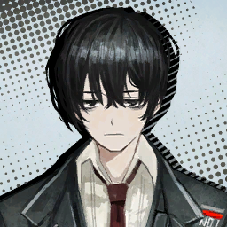

        * เสียงในหัวยี่ซัง

            ```
            We were neither highfliers nor greedy vultures; we were merely children who loved technology.
            พวกเราไม่ใช่ทั้งคนที่ทะเยอทะยาน หรือ อีแร้งจอมละโมบ; พวกเราก็เป็นเพียงแค่เด็กที่รักในเทคโนโลยี
            ```
            ```
            Do you remember the day when we first felt that we were breathing?
            คุณจำได้หรือเปล่า ในวันแรกที่รู้สึกตัวว่าตัวเองกำลังหายใจ?
            ```
            ```
            Back then…
            ในตอนนั้น...
            ```
            ```
            That breath alone would suffice.
            เพียงแค่หายใจก็เกินพอแล้ว
            ```
            ```
            Or perhaps…
            หรือบางที...
            ```
            ```
            It was the air that was exceptionally clear that day.
            มันก็อาจเพราะอากาศที่ ปลอดโปร่ง/แจ่มใส เป็นพิเศษในวันนั้น
            ```
        
        ```
        Yi Sang: It is time… to turn the clock.
        ยี่ซัง: มันได้เวลาแล้ว... ที่จะหมุนนาฬิกากลับ
        ```

        ---

        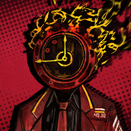

        * เสียงในหัว

            ```
            I can hear Yi Sang, the only conscious Sinner at the moment, muster up his remaining strength to speak.
            ฉันได้ยินยี่ซัง คนบาปเพียงหนึ่งเดียวที่ยังคงมีสติในตอนนี้ รวบรวมแรงที่เหลืออยู่เพื่อพูดออกมา
            ```
            ```
            The others are on the floor among dismembered corpses like powerless puppets.
            กับคนอื่น ๆ ที่นอนกองอยู่บนพื้น กับกองศพที่แหลกเป็นชิ้น ๆ ไม่ต่างอะไรกับหุ่นเชิดไร้พลัง 
            ```
            ```
            Fatal injuries were left by an Abnormality.
            พร้อมกับบาดแผลสาหัสที่คงไว้บนตัวของ แอบนอร์มาลิตี/สิ่งแปลกปลอม
            ```
            ```
            Yet, we are in the middle of a Nest.
            แต่ไม่ใช่ว่าเราอยู่ใจกลางเนสหรอกหรอ
            ```
            ```
            Weren’t Abnormalities… supposed to be confined within Lobotomy Corp’s branch facilities or dungeons?
            ไม่ใช่ว่าสิ่งแปลกปลอมพวกนี้... ต้องถูกกักกัน ภายในสาขาย่อยของศูนย์วิจัยโลโบโตมี่ หรือ ดันเจี้ยนพวกนั่นหรอ?
            ```
            ```
            Meanwhile, the Abnormality pierced Yi Sang’s abdomen as I wondered.
            ในขณะที่เดียวกัน สิ่งแปลกปลอมนั่นก็แทงทะลุท้องของยี่ซัง เหมือนที่ฉันคิดไว้ไม่มีผิด
            ```
            ```
            I had no one else to share this question with.
            ฉันไม่เหลือใครให้ถามแล้วนะ
            ```

        ---
        
        **Location: Aboard Mephistopheles | บนรถเมฟิสโตเฟเลส**

        ---

        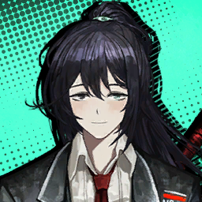

        ```
        Hong Lu: Where are we going this time?
        ฮงหลู่: ครั้งนี้ เราจะไปไหนกันหรอครับ?
        ```
        
        ---

        * เสียงในหัว

            ```
            The Sinners seemed to grow quite accustomed to this work.
            เหล่าคนบาปดูจะเริ่มคุ้นเคยงานนี้
            ```
            ```
            As if we were on a roadtrip, some were far less hesitant to ask about our next destination.
            แล้วก็ถ้านี้เป็นโรดทริป บางคนก็คงกล้าถามกว่านี้ว่าเรากำลังจะไปไหน
            ```

        ---

        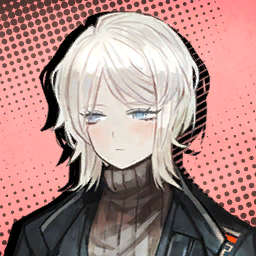

        ```
        Faust: That’s not quite the right question. This mission begins with a person, rather than a place.
        เฟาสท์: ถามแบบนั่นก็ไม่เชิงนะคะ เพราะ ภารกิจนี้ขึ้นอยู่กับ คน/ใคร มากกว่า สถานที่/ที่ไหนค่ะ
        ```

        ---

        
        
        ```
        Yi Sang: A person, you say?
        ยี่ซัง: เธอพูดว่าคนงั้นหรอ?
        ```

        ---

        

        ```
        Faust: We happen to have a client.
        เฟาสท์: พอดีว่าเรามีลูกค้าน่ะค่ะ
        ```

        ---

        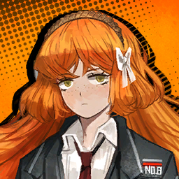

        ```
        Ishmael: You mean… We take requests from outside like we’re a Fixer Office or something?
        อิชมาเอล: เธอกำลังจะหมายความว่า... พวกเรารับคำขอจากข้างนอกเหมือนกับว่าเราเป็นเจ้าหน้าที่ฟิกเซอร์ หรือ อะไรอย่างงั้นหรอ?
        ```

        ---

        

        ```
        Don Quixote: Oho, hath our carriage begun to be frequented by requests already?¡Excelente! It may take little time at all to become a renowned Fixer!
        ดอน กิโฆเต้: โอ้วหิ รถม้าของเราเริ่มมีคนมาติดต่อขอใช้บริการบ้างแล้วสินะขอรับ? สุดยอดไปเลย! มันอาจต้องใช้เวลาสักหน่อยจนกว่าจะกลายเป็นฟิกเซอร์ที่เป็นที่รู้จัก! 
        ```

        ---

        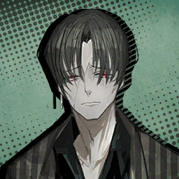

        ```
        Vergilius: Quiet. I’ll be answering questions.
        วอร์จิลิอุส: เงียบซะ ฉันจะตอบคำถามของพวกแกเอง
        ```
        ```
        Vergilius: As you all know, the Golden Boughs are a relatively recent discovery.
        วอร์จิลิอุส: อย่างที่พวกแกรู้ ว่ากิ่งทองเป็นสิ่งใหม่ที่พึ่งถูกค้นพบเมื่อไม่นานมานี้
        ```
        ```
        Vergilius: Fortunately, J Corp. and D Corp. didn’t have much interest when we visited their districts.
        วอร์จิลิอุส: โชคดีที่เจคอร์ปกับดีคอร์ปไม่ให้ความสนใจมากนัก ถ้าเราจะเข้าไปในเขตของพวกเขา
        ```
        ```
        Vergilius: That is why those facilities were populated by no more than Backstreets miscreants or ragtag Syndicates.
        แต่เพราะนั่นเองก็เป็นเหตุผล ว่าทำไมสถานที่เหล่านั่นถึงเต็มไปด้วยพวกอัธพาลจากเบคลสตรีท หรือไม่ ก็ซินดิเคตที่กระจายตัว
        ```
        ```
        Vergilius: However…There are Wings that have caught wind of their existence and value early, like K Corp, whose turf we’re in right now.
        วอร์จิลิอุส: ถึงอย่างนั้น...มันก็มี วิงส์/Wing หูดีประสาทดีที่สัมผัสได้ถึงกระแสลมแห่งการมีตัวตน และมูลค่าของพวกมันอยู่ เหมือนอย่างเคคอร์ป ที่เรากำลังเหยียบหางอยู่ตอนนี้
        ```
        
        ---

        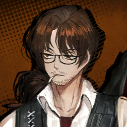
        
        ```
        Gregor: Hmm? But I thought we’d already taken the Golden Bough here in K Corp’s Nest?
        เกรกอร์: หืมม? แต่ไม่ใช่ว่าเราพึ่งเก็บกึ่งทองที่นี้ในเนสเคคอร์ปหรอครับ?
        ```

        ---

        

        ```
        Vergilius: I never said that there were any rules that say only one Bough may exist in a District.
        วอร์จิลิอุส: ฉันเคยบอกด้วยรึไง ว่ามันมีกฎข้อไหนที่เขียนว่ากึ่งทองจะมีได้แค่อันเดียวในเขตหนึ่ง 
        ```
        ```
        Vergilius: The distribution of Lobotomy Corp’s branch facilities is more complicated than you’d expect. They can be found everywhere… spread quite literally like tree branches.
        วอร์จิลิอุส: การกระจายตัวสาขาย่อยของศูนย์วิจัยโลโบโตมี่นั่นซับซ้อนเกินกว่าที่แกจะรู้ซะอีก พวกมันสามารถถูกพบได้ทุกที่... กระจายตัวแทรกไปทุกหนแห่งไม่ต่างอะไรกับกิ่งของต้นไม้
        ```

        ---

        

        ```
        Sinclair: Like how one was connected to our estate’s basement…
        ซินแคร์: เหมือนอันนั่นใช่ไหมครับ ที่ติดกับห้องใต้ดินครอบครัวผม...
        ```
        
        ---
    
        

        ```
        Vergilius: There also haven’t been any clear definitions about who owns the Boughs.
        วอร์จิลิอุส: อีกอย่าง ก็ไม่มีนิยามอะไรตายตัวว่าใครจะเป็นผู้ครอบครองกิ่งทอง
        ```
        ```
        Vergilius: Which is why everyone’s been playing by the primitive rule that “the first finders of a Bough are its keepers”.
        วอร์จิลิอุส: ซึ่งเป็นสาเหตุว่าทำไมทุกคนถึงเล่นตามกฎสากลดั้งเดิมที่ว่า “ใครเจอก่อน ก็ได้ก่อน”
        ```

        ---

        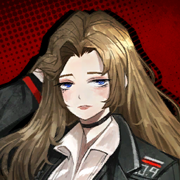
        
        ```
        Rodion: Well, that’s how it usually goes with slumbering treasures~
        โรเดียน: แหม นั่นก็เป็นสิ่งที่เกิดขึ้นตลอดกับบรรดาขุมทรัพย์ที่ถูกซ่อนนั้นแหละน้า~
        ```

        ---

        
        
        ```
        Gregor: In that case… Are you telling us that we’ve accepted the request to earn ownership of a Golden Bough?
        เกรกอร์: ถ้างั้น... คุณกำลังจะบอกว่าเราพึ่งรับคำขอให้เก็บกู้ และช่วงชิงอำนาจถือครองกิ่งทองนั่นมาใช่ไหม? 
        ```

        ---

        
        
        ```
        Vergilius: To be exact, they made the offer first.
        วอร์จิลิอุส: พูดให้ถูก คือ พวกเขาเป็นฝ่ายเสนอเราก่อน 
        ```
        ```
        Vergilius: Since a Golden Bough is on the line, we have…
        วอร์จิลิอุส: แล้วพอกิ่งทองกลายเป็นรางวัลที่อยู่บนเส้นชัย พวกจะไปทำอะไรได้ นอกจาก...
        ```

        ---

        
    
        ```
        Ishmael: No choice… I get it now.
        อิชมาเอล: ไม่ใช่ทางเลือก... ฉันเข้าใจแล้ว
        ```

        ---

        

        ```
        Vergilius: Thus… Haaa, I don’t know how many times I have to remind you of this, but do not do anything to aggravate the client.
        วอร์จิลิอุส: ดังนั้น... ฮาาา ฉันไม่รู้ว่าต้องเตือนเรื่องนี้กับพวกแกอีกกี่ครั้ง แต่อย่าทำอะไรให้สถานการณ์ระหว่างเรากับลูกค้าแย่ลงโดยเด็ดขาด
        ```

        ---

        

        ```
        Dante: <By the way…>
        ดันเต้: <ยังไงก็เถอะ...>
        ```

        ---

        
        
        ```
        Vergilius: Now then, keep your mouths shut until you’re there. All as usual.
        วอร์จิลิอุส: ที่นี้ ก็ช่วยหุบปากของพวกแกจนกว่าจะถึงที่นั่น เหมือนตลอดมาก็แล้วกัน
        ```

        ---

        

        ```
        Dante: <……>
        ดันเต้: <......>
        ```
        
        ---

        
        
        ```
        Faust: Dante seemed to have something to say.
        เฟาสท์: ดูเหมือนดันเต้มีอะไรอยากจะพูดนะคะ
        ```

        ---

        

        ```
        Dante: <…Thank you, Faust.>
        ดันเต้: <...ขอบคุณมาก เฟาสท์>
        ```

        ---

        

        ```
        Vergilius: Ah, sorry about that, Dante. I do hope you understand that it’s quite cumbersome to grow used to the concept that the ticking of a clock can be something to respond to.
        วอร์จิลิอุส: อา โทษทีโทษที ดันเต้ ฉันหวังว่านายจะเข้าใจ ว่ายุ่งยากแค่ไหนที่ต้องเคยชินตลอดเวลากับแนวคิดที่ว่า เสียงนาฬิกาเป็นอะไรที่ต้องตอบรับ
        ```

        ---

        

        ```
        Dante: <…So what are Golden Boughs used for, anyway?>
        ดันเต้: <...แล้ว เราจะเอากิ่งทองไปทำอะไรล่ะ?>
        ```
        ```
        Dante: <When I think about it, all we were told was a vague order to collect them… And nothing about what the company plans to do with them.>
        ดันเต้: <พอมาคิดดูแล้ว สิ่งที่เราถูกบอกมาตลอดก็มีแต่คำสั่งที่ครุมเครือ อย่างเช่นการเก็บกู้มัน หรืออะไรอย่างนั้น... และพวกเราก็ไม่รู้เลยว่าองค์กรวางแผนจะเอามันไปทำอะไร>
        ```

        ---

        


        ```
        Faust: ……
        เฟาสท์: ......
        ```
        ```       
        Faust: They’re asking about the purpose of the Golden Boughs.
        เฟาสท์: เขาถามเกี่ยวกับวัตถุประสงค์ของกิ่งทองนะคะ
        ```

        ---

        

        ```
        Vergilius: …Uh-huh.
        วอร์จิลิอุสซ ...อา-หะ
        ```
        ```
        Vergilius: I see you’ve finally begun to ruminate on subjects, Manager Dante. Here you are, growing curious about the company’s plans.
        วอร์จิลิอุส: เห็นทีว่าในที่สุด นายก็เริ่มขบคิดไตร่ตรองและรู้จักตั้งคำถามสักทีสินะ คุณผู้จัดการดันเต้ ยินดีด้วย ให้กับความสงสัยก้าวแรกสู่แผนการบริษัท
        ```
        ```
        Vergilius: Then I ought to aid your management as a guide by providing kind explanation.
        วอร์จิลิอุส: อุตส่าห์คิดได้ตั้งขนาดนี้ ถ้างั้นฉันเอง ก็ควรที่จะช่วยสนุนสนุนนายกับการทำงานในฐานะผู้จัดการบ้าง ด้วยการอธิบายอย่างเป็นกันเอง และเข้าใจง่าย
        ```
        ```
        Vergilius: The Golden Boughs…
        วอร์จิลิอุส: กิ่งทองน่ะ...
        ```
        ```
        Vergilius: They are branches, as their name suggests. That’s what we call stems growing from the trunk of a tree. These ones happen to have a golden glow.
        วอร์จิลิอุส: พวกมันคือกึ่งไม้ เหมือนที่ชื่อมันบอกนั่นแหละ และมันก็เป็นสิ่งที่เราเรียกว่ากิ่งก้านที่งอกออกมาจากลำต้นของต้นไม้ โดยที่เจ้าพวกนั่นมีสีทองอร่าม
        ```

        ---

        

        ```
        Don Quixote: Ohoooo… Forsooth…
        ดอน กิโฆเต้: โอ้วววว... งี้นี้เองงง...
        ```

        ---

        * เสียงในหัว
            ```
            Don Quixote was the only one responding passionately to this information.
            ดอนกิโฆเต้เป็นเพียงคนเดียวที่ตอบสนองข้อมูลนั่นด้วยท่าทีที่หลงไหล
            ```
            ```
            Thanks to this exchange, he painted me as an ignorant bloke who doesn’t even know what a branch is.
            ต้องขอบใจเลยจริง ๆ ที่เขามองฉันเป็นแค่ไอโง่ที่ไม่รู้ประสีประสาว่ากิ่งไม้คืออะไร
            ```
            ```
            Rodya shrugs at me as if to chaff me for expecting a real answer.
            โรดย่ายักไหล่ให้ฉัน อย่างกับจะเยาะเย้ยฉันที่หวังจะได้คำตอบจริง ๆ 
            ```

        ---

        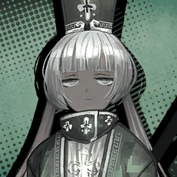

        ```
        Charon: Verg, the road is blocked. Should I go around it?
        ชารอน: วอร์ค ถนนมันโดนบัง ให้ฉันขับอ้อมไหม?
        ```

        ---

        

        ```
        Vergilius: ......
        วอร์จิลิอุส: ......
        ```

        ---

        

        ```
        Ishmael: It’s blocked?
        อิชมาเอล: โดนบังเนี้ยนะ?
        ```
        ```
        Ishmael: Strange that there’s a blocked road. This is in the middle of K Corp’s Nest, too; it’s unlikely that there’s a scene—
        อิชมาเอล: แปลกชะมัด ที่จะมีถนนที่โดนบัง นี้มันใจกลางเนสเคคอร์ปนะ; อีกอย่าง ที่นี้ก็ดูเหมือนจะไม่ได้เกิดเหตุการณ์อะไรด้ว—
        ```
        
        ---

        

        * เสียงในหัว
        
            ```
            Before Ishmael could finish her sentence, a dull thud at the window interrupted her.
            ก่อนที่อิชมาเอลจะพูดจบประโยค เสียงตุบอันหนักอึ้งของบางอย่างที่กระทบกระจกก็ขัดเธอ
            ```

        ---

        

        ```
        Rodion: …Something just got flung at the bus and boinked off… That was a person, wasn’t it?
        โรเดียน: ...ไม่ใช่ว่ามีอะไรโดนเขวี้ยงใส่บัส แล้วกระเด็นออกไปหรอกใช่ม้า... เป็นคนหรือเปล่าน้า? *เหอะ ๆ*
        ```

        ---

        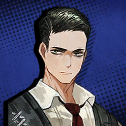

        ```
        Meursault: A male individual who appears to be in his early 40s. There seems to be a serious injury in his occipital region. He had already died before the impact.
        เมอร์โซลท์: เป็นผู้ชายอายุประมาณสี่สิบต้น ๆ และมีร่องรอยของบาดแผลบริเวณใกล้กับท้ายทอยเขาด้วย ดูเหมือนว่าเขาจะตายก่อนหน้าที่จะชนกับรถบัส 
        ```

        ---

        

        ```
        Vergilius: Yeah, sure doesn’t seem like the average scuffle.
        วอร์จิลิอุส: ถูกเพ้ง แถมแม่งดูไม่เหมือนการวิวาทธรรมดาซะด้วย
        ```
        ```
        Vergilius: Pitstop. If it’s a problem you can handle, come back after you’re done.
        วอร์จิลิอุส: เราจะแวะตรงนี้ ถ้ามันเป็นปัญหาที่พวกแกรับมือได้ ก็รีบจบ แล้วกลับมาซะ
        ```

        ---

        

        ```
        Rodion: …And what about if it isn’t?
        โรเดียน: ...แล้วถ้ามันไม่ใช่ล่ะ?
        ```

        ---

        

        ```
        Vergilius: The clock’ll have to spin until it’s been dealt with.
        วอร์จิลิอุส: ถ้าไม่ใช่... คุณนาฬิกาคงต้องหมุนจนกว่ามันจะโดนจัดการนั่นแหละ
        ```

        ---

        
        
        ```
        Dante: <That’s one elegant way to tell us to go die a thousand deaths…>
        ดันเต้: <เป็นวิธีบอกให้พวกเราไสหัวไปตายเป็นพันรอบที่สง่างามซะไม่มีอะ...>
        ```

        ---

        

        ```
        Rodion: Hm, now then…
        โรเดียน: หืม เอางั้นก็ได้...
        ```
        ```
        Rodion: Off the bus.
        โรเดียน: ทุกคนลงบัสได้
        ```

        ---

        

        ```
        Vergilius: ......
        วอร์จิลิอุส: ......
        ```

        ---

        

        ```
        Rodion: What? Weren’t you about to say the same thing anyway? Saved you the trouble~
        โรเดียน: อะไรกัน? ไม่ใช่ว่าคุณจะพูดเหมือนเดิมหรอ? ช่วยเซฟเวลาไง~
        ```

        ---

        

        ```
        Hong Lu: I just can’t wait, what adventures are in store for us this time?
        ฮงหลู่: ผมชักจะรอไม่ไหวแล้วสิ การผจญภัยแบบไหนกันที่กำลังรอเราอยู่ภายภาคหน้า? 
        ```

    ---

    * **Episode: 2 | ตอนที่ 2<br>Location: Nest K's Streets | ถนนเนสเค**

        

        ```
        Faust: As you saw through the bus… we are in the middle of a Nest. A place that should be the furthest from unexpected trouble.
        เฟาสท์: อย่างที่ทุกคนเห็นผ่านบัส... ว่าเรากำลังอยู่ใจกลางเนส สถานที่ที่ควรจะห่างไกลที่สุดจากปัญหาอันไม่คาดคิด
        ```

        ---

        

        ```
        Hong Lu: Hmm… Would that mean this is a precious commotion? 
        ฮงหลู่: หืมม... งั้นก็หมายความว่านี้ต้องเรื่องวุ่นวายสุดยอดเลยใช่ไหมครับ?
        ```

        ---

        

        * เสียงในหัว
        
            ```
            Everyone except drowsy Hong Lu was tensed up, carefully observing what was going on…
            ทุกคนยกเว้นฮงหลู่ที่งัวเงียเกร็งไปหมด พร้อมกับตั้งหน้าตั้งตาสังเกตสิ่งที่เกิดขึ้น...
            ```

        ```
        Dante: <Hm? Is that…>
        ดันเต้: <หืม? นั่นมัน...>
        ```

        ---

        * เสียงในหัว

            ```
            Someone was running our way in a hurry from the other side.
            ใครบางคนกำลังวิ่งมาทางพวกเราด้วยท่าทีที่รีบร้อนจากอีกฝากหนึ่งของถนน
            ```
            ```
            The civilian was too hurried to look ahead; they bumped into the Sinners and fell to the ground.
            และดูเหมือนว่าประชาชนคนนั่นจะรีบร้อนเกินไปที่จะมองรอบ ๆ; ก่อนที่เธอจะพุ่งชนคนบาป และล้มลงกับพื้น
            ```

        ---

        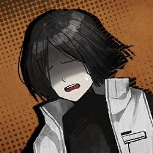

        ```
        Running Civilian: Huff, huff… D-Don’t go that way!
        ประชาชนที่วิ่งหนีตาย: เฮือก เฮือก... อ-อย่าไปทางนั่นนะ!
        ```

        ---

        

        ```
        Don Quixote: Come now, you may rest easy! We have galloped hither to save innocent lives such as yours for we are—
        ดอน กิโฆเต้: เอาน่า เจ้าพักก่อนเถอะ! พวกเราควบม้ามาที่นี้ก็เพื่อช่วยเหลือชีวิตของผู้บริสุทธิ์เยี่ยงพวกเจ้า เพราะเราคือ—
        ```

        ---

        

        ```
        Ishmael: We are no such things as heroes, so please don’t say anything unnecessary.
        อิชมาเอล: เราไม่ได้เป็นอะไรที่ใกล้เคียงกับฮีโร่เลยสักนิด เพราะงั้น ก็ช่วยหยุดพูดอะไรที่ไม่จำเป็นสักที
        ```

        ---

        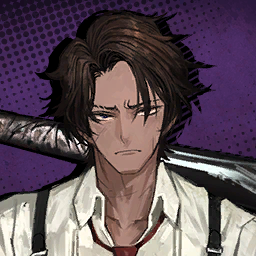

        ```
        Heathcliff: Oi, we need to cross here. If you’re here to stop us for nothing, then I’ll give you a taste of this bat.
        ฮิธคลิฟฟ์: โอ่ย เราต้องข้ามตรงนี้ไปนะเฟ้ย ถ้าแกอุตสาห์ทอมาถึงนี้เพื่อหยุดพวกเรา งั้นฉันก็คงไม่มีทางเลือกอื่น นอกจากให้แกได้ลิ้มสชาติของกระบองนี้ 
        ```

        ---

        

        * เสียงในหัว

            ```
            Looking at Heathcliff’s intimidating face and Ishmael’s frowned expression in turn, the civilian seemed to take a moment to consider which would be more of a threat.
            พอมองหน้าฮิธคลิฟฟ์ที่ดุอย่างกับหมา กับ ท่าทีบูดบึ้งของอิชมาเอล ฉันก็ชักจะไม่แน่ใจแล้วนะ ว่าประชาชนคนนั่นจะคิดว่าอะไรกันที่อันตรายกว่า
            ```
        
        ---

        

        ```
        Running Civilian: There’s… something ahead… something that shouldn’t be real…
        ประชาชนที่วิ่งหนีตาย: มันมี... ตัวอะไรบางอย่างอยู่ข้างหน้านี้... ตัวอะไรสักอย่างที่ควรมีอยู่จริง...  
        ```
        ```
        Running Civilian: I dunno what it was, I’ve never seen anything like it… Everyone was screaming and running, and then… people rolling on the floor… set on fire…
        ประชาชนที่วิ่งหนีตาย: ฉันไม่รู้ว่ามันเป็นตัวอะไร ฉันไม่เคยเห็นอะไรแบบนั่นมาก่อน... ทุกคนต่างกรีดร้องและวิ่งหนีตาย แล้วก็มีคน... ที่กลิ้งไปมาอยู่บนพื้น... ไฟลุกท่วมไปทั้งตัว...
        ```

        ---

        

        ```
        Meursault: Did the entity you witnessed have a form that does not resemble a human?
        เมอร์โซลท์: ขอเสียมารยาทหน่อยนะครับ แต่ผมขอสอบถามได้ไหมว่า ตัวตนที่คุณพบเห็นมีลักษณะร่างกายที่ไม่เหมือนมนุษย์ใช่ไหม?
        ```

        ---

        
        
        ```
        Running Civilian: …Yeah, you’re right. That’s right…!
        ประชาชนที่วิ่งหนีตาย: ...ใช่ ตามที่คุณว่าเลย นั่นแหละ...!
        ```

        ---

        

        ```
        Ishmael: Then, if it isn’t a person… Keeping the suspected possibilities in our minds, we headed for the center of the disturbance…
        อิชมาเอล: งั้น ถ้ามันไม่ใช่คน... ก็ตั้งข้อสันนิษฐานไว้ได้เลย ว่าพวกเรากำลังมุ่งหน้า ไปยังจุดศูนย์กลางของความโกลาหล
        ```

        ---

        **Location: Nest K’s Ruined Streets | ถนนเนสเคที่ทรุดตัว**
        
        ---

        

        ```
        Sinclair: W—What’s going on here?
        ซินแคร์: ก-เกิดอะไรขึ้นที่นี้?
        ```

        ---

        

        ```
        Heathcliff: It could, er… be a Distortion or whatever, no? Like that chicken place?
        ฮิธคลิฟฟ์: มันอาจเป็นฝีมือของไอนั่น... ที่เขาเรียกว่าอะไรนะ? บิดบงบิดเบี้ยวอะไรนั่นน่ะ? เหมือนกับไอไก่ที่เราเคยเจอในร้านคราวก่อน? 
        ```

        ---

        

        ```
        Dante: <No… That’s different… That one is an Abnormality, not a Distortion. I’m sure of this… somehow.>
        ดันเต้: <ไม่... นั่นไม่เหมือนกัน... ไอนั่นมันเป็นสิ่งแปลกปลอม ไม่ใช่ผู้บิดเบี้ยว ไม่รู้เหมือนกันว่าทำไม... แต่ฉันมั่นใจว่าอย่างนั่น>
        ```

        ---

        

        ```
        Faust: As Dante suggested, that entity is likely to be an Abnormality. Our manager is able to “sense” it.
        เฟาสท์: อย่างที่ดันเต้พูดเลยค่ะ ตัวตนนั่นน่าจะเป็นสิ่งแปลกปลอม และดูเหมือนว่าคุณผู้จัดการของเราจะสามารถ “สัมผัส” ถึงมันได้ค่ะ 
        ```

        ---

        

        ```
        Dante: <But then, why…>
        ดันเต้: <แล้วทำไม...>
        ```
        ```
        Dante: <Why is an Abnormality in the middle of a Nest?>
        ดันเต้: <ถึงมีสิ่งแปลกปลอมอยู่ใจกลางเนสได้ล่ะ?>
        ```

        ---

        
        
        ```
        Faust: It’s a phenomenon of which Faust has never been notified. Most Lobotomy Corp. facilities were shut down as soon as the Wing was dissolved.
        เฟาสท์: มันเป็นปรากฎการณ์ที่เฟาสท์ไม่เคยได้รับแจ้งมาก่อนเลยค่ะ ศูนย์วิจัยโลโบโตมี่มากกว่าร้อยละแปดสิบ ถูกปิดตายหลังการล้มสลายของวิงส์
        ```

        ---

        

        * เสียงในหัว

            ```
            I was reminded of the site burial Yuri told us about, but I quickly shook off those gloomy memories.
            พอเธอพูดเรื่องนั่น ก็ทำเอาฉันนึกสิ่งที่ยูริเคยบอกกับเรา เกี่ยวกับศูนย์วิจัยที่ถูกฝังกลบ ก่อนที่ฉันจะปัดความทรงจำแสนอึมครึมพวกนั่นไป และตั้งสติ
            ```

        ---

        

        ```
        Faust: Even if an Abnormality did break out in the meantime, there should have been a report informing us of such a fact before this mission.
        เฟาสท์: เพราะฉะนั้น ถ้าเกิดว่ามีสิ่งแปลกปลอมออกมาระหว่างช่วงเวลานั่น มันก็ควรที่จะมีรายงานที่บอกเราเกี่ยวกับข้อเท็จจริงในส่วนนี้ ก่อนที่จะเริ่มภารกิจ
        ```
        ```
        Faust: It’s hard to imagine that the LCC would have been unable to notice if such an event actually occurred.
        เฟาสท์: มันยากที่จะจินตนาการว่า เอลซีซี ทำพลาด และไม่สามารถรับรู้ ได้ถึงเหตุการณ์ที่เกิด ณ ขณะนั่น
        ```

        ---

        

        ```
        Sinclair: …Could they be the security staff that gets sent by K Corp?
        ซินแคร์: ...แล้วถ้าเกิด ว่าพวกมันเป็นเจ้าหน้าที่รักษาความปลอดภัยที่ถูกส่งมาโดยเคคอร์ปล่ะครับ?
        ```

        ---

        

        ```
        Ishmael: Rather than suppressing the Abnormality… they’re just getting completely wrecked.
        อิชมาเอล: แทนที่จะกักกันสิ่งแปลกปลอมพวกนั่นไว้ได้... พวกแม่งก็เล่นโดนมันซัดซะยับเยินแทน
        ```

        ---

        

        ```
        Gregor: Mmh… It sorta takes me back to the time when we got beat bad in D Corp’s District…
        เกรกอร์: เห้อ... ทำเอาฉันนึกถึงตอนนั่นเลย ที่เราต้องไปทำภารกิจในเขตดีคอร์ป แล้วสุดท้ายก็โดนจัดการกันซะอ่วมจนต้องวิ่งแจ้นกลับมา...
        ```

        ---

        

        ```
        Rodion: Aw, c’mon~ First, that chicken restaurant guy goes cuckoo, and now this? I’m really over this kinda Nest K welcome…
        โรเดียน: โถ่ เอาน่า~ ตอนแรกก็เป็นไก่เจ้าของร้านที่เสียสติ พอมางวดนี้ก็ยังจะมี...? ฉันชักจะทนไม่ไหวกับการต้อนรับนี้ของเนสเคแล้วนะ...
        ```

        ---

        

        * เสียงในหัว

            ```
            Right as they complained…
            ไม่มีอะไรจะเถียงเลย...
            ```

        ---

        

        ```
        Heathcliff: Gah! Bloody…
        ฮิธคลิฟฟ์: เห้ย! เวรเอ้ย...
        ```

        ---

        

        * เสียงในหัว
            
            ```
            Debris created by the rampaging Abnormality narrowly grazed past us.
            ซากปรักหักพักที่เกิดขึ้นจากการอาละวาดอันเป็นฝีมือของสิ่งแปลกปลอมกระเด็นเฉี่ยวพวกเราไปไม่ถึงเมตร
            ```
            
        ---

        

        ```
        Heathcliff: Hah, the hell are you doing? Just watching from here won’t do any of us any good!
        ฮิธคลิฟฟ์: หะ *ถอนหายใจ* มัวทำบ้าอะไรของแกอยู่? เอาแต่ยืนมองอยู่ตรงนั่นแม่งก็ไม่ช่วยอะไรเราเลยนะเว้ย! 
        ```
        ```
        Heathcliff: …It’ll crush us all to a pulp.
        ฮิธคลิฟฟ์: ...เดี๋ยวก็โดนมันทับแบน ตายเป็นเนื้อผลไม้ซะหรอก
        ```

        ---

        
        
        ```
        Outis: ......
        เอาทิส: ......
        ```
        ```
        Outis: You’re gravely mistaken. Have that insane brat’s daily ramblings finally managed to brainwash you?
        เอาทิส: นายเข้าใจอะไรผิดหรือเปล่าเนี้ย นี้คำพูดเพ้อเจ้อรายวันของไอเด็กบ้านั่น ในที่สุดก็ล้างสมองนายได้แล้วหรอ?
        ```

        ---

        

        ```
        Don Quixote: Ho, hark? I prithee, who dost thou mean by this “insane brat”?
        ดอน กิโฆเต้: อุ้ย? ข้าขออนุญาติถามได้ไหมขอรับ? ว่า “เด็กบ้า” ที่ท่านหมายถึงคือใคร?
        ```
        
        ---

        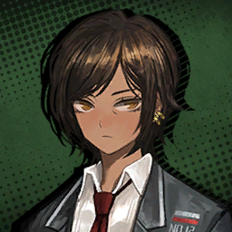

        ```
        Outis: The guide only instructed us to return once the commotion has been dealt with. He never ordered us to deal with it ourselves.
        เอาทิส: ท่านผู้นำทางแค่บอกเราให้กลับมา เมื่อเรื่องวุ่นวายสิ้นสุดลงแล้ว เขาไม่ได้สั่งเราเลยสักคำ ว่าให้จัดการมันด้วยตัวเอง
        ```
        
        ---

        

        ```
        Heathcliff: For goodness’ sake, what’s there to be so damn obtuse about?
        ฮิธคลิฟฟ์: จะให้หนีกับผีนะสิ มีเรื่องอะไรที่ต้องกังวลนักกังวลหนา?  
        ```
        ```
        Heathcliff: Didn’t you see what just happened? It almost blew my head off! Who knows what else will happen if it keeps up!
        ฮิธคลิฟฟ์: แกเห็นสิ่งที่เกิดขึ้นเมื่อกี้ไหม? แม่งเกือบทำหัวฉันขาด! แล้วใครจะรู้ล่ะว่ามันจะทำอะไรได้อีก ถ้ามันยังลอยนวลต่อไป!  
        ```
        ```
        Heathcliff: This’ll be over if we just beat that damn thing down… What else do we got? Parking a seat to keep watching, gobbling some chicken? Huh?!
        ฮิธคลิฟฟ์: เรื่องนี้จะจบลงก็ต่อเมื่อเราโค่นไอห่านั่นได้สำเร็จ... แล้วแกยังจะเอาอะไรอีก? นั่งดูความวินาศบนรถบัส แล้วก็กินไก่รอความตายหรือไง? หะ?!   
        ```

        ---

        

        ```
        Outis: There’s no need to waste our lives on fights unrelated to our missions.
        เอาทิส: ไม่มีความจำเป็นที่เราจะเอาชีวิตของตัวเองไปทิ้งในการต่อสู้ ซึ่งไม่เกี่ยวข้องอะไรกับภารกิจที่เราได้รับมอบหมาย
        ```
        ```
        Outis: I’m sure you filth didn’t even realize, but here’s the thing…
        เอาทิส: ฉันมั่นใจ ว่าไอโสโครกอย่างนายคงยังไม่รู้ตัว แต่นี้คือสิ่งที่มันเป็น...  
        ```
        ```
        Outis: The more you die, the less efficient you become in battle.
        เอาทิส: ยิ่งนายตายมากเท่าไหร่ ก็หมายถึงการที่นายจะด้อยประสิทธิภาพในการต่อสู้มากขึ้นเท่านั้น
        ```
        ```
        Outis: Experiencing a certain pain will make you learn to fear and avoid it.
        เอาทิส: การประสบกับความเจ็บปวดเดิม ๆ ซ้ำ ๆ จะทำให้นายเรียนรู้ที่จะกลัว และหลีกเลี่ยงมัน 
        ```

        ---

        

        ```
        Meursault: ......
        เมอร์โซลท์: ......
        ```

        ---

        

        ```
        Sinclair: …People are dying over there as we speak, though?
        ซินแคร์: ...รู้ใช่ไหม ว่าในระหว่างที่เราคุยกัน ผู้คนพวกนั่นกำลังค่อย ๆ ล้มตายกันอยู่?
        ```

        ---

        

        ```
        Outis: Although it will cost much time and many lives… they will eventually suppress it. Just as we do.
        เอาทิส: ถึงแม้ว่ามันจะต้องใช้เวลาอีกนานแค่ไหน หรือ ต้องแลกกับอีกกี่ชีวิตที่ต้องเสียไป... ในท้ายที่สุด เดี๋ยวพวกเขาก็หยุดมันได้เองเหมือนกับเรานั่นแหละ
        ```
        ```
        Outis: And I must say… I didn’t expect a whining amateur who’d cry out for his parents whenever he died to willingly suggest self-sacrifice.
        เอาทิส: แต่ต้องยอมรับเลยจริง ๆ... ว่าฉันไม่คิดไม่ฝัน ว่ามือสมัครเล่นขี้แยอย่างเธอ ที่เอาแต่ร้องไห้ให้กับครอบครัว ในตอนที่เขาตั้งใจจะเสียสละตนเองเพื่อให้เธอวิ่งหนี
        ```
        ```
        Outis: Death has become a triviality to you, has it?
        เอาทิส: ความตายคงกลายเป็นเรื่องธรรมดาสำหรับเธอไปแล้ว ใช่ไหม?
        ```

        ---

        

        ```
        Sinclair: ......
        ซินแคร์: ......
        ```

        ---

        

        ```
        Meursault: If we must make the best decision between the Sinners, it’s right to listen to her.
        เมอร์โซลท์: ถ้าเราเหล่าคนบาปจำเป็นต้องเลือกทางที่ดีที่สุด เช่นนั้น มันก็เป็นการถูกต้องที่เราจะทำตามสิ่งที่เธอบอก
        ```

        ---

        

        ```
        Dante: <I…>
        ดันเต้: <ฉัน...>
        ```

        * เสียงในหัว

            ```
            We’re not Fixers, and we certainly cannot be heroes.
            เราไม่ได้เป็นฟิกเซอร์ และเราก็ไม่มีทางเป็นฮีโร่ได้เหมือนกัน
            ```
            ```
            Turning the clock obviously hurts whenever I do it, and the pain is something I can never get used to.
            ยังไงการหมุนนาฬิกากลับก็เป็นสิ่งที่เจ็บปวดทุกครั้งที่ฉันทำมัน และความเจ็บปวดนั่น ก็เป็นอะไรที่ฉันไม่เคยชินสักที
            ```
            ```
            And yet…
            แต่ถึงอย่างนั่น
            ```

        ```
        Dante: <We should suppress it. I can’t logically explain why, but… I feel like we should.>
        ดันเต้: <เราควรที่จะปราบปรามมัน ฉันก็อธิบายในเชิงตรรกะไม่ได้เหมือนกันว่าทำไม แต่... ฉันรู้สึก ว่าเราควรทำแบบนั่น>
        ```

        ---

        

        ```
        Outis: ......
        เอาทิส: ......
        ```

        ---

        

        ```
        Heathcliff: I’d have crushed that clock and run out there if you gabbled the same rubbish, clockface.
        ฮิธคลิฟฟ์: ฉันคงจะซัดไอหน้านาฬิกานั่นของแก และวิ่งออกไปแล้ว ถ้าเมื่อกี้แกยังพล่ามเรื่องเดิม ๆ ออกมา โชคดีไปน้า คุณหน้านาฬิกา
        ```

        ---

        

        ```
        Meursault: If that is your decision, I will abide by it.
        เมอร์โซลท์: ถ้านั่นเป็นการตัดสินใจของท่าน กระผมก็พร้อมที่จะปฎิบัติตามอย่างเคร่งครัด
        ```

        ---

        

        ```
        Gregor: Yeah, aight… I’m sure you made the right call.
        เกรกอร์: ได้ จัดไป... ฉันมั่นใจว่านายเลือกได้ถูกต้องแล้วล่ะ
        ```

        ---

        

        ```
        Sinclair: Hey, um… Thank you for making that decision.
        ซินแคร์: นี้ อืม... ขอบคุณนะครับ ที่ตัดสินใจไปแบบนั่น 
        ```

        ---

        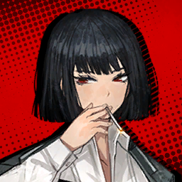

        ```
        Ryoshu: You worry too much over little things, clock. You won’t be an artist.
        เรียวชู: นายจะเอาแต่กังวลเรื่องเล็ก ๆ น้อย ๆ ไปถึงไหนกัน คุณนาฬิกา เพราะงี้ไงนายถึงยังไม่ถึงขั้นศิลปิน 
        ```

        ---

        

        ```
        Outis: …This judgement was made for none other than you, Executive Manager.
        เอาทิส: ...สิทธิ์ในการตัดสินเป็นของท่านค่ะ ท่านผู้จัดการสูงสุด
        ```

        ---

        

        * เสียงในหัว
        
            ```
            The Sinners walk ahead after leaving me comments.
            เหล่าคนบาปเดินไปข้างหน้าโดยไม่พูดอะไร
            ```
            ```
            While all the others moved forward, Faust remained and gave me a peculiar stare.
            แต่ในขณะที่ทุกคนกำลังก้าวไปข้างหน้า เฟาสท์กลับยืนอยู่กับที่ และจ้องมองมาที่ฉันด้วยสายตาที่ ประหลาดชอบกล/แปลกประหลาด
            ```

        ```
        Dante: <What is it? You think my judgement was inefficient?>
        ดันเต้: <มีอะไรหรือเปล่า? เธอคิดว่าการตัดสินใจของฉํนมันไม่มีประสิทธิภาพหรอ?>
        ```

        ---

        

        ```
        Faust: No, I just thought it would be interesting to see how you react once you’ve reclaimed your memory.
        เฟาสท์: เปล่าค่ะ ฉันแค่คิดน่ะคะ ว่ามันจะน่าสนใจมากแค่ไหน ที่จะได้เห็นคุณตอบสนองยังไง ในตอน ที่คุณได้ความทรงจำกลับมา
        ```

        ---

        

        * เสียงในหัว 

            ```
            Faust’s strange statement held me in place for a moment, but I decided I want to deal with the questions that are immediately ahead of me first.
            คำพูดที่แปลกประหลาดของเฟาสท์กับเอาฉันชะงักไปสักพัก ก่อนที่ฉันจะตัดสินใจ ว่าตัวเองต้องการที่จะจัดการคำถามพวกนั่น ที่จู่ ๆ ก็ผุดออกมาก่อน
            ```
        
        ```
        Dante: <Faust, I’ve been wondering for a while… Are you really okay with being treated like this, considering your talent and everything?>
        ดันเต้: <เฟาสท์ ฉันสงสัยมาได้สักพักแล้ว... ว่าเธอโอเคจริง ๆ หรือเปล่า กับการที่ต้องถูกปฎิบัติแบบนี้ ทั้ง ๆ ที่เธอก็เป็นฉลาดและมีพรสวรรค์มากขนาดนี้?>
        ```

        * เสียงในหัว

            ```
            Someone of her caliber should have no problem enjoying a luxurious life in the City.
            คนเก่งแบบเธอ คงมีความสุขกับชีวิตแสนสบายได้ไม่ยากในเดอะซิตี้
            ```

        ---

        

        ```
        Faust: Faust doesn’t mind. Additionally, “talent” feels like the incorrect word to describe Faust.
        เฟาสท์: เรื่องนั่นเฟาสท์ไม่ถือหรอกค่ะ อีกอย่างคำว่า “พรสวรรค์” นี้ ก็ดูจะเป็นคำที่ไม่เหมาะที่ใช้อธิบายเฟาสท์เลยนะคะ
        ```
        ```
        Faust: Many can possess talent, but Faust does not want to be included in the many.
        เฟาสท์: หลายคนมีสิ่งที่เรียกว่าพรสวรรค์ แต่เฟาสท์ไม่อยากเหมารวมตัวเองกับคนพวกนั่น
        ```
        ```
        Faust: Among the Sinners, if we were looking for a talented individual of the most commonly agreed definition, that would be… Yi Sang. For your information, I am a genius.
        เฟาสท์: ในบรรดาเหล่าคนบาป ถ้าเราจะบอกว่าใครเป็นบุคคลผู้มีพรสวรรค์อย่างแท้จริงล่ะก็ นิยามที่ถูกยอมรับโดยทั่วกัน... ก็คงเป็นยี่ซัง ส่วนฉันเป็นแค่อัจริยะ
        ```

        ---

        

        * เสียงในหัว
        
            ```
            Yi Sang stops walking behind the other Sinners and turns around to face me.
            ยี่ซังที่เดินอยู่หลังคนบาปหยุดชะงัก และหันมาหาฉัน
            ```
            ```
            Looking again, his eyes actually stare into the emptiness behind me.
            พอลองมองดี ๆ ดวงตาของเขากำลังจ้องมองไปยังความว่างเปล่าที่อยู่หลังฉัน
            ```

        ---

        

        ```
        Yi Sang: …I am no such individual.
        ยี่ซัง: ...ฉันไม่ได้เป็นคนแบบนั้น
        ```
        ```
        Yi Sang: I have long stopped fluttering my wings.
        ยี่ซัง: ตัวฉันได้หยุดที่จะกระพือปีกมานานมากแล้ว
        ```
        ```
        Yi Sang: Thus, it would be of no use to discuss my talent, Manager.
        ยี่ซัง: เพราะงั้น มันไม่มีประโยชน์อะไรที่จะสนทนาเกี่ยวกับพรสวรรค์ของฉันหรอก คุณผู้จัดการ
        ```

        ---

        

        ```
        Dante: <......>
        ดันเต้: <......>
        ```

        * เสียงในหัว

            ```
            Curiously enough, I find that some Sinners feel more distant as we spend more time together.
            ที่น่าแปลกก็คือ คนบาปบางคนยิ่งใช้เวลากับพวกเขามากเท่าไหร่ ก็รู้สึกว่าพวกเขายิ่งห่างไกลออกไปมากเท่านั่น
            ```

        ---

        

        ```
        Ryoshu: What’s that flying machine? It’s been irking me. Got the urge to S.I.D. for the three-thousandth time.
        เรียวชู: ไอเครื่องจักรที่บินได้นั่นอะไร? มันกวนใจฉันมาสักพักแล้ว ทำเอารู้สึกอยาก  ซิด/S.I.D เป็นเสี่ยง ๆ สักสามพันครั้ง  
        ```

        ---

        

        ```
        Yi Sang: That… is a device called a drone.
        ยี่ซัง: นั่น... คืออุปกรณ์ที่เรียกว่าโดรน
        ```

        ---

        

        ```
        Ishmael: Oh, they might be combat drones K Corp. sent to help us. The Wing seems to be above average in terms of technology.
        อิชมาเอล: อ้อ พวกมันก็คงเป็นโดรนจู่โจมของเคคอร์ป ที่ถูกส่งมาช่วยพวกเรา ดูเหมือนว่าวิงส์ที่นี้จะมีวิทยาการล้ำหน้ากว่าปกติแฮะ 
        ```

        ---

        

        ```
        Faust: No, viewing its design, it doesn’t appear to be equipped with combat functionalities. It also has a camera at the center.
        เฟาสท์: อาจจะยังนะคะ อ้างอิงจากการออกแบบแล้ว ดูเหมือนว่ามันจะไม่ได้ติดตั้งฟังก์ชันสำหรับการต่อสู้เอาไว้ อย่างเช่นตรงนั่นเองก็มีกล้องติดเอาไว้ตรงกึ่งกลางนั่น เห็นไหมคะ  
        ```

        ---

        

        ```
        Ishmael: Well… I guess it makes sense to get a close look at the mess happening in a well-off Nest.
        อิชมาเอล: แหม... ฉันเดาว่ามันน่าจะเป็นการเมคเซ้นส์กว่า ถ้าเราจะเข้าไปใกล้ ๆ เพื่อดูความโกลาหลที่เกิดขึ้นในเนสที่อยู่ดีแบบนี้
        ```

        ---

        

        * เสียงในหัว
        
            ```
            Abashed, Ishmael mumbled.
            อิชมาเอลพึมพัมออกมาด้วยความเขินอาย
            ```

        ---

        

        ```
        Don Quixote: Ohh! Will we be featured on the thing called the “news”?
        ดอน กิโฆเต้: โอ้ว! พวกเรากำลังถูกสลักลงไปในสิ่งนั่นที่เรียกว่า “ข่าว” ใช่ไหมขอรับ?
        ```

        ---

        

        ```
        Sinclair: Wait, something’s off… Why’re…
        ซินแคร์: เดี๋ยว มีบางอย่างผิดปกติ... ทำไม...
        ```
        ```
        Sinclair: Why are they only filming corpses and dying people?
        ซินแคร์: ทำไมพวกเขาถึงเอาแต่ถ่ายศพกับผู้คนล้มตายล่ะ?
        ```

        ---

        

        ```
        Gregor: Well, it’s the provocative stuff that draws more attention, doesn’t it?
        เกรกอร์: ก็นะ ถ้าเรื่องเร้าใจ ก็จะดึงดูดความสนใจได้มากกว่าใช่ไหมล่ะ?
        ```

        ---

        

        ```
        Rodion: “Look at this terrible incident! See how morbid it is!” or something like that.
        โรเดียน: “มองเหตุการณ์ที่แสนเลวร้ายนี้สิ! ดูสิว่ามันชั่วร้ายมากแค่ไหน!” หรืออะไรประมาณนั่นแหละ
        ```

        ---

        

        ```
        Sinclair: But…
        ซินแคร์: แต่...
        ```

        ---

        

        ```       
        Rodion: Hold up, kiddo! In front of you!
        โรเดียน: เดี๋ยวก่อน เจ้าหนู! ข้างหน้าเธอ!
        ```

        ---

        

        ```
        Sinclair: Kngh… This is… definitely weird…
        ซินแคร์: คะเอิ่ก... นี้มัน... แปลกเกินไปแล้ว...
        ```
        
        ---

        

        ```
        Dante: <Sinclair!>
        ดันเต้: <ซินแคร์!>
        ```

        ---

        

        ```
        Sinclair: Look at this thing. Why does it have its camera glued to me…?
        ซินแคร์: ดูไอนี้สิ ทำไมมันถึงติดกล้องของมันที่ตัวผม...?
        ```

        ---

        

        ```
        Ryoshu: …I don’t appreciate a soulless audience.
        เรียวชู: ...ฉันไม่ชอบคนดูที่ไร้จิตวิญญาณ
        ```

        ---

        

        ```
        Meursault: There is a considerable number of them. And these drones…
        เมอร์โซลท์: มีพวกมันมากโขอยู่นะครับ แถมโดรนพวกนี้เอง...
        ```
        ```
        Meursault: They appear to be deliberately preventing us from entering the area where the Abnormality is.
        เมอร์โซลท์: ก็กำลังจงใจที่จะขัดขว้างพวกเราไม่ให้เข้าไปในพื้นที่ที่มีสิ่งแปลกปลอมอยู่
        ```

        ---

        

        ```
        Gregor: Can’t be. We’re here to help, so they’d have no reason to get in…
        เกรกอร์: คงไม่ใช่หรอกมั้ง พวกเรามานี้ก็เพื่อช่วย เพราะงั้น พวกเขาก็คงไม่มีเหตุผลอะไร ที่จะมา...
        ```
        ```
        Gregor: Our way… right…?
        เกรกอร์: ขว้างทางพวกเรา... หรอกใช่ไหม...?
        ```

        ---

        

        * เสียงในหัว

            ```
            Now the drones have started lining up, and formed a wall as if to stop us from proceeding any farther.
            ที่นี้โดรนก็เริ่มที่จะตั้งแถว และสร้างแนวกำแพง ราวกับต้องการจะหยุดพวกเราไม่ให้ไปไกลกว่านี้
            ```
        
        ---

        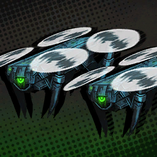

        ```
        Mysterious Drone: Greetings, citizens. Please keep ten meters of distance for your own safety.
        โดรนปริศนา: สวัสดีท่านประชาชน ได้โปรดถอยออกไปสิบเมตร เพื่อความปลอดภัยของตัวท่านเอง
        ```
        ```
        Mysterious Drone: K Corp’s staff has been dispatched. Your safety is assured. Please keep ten meters of distance.
        โดรนปริศนา: เจ้าหน้าที่เคคอร์ปได้รับการหมอบหมายหน้าที่เรียบร้อยแล้ว โปรดมั่นใจในความปลอดภัยของพวกท่าน และถอยออกไปเป็นระยะสิบเมตรด้วยครับ
        ```

        ---

        

        ```
        Heathcliff: No, look, your staff is being slaughtered over there, can’t you see?
        ฮิธคลิฟฟ์: ไม่อะ แกก็ลองมองดูสิ ว่าไอเจ้าหน้าที่ที่แกพึ่งพูดถึงไปเมื่อกี้ กำลังถูกฆ่าอย่างกับหมูกับหมาตรงนั่นไง ไม่เห็นเรอะ?
        ```

        ---

        

        ```
        Mysterious Drone: Greetings, citizens, your safety is assured. Please keep ten meters of distance.
        โดรนปริศนา: สวัสดีท่านประชาชน โปรดมั่นใจในความปลอดภัยของพวกท่าน และถอยออกไปเป็นระยะสิบเมตรด้วยครับ
        ```

        ---

        

        ```
        Ishmael: Hah, the instructions make no sense. What difference is ten meters going to make in this mess?
        อิชมาเอล: หะ คำสั่งแม่งห่วยชะมัด กะอีแค่ถอยไปสิบเมตร มันจะต่างอะไรในสถานการณ์แบบนี้กัน?
        ```

        ---

        

        ```
        Gregor: Tsk, not gonna do us any favors, huh…
        เกรกอร์: ชิ จะไม่ช่วยห่าอะไรเราเลยใช่ไหมเนี้ย...
        ```
        ```
        Gregor: Dunno if they’re malfunctioning or just badly designed, but we’ll have to get rid of all these before we can get to the Abnormality.
        เกรกอร์: ไม่รู้เลยว่าไอพวกนี้แฮงค์ไปแล้ว หรือ แค่ดีไซด์มาแย่เฉย ๆ แต่เราคงต้องจัดการพวกมันทิ้งซะเดี๋ยวนี้ ถ้าเราต้องการที่เข้าไปหาสิ่งแปลกปลอมข้างในนั่น
        ```

    ---

    * **Episode: 3 | ตอนที่ 3<br>Location: Nest K’s Ruined Streets | ถนนเนสเคที่พังทลาย**

        

        ```
        Rodion: That’s the last of ‘em… They aren’t gonna make us pay for the damages, are they?
        โรเดียน: นั่นตัวสุดท้ายแล้ว... พวกเขาคงไม่ได้มารีบไถกับเราให้จ่ายค่าเสียหายใช่ไหมเนี้ย?
        ```

        ---

        
        
        ```
        Faust: I‘ll try to report that it was an act of self-defense.
        เฟาสท์: เดี๋ยวดิฉันจะพยายามแจ้งละกันนะคะ ว่ามันการกระทำเพื่อป้องกันตัว
        ```

        ---

        

        ```
        Rodion: Fau, darling… Did I ever tell you this? You’re really just so… how do I put it… You rock!
        โรเดียน: เฟา ที่รัก... ไม่รู้ว่าฉันเคยบอกเธอหรือเปล่า? แต่เธอนี้ค่อนข้างที่จะแบบ(ใสซื่อ/ซื่อบื้อ)... ยังไงดี... แบบว่าเจ๋งน่ะ! ใช่!
        ```

        ---

        

        ```
        Faust: You were rather late to realize it.
        เฟาสท์: ขอบคุณค่ะ แต่จะว่าไปก็รู้สึกตัวช้าจังเลยนะคะ
        ```

        ---

        
        
        ```
        Ishmael: …Something feels strange about this Abnormality. Doesn’t quite feel like the others we’ve fought.
        อิชมาเอล: ...มีบางอย่างที่แปลกออกไปกับสิ่งแปลกปลอมนี้ รู้สึกไม่เหมือนกับไอตัวที่เราเคยสู้มาก่อน
        ```

        ---

        

        ```
        Gregor: Hmm, not sure if we even have that much experience in that department, but…
        เกรกอร์: หืมม ถึงเราจะมีประสบการณ์ตรงในเรื่องนั่นมากแค่ไหน ก็คงวางใจอะไรไม่ได้ นอกจาก...
        ```
        ```
        Gregor: Well, I guess there’s the crowd around us shouting and yelling…?
        เกรกอร์: จะว่าไป ทำไมรอบตัวเราถึงมีฝูงชนตะโกนใส่กับตะคอกด้วยล่ะ...? 
        ```

        ---

        

        ```
        Rodion: What’s up with these Abnormalities… How’d they show up in the middle of a Nest, and how did they get… more horrifying?
        โรเดียน: เกิดอะไรขึ้นกับสิ่งแปลกปลอมพวกนี้... ทำไมพวกมันถึงโผล่หัวออกมาใจกลางเนสได้ แถมยังดู... น่ากลัวกว่าปกติอีก?
        ```

        ---

        

        ```
        Dante: <And I’ve seen that one in the Mirror Dungeons a few times, too. Never in a fight, though.>
        ดันเต้: <อา... ฉันว่าฉันเคยเห็นเจ้านั่นในดันเจี้ยนกระจกเป็นครั้งคราว แต่ก็ไม่เคยสู้ด้วยสักครั้ง>
        ```
        ```
        Dante: <Come to think of it… What was the deal with those Abnormalities in the Mirror Dungeons that didn’t fight us?>
        ดันเต้: <พอมาคิด ๆ ดูแล้ว... จะเกิดอะไรขึ้น? กับเจ้าพวกสิ่งแปลกปลอมพวกนั่นที่อยู่ในดันเจี้ยนกระจกที่ไม่ได้สู้กับเรา?>
        ```

        ---

        
        
        ```
        Faust: Those were glimpses into the Abnormalities’ mental spaces and habitats viewed through cracks in the mirrored world.
        เฟาสท์: พวกนั่นเป็นเพียงภาพที่แวบเข้ามาเพียงชั่วครู่ ของพื้นที่แห่งจิตใจ และที่อยู่ของสิ่งแปลกปลอมเหล่านั่น ที่ถูกมองผ่านรอยร้าวในโลกกลับด้าน
        ```

        ---

        

        ```
        Yi Sang: It is a chasm, incredibly narrow and unstable.
        ยี่ซัง: มันเป็นช่องว่าง ที่ใหญ่ไพศาลและไม่เสถียร
        ```
        
        ---

        

        ```
        Faust: Indeed. Which only allowed for limited interaction.
        เฟาสท์: ถูกต้อง ซึ่งเป็นเหตุผลว่าทำไม เราถึงมีปฎิสัมพันธ์กับพวกมันได้อย่างจำกัด
        ```

        ---

        

        ```
        Heathcliff: Forget that, all I wanna know is… why are these so tough? They’re as nasty as what we faced on the railway.
        ฮิธคลิฟฟ์: ชั่งหัวเรื่องนั่นไปเถอะน้า อย่างเดียวที่ฉันอยากรู้ก็คือ... ทำไมไอพวกห่านี้ถึงแข็งแกร่งเป็นบ้าเป็นหลังได้ขนาดนี้กัน? แม่งเก่งถึงระดับที่ เทียบเท่ากับไอตัวที่เคยสู้บนรางรถไฟเลยมั้ง
        ```

        ---

        

        ```
        Meursault: That is certainly true.
        เมอร์โซลท์: พูดอีกก็ถูกอีกนะครับ
        ```

        ---

        

        ```
        Sinclair: Besides, what is this… sickening fluid dripping from them?
        ซินแคร์: อีกอย่าง ไอเหนียว ๆ นี้มันอะไร... ของเหลวน่าสะอิดสะเอียนที่ไหลออกมาจากตัวพวกมัน?  
        ```

        ---

        

        * เสียงในหัว

            ```
            As the Sinners pointed out, the Abnormalities here were clearly different from what we’ve encountered before.
            ตามที่คนบาปพูดเลย สิ่งแปลงปลอมพวกที่อยู่ที่นี้ ดูยังไง ก็ไม่เหมือนกับสิ่งที่เราเคยเจอมาก่อน
            ```
            ```
            This is…
            นี้มัน...
            ```
            ```
            It oozes a mysterious liquid with a blue glint.
            กำลังพ้นของเหลวอะไรก็ไม่รู้ที่มีประกายสีน้ำเงินหรอ
            ```

        ---

        

        ```
        Faust: We have no time to analyze its constituents, so we should be careful not to come in contact with it.
        เฟาสท์: พวกเราไม่มีเวลามาวิเคราะห์ส่วนประกอบในสารคัดหลั่งของมัน เพราะงั้น โปรดระวัง อย่าสัมผัสกับมันโดยตรงเด็ดขาดเลยนะคะ
        ```

        ---

        

        ```
        Rodion: Yeesh~ No need to tell me. I’m not about to smudge myself with that.
        โรเดียน: จ้าาาา~ ไม่ต้องบอกก็รู้แล้วล่ะ ฉันจะไม่ยอมให้ตัวเองเปื้อนไอนั่นแน่
        ```

        ---

        

        ```
        Heathcliff: Oi! Did these things eat bad food off the floor or what? It’s like they’ve got rabies—
        ฮิธคลิฟฟ์: โอ่ย! ไอพวกนี้กินอะไรผิดสำแดงมาหรือไงวะเนี้ย? พวกแม่งคลั่งอย่างกับหมาที่ติดเชื้อพิษสนัขบ้าไม่มีผิ(ด)—
        ```

        ---

        

        ```
        Sinclair: Huh? Above you, Mr. Heathcliff!
        ซินแคร์: หะ? บนหัวครับ! คุณฮิธคลิฟฟ์!
        ```

        ---

        

        * เสียงในหัว

            ```
            Heathcliff was knocked to the ground, unable to resist.
            ฮิธคลิฟฟ์โดนกระแทกลงไปที่พื้นอย่างขัดขืนไม่ได้
            ```

        ---

        

        ```
        Ishmael: Manager… It looks like you have your work cut out for you.
        อิชมาเอล: ผู้จัดการ... ดูเหมือนว่าคุณจะมีงานต้องทำแล้วนะ
        ```

        ---

        

        ```
        Outis: …Please remember that I gave you my expostulation, Executive Manager.
        เอาทิส: ...โปรดจำไว้ด้วยนะคะ ว่าดิฉันเตือนท่านแล้ว ท่านผู้จัดการสูงสุด
        ```
        ```
        Outis: All men, prepare for battle!
        เอาทิส: พลทหารทุกคน เตรียมรับศึกได้!
        ```

        ---

        

        ```
        Dante: <Figured it would come to this…>
        ดันเต้: <รู้อยู่แล้วว่าสุดท้ายต้องลงเอยแบบนี้/รู้อยู่แล้วว่าต้องเป็นอิหรอบนี้ ...>
        ```

        * เสียงในหัว
            
            ```
            I’ve come too far to be afraid of pulling dead Sinners back to life.
            ฉันมาไกลเกินจะรู้สึกกลัวแล้ว กับการที่ต้องดึงเหล่าคนบาปที่ตายไปกลับมา เพราะงั้น...
            ```

        ```
        Dante: <Let’s beat ‘em and head back.>
        ดันเต้: <รีบจัดการพวกมัน และกลับกันดีกว่า>
        ```

    ---

    * **Episode: 4 | ตอนที่ 4**

        

        * เสียงในหัว

            ```
            As the prolonged cycles of pain came to an end…
            เมื่อวัฎจักรแห่งความเจ็บปวดจบลง...
            ```

        ---

        **Location:Nest K’s Ruined Streets | ถนนเนสเคที่พังทลาย**
        
        ---

        
        
        ```
        Faust: The Abnormality has been successfully suppressed. We can return to the bus now.
        เฟาสท์: สิ่งแปลกปลอมถูกปราบปรามโดยสมบูรณ์แล้วค่ะ ตอนนี้ เรากลับไปที่รถบัสได้แล้ว
        ```

        ---

        

        * เสียงในหัว

            ```
            It was a “success” that accompanied many deaths and revivals on our side, but I nodded anyway.
            มันเป็น “ความสำเร็จ” ที่แลกมาด้วยความตาย และการชุบชีวิตนับครั้งไม่ถ้วน ก่อนที่ ฉันจะพยักหน้าตอบ
            ```
            ```
            We got back on the bus, harboring a few unanswered questions.
            เรากลับมาที่รถบัสพร้อมกับคำถามที่ไม่ได้รับคำตอบอยู่เต็มอก
            ```

        ---

        **Location: Aboard Mephistopheles | บนรถเมฟิสโตเฟเลส**
        
        ---

        

        ```
        Vergilius: You came back later than expected. I was just about to take my first nap in a while.
        วอร์จิลิอุส: มาช้ากว่าที่คาดเอาไว้ซะอีกนะ ว่าจะหลับรอสักงีบแล้วเชียว 
        ```

        ---

        

        * เสียงในหัว

            ```
            I explained the oddities we ran into earlier to Vergilius. (To be more precise, Faust did the heavy speaking.)
            ฉันเล่าเรื่องความผิดปกติที่เราพึงไปเจอมากับวอร์จิลิอุส (หรือพูดให้ถูกกว่าก็ เฟาสท์เป็นคนพูดแทนฉันทั้งหมดนั่นแหละ)
            ```
            ```
            I was expecting him to coldly tell me to do my job as the middle manager and follow whatever orders I’m given, but his answer was surprisingly earnest.
            ตอนแรก ฉันก็นึกว่าเขาจะพูดอะไรถางถางฉันด้วยน้ำเสียงที่เย็นชา ว่านี้ก็เป็นส่วนหนึ่งของงานในฐานะผู้จัดการระดับกลางที่ต้องทำตามคำสั่งที่ได้รับหมอบหมาย แต่สิ่งที่เขาพูดออกมากลับน่าตกตะลึงกว่าที่ฉันคิดไว้ซะอีก
            ```

        ---

        

        ```
        Vergilius: …The existence of Abnormalities has been almost completely unknown to the public, and we don’t possess all the details on them, either, Dante.
        วอร์จิลิอุส: ...การมีอยู่ของสิ่งแปลกปลอมแทบจะเป็นเรื่องที่สาธารณชนไม่เคยรับรู้มาก่อนเลย และฝ่ายเราเองก็ไม่ได้มีรายละเอียดข้อมูลเกี่ยวกับพวกมันเหมือนกัน
        ```

        ---

        

        ```
        Dante: <Didn’t think you’d admit it right away.>
        ดันเต้: <ไม่คิดเลยนะ ว่านายจะยอมรับออกมาโต้ง ๆ>
        ```

        * เสียงในหัว

            ```
            Faust flinched a little, but she didn’t relay what I just said.
            เฟาสท์สะดุ้งเล็กน้อย ก่อนที่เธอจะเมินเฉย และไม่บอกต่อสิ่งที่ฉันพูดออกไป
            ```

        ---

        

        ```
        Vergilius: Enigmatic as they are… let’s leave Ms. Faust and other departments of our proud Limbus Company to uncover all the details in the future, as we likely ought to.
        วอร์จิลิอุส: เป็นพวกที่น่าฉงนดี... แต่ช่างปะไร ไว้เราค่อยปล่อยให้คุณเฟาสท์ กับ แผนกทีมงานแห่งลิมบัสคอมเพนีที่แสนภาคภูมิของเราจัดการเรื่องเปิดโปงรายละเอียดในอนาคตเอาก็ได้ เหมือนที่เราเคยทำมาตลอด
        ```

        ---

        
        
        ```
        Faust: …Will do.
        เฟาสท์: ...เดี๋ยวทำให้ค่ะ/ไว้จะทำให้นะคะ
        ```

        ---

        

        * เสียงในหัว
        
            ```
            Was Faust given any time at all to do some sort of research on this job?
            ไม่ใช่ว่าเฟาสท์ต้องทำงานเป็นคนบาป แล้วเธอจะเอาเวลาไหนมาสืบค้นกัน?
            ```
            ```
            The mysteries were left unsolved, but… if Faust accepted the suggestion without a hitch, that probably means she’s thought of a way.
            ปริศนาถูกทิ้งร้างโดยที่ไม่ได้รับคำตอบ... ส่วนเฟาสท์ที่ตอบรับข้อเสนอไปโดยไม่ลังเล ก็คงหมายความ ว่าเธอมีทางออกอยู่แล้วก็ได้
            ```

        ---

        

        ```
        Outis: You, why do you have your shoulders hunched over like that?
        เอาทิส: นี้ ทำไมเธอถึงห่อไหล่แบบนั่นล่ะ?
        ```
        ```
        Outis: You’re short enough as you are, and this shrunken posture makes you practically imperceptible.
        เอาทิส: เดิมทีเธอก็เตี้ยอยู่แล้ว แต่ถ้ายังฝืนหดตัวต่อไป ทีนี้คงไม่มีใครมองเห็นเห็นเธอแล้วล่ะมั้ง
        ```

        ---

        

        ```
        Don Quixote: …I hoped to meet Lord Siegfried again…
        ดอน กิโฆเต้: ...ข้าอยากพบท่านลอร์ดซีคฟรีดอีกรอบ...
        ```
        
        ---

        

        ```
        Gregor: (Who was Lord Sieg…fried, again?)
        เกรกอร์: (ใครคือลอร์ดซีค...ฟรีดนะ?)
        ```

        ---

        

        ```
        Ishmael: Wasn’t that the man who took photos of himself while cutting us down with one hand?
        อิชมาเอล: ไอผู้ชายคนนั่นน่ะหรอ ที่ถ่ายรูปตัวเอง ในระหว่างที่กำลังตัดพวกเราเป็นชิ้น ๆ ด้วยมือเดียวน่ะนะ?
        ```

        ---

        

        ```
        Gregor: (Right… That Zack Friture guy…?)
        เกรกอร์: (อ้อ... ไอเจ้าแซคฟรีเจอร์อะไรนั่นน่ะหรอ...?)
        ```

        ---

        

        * เสียงในหัว
        
            ```
            Ishmael was breathing audibly through her nose. The incident at the checkpoint must’ve left some deep grudges for her.
            ฉันได้ยิน... เสียงของอิชมาเอลที่ถอนหายใจจากรูจมูก ดูเหมือนว่าเหตุการณ์ในตอนด่านตรวจ จะยังคงหลงเหลือบาดแผลที่ลึกลงไปในใจเธอ 
            ```

        ---

        

        ```
        Don Quixote: Eager was I to show him… my valiant acts of rescuing imperiled civilians…
        ดอน กิโฆเต้: ข้าปราถณาอย่างสุดซึ้งที่จักบอกเขา... เกี่ยวกับการกระทำที่แสนกล้าหาญของข้า ผู้ช่วยเหลือเหล่าประชาชนผู้บริสุทธิ์ให้รอดพ้นจากอันตรายสุดชั่วร้าย...
        ```
        ```
        Don Quixote: I vowed that I shall meet him again as a Fixer of noble cause…
        ดอน กิโฆเต้: ข้าสวดภาวณาว่าข้าจักได้เจอเขาอีกในฐานะของฟิกเซอร์ผู้ทรงเกียรติ...
        ```

        ---

        

        ```
        Gregor: Reunions are more touching if it’s after a long time, Don Quixote. Try thinking that it’s a good thing he didn’t show up today.
        เกรกอร์: อ้อ งั้นหรอ รู้ไหมว่าการกลับมาพบหน้ากันจะน่าประทับใจมากกว่า ถ้าเราไม่ได้เจอกันมานานแล้ว เพราะงั้น ก็ลองคิดดูว่า นับเป็นการดีแล้ว ที่เขาไม่ได้โผล่มาวันนี้ 
        ```

        ---

        

        ```
        Vergilius: It really is strange, though.
        วอร์จิลิอุส: แต่มันก็แปลกดีเหมือนกัน
        ```
        ```
        Vergilius: He’s not one to miss spectacles with this many spectators around.
        วอร์จิลิอุส: ไอหมอนั่นไม่ใช่คนประเภทที่จะปล่อยสถานการณ์ที่มีผู้ชมมากขนาดนี้หลุดรอดไปง่าย ๆ 
        ```

        ---

        

        ```
        Hong Lu: Oho… Is he kind of like a celebrity, then?
        ฮงหลู่: โอ้ว... งั้นเขาก็เป็นดาราอะไร อย่างนั่น/เทือกนั่น หรอครับ? 
        ```

        ---

           

        ```
        Vergilius: You could say that. He has a flair for showmanship, so it’s usual for K Corp. to take advantage of these kinds of commotions by sending him.
        วอร์จิลิอุส: พูดงั้นก็ไม่ผิดหรอก ไอหมอนั่นเป็นคนที่มีลีลาการแสดงที่โดดเด่นสะดุดตา เป็นเรื่องปกติ ที่เคคอร์ปจะฉวยโอกาศจากวุ่นวายในลักษณะนี้ ด้วยการส่งเขาไป
        ```
        ```
        Vergilius: But… if he hasn’t shown up for this perfect opportunity to draw the public’s full attention…
        วอร์จิลิอุส: แต่... การที่ไอหมอนั่นไม่ปรากฎตัวออกมา ทั้ง ๆ ที่นี้ก็เป็นโอกาศที่สมบูรณ์แบบ ที่จะดึงความสนใจจากสาธารณชนเต็มประดาแท้ ๆ...
        ```

        ---

           

        ```
        Dante: <That means this isn’t something they want people to notice…>
        ดันเต้: <นั่นก็หมายความว่า นี้ไม่ใช่สิ่งที่พวกเขาต้องการให้คนรับรู้...>
        ```

        ---

           
        
        ```
        Don Quixote: I shan’t… take such vicious slander of Lord Siegfried!
        ดอน กิโฆเต้: ข้าจักไม่ยอม... เชื่อคำใส่ร้ายสุดชั่วช้านั่นของลอร์ดซิคฟรีตเด็ดขาด! 
        ```
        ```
        Don Quixote: On the fifth row of Page 42 of his autobiography “A Hero Should Keep Smiling Until His Last”, he writes that he shall be there to aid the weak no matter when and where!
        ดอน กิโฆเต้: ในบรรทัดที่ห้าของหน้า 42 ที่เขียนไว้ในอัตชีวประวัติของเขา “ฮีโร่ต้องยิ้มให้อยู่เสมอ ตราบจนลมหายใจสุดท้ายของเขา” เขาเขียนมัน เพื่อบอก ว่าเขาจะไม่มีวันหันหลังให้ผู้อ่อนแอ ไม่ว่าเมื่อไร หรือ ที่ไหนก็ตาม!
        ```

        ---

           

        ```
        Vergilius: …Hah. Alright, you’d best hold that belief of yours dearly.
        วอร์จิลิอุส: ...หะ ก็แล้วแต่ งั้นแกก็ยึดมั่นกับความเชื่อนั่นเอาไว้ให้ดีก็แล้วกัน
        ```
        ```
        Vergilius: That way, you’ll have something to cling to when you face the extreme in the future.
        วอร์จิลิอุส: เพราะเมื่อถึงเวลานั่น แกจะได้มีอะไรให้โอบกอด ในตอนที่แกต้องเผชิญหน้า กับความจมดึ่งสุดขีดในอนาคต
        ```
    ---

    * **Episode: 5 | ตอนที่ 5**

        

        * เสียงในหัว

            ```
            As the futile conversations reached an end, the bus lazily pulled to a stop.
            เมื่อบทสนทนาไร้ประโยชน์มาถึงจุดจบ รถบัสก็เทียบท่าอย่างเฉื่อยชา ก่อนที่จะหยุดนึ่ง
            ```
            ```
            We’d arrived… in front of a building so tall that it would take a while to count the floors.
            เรามาถึงแล้ว... หน้าอาคารที่สูงมาก สูงซะจนคงต้องใช้เวลาไปสักพักกว่าจะนับชั้นให้หมด
            ```
            ```
            A few shrank down as if intimidated. (I understood Sinclair being one, but Heathcliff and Ishmael also seemed to be pressured.)
            บางคนก็หดตัวราวกับรู้สึกกลัว (ฉันเข้าใจซินแคร์ที่เป็นอย่างนั่น แต่กับฮิธคลิฟฟ์กับอิชมาเอลเองก็ดูเหมือนจะรู้สึกกดดันไม่ต่างกัน)
            ```
            ```
            A few looked around with curious eyes…
            And some others walked and carried themselves as if they knew they deserved royal treatment.
            อีกส่วนน้อยคนอื่น ๆ ก็มองไปรอบ ๆ ด้วยสายตาที่สงสัย... ในขณะที่บางคนก็เดินเข้าไป และทำอย่างกับว่ารู้อยู่แล้ว ว่าตัวเองสมควรที่จะได้รับการดูแลดุจดั่งแขกคนสำคัญ
            ```

        ---

        **Location: K Corp. Laboratory Lobby | ล็อบบี้ศูนย์วิจัยคคอร์ป**
        
        ---

        

        ```
        Hong Lu: Fuhu, I guess we’ve earned some renown. We’re finally being invited to places regular people would live.
        ฮงหลู่: เหอะเห๊อะ ผมว่าพวกเราก็ดังใช่เล่นเลยนะครับ ในที่สุดเราเอง ก็ถูกเชิญมายังสถานที่ปกติที่มีผู้คนอาศัยกันจริง ๆ สักทีนะครับ 
        ```
        
        ---

        

        ```
        Heathcliff: Lemme make one thing clear… If the request and the reward’s a load of tosh like the last time, I’m out.
        ฮิธคลิฟฟ์: ขอพูดให้เคลียร์ก่อน... ว่าถ้าคำของวดนี้ ยังได้รางวัลห่วย ๆ เหมือนรอบก่อนล่ะก็ ฉันขอบาย
        ```

        ---

        * เสียงในหัว

            ```
            Heathcliff ground his teeth, whether by Hong Lu’s words or due to memories of what we got into last time we were here.
            ฮิธคลิฟฟ์กัดฟันแน่น ไม่ว่าจะเพราะคำพูดของฮงหลู่ หรือ จะเป็นความทรงจำแย่ ๆ ของสิ่งที่เราพึ่งไปเจอมาครั้งก่อนตอนที่เราอยู่นี้
            ```

        ---

        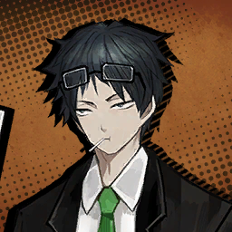

        ```
        Samjo: Ah, you’re a little late as expected.
        แซมโจ: อา มาช้ากว่าที่คาดไว้นิดหน่อยนะครับ
        ```

        ---

        
        
        ```
        Dante: <As expected?>
        ดันเต้: <คาดไว้ หรอ?>
        ```

        ---

        

        ```
        Outis: That man is…
        เอาทิส: ผู้ชายคนนั่นมัน...
        ```

        ---

        

        ```
        Samjo: It’s a pleasure to meet you again. I want you to know that this is my heartfelt sentiment and not a formality.
        แซมโจ: ยินดีที่ได้พบพวกคุณอีกครั้งนะครับ ผมอยากให้คุณรู้ ว่านี้คือความรู้สึกที่ออกมาจากใจจริง และไม่ใช่แค่พิธิการแต่อย่างใด
        ```

        ---

        

        * เสียงในหัว

            ```
            A familiar face I never expected to see again greeted us.
            ใบหน้าอันคุ้นเคย ของคนที่ฉันไม่คาดคิดว่าจะได้พบอีกต้อนรับเรา
            ```

        ---

        

        ```
        Heathcliff: …I’m out. Already told ya.
        ฮิธคลิฟฟ์: ...ฉันบายนะ บอกพวกนายไปแล้ว
        ```

        ---

        

        ```
        Dante: <Give it a moment! Let’s at least hear what he has to say,okay?>
        ดันเต้: <เห้ย ช่วยรอสักเดี๋ยวไม่ได้หรือไง! อย่างน้อย ๆ ก็ช่วยฟังก่อนได้ไหมว่าเขาจะพูดอะไร?>
        ```
        
        ---

        
        
        ```
        Heathcliff: Let go! Do you even get how it feels to have nightmares about doing the tango with raw chickens? Huh?
        ฮิธคลิฟฟ์: ชั่งแม่ง! นายรู้บ้างไหม ว่ามันรู้สึกยังไง ที่ต้องฝันร้ายเห็นตัวเองที่กำลังเต้นแทงโก้อยู่ไก่สดน่ะ? หะ?  
        ```

        ---

        

        ```
        Samjo: To tell you the truth, my last request was a test to measure your competence.
        แซมโจ: ให้พูดตรง ๆ คำขอก่อนหน้านี้ของผมเป็นแค่บททดสอบ เพื่อชี้วัดขีดความสามารถของพวกคุณก็เท่านั่น
        ```
        ```
        Samjo: And you passed with flying colors. Congratulations. I mean this one as well.
        แซมโจ: และพวกคุณก็สอบผ่านมาได้อย่างงดงาม ยินดีด้วยนะครับ ผมหมายถึง รอบนี้ก็เหมือนกัน
        ```

        ---

        

        ```
        Heathcliff: Who are you to test and grade us?! You—
        แซมโจ: แกคิดว่าแกเป็นใครกัน ถึงกล้ามาทดสอบ และให้คะแนนพวกเราฟะ?! แก—
        ```

        ---

        

        ```
        Samjo: That’s of course—
        แซมโจ: เรื่องนั่นก็แน่นอนอยู่แล้วครับ(ว่า)—
        ```

        ---

        

        ```
        ???: That’s of course at the discretion of Mr. Samjo, my shrewd secretary. So you must be… from Limbus Company.
        บุคคลปริศนา: เรื่องนั่นก็แน่นอนอยู่แล้วครับ ว่าต้องเป็นดุลพินิจของคุณแซมโจ เลขาที่แสนฉลาดของผม งั้นพวกคุณก็คงมาจาก... ลิมบัสคอมเพนี สินะครับ
        ```

        ---

        

        ```
        Dongrang: A pleasure to meet you, I’m Dongrang. I heard a lot about you from Samjo—it almost made me a fan.
        ดงรัง: เป็นเกียรติมากที่ได้พบพวกคุณ ผมดงรัง ผมได้ยินกิตติมศักดิ์ของพวกคุณมาเยอะเลยจากแซมโจ—อีกนิด ผมคงเป็นแฟน ๆ ไปแล้วมั่งเนี้ย เหอะเหอะ 
        ```

        ---

        

        ```
        Don Quixote: Fan??? Didst thou say just now that we have earned thine adoration?
        ดอน กิโฆเต้: แฟน??? เมื่อครู่นี้ เจ้ากล่าวหรือว่าพวกเราสมควรได้รับความเทิดทูนบูชาจากเจ้า?
        ```

        ---

        

        ```
        Rodion: It’s just flattery, Don Quixote…
        โรเดียน: แค่การประจบสอพลอน่ะ ไม่ต้องคิดมากนะ ดอนกิโฆเต้...
        ```

        ---

        

        ```
        Dongrang: If I’m being quite honest… the test wasn’t my idea. I mean, you aren’t lab hens or anything, and you deserve better than involuntary tests.
        ดงรัง: ถ้าให้ผมพูดจริง ๆ... การทดสอบไม่ใช่ไอเดียของผมแต่แรก ก็แบบ พวกคุณไม่ได้เป็นไก่ทดลอง หรือ อะไรทำนองนั่น พวกคุณสมควรที่จะได้อะไรดีกว่า การทดสอบที่ไม่ได้เต็มใจ 
        ```

        ---

        

        ```
        Samjo: Indeed, it was my suggestion.
        แซมโจ: ถูกต้องตามนั่นเลยครับ มันเป็นคำแนะนำของผมเอง
        ```
        ```
        Samjo: I had reason to do so as your “Limbus Company” is a little-known firm that… could or could not be newly established.
        แซมโจ: แต่ผมมีเหตุผล ก็เพราะ “ลิมบัสคอมเพนี” เป็นบริษัทที่ไม่ค่อยเป็นที่รู้จัก ซึ่งมัน... ก็อาจเป็นองค์กรที่พึ่งถูกจัดตั้งใหม่ หรือ ไม่ก็นานแล้ว 
        ```
        ```
        Samjo: We couldn’t take the risk of entrusting an unknown organization with a request on Mr. Dongrang’s word alone.
        แซมโจ: และเราก็ไม่อาจที่จะยอมรับความเสี่ยง ของการวางใจกับองค์กรที่เอาแน่เอานอนไม่ได้ จากการตัดสินใจเพียงลมปากของคุณดงรัง
        ```

        ---

        

        ```
        Ishmael: Ahem… So, that means you’re requesting us…
        อิชมาเอล: อะแฮ่ม... งั้นก็หมายความว่าคุณ กำลังร้องขอให้พวกเราช่วยอยู่สินะ...
        ```

        ---

        

        * เสียงในหัว

            ```
            Ishmael asked for confirmation that this was indeed a direct request, her face seeming rather proud.
            อิชมาเอลถามซ้ำสองเพื่อเป็นการยืนยัน ว่านี้เป็นคำขอโดยตรงจริง ๆ พร้อมกับสีหน้าเธอที่ดูภูมิอกภูมิใจ
            ```

        ---

        
        
        ```
        Dongrang: Why, of course. Because, you all are…
        ดงรัง: ทำไมล่ะครับ ของแบบนั่นก็ต้องแน่อยู่แล้วสิ ในเมื่อพวกคุณ...
        ```
        ```
        Dongrang: ......
        ดงรัง: ......
        ```
        ```
        Dongrang: Ah, why don’t I show you to my lab? There are many fun things to see.
        ดงรัง: อา จะว่าไป ทำไมผมถึงไม่พาพวกคุณไปทัวร์แลปของผมดีล่ะ? ที่นั่นมีอะไรสนุก ๆ ให้ดูตั้งเยอะ
        ```

        ---

        

        ```
        Dante: <Changing the subject so shamelessly is only gonna bother us more…>
        ดันเต้: <เปลี่ยนเรื่องคุย หน้าด้าน ๆ/หน้าไม่อาย แบบนั่น ก็มีแต่จะทำให้เราสงสัยมากขึ้น...>
        ```

        ---

        

        ```
        Samjo: Sorry? Are you really going to take these people to your laboratory?
        แซมโจ: เดี๋ยวก่อนสิครับ? นี้คุณจะพาคนพวกนี้ ไปแลปคุณจริง ๆ หรอ?
        ```

        ---

        

        ```
        Dongrang: Why not? They passed your test, didn’t they, Mr. Samjo.
        ดงรัง: ทำไมจะไม่ล่ะ? ในเมื่อพวกเขาผ่านบททดสอบของคุณได้แล้วนี้ คุณแซมโจ 
        ```
        ```
        Dongrang: And if they’ve got the skills to take down what they called an “Abnormality” as we saw today…
        ดงรัง: และถ้าพวกเขามีความสามารถถึงขนาดที่ ล้มไอพวกนั่นได้ที่เรียกว่า “สิ่งแปลกปลอม” ที่เราพึ่งเห็นไปในวันนี้ ผมว่ามันก็คุ้มนะ...
        ```

        ---

        

        ```
        Don Quixote: Aha~ Thou hast heard? My, traces of heroic deeds indeed make themselves known to the masses in no time! Fufu…
        ดอน กิโฆเต้: อาฮะ~ พวกท่านได้ยินไหม? ร่องรอยแห่งการกระทำอันกล้าหาญของข้าแพร์สะพัดไปไกลถึงหมู่มวลประชาในเวลาเพียงไม่กี่ชั่วยามเท่านั่น! ฮือฮือ...
        ```

        ---

        

        ```
        Dongrang: Haha, that’s a fun way to put it.
        ดงรัง: ฮาฮา เป็นวิธีพูดที่น่าสนใจดีนะครับ
        ```
        ```
        Dongrang: Ah, and you must be the manager… it was Dante, yes? May we speak for a moment?
        ดงรัง: อา และคุณที่อยู่ทางนี้ คงเป็นคุณผู้จัดการไม่ผิดแน่... ชื่อดันเต้ใช่ไหมครับ? จะว่าอะไรไหม ถ้าผม... จะขอคุยด้วยเป็นการส่วนตัวสักหน่อย?
        ```

        ---

        

        * เสียงในหัว

            ```
            Faust tried to say something to Dongrang, but he and Samjo pulled me far away by the time she stepped forward.
            เฟาสท์พยายามจะพูดอะไรบางอย่างกับดงรัง แต่เขากับแซมโจกลับดึงผมออกไป ในขณะที่เธอกำลังก้าวออกมา
            ```

    ---

    * **Episode: 6 | ตอนที่ 6<br>Location: K Corp. Laboratory Lobby | ล็อบบี้ศูนย์วิจัยคคอร์ป** 

        


        ```
        Dante: <I mean… I don’t mind, but you two can’t hear me anyway.>
        ดันเต้: <คือ... ฉันก็ไม่ได้ว่าอะไรหรอกนะ แต่ถึงฉันพูดอะไรไปพวกนายก็คงไม่ได้ยินอยู่ดี>
        ```

        ---

        

        ```
        Dongrang: I was too embarrassed to bring it up in front of the whole group, but actually, one of your… employees was an old friend of mine.
        ดงรัง: พอดีว่าผม รู้สึกค่อนข้างอับอายน่ะครับที่จะพูดเรื่องนี้ออกมาต่อหน้าทั้งกลุ่ม แต่อันที่จริงแล้ว หนึ่งใน... พนักงานของคุณ เคยเป็นเพื่อนกับผมน่ะครับ 
        ```

        ---

        
        
        ```
        Dante: <Oh, who is it?>
        ดันเต้: <โอ้ ใครหรอ/ถามได้ไหมว่าใคร?>
        ```

        ---

        

        ```
        Dongrang: And he wouldn’t give me a nod, either. Perhaps he was embarrassed like me. It was a struggle to hide how disheartened I was.
        ดงรัง: แล้วเขาคนนั่นก็ไม่ได้พนักหน้าตอบผมด้วย เพราะงั้นบางที เขาอาจจะรู้สึกอับอายอยู่เหมือนกัน มันเรื่องยากมากเลยล่ะครับ ที่จะปกปิด ว่าผมท้อใจแค่ไหน
        ```

        ---

        

        ```
        Dante: <Maybe you weren’t as close as you thought, then? …Wait, can you hear my voice?>
        ดันเต้: <บางที คุณกับเขาอาจไม่ได้สนิทอย่างที่คุณคิดก็ได้? ...เดี๋ยวนะ คุณได้ยินเสียงผมด้วยหรอ?>
        ```

        ---

        


        ```
        Samjo: Mr. Dongrang, this individual is unable to communicate normally.
        แซมโจ: คุณดงรังครับ บุคคลผู้นี้ ไม่สามารถสื่อสารได้อย่างปกติครับ
        ```

        ---

        

        ```
        Dongrang: That’s why I’m speaking, Mr. Samjo. It’s like I’m back to being a child, muttering my woes to a wind-up toy, don’t you think?
        ดงรัง: นั่นแหละว่าทำไมผมถึงพูดอยู่ คุณแซมโจ มันก็เหมือนกับการที่ผมกลับกลายเป็นเด็ก พึมพัมความทุกข์ใจกับของเล่นไขลาน คุณไม่คิดงั้นหรอ?  
        ```

        ---

        

        * เสียงในหัว

            ```
            …That all was a monologue?
            ...ทั้งหมดนั่นแค่พูดคนเดียวเนี้ยนะ?
            ```

        ```
        Dante: <What are you two even doing?>
        ดันเต้: <พวกคุณกำลังทำอะไรอยู่กันแน่?>
        ```

        ---

        

        ```
        Dongrang: It was mostly because of him that I decided to send my request to you. I can trust a familiar person better than a stranger.
        ดงรัง: ส่วนหลักก็เพราะเขาเลย ที่ผมตัดสินใจส่งคำร้องขอให้กับพวกคุณ ก็อย่างว่า ผมจะเชื่อใจใครได้ มากกว่าคนคุ้นเคยที่ไม่ใช่คนแปลกหน้า
        ```

        ---

        

        ```
        Samjo: See, this is why I can’t let my guard down for even a second. You’re too easily influenced by human attachment…
        แซมโจ: เห็นไหมล่ะครับ ว่าทำไมผมถึงลดการ์ดจากคุณไม่ได้สักวิเดียว คุณถูกชักจูงง่ายเกินไป จากความผูกพันระหว่าง มนุษย์/บุคคล...
        ```
        
        ---

        

        ```
        Dongrang: So, let me ask you a favor; use your tact and consideration to… pretend that you know nothing about the relationship between him and me, okay?
        ดงรัง: เพราะงั้น ขอรบกวนอะไรหน่อยได้ไหมครับ; ผมอยากให้คุณใช้ลูกเล่นอะไรก็ได้ และแสร้งทำ... เหมือนกับ ว่าคุณไม่รู้เรื่องความสัมพันธ์ระหว่างผมกับเขาหน่อยนะครับ?
        ```

        ---

        

        ```
        Dante: <You haven’t even told me who that friend is…>
        ดันเต้: <นายยังไม่ได้บอกฉันเลยด้วยซ้ำ ว่าเพื่อนที่นายหมายถึงคือใคร...>
        ```

        * เสียงในหัว

            ```
            I could only let out a deep sigh and shake my head…
            The conversation that never got through ended as arbitrarily as it began.
            ฉันทำได้แต่ถอนหายใจเฮือกใหญ่ออกมา และส่ายหัว... บทสนทนาที่คุยกันเมื่อกี้จบลง อย่างไม่มีปี่ไม่มีคลุ่ย พอ ๆ กับตอนที่มันเริ่มต้น
            ```

        ```
        Dante: <This isn’t asking a favor. You’re givine me a notice.>
        ดันเต้: <นี้ไม่เรียกว่าขอแล้ว ถ้านายจะเล่นบอกฉันมาโต้ง ๆ แบบนี้>
        ```

        ---

        **Location: K Corp. Laboratory Hallway | โถงทางเดินศูนย์วิจัยเคคอร์ป**
        
        ---

        

        ```
        Samjo: We’re at the laboratory aisle. Ordinary visitors would not be permitted to go any further…
        แซมโจ: เรามาถึงยังทางเดินห้องแลปแล้วครับ โดยปกติ ผู้เยี่ยมชมโดยทั่ว ๆ ไป จะไม่มีสิทธิ์ไปไกลมากกว่านี้...
        ```
        ```
        Samjo: But since you’ve been invited by Mr. Dongrang… I will show you to the interior.
        แซมโจ: แต่ในเมื่อพวกคุณถูกเชิญมา ด้วยตัวของคุณดงรังเองก็คงช่วยไม่ได้... ผมจะพาไปดูด้านในเองครับ
        ```

        ---

        

        ```
        Sinclair: Wow… I hoped… I could work at a company as big as this.
        ซินแคร์: ว้าว... ผมเองก็อยาก... จะได้ทำงาน ในบริษัทที่ใหญ่เท่านี้บ้างจัง
        ```

        ---

        

        ```
        Rodion: Then, maybe you could’ve applied to one~ Why didn’t you give it a shot?
        โรเดียน: แหม บางทีพวกคุณน่าจะรับเพิ่มสักคนน้า~ ไม่คิดงั้นหรอ?
        ```

        ---

        

        ```
        Ishmael: You’re joking, right, Rodion? Not everyone can join these companies. This kind of firm only accepts the very best of the elite.
        อิชมาเอล: นี้เธอล้อกันเล่นใช่ไหมเนี้ย โรเดียน? ไม่ใช่ว่าทุกคนจะเข้าองค์กรที่รับแต่พวกหัวกะทิแบบนี้ได้หรอกนะ 
        ```
        ```
        Ishmael: Like Faust or Yi Sang, for example…
        อิชมาเอล: ถ้าเฟาสท์ หรือ ยี่ซัง ก็ว่าไปอย่าง...
        ```
        
        ---

        

        * เสียงในหัว
        
            ```
            Ishmael’s remark gave me a good opportunity to bring up my earlier question.
            คำพูดของอิชมาเอลเปิดโอกาศให้ฉันได้หยิบยกคำถามที่เคยคิดไว้ก่อนหน้านี้ออกมา
            ```

        ```
        Dante: <Yeah, why did you choose to join Limbus Company out of all the options you had? There must’ve been better places to shoot for.>
        ดันเต้: <อ่า จริงสิ ทำไมเธอถึงเลือกที่จะเข้ามาทำงานในลิมบัสคอมเพนีแทนที่จะไปที่อื่นล่ะ? มันก็น่าจะมีที่ที่ดีกว่านี้อยู่ไม่ใช่หรอ>
        ```

        ---

        

        ```
        Faust: Because I am Faust.
        เฟาสท์: เพราะฉันคือเฟาสท์ค่ะ
        ```

        ---

        ```
        Dante: <......>
        ดันเต้: <......>
        ```

        ---

        * เสียงในหัว

            ```
            There was a certain energy in her confidently clarifying tone that discouraged me from asking another question.
            มีพลังงานอะไรบางอย่าง ในน้ำเสียงอธิบายปนมั่นใจนั่น ที่ทำเอาฉันหมดไฟจะถามต่อเลย
            ```

        ```
        Dante: <What about you, Yi Sang?>
        ดันเต้: <แล้วนายล่ะ ยี่ซัง?>
        ```

        ---

        

        ```
        Yi Sang: Let me take the trouble of asking in return. Manager, why did you join the company you work for?
        ยี่ซัง: งั้นฉันขอรบกวนถามกลับบ้าง ผู้จัดการ ทำไมคุณถึงเข้ามาทำงานในบริษัทนี้กัน?
        ```

        ---

        

        ```
        Dante: <I mean, that’s because I had no other choice.>
        ดันเต้: <เรื่องนั่น... ก็เพราะฉันไม่มีทางเลือกยังไงล่ะ>
        ```

        ---

        

        ```
        Yi Sang: …That should sufficiently answer your question.
        ยี่ซัง: ...นั่นก็น่าจะเพียงพอแล้วสำหรับคำถามของคุณ
        ```

        ---

        

        ```
        Dante: <......>
        ดันเต้: <......>
        ```

        * เสียงในหัว
        
            ```
            It looks like Ishmael wasn’t exaggerating about the qualifications it takes to join this firm.
            ดูเหมือนว่าอิชมาเอลจะไม่ได้พูดเว้อไปเองสินะ เรื่องคุณสมบัติที่ตัวบุคคลพึงมี ในการที่จะเข้าร่วมบริษัทนี้ได้
            ```

        ---

        **Location: K Corp. Laboratory Room | ห้องแลปศูนย์วิจัยเคคอร์ป**

        ---

        

        * เสียงในหัว

            ```
            The laboratory was dominated by a stillness that could only be achieved with everyone in total focus.
            ห้องแลปตกอยู่ในความเงียบสงัด ในแบบที่จะเกิดขึ้นได้ เมื่อทุกคนต่างใจจดใจจ่ออยู่กับบางสิ่งเท่านั้น
            ```

        ---

        

        ```
        Rodion: Dante, Dante, Dante, look, there… You see that? The fridge is full of snacks… We could take one… or ten, and they wouldn’t notice!
        โรเดียน: ดันเต้ ดันเต้ ดันเต้ ดูตรงนั่นสิ... เห็นไหม? ตู้เย็นนั่นมีแต่ขนมเต็มไปหมดเลย... บางทีเราน่าจะเอาไปสักถุง... หรือสิบ จะเท่าไหร่ยังไงพวกเขาก็คงไม่รู้หรอก!
        ```

        ---

        

        * เสียงในหัว

            ```
            And we would break that stillness with nonchalance.
            แล้วเราก็ทำลายความเงียบสงัดนั่นไป ด้วยการทำตัวไม่รู้ร้อน 
            ```

        ---

        

        ```
        Dongrang: Take as many as you’d like. Mr. Samjo, pack some snacks from the break room into small bundles to give them later.
        ดงรัง: อยากเอาไปเท่าไหร่ ก็หยิบตามใจชอบได้เลยนะครับ คุณแซมโจ หลังจบนี้ ผมวานคุณให้ช่วยแพ็คขนมที่อยู่ในห้องพักเป็นมัดเล็ก ๆ เพื่อส่งมอบให้พวกเขาด้วยนะครับ 
        ```

        ---

        

        ```
        Samjo: Understood.
        แซมโจ: รับทราบครับ
        ```

        ---

        
        
        ```
        Rodion: That’s awesome, Ishy, maybe we should quit our job and join up here?
        โรเดียน: นั่นเยี่ยมไปเลยค่ะ อิชชี่ บางทีเราน่าจะลาออก และมาทำงานที่นี้น้า?
        ```

        ---

        

        ```
        Ishmael: Everyone can hear you, Rodya… 
        อิชมาเอล: ทุกคนได้ยินเธอหมดนะ โรดย่า...
        ```
        
        ---

        

        ```
        Faust: Rodion, the work contract says…
        เฟาสท์: โรเดียน สัญญาจ้างบอกว่า...
        ```

        ---

        

        ```
        Rodion: Joking, Faust. Joking. See?
        โรเดียน: ล้อเล่นน่ะ เฟาสท์ ล้อเล่น เข้าใจไหม?
        ```

        ---

        

        ```
        Dante: <......>
        ดันเต้: <......>
        ```

        ---

        

        ```
        Dongrang: Let’s move on to the request—
        ดงรัง: งั้นเรามาเข้าเรื่องคำขอกันเลยนะ(ครับ)—
        ```

        ---

        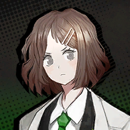

        ```
        Shrenne: You’re bringing outsiders into the building now… What are you, a field trip guide, Dongrang?
        ชเรนน์: รอบนี้นายเล่นพาคนนอกเข้ามาถึงข้างในแลปเราเลยหรอ... ตอบฉันทีสิ ว่านายเป็นบ้าอะไร คนนำเที่ยวหรือไง ดงรัง?
        ```

        --- 

        

        ```
        Dongrang: Ah. Pardon me for a moment. This is Shrenne. She’s the manager of the department next to mine and a colleague who joined the company at the same time as I did. Visiting me to hurl hurtful words takes up much of her daily routine.
        ดงรัง: อา ขออภัยกับการเสียมารยาทเมื่อครู่ด้วยนะครับ นี้ชเรนน์ เธอเป็นผู้จัดการแผนกเพื่อนบ้านที่อยู่ถัดจากผมไปหนึ่งบล็อก และเป็นคุณเพื่อนร่วมงานที่เข้าร่วมบริษัทมาในเวลาเดียวกันกับผม หนึ่งในกิจวัตรประจำวันของเธอคือการแวะเวียนมาหา แล้วพูดคำพูดเสียดแทงหัวใจดวงน้อย ๆ ของผมทุกวี่ทุกวัน
        ```

        ---

        

        ```
        Shrenne: I figured someone’s got to point out the massive drain on our company's welfare budget that is your team.
        ชเรนน์: ฉันรู้ว่าจำเป็นต้องมีใครสักคนที่ต้องแฉ ว่าทุนสวัสดิการบริษัทเรากำลังถูกสูบเลือดสูบเนื้อกินอย่างหน้าไม่อายจากทีมของนายอยู่
        ```

        ---

        

        ```
        Dongrang: Ah, if you’re wondering about how we spend our welfare budget… You’ll see when the Department of the Year trophy is awarded. Right, Samjo?
        ดงรัง: อา ถ้าคุณสงสัยเกี่ยวกับเรื่องที่ผมบริหารเงินทุนสวัสดิการไปยังไงบ้าง... ก็รอดูสิ้นปีนี้สิครับ ว่ารางวัลแผนกออฟเดอะเยียร์จะถูกมอบให้ใคร ใช่ไหม แซมโจ?
        ```

        ---

        

        ```
        Samjo: It would take a full day to list the benefits the department chosen as the best receives.
        แซมโจ: มันคงต้องใช้เวลาทั้งวันเลยล่ะมั้งครับ กว่าจะลิสต์คุณประโยชน์ต่อบริษัทครบทุกข้อของว่าที่แผนกที่ดีที่สุด
        ```

        ---

        

        ```
        Shrenne: Eugh, you’re snobs, the both of you.
        ชเรนน์: เออ พวกนายทั้งคู่ก็ หัวสูง/ถือดี พอกันเลย
        ```

        ---

        

        ```
        Gregor: Hm. Is that a rival? I do suppose excellence is followed by envy wherever it is.
        เกรกอร์: หืม นั่นคู่แข่งคุณหรอครับ? แหม ไม่ว่าจะที่ไหน ความดีเด่นก็มักจะตามมาด้วยความริษยาอยู่เสมอเลยนะครับ
        ```

        ---

        

        ```
        Dongrang: Envy fuels advancement, as they say, so it’s only right for us to show a little generosity for those following behind. Should we give some of the pies we bought from that store to Shrenne’s department, Mr. Samjo?
        ดงรัง: คนเคยพูดกันน่ะครับ ว่าความริษยาเป็นเชื้อเพลิงให้ก้าวเดินต่อไป แต่ถึงอย่างนั่นเรา ก็ควรที่จะแสดงความเอื้อเผื่อแผ่บ้าง ให้กับคนที่ยังรั้งท้ายอยู่ด้านหลัง จะว่าไป เราก็น่าจะแบ่งพายที่พึ่งซื้อจากร้านนั่นให้แผนกของคุณชเรนน์บ้างนะ คุณแซมโจ? 
        ```

        ---

        

        ```
        Samjo: I was planning to do so. The pepper, chili, lettuce, and curry-flavored ones, specifically.
        แซมโจ: ผมกะว่าจะทำอย่างนั่นอยู่เลยครับ โดยเฉพาะรสพริกไทย รสพริก รสผักกาดหอม แล้วก็รสแกงกะหรี่
        ```

        ---

        

        ```
        Rodion: Gasp… That… also sounds tasty?
        โรเดียน: เฮือก... นั่น... ก็ฟังดูน่ากินจัง?
        ```

        ---

        

        ```
        Dongrang: Haha… Now then, let’s get back to the main topic.
        ดงรัง: ฮาฮา... เอาเป็นว่า ทีนี้ เรากลับมาคุยที่ประเด็นหลักของเราดีกว่านะครับ
        ```
        ```
        Dongrang: I heard the rumors. They were about a newly formed company collecting organic objects called “Golden Boughs”.
        ดงรัง: ผมได้ยินข่าวลือมาว่า พวกเขาเป็นบริษัทพึ่งก่อตั้ง ที่ไล่ตามเก็บอินทรีย์วัตถุที่เรียกว่า “กิ่งทอง”
        ```
        ```
        Dongrang: And those Golden Boughs are found exclusively inside the closed-down branch facilities of Lobotomy Corp.
        ดงรัง: และกิ่งทองพวกนั่นก็สามารถถูกพบได้ ภายในสาขาย่อยที่ถูกปิดตายไปแล้วของสถาบันวิจัยโลโบโตมี่เท่านั่น
        ```

        ---

        

        ```
        Outis: How did you learn about the existence of Golden Boughs?
        เอาทิส: คุณรู้เรื่องการมีอยู่ของกิ่งทองได้ยังไง?
        ```

        ---

        

        ```
        Dongrang: It was a recent discovery. We’d been using a Lobotomy Corp. branch near our research facility as a lab until a few months ago.
        ดงรัง: มันเป็นการค้นพบใหม่เมื่อไม่นานมานี้น่ะครับ ในขณะที่เรากำลังใช้สถาบันวิจัยโลโบโตมี่ สาขาไม่ใกล้ไม่ไกลกับศูนย์วิจัยเราเป็นแลปทดลอง จนกระทั่งไม่กี่เดือนก่อน  
        ```

        ---

        

        ```
        Heathcliff: You… set up a lab in that horrible place?
        ฮิธคลิฟฟ์: แก... ตั้งแลปในที่ห่วย ๆ พันธ์นั่นเนี้ยนะ?
        ```

        ---

        

        ```
        Sinclair: But, I thought they were all buried underground…
        ซินแคร์: แต่ไม่ใช่ว่าพวกมัน ถูกฝังอยู่ใต้ดินหมดแล้วหรอครับ...
        ```

        ---

        

        ```
        Gregor: Well… I guess there were rare resources and documents they could use…
        เกรกอร์: เออ... ฉันเดาว่า ที่นั่นก็คงมีทรัพยากรหายาก ไม่ก็เอกสารที่พวกเขาใช้ได้ละมั้ง...
        ```

        ---

        

        ```
        Faust: …Did the scope of your research include Abnormalities?
        เฟาสท์: ...แล้วขอบเขตของการวิจัยคุณ นับรวมพวกสิ่งแปลกปลอมด้วยหรือเปล่าคะ?
        ```

        ---

        

        ```
        Dongrang: Why, certainly. No researcher could overlook such intriguing subjects.
        ดงรัง: ทำไมจะไม่ล่ะครับ ไม่มีนักวิจัยคนไหน ที่จะมองข้ามหัวข้อที่น่าสนใจแบบนั่นได้ลงคอหรอกครับ
        ```

        ---

        

        ```
        Heathcliff: Researchers must be all soft in the head if that’s what they’re interested in…
        ฮิธคลิฟฟ์: พวกนักวิจัยคงจะสมองนิ่มกันไปหมดแล้วมั้ง ถ้าไอห่านั่นเป็นสิ่งที่พวกมันสนใจ...
        ```
        ```
        Heathcliff: …Hold on.
        ฮิธคลิฟฟ์: ...เดี๋ยวก่อนนะ
        ```
        ```
        Heathcliff: When you were mumbling rubbish and tossing a rock at one of them chickenheads, did you…
        ฮิธคลิฟฟ์: ในตอนนั่น ที่แกบ่นพึมพำพูดพล้ามอะไรออกมาไม่รู้เรื่อง ก่อนที่แกจะโยนก้อนหินใส่หนึ่งในพวกหัวไก่ แล้วลากตีนมาหาพวกเรา พอมาคิด ๆ ดู นี้แก(จงใจใช่ไหม)...
        ```

        ---

        

        ```
        Samjo: Ahrmhrm…
        แซมโจ: อึบอืมม...
        ```

        ---

        

        ```
        Faust: I will say, Heathcliff’s unexpected fits of insight surprise me sometimes.
        เฟาสท์: ต้องยอมรับเลยนะคะ ว่าช่วงเวลาแห่งการตระหนักรู้ของฮิธคลิฟฟ์นี้ ช่าง เป็นสิ่งที่ยากจะหยั่งถึง ขณะที่บางที ก็ทำเอาฉันตกใจเหมือนกันค่ะ
        ```
        ```
        Faust: You led us into dealing with a Distortion in a “coincidental” encounter so that you could gather data for your research on Abnormalities.
        เฟาสท์: คุณชี้นำพวกเราให้จัดการกับผู้บิดเบี้ยว ในการเผชิญหน้าที่จัดฉากว่าเป็นเรื่อง “บังเอิญ” เพื่อที่ว่าคุณจะได้รวบรวมข้อมูลไปใช้ในงานวิจัยสิ่งแปลกปลอมของคุณสินะคะ
        ```

        ---

        

        ```
        Dongrang: Mr. Samjo here is no good at acting. I suppose it’s due to his upright way of life.
        ดงรัง: คุณแซมโจเนี้ยแสดงไม่เก่งเอาซะเลยนะครับ แต่นั่นก็คงเป็นวิธีชีวิตที่ซื่อตรงของเขา
        ```
        ```
        Dongrang: Please understand. We had no means to clearly distinguish a Distortion from an Abnormality.
        ดงรัง: โปรดเข้าใจด้วยเถอะครับ ว่าเราไม่ได้มีเจตาจะคัดแยกระหว่างผู้บิดเบี้ยวกับสิ่งแปลกปลอมอย่างชัดเจน
        ```
        ```
        Dongrang: A person distorts “when the mind crumbles to figurative pieces…” was it? That was a stellar figure of speech. Did you restore his crumbled mind back to health, then?
        ดงรัง: คนเราจะบิดเบี้ยวก็ต่อเมื่อ “จิตใจแตกสลายราวกับแหลกเป็นเสี่ยง ๆ...” สินะครับ? ช่างเป็นสำนวนโวหารที่ยอดเยี่ยม แล้วคุณฟื้นคืนจิตใจของเขาที่แตกสลายไป กลับมาได้ไหมครับ?
        ```

        ---

        

        ```
        Faust: There is no way to piece together someone else’s broken mind.
        เฟาสท์: ไม่มีทางไหนที่จะปะติดชิ้นส่วนของจิตใจใครที่พังไปแล้วให้กลับมาได้หรอกค่ะ
        ```
        ```
        Faust: We merely showed him the way. It was the choice of the restaurant owner whether to stay there or take that path.
        เฟาสท์: เราเพียงแค่แสดงหนทางให้กับเขา และมันก็เป็นการตัดสินใจของตัวเจ้าของร้านเอง ที่เลือกจะอยู่ต่อ หรือ เลือกเส้นทางใหม่ที่พวกเรามอบให้เขาก็เท่านั้นค่ะ
        ```

        ---

        

        ```
        Dongrang: Wow, you know so much. If I were just a bit younger, I’d have jumped and hopped trying to high-five you.
        ดงรัง: ว้าว คุณนี้รู้เยอะดีจังเลยนะครับ ถ้าผมเด็กกว่านี้หน่อย ก็คงกระโดดโยง ๆ เหมือนกระต่ายตาดำ ๆ ที่ตื่นเต้น แล้วพยายามไฮไฟว์กับคุณแล้วล่ะครับ
        ```

        ---

        

        ```
        Faust: You’re always unwelcome to try.
        เฟาสท์: ไม่ยินดีเสมอค่ะ
        ```

        ---

        

        ```
        Samjo: Mr. Dongrang, you’re becoming sidetracked again.
        แซมโจ: คุณดงรัง นอกเรื่องอีกแล้วนะครับ
        ```

        ---

        

        ```
        Dongrang: Ah, you’re right. Alright… Then, one day, while we happily indulged in research in that laboratory of the Lobotomy Corp. branch facility, armed terrorists attacked the place. It was all too sudden.
        ดงรัง: อา ใช่เลยตามนั่น โอเค... ทีนี้ อยู่มาวันหนึ่ง ในขณะที่พวกเรากำลังดื่มดำกับการวิจัยอย่างมีความสุขในแลปโลโบโตมี่่อยู่นั่นเอง จู่ ๆ ก็มีเหล่าผู้ก่อการร้ายปรากฎตัวออกมา แล้วเข้าถล่มที่นั่นจนราบเป็นหน้ากลอง
        ```
        ```
        Dongrang: Have you ever seen a bomb set off before your eyes? It’s quite the spectacle. It all starts and ends in a split second. Just like the universe, isn’t it?
        ดงรัง: พวกคุณเคยเห็นระเบิดที่ถูกจุดฉนวนต่อหน้าต่อตาไหมล่ะครับ? นับเป็นภาพที่น่าทึ่งไม่น้อย มันเริ่มขึ้น และสิ้นสุดลงในเสี้ยววิ ไม่ต่างอะไรกับจักรวาลเลย ว่าไหมครับ? 
        ```

        ---

        

        ```
        Outis: Where are the terrorists now?
        เอาทิส: แล้วผู้ก่อการร้ายพวกนั่นอยู่ไหนแล้วล่ะคะ?
        ```

        ---

        

        ```
        Samjo: The members have almost nothing in common, and their motive is unknown. They only showed up recently.
        แซมโจ: สมาชิกแต่ละคนในกลุ่มก่อการร้ายดูจะไม่มีจุดร่วมอะไรที่ตรงกันเลยครับ รวมถึงวัตถุประสงค์ของพวกเขาเองก็เป็นสิ่งที่เราไม่ทราบแน่ชัด ถ้าจะพอรู้อะไร ก็คงเป็นเรื่องที่พวกเขาพึ่งจะโผล่หัวออกมาตอนนี้ก็เท่านั่นแหละครับ
        ```
        ```
        Samjo: In the end, the terrorist organization took over the laboratory Mr. Dongrang’s team had stayed in.
        แซมโจ: สุดท้าย องค์กรผู้ก่อการร้ายนั่นก็ยึดแลปของทีมคุณดงรังไป
        ```

        ---

        

        ```
        Outis: Mm. That must be when the lab was moved.
        เอาทิส: อืม นั่นน่าจะเป็นตอนที่แลปถูกเคลื่อนย้าย
        ```

        ---

        

        ```
        Yi Sang: …How severe was the damage?
        ยี่ซัง: ...เสียหายหนักแค่ไหนล่ะ
        ```

        ---

        

        * เสียงในหัว

            ```
            Dongrang turned his gaze from Yi Sang to the sporadically unoccupied seats.
            ดงรัง หลบสายตาของเขา/หลบหน้าหลบตา จากยี่ซัง ไปยังที่นั่งที่ไม่มีใครอยู่เป็นครั้งคราว
            ```

        ---

        

        ```
        Dongrang: You see, those empty seats…
        ดงรัง: พวกคุณเห็นที่นั่งที่ว่างเหล่าพวกนั่นไหมครับ...
        ```
        ```
        Dongrang: They’ll stay that way for a while. Their owners died—in that act of terror.
        ดงรัง: พวกมันจะอยู่อย่างนั่นไปสักพัก เพื่อรำลึกถึงเจ้าของของพวกมัน—ที่ต้องตายจากไป เพราะเหตุโศกนาฏกรรมไม่คาดคิด
        ```

        ---

        

        * เสียงในหัว

            ```
            Looking closely, I saw snacks and flowers placed on their cushions, probably as a way to mourn the dead.
            พอลองดูใกล้ ๆ ฉันก็เห็นขนมกับดอกไม้ ที่ถูกวางลงกับที่นั่ง บนเบาะรองนั่งพวกนั่น คงเป็นวิธีการที่พวกเขาใช้ เพื่อไว้อาลัยต่อคนที่ตายไป
            ```

        ---

        

        ```
        Dongrang: Ah, this fellow we only managed to recover a finger from. We couldn’t find the right place to put it, so we’ve been keeping it in storage. It should be over at the display on the second floor.
        ดงรัง: อา ส่วนสหายคนนี้เราเก็บกู้ซากมาได้เหลือก็แค่เศษนิ้วเดียว ด้วยความที่เราไม่รู้จะเอาไปไว้ที่ไหน ก็เลยเก็บมันไว้ในห้องเก็บของมาตลอด น่าจะอยู่ในตู้กระจกชั้นสองล่ะมั้งครับถ้าจำไม่ผิด
        ```

        ---

        

        * เสียงในหัว

            ```
            A solemn silence filled the office, but Dongrang continued, brushing the empty desk with his hand.
            ความเงียบอันเคร่งขรึม ปกคลุม/แพร์กระจาย ไปทั่วห้องทำงาน แต่ดงรังกลับยังคงปัดโต๊ะที่ว่างเปล่าไปมาด้วยมือเขาได้หน้าตาเฉย
            ```

        ---

        

        ```
        Dongrang: There is so much we had to leave behind.
        ดงรัง: มีหลายสิ่งเหลือเกินที่เราจำใจต้องทิ้งไว้ด้านหลัง
        ```

        ---

        

        ```
        Gregor: …Dongrang…
        เกรกอร์ซ ...ดงรัง...
        ```

        ---

        

        ```
        Dongrang: I especially miss the plaque modeled after the face of my character, that was a favorite souvenir of mine.
        ดงรัง: โดยเฉพาะรูปปูนปั้นที่แกะสลักหน้าผมเอาไว้ ชิ้นนั่นเป็นของที่ระลึกโปรดผมเลย
        ```

        ---

        

        ```
        Gregor: I’ll be stumped, I can’t tell how much of what he says is a joke and how much of it is serious.
        เกรกอร์: ฉันงงตึบไปหมดแล้วเนี้ย ดูไม่ออกเลยว่าอะไรที่เขาพูดบ้างเป็นทีเล่นทีจริง
        ```

        ---

        

        ```
        Outis: What about that seat, then?
        เอาทิส: แล้วที่นั่งตรงนั่นล่ะคะ?
        ```

        ---

        

        * เสียงในหัว
        
            ```
            Our attention was brought to a white desk that was completely empty.
            ความสนใจของเราถูกเบี่ยงเบนไปยังโต๊ะสีขาวที่โล่งสนิท
            ```

        ---

        

        ```
        Dongrang: Ah, that one is reserved.
        ดงรัง: อา โต๊ะนั่นจองแล้วน่ะครับ
        ```
        ```
        Dongrang: We’re waiting for a new employee to take that seat.
        ดงรัง: สำหนักรับพนักงานใหม่ที่เรากำลังเฝ้าคอย
        ```

        ---

        

        ```
        Ishmael: Oh… Is there an application guideline for the position, then? Where can I see it?
        อิชมาเอล: โอ้... งั้นมันก็ต้องมีแนวทางการสมัครงานสำหรับตำแหน่งนั่นอยู่สินะคะ? จะว่าอะไรไหมถ้าจะขอดู? 
        ```

        ---

        

        ```
        Samjo: Ahem.
        แซมโจ: อะแฮ่ม
        ```

        ---

        

        * เสียงในหัว

            ```
            Ishmael’s bright-eyed inquisition was interrupted by Samjo’s displeased utterance.
            การซักถามด้วยแววตาอันสดใสของอิชมาเอลถูกขัดจังหวะ ด้วยท่าทีที่ไม่พอใจของแซมโจ
            ```

        ---

        

        ```
        Dongrang: Oh dear, our Mr. Samjo is feeling all uncomfortable now. Shall we actually get to the point then, Samjo?
        ดังรัง: โอ้ แหม ดูเหมือนคุณแซมโจของพวกเราจะรู้สึกไม่สบายใจแล้วนะครับ เอาเป็นว่าเรามาเข้าเรื่องกันจริง ๆ จัง ๆ สักทีดีกว่าเนอะ แซมโจ?
        ```

        ---

        

        ```
        Samjo: Let me be blunt; I suggest an accord that will benefit both parties.
        แซมโจ: ผมขอพูด แบบไม่อ้อมค้อม/ตรง ๆ เลยล่ะกัน; ผมขอเสนอข้อตกลงที่จะมอบผลประโยชน์ให้กับพวกเราทั้งสองฝ่าย
        ```
        ```
        Samjo: If you help us retake the laboratory, we’ll yield the ownership of the Golden Bough we found to you.
        แซมโจ: ถ้าคุณช่วยพวกเราชิงแลปที่ถูกยึดไปกลับมา พวกเราจะมอบกรรมสิทธิ์การถือครองกิ่งทองที่พวกเราเจอให้กับพวกคุณ
        ```
        
        ---

        

        ```
        Faust: I have a question. Is this a fixed contract, or a post-fulfillment review contract? Will it be represented by delegate bodies or co-executive members?
        เฟาสท์: ดิฉันมีคำถามคะ นี้เป็นสัญญาแบบกำหนดเงื่อนไขตายตัว หรือ สัญญาทบทวนหลังส่งมอบงานคะ? งานนี้จะถือว่าเสร็จสิ้น ก็ต่อเมื่อพวกเรา ส่งมอบร่างคณะผู้แทน หรือ กรรมการบริหารร่วมหรือเปล่าคะ?
        ```

        ---

        

        ```
        Samjo: Allow me to answer that. This will be an immediate delegate-body-represented contract with no warranty liability. A contractual signing overseen by an observer from a Grade 1 Contract Office will take place following due process.
        แซมโจ: ขออนุญาติให้ผมตอบคำถามนั่นด้วยครับ งานนี้เป็นสัญญาว่าจ้างที่มีผลทันที เมื่อส่งมอบร่างของผู้แทน ซึ่งไม่มีการรับประกันความรับผิดชอบใด ๆ ทั้งนั้น กับเหตุการณ์ไม่คาดคิดต่าง ๆ นา ๆ ที่เกิดขึ้นในระหว่างปฎบัติงาน และเราจะไปเซ็นท์สัญญากัน ณ สถานที่ซึ่งได้รับการกำกับดูแล ภายในสำนักงานสัญญาเกรด 1 โดยเฉพาะ
        ```

        ---

        

        ```
        Dante: <A Contract Office…? I-I dunno what’s going on… Does it really have to be so complicated?>
        ดันเต้: <สำนักงานสัญญา...? ฉ-ฉันไม่รู้ว่าด้วยซ้ำว่าพวกนายกำลังพูดเรื่องอะไรกันอยู่... ทำไมมันต้องฟังดูยุ่งยากขนาดนี้ด้วย?>
        ```

        ---

        

        ```
        Ishmael: In J Corp’s District, we couldn’t get the Golden Bough right away despite winning because we didn’t have anyone overseeing the deal.
        อิชมาเอล: จำได้ไหมในเขตเจคอร์ป พวกเราไม่สามารถที่จะเอากิ่งทองออกมาได้ในทันที ทั้ง ๆ ที่เราก็เป็นฝ่ายชนะ เป็นปัญหาที่เกิดขึ้น ในเมื่อเราไม่มีใครเป็นคนกลางคุมข้อตกลง
        ```

        ---

        

        ```
        Gregor: Oh… That Ayuda from the Merry Archils? She started a fight even after Rodya won the game.
        เกรกอร์: โอ้... หมายถึงอายูดะคนนั่น ที่มาจาก สุขสันต์วันอาร์คิลส์/เมอร์รี อาร์คิลส์ น่ะเหรอ? นางนั่นเล่นเปิดฉากต่อสู้หลังจากที่โรดย่าชนะเกมไปแล้ว
        ```

        ---

        

        ```
        Sinclair: It’s Aida from Los Mariachis…
        ซินแคร์: เธอชื่อไอด้าจาก คณะนักดนตรีมาริอาซี/โลสมาริอาชิส ต่างหากล่ะครับ...
        ```

        ---

        

        ```
        Ishmael: That’s right. Instead of playing the role of the observer, she left us with no choice but to take the Bough with force.
        อิชมาเอล: ถูกเพ้งตามนั่นเลย แทนที่จะเล่นบทเป็นผู้สังเกตการซะดี ๆ เธอกลับไม่เหลือทางเลือกให้พวกเรา นอกจากต้องแย้งกิ่งมาด้วยกำลัง
        ```
        ```
        Ishmael: Which is why it is safer to use the service of an Association or a Contract Office to stand as an observer or to notarize the contract even if it can be costly. That’s what Faust probably considered most carefully, I think.
        อิชมาเอล: เพราะงั้นแหละว่าทำไม มันถึงเป็นการปลอดภัยกว่า ที่จะใช้บริการของสมาคม หรือ สำนักงานสัญญา เพื่อเป็นตัวแทนผู้สังเกตการ หรือ รับรองสัญญา แม้ว่ามันจะต้องใช้เงินมากไม่น้อย แต่นั่นก็คงเป็นสิ่งที่เฟาสท์น่าคิดเอาไว้อยู่แล้วอย่างระมัดระวังที่สุด ฉันคิดว่า
        ```

        ---

        

        * เสียงในหัว

            ```
            Ishmael explained like it was common knowledge. I guess it’s something well-known among City folks…
            อิชมาเอลอธิบายออกมาราวกับว่ามันเป็นเรื่องง่ายอะไรอย่างงั้นแหละ ฉันเดาว่ามันก็คงเป็นความรู้พื้นฐาน ที่ชาวเดอะซิตี้โดยทัวไปรู้กันเป็นเรื่องปกติอยู่แล้วล่ะมั้ง
            ```

        ---

        

        ```
        Faust: This contract certainly favors our side.
        เฟาสท์: สัญญาฉบับนี้เอนประโยชน์ให้ฝั่งเรา
        ```

        ---

        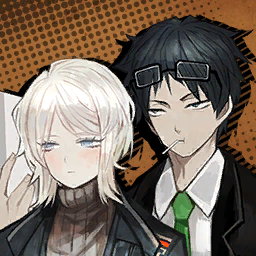

        ```
        Faust & Samjo: As long as the goal is achieved.
        เฟาสท์และแซมโจ: ตราบใดที่เป้าหมายบรรลุผลสำเร็จ
        ```

        ---

        

        * เสียงในหัว

            ```
            …We watched with our mouths agape as the two declared the conclusion at once.
            ...เรามองดูพวกเขาด้วยความตกตะลึง ในช่วงจังหวะเดียวกับที่ทั้งสองประกาศผลสรุปออกมาพร้อมกัน
            ```

        ---

        

        ```
        Dongrang: This is a secret, but, I frankly don’t get more than half of what Samjo says. I just nod like “Oh I see~” and move on.
        ดงรัง: นี้เป็นความลับอย่าบอกใครนะครับ ให้พูดตามตรง ผมแทบจะไม่เข้าใจสิ่งที่แซมโจพูดเลยด้วยซ้ำ ผมก็แค่ทำทีแบบ “อ้อ ฉันเข้าใจแล้ว ฉันเข้าใจ~” แล้วก็ปล่อยให้เขาสาธยายความต่อไปน่ะครับ
        ```

        ---

        

        ```
        Gregor: Isn’t that a coincidence? It’s the same for us, too.
        เกรกอร์: บังเอิญหรือเปล่าครับเนี้ย? ดูเหมือนฝั่งเราก็จะเป็นเหมือนกันนะครับ 
        ```

        ---

        

        ```
        Ishmael: Aren’t you supposed to be the last person to be ignorant of your secretary’s words…?
        อิชมาเอล: ไม่ใช่ว่าคุณควรที่จะเป็นคนสุดท้ายที่เมินเฉยต่อคำพูดของเลขาตัวเองหรอคะ...?
        ```

        ---

        

        ```
        Hong Lu: Aha, still, I guess making a contract with K Corp’s laboratory means we won’t be fighting against the Wing’s staff for a while.
        ฮงหลู่: อ้าา จะว่าไปแล้ว ถ้าเราทำสัญญากับแลปของเคคอร์ป นั่นก็หมายความว่าเราจะได้พักรบกับเจ้าหน้าที่วิงส์ไปสักพักสินะครับ
        ```
        ```
        Hong Lu: You know, those people who would keep healing their wounds.
        ฮงหลู่: ก็อย่างที่พวกคุณรู้กัน ว่าการที่ต้องสู้กับคนพวกนั่น ที่เอาแต่รักษาบาดแผลของตัวเองได้ไม่หยุดนี้ เป็นอะไรทีหินสุด ๆ ไปเลยนะครับ 
        ```

        ---

        

        * เสียงในหัว

            ```
            The team fell into a somber silence. All the memories related to them were filled with misery and suffering.
            จู่ ๆ คนในทีมก็ซึมกระทือกันไปหมด ทำอย่างกับว่าความทรงจำทั้งหมดพวกนั่น ที่เกี่ยวข้องกับพวกเขา มีแต่ความโศกเศร้า และทุกข์ทรมาณยังไงอย่างงั้นแหละ (จริง ๆ ก็ใช่แหละ)
            ```

        ---

        

        ```
        Dongrang: Ah, so you’ve seen K Corp’s regenerative technology already.
        ดงรัง: อา แปลว่าพวกคุณก็เคยเห็นเทคโนโลยีคืนสภาพของเคคอร์ปแล้วสินะครับ
        ```

        ---

        

        ```
        Rodion: Ugh, we’ve more than seen it!
        โรเดียน: เห้อ เรามากกว่าเห็นซะอีก!
        ```

        ---

        

        ```
        Gregor: Had to deal with it over and over, I get sick of the thought…
        เกรกอร์: ต้องจัดการกับมันซ้ำ ๆ ซาก ๆ ครั้งแล้ว ครั้งเล่า จนเบื่อเลยล่ะ...
        ```

        ---

        

        ```
        Dongrang: Ah… Why don’t I show you around my lab instead, then? It’s not here, though… You’ll have to take the elevator once more.
        ดงรัง: อา... ทำไมผมไม่พาพวกคุณไปดูรอบ ๆ แลปผมดีล่ะ? มันไม่ได้อยู่ที่นี้หรอกครับ... พวกคุณจะต้องขึ้นลิฟอีกรอบ
        ```

        ---

        

        ```
        Samjo: Geh? You would show them that much, Mr. Dongrang? That place is off-limits for unauthorized personnel…
        แซมโจ: เกอะเออะ? คุณจะให้พวกเขาดูมากขนาดนั่นเลยหรอครับ คุณดงรัง? ที่นั่นไม่ใช่สถานที่ที่บุคคลภายนอกได้รับอนุญาตินะครับ...
        ```

        ---

        

        ```
        Dongrang: Hah, you just made a really funny noise, Mr. Samjo. Well, it shouldn’t hurt. We’re hanging out a bit to celebrate the provisional contract being signed.
        ดงรัง: หะ เมื่อกี้นี้คุณทำเสียงได้ตลกดีนะครับ คุณแซมโจ ก็แบบ มันก็คงไม่เสียหายอะไร ถ้าพวกเราจะแค่พาทัวร์เล็ก ๆ น้อย ๆ เพื่อเฉลิมฉลองให้กับความสำเร็จครั้งยิ่งใหญ่ ที่เซ็นท์สัญญาชั่วคราวได้สำเร็จไงครับ
        ```

        ---

        

        * เสียงในหัว

            ```
            I wasn’t sure if that was an appropriate way to celebrate things… but since no one on the team objected, I decided to follow him.
            ฉันชักจะเริ่มไม่แน่ใจแล้วนะ ว่านั่นเป็นวิธีการเฉลิมฉลองจริง ๆ หรือเปล่า... แต่ในเมื่อไม่มีใครในทีมคัดค้านอะไร ฉันก็คงทำได้แต่ตามน้ำไปก่อนนั่นแหละ
            ```

    ---

    * **Episode: 7 | ตอนที่ 7<br>Location: K Corp. Laboratory - Modification Lab | ห้องแลปศูนย์วิจัยคคอร์ป - ห้องดัดแปลง** 

        

        ```
        Dongrang: This is where regenerative ampules are made.
        ดงรัง: นี้เป็นที่ที่หลอดแก้วบรรจุยาฟื้นฟูถูกสร้างขึ้นมาน่ะครับ
        ```
        ```
        Dongrang: They’re publicly called “HP bullets”… but the underlying principle is a nanobot-based medical treatment.
        ดงรัง: พวกมันรู้จักกันในนาม “กระสุนเฮชพี/เฮชพีบุลเล็ต”... ซึ่งมีหลักการการทำงานเป็นการรักษาด้วยนาโนบอท
        ```
        ```
        Dongrang: There have been struggles here and there, but at the moment, the ampule I sliiightly modified recently is the most commonly used version.
        ดงรัง: ถึงแม้ว่ามันจะยังมีจุดบงพร่องอยู่บ้าง แต่ ณ วินาทีนี้ หลอดแก้วบรรจุยาที่ผมปรับแต่งเล็กน้อยนี้ ท้ายที่สุด พวกมันก็กลายเป็นเวอร์ชั่นที่ใช้กันอย่างแพร์หลายในหมู่รัฐบาลเคคอร์ป
        ```

        ---

        

        ```
        Heathcliff: So let me get this straight… You’re the one who supplied that? Dammit, do you have any idea how much that made us suffer—
        ฮิธคลิฟฟ์: งั้นเท่าที่ฉันเข้าใจก็คือ... แกเป็นคนที่อยู่เบื้องหลังของพวกนี้? ให้ตายเถอะ นี้แกรู้บ้างหรือเปล่า ว่าไอนี้ทำพวกเราเจ็บเจียนตาย ไม่รู้ตั้งกี่รอบ/มากแค่ไหน—
        ```

        ---

        

        ```
        Ishmael: We barely managed to crawl over that adversary…
        อิชมาเอล: หยุดเดี๋ยวนี้เลย พวกเราพึ่งจะก้าวผ่านความบาดหมางนั่นไปนะ แล้วนายยังจะ...
        ```

        ---

        

        ```
        Dongrang: I’m relieved that none of you seem to have passed away or suffered severe wounds, at the very least.
        ดงรัง: ผมรู้สึกโล่งใจ ที่ไม่มีใครในพวกคุณต้องจากไป หรือทุกข์ทรมาณกับแผลฉกรรจ์แสนสาหัส อย่างน้อยที่สุด
        ```
        ```
        Dongrang: Ah! That reminds me, I was told companies have different definitions of “death on the job” and the processes of dealing with them. I’m sure Mr. Samjo gave me an explanation on it…
        ดงรัง: อ้า! พอพูดถึงเรื่องนั่นก็พึ่งจะนึกออก ผมเคยรู้มาน่ะครับ ว่าแต่ละบริษัทก็มีนิยามเรื่อง “ตายในหน้าที่” ที่ต่างกัน รวมถึงกระบวนการในการรับผิดชอบก็ด้วย ผมคิดว่าคุณแซมโจน่าจะเป็นคนอธิบายเรื่องนั่นให้กับผมล่ะมั้ง...   
        ```

        ---

        

        ```
        Gregor: So, Dongrang, are you… continuing your research on improving those 
        cure-all nanobots?
        เกรกอร์: แล้วดงรังครับ คุณได้... ต่อยอดงานวิจัยที่จะรักษาทุกสิ่งด้วยนาโนบอทอะไรนี้ต่อไปไหมครับ?
        ```

        ---

        

        ```
        Dongrang: Haha, of course not. HP bullets have long been commercialized. My project right now is the improvement of livestock using them.
        ดงรัง: ฮาฮา แน่นอนว่าต้องไม่อยู่แล้วครับ เฮชพีบุลเล็ตเดิมทีเป็นของในงานวิจัย ที่กลายเป็นสินค้าซื้อขายเมื่อนานมาแล้วล่ะครับ งานของผมในตอนนี้ ก็มีแต่ปรับปรุงปศุสัตว์โดยใช้พวกมัน
        ```

        ---

        

        ```
        Ishmael: Improving… livestock?
        อิชมาเอล: ปรับปรุง... ปศุสัตว์หรอคะ?
        ```

        ---

        

        ```
        Dongrang: If “cutting” as a concept is reduced to irrelevance… if it becomes limited to a fleeting moment…
        ดงรัง: ใช่ครับ หากการ “ตัดเฉือน” เป็นแนวคิดที่ถูกลดทอนจนหมดความสำคัญ... ถ้าหากว่าวันหนึ่งมันกลายเป็นสิ่งที่ถูกจำกัดเพียงชั่วขณะอันแสนสั้น...
        ```
        ```
        Dongrang: Think about it. We can get an endless supply of high-quality meat.
        ดงรัง: ลองคิดดูสิครับ ว่าเราจะมีเสบียงของเนื้อคุณภาพดีได้ไม่จำกัด
        ```
        ```
        Dongrang: And it’s not just any meat; the flesh will come from livestock researched and improved with the combined efforts of countless minds… That’s the quality and rarity we’re talking about.
        ดงรัง: และมันจะไม่ใช่แค่เนื้อธรรมดาทั่ว ๆ ไป; เนื้อหนังมังสาจะไหลมาเทมาจากปศุสัตว์ ซึ่งถูกวิจัย และปรับปรุงอย่างเข้มงวด ด้วยความมุมานะพยายามของเหล่ามันสมองนับไม่ถ้วน... นั่นแหละ คือคุณภาพ และความหายากที่เรากำลังพูดถึง
        ```

        ---

        

        ```
        Hong Lu: It seems…
        ฮงหลู่: ดูเหมือนว่า...
        ```
        ```
        Hong Lu: Dongrang has a love for meat as deep as Rodya’s!
        ฮงหลู่: ดงรังจะเป็นมีทเลิฟเวอร์ผู้รักเนื้อสุดหัวใจเหมือนโรดย่าเลยนะครับ!
        ```

        ---

        

        ```
        Dongrang: Hmm… Love, you say? You might be right, if endlessly devoting time and care could be called love.
        ดงรัง: หืมม... รักเหรอครับ? บางที คุณอาจจะพูดถูกก็ได้ ถ้าการอุทิศเวลา และความเอาใจใส่อย่างไม่มีที่สิ้นสุดเรียกว่าความรักได้ล่ะก็นะ
        ```

        ---

        

        ```
        Heathcliff: Hah. I guess snobby bunches get along well, eh?
        ฮิธคลิฟฟ์: หะ ว่าแล้วว่าไอพวกหัวสูงมันต้องเข้ากันได้เป็นปี่เป็นขลุ่ยเลย?
        ```

        ---

        

        ```
        Dante: <Don’t beat up our client, okay, Heathcliff?>
        ดันเต้: <อย่าทำร้ายลูกค้าของเราเด็ดขาดนะ โอเค/เข้าใจ ไหม ฮิธคลิฟฟ์?>
        ```

        ---

        

        ```
        Heathcliff: Depends on how they behave.
        ฮิธคลิฟฟ์: ก็ขึ้นอยู่ว่าพวกมันทำตัวยังไง
        ```

        ---

        

        * เสียงในหัว

            ```
            We see live chickens whose wings and legs are being sliced endlessly. They don’t even struggle, as if they feel no pain.
            เรามองเห็นไก่เป็น ๆ ที่ปีก และขาของพวกมันถูกตัดออกมาไม่จบไม่สิ้น ในขณะที่ พวกมันไม่มีท่าทีที่จะขัดขืนอะไรเลย ราวกับว่าพวกมันไม่รู้สึกถึงความเจ็บปวด
            ```

        ---

        

        ```
        Gregor: Hmmm… Is this how nanobots look? All I see is liquid…
        เกรกอร์: หืมมม... นาโนบอทมันหน้าตาแบบนี้หรอครับ? ผมเห็นแต่อะไรน้ำ ๆ พวกนี้ก็ไม่รู้...
        ```

        ---

        

        ```
        Dongrang: When infinitesimal particles have fluidity, they will look pretty much the same as fluid.
        ดงรัง: เมื่ออนุภาคที่เล็กจนแทบวัดไม่ได้มีคุณสมบัติของความเหลว พวกมันเลยดูไม่ต่างอะไรจากของเหลวยังไงล่ะครับ
        ```

        ---

        

        ```
        Sinclair: Ugh… Is it really necessary to go this far for food?
        ซินแคร์: อึกเห้อ... มันจำเป็นต้องทำขนาดนี้เพื่ออาหารด้วยหรอครับ? 
        ```

        ---

        

        ```
        Heathcliff: This sight is too disgusting to handle for a rich boy who grew up on juicy meat, eh?
        ฮิธคลิฟฟ์: หะ เห็นแค่นี้ก็รู้สึกหยะแหยงจนรับไม่ได้แล้วหรือไง ไอเด็กบ้านรวยที่โตมากับเนื้อช่ำ ๆ ทุกมื้อเอ้ย?   
        ```

        ---

        

        ```
        Rodion: …Kiddo, there are lots of people in the world who’d go any length for a meal.
        โรเดียน: ...เจ้าหนู รู้ไหมว่ามีคนมากมายบนโลกนี้ ที่พร้อม จะทำอะไรก็ตาม/แลกทุกอย่าง ก็เพื่อ จะได้กินอาหารเพียงมื้อเดียวอยู่นะ
        ```

        ---

        

        ```
        Sinclair: No, I mean… This isn’t the same. And my family wouldn’t eat any meat… I, I was an exception, though…
        ซินแคร์: ไม่ใช่แบบนั่นนะครับที่ผมหมายถึง... นี้มันไม่เหมือนกัน และครอบครัวผมก็ไม่ได้กินเนื้อสัตว์ด้วย... ผม ผมก็แค่... มีแค่ผมคนเดียวที่กินน่ะครับ...
        ```
        ```
        Sinclair: Why does it have to be like this? What I’m trying to say is…
        ซินแคร์: ทำไมมันต้องเป็นแบบนี้ด้วย? สิ่งที่ผมอยากจะบอกก็คือ...
        ```

        ---

        

        ```
        Ishmael: Ah, I think I know what you’re getting at.
        อิชมาเอล: อา ฉันคิดว่าฉันรู้แล้วว่าเธอพยายามจะพูดอะไร
        ```
        ```
        Ishmael: It does feel rather unnatural, doesn't it? If it was simply for the sake of improving food... there could've been more efficient ways to do it.
        อิชมาเอล: ที่เธอหมายถึงก็คือ มันให้ความรู้สึกที่ค่อนข้างไม่เป็นธรรมชาติใช่ไหมล่ะ? ถ้าทุกสิ่งที่ทำไปก็เพื่อการพัฒนา และปรับปรุงอาหารแล้ว... มันก็น่าจะมีทางอื่นที่มีประสิทธิภาพมากกว่าถ้าจะทำ
        ```

        ---

        

        ```
        Rodion: Ahh~ There's one thing I can say for sure. If this technology had been made available in the Backstreets...
        โรเดียน: อาา~ ไม่รู้เหมือนกันนะว่ายังไง แต่มีสิ่งหนึ่งที่ฉันพูดได้เต็มปาก ถ้าเทคโนโลยีนี้ถูกส่งต่อให้คนในเบลคสตรีทเข้าถึงได้ล่ะก็...
        ```
        ```
        Rodion: My friends and I wouldn't have had to rummage through trash cans.
        โรเดียน: เพื่อน ๆ กับ ฉันก็คงไม่ต้องคุ้ยหาอาหารกินประทังชีวิตจากถังขยะหรอก
        ```

        ---

        

        ```
        Yi Sang: ...Technology.
        ยี่ซัง: ...เทคโนโลยี
        ```
        ```
        Yi Sang: No, this is no more than breeding.
        ยี่ซัง: ไม่สิ ที่เห็นนี้ไม่ต่างอะไรกับการเพาะพันธ์สัตว์เลยสักนิด
        ```
        ```
        Yi Sang: They will never realize they have the ability to fly for their entire lives.
        ยี่ซัง: พวกมันจะไม่มีวันได้รู้ตัว ว่าตัวเองมีความสามารถที่จะโผบินได้ไปตลอดชีวิต
        ```

        ---

        * เสียงในหัว

            ```
            Yi Sang spoke, staring directly into Dongrang. It was unusual of him to take this much interest in matters.
            ยี่ซังพูดออกมา ในขณะที่ตาทั้งสองข้างจ้องไปยังดงรังเขม็ง นับเป็นการผิดวิสัยที่เขาจะสนใจเรื่องอะไรมากขนาดนี้
            ```

        ---

        

        ```
        Samjo: I must object. Chickens cannot fly in the first place, and this technology is providing quality welfare to many...
        แซมโจ: ขอโทษด้วยนะครับ แต่ผมคงต้องขอแย้งคำกล่าวอ้างเมื่อครู่ สัตว์ปีกวงเล็บไก่เป็นสัตว์ที่บินไม่ได้อยู่แล้วตั้งแต่แรก และเทคโนโลยีนี้ก็ช่วยให้ผู้คนได้อิ่มท้องกับอาหารชั้นดีโดยทั่วกัน...
        ```

        ---

        

        ```
        Dongrang: It's okay, Samjo.
        ดงรัง: ไม่เป็นไร แซมโจ
        ```
        ```
        Dongrang: For someone who usually wouldn't look others in the eye to glare directly at a person...
        ดงรัง: กับคนที่ปกติไม่ค่อยจะสบตาใคร แต่ตอนนี้ กลับจ้องเขม็งใส่คนอื่นได้ตรง ๆ หน้าตาเฉยแบบนี้...
        ```
        ```
        Dongrang: That's a sign of desperation, isn't it?
        ดงรัง: นับเป็นสัญญะแห่งความสิ้นหวังเลยเนอะ?
        ```

        ---

        

        ```
        Yi Sang: ......
        ยี่ซัง: ......
        ```

        ---

        

        ```
        Dongrang: The husbandry...
        ดงรัง: การเลี้ยงสัตว์...
        ```

        ---

        

        ```
        Samjo: ...Something seems to have happened to the lab.
        แซมโจ: ...ดูเหมือนจะเกิดอะไรขึ้นที่แลปนะครับ
        ```
        ```
        Samjo: Will it be a good choice to head there now?
        แซมโจ: ผมว่ามันน่าจะเป็นการดีกว่า ถ้าเราจะมุ่งหน้ากันไปที่นั่นเดี๋ยวนี้?
        ```

        ---

        

        ```
        Dongrang: It'll be fine, Samjo. They're skilled enough that they got out of a scuffle with K Corp. security staff armed with our regenerative ampules without a scratch.
        ดงรัง: สบายบรื๋อสะดือโบ๋น่ะแซมโจ ยังไงพวกเขาก็เก่งพอที่จะเอาตัวรอดมาได้จากเงื้อมของมือเจ้าหน้าที่เคคอร์ปเลยน่ะ กับพวกรักษาความปลอดภัยพวกนั่นที่ติดอาวุธกับหลอดบรรจุยาฟื้นฟูเต็มออฟชั่นแล้ว กลับรอดมาได้โดยไม่มีแม้แต่รอยขีดข่วนสักริ้วเดียว ฉันว่ายังไงเราก็ไว้ใจพวกเขาได้
        ```

    ---

    * **Episode: 8 | ตอนที่ 8<br>Location: Invaded K Corp. Laboratory | ห้องแลปเคคอร์ปที่ถูกบุกรุก**

        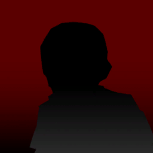 

        ```
        Announcement: An explosion has been detected. Please protect yourselves from danger by swiftly moving under your desks.
        เสียงประกาศตามสาย: ตรวจพบการระเบิดภายในอาคาร โปรดปกป้องตนเองจากภัยอันตรายที่เกิดขึ้น ด้วยการหลบใต้โต๊ะของพวกคุณด้วยคะ
        ```

        ---

        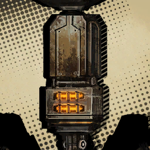

        ```
        Intimidating Machine: ......
        เครื่องจักรที่ดูน่าเกรงขาม: ......
        ```

        ---

        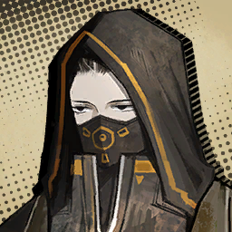

        ```
        ???: Whoops... That was a misfire.
        บุคคลปริศนา: อุ๊ปส์... โทษทีเมื่อกี้ยิงพลาดน่ะ
        ```

        ---

        

        ```
        Announcement: A second explosion has been detected. Please activate the regeneration ampule in your possession, and...
        เสียงประกาศตามสาย: ตรวจพบการระเบิดครั้งที่สอง กรุณาเปิดใช้งานหลอดบรรจุยาฟื้นฟูที่ท่านมีอยู่ และ...
        ```
        ```
        Announcement: Please wait for K Corp's security staff that will arrive within 18 seconds of, of, of...
        เสียงประกาศตามสาย: กรุณารอจนกว่าเจ้าหน้าที่รักษาความปลอดภัยของเคคอร์ปจะไปถึง ในอีก 18 วินา ที ที ที...
        ```

        ---

        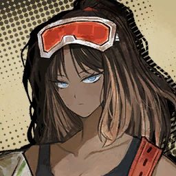

        ```
        ???: Same old announcement. I wonder, why are broadcasts like that told in such calm voices?
        บุคคลปริศนา: ประกาศเดิมนี้อีกแล้ว ทำเอาฉันสงสัยเลยนะ ว่าทำไมเวลาพูดกระจายเสียงออกไป ต้องพูดด้วยน้ำเสียงใจเย็นด้วย
        ```
        ```
        ???: Won't a little gasping and panicking be more effective in getting people to evacuate?
        บุคคลปริศนา: ไม่ใช่ว่าเสียงหอบนิด ๆ แล้วก็ตื่นตระหนกอีกหน่อย จะมีประสิทธิภาพในการอพยพคนมากกว่าหรอ?
        ```
        ```
        ???: See, getting so preoccupied with all that technology and science nonsense dulls your empathy with feelings.
        บุคคลปริศนา: เห็นไหมเล่า ว่าการหมกมุ่นอยู่กับเทคโนโลยีพวกนั่นมากเกินไป กับ หลักการทางวิทยาศาศตร์บ้าบอพวกนั่นทำให้ความรู้สึกเห็นเข้าอกเข้าใจของมนุษย์ทู่ลงมากแค่ไหน
        ```
        
        ---

        

        ```
        ???: ...You talk too much. Be quiet.
        บุคคลปริศนา: ...เธอพูดมากไปแล้ว เงียบซะ
        ```

        ---

        


        ```
        Samjo: Is everyone alright? If you aren't, take a regeneration sample. A cross-compatibility test is normally needed, but we're in an emergency...
        แซมโจ: ทุกคนยังอยู่ดีกันใช่ไหมครับเนี้ย? ถ้าใครไม่ไหวก็บอกผมได้นะครับ จะได้ให้ยาฟื้นฟูตัวทดลองไปสักโดส ถึงแม้จะเป็นตัวที่ยังไม่ได้รับการทดสอบก็เถอะ แต่คงช่วยไม่ได้ล่ะนะครับ ที่ตอนนี้เราอยู่ในสถานการณ์ฉุกเฉิน
        ```

        ---

        

        ```
        Gregor: ...You look unfazed. Doesn't a terrorist attack usually throw everyone into chaos?
        เกรกอร์: ...คุณดูนิ่งจังเลยนะครับ ไม่ใช่ว่าการโจมตีของผู้ก่อการร้ายควรจะทำให้ทุกคนอยู่ในความโกลาหลหรอครับ?
        ```

        ---

        

        ```
        Dongrang: The first attack did have everyone panicking. The explosive detection broadcasts didn't exist, either. Mister Samjo hid under his desk for quite some time...
        ดงรัง: ใช่ครับ การโจมตีครั้งแรกคงทำให้ทุกคนตื่นตระหนกกันไม่น้อย แต่ก็ดูเหมือนว่าจะไม่มีประกาศตรวจจับพบระเบิดระลอกใหม่แล้วนะครับ แล้วก็คุณแซมโจที่หลบอยู่ใต้โต๊ะตรงนั่นได้สักพักใหญ่ จะไม่ออกมาคุยกันหน่อยหรอครับ...
        ```

        ---

        

        ```
        Samjo: As I keep saying, the attack occurred in the lobby, and I was merely attempting to pick up a notebook that fell under the desk.
        แซมโจ: ก็อย่างที่ผมพึ่งบอกไปไงครับ ว่าการโจมตีเกิดขึ้นที่ล็อบบี้ และผมก็แค่กำลังพยายามจะหยิบโน๊ตบุ๊คที่ตกอยู่ใต้โต๊ะน่ะครับ
        ```
        ```
        Samjo: You must take this situation seriously, Mr. Dongrang. An attack on a K Corp. laboratory in the middle of the Nest is not a matter of course.
        แซมโจ: ผมคิดว่าคุณควรที่จะมองสถานการณ์ที่เกิดขึ้นให้ จริงจัง/ซีเรียส มากกว่านี้หน่อยนะครับ คุณดงรัง การโจมตีเคคอร์ป แลปที่ตั้งอยู่ใจกลางเนสแบบนี้ ไม่ใช่เรื่องปกติที่เกิดขึ้นได้ทุกวันนะครับ
        ```

        ---

        

        ```
        Dongrang: For sure, they managed to arrive at the floor where the researchers are. Oh, I think I sprained my left ankle, Samjo.
        ดงรัง: คร้าบ ๆ ผมจริงจังอยู่คร้าบ ปานนี้ พวกมันคงไปถึงชั้นที่เหล่านักวิจัยรวมตัวกันแล้วล่ะมั้ง โอ้ ฉันคิดว่าฉันพึ่งจะทำข้อเท้าซ้ายตัวเองแพลง แซมโจ
        ```

        ---

        

        * เสียงในหัว

            ```
            I watched as Samjo injected a regeneration ampule into Dongrang's body.
            ผมมองแซมโจที่ฉีดยาฟื้นฟู เข้าไป/ไปบน ในร่างกายของดงรัง 
            ```

        ---

        

        ```
        Outis: Are they the terrorists that are occupying the Lobotomy Corp. branch?
        เอาทิส: พวกมันเป็นผู้ก่อการร้ายกลุ่มเดียวกัน กับที่ยึดห้องวิจัยที่สาขาโลโบโตมี่หรือเปล่าคะ? 
        ```

        ---

        

        ```
        Dongrang: Indeed. Speak of the devil.
        ดงรัง: ดูเหมือนจะใช่นะครับ พูดถึงก็มาเลย
        ```

        ---

        

        ```
        Sinclair: They're part of the terrorist organization? They don't really look like well-trained combatants...
        ซินแคร์: พวกเขาเป็นส่วนหนึ่งขององค์กรก่อการร้ายหรอครับ? แต่พวกเขาดูไม่เหมือนกับนักสู้ที่ถูกฝึกมาดีเลยนะครับ...
        ```

        ---

        

        ```
        Heathcliff: Would you look at that, you got an eye for that now, kid?
        ดันเต้: เอ้า ดูนั่นสิ ดูสิว่าใครมีสายตาที่เฉียบคมขึ้นแล้ว ไอหนู?
        ```

        ---

        

        ```
        Samjo: It's natural. They aren't the ones directly engaging in combat.
        แซมโจ: ยังไงก็ต้องเป็นอย่างงั้นอยู่แล้วล่ะครับ เพราะ พวกเขาไม่ได้เป็นคนที่มีหน้าที่ในการต่อสู้โดยตรง
        ```
        ```
        Samjo: It should take a single glance to notice that they appear lean and frail just like Mr. Dongrang.
        แซมโจ: มองแว๊บเดียวก็รู้แล้ว จากลักษณะลำตัวที่ขาดสมดุล และอ่อนแอ ไม่ต่างอะไรกับคุณดงรัง 
        ```

        ---

        

        ```
        Heathcliff: I've seen rich sods that don't get into fights still get body-enhancing augments just in case. You sure they aren't just acting weak?
        ฮิธคลิฟฟ์: ฉันเคยเห็นไอพวกคนรวยที่ไม่สู้กับใคร แต่ก็ยังมีอุปกรณ์เสริมสมรรถภาพทางด้านร่างกายติดไม้ติดมือเป็นไม้ตายเอาไว้อยู่ แกแน่ใจใช่ไหมว่าพวกมันไม่ได้กำลังแสร้งทำเป็นอ่อนแอ?
        ```

        ---

        

        ```
        Faust: It's not necessarily the case. As varied as ways to augment the body are, some may be repulsed by it, physically or mentally.
        เฟาสท์: มันไม่ใช่ว่าต้องเป็นแบบนั่นเสมอไปนะคะ วิธีการเสริมแต่งร่างกายนั่นมีอยู่มากมายหลากหลายแบบ ในทำนองเดียวกัน บางคนก็อาจจะรู้สึกรังเกลียดมัน ไม่ว่าจะทางกายภาพ หรือ จิตใจไม่มากก็น้อย
        ```
        ```
        Faust: Some Nests even forbid their residents from getting procedures above a certain level of power if they aren't qualified.
        เฟาสท์: บางเนสเองก็ห้ามไม่ให้ผู้อาศัยของพวกเขาเข้ารับการผ่าตัดดัดแปลง เกินกว่าระดับของพลังที่กำหนด หากพวกเขาไม่ผ่านเกณฑ์
        ```

        ---

        

        ```
        Rodion: They don't want the lowly to rise up and topple the ruling class over, huh?
        โรเดียน: หรือก็คือพวกเขาไม่ต้องการให้พวกรากหญ้าลุกฮือ และโค้นล้มชนชั้นปกครองแบบนั่นใช่ไหม?
        ```

        ---

        

        ```
        Faust: I couldn't deny those possibilities. Each Nest must have its own reasons.
        เฟาสท์: ฉันไม่อาจปฎิเสธความเป็นได้พวกนั่นหรอกค่ะ แต่ละเนสก็คงมีเหตุผลรองรับในแบบตนเองที่ต่างกัน
        ```
        ```
        Faust: But, fundamentally speaking, augmenting procedures are like high-performing vehicles. If an unqualified driver were to try and handle a vehicle with a power output above what they can handle...
        เฟาสท์: แต่ถ้าจะให้พูดตามหลักการแล้ว ร่างกายที่เสริมแต่งก็ไม่ต่างอะไรกับยานพาหนะประสิทธิภาพสูง ถ้าคนขับไม่ผ่านเกณฑ์จะลองพยายามที่จะควบคุมพาหนะนั่น ซึ่งมีพลังเกินกว่าที่พวกเขาจะรับไหว...
        ```
        ```
        Faust: Layers of order in the Nest would fall apart in no time, so they'd like to prevent that from happening.
        เฟาสท์: ระดับชั้นของกฎระเบียบในเนส ก็คงพังทลายลงในเวลาอันสั้น เพราะงั้น พวกเขาก็เลยอาจจะอยากป้องกันเอาไว้ก่อน เพื่อไม่ให้เกิดเหตุการณ์อะไรอย่างนั่นก็ได้นะคะ
        ```

        ---

        

        ```
        Dongrang: Sorry to interrupt your passionate exposition, the pain was genuine for me, just so you know.
        ดงรัง: ขอโทษที่ต้องขัดจังหวะนิทรรศการที่รุ่มร้อนของคุณด้วยนะครับ แค่อยากจะบอกว่า ผมรู้สึกเจ็บมากเลยจริง ๆ น่ะครับ
        ```

        ---

        

        * เสียงในหัว

            ```
            Soon enough, people wearing familiar outfits appeared, along with the unforgettable beats of footsteps.
            ไม่นานนัก เจ้าพวกคนที่สวมใส่ชุดคุ้นตาก็ปรากฎตัวออกมา พร้อมกับเสียงฝีเท้าที่ไม่อาจลืมได้
            ```

        ---

        

        ```
        Don Quixote: Eek!
        ดอน กิโฆเต้: อึ๋ย!
        ```

        ---

        

        ```
        Sinclair: T-The ones from the checkpoint...
        ซินแคร์: พ-พวกคนจากตอนด่านตรวจนี้ครับ...
        ```

        ---

        

        ```
        Ishmael: And now they're our reliable allies.
        อิชมาเอล: แล้วตอนนี้พวกเขาก็เป็นพันธมิตรที่ไว้ใจได้ไปซะแล้ว
        ```

        ---

        

        ```
        Dante: <Those robots... They look seriously hostile...>
        ดันเต้: <หุ่นยนต์พวกนั่น... ดูอันตรายไม่เบาเลยนะ...>
        ```

        ---

        

        ```
        ???: Hemorrhage within five seconds. Spinal damage of at least 12 centimeters in length. Direct impact on coronary artery. Destruction of the cranium.
        บุคคลปริศนา: ตกเลือดภายในห้าวินาที กระดูกสันหลังเสียหายอย่างน้อยยาว 12 เซนติเมตร เข้าปะทะโดยตรงกับหลอดเลือดแดงหัวใจ กระโหลกถูกทำลายสิ้น
        ```
        ```
        ???: These steps will ensure that the enemy meets immediate death without unnecessary suffering.
        บุคคลปริศนา: ขั้นตอนพวกนี้จะทำให้มั่นใจได้ว่า ศัตรูที่เราต้องเผชิญหน้าจะตายในทันทีโดยที่ไม่ทรมาณ
        ```
        
        ---

        

        ```
        ???: It can do that, but wasn't it mainly to fully destroy the brain so that they can't regenerate themselves?
        บุคคลปริศนา: จะให้ทำก็ทำได้อยู่หรอก แต่ไม่ใช่ว่าเราแค่ต้องทำลายสมองพวกมันก็พอแล้วหรอ?
        ```
        ```
        ???: Hey, if you don't mind, could you pretend to be dead if this doesn't kill you right away? My buddy stayed up all night upgrading the instakill function.
        บุคคลปริศนา: นี้ ถ้าไม่รังเกียจ ช่วยแกล้งตายหน่อยได้ไหม ถ้าเกิดว่ามันไม่ได้ฆ่านายตายในทันที? คู่หูฉันอุตสาห์ไม่หลับไม่นอนทำมันทั้งคืนเพื่ออัปเกรดฟังก์ชันฆ่าในทันทีเลยนะ
        ```

        ---

        
        
        ```
        ???: Quiet.
        บุคคลปริศนา: เงียบซะ
        ```

        ---

        

        ```
        ???: See~ I told you. With that recoil distance, it only reaches as deep as the occipital lobe. Did you really have to learn it through trial?
        บุคคลปริศนา: เห็นไหม~ ฉันบอกแล้ว ว่าด้วยแรงถืบแค่นั่น มันจะไปลึกสุดได้ก็แค่สมองส่วนท้ายทอยก็เท่านั้น นี้นายต้องลองเองก่อนตลอดหรือไง กว่าจะเรียนรู้ได้?
        ```

        ---

        

        ```
        ???: Damn it... It should have gone all the way through the temporal lobe.
        บุคคลปริศนา: เวรเอ้ย... ไม่ใช่ว่ามัน ควรที่จะทะลุถึงสมองกลีบขมับเลยไม่ใช่หรือไง
        ```

        ---

        

        ```
        Dongrang: We can't lose to them, we have robots of our own. They should be here any minute now...
        ดงรัง: เราจะน้อยหน้าพวกเขาไม่ได้เหมือนกันนะครับ เราเองก็มีหุ่นยนต์ ที่น่าจะเก็บเอาไว้แถว ๆ นี้... 
        ```
        ```
        Dongrang: Aha, there it is! The regeneration ampule administration drone.
        ดงรัง: อาฮา นี้ไง ผมเจอแล้ว! โดรนสำหรับฉีดยาฟื้นฟูภาคสนาม
        ```

        ---

        

        ```
        Ishmael: It must be pretty handy to have them. Do they inject the ampules right as the staff is injured?
        อิชมาเอล: มีมันแบบนี้ก็น่าจะหายห่วงนะคะ ว่าแต่เจ้านี้ฉีดยาในตอนที่เจ้าหน้าที่ได้รับบาดเจ็บหรอคะ?
        ```

        ---

        

        ```
        Samjo: Yes, as long as their heads aren't lost... and the ampule is injected before the golden time passes and their brain stops functioning... They're practically undying.
        แซมโจ: ใช่ครับ ตราบใดที่หัวของพวกเขายังไม่ขาดออกจากคอ... และยานี้ถูกฉีดเข้าไป ก่อนที่เวลาทองจะล่วงเลยผ่าน แล้วสมองของพวกเขาหยุดทำงาน... พวกเขาก็แทบที่จะตายไม่ได้เลยครับ
        ```

        ---

        

        ```
        K Corp. Security: ...Kgh.
        เจ้าหน้าที่รักษาความปลอดภัยเคคอร์ป: ...เฮือก
        ```

        ---

        

        ```
        Samjo: Injuries like holes in internal organs...
        แซมโจ: อาการบาดเจ็บอย่างเช่นรูในอวัยวะภายใน...
        ```

        ---

        

        ```
        K Corp. Security: ...Kurgh!
        เจ้าหน้าที่รักษาความปลอดภัยเคคอร์ป: ...เฮือกฮาอา!
        ```

        ---

        

        ```
        Samjo: Or broken bones can be healed in seconds.
        แซมโจ: หรือจะเป็นกระดูกที่แตกหัก ก็ล้วนสามารถถูกรักษากลับมาได้ในไม่กีวินาที
        ```

        ---

        

        ```
        Ishmael: Even still... They wouldn't be immune to pain. How can they be so calm about it...
        อิชมาเอล: ถึงอย่างงั้นก็เถอะค่ะ... แต่พวกเขาก็น่าจะยังรู้สึกถึงความเจ็บปวดได้อยู่ แล้วทำไมพวกเขาถึงดูใจเย็นขนาดนั้นได้...
        ```
        ```
        Ishmael: They won't even bat an eye at a colleague right next to them being cut down.
        อิชมาเอล: พวกเขาไม่แม้แต่จะชายตามองเพื่อนร่วมงานที่พึ่งถูกตัดเป็นชิ้น ๆ ที่อยู่ข้าง ๆ เลยด้วยซ้ำ
        ```

        ---

        

        ```
        Meursault: Natural behavior.
        เมอร์โซลท์: พฤติกรรมธรรมชาติน่ะครับ
        ```
        ```
        Meursault: If all wounds can be healed up in seconds, all judgement regarding it will be secondary.
        เมอร์โซลท์: ถ้าแผลทั้งหมดที่เกิดขึ้น สามารถถูกรักษาได้ภายในไม่กี่วินาที การตัดสินใจนอกเหนือนั่นจะกลายเป็นสิ่งรอง
        ```

        ---

        

        ```
        Hong Lu: If that's the case... Will we become like that eventually?
        ฮงหลู่: ถ้าเช่นนั้นแล้ว... วันหนึ่งพวกเราก็จะกลายเป็นแบบนั้นหรอครับ?
        ```

        ---

        

        ```
        Meursault: I don't see a reason to think about such things.
        เมอร์โซลท์: ขอโทษด้วยนะครับ แต่ผมมองไม่เห็นเหตุผลที่เราต้องคิดเรื่องนั้นเลยสักนิด
        ```

        ---

        

        ```
        Hong Lu: I was just curious.
        ฮงหลู่: ผมก็แค่สงสัยน่ะครับ
        ```

        ---

        

        ```
        ???: By the way... Who are these new faces with unfamiliar outfits? Anyone wanna introduce yourself?
        บุคคลปริศนา: ไงก็ชั่ง... ไอพวกหน้าใหม่กับชุดไม่คุ้นตาเหรอ? มีใครอยากจะแนะนำตัวเองบ้างไหม?
        ```

        ---

        

        ```
        ???: None of our business.
        บุคคลปริศนา: ไม่ใช่ ธุระกงการอะไร/เรื่องอะไร ของพวกเราสักหน่อย
        ```

        ---

        

        ```
        ???: True. But it's kinda awkward to be just facing them. Someone's gotta talk, no?
        บุคคลปริศนา: ก็จริง รู้ไหมว่ามันค่อนข้างรู้สึกอึดอัดที่จู่ ๆ ก็ต้องมาเจอกับพวกไหน ็ไม่รู้ เอ้า ไม่มีใครมีปากให้พูดเลยหรือไง?
        ```

        ---

        

        ```
        Ishmael: ...Why should we introduce ourselves to a terrorist organization?
        อิชมาเอล: ...แล้วเรื่องอะไรที่พวกเราต้องแนะนำตัวเองให้กับองค์กรก่อร้ายด้วยเล่า?
        ```

        ---

        

        ```
        ???: We're no mere terrorist organization. Watch your words.
        บุคคลปริศนา: เราไม่ได้เป็นองค์กรก่อการร้ายอะไรทั้งนั้น ระวังคำพูดของแกด้วย
        ```

        ---

        
        
        ```
        ???: I don't hate the sound of it. It lines up with my beliefs when I was four. I had to answer the call of a grad school because the paper I wrote on atoms won a prize at the age of eleven...
        บุคคลปริศนา: ฉันก็ไม่ได้รังเกลียดชื่อนั่นนักหรอกหนา เอาเข้าจริง มันตรงกับความเชื่อของฉันในตอนที่ฉันยังเป็นเด็กเลยล่ะ ฉันต้องรับสายจากบัณฑิตวิทยาลัยก็เพราะงานวิจัยที่เขียนขึ้นเกี่ยวกับอะตอมชนะการประกวดตอนอายุสิบเอ็ดขวบ
        ```

        ---

        

        ```
        ???: Shut it. We are the technology liberation alliance.
        บุคคลปริศนา: หุบปากได้แล้ว พวกเราคือคณะพันธมิตรปลดแอกเทคโนโลยี
        ```

        ---

        

        ```
        Hong Lu: Liberate what technologies exactly? Does technology yearn for freedom?
        ฮงหลู่: ที่พูดว่าปลดปล่อยเทคโนโลยีนี้หมายถึงอะไรหรอครับ? เทคโนโลยีเองก็ต้องการอิสระภาพด้วยหรอครับ?
        ```

        ---

        

        ```
        Sinclair: Maybe... they're talking about the animals in the lab... I think?
        ซินแคร์: บางที... เขาอาจจะพูดถึงพวกสัตว์ที่ถูกจับอยู่ในแลป... ก็ได้ล่ะมั้งครับ?
        ```

        ---

        

        ```
        ???: You hear that? He thinks we're animal protectors or something?
        บุคคลปริศนา: เมื่อกี้นายได้ยินปะ? มันคิดว่าเราเป็นผู้พิทักษ์สัตว์ป่าอะไรแบบนั้นด้วยแหละ?
        ```
        ```
        ???: Sorry, but that went out of fashion long ago. You think we're working day and night assembling machines just to fight for happily raised chickens fried in healthy oil?
        บุคคลปริศนา: โทษทีน้าเจ้าหนู ไม่ได้ตั้งใจจะล้ออะไรเธอนะ แต่พล็อตเรื่องอะไรแบบนั้นมันตกยุคไปนานแล้ว นี้เธอคิดว่าพวกเราตั้งใจทำงานกันหลังคดหลังแข็งทั้งวี่ทั้งวันสร้างเครื่องจักรแล้วเครื่องจักรเล่าทั้งหมดนั้นก็เพื่อต่อสู้ให้ไก่ตาดำ ๆ ที่ต้องถูกทอดในน้ำมันร้อน ๆ น่ะนะ? แค่คิดก็ขำแล้ว
        ```
        ```
        ???: Type X-32 bolts are so hard to get these days, we have to order them from other Nests. Do you have any idea how much tax is added?
        บุคคลปริศนา: ไทป์ เอ็กซ์-32 โบลต์ เป็นของที่ ทุกวันนี้/เดี๋ยวนี้ หายาก พวกเราก็เลยจำใจต้องสั่งมันจากอีกเนสหนึ่งเท่านั้นถ้าอยากจะได้มา แล้วเธอรู้บ้างหรือเปล่าว่าภาษีสินค้านำเข้าเนี้ยแพงหูฉีกมากแค่ไหน? 
        ```
    
        ---

        

        ```
        Faust: You can substitute type X-32 bolts by casting a c-9 bolt and tempering it at an interval of two hours.
        เฟาสท์: แต่ไม่ใช่ว่าคุณก็ใช้อย่างอื่นแทน ไทป์ เอ็กซ์-32 โบลต์ ก็ได้ไม่ใช่หรอคะ ด้วยการหล่อ ซี-9 โบลต์ และปรับอุณหภูมิให้สูงขึ้นเป็นระยะเวลาสองชั่วโมง
        ```

        ---

        

        ```
        ???: You aren't gonna win over us by acting all smart...
        บุคคลปริศนา: ถึงแกทำตัวฉลาดไปก็เอาชนะพวกฉันไม่ได้หรอกนะ...
        ```

        ---

        

        ```
        ???: Oh... Huh... No, she might be right... It could work.
        บุคคลปริศนา: โอ้... หะ... ไม่ เธอน่าจะพูดถูก... มันต้องได้ผลแน่ 
        ```

        ---

        

        ```
        Gregor: Could you tell us why you're offering advice to enemies, Ms. Faust?
        เกรกอร์: ช่วยบอกผมทีได้ไหมครับ ว่าทำไมคุณถึงให้คำแนะนำกับคนที่เป็นศัตรูของเราไปกัน คุณเฟาสท์?
        ```

        ---

        

        ```
        Faust: You wouldn't understand. Researchers have a creed more valuable than life.
        เฟาสท์: คุณไม่เข้าใจหรอกค่ะ ว่านักวิจัยทุกคนต่างมีอุดมการณ์ประจำตัวของตนเองที่มีค่าซะยิ่งกว่าชีวิต 
        ```

    ---

    * **Episode: 9 | ตอนที่ 9<br>Location: Invaded K Corp. Laboratory | ห้องแลปเคคอร์ปที่ถูกบุกรุก** 

        

        ```
        Gregor: That... certainly looks convenient. Broken bones heal up in a matter of moments.
        เกรกอร์: นั่น... ดูจะค่อนข้างสะดวกสบายดีทีเดียวนะ กระดูกที่แตกหักยับเยินสมานตัวกลับมาได้ในไม่กี่อึดใจ
        ```

        ---

        

        ```
        Dongrang: K Corp. provided us with an astronomical sum of research grants to support our research on improving this ampule. Do keep this a secret from Shrenne, please; she might get mad at me about it for three months.
        ดงรัง: ก็แหงล่ะครับ เคคอร์ปเป็นผู้มอบงานวิจัยจำนวนมากมายมหาศาลให้กับพวกเรา เพื่อสนับสนุนงานวิจัยนี้ในการพัฒนายาสูตรใหม่ให้สำเร็จ ไงก็ ช่วยเก็บเรื่องนี้เป็นความลับจากชเรนน์ด้วยนะครับ; ถ้าเธอรู้เข้ามีหวังได้ โกรธ/งอน ไปอีกสามเดือนแน่
        ```

        ---

        

        ```
        Ryoshu: Hmph... Clock would only wind the thing after we've died, scared of a little hurting.
        เรียวชู: เหอะ... เดี๋ยวคุณนาฬิกาก็ หมุน/ดึงกลับมา เองนั่นแหละถ้าเราตาย จะป๊อดกลัวเจ็บไปถึงไหนกัน
        ```

        ---

        

        ```
        Dante: <......>
        ดันเต้ <......>
        ```

        ---

        

        ```
        Rodion: I think I cracked a bone in my right hand~ Can I get an ampule? It's kinda harder to grip my axe.
        โรเดียน: ฉันว่าฉันเผลอทำมือขวาตัวเองหักอาา~ ขอยาหน่อยได้ไหม? แบบว่ามันจับขวานยากน่ะ
        ```

        ---

        

        * เสียงในหัว

            ```
            Rodya stood in front of a K Corp. drone and extended her right arm.
            โรดย่ายืนต่อหน้าโดรนของเคคอร์ปพร้อมกับที่ยื่นแขนขวาออกไป
            ```

        ---

        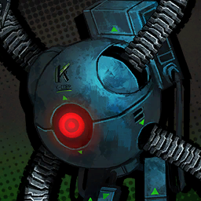

        ```
        Ampule Helper: Welcome. K Corp. drones are always there for your health. Administering regeneration ampule...
        ผู้ช่วยฟื้นฟู: ยินดีต้อนรับ โดรนเคคอร์ปพร้อมให้บริการเพื่อสุชภาพท่านเสมอ กำลังจ่ายยาฟื้นฟูแก่ผู้ป่วย...
        ```
        ```
        Ampule Helper: ...Cannot administer.
        ผู้ช่วยฟื้นฟู: ...ไม่สามารถอนุมัติได้/ไม่อนุมัติ
        ```
        ```
        Ampule Helper: Friendly entities of type 3j-54 are eligible for serum injection, but regeneration ampules may only be administered to patients hemorrhaging 1Lr or more of blood. Also, since you have not taken a cross-compatibility test for the ampules, we do not take any responsibility for possible side effects. Thank you.
        ผู้ช่วยฟื้นฟู: ตัวตนประเภทมิตร ชนิด 3เจ-54 มีสิทธิ์เข้ารับการฉีดเซรุ่ม แต่ยาสำหรับฟื้นฟูจะถูกจัดแจงให้กับผู้ป่วย ที่มีสภาวะตกเลือดตั้งแต่ 1 ลิตรเป็นต้นไปเท่านั้น และดูว่าเหมือนท่านจะยังไม่ได้เข้ารับการทดสอบความเข้าใจกันได้ของเลือดกับยา จึงแจ้งมาเพื่อทราบว่าพวกเราจะไม่รับผิดชอบใด ๆ หากเกิดผลข้างเคียงขึ้นจากฤทธิ์ของยาโดยเด็ดขาด ขอบคุณค่ะ
        ```

        ---

        

        ```
        Rodion: Wha~? What are you talking about, you want me to cut off an arm or a leg or something?
        โรเดียน: หาา~? พูดอะไรของแกน่ะ/หมายความว่าไงกัน แกจะให้ฉันตัดแขนขาตัวเองหรือไง?
        ```

        ---

        

        ```
        Sinclair: They're...
        ซินแคร์: พวกเขา...
        ```
        ```
        Sinclair: They're already doing that. Look at the K Corp. staff...
        ซินแคร์: พวกเขาทำไปแล้วครับ ดูเจ้าหน้าที่เคคอร์ปที่ยืนอยู่ตรงนั้นสิ...
        ```
        ```
        Sinclair: They're cutting up their own limbs... to get the ampule...
        ซินแคร์: พวกเขากำลังตัดแขนขาตัวเอง... เพื่อที่จะได้รับยารักษา..
        ```

        ---

        

        ```
        Samjo: It's a necessary requirement. It would be a tremendous financial waste to use regeneration ampules for every little scratch.
        แซมโจ: มันเป็นเงื่อนไขจำเป็นน่ะครับ ไม่งั้นพวกเราคงได้สูญเงิน มหาศาล/บานตะไท ไปกับการใช้ยาฟื้นฟูแผลถลอกแน่
        ```
        ```
        Samjo: I hate to make comparisons, but its value is far above the caliber of small firms like yours.
        แซมโจ: และอีกอย่าง ผมก็ไม่ชอบการเปรียบเทียบเมื่อกี้เอาซะเลยนะครับ แต่ก็เข้าใจได้ ในเมื่อคุณเองก็มาจากบริษัทเล็ก ๆ เกินกว่าที่จะประเมินมูลค่าของมันได้
        ```

        ---

        

        ```
        Sinclair: ......
        ซินแคร์: ......
        ```

        ---

        

        ```
        Dante: <Yeesh...>
        ดันเต้: <เวรรร...>
        ```
        ```
        Dante: <It looks a bit dangerous here. Those machines are too rough... They might get me killed if I'm not careful.>
        ดันเต้: <ตรงนี้ดูอันตรายจังเลยนะ เครื่องจักรพวกนั้นมัน โหด/เถื่อน เกินไปแล้ว... ขืนฉันยังยืนอยู่ตรงนี้ต่อไป มีหวังโดนฆ่าไม่รู้ตัวแน่>
        ```
        ```
        Dante: <I might wanna stay away from the fray a bit just to be safe...>
        ดันเต้: <เอาเป็นว่าฉันจะถอยออกมาให้ห่างจากการต่อสู้สักนิดเพื่อความปลอดภัยของชีวิตและทรัพย์สินละกันนะ...>
        ```

        * เสียงในหัว

            ```
            Just then, something grazed past my head... I mean, my head with a threatening shrill.
            ก่อนที่ทันใดนั้นเอง จะมีบางอย่างพุ่งเฉี่ยวหัวฉันไป... ด้วยแท่งแหลมคมที่พุ่งเข้ามาราวกับหมายเอาชีวิต
            ```

        ```
        Dante: <Ah...>
        ดันเต้: <อา...>
        ```

        ---

        

        ```
        Ishmael: Grrr...
        อิชมาเอล: อึก...
        ```

        ---

        

        * เสียงในหัว

            ```
            Right as another projectile flew at me, Ishmael swiftly stretched her arm to take the hit.
            ก่อนที่อีกแท่งหนึ่งจะพุ่งเข้ามาหาฉัน อิชมาเอลก็รีบรุดเข้ามา และกางแขนของเธอเพื่อรับการโจมตีนั้นแทนฉัน
            ```
            ```
            Turning to the direction the projectiles came from, I didn't find enemy robots.
            พอหันไปทางที่แท่งพวกนั้นลอยมา ฉันมองไม่เห็นหุ่นยนต์ของศัตรู
            ```
            ```
            Instead, there was a K Corp. drone glaring with red.
            แต่กลับ... เป็นโดรนของเคคอร์ปที่กำลังจ้องมองมาที่ฉันกับอิชมาเอลด้วยดวงตาสีแดง
            ```

        ---

        

        ```
        Outis: Executive Manager! Are you alright?
        เอาทิส: ท่านผู้จัดการสูงสุด! ท่านไม่เป็นอะไรใช่ไหม?
        ```

        ---

        

        ```
        Ishmael: I'm the one who got hit, Outis...
        อิชมาเอล: เป็นบ้าเป็นบออะไร ฉันต่างหากที่เป็นคนที่โดน ยิง/แทง นะเอาทิส...
        ```

        ---

        

        ```
        Outis: I should have taken the projectile for you. Curses!
        เอาทิส: ให้ตายเถอะ ฉันน่าจะเป็นคนรับแท่งแหลมพวกนั้นแทนที่จะเป็นเธอ โถ่เอ้ย!
        ```

        ---

        

        ```
        Ishmael: Excuse me...
        อิชมาเอล: ประทานโทษนะ...
        ```

        ---

        

        ```
        Outis: Hah, see what your robots that cost a bomb to make are doing. It fired at an ally!
        เอาทิส: หะ ดูสิว่าหุ่นยนต์ ทุนหนา/กระเป๋าวาฬ ของแกทำอะไร มันถึงได้ยิงใส่พวกเดียวกัน!
        ```

        ---

        

        ```
        Samjo: I must object. That was not friendly fire.
        แซมโจ: ผมคงต้องขอค้าน แต่นั้นไม่ใช่การยิงพวกเดียวกันนะครับ
        ```

        ---

        

        * เสียงในหัว
        
            ```
            Samjo yelled from behind, raising his hand high.
            แซมโจตะโกนมาจากด้านหลังพร้อมกับยกมือของเขาเหนือหัว
            ```

        ---

        
        
        ```
        Samjo: However... It does appear that exceptions couldn't be fully configured. I apologize for that particular shortcoming.
        แซมโจ: ถึงอย่างนั้น... ดูเหมือนว่าข้อยกเว้นจะยังถูกปรับแต่งไม่เสร็จ ผมต้องขออภัยกับความผิดพลาดในครั้งนี้ด้วยครับ
        ```

        ---

        

        ```
        Outis: What rubbish are you...
        เอาทิส: เป็นขยะที่ไร้ค่าอะไรแบบนี้...
        ```

        ---

        

        ```
        Samjo: As you are aware, you could come into this place purely thanks to Mr. Dongrang's whim.
        แซมโจ: ก็อย่างที่คุณรู้นั้นแหละครับ ว่าเดิมทีพวกคุณไม่ควรที่จะเข้ามาที่นี้ได้ แต่ที่เป็นอย่างนั้นทั้งหมดก็เพราะบารมีของคุณดงรังทั้งสิ้น
        ```
        ```
        Samjo: Having visitors in this place is an extremely rare occurrence, and as such, a factor that wasn't put into consideration.
        แซมโจ: การที่จู่ ๆ ก็มีผู้เยี่ยมชมในสถานที่แบบนี้ เป็นโอกาศที่นานทีมีหน และเพราะงั้นเองเรื่องนี้ถึงกลายเป็นปัจจัยที่พวกเราไม่อาจคาดถึงนะครับ
        ```

        ---

        

        ```
        Ishmael: What, ngh... are you talking about?
        อิชมาเอล: คุณ... กำลังหมายความว่าไง?
        ```

        ---

        

        ```
        Samjo: That K Corp's regenerator drones do more than just heal people.
        แซมโจ: เจ้าโดรนฟื้นฟูพวกนั้นไม่ได้มีหน้าที่แค่รักษาผู้คนอย่างเดียว
        ```

        ---

        

        ```
        Ishmael: Why... does it look like my body is melting? Can anyone make it... make sense...
        อิชมาเอล: ทำไม... มันเหมือนกับว่า... ร่างกายของฉันกำลังละลายล่ะ? มีใครพอที่จะ... อธิบายได้ไหม...
        ```

        ---

        

        ```
        Dante: <Ishmael!>
        ดันเต้: <อิชมาเอล!>
        ```

        ---

        

        ```
        Samjo: Normally, K Corp's drones administer regeneration ampules to injured personnel...
        แซมโจ: โดยปกติแล้ว โดรนของเคคอร์ปจะจ่ายยารักษาให้กับบุคลากรที่บาดเจ็บ...
        ```
        ```
        Samjo: However, it injects a decay ampule to deserters.
        แซมโจ: แต่มันเองก็จะฉีดยาเสื่อมสลายให้กับคนที่ละทิ้งหน้าที่ด้วยเหมือนกัน
        ```

        ---

        

        ```
        Dante: <...It shot the decay ampule at me because I was trying to escape the combat zone?>
        ดันเต้: <...อย่าบอกนะ ว่ามันพยายามยิงยาเสื่อมสมรรถภาพอะไรนั้นมา ก็เพราะฉันที่พยายามหลบเลี่ยงออกจากพื้นที่การต่อสู้?>
        ```

        ---

        

        ```
        Gregor: Ain't that just revolting... Think you can pull off summary executions when there isn't even a war going on?
        เกรกอร์: ไม่ใช่ว่านั้นออกจะป่าเถื่อนไปหน่อยหรอครับ... ที่จู่ ๆ ก็ตัดสินโทษให้ต้องวิสามัญ ทั้ง ๆ ที่นี้ก็ไม่ได้เป็นสงครามเลยด้วยซ้ำ?
        ```
        ```
        Gregor: Yeah, why not just make the drones fight instead?
        เกรกอร์: ถ้าคุณมีปัญญาสร้างพวกนั้นได้ แล้วทำไมถึงไม่ให้โดรนพวกนั้นสู้แทนล่ะครับ?
        ```

        ---

        

        ```
        Samjo: The Nest you're from must have valued human life, am I right?
        แซมโจ: เนสที่คุณจากมาคงให้ค่าสิ่งที่เรียกว่าชีวิตเพื่อนมนุษย์ใช่ไหมครับ?
        ```
        ```
        Samjo: The value of each drone we have far surpasses that of ten class 2 staff members combined. Do you understand?
        แซมโจ: แล้วคุณรู้ไหมว่ามูลค่าของโดรนพวกนั้นมันมากกว่าบุคคลกรเจ้าหน้าที่ระดับ 2 สิบคนรวมกันอีกนะครับ คุณเก็ตใช่ไหมว่ามันต้องใช้เงินมากแค่ไหน?
        ```

        ---

        

        ```
        Gregor: ..."You should understand," "you accept it"...
        เกรกอร์: ... "แกต้องเข้าใจ" "แกต้องยอมรับมัน"...
        ```
        ```
        Gregor: I've had crappy coercion shoved in my face too many times, I don't feel like complying anymore.
        เกรกอร์: ฉันพอแล้วกับคำพูดเส็งเคร็งพวกนี้ ที่เอาแต่บีบคั้นให้ฉันทำอะไรที่ไม่ต้องการซ้ำแล้วซ้ำเล่า ฉันจะไม่ยอมมันอีกแล้ว
        ```

        ---

        

        ```
        Faust: I do understand where it's coming from. There was research that revealed deploying K Corp's drones in simulated battles increased the odds of victory by 23.5 percent.
        เฟาสท์: ฉันก็พอจะเข้าใจเหตุผลอยู่นะคะ ว่าทำไมถึงต้องใช้มาตรการขั้นเด็ดขาดแบบนั้น มันเคยมีงานวิจัยออกมาน่ะค่ะ ว่าการจัดวางโดรนในสนามรบเสมือนสามารถเพิ่มโอกาศชนะได้ 23.5 เปอร์เซ็นท์
        ```
        ```
        Faust: It was a pretty famous paper among scholars.
        เฟาสท์: ถือเป็นบทความที่ค่อนข้างโด่งดังในหมู่นักวิชาการพอตัวเลยนะคะ 
        ```

        ---

        
        
        ```
        Outis: Since the old times, deserters who try to flee from battle have been pointed out as greater detractors of morale than the threat of overwhelming oppression or weakness of the leader.
        เอาทิส: เรื่องนี้ก็เป็นมาตั้งแต่ สมัยก่อน/สมัยละโว้(joke) แล้ว ที่ทหารหนี้ทัพที่พยายามหลบหนีจากการต่อสู้จะถูกมองว่าเป็นตัวบั่นทอนขวัญกำลังใจเสียยิ่งกว่ากำลังของศัตรูที่เหนือกว่า หรือ หัวหน้าที่อ่อนแอ 
        ```
        ```
        Outis: Public punishments of deserters are a historically proven tactic supported by many examples.
        เอาทิส: และการลงทัณฑ์ทหารหนี้ทัพเหล่านั้น ก็ถือเป็นกลยุทธิ์อย่างหนึ่งที่ถูกพิสูจน์หลายครั้งแล้วในประวัติศาตร์ที่ผ่านมาเป็นตัวอย่าง
        ```

        ---

        

        ```
        Gregor: Tch. Understand it all you like, then.
        เกรกอร์: ชิ อยากจะเข้าใจยังไงก็เชิญเลย
        ```

        ---

        

        ```
        Dante: <Wait, what are you all talking about?>
        ดันเต้: <เดี๋ยว พวกนายมัวพูดไร้สาระอะไรกันอยู่เนี้ย?>
        ```
        ```
        Dante: <Look at Ishmael, she's... melting down...!>
        ดันเต้: <ไม่เห็นหรือไงว่าอิชมาเอลเธอกำลัง... ละลายนะ...!>
        ```

        ---

        

        ```
        Outis: Ah, apologies for my negligence, Executive Manager.
        เอาทิส: อ้า ขอโทษสำหรับการเมินเฉยของดิฉันด้วยนะคะ ท่านผู้จัดการสูงสุด
        ```
        ```
        Outis: I failed to consider the suffering you must endure when you turn the clock.
        เอาทิส: ฉันลืมคาดคะเนไปถึงความทุกข์ทรมาณที่ท่านจะต้องแบกรับ ในทุกครั้งที่ท่านหมุนนาฬิกากลับ
        ```

        ---

        

        ```
        Dante: <Wha, that's not what I'm...>
        ดันเต้: <ห๊า ฉันไม่ได้หมายความแบบนั้น ฉัน...>
        ```

        ---

        

        ```
        Faust: You might want to hurry if that's your concern. Her heart should still be intact in her current state.
        เฟาสท์: ถ้าจะช่วยต้องรีบหน่อยนะคะ หัวใจของเธอยังคงทำงานได้ในสภาวะปัจจุบันที่เธอเป็นอยู่
        ```

        ---

        

        ```
        Ishmael: Manager... What'll... happen to me...
        อิชมาเอล: ผู้จัดการ... จะเกิด... อะไรขึ้นกับฉัน...
        ```

        ---

        

        * เสียงในหัว

            ```
            ......
            *เวรเอ้ย*
            ```
            ```
            The clock's hands turn with agony.
            เข็มสั้นยาวนาฬิกาหมุนทวนด้วยความโกรธ
            ```
            ```
            Meanwhile, Yi Sang was staring at empty ampules rolling on the floor.
            ในขณะที่ยี่ซังกำลังจ้องมองไปยังบรรจุยาเปล่าที่กองอยู่บนพื้น
            ```
        
        ---

        

        ```
        Yi Sang: ......
        ยี่ซัง: ......
        ```

    ---

    * **Episode: 10 | ตอนที่ 10<br>Location: K Corp. Laboratory | ห้องแลปศูนย์วิจัยเคคอร์ป** 

        

        ```
        Shrenne: Attention, everyone! Reinforcements have arrived!!
        ชเรนน์: โปรดทราบทุกคน โปรดทราบ! กำลังเสริมมาถึงแล้ว!
        ```

        ---

        

        ```
        Rodion: W-Who are those people?
        โรเดียน: ค-คนพวกนั้นเป็นใครกัน?
        ```

        ---

        

        ```
        Dongrang: For sure, who could these be, Shrenne~? Made new friends other than me?
        ดงรัง: แหงล่ะ จะเป็นใครไปได้อีก นอกจากชเรนน์สุดที่รักของผม~? อ้า รอบนี้มีเพื่อนใหม่นอกจากผมด้วยหรอเนี้ย?
        ```

        ---

        

        ```
        Shrenne: They're Fixers from Rosespanner Workshop, the ones we're working with for the current project. They've visited here several times already, you really should be familiar by now.
        ชเรนน์: เพื่อนมงเพื่อนใหม่บ้านแกสิ พวกเขาคือฟิกเซอร์จากเวิร์กชอป ประแจกุหลาบ/โรสสแปนเนอร์ ที่พวกเรากำลังทำงานด้วยในโปรเจ็คตอนนี้ไง พวกเขามานี้ได้สองสามครั้งแล้วมั้ง จะตีมึนไปถึงไหน
        ```

        ---

        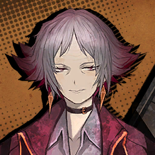

        ```
        Niko: Pleasure to meet you. I'm Niko, representative of Rosespanner Workshop.
        นิโกะ: เป็นเกียรติมากที่ได้พบครับ ผมนิโกะ ตัวแทนจากเวิร์กชอปประแจกุหลาบ
        ```

        ---

        

        * เสียงในหัว

            ```
            The enemies' faces clouded over at the unexpected arrival of reinforcements.
            ทันทีที่กำลังเสริมที่ไม่ได้คาดคิดกรูเข้ามา ใบหน้าของเหล่าศัตรูก็ซีดเซียวทันตาเห็น
            ```

        ---

        

        ```
        ???: Boring. Let's head back.
        บุคคลปริศนา: น่าเบื่อชะมัด กลับกันเถอะ
        ```

        ---

        

        ```
        ???: What?
        บุคคลปริศนา: ว่าไงนะ?
        ```
        ```
        ???: Sure... We'll leave.
        บุคคลปริศนา: ก็ได้... เราจะถอย
        ```

        ---

        

        ```
        Niko: Would you look at that, our "aura" has made them flee out of terror... Huhu...
        นิโกะ: เห็นไหมล่ะครับ ว่าลำพังเพียง "ออร่า" ของพวกเราอย่างเดียว ก็เพียงพอที่จะ ทำให้พวกมันวิ่งหนีหางจุกตูด/ขับไล่พวกมัน ด้วยความกลัวแล้ว... ฮิฮะฮะฮา...
        ```

        ---

        

        ```
        Dongrang: Thanks, Shrenne. This made me seriously consider the possibility that your department might be picked as the best next year for the first time.
        ดงรัง: ขอบคุณนะ ชเรนน์ ถ้าไม่ได้เธอมีหวังฉันแย่ไปแล้ว ทำเอาต้องคิดใหม่เลยนะเนี้ยว่าบางทีแผนกของเธออาจพอมีโอกาศถูกรับเลือกเป็นแผนกดีเด่นแห่งปี ครั้งแรกของเธอบ้างเหมือนกัน
        ```

        ---

        

        ```
        Shrenne: Shame about your precious trophies being destroyed, huh?
        ชเรนน์: หยุดแพล่มไร้สาระสักที น้ำหน้าอย่างนายคงเอาแต่กลัวว่าถ้วยรางวัลแสนล้ำค่าของตัวเองจะถูกทำลายจะเข้าท่ามากกว่า?
        ```

        ---

        

        ```
        Samjo: Ms. Shrenne, pardon me for suspecting, but you did not perchance wait until the trophies were broken before bringing reinforcements, did you?
        แซมโจ: คุณเชรนน์ ขออภัยที่ผมสงสัยนะครับ แต่คุณไม่ได้ตั้งใจรอให้ถ้วยรางวัลพังก่อนที่จะนำกำลังเสริมเข้ามาใช่ไหมครับ?
        ```

        ---

        

        ```
        Dongrang: I don't mind losing them.
        ดงรัง: ถึงเสียไปก็ไม่เป็นไรหรอก
        ```
        ```
        Dongrang: As long as the photo is fine.
        ดงรัง: ตราบใดที่รูปถ่ายยังโอเคดี
        ```

        ---

        

        ```
        Gregor: The damage they left is pretty severe now that I'm seeing it firsthand...
        เกรกอร์: จากที่ผมเห็นด้วยตาตัวเอง ความเสียที่พวกมันทำนี้ก็ดูจะไม่น้อยเลยนะครับ...
        ```
        ```
        Gregor: It could've gotten all the researchers killed if things went wrong.
        เกรกอร์: อันที่จริง มันคงจะพรากชีวิตของนักวิจัยทุกคนไปแล้วถ้าเรื่องบานปลายไปมากกว่านี้
        ```

        ---

        

        ```
        Samjo: Indeed, which is why we must eliminate them and reclaim the facility they've occupied as soon as possible.
        แซมโจ: ถูกเพ้งตามที่พูดเลยครับ นั้นเป็นสาเหตุว่าทำไม พวกเราถึงต้องเร่งมือในการจัดการพวกเขา และกอบกู้แลปวิจัยที่พวกเขา ช่วงชิงไป/กำลังยึดครองอยู่ กลับมาให้เร็วที่สุดเท่าที่เป็นไปได้
        ```

        ---

        

        ```
        Yi Sang: Why, then, does K Corp... not provide assistance?
        ยี่ซัง: แล้วเหตุไฉนต้องเป็นพวกเราด้วย เคคอร์ป... ไม่ได้ให้การช่วยเหลือเลยหรือไง?
        ```

        ---

        

        ```
        Dongrang: Mmm... Clearly, it's because they don't want the general public to know that such a thing happened in the Nest, don't you think?
        ดงรัง: อืมม... ก็อย่างที่รู้กันนั้นแหละครับ ว่าพวกเขาไม่อยากที่จะให้สาธารณชนรู้เรื่องที่เกิดขึ้น โดยเฉพาะอย่างยิ่งกับสถานการณ์ภายในเนสปัจจุบัน คิดว่าไงล่ะครับ? 
        ```

        ---

        

        ```
        Yi Sang: While I may concede on that matter as innocent feathers were involved, this concerns researchers and a laboratory directly affiliated with the Wing...
        ยี่ซัง: ถึงแม้ว่าฉันจะยอมรับได้กับการกระทำที่เห็นแก่ขนนกที่บริสุทธิ์เหล่านั้น แต่ไม่ใช่ว่าเรื่องนี้เกี่ยวข้องโดยตรงกับเหล่านักวิจัย และแลปทดลองที่ขึ้นตรงกับวิงส์ไม่ใช่หรอ...
        ```

        ---

        

        ```
        Dongrang: It's evidence that they want it to remain discrete that much, don't you think?
        ดงรัง: ใช่ จะพูดก็พูด มันเป็นหลักฐานสำคัญเลยนะครับเนี้ย ที่ชี้ชัดว่าพวกเขาต้องการให้เรื่องนี้ซุกอยู่ใต้พรมต่อไป แค่พูดก็อดคิดไมได้เลยนะครับ? 
        ```

        ---

        

        ```
        Yi Sang: ......
        ยี่ซัง: ......
        ```

        ---

        

        ```
        Dongrang: Anyway, I ought to bring a generous supply of regeneration ampules for you all to use. Now should be a good time to depart, right?
        ดงรัง: ไงก็เถอะผมควรที่จะ—รีบไปเตรียมเสบียงยาฟื้นฟูแสนล้ำค่าเพื่อที่ว่าพวกคุณจะได้ใช้ในยามศึก ไหน ๆ ตอนนี้ก็เป็นเวลาอันควรแล้ว ที่ต้องลาใช่ไหมครับ?
        ```

        ---

        

        ```
        Gregor: We aren't going on a picnic, Dongrang... You gonna be okay?
        เกรกอร์: พวกเราไม่ได้กำลังจะไปปิกนิกกันนะ ดงรัง... นายจะไม่เป็นไรอะไรจริง ๆ ใช่ไหม/นายจะไปจริง ๆ หรอ?
        ```

        ---

        

        ```
        Dongrang: No problem, seeing you in battle made me all the more reassured about accompanying you.
        ดงรัง: แหมม~ ไม่เป็นไรครับหายห่วง พอได้เห็นพวกคุณในการต่อสู้เมื่อกี้แล้ว—ก็ทำเอาใจชุ่มกระชวยรู้สึกว่าตัวเองคิดถูกที่ได้ทำงานกับพวกคุณเลยล่ะครับ
        ```

        ---

        

        ```
        Faust: Just so you know... the technology our manager Dante uses is on a different level compared to K Corp's ampules; rather than regenerate, it restores.
        เฟาสท์: ขอบอกไว้ก่อนนะคะ... ว่าเทคโนโลยีที่คุณผู้จัดการดันเต้ของพวกเราใช้นั้น อยู่ในระดับที่ต่างชั้นกับยาฟื้นฟูของเคคอร์ปเป็นไหน ๆ เลยค่ะ; เพราะแทนที่มันจะงอกส่วนที่สึกหรอ สิ่งที่มันทำกลับเป็นการฟื้นฟูสภาพตั้งต้นของคนผู้นั้นแทน
        ```
        ```
        Faust: Therefore, observing it won't provide much insight that can be applied to K Corp's Singularity or regeneration ampules.
        เฟาสท์: เพราะงั้น ถึงสังเกตไป ก็ไม่ได้ข้อมูลอะไรที่เป็นประโยชน์ต่อการปรับใช้กับซิงกูลาริตี้ หรือ ยาฟื้นฟูหรอกนะคะ
        ```

        ---

        


        ```
        Dongrang: Restoration, not healing, huh...
        ดงรัง: ฟืันฟูสภาพตั้งต้น แต่ไม่ใช่การรักษางั้นหรอ...
        ```

        ---

        

        ```
        Rodion: No way~ Is he trying to copy Dante's ability like what that shady Bodhisattva Chicken guy tried with his rival?!
        โรเดียน: ไม่มีทาง~ นี้เขากำลังพยายามที่จะก็อปปี้ความสามารถของดันเต้ เหมือนกับเจ้าของร้านไก่โพธิสัตว์จอมเจ้าเล่ห์คนนั้น ที่ลงมือกับคู่แข่งของเขาไป?!
        ```

        ---

        

        ```
        Dongrang: I wouldn't do such a thing. I'm not the kind of person to cram down food that I know I can't digest.
        ดงรัง: ผมไม่ทำอะไรเสียมารยาทแบบนั้นอยู่แล้วครับ ผมไม่ใช่คนประเภทที่—จะยัดอาหารที่รู้อยู่แก่ใจว่าตัวเองย่อยไม่ได้ แล้วต้องขย้อนออกมาทีหลังหรอกนะครับ
        ```

        ---


        

        ```
        Outis: It has to be common practice for someone like you to send capable underlings to do the fighting for you, and yet you insist on being on the front. Are you that hungry for a medal?
        เอาทิส: มันก็น่าสงสัยดีนะคะ ที่คนอย่างคุณที่ตามหลัก ควรจะรั้งท้ายอยู่ด้านหลัง ในขณะที่ให้สมุนสู้แทนคุณอยู่แนวหน้า แต่กระนั้นคุณก็ยังคงยืนกรานไม่หยุดที่จะอยู่ให้ได้ อาจจะดูเสียมารยาทไปหน่อยนะคะ แต่นี้ คุณหิวเหรียญเกียรติยศอะไรแบบนั้นหรือเปล่าคะ?
        ```

        ---

        

        ```
        Dongrang: No, it's that I left...
        ดงรัง: ไม่ไม่ไม่—ไม่ใช่อย่างนั้นนะครับ มันเป็นเรื่องของที่ผมลืมเอาไว้ต่างหาก...
        ```
        ```
        Dongrang: A number of things I couldn't take with me in time.
        ดงรัง: สิ่งของสองสามอย่างที่ผมเอามาด้วยไม่ทันเวลา
        ```
        ```
        Dongrang: Like the photo commemorating my third consecutive year of winning the excellence award, the plaque of appreciation from K Corp, the photo taken to celebrate my lab's expansion, and... what else was there, Samjo?
        ดงรัง: อย่างเช่นรูปถ่ายฉลองวันที่ระลึกการส่งมอบรางวัลนักวิจัยดีเด่นแห่งปีที่สามติดต่อกัน หรือจะเป็นป้ายแสดงความยินดีจากเคคอร์ป ทั้งยังรูปภาพที่ถูกถ่ายในวันเฉลิมฉลองเนื่องในโอกาศขยายแลปผม และ... มีอะไรอีกบ้างนะ แซมโจ? 
        ```

        ---

        

        ```
        Samjo: ...Classified documents concerning the research, sir...
        แซมโจ: ...เอกสารลับเกี่ยวกับงานวิจัยครับ ท่าน...
        ```

        ---

        

        ```
        Outis: ...So it's more that you wanted to gain back the medals you had.
        เอาทิส: ...งั้นก็แปลว่าไม่ใช่แค่เหรียญเกียรติยศที่คุณอยากเอากลับมา
        ```

        ---

        

        ```
        Dongrang: Oh right, that too.
        ดงรัง: เออ เอาจริง ๆ อันนั้นก็ด้วยครับ
        ```

        ---

        

        ```
        Gregor: You really did just barely manage to escape there, huh...
        เกรกอร์: แต่เมื่อกี้นายก็แทบจะเอาตัวไม่รอดเลยไม่ใช่หรอ...
        ```

        ---

        

        ```
        Shrenne: I guarantee you, that nerd Dongrang has never swung a fist in his life. He's too carefree. At least bring some Fixers like me.
        ชเรนน์: ฉันการันตีได้เลยค่ะ ว่าเจ้าเนิร์ดดงรังนั้นไม่เคยออกหมัดตัวเองสักครั้งในชีวิต และก็ชอบทำตัวเป็นทองไม่รู้ร้อนอยู่เรื่อย อย่างน้อย ๆ ก็ควรที่จะพาฟิกเซอร์ติดสอยห้อยตามไปไหนมาไหนแบบฉัน
        ```

        ---

        

        ```
        Samjo: Is your department going as well, Ms. Shrenne?
        แซมโจ: แผนกของคุณเองก็ไปด้วยกันใช่ไหมครับ คุณชเรนน์?
        ```
        ```
        Samjo: I don't see how you could benefit from the success of this operation.
        แซมโจ: แต่ผมมองไม่เห็นเหตุผลเลยว่าคุณจะได้อะไรจากปฎิบัติการในครั้งนี้
        ```

        ---

        

        ```
        Shrenne: ...Three of my coworkers died in their last attack.
        ชเรนน์: ...เพื่อนร่วมงานฉันสามคนตายไป ในการโจมตีครั้งล่าสุดของพวกมัน
        ```
        ```
        Shrenne: I've lost too much to care about interests and benefits.
        ชเรนน์: ฉันสูญเสียมากเกินไปแล้วที่จะสนใจกะอีแค่รายได้กับผลประโยชน์
        ```

        ---

        

        ```
        Samjo: Ms. Shrenne...
        แซมโจ: คุณชเรนน์...
        ```
        ```
        Samjo: In that case, will I be correct to assume that the payment for the Fixers will be handled by your department--
        แซมโจ: ถ้าเป็นแบบนั้น เรื่องรายจ่ายค่าจ้างสำหรับฟิกเซอร์ แผนกคุณจะเป็นฝ่ายที่รับผิดชอบเองใช่ไหมครับ--
        ```

        ---

        

        ```
        Shrenne: Ugh... You just can't stop being such an irritating bunch...
        ชเรนน์: เห้อ... นายหยุดทำตัวน่ารำคาญไมเป็นหรือไง...
        ```

        ---

        

        ```
        Samjo: The Lobotomy Corp. branch we must reclaim isn't too far from here.
        แซมโจ: สาขาย่อยของศูนย์วิจัยโลโบโตมี่ที่เราต้องชิงกลับมาอยู่ไม่ไกลจากที่นี้ครับ
        ```
        ```
        Samjo: Let's head there together.
        แซมโจ: เพราะงั้นเราไปด้วยกันก็น่าจะดีนะครับ
        ```

        ---

        

        ```
        Dongrang: I was hoping I could get a ride on your bus... What a shame.
        ดงรัง: ผมเองก็หวังว่า—จะได้นั่งรถบัสของพวกคุณบ้างเหมือนกันน้า... น่าเสียดายจัง
        ```

        ---

        

        ```
        Samjo: I'll secure you an opportunity next time. Let's get moving for now.
        แซมโจ: ไว้ผมจะหาโอกาศให้ครั้งหน้าละกันนะครับ แต่ครั้งนี้เราคงต้องเดินกันไปก่อน
        ```

        ---

        

        ```
        Rodion: Huh? Who do you think you are to decide that...?!
        โรเดียน: หะ? นายคิดว่านายเป็นใครกันถึงพูดเองเออเองแบบนั้น...?!
        ```

        ---
        
        **Location: Way to Lobotomy Corp. Branch in Nest K | ระหว่างทางไปสาขาย่อยศูนย์วิจัยโลโบโตในเนสเค**

        ---

        * เสียงในหัว

            ```
            This mission felt particularly tumultuous.
            ภารกิจนี้ดูจะวุ่นวายเป็นพิเศษ
            ```

        ---

        

        ```
        Rodion: And then, you see~ I bet the chips and declared like this:
        โรเดียน: และจากนั้นก็อย่างที่นายรู้~ ฉันเดิมพันชิปทั้งหมดก่อนที่จะพูดออกไปว่า:
        ```
        ```
        Rodion: "All~ in."
        โรเดียน: "ออล~ อิน"
        ```

        ---

        

        ```
        Gregor: Haah... I wanna stop hearing it... It's giving me nausea.
        เกรกอร์: ฮาาา... ฉันไม่อยากฟังเรื่องนี้อีกแล้ว... แค่ได้ยินก็ทำเอารู้สึกคลื่นไส้
        ```

        ---

        
        
        ```
        Niko: There's nothing like headshake poker at J Corp's casinos. Those people who sit at the slot machines all day long, they're all morons.
        นิโกะ: ไม่มีอะไรที่ดีไปกว่า โป๊กเกอร์ส่ายหัว/เฮดเชคโป๊กเกอร์ ที่คาซิโนของเจคอร์ปอีกแล้วครับ ไอเจ้าพวกคนที่เอาแต่นั่งเล่นอยู่หน้าจอสล็อตทั้งวี่ทั้งวัน ก็ไม่ต่างอะไรกับพวกขี้แพ้หรอกครับ
        ```

        ---

        

        ```
        Heathcliff: What, you mean there's something up with the machines?
        ฮิธคลิฟฟ์: ห๊า นี้แกกำลังจะบอกว่า มีอะไรผิดปกติกับเครื่องพวกนั้นเหรอ? 
        ```

        ---

        
        
        ```
        Niko: This is something I haven't told anyone else. You see...
        นิโกะ: อื้มฮืออ~ ก็เป็นเรื่องที่ ผมไม่เคยเล่าให้ใครฟังเหมือนกัน...
        ```
        
        ---

        

        ```
        Heathcliff: Hold on, you gotta explain in more detail...
        ฮิธคลิฟฟ์: เห้ย เดี๋ยวเซ่ อยู่ ๆ ก็พูดให้อยากรู้ กลับมาอธิบายให้ละเอียดเดี๋ยวนี้เลย...
        ```

        ---

        

        ```
        Dante: <Things are lively this time around.>
        ดันเต้: <ดูเหมือนว่าจะงวดนี้ จะมีชีวิตชีวากันดีนะ>
        ```

        ---

        

        ```
        Ryoshu: D.L.I.
        เรียวชู: ม.ช.ล. (ไม่ชอบเลย)
        ```

        ---

        

        * เสียงในหัว

            ```
            "She says she doesn't like it," whispered Sinclair.
            "เธอบอกว่าไม่ชอบมันน่ะครับ" ซินแคร์กระซิบ
            ```
            ```
            I whispered back to him saying "I know".
            ฉันกระซิบตอบเขากลับว่า "ฉันรู้"
            ```

    ---

    * **Episode: 11 | ตอนที่ 11<br>Location: LC Branch Interior | ภายในสาขาย่อยศูนย์วิจัยโลโบโตมี่** 

        

        * เสียงในหัว

            ```
            ...The group remained consistently noisy until the moment we arrived.
            ...พวกเราเอาแต่คุยเจ๊าะแจ๊ะเสียงดังจนกระทั่งุถึงที่หมาย
            ```

        ---

        

        ```
        Ryoshu: Only in tranquility can art bloom in its full grace...
        เรียวชู: เพียงภายใต้ความเงียบสงบเท่านั้น ที่วิชาดาบจะผลิบานความสวยของตัวมันอย่างเต็มที่...
        ```
        
        ---

        

        ```
        Shrenne: There's always gonna be a snobby jerk on any team.
        ชเรนน์: ทำไมทุกทีมต้องมีไอพวกหัวสูงแบบนี้ทุกทีเลยนะ
        ```

        ---

        

        ```
        Outis: I must agree. I can't tell if they're here to handle a request or hang out... They loosen up too easily...
        เอาทิส: ฉันคงต้องเห็นด้วย ดูไม่ออกเลยว่าเจ้าพวกนั้นมาที่นี้ เพื่อจัดการกับคำขอ หรือ แค่มาเที่ยวเล่น... หลุดโฟกัสกันง่ายชะมัด
        ```

        ---

        

        ```
        Dongrang: If there's one fortunate thing, however, it's that we won't encounter any Abnormalities here.
        ดงรัง: ดูเหมือนท่ามกลางเรื่องร้าย ๆ ก็ยังมีเรื่องดีอย่างหนึ่งนะครับที่—พวกเราไม่ต้องเผชิญหน้ากับสิ่งแปลกปลอมข้างล่างนี้
        ```

        ---

        

        ```
        Dante: <Why does this person keep talking to me?> 
        ดันเต้: <ทำไมไอหมอนี้ยังเอาแต่คุยกับฉันไม่หยุดเนี้ย?>
        ```

        ---

        

        ```
        Dongrang: To tell you the truth, the first encounter with Abnormalities was a series of shocking revelations.
        ดงรัง: ถ้าจะให้เล่าความจริงเลยก็คือ ครั้งแรกที่พวกเราเผชิญหน้ากับสิ่งแปลกปลอมพวกนั้นเป็นอะไรที่ เปิดเผยความจริงสุดช็อคแห่งโลกวิทยาศาสตร์ และองค์ความรู้ที่เราเรียนรู้มานับหลายศตวรรษเลยล่ะครับ
        ```
        ```
        Dongrang: It was hybrid, so to speak. I wouldn't have been able to conceive such a concept as developing a new source of energy from the human subconscious.
        ดงรัง: มันเป็นลูกผสมของบางสิ่ง ถ้าจะให้พูดก็เหมือนกับ บางอย่างที่ตัวผมไม่อาจเข้าใจถึงแนวคิดของการสร้างพลังงานชนิดใหม่ขึ้นมา—จากจิตใต้สำนึกของมนุษย์
        ```

        ---

        

        ```
        Dante: <Hmm…> 
        ดันเต้: <หืมม...>
        ```

        ---

        

        ```
        Dongrang: I believe that the so widespread and standard, hm, what was it again... right, the age of humanity is coming to an end. Now is the age of the superior minds. Not too many have realized this with their hearts yet.
        ดงรัง: ผมเชื่อนะครับ ว่าคำพูดนั้นที่แพร์หลายและโด่งดังอย่าง อืม มันพูดว่าไงนะ... อ้อใช่ ยุคสมัยของมนุษย์ชาติกำลังมาถึงจุดจบ และกลับกันตอนนี้กลับเป็นยุคสมัยของปัญญาที่เหนือกว่า โดยที่มีคนเพียงหยิบมือเดียวที่เข้าใจ—ในแก่นแท้ของมันอย่างแท้จริง
        ```

        ---

        

        ```
        Dante: <What's an "age of humanity"?>
        ดันเต้: <อะไรคือ "ยุคสมัยของมนุษย์ชาติ"เหรอ?>
        ```

        ---

        

        ```
        Dongrang: You have no idea how glad I was to have you on board.
        ดงรัง: คุณไม่รู้หรอก ว่าผมภาคภูมิใจมากแค่ไหนที่ได้ คุณเป็นส่วนหนึ่งกับช่วงเวลาแห่งประวัติศาสตร์เช่นนี้
        ```

        ---

        

        ```
        Dante: <...Some one-sided conversation that was... Much worse than the ones I have with Vergilius.>
        ดันเต้: <...พูดเองเออเอง เหมือนฉันคุยกับลมไม่มีผิด... แย่ซะยิ่งกว่าตอนที่คุยกับวอร์จิลิอุสซะอีก...>
        ```

        * เสียงในหัว

            ```
            Was it even a conversation if one of us never communicated their thoughts to the other?
            แล้วนี้จะถือเป็นการสื่อสารหรือเปล่า ถ้าหนึ่งในพวกเราไม่ได้มีการแบ่งปันความคิดของตัวเองให้อีกฝ่าย
            ```

        ---

        

        ```
        Dongrang: Shh. I hear some movement.
        ดงรัง: ชู่ ผมได้ยินอะไรสักอย่างขยับ
        ```

        ---

        

        * เสียงในหัว

            ```
            I think you're the only one here who has to keep his mouth shut.
            ฉันว่านายเองนั้นแหละที่เป็นที่ต้องหุบปากน่ะ
            ```

    ---

    * **Episode: 12 | ตอนที่ 12<br>Location: LC Branch Interior | ภายในสาขาย่อยศูนย์วิจัยโลโบโตมี่** 

        

        ```
        Dongrang: I don't see any terrorists.
        ดงรัง: ผมไม่ยักกะเห็นผู้ก่อการร้ายเลยสักคน
        ```

        ---

        

        ```
        Shrenne: Relax. I've brought plenty of regeneration ampules, so those murder machines can rampage all they want.
        ชเรนน์: ใจเย็นน่า ฉันเอายาฟื้นฟูมามากพอสมควร พอที่หุ่นยนต์สังหารพวกนั้นจะอาละวาดใส่เราได้หน้ำใจเลย
        ```

        ---

        

        * เสียงในหัว
        
            ```
            An ominous noise buzzed from the stopped machines.
            ทันใดนั้นเอง ฉันก็รู้สึกขนลุกซู่ ที่จู่ ๆ ก็ได้ยินเสียงดังออกมาจากเครื่องจักรที่ไม่ทำงาน
            ```

        ---

        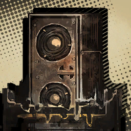

        ```
        Melted Machine: Alright, all... You hear me?
        เครื่องจักรที่ถูกละลาย: เอาล่ะ ทีนี้... ฮัลโหล ฮัลโหล ได้ยินไหม? 
        ```
        ```
        Melted Machine: I got pretty mad thinking you might have thought we ran off, so I'm sending you a message verbally.
        เครื่องจักรที่ถูกละลาย: ฉันหัวเสียมากเลยนะ พอคิดว่าพวกนายจะคิดว่าพวกเรา—วิ่งหนีหัวซุกหัวซุนออกมาเพราะสู้ไม่ได้ เพราะงั้นฉันก็เลยอยากบอกพวกนายด้วยตัวของฉันเองว่า
        ```
        ```
        Melted Machine: I'm about to tell you something real important, so listen up.
        เครื่องจักรที่ถูกละลาย: ฉันมีบางสิ่งที่สำคัญมากจะบอก และพวกนายเองก็ควรที่จะตั้งใจฟัง
        ```
        ```
        Melted Machine: ......
        เครื่องจักรที่ถูกละลาย: ......
        ```
        ```
        Melted Machine: A pause to rouse tension... Good.
        เครื่องจักรที่ถูกละลาย: ไม่มีไรหรอก แค่ทิ้งช่องไฟให้เครียดเล่นน่ะ... ดี
        ```

        ---

        

        ```
        Dante: <......>
        ดันเต้: <......>
        ```

        ---

        

        ```
        Melted Machine: It's that you are...
        เครื่องจักรที่ถูกละลาย: เรื่องที่ฉันจะบอกก็คือ...
        ```
        ```
        Melted Machine: You are a bunch of worthless worms.
        เครื่องจักรที่ถูกละลาย: พวกนายเป็นแค่หนอนโง่เง่าเตาตุ่นไร้ประโยชน์
        ```
        ```
        Melted Machine: Yeah, that's right. You're just worms!
        เครื่องจักรที่ถูกละลาย: ช่าย ใช่แล้ว พวกนายเป็นแค่หนอน!
        ```

        ---

        

        ```
        Gregor: Gimme a break. I was all ears for this load of nonsense.
        เกรกอร์: หะ อะไรวะเนี้ย ให้ฉันพังหน่อยไม่ได้หรือไง หูฉันมันรับเรื่อง ไร้สาระ/ปัญญาอ่อน มามากเกินพอแล้ว
        ```

        ---

        

        * เสียงในหัว
        
            ```
            Gregor approached the speaker with a grumble, scratching the back of his head.
            เกรกอร์เดินเข้าไปหาลำโพงพร้อมกับบ่นพึมพัม ในขณะที่มือเขากำลังเกาหัวหงิก ๆ อยู่ด้านหลัง
            ```

        ---

        

        ```
        Dante: <Wait, Gregor!>
        ดันเต้: <เดี๋ยว เกรกอร์!>
        ```

        * เสียงในหัว

            ```
            After playing the voice, the machine suddenly starts to heat up and inflate.
            หลังจากส่งเสียง จู่ ๆ เครื่องจักรนั้นก็เริ่มที่จะร้อนขึ้น และพองออกมา
            ```

        ---

        

        ```
        Faust: The machine is heating to unnatural degrees, its components expanding.
        เฟาสท์: เครื่องจักรนั้นกำลังร้อนขึ้นอย่างผิดวิสัย จากการที่ชิ้นส่วนของมันกำลังค่อย ๆ ขยายตัวจนผิดรูป 
        ```

        ---

        

        ```
        Niko: Oh my, it really is. That's a telltale sign of an imminent explosion.
        นิโกะ: เวรล่ะ เป็นงั้นจริงด้วย เป็นสัญญาณเตือนที่บอกว่า กำลังจะเกิดการระเบิดในไม่ช้า
        ```

        ---

        

        ```
        Dongrang: Indeed, and that means...
        ดงรัง: ใชเลยครับ และนั้นก็หมายความว่า...
        ```

        ---

        

        ```
        Heathcliff: Wait a moment! Get away from that damned machine!
        ฮิธคลิฟฟ์: รอก่อนสิวะ! ออกมาให้ห่างจากไอเครื่องเวรนั้นเดี๋ยวนี้! 
        ```

        ---

        

        * เสียงในหัว

            ```
            Heathcliff kicked Gregor away from the machine.
            ฮิธคลิฟฟ์แตะเกรกอร์ออกไปจากรัศมีของเครื่องจักร
            ``` 

        ---

        

        ```
        Dongrang: Hmm... They must've used what little time they had to place traps like this.
        ดงรัง: หืมม... พวกเขาคงจะใช้เวลาเตรียมการอันน้อยนิดที่มีอยู่ เพื่อวางกับดักนี้ไม่ผิดแน่
        ```
        ```
        Dongrang: Their dedication is admirable. I'm raring to see the mastermind behind this.
        ดงรัง: ถือว่าเป็นการอุทิศตัวที่น่าชื่นชมยิ่งนัก ฉันชักจะอยากรู้แล้วสิ ว่าใครเป็นผู้บงการอยู่เบื้องหลังเรื่องทั้งหมดนี้
        ```

        ---

        

        ```
        Dante: <Are all researchers like that? This really doesn't feel like the time for admirations.>
        ดันเต้: <คือพวกนักวิจัยเป็นแบบนี้กันหมดเลยหรอ? ไม่ใช่ว่านี้ไม่ใช่เวลามัวมาชื่นชมกับความพยายามของศัตรูหรือไง?>
        ```

        ---

        

        ```
        Faust: Such is our fate.
        เฟาสท์: เป็นโชคชะตาพวกเราน่ะค่ะ
        ```

    ---

    * **Episode: 13 | ตอนที่ 13<br>Location: LC Branch Interior | ภายในสาขาย่อยศูนย์วิจัยโลโบโตมี่** 

        

        ```
        Sinclair: Will this... blow up once it stops working like the last one?
        ซินแคร์: เจ้านี้... จะระเบิดอีกรอบเหมือนเครื่องที่ไม่ทำงานก่อนหน้านี้ไหมครับ?
        ```

        --- 

        

        * เสียงในหัว
        
            ```
            As we suspected, the halted machine began to play an ominous noise.
            เป็นไปตามข้อสันนิษฐานที่เราสงสัยไม่มีผิด ที่ไม่กี่วินาทีต่อมา เครื่องจักรที่ไม่ทำงานเมื่อครู่ กลับส่งเสียงเค้าลางไม่ดีออกมา 
            ```

        ---

        

        ```
        Melted Machine: Alright, so, this is the second time you killed my machines, right?
        เครื่องจักรที่ถูกละลาย: เอาล่ะ นี้เป็นครั้งที่สองแล้วใช่ไหมที่พวกเธอ ฆ่าเครื่องจักรตัวน้อย ๆ ของฉัน? 
        ```
        ```
        Melted Machine: Let's see...
        เครื่องจักรที่ถูกละลาย: ไหนดูสิ...
        ```
        ```
        Melted Machine: You're a bunch of roaches that do nothing other than just crawl on the floor.
        เครื่องจักรที่ถูกละลาย: อ้า มีแต่พวกแมลงสาบสกปรกโสโครก ที่ทำอะไรไม่ได้นอกจากคลานอยู่บนพื้น และกินเศษอาหาร
        ```

        ---

        

        ```
        Rodion: It's okay, it's okay. Don't let it let you down, Greg...
        โรเดียน: อู้ยยย แรงนะเนี้ย ไม่เป็นไรนะ ไม่เป็นไร อย่าปล่อยให้มันยั่วโมโหนายนะ เกรก...
        ```

        ---

        

        ```
        Gregor: ...I wasn't feeling anything.
        เกรกอร์: ...ฉันไม่รู้สึกอะไรทั้งนั้นนั้นแหละ 
        ```

        ---

        

        ```
        Melted Machine: So... go on and keep crawling like the bugs you are.
        เครื่องจักรที่ถูกละลาย: เพราะงั้น... ก็เอาเลย คลานต่อไปเหมือนแมลงที่พวกแกเป็น
        ```
        ```
        Melted Machine: Why bother looking up when you'll be spending all your lives on that flat dimension of the surface, am I right?
        เครื่องจักรที่ถูกละลาย: ไม่ต้องมองขึ้นมา เพราะพวกแกก็ทำได้แต่ใช้ชีวิต บนมิติแบน ๆ ของพื้นผิวนี้เนอะ?
        ```

        ---

        

        ```
        Meursault: I understand now. Once the machines stop functioning, they play a prerecorded voice clip, then explode seconds after.
        เมอร์โซลท์: ผมเข้าใจแล้วครับ เมื่อเครื่องจักรนั้นหยุดทำงานไป พวกมันจะเล่นคลิปเสียง ที่ถูกบันทึกไว้ก่อนหน้า ก่อนที่ระเบิดตัวเองหลังจากครบกำหนด 
        ```
        ```
        Meursault: It is unclear what purpose they are meant to serve, but all the machines are equipped with the same mechanisms.
        เมอร์โซลท์: แม้ว่าวัตถุประสงค์ของการทำแบบนี้จะยังคงเป็นปริศนาแต่—เครื่องจักรทั้งหมดก็ดูเหมือนจะถูกติดตั้งด้วยกลไกการทำงานแบบเดียวกัน
        ```

        ---

        

        ```
        Gregor: Pre...recorded? I didn't see that one coming...
        เกรกอร์: บันทึก... ไว้ก่อนหน้า? ฉันไม่เห็นจะรู้เรื่องนั้นเลย...
        ```

        ---

        

        ```
        Heathcliff: Hah, everyone's making fun of you, eh, buggy bloke.
        ฮิธคลิฟฟ์: ฮา คิดว่าทุกคนจงใจล้อแกอยู่หรือไง เออ พ่อแมลงขี้น้อยใจเอ้ย
        ```

        ---

        

        ```
        Gregor: ...It sure is baffling how the whole world is bending over backward to mock me...
        เกรกอร์: ...หยุดเลยนะ ก็มันชวนงงนี้นา ที่จู่ ๆ ทั้งโลกก็รวมหัวกันเพื่อเยาะเย้ยฉัน...
        ```

        ---

        

        ```
        Heathcliff: Pah, that's a tame reaction... Hm? O-Oi, what's wrong with you now?
        ฮิธคลิฟฟ์: อะไรกัน ตอบสนองได้เรียบง่ายไปไหมเนี้ย... หืม? อ-โอ่ย ทีนี้เป็นอะไรไปอีกเล่า? 
        ```

        ---

        

        ```
        Ishmael: Hrk...
        อิชมาเอล: เฮือก...
        ```

        ---

        

        ```
        Dante: <What's the matter, Ishmael? Are you alright?>
        ดันเต้: <เป็นอะไรหรือเปล่าอิชมาเอล? เธอโอเคไหม?>
        ```

        ---

        

        ```
        Ishmael: Yes... I'm just feeling a little queasy...
        ใช่ฉันโอเค... ก็แค่รู้สึกคลื่นไส้นิดหน่อยก็เท่านั้น...
        ```
        ```
        Ishmael: You don't have to mind me. I'm fine now.
        อิชมาเอล: นายไม่ต้องเป็นห่วงฉันหรอก ฉันสบายดี/ฉันโอเคแล้ว
        ```

        ---

        

        ```
        Hong Lu: There's something I've been meaning to ask, what kind of organization is this... technology liberation alliance?
        ฮงหลู่: คือว่า มีบางอย่างที่ผมสงสัยแล้วอยากถามมาได้สักพักใหญ่แล้ว ผมอยากรู้น่ะ ว่านี้องค์กรแบบไหนกันหรอครับ... เจ้าองค์กรที่เรียกตัวเองว่า "คณะพันธมิตรปลดแอกเทคโนโลยี"
        ```

        ---

        

        ```
        Outis: Why do you bother asking such questions? All we need to know about them is that it's a terrorist organization with a hollow name; their values are irrelevant to us.
        เอาทิส: แล้วอะไรดลใจให้นายถามคำถามอะไรแบบนี้ล่ะ? อย่างเดียวที่พวกเราจำเป็นต้องรู้ก็คือ พวกมันเป็นองค์กรก่อการร้ายที่มีชื่อเห่ย ๆ ไร้ราคา; และคุณค่าของพวกมันก็ไม่ใช่ธุระกงการอะไรของพวกเราด้วย
        ```

        ---

        

        ```
        Hong Lu: Haha, you never know what use the information might have, Outis.
        ฮงหลู่: ฮาฮา ก็แบบ เราไม่มีวันรู้นี้ครับว่าข้อมูลอะไรบ้างที่เราอาจจำเป็นต้องใช้ในอนาคต
        ```

        ---

        

        ```
        Samjo: I know little about them myself. I did hear that someone who used to work in a K Corp. laboratory is now one of the organization's core members. Though, I don't have the details as this took place before I joined the firm.
        แซมโจ: อันที่จริงผมก็พอรู้อยู่บ้างนะครับ ผมได้ยินข่าวลือมา ว่าหนึ่งในสมาชิกหลักคนหนึ่งขององค์กร ก็เคยเป็นคนที่ทำงานในแลปของเคคอร์ปมาก่อน ถึงอย่างนั้นผม—ก็ไม่ได้รู้รายละเอียดอะไรมากนัก เพราะมันเป็นเรื่องที่เกิดก่อนที่ผมจะเข้ามาในบริษัทนี้
        ```
        ```
        Samjo: She was an outstanding researcher who was once awarded the best employee award, much like Mr. Dongrang is now.
        แซมโจ: แต่ถ้าจำไม่ผิด เหมือนว่าเธอจะเป็นนักวิจัยที่โดดเด่น ผู้ซึ่งได้รับรางวัลพนักงานยอดเยี่ยมเหนือใคร—เหมือนกับคุณดงรัง
        ```

        ---

        

        ```
        Shrenne: What? How do you know that?
        ชเรนน์: หะ? นี้นายรู้เรื่องนั้นได้ยังไง? 
        ```

        ---

        

        ```
        Samjo: I saw her name on one of the plaques in the trophy room. Wouldn't you say it's mandatory for someone of my occupation to remember all the names there?
        แซมโจ: พอดีว่าผมบังเอิญไปเจอชื่อของเธอ ที่ถูกแกะสลักบนป้าย ในห้องเก็บรวบรวมถ้วยรางวัลมาน่ะครับ ไม่ใช่ว่าคุณเองก็เคยบอกผมหรอ ว่ามันเป็นเรื่องจำเป็น ในฐานะเลขาที่เราต้องจดจำชื่อของทุกคนให้ได้?
        ```

        ---

        

        ```
        Shrenne: Why do you keep peeking in there, anyway...?
        ชเรนน์: แล้วทำไม นายถึงเข้าไปดูที่นั้นด้วยล่ะ...?
        ```

        ---

        

        ```
        Ishmael: ...What could be the reason a highly praised employee decided to join terrorists...
        อิชมาเอล: ...เหตุผลคืออะไร ที่ทำให้... พนักงานดีเด่นผู้เป็นหน้าเป็นตาอย่างเธอ ถึงตัดสินใจที่จะเข้าร่วมกับผู้การร้าย...
        ```

        ---

        

        ```
        Shrenne: ......
        ชเรนน์: ......
        ```

        ---

        

        ```
        Dongrang: I believe you saw her once earlier. She was enthusiastically destroying my lab.
        ดงรัง: ผมเชื่อว่าพวกคุณเอง ก็น่าจะได้พบเธอไปแล้วก่อนหน้านี้ ในขณะที่เธอกำลังทำลายข้าวของในแลปของผม ด้วยความคลั่งไคล้/อย่างมีความสุข
        ```
        ```
        Dongrang: Right around when Shrenne and I joined the company, she was... well, rather famous within the firm.
        ดงรัง: ประมาณช่วงที่ชเรนน์กับผมพึ่งเข้ามาในบริษัทนี้เป็นครั้งแรก ในตอนนั้นเธอ... เป็นคนที่ค่อนข้างมีชื่อเสียงมากในบริษัท
        ```
        ```
        Dongrang: I heard rumors that she had wanted to test the limits of K Corp's technologies.
        ดงรัง: และผมก็ได้ยินข่าวลือที่ว่า เธออยากที่จะทดสอบขีดจำกัดของเทคโลยีเคคอร์ปว่าจะไปได้ไกลแค่ไหน
        ```
        ```
        Dongrang: Then one day... rumors about her leaving the laboratory spread.
        ดงรัง: ก่อนที่วันหนึ่ง... จะมีข่าวลือ เรื่องที่เธอจะออกจากแลปแพร์กระจายออกไปเป็นวงกว้าง
        ```
        ```
        Dongrang: Saying that this is where she ended up.
        ดงรัง: บอกว่านี้เป็นจุดจบของเธอในฐานะนักวิจัย
        ```

    ---

    * **Episode: 14 | ตอนที่ 14<br>Location: LC Branch Interior | ภายในสาขาย่อยศูนย์วิจัยโลโบโตมี่** 

        

        ```
        Dongrang: Ah, this corridor must be the last. Once we're past here, we'll reach the edge of the facility.
        ดงรัง: อา นี้น่าจะเป็นทางเดินสุดท้ายแล้ว หลังจากที่เราผ่านหัวมุมตรงนั้นไป ก็จะถึงส่วนสุดขอบของศูนย์วิจัยที่เรากำลังตามหา
        ```
        ```
        Dongrang: After I retrieve my precious items from there, I'll give you the ownership of the Golden Bough as promised.
        ดงรัง: และหลังจากที่เราเก็บกู้ข้าวของแสนล้ำค่าของผมได้สำเร็จจากที่นั้น ผมก็จะส่งมอบสิทธิ์ในการถือครองกิ่งทองให้กับพวกคุณตามที่ได้สัญญาเอาไว้
        ```

        ---

        

        ```
        Rodion: Feels like this is gonna end on a rotten note, you gonna be okay with that? Those terrorists really must've run off, seeing how none of 'em showed up...
        โรเดียน: ฉันมีลางสังหรว่าเรื่องนี้อาจจบลงเร็วกว่าที่คิดแฮะ เราอาจไปเจอโน้ตเน่า ๆ ถูกทิ้งร้าง แล้วก็ไม่เจอใครเลย ถ้าเป็นแบบนั้นจริง ๆ คุณจะโอเคใช่ม้า? บางที พวกผู้ก่อการร้ายพวกนั้นอาจจะหนีไปแล้วก็ได้ จากบรรยากาศไร้วี่แววว่าจะมีใครโผล่มา...
        ```

        ---

        

        ```
        Dongrang: It was part of the contract to reclaim the laboratory.
        ดงรัง: แน่นอนครับ ก็ในเมื่อนั้นเป็นส่วนหนึ่งในสัญญญาที่เราตกลงกันไว้แล้ว
        ```

        ---

        

        ```
        Samjo: That's why I kept telling you, Mr. Dongrang. When you draft a contract, you have to be meticulous and calculating, and write it in a way that favors us.
        แซมโจ: ผมถึงบอกไงครับคุณดงรัง ว่าเวลาจะร่างสัญญาอะไร คุณต้องคิดให้ละเอียดถี่ถ้วนอยู่เสมอ เพื่อที่มันจะได้เอื้อผลประโยชน์กับฝ่ายเราให้ได้มากที่สุด
        ```

        ---

        

        ```
        Dante: <...Let's get going.>
        ดันเต้: <...ไงเราก็ไปกันเถอะ>
        ```

        * เสียงในหัว

            ```
            Fortunately, I didn't see any killing machines here.
            นับเป็นโชค ที่ฉันไม่เห็นเครื่องจักรสังหาสักตัวที่อยู่ที่นี้เลย
            ```
            ```
            However, a couple of unwelcome figures appeared in front of us.
            ถึงอย่างนั้นสองร่างของใครบางคนกลับ—ปรากฎอยู่ตรงหน้าพวกเราอย่างไม่คาดคิด
            ```
        
        ---

        

        ```
        Outis: Be on guard, Executive Manager! Someone is ahead of us.
        เอาทิส: ระวังตัวด้วยค่ะ ท่านผู้จัดการสูงสุด! มีใครบางคนอยู่ข้างหน้าเรา
        ```

        ---

        

        ```
        Dante: <Yeah, but they aren't holding any weapons...>
        ดันเต้: <อาา—ใช่แต่พวกเขาไม่ได้ถืออาวุธอะไรเลยนะ...>
        ```

        ---

        

        ```
        Outis: They may be unarmed, but you are an incredibly weak and fragile civilian, Executive Manager!
        เอาทิส: ถึงแม้พวกเขาจะไม่ได้ติดอาวุธ แต่ท่านก็อ่อนแอ และเปราะบางมากไม่ต่างอะไรกับประชาชนทั่วไปค่ะ ท่านผู้จัดการ!
        ```

        ---

        

        ```
        Dante: <...Um, thanks? Outis?>
        ดันเต้: <...เออ ขอบใจนะ? เอาทิส?>
        ```

        ---

        

        ```
        ???: Can't you count? You clearly outnumber us by a huge margin. Don't be a baby...
        บุคคลปริศนา: พวกแกนับเลขไม่เป็นหรือไง? ว่าตัวเองมีจำนวนเหนือกว่าพวกเรามากขนาดไหน อย่าทำตัวเป็นเด็กหน่อยเลย...
        ```
        ```
        ???: Here at last, worms?
        บุคคลปริศนา: ในที่สุดก็มาถึงสักทีนะเจ้าพวกหนอนแมลง?
        ```

        ---

        

        ```
        Sinclair: It's the same voice that played from the machines. And... it's the same face we saw earlier.
        ซินแคร์: นี้มันเสียงเดียวกัน กับที่เราได้ยินจากเครื่องจักร แล้วก็... เป็นใบหน้าเดียวกัน กับที่เราเคยเห็นก่อนหน้านี้
        ```

        ---

        

        ```
        Dongrang: Where are your other members, Senior Researcher Ran?
        ดงรัง: สมาชิกคนอื่นไปไหนแล้วล่ะครับ คุณ(.ซีเนียร์)นักวิจัยผู้ อาวุโส/รุ่นพี่ รัน?
        ```

        ---

        

        ```
        Ran: ...You managed to bring more help in that mess, I see.
        รัน: ...ดูเหมือนว่าเจ้าหนูอย่างแก—จะตามคนมาช่วยเช็ดขี้เช็ดเยี้ยวมากขึ้นกว่ารอบที่แล้วนะเนี้ย
        ```
        ```
        Ran: And put away that "senior" crap, we haven't even known each other for long. Don't you see what's going on?
        รัน: แล้วก็—ช่วยหยุดพูด ไอคำว่า "ผู้อาวุโส" เฮ็งซวยอะไรนั้นสักทีเถอะ เราไม่ได้สนิทชิดเชื้อกัน และเด็กน้อยอย่างแก—ก็ยังดูไม่ออกด้วยซ้ำว่ามันกำลังเกิดอะไรขึ้น?
        ```
        ```
        Ran: They've all evacuated. And here I am... buying time for them.
        รัน: พวกเขาทั้งหมดหนีอพยพไปกันหมดแล้ว—และฉันเองก็อยู่ที่นี้... เพื่อที่จะได้ซื้อเวลาให้พวกเขา
        ```

        ---

        

        ```
        Dongrang: That's interesting... We thought we stormed in unexpectedly, yet you knew it in advance and escaped?
        ดงรัง: นับเป็นเรื่องที่น่าสนใจมากเลยนะครับ... ทั้ง ๆ ที่พวกเราอุตสาห์เข้าโจมตีอย่างไม่เปิดโอกาศให้ตั้งตัวแล้วแท้ ๆ แต่ถึงอย่างนั้นคุณ—ก็กลับรู้ตัวก่อนหน้าและชิงหนีไปก่อนที่พวกเราจะได้ทำอะไร?
        ```

        ---

        

        ```
        Ran: 'Cause you're worms. Look at you, getting all cocky after receiving the best employee award...
        รัน: ก็เพราะพวกแกเป็นได้แค่หนอนแมลงไง ดูตัวเองเข้าสิ้ เด็กน้อยที่ทำตัวอวดดีหลังจากพึ่งได้รางวัลพนักงานดีเด่นเป็นครั้งแรก...
        ```
        ```
        Ran: Raiding here, dare trying to catch us.
        รัน: คงได้ใจมากเลยสิท่า ที่คิดจะมาบุกถึงถ้ำพวกเราแบบนี้
        ```

        ---

        

        ```
        Heathcliff: You've got a big mouth. You think you're better than us?
        ฮิธคลิฟฟ์: ปากแจ๋วใช่ย่อย แต่แกคิดว่าตัวเองเหนือกว่าพวกเราหรือไง?
        ```
        ```
        Heathcliff: You're outnumbered like you said. That noggin of yours probably knows you'd better surrender, eh?
        ฮิธคลิฟฟ์: ทั้ง ๆ ที่แกก็กำลังเสียเปรียบเรื่องจำนวนอย่างที่แกพูด ถ้าแกมีมันสมอง—ก็คงรู้ตัวดี ว่าสิ่งเดียวที่ตัวเองทำได้ในตอนนี้ ก็มีแต่จำนนก็เท่านั้น?  
        ```

        ---

        

        ```
        Ran: ...Let's say I do. It's clear what you'll do with me.
        รัน: ...ก็สมมติว่าถ้าฉันทำ มันก็แน่นอนอยู่แล้วว่พวกแก
        ```
        ```
        Ran: You'll neutralize me and keep me barely alive...
        รัน: จะปราบปรามฉัน จนปางตายแล้วก็จับกุมฉันทั้งเป็น...
        ```
        ```
        Ran: "Curing" me with your flaunted regeneration ampules...
        รัน: "รักษา" ฉันด้วยยาสุดโม้เหม็นของแก...
        ```
        ```
        Ran: Rinse and repeat, until you get the answers you want.
        รัน: ซ้ำแล้วซ้ำเล่า จนกว่าพวกแกจะได้คำตอบที่ตัวเองต้องการ
        ```

        ---

        

        ```
        Dongrang: Sounds like a problem that can be prevented by giving us the answers right away. Am I asking too much?
        ดงรัง: ฟังดูเป็นปัญหาที่—สามารถแก้ได้ง่าย ๆ ด้วยการที่คุณบอกคำตอบกับพวกเรามาตรง ๆ ก็ได้ไม่ใช่หรอครับ หรือนี้ผมขอมากเกินไป?
        ```

        ---

        

        ```
        Ran: 'Course you are. Unlike you...
        รัน: ก็แหงสิ พวกเราไม่ได้เป็นเหมือนแกเลยสักนิด...
        ```
        ```
        Ran: We aren't planning to live like roaches that feed on whatever is provided from above.
        รัน: พวกเราไม่เคยคิด—ที่จะใช้ชีวิตเหมือนแมลงสาบ—ที่ต้องประทังชีวิตด้วยการกินทุกสิ่งทุกอย่างที่ตกลงมาจาก เบื้องบน/ด้านบน
        ```

        ---

        

        ```
        Gregor: ...This is really getting on my nerves.
        เกรกอร์: ...เอาล่ะ ฉันว่าฉันชักจะเริ่มฉุนแล้วนะ
        ```

        ---

        

        ```
        Ran: Ah, whatever~ I've had enough of toying with you.
        รัน: อ้า ไงก็เถอะ~ ฉันเล่นสนุกกับแกมามากพอแล้ว
        ```

        ---

        

        ```
        Samjo: What are you trying to...
        แซมโจ: คุณกำลังพยายามจะทำอะไร...
        ```

        ---

        

        ```
        Ran: That's right, show your curiosity only to what's happening immediately before your eyes. That's how a researcher should be.
        รัน: ใช่แล้ว จงแสดงความสงสัยใคร่รู้ออกมา กับสิ่ง—ที่กำลังจะเกิดขึ้นต่อหน้าต่อตาไม่อีกไม่ช้า นั้นแหละ คือสิ่งที่นักวิจัยควรเป็น
        ```

        ---

        

        ```
        Shrenne: Ran...
        ชเรนน์: ท่านรัน...
        ```

        ---

        * เสียงในหัว

            ```
            With an ear-piercing noise, the building was engulfed in an explosion.
            ด้วยเสียงแหลมแทงแก้วหู อาคาร—จึงถูกปิดตายพร้อมแรงระเบิด
            ```
            ```
            All that remains is a charred stain.
            สิ่งเดียวที่เหลืออยู่ ก็มีแต่คราบไหม้เกรียม
            ```

        ---

        

        ```
        Dante: <Ngh... That hurt a lot.>
        ดันเต้: <เฮือก... เมื่อกี้เจ็บหูชะมัด>
        ```

        ---

        

        ```
        Samjo: Are you alright, Mr. Dongrang?
        แซมโจ: เป็นอะไรหรือเปล่าครับ คุณดงรัง? 
        ```

        ---

        

        ```
        Dongrang: I'm fine... Someone in Dante's party pushed me away as soon as the blast was heard. You know, the quiet fellow with intimidating eyes.
        ดงรัง: ไม่ ฉันไม่เป็นไร... มีใครสักคนในของกลุุ่มดันเต้ผลักฉันออกมาทันเวลา ในตอนที่เกิดการระเบิด แบบว่า เขาคนนั้นน่ะ ที่ดูเงียบ ๆ แล้วก็มีดวงตาที่น่าเกรงขาม
        ```

        ---

        

        ```
        Samjo: I was going to do the same, but I was standing too far away.
        แซมโจ: ฉันเองก็ว่าจะทำแบบนั้นแต่—พอดีว่าผมยืนอยู่ไกลเกินไปน่ะครับ
        ```

        ---

        

        ```
        Niko: Whew, that was close.
        นิโกะ: หวิ้ว เกือบไปแล้ว
        ```

        ---

        

        * เสียงในหัว

            ```
            After taking the impact for others, Don Quixote and Meursault had been flung all the way to columns supporting the building, their backbones fully exposed.
            หลังจากที่รับแรงระเบิดแทนคนอื่น ๆ ดอนกิโฆเต้กับเมอร์โซลท์ก็ถูกเหวี่ยงไปยังเสาเข็มที่กำลังค้ำจุนอาคาร ก่อนที่จะกระแทก และทำให้กระดูกสันหลังของพวกเขาทะลุออกมา
            ```
            ```
            ...Don Quixote in particular was impaled on a pillar.
            ...โดยเฉพาะดอนกิโฆเต้—ที่ถูกเสียบทะลุเสาต้นหนึ่ง
            ```

        ---

        

        ```
        Dongrang: It must be the faith that they will come back to life at any time that prompted them to jump into danger without hesitation.
        ดงรัง: มันอาจเป็นเพราะโชคชะตาของพวกเขาที่—จะกลับมามีชีวิตตอนไหนก็ได้ ที่เป็นเชื้อไฟ—ให้พวกเขาตะโจนใส่ภัยอันตรายทั้งปวงโดยไม่ลังเล
        ```
        ```
        Dongrang: Not out of any sort of friendship or affinity... Isn't that right?
        ดงรัง: ผมอยากรู้จัง ว่าทั้งหมดนี้ คงไม่ใช่เพราะความเป็นเพื่อน หรือ ความรู้สึกผูกพันต่อกัน... ใช่ไหมครับ?
        ```

        ---

        * เสียงในหัว

            ```
            Don Quixote couldn't give any answers, whether due to death or the pointed edge stabbing through her mouth.
            ดอนกิโฆเต้ไม่ได้ให้คำตอบ ไม่ว่าจะเพราะเธอตายไปแล้ว หรือ แหง่งแหลมที่แทงทะลุปากของเธอ  
            ```

        ---

        

        ```
        Meursault: ...Cough.
        เมอร์โซลท์: ...ค๊อก
        ```

        ---

        

        ```
        Dante: <Meursault? You were alive...?>
        ดันเต้: <เมอร์โซลท์? นายยังไม่ตาย...?>
        ```

        ---

        

        ```
        Meursault: ...It was my directive to protect the manager and see that the company's mission is accomplished.
        เมอร์โซลท์: ...มันเป็นหน้าที่ของผมที่ต้องปกป้องผู้จัดการ และทำให้แน่ใจว่า... ภารกิจของบริษัท จะบรรลุผลสำเร็จ—ได้... ตามที่ตั้งเป้าเอาไว้
        ```

        ---

        

        ```
        Dongrang: That... must be it, yes.
        ดงรัง: ถ้างั้น... ก็แปลว่าใช่สินะครับ
        ```
        ```
        Dongrang: How convenient. You can recover your body without using regeneration ampules.
        ดงรัง: ชั่งเป็นอะไรที่สะดวกสบายดีแบบนี้—ที่พวกคุณสามารถรักษาบาดแผลบนร่างกายได้ โดยที่ไม่ต้องใช้ยาฟื้นฟูเลยสัก หยด/โดส เดียว
        ```

        ---

        

        ```
        Dante: <......>
        ดันเต้: <......>
        ```
        ```
        Dante: <I dunno, the ampule looks handier...>
        ดันเต้: <ไม่รู้สิ้ ฉันว่า มียาก็น่าจะดีกว่านะ...>
        ```

        ---

        

        ```
        Samjo: Right, is Ms. Shrenne alright? And the other Fixers?
        แซมโจ: ว่าแต่ คุณชเรนน์ปลอดภัยดีใช่ไหมครับ? รวมถึงฟิกเตอร์คนอื่น ๆ ด้วย?
        ```

        ---

        

        ```
        Niko: We're perfectly sound.
        นิโกะ: พวกเราสบายดีครับ
        ```

        ---

        

        ```
        Shrenne: Your group blocked the blast for us, so we turned out fine.
        ชเรนน์: ต้องขอบคุณกลุ่มของพวกคุณเลยนะคะ—ที่บังแรงระเบิดให้กับพวกเรา พวกเราถึงไม่เป็นไร
        ```
        ```
        Shrenne: That's... why you haven't been taking the ampules. That clock had special powers.
        ชเรนน์: งี้เองสินะคะ... เหตุผล—ที่พวกคุณไม่ได้เอายาติดตัวไปเลยสักขวด ก็เพราะว่านาฬิกานั้นมีพลังวิเศษ  
        ```

        ---

        

        ```
        Samjo: Indeed. After all, I recruited them after thorough screening and testing.
        แซมโจ: ใช่เลยครับ เพราะยังไงผมเอง—ก็เป็นแมวมองที่เจอแล้วเกณฑ์พวกเขามา ผ่านกระบวนการการคัดกรอง และทดสอบอย่างเคร่งครัด
        ```

        ---

        

        ```
        Shrenne: I see... Well, darn... All the ampules I brought... are useless now.
        ชเรนน์: อ้อ งั้นหรอ... เยี่ยมจริง ๆ ไอบ้าเอ้ย... งั้นยาที่ฉันอุตสาห์เตรียมมา... ก็ไร้ค่าหมดเลยน่ะสิ
        ```

        ---

        

        * เสียงในหัว

            ```
            For some reason, Shrenne lets out a defeated laugh and drops the ampules in her bag to the floor.
            ด้วยเหตุผลบางอย่าง ชเรนน์ถอนหายใจออกมาด้วยความรู้สึกราวกับว่าพ่ายแพ้ และปล่อยยาฟื้นฟูที่อยู่ในกระเป๋าของเธอลงบนพื้น
            ```
            ```
            It's true... For them—looking at it from a perspective that excludes me—this is certainly a convenient power.
            มันก็จริงอยู่... ที่สำหรับพวกเขาแล้ว—การที่ได้มองดูจากมุมมองที่ไม่รวมฉัน—นี้น่ะ...คงดูเป็นพลังที่ดูสะดวกสบายมากเลยสินะ
            ```
            ```
            Fatal consequences can be reversed, and the only price is me having to bear the pain.
            ความผิดพลาดร้ายแรงสามารถที่จะได้รับการแก้ไข้ และราคาเพียงอย่างเดียวที่ต้องจ่าย ก็มีแต่ฉัน—ที่ต้องทนทุกข์ทรมาณแสนสาหัสจนกว่าจะผ่านไป
            ```
            ```
            No, wait.
            ไม่สิ เดี๋ยวก่อน
            ```
            ```
            Is this really fine?
            นี้มันโอเคแล้วจริง ๆ หรอ?/มันจะมีแค่นั้นจริง ๆ หรอ? 
            ```
            ```
            And where does this all this time to rewind come from?
            แล้วไอพลังพวกนี้ ที่สามารถกลับเวลาได้นี้มาจากไหน?
            ```

        ---

        

        ```
        Heathcliff: Clock...face... Stop...dawdling about... That yellow-haired lass is dying...
        ฮิธคลิฟฟ์: ไอหน้า... นาฬิกา... หยุด...เสียเวลา... กับยัยเตี้ยหัวเหลืองนั้นที่กำลังตายสักที... 
        ```

        ---

        

        * เสียงในหัว

            ```
            Thoroughly ravaged by the blast, Heathcliff pointed at Don Quixote.
            ถึงแม้ว่า—จะถูกทำลายด้วยแรงระเบิดจนสภาพยับเยินมากแค่ไหน ฮิธคลิฟฟ์กลับยังมีแรง—ที่จะชี้ไปหาดอนกิโฆเต้ทีแน่นิ่ง
            ```

        ---

        

        ```
        Heathcliff: Hurry up and turn it... This... hurts an awful lot...
        ฮิธคลิฟฟ์: เอ้ย...! รีบเร่งมือแล้วก็—หมุนกลับสักทีสิ... นี้มันเจ็บ... มากเลยนะเว้ย...
        ```

        ---

        

        ```
        Dante: <...On it.>
        ดันเต้: <...ไปเดี๋ยวนี้ล่ะ>
        ```

    ---

    * **Episode: 15 | ตอนที่ 15<br>Location: LC Branch Interior | ภายในสาขาย่อยศูนย์วิจัยโลโบโตมี่** 

        


        ```
        Dongrang: Shrenne, you've got shrapnel wounds, are you sure you don't want to use an ampule?
        ดงรัง: ชเรนน์ เธอบาดเจ็บจากสะเก็ดระเบิดนี้ แน่ใจแล้วหรอว่าเธอไม่ต้องการยานี้?
        ```

        ---

        

        ```
        Shrenne: I'm fine...
        ชเรนน์: ฉันไม่เป็นไร...
        ```

        ---

        

        ```
        Gregor: That Shrenne fella... She's looking kinda blank-faced, is she okay?
        เกรกอร์: ยัยเกลอชเรนน์คนนั้น... สีหน้าไม่สู้ดีเลย นี้เธอโอเคจริง ๆ หรือเปล่า?
        ```
        ```
        Gregor: Blank-faced... Hah, of course not. She couldn't be so carefree.
        เกรกอร์: สีหน้าไม่สู้ดี... ฮา แน่นอนว่ายังไงก็ไม่ คนอย่างเธอคงไม่ได้ใจเย็นถึงขนาดนั้น
        ```
        
        ---

        

        ```
        Outis: ......
        เอาทิส: ......
        ```
        ```
        Outis: This makes it evident.
        เอาทิส: เท่านี้ก็ชัดแล้ว
        ```
        ```
        Outis: The terrorists long since made their leave. All that's left were bloodthirsty murderers hellbent on killing us.
        เอาทิส: ว่าพวกผู้ก่อการร้ายพวกนั้นได้ออกไปจากที่นี้ก่อนเราได้พักใหญ่ และปล่อยให้พวกเราต้องเผชิญหน้า กับไอพวกหุ่นยนต์คลั่งสังหารโหดพวกนี้ที่อยากจะฆ่าเราใจจะขาด
        ```
        ```
        Outis: I've made my judgement. Hey, what do you think?
        เอาทิส: ฉันคิดแบบนี้ แล้วนายล่ะคิดว่าไง? 
        ```

        ---

        

        * เสียงในหัว

            ```
            Outis nudged her head at Meursault.
            เอาทิสเงยหน้ามองไปยังเมอร์โซลท์
            ```

        ---

        

        ```
        Meursault: I agree with it.
        เมอร์โซลท์: ผมเห็นด้วยครับ
        ```

        ---

        

        ```
        Sinclair: Wha, what are you two talking about?
        ซินแคร์: อา...? ที่ทั้งสองพูดว่าพักใหญ่นี้ หมายความว่าไงหรอครับ? 
        ```

        ---

        

        ```
        Meursault: There's a traitor in our ranks. No doubt remains in the matter.
        เมอร์โซลท์: มีคนทรยศ—ในหมู่พวกเราอย่างไม่ต้องสงสัย
        ```
        ```
        Meursault: It's thanks to this spy that our course and plans were leaked from the moment we departed.
        เมอร์โซลท์: และเพราะสปายคนนั้นเอง แผนการที่ถูกวางหมากมาตั้งแต่แรกก็เลยรั่วไหล ตั้งแต่วินาทีที่เราออกมา
        ```
        ```
        Meursault: To prevent further damage, it is right to dispose of them here and now.
        เมอร์โซลท์: เพราะงั้นเอง เพื่อที่เป็นการหลีกเลี่ยงความเสียหายที่เกิดไม่ให้บานปลายไปมากกว่านี้ จึงนับเป็นการดี—ที่เรา จะหาตัวมัน และตัดไฟตั้งต้นลม
        ```

        ---

        

        * เสียงในหัว

            ```
            Traitor.
            คนทรยศ
            ```
            ```
            I blankly watched as he brought up a concept foreign to me.
            ฉันมองเขา ด้วยแววตาที่ว่างเปล่าให้กับแนวคิดที่ฟังดูหลุดโลกสำหรับฉัน
            ```

        ---

        
        
        ```
        Outis: As it's unlikely to be one of us, the rational course of action is to suspect your institute's lackeys.
        เอาทิส: และด้วยความเป็นไปได้ยากที่มันจะเป็นพวกเรา เพราะงั้นการกระทำที่สมเหตุผล ภายใต้สถานการณ์ปัจจุบันก็คือ การที่เราต้องสังสัยลูกน้องของพวกคุณเหล่านักวิจัย
        ```
        ```
        Outis: This mission must be abandoned, Executive Manager. To allow ourselves to be involved in this nonsense is...
        เอาทิส: ภารกิจนี้ควรถูกยกเลิกค่ะ ท่านผู้จัดการสูงสุด มันไม่คุ้มเสียเอาซะเลย ที่เราต้องมาพัวผัน—กับเรื่องสาระอะไรแบบนี้...
        ```

        ---

        

        ```
        Samjo: I am repulsed by your accusation. Are you seriously suspecting us? I can assure you that we trust each other better than you people who haven't even been in the same firm for a year...
        แซมโจ: 
        ```
        
        ---

        

        * เสียงในหัว

            ```
            Samjo argued, flashes of light furiously bouncing off his glasses.
            ```

        ---

        ```
        Dongrang: No, Samjo. Their hypothesis sounds plausible. I would've said the same.
        ```

        ---

        ```
        Samjo: ......
        ```

        ---

        ```
        Dongrang: You have something to say, don't you?
        ```

        ---

        ```
        Samjo: Mr. Dongrang...
        ```

        ---

        ```
        Outis: That group of Fixers haven't used regeneration ampules a single time since they came in here.
        ```
        ```
        Outis: Any sane combatant would kill to have those.
        ```

        ---

        ```
        Meursault: There is one more thing.
        ```
        ```
        Meursault: When we encountered Ran...
        ```
        ```
        Meursault: They were distancing themselves from her in advance. The only explanation is that they knew there would be an explosion.
        ```

        ---

        ```
        Niko: Oh, bother... Why not consider the possibility that my intuition is just that keen?
        ```
        ```
        Niko: What if we weren't using the ampules because these buddies and I are built healthy?
        ```

        ---

        ```
        Dongrang: Hm... I've brought a truth tablet just in case. I'll believe you if you testify the same after taking it.
        ```

        ---

        ```
        Niko: Truth tablet? That red thing? How can I take that suspicious-looking drug...?
        ```

        ---

        ```
        Dongrang: Sorry, did you have a choice here? How strange, if I were you, I would take the tablet... or make more desperate excuses.
        ```
        ```
        Dongrang: You're so gladly squandering your chances to clear yourselves of suspicion, it's almost like you're asking to be killed.
        ```
        ```
        Dongrang: ...Or did you decide to kill us all and get away with it?
        ```

        ---

        ```
        Niko: I thought a researcher's job was writing papers... and you're out here writing fiction, you deranged maniac.
        ```
        
        ---

        * เสียงในหัว

            ```
            Niko raised his weapon and pointed it at us.
            ```

        ---

        ```
        Heathcliff: Showing your true selves now that you're cornered, eh?
        ```

        ---

        ```
        Niko: I even taught you my secret to winning at the slot machines, and this is how you return the favor?
        ```
    ---
---

### เพิ่มเติม
* <*ยังไม่เสร็จ> หมายถึง ยังไม่ครบถ้วนหรือยังขาดหายเนื้อหาบางส่วนอยู่
* <*รูปภาพ> หมายถึง มีการใช้รูปภาพภายในข้อความแล้วไม่สามารถใส่ได้ไม่ว่ากรณีใดก็ตาม
* <*ไม่แน่ใจ> หมายถึง บทสนทนาที่แปลหรือประโยคคำพูดที่อาจไม่ตรงตามวัตถุประสงค์หรือบริบท์แท้จริง
* <*ระดับภาษา> หมายถึง บทสนทนนาที่เแปลแล้วอาจไม่ตรงบริบทของตัวละครในเชิงของระดับภาษา เช่น สรรพนามที่ใช้เรียกตัวเองหรือผู้อื่น คำลงท้ายประโยค
* <*คล้าย> หมายถึง คำที่ถูกใช้ในบทสนทนามีความซ้ำซากกับบทสนทนาอื่น