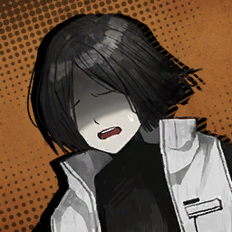

### Chapter 4

---

* ***The Unchanging*** **(ผู้ไม่แปรเปลี่ยน)**

    * **Episode: 1 | ตอนที่ 1**

        

        * เสียงในหัวยี่ซัง

            ```
            We were neither highfliers nor greedy vultures; we were merely children who loved technology.
            พวกเราไม่ใช่ทั้งคนที่ทะเยอทะยาน หรือ อีแร้งจอมละโมบ; พวกเราก็เป็นเพียงแค่เด็กที่รักในเทคโนโลยี
            ```
            ```
            Do you remember the day when we first felt that we were breathing?
            คุณจำได้หรือเปล่า ในวันแรกที่รู้สึกตัวว่าตัวเองกำลังหายใจ?
            ```
            ```
            Back then…
            ในตอนนั้น...
            ```
            ```
            That breath alone would suffice.
            แค่ลมหายใจนั่นก็เพียงพอแล้ว
            ```
            ```
            Or perhaps…
            หรือบางที...
            ```
            ```
            It was the air that was exceptionally clear that day.
            มันก็เพราะอากาศที่ ปลอดโปร่ง/แจ่มใส เป็นพิเศษในวันนั้น
            ```
        
        ```
        Yi Sang: It is time… to turn the clock.
        ยี่ซัง: มันได้เวลาแล้ว... ที่จะหมุนนาฬิกากลับ
        ```

        ---

        

        * เสียงในหัว

            ```
            I can hear Yi Sang, the only conscious Sinner at the moment, muster up his remaining strength to speak.
            ผมได้ยินยี่ซัง คนบาปเพียงหนึ่งเดียวที่ยังคงมีสติในตอนนี้ รวบรวมแรงที่เหลืออยู่เพื่อพูดออกมา
            ```
            ```
            The others are on the floor among dismembered corpses like powerless puppets.
            กับคนอื่น ๆ ที่นอนกองอยู่บนพื้น กับกองศพที่แหลกเป็นชิ้น ๆ ไม่ต่างอะไรกับหุ่นเชิดไร้พลัง 
            ```
            ```
            Fatal injuries were left by an Abnormality.
            พร้อมกับบาดแผลสาหัสที่คงไว้บนตัวของ แอบนอร์มาลิตี/สิ่งแปลกปลอม
            ```
            ```
            Yet, we are in the middle of a Nest.
            แต่ไม่ใช่ว่าเราอยู่ใจกลางเนสหรอกเหรอ
            ```
            ```
            Weren’t Abnormalities… supposed to be confined within Lobotomy Corp’s branch facilities or dungeons?
            ไม่ใช่ว่าสิ่งแปลกปลอมพวกนี้... ต้องถูกกักกัน ภายในสาขาย่อยของศูนย์วิจัยโลโบโตมี่ หรือ ดันเจี้ยนพวกนั่นเหรอ?
            ```
            ```
            Meanwhile, the Abnormality pierced Yi Sang’s abdomen as I wondered.
            ในขณะที่เดียวกัน สิ่งแปลกปลอมนั่นก็แทงทะลุท้องของยี่ซังเหมือนที่ผมคิดไว้ไม่มีผิด
            ```
            ```
            I had no one else to share this question with.
            ผมไม่เหลือใครให้ถามแล้วนะ
            ```

        ---
        
        **Location: Aboard Mephistopheles | บนรถเมฟิสโตเฟเลส**

        ---

        

        ```
        Hong Lu: Where are we going this time?
        ฮงหลู่: ครั้งนี้ เราจะไปไหนกันเหรอครับ?
        ```
        
        ---

        * เสียงในหัว

            ```
            The Sinners seemed to grow quite accustomed to this work.
            เหล่าคนบาปดูจะเริ่มคุ้นเคยงานนี้
            ```
            ```
            As if we were on a roadtrip, some were far less hesitant to ask about our next destination.
            แล้วก็ถ้านี้เป็นโรดทริป บางคนก็คงกล้าถามกว่านี้ว่าเรากำลังจะไปไหน
            ```

        ---

        

        ```
        Faust: That’s not quite the right question. This mission begins with a person, rather than a place.
        เฟาสท์: ถามแบบนั่นก็ไม่เชิงนะคะ เพราะ ภารกิจนี้ขึ้นอยู่กับ คน/ใคร มากกว่า สถานที่/ที่ไหนค่ะ
        ```

        ---

        
        
        ```
        Yi Sang: A person, you say?
        ยี่ซัง: เธอพูดว่าคนงั้นเหรอ?
        ```

        ---

        

        ```
        Faust: We happen to have a client.
        เฟาสท์: พอดีว่าเรามีลูกค้าน่ะค่ะ
        ```

        ---

        

        ```
        Ishmael: You mean… We take requests from outside like we’re a Fixer Office or something?
        อิชมาเอล: เธอกำลังจะหมายความว่า... พวกเรารับคำขอจากข้างนอกเหมือนกับว่าเราเป็นเจ้าหน้าที่ฟิกเซอร์ หรือ อะไรอย่างงั้นเหรอ?
        ```

        ---

        

        ```
        Don Quixote: Oho, hath our carriage begun to be frequented by requests already?¡Excelente! It may take little time at all to become a renowned Fixer!
        ดอน กิโฆเต้: โอ้วหิ รถม้าของเราเริ่มมีคนมาติดต่อขอใช้บริการบ้างแล้วสินะขอรับ? สุดยอดไปเลย! มันอาจต้องใช้เวลาสักหน่อยจนกว่าจะกลายเป็นฟิกเซอร์ที่เป็นที่รู้จัก! 
        ```

        ---

        

        ```
        Vergilius: Quiet. I’ll be answering questions.
        วอร์จิลิอุส: เงียบซะ ฉันจะตอบคำถามของพวกแกเอง
        ```
        ```
        Vergilius: As you all know, the Golden Boughs are a relatively recent discovery.
        วอร์จิลิอุส: อย่างที่พวกแกรู้ ว่ากิ่งทองเป็นสิ่งใหม่ที่พึ่งถูกค้นพบเมื่อไม่นานมานี้
        ```
        ```
        Vergilius: Fortunately, J Corp. and D Corp. didn’t have much interest when we visited their districts.
        วอร์จิลิอุส: โชคดีที่เจคอร์ปกับดีคอร์ปไม่ให้ความสนใจมากนัก ถ้าเราจะเข้าไปในเขตของพวกเขา
        ```
        ```
        Vergilius: That is why those facilities were populated by no more than Backstreets miscreants or ragtag Syndicates.
        แต่เพราะนั่นเองก็เป็นเหตุผล ว่าทำไมสถานที่เหล่านั่นถึงเต็มไปด้วยพวกอัธพาลจากเบคลสตรีท หรือไม่ ก็ซินดิเคตที่กระจายตัว
        ```
        ```
        Vergilius: However…There are Wings that have caught wind of their existence and value early, like K Corp, whose turf we’re in right now.
        วอร์จิลิอุส: ถึงอย่างนั้น...มันก็มี วิงส์/Wing หูดีประสาทดีที่สัมผัสได้ถึงกระแสลมแห่งการมีตัวตน และมูลค่าของพวกมันอยู่ เหมือนอย่างเคคอร์ป ที่เรากำลังเหยียบหางอยู่ตอนนี้
        ```
        
        ---

        
        
        ```
        Gregor: Hmm? But I thought we’d already taken the Golden Bough here in K Corp’s Nest?
        เกรกอร์: หืมม? แต่ไม่ใช่ว่าเราพึ่งเก็บกึ่งทองที่นี้ในเนสเคคอร์ปเหรอครับ?
        ```

        ---

        

        ```
        Vergilius: I never said that there were any rules that say only one Bough may exist in a District.
        วอร์จิลิอุส: ฉันเคยบอกด้วยรึไง ว่ามันมีกฎข้อไหนที่เขียนว่ากึ่งทองจะมีได้แค่อันเดียวในเขตหนึ่ง 
        ```
        ```
        Vergilius: The distribution of Lobotomy Corp’s branch facilities is more complicated than you’d expect. They can be found everywhere… spread quite literally like tree branches.
        วอร์จิลิอุส: การกระจายตัวสาขาย่อยของศูนย์วิจัยโลโบโตมี่นั่นซับซ้อนเกินกว่าที่แกจะรู้ซะอีก พวกมันสามารถถูกพบได้ทุกที่... กระจายตัวแทรกไปทุกหนแห่งไม่ต่างอะไรกับกิ่งของต้นไม้
        ```

        ---

        

        ```
        Sinclair: Like how one was connected to our estate’s basement…
        ซินแคร์: เหมือนอันนั่นใช่ไหมครับ ที่ติดกับห้องใต้ดินครอบครัวผม...
        ```
        
        ---
    
        

        ```
        Vergilius: There also haven’t been any clear definitions about who owns the Boughs.
        วอร์จิลิอุส: อีกอย่าง ก็ไม่มีนิยามอะไรตายตัวว่าใครจะเป็นผู้ครอบครองกิ่งทอง
        ```
        ```
        Vergilius: Which is why everyone’s been playing by the primitive rule that “the first finders of a Bough are its keepers”.
        วอร์จิลิอุส: ซึ่งเป็นสาเหตุว่าทำไมทุกคนถึงเล่นตามกฎสากลดั้งเดิมที่ว่า “ใครเจอก่อน ก็ได้ก่อน”
        ```

        ---

        
        
        ```
        Rodion: Well, that’s how it usually goes with slumbering treasures~
        โรเดียน: แหม นั่นก็เป็นสิ่งที่เกิดขึ้นตลอดกับบรรดาขุมทรัพย์ที่ถูกซ่อนนั้นแหละน้า~
        ```

        ---

        
        
        ```
        Gregor: In that case… Are you telling us that we’ve accepted the request to earn ownership of a Golden Bough?
        เกรกอร์: ถ้างั้น... คุณกำลังจะบอกว่าเราพึ่งรับคำขอให้เก็บกู้ และช่วงชิงอำนาจถือครองกิ่งทองนั่นมาใช่ไหม? 
        ```

        ---

        
        
        ```
        Vergilius: To be exact, they made the offer first.
        วอร์จิลิอุส: พูดให้ถูก คือ พวกเขาเป็นฝ่ายเสนอเราก่อน 
        ```
        ```
        Vergilius: Since a Golden Bough is on the line, we have…
        วอร์จิลิอุส: แล้วพอกิ่งทองกลายเป็นรางวัลที่อยู่บนเส้นชัย พวกจะไปทำอะไรได้ นอกจาก...
        ```

        ---

        
    
        ```
        Ishmael: No choice… I get it now.
        อิชมาเอล: ไม่ใช่ทางเลือก... ฉันเข้าใจแล้ว
        ```

        ---

        

        ```
        Vergilius: Thus… Haaa, I don’t know how many times I have to remind you of this, but do not do anything to aggravate the client.
        วอร์จิลิอุส: ดังนั้น... ฮาาา ฉันไม่รู้ว่าต้องเตือนเรื่องนี้กับพวกแกอีกกี่ครั้ง แต่อย่าทำอะไรให้สถานการณ์ระหว่างเรากับลูกค้าแย่ลงโดยเด็ดขาด
        ```

        ---

        

        ```
        Dante: <By the way…>
        ดันเต้: <ยังไงก็เถอะ...>
        ```

        ---

        
        
        ```
        Vergilius: Now then, keep your mouths shut until you’re there. All as usual.
        วอร์จิลิอุส: ที่นี้ ก็ช่วยหุบปากของพวกแกจนกว่าจะถึงที่นั่น เหมือนตลอดมาก็แล้วกัน
        ```

        ---

        

        ```
        Dante: <……>
        ดันเต้: <......>
        ```
        
        ---

        
        
        ```
        Faust: Dante seemed to have something to say.
        เฟาสท์: ดูเหมือนดันเต้มีอะไรอยากจะพูดนะคะ
        ```

        ---

        

        ```
        Dante: <…Thank you, Faust.>
        ดันเต้: <...ขอบคุณมาก เฟาสท์>
        ```

        ---

        

        ```
        Vergilius: Ah, sorry about that, Dante. I do hope you understand that it’s quite cumbersome to grow used to the concept that the ticking of a clock can be something to respond to.
        วอร์จิลิอุส: อา โทษทีโทษที ดันเต้ ฉันหวังว่านายจะเข้าใจ ว่ายุ่งยากแค่ไหนที่ต้องเคยชินตลอดเวลากับแนวคิดที่ว่า เสียงนาฬิกาเป็นอะไรที่ต้องตอบรับ
        ```

        ---

        

        ```
        Dante: <…So what are Golden Boughs used for, anyway?>
        ดันเต้: <...แล้ว เราจะเอากิ่งทองไปทำอะไรล่ะ?>
        ```
        ```
        Dante: <When I think about it, all we were told was a vague order to collect them… And nothing about what the company plans to do with them.>
        ดันเต้: <พอมาคิดดูแล้ว สิ่งที่เราถูกบอกมาตลอดก็มีแต่คำสั่งที่ครุมเครือ อย่างเช่นการเก็บกู้มัน หรืออะไรอย่างนั้น... และพวกเราก็ไม่รู้เลยว่าองค์กรวางแผนจะเอามันไปทำอะไร>
        ```

        ---

        


        ```
        Faust: ……
        เฟาสท์: ......
        ```
        ```       
        Faust: They’re asking about the purpose of the Golden Boughs.
        เฟาสท์: เขาถามเกี่ยวกับวัตถุประสงค์ของกิ่งทองนะคะ
        ```

        ---

        

        ```
        Vergilius: …Uh-huh.
        วอร์จิลิอุสซ ...อา-หะ
        ```
        ```
        Vergilius: I see you’ve finally begun to ruminate on subjects, Manager Dante. Here you are, growing curious about the company’s plans.
        วอร์จิลิอุส: เห็นทีว่าในที่สุด นายก็เริ่มขบคิดไตร่ตรองและรู้จักตั้งคำถามสักทีสินะ คุณผู้จัดการดันเต้ ยินดีด้วย ให้กับความสงสัยก้าวแรกสู่แผนการบริษัท
        ```
        ```
        Vergilius: Then I ought to aid your management as a guide by providing kind explanation.
        วอร์จิลิอุส: อุตส่าห์คิดได้ตั้งขนาดนี้ ถ้างั้นฉันเอง ก็ควรที่จะช่วยสนุนสนุนนายกับการทำงานในฐานะผู้จัดการบ้าง ด้วยการอธิบายอย่างเป็นกันเอง และเข้าใจง่าย
        ```
        ```
        Vergilius: The Golden Boughs…
        วอร์จิลิอุส: กิ่งทองน่ะ...
        ```
        ```
        Vergilius: They are branches, as their name suggests. That’s what we call stems growing from the trunk of a tree. These ones happen to have a golden glow.
        วอร์จิลิอุส: พวกมันคือกึ่งไม้ เหมือนที่ชื่อมันบอกนั่นแหละ และมันก็เป็นสิ่งที่เราเรียกว่ากิ่งก้านที่งอกออกมาจากลำต้นของต้นไม้ โดยที่เจ้าพวกนั่นมีสีทองอร่าม
        ```

        ---

        

        ```
        Don Quixote: Ohoooo… Forsooth…
        ดอน กิโฆเต้: โอ้วววว... งี้นี้เองงง...
        ```

        ---

        * เสียงในหัว
            ```
            Don Quixote was the only one responding passionately to this information.
            ดอนกิโฆเต้เป็นเพียงคนเดียวที่ตอบสนองข้อมูลนั่นด้วยท่าทีที่หลงไหล
            ```
            ```
            Thanks to this exchange, he painted me as an ignorant bloke who doesn’t even know what a branch is.
            ต้องขอบใจเลยจริง ๆ ที่เขามองฉันเป็นแค่ไอโง่ที่ไม่รู้ประสีประสาว่ากิ่งไม้คืออะไร
            ```
            ```
            Rodya shrugs at me as if to chaff me for expecting a real answer.
            โรดย่ายักไหล่ให้ฉัน อย่างกับจะเยาะเย้ยฉันที่หวังจะได้คำตอบจริง ๆ 
            ```

        ---

        

        ```
        Charon: Verg, the road is blocked. Should I go around it?
        ชารอน: วอร์ค ถนนมันโดนบัง ให้ฉันขับอ้อมไหม?
        ```

        ---

        

        ```
        Vergilius: ......
        วอร์จิลิอุส: ......
        ```

        ---

        

        ```
        Ishmael: It’s blocked?
        อิชมาเอล: โดนบังเนี้ยนะ?
        ```
        ```
        Ishmael: Strange that there’s a blocked road. This is in the middle of K Corp’s Nest, too; it’s unlikely that there’s a scene—
        อิชมาเอล: แปลกชะมัด ที่จะมีถนนที่โดนบัง นี้มันใจกลางเนสเคคอร์ปนะ; อีกอย่าง ที่นี้ก็ดูเหมือนจะไม่ได้เกิดเหตุการณ์อะไรด้ว—
        ```
        
        ---

        

        * เสียงในหัว
        
            ```
            Before Ishmael could finish her sentence, a dull thud at the window interrupted her.
            ก่อนที่อิชมาเอลจะพูดจบประโยค เสียงตุบอันหนักอึ้งของบางอย่างที่กระทบกระจกก็ขัดเธอ
            ```

        ---

        

        ```
        Rodion: …Something just got flung at the bus and boinked off… That was a person, wasn’t it?
        โรเดียน: ...ไม่ใช่ว่ามีอะไรโดนเขวี้ยงใส่บัส แล้วกระเด็นออกไปหรอกใช่ม้า... เป็นคนหรือเปล่าน้า? *เหอะ ๆ*
        ```

        ---

        

        ```
        Meursault: A male individual who appears to be in his early 40s. There seems to be a serious injury in his occipital region. He had already died before the impact.
        เมอร์โซลท์: เป็นผู้ชายอายุประมาณสี่สิบต้น ๆ และมีร่องรอยของบาดแผลบริเวณใกล้กับท้ายทอยเขาด้วย ดูเหมือนว่าเขาจะตายก่อนหน้าที่จะชนกับรถบัส 
        ```

        ---

        

        ```
        Vergilius: Yeah, sure doesn’t seem like the average scuffle.
        วอร์จิลิอุส: ถูกเพ้ง แถมแม่งดูไม่เหมือนการวิวาทธรรมดาซะด้วย
        ```
        ```
        Vergilius: Pitstop. If it’s a problem you can handle, come back after you’re done.
        วอร์จิลิอุส: เราจะแวะตรงนี้ ถ้ามันเป็นปัญหาที่พวกแกรับมือได้ ก็รีบจบ แล้วกลับมาซะ
        ```

        ---

        

        ```
        Rodion: …And what about if it isn’t?
        โรเดียน: ...แล้วถ้ามันไม่ใช่ล่ะ?
        ```

        ---

        

        ```
        Vergilius: The clock’ll have to spin until it’s been dealt with.
        วอร์จิลิอุส: ถ้าไม่ใช่... คุณนาฬิกาคงต้องหมุนจนกว่ามันจะโดนจัดการนั่นแหละ
        ```

        ---

        
        
        ```
        Dante: <That’s one elegant way to tell us to go die a thousand deaths…>
        ดันเต้: <เป็นวิธีบอกให้พวกเราไสหัวไปตายเป็นพันรอบที่สง่างามซะไม่มีอะ...>
        ```

        ---

        

        ```
        Rodion: Hm, now then…
        โรเดียน: หืม เอางั้นก็ได้...
        ```
        ```
        Rodion: Off the bus.
        โรเดียน: ทุกคนลงบัสได้
        ```

        ---

        

        ```
        Vergilius: ......
        วอร์จิลิอุส: ......
        ```

        ---

        

        ```
        Rodion: What? Weren’t you about to say the same thing anyway? Saved you the trouble~
        โรเดียน: อะไรกัน? ไม่ใช่ว่าคุณจะพูดเหมือนเดิมเหรอ? ช่วยเซฟเวลาไง~
        ```

        ---

        

        ```
        Hong Lu: I just can’t wait, what adventures are in store for us this time?
        ฮงหลู่: ผมชักจะรอไม่ไหวแล้วสิ การผจญภัยแบบไหนกันที่กำลังรอเราอยู่ภายภาคหน้า? 
        ```

    ---

    * **Episode: 2 | ตอนที่ 2<br>Location: Nest K's Streets | บนถนนเนสเค**

        

        ```
        Faust: As you saw through the bus… we are in the middle of a Nest. A place that should be the furthest from unexpected trouble.
        เฟาสท์: อย่างที่ทุกคนเห็นผ่านบัส... ว่าเรากำลังอยู่ใจกลางเนส สถานที่ที่ควรจะห่างไกลที่สุดจากปัญหาอันไม่คาดคิด
        ```

        ---

        

        ```
        Hong Lu: Hmm… Would that mean this is a precious commotion? 
        ฮงหลู่: หืมม... งั้นก็หมายความว่านี้ต้องเรื่องวุ่นวายสุดยอดเลยใช่ไหมครับ?
        ```

        ---

        

        * เสียงในหัว
        
            ```
            Everyone except drowsy Hong Lu was tensed up, carefully observing what was going on…
            ทุกคนยกเว้นฮงหลู่ที่งัวเงียเกร็งไปหมด พร้อมกับตั้งหน้าตั้งตาสังเกตสิ่งที่เกิดขึ้น...
            ```

        ```
        Dante: <Hm? Is that…>
        ดันเต้: <หืม? นั่นมัน...>
        ```

        ---

        * เสียงในหัว

            ```
            Someone was running our way in a hurry from the other side.
            ใครบางคนกำลังวิ่งมาทางพวกเราด้วยท่าทีที่รีบร้อนจากอีกฝากหนึ่งของถนน
            ```
            ```
            The civilian was too hurried to look ahead; they bumped into the Sinners and fell to the ground.
            และดูเหมือนว่าประชาชนคนนั่นจะรีบร้อนเกินไปที่จะมองรอบ ๆ; ก่อนที่เธอจะพุ่งชนคนบาป และล้มลงกับพื้น
            ```

        ---

        

        ```
        Running Civilian: Huff, huff… D-Don’t go that way!
        ประชาชนที่วิ่งหนีตาย: เฮือก เฮือก... อ-อย่าไปทางนั่นนะ!
        ```

        ---

        

        ```
        Don Quixote: Come now, you may rest easy! We have galloped hither to save innocent lives such as yours for we are—
        ดอน กิโฆเต้: เอาน่า เจ้าพักก่อนเถอะ! พวกเราควบม้ามาที่นี้ก็เพื่อช่วยเหลือชีวิตของผู้บริสุทธิ์เยี่ยงพวกเจ้า เพราะเราคือ—
        ```

        ---

        

        ```
        Ishmael: We are no such things as heroes, so please don’t say anything unnecessary.
        อิชมาเอล: เราไม่ได้เป็นอะไรที่ใกล้เคียงกับฮีโร่เลยสักนิด เพราะงั้น ก็ช่วยหยุดพูดอะไรที่ไม่จำเป็นสักที
        ```

        ---

        

        ```
        Heathcliff: Oi, we need to cross here. If you’re here to stop us for nothing, then I’ll give you a taste of this bat.
        ฮิธคลิฟฟ์: โอ่ย เราต้องข้ามตรงนี้ไปนะเฟ้ย ถ้าแกอุตสาห์ทอมาถึงนี้เพื่อหยุดพวกเรา งั้นฉันก็คงไม่มีทางเลือกอื่น นอกจากให้แกได้ลิ้มสชาติของกระบองนี้ 
        ```

        ---

        

        * เสียงในหัว

            ```
            Looking at Heathcliff’s intimidating face and Ishmael’s frowned expression in turn, the civilian seemed to take a moment to consider which would be more of a threat.
            พอมองหน้าฮิธคลิฟฟ์ที่ดุอย่างกับหมา กับ ท่าทีบูดบึ้งของอิชมาเอล ฉันก็ชักจะไม่แน่ใจแล้วนะ ว่าประชาชนคนนั่นจะคิดว่าอะไรกันที่อันตรายกว่า
            ```
        
        ---

        

        ```
        Running Civilian: There’s… something ahead… something that shouldn’t be real…
        ประชาชนที่วิ่งหนีตาย: มันมี... ตัวอะไรบางอย่างอยู่ข้างหน้านี้... ตัวอะไรสักอย่างที่ควรมีอยู่จริง...  
        ```
        ```
        Running Civilian: I dunno what it was, I’ve never seen anything like it… Everyone was screaming and running, and then… people rolling on the floor… set on fire…
        ประชาชนที่วิ่งหนีตาย: ฉันไม่รู้ว่ามันเป็นตัวอะไร ฉันไม่เคยเห็นอะไรแบบนั่นมาก่อน... ทุกคนต่างกรีดร้องและวิ่งหนีตาย แล้วก็มีคน... ที่กลิ้งไปมาอยู่บนพื้น... ไฟลุกท่วมไปทั้งตัว...
        ```

        ---

        

        ```
        Meursault: Did the entity you witnessed have a form that does not resemble a human?
        เมอร์โซลท์: ขอเสียมารยาทหน่อยนะครับ แต่ผมขอสอบถามได้ไหมว่า ตัวตนที่คุณพบเห็นมีลักษณะร่างกายที่ไม่เหมือนมนุษย์ใช่ไหม?
        ```

        ---

        
        
        ```
        Running Civilian: …Yeah, you’re right. That’s right…!
        ประชาชนที่วิ่งหนีตาย: ...ใช่ ตามที่คุณว่าเลย นั่นแหละ...!
        ```

        ---

        

        ```
        Ishmael: Then, if it isn’t a person… Keeping the suspected possibilities in our minds, we headed for the center of the disturbance…
        อิชมาเอล: งั้น ถ้ามันไม่ใช่คน... ก็ตั้งข้อสันนิษฐานไว้ได้เลย ว่าพวกเรากำลังมุ่งหน้า ไปยังจุดศูนย์กลางของความโกลาหล
        ```

        ---

        **Location: Nest K’s Ruined Streets | ถนนเนสเคที่ทรุดตัว**
        
        ---

        

        ```
        Sinclair: W—What’s going on here?
        ซินแคร์: ก-เกิดอะไรขึ้นที่นี้?
        ```

        ---

        

        ```
        Heathcliff: It could, er… be a Distortion or whatever, no? Like that chicken place?
        ฮิธคลิฟฟ์: มันอาจเป็นฝีมือของไอนั่น... ที่เขาเรียกว่าอะไรนะ? บิดบงบิดเบี้ยวอะไรนั่นน่ะ? เหมือนกับไอไก่ที่เราเคยเจอในร้านคราวก่อน? 
        ```

        ---

        

        ```
        Dante: <No… That’s different… That one is an Abnormality, not a Distortion. I’m sure of this… somehow.>
        ดันเต้: <ไม่... นั่นไม่เหมือนกัน... ไอนั่นมันเป็นสิ่งแปลกปลอม ไม่ได้บิดเบี้ยว ได้รู้ทำไม... แต่ฉันมั่นใจว่าอย่างนั่น>
        ```

        ---

        

        ```
        Faust: As Dante suggested, that entity is likely to be an Abnormality. Our manager is able to “sense” it.
        เฟาสท์: 
        ```

        ---

        

        ```
        Dante: <But then, why…>
        ดันเต้: <>
        ```
        ```
        Dante: <Why is an Abnormality in the middle of a Nest?>
        ดันเต้: <>
        ```

        ---
        
        ```
        Faust: It’s a phenomenon of which Faust has never been notified. Most Lobotomy Corp. facilities were shut down as soon as the Wing was dissolved.
        ```

        ---

        * เสียงในหัว

            ```
            I was reminded of the site burial Yuri told us about, but I quickly shook off those gloomy memories.
            ```

        ---

        ```
        Faust: Even if an Abnormality did break out in the meantime, there should have been a report informing us of such a fact before this mission.
        ```
        ```
        Faust: It’s hard to imagine that the LCC would have been unable to notice if such an event actually occurred.
        ```

        ---

        ```
        Sinclair: …Could they be the security staff that gets sent by K Corp?
        ```

        ---

        ```
        Ishmael: Rather than suppressing the Abnormality… they’re just getting completely wrecked.
        ```

        ---

        ```
        Gregor: Mmh… It sorta takes me back to the time when we got beat bad in D Corp’s District…
        ```

        ---

        ```
        Rodion: Aw, c’mon~ First, that chicken restaurant guy goes cuckoo, and now this? I’m really over this kinda Nest K welcome…
        ```

        ---

        * เสียงในหัว

            ```
            Right as they complained…
            ```

        ---

        ```
        Heathcliff: Gah! Bloody…
        ```

        ---

        * เสียงในหัว
            
            ```
            Debris created by the rampaging Abnormality narrowly grazed past us.
            ```
            
        ---

        ```
        Heathcliff: Hah, the hell are you doing? Just watching from here won’t do any of us any good!
        ```
        ```
        Heathcliff: …It’ll crush us all to a pulp.
        ```

        ---
        
        ```
        Outis: ……
        ```
        ```
        Outis: You’re gravely mistaken. Have that insane brat’s daily ramblings finally managed to brainwash you?
        ```

        ---

        ```
        Don Quixote: Ho, hark? I prithee, who dost thou mean by this “insane brat”?
        ```
        
        ---

        ```
        Outis: The guide only instructed us to return once the commotion has been dealt with. He never ordered us to deal with it ourselves.
        ```
        
        ---

        ```
        Heathcliff: For goodness’ sake, what’s there to be so damn obtuse about?
        ```
        ```
        Heathcliff: Didn’t you see what just happened? It almost blew my head off! Who knows what else will happen if it keeps up!
        ```
        ```
        Heathcliff: This’ll be over if we just beat that damn thing down… What else do we got? Parking a seat to keep watching, gobbling some chicken? Huh?!
        ```

        ---

        ```
        Outis: There’s no need to waste our lives on fights unrelated to our missions.
        ```
        ```
        Outis: I’m sure you filth didn’t even realize, but here’s the thing…
        ```
        ```
        Outis: The more you die, the less efficient you become in battle.
        ```
        ```
        Outis: Experiencing a certain pain will make you learn to fear and avoid it.
        ```

        ---

        ```
        Meursault: ……
        ```

        ---

        ```
        Sinclair: …People are dying over there as we speak, though?
        ```

        ---

        ```
        Outis: Although it will cost much time and many lives… they will eventually suppress it. Just as we do.
        ```
        ```
        Outis: And I must say… I didn’t expect a whining amateur who’d cry out for his parents whenever he died to willingly suggest self-sacrifice.
        ```
        ```
        Outis: Death has become a triviality to you, has it?
        ```

        ---

        ```
        Sinclair: ……
        ```

        ---

        ```
        Meursault: If we must make the best decision between the Sinners, it’s right to listen to her.
        ```

        ---

        ```
        Dante: <I…>
        ```

        ---

        * เสียงในหัว

            ```
            We’re not Fixers, and we certainly cannot be heroes.
            ```
            ```
            Turning the clock obviously hurts whenever I do it, and the pain is something I can never get used to.
            ```
            ```
            And yet…
            ```

        ---

        ```
        Dante: <We should suppress it. I can’t logically explain why, but… I feel like we should.>
        ```

        ---

        ```
        Outis: ……
        ```

        ---

        ```
        Heathcliff: I’d have crushed that clock and run out there if you gabbled the same rubbish, clockface.
        ```

        ---

        ```
        Meursault: If that is your decision, I will abide by it.
        ```

        ---

        ```
        Gregor: Yeah, aight… I’m sure you made the right call.
        ```

        ---

        ```
        Sinclair: Hey, um… Thank you for making that decision.
        ```

        ---

        ```
        Ryoshu: You worry too much over little things, clock. You won’t be an artist.
        ```

        ---

        ```
        Outis: …This judgement was made for none other than you, Executive Manager.
        ```

        ---

        * เสียงในหัว
        
            ```
            The Sinners walk ahead after leaving me comments.
            ```
            ```
            While all the others moved forward, Faust remained and gave me a peculiar stare.
            ```

        ---

        ```
        Dante: <What is it? You think my judgement was inefficient?>
        ```

        ---

        ```
        Faust: No, I just thought it would be interesting to see how you react once you’ve reclaimed your memory.
        ```

        * เสียงในหัว 

            ```
            Faust’s strange statement held me in place for a moment, but I decided I want to deal with the questions that are immediately ahead of me first.
            ```

        ---
        
        ```
        Dante: <Faust, I’ve been wondering for a while… Are you really okay with being treated like this, considering your talent and everything?>
        ```

        ---

        * เสียงในหัว

            ```
            Someone of her caliber should have no problem enjoying a luxurious life in the City.
            ```

        ---

        ```
        Faust: Faust doesn’t mind. Additionally, “talent” feels like the incorrect word to describe Faust.
        ```
        ```
        Faust: Many can possess talent, but Faust does not want to be included in the many.
        ```
        ```
        Faust: Among the Sinners, if we were looking for a talented individual of the most commonly agreed definition, that would be… Yi Sang. For your information, I am a genius.
        ```

        ---

        * เสียงในหัว
        
            ```
            Yi Sang stops walking behind the other Sinners and turns around to face me.
            ```
            ```
            Looking again, his eyes actually stare into the emptiness behind me.
            ```

        ---

        ```
        Yi Sang: …I am no such individual.
        ```
        ```
        Yi Sang: I have long stopped fluttering my wings.
        ```
        ```
        Yi Sang: Thus, it would be of no use to discuss my talent, Manager.
        ```

        ---

        ```
        Dante: <……>
        ```

        ---

        * เสียงในหัว

            ```
            Curiously enough, I find that some Sinners feel more distant as we spend more time together.
            ```

        ---

        ```
        Ryoshu: What’s that flying machine? It’s been irking me. Got the urge to S.I.D. for the three-thousandth time.
        ```

        ---

        ```
        Yi Sang: That… is a device called a drone.
        ```

        ---

        ```
        Ishmael: Oh, they might be combat drones K Corp. sent to help us. The Wing seems to be above average in terms of technology.
        ```

        ---

        ```
        Faust: No, viewing its design, it doesn’t appear to be equipped with combat functionalities. It also has a camera at the center.
        ```

        ---

        ```
        Ishmael: Well… I guess it makes sense to get a close look at the mess happening in a well-off Nest.
        ```

        ---

        * เสียงในหัว
        
            ```
            Abashed, Ishmael mumbled.
            ```

        ---

        ```
        Don Quixote: Ohh! Will we be featured on the thing called the “news”?
        ```

        ---

        ```
        Sinclair: Wait, something’s off… Why’re…
        ```
        ```
        Sinclair: Why are they only filming corpses and dying people?
        ```

        ---

        ```
        Gregor: Well, it’s the provocative stuff that draws more attention, doesn’t it?
        ```

        ---

        ```
        Rodion: “Look at this terrible incident! See how morbid it is!” or something like that.
        ```

        ---

        ```
        Sinclair: But…
        ```

        ---

        ```       
        Rodion: Hold up, kiddo! In front of you!
        ```

        ---

        ```
        Sinclair: Kngh… This is… definitely weird…
        ```
        
        ---

        ```
        Dante: <Sinclair!>
        ```

        ---

        ```
        Sinclair: Look at this thing. Why does it have its camera glued to me…?
        ```

        ---

        ```
        Ryoshu: …I don’t appreciate a soulless audience.
        ```

        ---

        ```
        Meursault: There is a considerable number of them. And these drones…
        ```
        ```
        Meursault: They appear to be deliberately preventing us from entering the area where the Abnormality is.
        ```

        ---

        ```
        Gregor: Can’t be. We’re here to help, so they’d have no reason to get in…
        ```
        ```
        Gregor: Our way… right…?
        ```

        ---

        * เสียงในหัว

            ```
            Now the drones have started lining up, and formed a wall as if to stop us from proceeding any farther.
            ```
        
        ---

        ```
        Mysterious Drone: Greetings, citizens. Please keep ten meters of distance for your own safety.
        ```
        ```
        Mysterious Drone: K Corp’s staff has been dispatched. Your safety is assured. Please keep ten meters of distance.
        ```

        ---

        ```
        Heathcliff: No, look, your staff is being slaughtered over there, can’t you see?
        ```

        ---

        ```
        Mysterious Drone: Greetings, citizens, your safety is assured. Please keep ten meters of distance.
        ```

        ---

        ```
        Ishmael: Hah, the instructions make no sense. What difference is ten meters going to make in this mess?
        ```

        ---

        ```
        Gregor: Tsk, not gonna do us any favors, huh…
        ```
        ```
        Gregor: Dunno if they’re malfunctioning or just badly designed, but we’ll have to get rid of all these before we can get to the Abnormality.
        ```

    ---

---

### เพิ่มเติม
* <*ยังไม่เสร็จ> หมายถึง ยังไม่ครบถ้วนหรือยังขาดหายเนื้อหาบางส่วนอยู่
* <*รูปภาพ> หมายถึง มีการใช้รูปภาพภายในข้อความแล้วไม่สามารถใส่ได้ไม่ว่ากรณีใดก็ตาม
* <*ไม่แน่ใจ> หมายถึง บทสนทนาที่แปลหรือประโยคคำพูดที่อาจไม่ตรงตามวัตถุประสงค์หรือบริบท์แท้จริง
* <*ระดับภาษา> หมายถึง บทสนทนนาที่เแปลแล้วอาจไม่ตรงบริบทของตัวละครในเชิงของระดับภาษา เช่น สรรพนามที่ใช้เรียกตัวเองหรือผู้อื่น คำลงท้ายประโยค
* <*คล้าย> หมายถึง คำที่ถูกใช้ในบทสนทนามีความซ้ำซากกับบทสนทนาอื่น