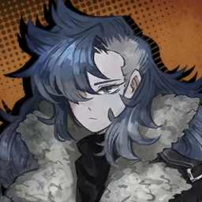
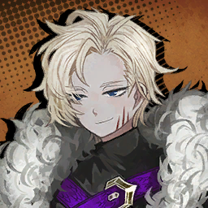
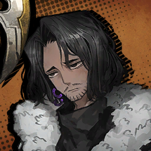

### Prologue - บทนำ

---

* ***Selva Oscura*** **(เซลว่า ออสคูล่า)**

    * **Episode: 1 | ตอนที่ 1<br>Location: A Dark Forest | ป่าอันมืดมิด (สักแห่ง)**

        

        ```
        Wolf: Do you see now? You can't run from us.
        วูฟ: แกจะรู้ตัวได้หรือยัง? ว่าแกวิ่งหนีไปจากเงื่อมมือของเราไม่ได้หรอก
        ```

        ---

        

        ```
        Dante: <You dare… interrupt me just as I was engraving the ■■■■■■… You must be out of your…>
        ดันเต้: <แกกล้าดียังไง… บังอาจมาขัดขวางฉันตอนที่กำลังสลัก ■■■■■■ อยู่… พวกแกต้องเสีย… <*ไม่แน่ใจ>>
        ```

        ---

        

        ```
        Lion: Ah~ If we're being technical, what our master has planned apparently isn't one of the City's taboos.
        ไลออน: อ้าาา~ แหม ๆ ก็ถ้าให้พูดตามเทคนิคละก็ สิ่งที่ท่านผู้นั้นวางแผนก็ไม่ใช่สิ่งที่ผิดกฎของเมืองเลยสักนิด
        ```
        ```
        Lion: It’s just the kind of thing that… no one has ever dared to consider, you catch my drift?
        ไลออน: มันก็เป็นแค่เรือง ๆ นึงที่แบบว่าาา… ได้แต่คิดแต่ก็ไม่มีใครใจกล้าทำมันจริง ๆ ขึ้นมาเลย อะไรประมาณนั้นแหละมั้ง? นายเข้าใจที่ฉันจะสื่อใช่ปะ?
        ```
        ```
        Lion: Huh, would you look at that…
        ไลออน: เหห้ห~ ดูซิ้ว่าใครมา…
        ```

        ---

        

        ```
        Panther: You managed to get a different head in so fast. Do people like you always come prepared?
        แพนเธอร์: แกถอดแล้วเปลี่ยนหัวใหม่เร็วชะมัดเลยนี้ ไอตัวแบบแกเตรียมตัวดีแบบนี้หมดเลยหรือไง?
        ```

        ---

        

        ```
        Dante: <Kngh… Just wait ‘til I get the ■■■■■■… You’ll be no match for my…>
        ดันเต้: <อั่ก… รอจนกว่าฉันจะได้ ■■■■■■… ก่อนซิ้ ถ้าฉันมีมัน หนูสกปรกอย่างพวกแกทุกคนก็ไม่มีใครเทียบฉันได้ทั้งนั้น…>
        ```

        ---

        

        ```
        Lion: Haha, I guess that new noggin doesn’t come with a mouth, huh?
        ไลออน: ฮาฮ่า อะไรกันละเนี้ย~ สงสัยไอเจ้าหัวใหม่นั้นของแกจะไม่มีฟังก์ชันสำหรับพูดสิท้า เห็นเอาแต่เงียบตั้งแต่เมื่อกี้นี้แล้ว ใช่ม้าาา…?
        ```

        ---

        

        ```
        Wolf: Yep, ticking is all I can hear. You think they’re screaming on the inside?
        วูฟ: คงงั้น เสียงติ๊กของนาฬิกาคือเสียงเดียวที่ฉันได้ยินจากไอเจ้านี้ อืมมม… แปลว่าบางทีมันอาจกำลังร้องคร่ำครวญอยู่ข้างในนั้นอยู่ก็ได้
        ```

        ---

        

        ```
        Dante: <Ghaagh…!>
        ดันเต้: <อ๊ากก…!>
        ```

        ---

        

        ```
        Wolf: Hmm. It’s ticking faster, so I guess they can still feel pain.
        วูฟ: อืมมม… ดูเหมือนเสียงติ๊กจะเร็วขึ้น อย่างที่ฉันคิดเอาไว้เลยแกยังคงรู้สึกถึงความเจ็บปวดได้อยู่สินะ
        ```

        ---

        

        * เสียงในหัว

            ```
            Dammit… Why… am I…!
            เวรเอ้ย… ทำไม… ฉันถึง…!
            ```
            ```
            …Why am I being attacked?
            …เป็นคนที่โดนโจมตีซะเองล่ะ?
            ```
            ```
            Not good… Memories are dissolving already… The ■■■ was done too quick…
            อึ่ก! ไม่ดีแล้ว… ความทรงจำของฉัน มันเริ่มที่จะละลายหายไปเรื่อย ๆ แล้ว นี้มัน… เป็นเพราะฉัน ■■■ เสร็จเร็วเกินไปงั้นรึไง
            ```

        ---

        

        ```
        Wolf: What, they’ve gone quiet already. Let’s get this over with.
        วูฟ: อะไรกัน ดูเหมือนว่าไอเจ้านี้จะเงียบไปแล้วนะ รีบมาจบเรื่องนี้เลยดีกว่า
        ```

        ---

        

        ```
        Lion: Wolf, this is a place no one visits and somewhere none can see. What’s the hurry?
        ไลออน: นี้วูฟจังงง~ เธอรู้ป่าวเนี้ยว่าที่นี้น่ะเป็นสถานที่ที่ชาวบ้านเขาไม่มากัน แล้วในเมื่อถ้ายังไงก็ไม่มีทางที่จะมีใครมาเห็นว่าพวกเราทำอะไรอยู่แล้ว แล้วเธอจะรีบไปหาพระแสงอะไรมิทราบ?
        ```

        ---

        

        ```
        Wolf: We must follow her teachings. We can’t drag on any longer.
        วูฟ: พวกเรายึดตามคำสั่งสอนของท่านผู้นั้น จะมัวมาชักช้ากับเรื่องพรรค์นี้ไม่ได้เด็ดขาด
        ```

        ---

        

        ```
        Lion: Yeah, but… Haa, this is the moment of a lifetime. We’re not gonna get a second chance to kill someone of this caliber…
        ไลออน: ค่าาา~ รู้แล้ว ๆ แต่ว่า… พวกเธอ ไม่คิดว่ามันน่าเสียดายบ้างเลยหรือไงที่เราจะอุตส่าห์ปล่อยให้ช่วงเวลาครั้งหนึ่งในชีวิตต้องลอยหายไปโดยที่ไม่ได้แม้แต่ลิ้มลองรสชาติของมันเลยน่ะ พวกเราอาจจะไม่มีโอากาศครั้งที่สองที่จะฆ่าใครที่อยู่ระดับนี้อีกเลยก็เลยก็ได้นะ
        ```

        ---

        

        ```
        Panther: Lion, you have a tendency to grow too emotional during your jobs. I hope you show some discretion.
        เเพนเธอร์: ไลออน เธอช่วยหยุดใช้อารมณ์ของตัวเองมาผสมกับเรื่องงานจะได้ไหม ถึงผมจะพูดไปไม่รู้กี่รอบแล้วก็เถอะ แต่ช่วยจริงจัง และพึงระลึกเอาไว้ด้วยว่าเรามาที่นี้เพื่อทำอะไร
        ```

        ---

        

        ```
        Lion: Pshaw…
        ไลออน: ชิ…
        ```

        ---

        

        ```
        Panther: It’s a shame—I wanted to have a look at your face. I reckon you won’t tell us where your star is, right?
        เเพนเธอร์: มันชั่งเป็นเรื่องน่าเสียดาย-ตัวกระผมอุตส่าห์อยากที่จะมองใบหน้าของคุณอยู่เลยแท้ ๆ แต่ผมเกรงว่าคุณคงจะไม่บอกเราใช่ไหมครับว่าดวงดาวของคุณอยู่ที่ไหน?
        ```

        ---

        

        ```
        Dante: <Like hell I am. I’m taking ■■■’s location to the grave with…>
        ดันเต้: <เออสิเว้ย! ไม่ว่าฉันจะเป็นยังไง ต่อให้ต้องตายก็ตาม ฉันก็จะไม่ให้ที่อยู่ของ ■■■ โดยเด็ดขาด ให้สิ่ง ๆ นั้นลงหลุมไปพร้อมกันกับฉันนี้แหละ…>
        ```
        ```
        Dante: <……>
        ```

        * เสียงในหัว

            ```
            Dammit, where was ■■■ supposed to be again? My memories are escaping me too quickly…
            อึ่ก! เวรเอ้ย แล้วที่ ๆ นั้น ที่ ■■■ มันอยู่ที่ไหนกันนะ? ความทรงจำของฉันมันกำลังหลั่งไหลออกไป… มันกำลังหนีออกไปจากฉันเร็วชะมัด…
            ```

        ---

            

        ```
        Panther: …Right. No mouth.
        แพนเธอร์: …จริงด้วย ไม่มีปากให้พูด
        ```
        ```
        Panther: Which in turn means… we won’t learn how to acquire it from this person.
        แพนเธอร์: เห้อออ… ซึ้งนั้นก็หมายความว่า เราไม่มีทางที่จะรู้อะไรจากเจ้านี้ได้เลย
        ```

        ---

        

        ```
        Wolf: Can I end them now?
        วูฟ: ฉันปิดชีพมันได้หรือยัง?
        ```

        ---

         

        ```
        Panther: Sure… Huh?
        แพนเธอร์: แน่นอน… หืม?
        ```

        ---

        

        ```
        Lion: Hey, what’s that noise? Don’t tell me, Panther… did you allow yourself to be tracked?
        ไลออน: นี้~ เมื่อกี้นี้พวกแกได้ยินเสียงอะไรป่าว? เดี๋ยวนะ อย่าบอกนะว่าแพนเธอร์… นายทำให้ตัวเองถูกแกะรอยได้งั้นเหรอเนี้ย?
        ```

        ---

         

        ```
        Panther: No, there was no one that could’ve pursued me. Perhaps a wild animal?
        แพนเธอร์: เรื่องนั้นไม่มีทางเป็นไปได้ครับ ไม่มีใครที่สามารถแกะรอยผมได้โดยที่ผมไม่รู้ตัวอย่างแน่นอน มันคงจะเป็นเสียงของสัตว์ป่าที่อาศัยอยู่แถวนี้กระมังครับ?
        ```

        ---

         

        ```
        Wolf: This is not the sound a beast would make. It’s…
        วูฟ: ไม่ใช่! นี้มันไม่ใช่เสียงที่ของสัตว์ป่า แต่มันคือเสียง…
        ```
        ```
        Wolf: A bus…?
        วูฟ: ของรถบัส…?
        ```

        ---

         

        ```
        Panther: How did it even end up here?
        แพนเธอร์: แล้วรถบัสที่ไหนขับจนมาถึงที่นี้ได้กันนะครับ?
        ```

        ---

        

        ```
        Lion: Must’ve taken a wrong turn?
        ไลออน: ไม่รู้ซิ้ อาจจะแค่เลี้ยวผิดทางล่ะมั้ง?
        ```
        ```
        Lion: Hoo, the price they’ll pay for taking the wrong road will be heavier than they expect…
        ไลออน: แหม ๆ พวกมันคงไม่รู้ราคาที่ต้องจ่ายกับการที่ไอ้โง่คนขับเสือกเลี้ยวผิดทางสินะ~ มันน่ะ หนักอิ้งซะจนพวกมันคาดไม่ถึงเลยล่ะ
        ```
        ```
        Lion: …!
        ไลออน: …!
        ```

        ---

        

        ```
        Wolf: …It bested Lion’s strength?
        วูฟ: …อะไรกัน รถนั้นมันเอาชนะแรงของไลออนได้งั้นเหรอ?
        ```

        ---

        

        ```
        Panther: …!
        แพนเธอร์: …!
        ```

        ---

        

        ```
        Faust: ……
        เฟาสท์: ……
        ```
        ```
        Faust: If my eyes are still right, then you will reach the harbor of glory.
        เฟาสท์: ถ้าดวงตาของฉันมองไม่ผิดอย่างนั้นคุณคือคนที่จะไปถึงท่าเรือแห่งความรุ่งโรจน์
        ```

        ---

        

        ```
        Dante: <Who… are you? That nameplate… says… Faust?>
        ดังเต้: <เธอ… เป็นใครกัน? ป้ายชื่อนั้น มันเขียนว่าเฟาสท์เหรอ?>
        ```

        ---

        

        ```
        Faust: You’ve lost your way in a dark forest.
        เฟาสท์: คุณหลงทาง สูญหาย และไร้ซึ่งทางออกอยู่ภายในป่าแห่งความมืดมิด
        ```

        ---

        

        ```
        Dante: <I’m… sorry, what?>
        ดันเต้: <ฉัน… ขอโทษนะ แต่เธอกำลังพูดบ้าอะไรอยู่?>
        ```

        ---

        

        ```
        Faust: Yet you were not overcome with fear. Why was that?
        เฟาสท์: ถึงอย่างงั้น คุณก็ยังไม่ได้ก้าวข้ามความกลัว ทำไมถึงเป็นแบบนั้นล่ะคะ?
        ```

        ---

        

        ```
        Dante: <That's…>
        ดันเต้: <เรื่องนั้นมัน…>
        ```
        ```
        Dante: <I could simply… lift my head to find the star.>
        ดันเต้: <ฉันก็แค่ต้อง… ยกหัวของฉันขึ้นเพื่อหาดาวดวงนั้น>
        ```

        ---

        

        ```
        Faust: That's right.
        เฟาสท์: ใช่แล้วค่ะ
        ```
        ```
        Faust: Now, repeat with the heart what I tell you aloud as you remind yourself of that image.
        เฟาสท์: ทีนี้ คุณช่วยท่องตามสิ่งที่ฉันจะบอกต่อไปนี้ซ้ำ ๆ ดัง ๆ ในใจ พร้อมกับลองนึกถึงภาพนั้นไว้ในใจของตัวเองด้วยนะคะ
        ```
        ```
        Faust: Follow your star.
        เฟาสท์: ข้าจักติดตามดวงดาวของเจ้า
        ```

        ---

        

        ```
        Dante: <Follow… your star.>
        ดันเต้: <ข้าจักติดตาม… ดวงดาวของเจ้า>
        ```

        * เสียงในหัว
            
            ```
            At that moment…
            ณ ช่วงจังหวะนั้นเอง…
            ```
            ```
            I felt a sudden thump in my head.
            ที่จู่ ๆ ฉันก็รู้สึกปวดหัวตุบ
            ```
            ```
            Followed by the sting of several chains penetrating my chest
            แล้วก็ตามมาด้วยความรู้สึกเจ็บแปลบของเหล่าโซ่ที่แทงทะลุหน้าอกฉันไป
            ```

        

        ```
        Dante: <Hyag… Ah— Aaagh!!!>
        ดันเต้: <เฮือก… อ้ะ-อ้าาา!!!>
        ```

        ---

        

        ```
        Faust: Relax. Though it may feel otherwise, your heart is still functional.
        เฟาสท์: ผ่อนคลายลงก่อนเถอะค่ะ ถึงแม้ว่าคุณจะไม่ได้รู้สึกอย่างนั้นก็ตาม หัวใจของคุณยังคงทำงานได้อยู่
        ```
        ```
        Faust: With this, the pact has been sealed.
        เฟาสท์: เพียงเท่านี้ พันธะสัญญาระหว่างเราก็ได้ถูกปิดผนึกเป็นที่เรียบร้อยค่ะ
        ```
        ```
        Faust: Dante, from this day forth, we are bound to your time.
        เฟาสท์: คุณดันเต้ ตั้งแต่วันนี้เป็นต้นไป พวกเราจะผูกติดกับกาลเวลาของคุณค่ะ
        ```

        ---

        

        ```
        Dante: <What do you…?>
        ดันเต้: <นี้เธอ…?>
        ```

        ---

        
        
        ```
        Faust: The beating of our heats now depends on where your hands fall.
        เฟาสท์: จังหวะการเต้นของหัวใจของพวกเราตอนนี้ขึ้นอยู่กับฝ่ามือของคุณที่ผ่ายออก
        ```
        ```
        Faust: I hope you’ll make a fine leader.
        เฟาสท์: ฉันหวังว่าคุณ จะเป็นหัวหน้าที่ดีนะคะ
        ```

        ---

        

        ```
        Dante: <“Our”…?>
        ดันเต้: <"พวกเรางั้นเหรอ"…?>
        ```

        ---

        

        ```
        Ishmael: Is that really everything?
        อิชมาเอล: นั้นคือทั้งหมดที่ต้องทำแล้วใช่ไหมคะ คุณเฟาสท์?
        ```

        ---

        

        ```
        Yi Sang: A single apple has fallen.
        ยีซัง: แอปเปิลหนึ่งผลได้ร่วงหล่นลงมาแล้ว
        ```

        ---

        

        ```
        Ishmael: …This guy’s still not making any sense.
        อิชมาเอล: …เห้อ ไอหมอนี้พูดอะไรไม่สมเหตุสมผลเลยสักนิด
        ```

        ---

        

        ```
        Rodion: Geeeez~ The wait was killing me! Finally some action now?
        โรเดียน: โฮ้ยยย~ รอจนจะแก่ตายอยู่แล้วเนี้ย ได้เวลาออกโรงแล้วใช่ไหม เฟาสท์จัง?
        ```
        
        ---

        

        ```
        Gregor: Well, I guess we could use a little warm-up.
        เกรกอร์: ถ้างั้น ฉันว่าพวกเราคงจะได้ยืดเส้นยืดสายกันได้สักทีสินะ
        ```

        ---

        

        ```
        Outis: What is that wretch miserably writhing on the ground? Are they to be the newest addition to the team?
        เอาทิส: แล้วไอเจ้าคน(?)น่าอนาถที่กำลังดิ้นทุรนทุรายอยู่บนพืันนั้น? คือคนที่จะมาเป็นสมาชิกใหม่ขององค์กรเราน่ะหรอคะ คัสเฟาสท์?
        ```

        ---


        

        ```
        Gregor: Uh… You might wanna watch your words… I heard that’s our soon-to-be boss…
        เกรกอร์: เดี๋ยวซิ้… ป้าระวังคำพูดไว้หน่อยก็ดีนะคร้าบ… คนน่าอนาถที่ป้าพึ่งพูดถึงไปเมื่อกี้นี้ ผมได้ข่าวว่าเร็ว ๆ นี้เขาจะมาเป็นหัวหน้าเราแล้ว…
        ```

        ---

        

        ```
        Faust: The attack must’ve happened in an instant—I’m impressed you managed to hide your head.
        เฟาสท์: การโจมตีนั่นทั้งรวดเร็ว และฉับพลันเป็นอย่างมาก-ฉันตราตรึงใจมากเลยค่ะ ที่คุณสามารถซ่อนหัวของตัวเองไว้ได้ทันเวลา
        ```

        ---

        

        ```
        Dante: <Who are you people? And what’s up with this bus?>
        ดันเต้: <พวกเธอเป็นใครกัน? และรถบัสนี่มันเป็นอะไรของมัน?>
        ```

        ---

        

        ```
        Faust: We are bearers of justice who have come to aid you, and this is the magical bus that takes us wherever we wish to go.
        เฟาสท์: พวกเราคือผู้แบกรับความยุติธรรม ผู้ซึ่งมาเพื่อช่วยเหลือคุณจากสถานการณ์ยากลำบาก และนี้ก็คือรถบัสเวทย์มนต์ที่นำพาพวกเราไป ณ ที่ไหนก็ตามที่พวกเราปราถนาที่ต้องการไปค่ะ
        ```

        ---
    
         
        
        ```
        Dante: <Justice? Bus? I don’t…>
        ดันเต้: <ไหนจะความยุติธรรม? แล้วยังรถบัสนั้นอีก? ฉันไม่…>
        ```

        ---
        
        

        ```
        Faust: Wasn’t that what you expected to hear? Either way, you’re better off believing us to be your saviors.
        เฟาสท์: ไม่ใช่ว่านั้นคือสิ่งที่คุณอยากจะได้ฟังงั้นหรอคะ? ไม่ว่ายังไงก็ตาม มันคงจะดีกว่าถ้าคุณจะเชื่อว่าพวกเราคือผู้ช่วยให้รอดของคุณไม่ใช่หรอคะ
        ```

        ```
        Faust: We’re racing against time and the situation isn’t in our favor, so let me explain this once.
        เฟาสท์: พวกเราแข่งกับเวลา และสถานการณ์เองก็ไม่ได้เป็นไปตามที่พวกเราคาดการเอาไว้ตั้งแต่แรกด้วย ถ้างั้นโปรดให้ฉันอธิบายเรื่องที่เกิดขึ้นนี้อีกครั้งด้วยเถอะนะคะ
        ```

        ---

        * *After some time passed…*
        หลังจากเวลาผ่านไปสักพัก…

        

        ```
        Dante: <So… If I’m not mistaken here and I do as you’ve said, those total strangers will fight for me?>
        ดันเต้: <ถ้างั้น… ถ้าฉันไม่เข้าใจอะไรผิดไป และจากที่เธอเล่าให้ฉันฟัง ไอเจ้าพวกคนแปลกหน้าพวกนั้นนั้นทุกคนจะสู้เพื่อปกป้องฉันงั้นเหรอ?>
        ```

        ---
        
        

        ```
        Faust: Correct. So long as you give them the right orders.
        เฟาสท์: ถูกต้องค่ะ ตราบใดที่คุณให้คำสั่งที่ถูกต้องแก่พวกเขา
        ```

        ---
        
        

        ```
        Dante: <Alright, so we’ll kill these arrogant vandals dead…>
        ดันเต้: <ก็ได้ เข้าใจแล้ว งั้นอย่างแรกที่่พวกแกต้องทำก็คือฆ่าไอเจ้าพวกคนป่าเถื่อนจอมอวดดีพวกนี้ให้หมดเดี๋ยวนี้>
        ```
        ```
        Dante: <Then I’ll go back to where I was…>
        ดันเต้: <จากนั้น ฉันจะกลับไปที่ที่ฉันเคยอยู่>
        ```
        ```
        Dante: <Where I was, and…>
        ดันเต้: <ที่ที่ฉันเคยอยู่ และ…>
        ```
        ```
        Dante: <……>
        ดันเต้: <……>
        ```
        ```
        Dante: <What was I doing? Where was I when I did that?>
        ดันเต้: <เดี๋ยว! เมื่อกี้ฉันทำอะไรอยู่นะ แล้วฉันที่อยู่ที่ไหนตอนที่ฉันทำมันไป?>
        ```
        ```
        Dante: <Something extremely important was upon me. Something I shouldn’t forget…>
        ดันเต้: <มันมีอะไรบางอย่างที่สำคัญสุด ๆ ที่ฉันเคยจำมันได้ อะไรบางอย่างที่ฉันไม่ควรจะลืมมันเลย…>
        ```

        ---
        
        

        ```
        Faust: Calm down. It’s only natural to happen with your current head.
        เฟาสท์: ใจเย็นก่อน มันเป็นเรื่องปกติที่สามารถเกิดขึ้นได้เฉพาะอย่างยิ่งในกับหัวที่คุณใช้อยู่ในตอนนี้
        ```
        ```
        Faust: You should focus on the struggle at hand, Dante.
        เฟาสท์: แต่ตอนนี้ช่วยตั้งสติ และจัดการกับสถานการณ์กับสถานการณ์ที่อยู่ตรงหน้าก่อนเถอะค่ะ คุณดันเต้
        ```

        ---

        

        ```
        Outis: Clo… Pardon, I’m not sure how I should address you.
        เอาทิส: ท่านนาฬิ… ขอประทานโทษค่ะ ดิฉันไม่มั่นใจว่าจะต้องเรียกท่านว่ายังไงดี
        ```
        ```
        Outis: Would Commander Clock suffice…? In any case, we await your orders!
        เอาทิส: จะให้ดิฉันเรียกว่าท่านผู้บัชญาการนาฬิกาพอได้ไหมคะ…? แต่ไม่ว่าจะต้องเรียกว่ายังไงก็ตาม ตอนนี้พวกเรารอคำสั่งของท่านอยู่ค่ะ!
        ```

        ---

        

        ```
        Gregor: Eh, do we really need orders? Seems like going one-on-one is the only way.
        เกรกอร์: เออนี้ ยัยป้า คิดว่าเราน่ะต้องการคำสั่งจริง ๆ งั้นเหรอ? ฉันมองว่าสู้แบบตัวต่อตัวไปเลยดูเป็นหนทางเดียวที่ทำให้เราชนะได้ง่าย ๆ เลยนะ
        ```

        ---

        

        ```
        Ishmael: Huh?! H-Hey!
        อิชมาเอล: ห้าาา?! ด-เดี๋ยวสิเว้ย!
        ```

        ---

        

        ```
        Heathcliff: Quit running off your mouths! We just need to crush them all! 
        ฮีธคลิฟฟ์: หยุดพูดไร้สาระสักที! กับอีแค่พวกกระจอกพันธ์นี้ พวกเราก็แค่ต้องพุ่งเข้าไปหาพวกมัน แล้วบดขยี้พวกมันก็พอแล้ว!
        ```

        ---

        

        ```
        Faust: …Please do your best, Dante.
        เฟาสท์: …โปรดพยายามอย่างเต็มที่ด้วยนะคะ คุณดันเต้
        ```

        ---

        

        ```
        Dante: <…There’s no two ways about it, I suppose.>
        ดันเต้: <…ดูเหมือนจะไม่ได้มีทางเลือกให้กันเลยด้วยซ้ำสินะ ถ้างั้นฉันก็คงต้อง>
        ```

    ---

    * **Episode: 2 | ตอนที่ 2<br>Location: A Dark Forest | ป่าอันมืดมิด (สักแห่ง)**

        

        ```
        Gregor: W-Whoa, hang on!
        เกรกอร์: โว้-โว้ว ใจเย็นน่า รอเดี๋ยว!
        ```
        ```
        Gregor: I know this is kinda weird coming from someone you were just fighting, but I’m pretty sure we can talk this o—
        เกรกอร์: นี้พวก ฟังนะ ฉันรู้นะว่าคำพูดของฉันคนที่พึ่งสู้กับพวกแกเมื่อกี้นี้ คำพูดนี้อาจดูค่อนข้างประหลาดไปสักหน่อย
        แต่ฉันมั่นใจเลยนะว่าพวกเราน่าจะคุยกันเพื่อหาทางออกร่วมกันโดยสนติวิธีน้าา-
        ```
        ```
        Gregor: ……!
        เกรเกอร์: ……!
        ```

        ---

        

        ```
        Yi Sang: This…
        ยีซัง: นี้มัน…
        ```
        ```
        Yi Sang: …is unideal.
        ยี่ซัง: …ผิดจากอุดมคติสุด ๆ เลย
        ```

        ---

        

        ```
        Ishmael: Haa… I knew it was a ridiculous idea to put up a fight against them.
        อิชมาเอล: 
        อิชมาเอล: เออ… ว่าแล้วเชียวว่ามันเป็นความคิดที่โคตรบรมโง่เลยที่จะสู้กับพวกแม่ง ควยเอ้ย
        ```
        ```
        Ishmael: ……
        ```

        ---

        

        ```
        Wolf: How long are you going to lie there, Lion? We don’t have time.
        วูฟ: จะนอนอยุู่ตรงนั้นไปอีกนานแค่ไหนกัน ไลออน? เราไม่ไม่เวลาอีกแล้ว
        ```

        ---

        

        ```
        Lion: …You know, you’re right. No need to make this longer than it has to be.
        ไลออน: …นี้ เธอรู้อะไรไหม เธอพูดถูก ไม่มีความจำเป็นที่จะต้องทำให้มันยืดยาวไปมากกว่านี้อีกแล้ว
        ```

        ---

        

        ```
        Rodion: Are y’all kidding? I haven’t even…
        โรเดียน: นี้พวกเธอล้อฉันเล่นหรือเปล่าเนี้ย ฉันยังยังไม่ได้แม้แต่จะ…
        ```
        ```
        Rodion: ……
        โรเดียน: ……
        ```

        ---

        

        ```
        Dante: <What the hell is going on? You said you’ll fight in my stead!>
        ดันเต้: <เกิดบ้าอะไรขึ้นวะเนี้ย? ไม่ใช่ว่าเธอบอกฉันว่าพวกเธอจะสู้แทนฉันไม่ใช่หรือไง!>
        ```

        ---

        

        ```
        Faust: We never promised to win said fights.
        เฟาสท์: ถูกต้องตามคุณบอกเลยค่ะ เราเพียงสัญญาว่าเราจะสู้เพื่อคุณแต่เราไม่เคยสัญญาว่าจะชนะ
        ```

        ---

        

        ```
        Dante: <What…>
        ดันเต้: <อะไรนะ…>
        ```

        ---

        

        ```
        Faust: ANd it seems that I'm the only survivor.
        เฟาสท์: และดูเหมือนว่าดิฉันจะเป็นคนเดียวที่เหลือรอดเสียด้วย
        ```

        ---

        

        ```
        Dante: <Oookay. So you were waiting for this?>
        ดันเต้: <โอออเค งั้นนี้คือสิ่งที่เธอรอมาตลอดใช่ไหม เพื่อที่จะมาเจอฉัน กะว่าจะช่วย แล้วก็ตาย ๆ ไปโดยที่ช่วยเxี้ยx่าเหวอะไรฉันไม่ได้สักอย่าง>
        ```
        ```
        Dante: <You have some hidden card up your sleeve, right?>
        ดันเต้: <คงไม่ใช่แบบนั้นใช่ไหม เธอคงมีไพ่ในมือที่เก็บซ้อนเอาไว้ ซึ่งสามารถที่จะทำให้พวกเรารอดไปจากสถานการณ์สุดเลวร้ายนี้ได้ใช่ไหม?>
        ```

        ---

        

        ```
        Faust: Not… necessarily a trump, no. Rather…
        เฟาสท์: ก็… ไม่ถึงกับเป็นไพ่ตายหรอกค่ะ เอาเป็นว่า…
        ```

        ```
        Faust: It’s about following the star.
        เฟาสท์: มันก็เป็นเรื่องของการติดตามดวงดาวค่ะ
        ```

        ---

        

        ```
        Panther: What is this, some kind of suicidal performance? Not the funnest lives to end.
        แพนเธอร์: นี้มันอะไรกัน เป็นการแสดงการฆ่าตัวตายแบบนึงงั้นเหรอครับ? แหมถ้าใช่ รูปไหมครับว่านี้มันยังไม่ใช่วิธีที่ตลกที่สุดในการจบชีวิต
        ```

        ---

        

        ```
        Dante: <What… what am I supposed to do?>
        ดันเต้: <อะไรกัน… ฉันต้องทำอะไรในสถานการณ์แห่งความเป็นความตายที่เข้าใกล้ขึ้นทุกทีแบบนี้กันล่ะ?>
        ```
        ```
        Dante: <They jumped in triumphantly only to die like flies…>
        ดันเต้: <พวกเขา จู่ ๆ ก็กระโดดเข้ามาอย่าง มั่นอกมั่นใจอย่างกับว่าตัวเองชนะไปแล้ว แล้วเป็นไงล่ะ… สุดท้ายก็เข้ามาเพื่อที่จะตายไม่ต่างอะไรกับแมลง ไม่ใช่หรือไง…>
        ```
        ```
        Dante: <Gah… I can’t remember a thing about the past since I repeated what she said.>
        ดันเต้: <อ้าก… ฉันนึกอะไรไม่ออกเกี่ยวกับอดีตของฉันเลย หลังจากที่ท่องคำ ๆ ที่เธอบอกฉัน>
        ```

        ---

        

        ```
        Lion: Aah~ I took my sweet time. Let’s finish this for real!
        ไลออน: อ้าา~ ฉันได้ลิ้มรสช่วงเวลาที่หวานฉ่ำของฉันแล้ว เอาหละ มันถึงเวลาที่จะได้จบเรื่องนี้จริง ๆ สักที!
        ```

        ---

        

        ```
        Dante: <Is this… how I die?>
        ดันเต้: <นี้น่ะ… คือวิธีที่ผมต้องตายเหรอ?>
        ```

        ---

        

        ```
        Vergilius: Tell the Serpent this, false lion.
        วอร์จิลิอุส: ไสหัวไปบอกยัยเซอร์เพนต์เรื่องนี้ซะ ไอเจ้าสิงโตจอมปลอม
        ```
        ```
        Vergilius: This flow cannot be stopped.
        วอร์จิลิอุส: กระแสนี้ไม่อาจหยุดยั้งได้
        ```

        ---

        

        ```
        Lion: Grh… GAAAH!!
        ไลออน: กรึ่ก… อ๊ากก!!
        ```

        ---

        

        ```
        Wolf: Red…? But why?
        วูฟ: เรด…? แต่ว่าทำไมกันล่ะ?
        ```

        ```
        Wolf: Argh…
        วูฟ: ฮะ-เฮือก…
        ```

        ---

        

        ```
        Vergilius: Do you know why I only dismembered those two?
        วอร์จิลิอุส: แกรู้หรือเปล่าว่าทำไมฉันถึงฟันแค่สองคนนั้น?
        ```
        ```
        Vergilius: Because at least one of you needs to be able to carry the rest out of here.
        วอร์จิลิอุส: เพราะว่าจะต้องมีพวกแกอย่างน้อยคนนึงทีสามารถแบกไอพวกที่เหลือกลับไปซะ
        ```

        ---

        

        ```
        Panther: …The Red Gaze.
        แพนเธอร์: ผู้จ้องมองนัยตาสีชาด
        ```

        ---

        

        ```
        Vergilius: Don’t glare at me like that. This is nothing compared to what you did.
        วอร์จิลิอุส: อย่าจ้องมาที่ฉันแบบนั้นซิ้ นี้น่ะน้อยไปด้วยซ้ำสำหรับสิ่งที่แกพึ่งทำไป
        ```
        ```
        Vergilius: With wounds like those, I’m sure your boss will recognize that you did your part. Consider them a medal of honor.
        วอร์จิลิอุส: ด้วยรอยแผลแบบนั้น ฉันมั่นใจเลยว่าหัวหน้าของพวกแกจะสังเกตเห็นได้ทันทีเลยว่าแกทำงานที่ได้รับมอบหมายแล้ว ดีไม่ดีจะได้เหรียญแห่งเกียรติยศซะอีก
        ```
        ```
        Vergilius: Unless…
        วอร์จิลิอุส: ยกเว้นซะแต่แก…
        ```
        ```
        Vergilius: You want this to be the end of your life?
        วอร์จิลิอุส: อยากจะให้นี้เป็นจุดจบของชีวิตแกดีล่ะ?
        ```

        ---

        

        ```
        Panther: ……
        แพนเธอร์: ……
        ```

        ---

        

        ```
        Dante: <Who are… Are you one of them?>
        ดันเต้: <คุณคือ… เป็นพวกเดียวกันกับคนพวกนี้เหรอครับ?>
        ```

        ---

        

        ```
        Vergilius: No one is too late, Dante.
        วอร์จิลิอุส: ถ้าเป็นตอนนี้ก็ยังไม่มีสายเกินไป ดันเต้
        ```
        ```
        Vergilius: There is only one thing we need…
        วอร์จิลิอุส: มีเพียงสิ่งเดียวเท่านั้นที่พวกเราต้องทำ
        ```
        ```
        Vergilius: A little time to rewind.
        วอร์จิลิอุส: แค่ต้องดึงเวลาย้อนม้วนกลับไปก่อนหน้าแค่แปปเดียวเท่านั้น
        ```

        ---

        

        ```
        Dante: <…!>
        ดันเต้: <…!>
        ```

        * เสียงในหัว

            ```
            I’m suddenly overwhelmed by a sharp pain in my chest, as though my heart were being torn asunder.
            อยู่ ๆ ฉันก็รู้สึกประเดไปด้วยความเจ็บปวดที่แหลมคมบริเวณท้องของฉัน ราวกับว่าใจของฉันกำลังถูกฉีกเป็นชิ้น ๆ
            ```
            ```
            Followed by flashes in the ribs, intestines, stomach, and lungs.
            ตามมาด้วยแสงวาบงข้างในซี่โครง ลำไส้ ท้อง และปอด
            ```

        ```
        Dante: <GAAAAAAGH!!!>
        ดันเต้: <อ้ากกกกกกก!!!>
        ```

        * เสียงในหัว

            ```
            Engulfed in a deluge of torment twisting and squeezing my entire body, I let out an agonizing scream.
            อย่างกับว่าฉันถูกเขมือบโดยที่ ๆ ซึ่งน้ำท่วมแห่งความทรมานกำลังบิด และบีบทั่วทั้งร่างของฉัน ฉันตะโกนออกไปสุดเสียงด้วยเสียงกรีดร้องที่ทนทุกข์ทรมาน
            ```

        ```
        Dante: <You… Grgh…>
        ดันเต้: <แก… อั่ก…>
        ```

        * เสียงในหัว

            ```
            In my fading consciousness, the only thing I could perceive…
            ในตอนที่สติของฉันค่อย ๆ เลือนหายไป สิ่งเดียวที่ฉันรับรู้ได้…
            ```
            ```
            …Was the deceased’s flesh reconstructing in a bizarre manner.
            …ก็คือการที่เนื้อหนังมังสาจากศพของเจ้าพวกที่ตายไป มันกำลังก่อร่าง และสร้างร่าง ใหม่อีกครั้งในลักษณะที่แปลกประหลาดอย่างมาก
            ```

        ---
    
        
        
        ```
        Vergilius: You’ll suffer aplenty from now on, Dante.
        วอร์จิลิอุส: นายจะต้องเจ็บปวด และทุกข์ทรมานอย่างมากนับตั้งแต่วันนี้เป็นต้นไป ดันเต้
        ```

        ---

        

        * เสียงในหัว
            ```
            And the voice of the man with red eyes.
            และเสียงของชายที่มีนัยตาสีแดง
            ```

    ---

    * **Episode: 3 | ตอนที่ 3<br>Location: Aboard Mephistopheles | บนรถเมฟิสโตเฟเลส**

        

        * เสียงในหัว

            ```
            I hear the howl of a beast somewhere.
            ฉันได้ยินเสียงหอนของสัตว์ป่าที่ไหนสักแห่ง
            ```
            ```
            It cries ceaselessly. Is it wailing out of hunger? Or…
            มันร้องไห้โดยไร้วี่แววที่จะหยุด ที่มันคร่ำครวญ และร่ำไห้นั้นมาจากความหิวโหย หรือว่า…
            ```

        ---

        

        ```
        Faust: Awake at last. I would’ve been a tad bit disappointed if you croaked on us.
        เฟาสท์: ตื่นสักทีนะคะ ฉันคงจะผิดหวังเล็กน้อยถ้าคุณจะตายตอนนี้
        ```

        ---

        

        ```
        Charon: Fresh morning. This is Charon the Bus Driver.
        ชารอน: อรุณสวัสดิ์เช้าที่สดชื่น ฉันชารอนเป็นคนขับรถบัสคันนี้
        ```

        ---

        

        ```
        Vergilius: It’s not morning, but I could guess it’s refreshing. How do you feel, Dante?
        วอร์จิลิอุส: จะพูดว่าอรุณสวัสดิ์ก็ ยังไง ๆ อยู่ เพราะนี้มันก็ยังไม่เช้า แต่ก็คงสดชื่นอย่างที่เธอบอกละมั่ง แล้วทางนี้ที่รู้สึกตัว รู้สึกยังไงบ้างล่ะ ดันเต้?
        ```

        ---

        

        ```
        Dante: <Well I…>
        ดันเต้: <ฉันก็…>
        ```

        --- 

        

        ```
        Vergilius: Tick-tocking like a clock… Sigh, some language barrier this is.
        วอร์จิลิอุส: เสียงติ๊กต๊อกที่เหมือนกับเสียงนาฬิกาเดินนี้… เห้อ กำแพงทางภาษางั้นสินะ
        ```

        ```
        Vergilius: You may call me Vergilius… If you can understand what I’m saying, give me some kind of reaction, Dante.
        วอร์จิลิอุส: นายจะเรียกฉันว่าเวอร์วอร์จิลิอุสก็ได้… แล้วก็ถ้านายเข้าใจสิ่งที่ฉันกำลังพูดอยู่ ช่วยส่งสัญญาณอะไรก็ได้กลับมาหน่อยว่านายรู้เรื่อง
        ```

        ---

        

        * เสียงในหัว
           
            ```
            I gave him a quick nod since he didn't seem hostile.
            เขาดูไม่ใช่คนที่จะเป็นศัตรูที่ถูกส่งมาเพื่อกำจัดฉัน ฉันจึงตัดสินใจหยักหน้าเพื่อส่งสัญญาณบอกว่าฉันเข้าใจในสิ่งที่เขาพูด
            ```

        ---

        

        ```
        Vergilius: Good. At least your hearing is functional. Let’s ride, Charon.
        วอร์จิลิอุส: ดี อย่างน้อยประสาทการได้ยินของนายก็ยังใช้การได้ ออกรถได้เลย ชารอน
        ```

        ---

        

        ```
        Charon: Now departing. Vroom-vroom.
        ชารอน: รถกำลังออกตัว บรื๊น-บรื๊น
        ```

        ---

        

        * เสียงในหัว
            ```
            There was a heavy roar and vibrations, as though they echoed from the bottom of a deep mire.
            ฉันได้ยินเสียง คำรามอันหนักอึ้ง การสั่นไหว เหมือนกับว่าพวกมันสะท้อนมาจากก้นบิ้งลึกที่ไม่ทราบที่มา
            ```
            ```
            It was then that I realized I was aboard a bus.
            มันน่าจะเป็นตอนนั้นล่ะมั้งทีฉันพึ่งรู้สึกตัวว่าตอนนี้ฉันกำลังอยู่บนรถบัสคนหนึ่ง
            ```
            ```
            A bus… I can’t be sure if I’ve ever ridden such a vehicle in the past.
            รถบัสงั้นสินะ… ฉันไม่มั่นใจเลยแฮะ ว่าฉันเคยนั่งยานภาหนะอะไรแบบนี้ไหมในช่วงเวลาอดีตก่อนหน้านี้
            ```

        ---

        

        ```
        Vergilius: Do you remember who you were?
        วอร์จิลิอุส: นายจำได้ไหมว่าตัวเองเคยเป็นใครมาก่อน?
        ```

        ---

        

        * เสียงในหัว

            ```
            I shook my head to say no. I had been reminded that my head was now a clinking mechanism.
            ฉันส่ายหัวไปมาเพื่อบอกกับเขาว่าไม่ และก็ถูกย้ำเตือนว่าหัวของฉันในตอนนี้ เป็นกลไกเครื่องเรือนที่ส่งเสียงกริ๊ก ๆ ของนาฬิกาเป็นพัก ๆ 
            ```

        ---

        
            
        ```
        Vergilius: I suppose you want your memory back. Am I right?
        วอร์จิลิอุส: ฉันขอเดาว่านายคงอยากได้ความทรงจำของตัวเองในอดีตที่เรือนหายไปกลับคืนมา ฉันพูดถูกไหม?
        ```

        ---

        

        * เสียงในหัว

            ```
            I nodded. I sure feel like an idiot.
            ฉันพงกหัวให้เขาเหมือนกับไอโง่คนนึง
            ```

        ---

        

        ```
        Vergilius: Smooth as it gets. What’s to stop the rest of you from adopting this gesture-based communication?
        วอร์จิลิอุส: ลื่นไหลดีนี่
        ถ้างั้นทุกคนเองหลังจากนี้ก็ทำความเข้าใจภาษามือเอาไว้ด้วยล่ะ คงจะไม่มีใครติดขัดหรือมีปัญหาอะไรใช่ไหม?
        ```      
        ```
        Vergilius: Any words of yours, Ms. Faust?
        วอร์จิลิอุส: มีอะไรอยากจะพูดหน่อยไหมครับ คุณเฟาสท์?
        ```

        ---

        

        ```
        Faust: Faust will kindly turn down the offer.
        เฟาสท์: เฟาสท์จะขอรับข้อเสนอนั้นด้วยความยินดีาค่ะ
        ```
        ```
        Faust: I doubt we’ll have that much freedom over our own bodies most of the time.
        เฟสท์: ดิฉันสงสัยว่าเราจักมีอิสระภาพเหนือร่างกายของพวกเราเองมากขนาดนั้นตลอดเวลาได้ยังไหมนะ?
        ```

        ---

        

        * เสียงในหัว

            ```
            She’s the one who spoke to me back in the forest.
            เธอคือคนที่ฉันคุยด้วยตอนที่อยู่ในป่านั้น
            ```
            ```
            Her silver hair that glistens even without sunlight gives off a rather mysterious air.
            เส้นผมสีเงินนั้นของเธอที่ดูระยิบแวววาวแม้ไม่มีแสงอาทิตย์ มันสร้างบรรยากาศที่ค่อนข้างแปลกประหลาดอย่างบอกไม่ถูก
            ```

        ---

        

        ```
        Faust: Dante.
        เฟาสท์: ดันเต้
        ```

        ---

        

        ```
        Dante: <Dante?>
        ดันเต้: <ดันเต้?>
        ```

        * เสียงในหัว

            ```
            Come to think of it, the red-eyed man has been calling me that, too.
            พอมาคิด ๆ ดูกับชื่อเรียกที่เธอใช้เรียกฉันแล้ว ไอเจ้าผู้ชายนัยตาสีแดงคนนั้นเองก็เรียกฉันแบบนั้นเหมือนกัน 
            ```

        ---

        

        ```
        Faust: Dante is your name. The amnesia must be affecting you rather severely.
        เฟสท์: ดันเต้เป็นชื่อของคุณ ภาวะความจำเสื่อมทำให้คุณลืมหลาย ๆ เรื่องเกี่ยวกับตัวคุณแทนที่จะเพียงบางส่วนค่ะ
        ```

        ---

        

        ```
        Dante: <Sure looks like it… That doesn’t sound like a familiar word.>
        ดันเต้: <เรื่องนั้นมันก็แน่นอนอยู่แล้ว ก็ชื่อเรียกนั้น… มันไม่เห็นจะคุ้นหูเหมือนเคยได้ยินเลยสักนิด>
        ```

        ---

        

        ```
        Faust: You'll get used to it in time.
        เฟสท์: ถ้าใช้เวลาสักหน่อย อีกเดี๋ยวคุณก็ชินเองค่ะ
        ```

        ---

        

        ```
        Dante: <Wait… You can understand me?>
        ดันเต้: <ด-เดี๋ยวก่อนนะ… นี้เธอเข้าใจที่ฉันพูดด้วยเหรอ?>
        ```
        ```
        Dante: <The group that attacked me earlier—and that Vergie or whatever he was called—seemed to hear nothing but ticking from me.>
        ดันเต้: <ไอกลุ่มที่เข้าโจมตีฉันก่อนหน้านี้-และไอเจ้าวอร์จี้อะไรนั้นสักอย่าง ก็ดูเหมือนจะบอกเหมือนกันว่าไม่ได้ยินอะไรเลยจากฉันนอกจากเสียงติ๊กของนาฬิกาเท่านั้นไม่ใช่หรือยังไง แล้วทำไมเธอถึง…?>
        ```

        ---

        

        ```
        Faust: Faust can hear what you intend to speak.
        เฟาสท์: เฟาสท์สามารถได้สิ่งที่คุณอยากจะพูดได้ค่ะ
        ```

        ---

        

        ```
        Dante: <You really can…? But how? I don’t even have a real mouth.>
        ดันเต้: <เธอสามารถได้ยินจริง ๆ เหรอ…? แต่ได้ยังไงกัน? ทั้ง ๆ ที่ฉันแม้แต่จะมีปากด้วยซ้ำเนี้ยนะ>
        ```

        ---

        

        ```
        Faust: Outdated ideas must be one of the side effects that came with your head replacement.
        เฟาสท์: แนวคิดล้าหลังอาจเป็นหนึ่งในผลข้างเคียงที่มาจากการเปลี่ยนถ่ายหัวของคุณก็ได้ค่ะ
        ```
        ```
        Faust: It’s anachronistic to think that vocal organs such as the cords or tongue are necessary to participate in conversation.
        เฟาสท์: มันเป็นเรื่องล้าสมัยแล้วค่ะ ที่คิดว่าอวัยวะกำเนิดเสียง อย่างเช่น เส้นเสียง หรือลิ้น เป็นสิ่งที่จำเป็นสำหรับการร่วมสนทนา 
        ```

        ---

        

        ```
        Dante: <Anachronistic… Right. Never considered that.>
        ดันเต้: <เรื่องล้าสมัย… เป็นงั้นเองสินะ ไม่เคยคิดเรื่องนั้นมาก่อนเลยแฮะ>
        ```

        ---

        

        ```
        Faust: …You can limit the recipient of your words to one person, or choose to speak to everyone at once.
        เฟาสท์: …คุณสามารถจำกัดจำนวนผู้รับสารของคุณเป็นบุคคลใดบุคคลหนึ่ง หรือเลือกที่จะส่งสารนั้นกับทุกคนพร้อมกันก็ย่อมได้ค่ะ
        ```
        ```
        Faust: Ah, a little clarification: When I say “everyone”, I’m only referring to the Sinners.
        เฟาสท์: อ่ะ ให้ดิฉันขยายความอีกนิดนะคะ เมื่อฉันพูดถึงทุกคน ทุกคนที่ฉันหมายถึงคือคนบาปทุก ๆ คนเท่านั้นค่ะ
        ```

        ---

        

        ```
        Dante: <Sinners?>
        ดันเต้: <เหล่าคนบาป?>
        ```

        ---

        

        ```
        Faust: The people who have taken seats behind you…
        เฟาสท์: ก็ เหล่าผู้คนที่นั่งหลังเบาะคนอยู่ตอนนี้น่ะค่ะ
        ```

        ---

        

        ```
        Don Quixote: What hooo!!! So thou art the final piece that completes our journey’s cast! How I have yearned for this moment!
        ดอน กิโฆเต้: ว่างายยย สหาย!!! เจ้าคือชิ้นส่วนสุดท้ายที่เติมเต็มคณะเดินทางของเราให้สมบูรณ์สินะ! รู้ไหมว่าข้ารอคอยช่วงเวลานี้มานานเพียงใด!
        ```

        ---

        

        ```
        Gregor: Say, pal, where’d you sell your old cranium off?
        เกรกอร์: นี้ ไอหนู เมื่อไหร่แกจะเลิกพูดไอคพูดโบราณ ๆ จั๊กจี้หูฉันสักทีจะได้ไหมวะเฮ้ย?
        ```

        ---

        

        ```
        Ishmael: So it was you. Thanks for putting my spine back into one piece. Were you a surgeon or something in the Nest?
        อิชมาเอล: งั้นมันก็เป็นนายงั้นสินะ ขอบคุณมากจริง ๆ น้าาา~ ที่เอากระดูกสันหลังที่แตกละเอียดเป็นผุยผง ๆ จากการที่ต้องไปช่วยนายยย รวมกลับมาเป็นชิ้นเดียวได้ นี้นายมีอาชีพเป็นศัลยแพทย์ หรืออะไรเทือกนั้นในเนสหรือเปล่าละเนี้ย?
        ```

        ---

        
        

        ```
        Vergilius: Everyone, quiet. Nothing is more displeasing than to hear a choir of noises.
        วอร์จิลิอุส: ทุกคนเงียบ! ไม่มีอะไรที่น่าอารมณ์เสียไปมากกว่าการที่ต้องฟังเสียงรบกวนของการทะเลาะกันไปมาระหว่างพวกปัญหานิ่มที่สุดแล้ว
        ```
        ```
        Vergilius: I suppose you all owe them a brief introduction.
        วอร์จิลิอุส: ฉันคิดว่าพวกเธอทุกคนยังไม่ได้แนะนำตัวเองกับเขาเลยนี้นะ
        ```
        ```
        Vergilius: I’ll give you time to make yourselves known, starting with the closest one. Go on.
        วอร์จิลิอุส: ฉันจะให้เวลาทำความรู้จักกันซะ เริ่มจากคนที่อยู่ใกล้ที่สุด เกรกอร์แกเริ่มก่อน
        ```

        ---

        

        ```
        Gregor: Why is it always the ones in front that go first… I’m sick of taking any sort of lead now.
        เกรกอร์: ทำไมมันต้องเป็นคนที่อยู่หน้าสุดเสมอเลยน่าที่ต้องทำอะไรแบบนี้ด้วย ฉันล่ะเบื๋อเบื่อกับการที่ต้องเป็นคนนำทุกสิ่งทุกอย่างแล้วนะเฟ้ย
        ```
        ```
        Gregor: I heard you were gonna be our boss, or… yeah, our manager.
        เกรกอร์: ฉันได้ยินมาว่าคุณจะเป็นหัวหน้าของพวกเรา หรือ… เขาเรียกอะไรนะ อ้อ ใช่แล้ว ผู้จัดการสินะ
        ```

        ---

        

        ```
        Dante: <Manager?>
        ดันเต้: <ผู้จัดการงั้นเหรอ?>
        ```

        ---

        

        ```
        Gregor: Yep, which is why I was real curious to meet you, and…
        เกรกอร์: เออใช่แล้วล่ะ นั่นเองคือเหตุผลว่าทำไมฉันถึงอยากเจอคุณจริง ๆ และ…
        ```
        ```
        Gregor: Uhrm… Hmm, tsk. Forming the right sentences is tough work.
        เกรกอร์: เอิ่มมม… อืมม ชิ การแต่งประโยคที่ถูกต้องขึ้นมาเนี้ยเป็นงานยากชะมัดเลยน้า
        ```
        ```
        Gregor: Dunno what you did with your old head, but I guess everyone has their story.
        เกรกอร์: ไม่รู้หรอกนะว่าคุณทำอะไรกับหัวเก่าของตัวเอง แต่ยังไงฉันก็คิดนะว่าทุกคนก็ต่างมีเรื่องราวของตัวเองทั้งนั้น
        ```
        ```
        Gregor: I’m Gregor. We’re in this together, Manager Bud.
        เกรกอร์: ฉันชื่อเกรกอร์ ยินดีที่ได้รู้จัก ต่อจากนี้ไปพวกเราก็อยู่บนเรือลำเดียวกันแล้วนะครับ คุณเพื่อนผู้จัดการ
        ```

        ---

        

        ```
        Rodion: Greg! They aren’t just your “bud” or “pal”~ You’re talking to the person who’ll make us filthy rich!
        โรเดียน: เกรก! ฉันบอกไปแล้วไงว่าเขาไม่ได้เป็นแค่"เพื่อน" หรือ "เกลอ" ของนาย รู้ตัวบ้างไหมว่านายกำลังพูดอยู่กับคนที่จะทำให้พวกหนูโสโครกอย่างพวกเรารวยได้เลยรู้ไหมเนี้ย!
        ```

        ---

        

        ```
        Gregor: Greg…?
        เกรกอร์: เกรก…?
        ```

        ---

        

        ```
        Dante: <Rich? What’s that about?>
        ดันเต้: <รวย? แล้วเรื่องนั้นมันจะเกี่ยวกับฉันได้ยังไงกัน?>
        ```

        ---

        

        ```
        Rodion: Let’s see, what’s better… Dante! Don’t mind me if I call you by name. You can call me Rodya~
        โรเดียน: เอ๋~ ไหนดูซิ้ อะไรจะดีไปกว่า… ดันเต้! อย่าถือส่าฉันเลยนะคะ ถ้าฉันจะเรียกคุณด้วยชื่อห่วน ๆ คุณเองก็เรียกฉันห่วน ๆ ว่า โรย่า~ ได้เหมือนกันนะคะ
        ```
        ```
        Rodion: I think there’s a… well, good reason you became our manager.
        โรเดียน: ฉันคิดว่ามันคงมี… แบบว่า เหตุผลดี ๆ ที่คุณมาเป็นผู้จัดการของเราน่ะค่ะ
        ```
        ```
        Rodion: I’m sure. You used to be a big deal back in the Nest, right? When your old habits start coming back, we’ll be that much closer to rolling in the dough… Fuhu…
        โรเดียน: ฉันมั่นอกมั่นใจมากเลยนะคะ ว่าคุณน่ะจะต้องเป็นคนที่เคยเป็นหัวแถวในเนสอะไรนั้นใช่ไหมค่ะ!? ในตอนที่นิสัย และความสามารถเก่าของคุณเริ่มจากตอนนั้นฟื้นคืนกลับมา ถึงตอนนั้นพวกเราก็จะรวย ๆ ๆ เหมือนกับหนูตกถังข้าวสารไม่มีผิด… ฮิฮิ…
        ```

        ---

        

        * เสียงในหัว

            ```
            …She does have sociability, I’ll give her that.
            …เธอเป็นคนที่คุย และเข้าสังคมเก่งชะมัด เรื่องนี้ฉันยอมเธอเลย
            ```

        ---

        

        ```
        Rodion: Oh gosh, look at me keeping on. Hey, kid! It’s your turn next!
        โรเดียน: โอ้พระเจ้า ฉันเนี้ยพูดมากจริง ๆ เอาหล่ะ ถ้างั้น เจ้าหนู! ตาเธอแล้วนะ ต่อไป!
        ```

        ---

        

        ```
        Sinclair: Good day…
        ซินแคร์: ส-สวัสดีครับ…
        ```

        ---

        

        ```
        Rodion: Aw, boring~ That’s it?
        โรเดียน: โถ่ น่าาาเบื่อ~ จะพูดแนะนำตัวแค่นี้เองเหรอจ๊ะ?
        ```

        ---

        

        ```
        Sinclair: Oh! I am Sinclair…
        ซินแคร์: อะ! ผ-ผมชื่อซินแคร์ครับ…
        ```

        ---

        

        * เสียงในหัว

            ```
            This boy looks awfully unnerved; did he even join this company of his own accord?
            เด็กผู้ชายคนนี้ดูขี้กลัวสุด ๆ เลย เจ้าหนูนี้ได้ตกลงเข้ามาทำงานในบริษัทนี้ด้วยความสมัครใจจริง ๆ ใช่ไหมเนี้ย?
            ```

        ---

        

        ```
        Sinclair: …I—Is there anything else I need to say? I’ve never worked for a company before…
        ซินแคร์: …ม-มีอะไรที่ผมจะต้องพูดอีกไหมครับ ผ-ผมไม่เคยทำงานในบริษัทมาก่อนน่ะ…
        ```

        ---

        

        ```
        Rodion: Well, you’ll learn the ropes in the coming days.
        โรเดียน: พอใช้ได้นั้นแหละ แต่พออยู่ ๆ ไป เดี๋ยวเธอจะได้เรียนรู้เองจ๊ะ ว่าต้องทำอะไรในวันเวลาที่กำลังจะมาถึงในเร็วนี้ ๆ
        ```
        ```
        Rodion: ‘Kay then, how about you next, nerdy pal!
        โรเดียน: 'เค งั้นเอาเป็นนายล่ะกัน สหายเด็กเรียนของพวกเรา!
        ```

        ---

        

        ```
        Yi Sang: I am Yi Sang.
        ยี่ซัง: ฉันชื่อว่ายี่ซัง
        ```

        ---

        

        ```
        Dante: <…That’s it?>
        ดันเต้: <…เออ แค่นั้นเองเหรอ?>
        ```

        ---

        

        ```
        Yi Sang: Mhm. No smoke or mirrors.
        ยี่ซัง: อืมม ฉันไม่สูบบุหรี่ หรือส่องกระจกครับ
        ```

        ---

        

        * เสียงในหัว

            ```
            I waited for him to reveal that he was pulling a prank or something…
            ฉันรอเขาอยู่นานสองนานให้เขาเฉลยได้แล้ว ว่าเขาแค่ล้อฉันเล่น หรืออะไร…
            ```
            ```
            But he just stared vacantly into the window, disinterested.
            แทนที่จะเป็นแบบนั้น เขากลับข้องมองไปยังกระจกริมที่นั่งของผู้โดยสารด้วยสายตาที่ว่างเปล่า ไม่มีความสนใจเลยสักนิด
            ```

        ---

        

        ```
        Ishmael: Haaa… I can’t believe you people. Aren’t proper introductions the first step to being a member of society?
        อิชมาเอล: อ่าาา… ฉันไม่อยากจะเชื่อเลยว่าพวกเธอจะเป็นกันแบบนี้ ไม่ใช่ว่าการแนะนำตัวกันอย่างรู้กาลเทศะเป็นขั้นตอนแรกของการเป็นสมาชิกทางสังคมที่เราอยู่ร่วมกันไม่ใช่หรือไง?
        ``` 
        ```
        Ishmael: Call me Ishmael, if you please.
        อิชมาเอล: โปรดเรียกฉันว่าอิชมาเอลด้วยค่ะ ถ้าเป็นไปได้
        ```
        ```
        Ishmael: I heard you glued our bodies back together from pieces. I look forward to working with you.
        อิชมาเอล: แล้วก็ฉันได้ยินว่าคุณคือคนที่นำร่างายที่ถูกฟันเป็นชิ้น ๆ ของพวกเราติดกลับมาเป็นดังเดิมสินะคะ ฉันจะตั้งตารอที่จะได้ร่วมงานกับคุณนะคะ
        ```

        ---

        

        * เสียงในหัว

            ```
            She gave a polite bow before returning to her seat.
            เธอโค้งคำนับฉันก่อนที่จะกลับไปที่นั่งของเธอ
            ```
            ```
            Although she emphasized sociality, she didn’t feel like the most amicable sort.
            แม้ว่าเธอจะดูเหมือนเป็นคนที่เข้าสังคมได้เก่ง แต่เธอดูจะไม่ใช่คนประเภทที่เป็นกันเองสักเท่าไหร่
            ```
        
        ---

        

        ```
        Heathcliff: Sorry to disappoint, ‘cause I don’t care too much for fitting in.
        ฮีธคลิฟฟ์: ขอโทษด้วยที่อาจจะทำให้ผิดหวัง เพราะผมไม่สนใจที่จะเข้าหา หรือเข้ากันกับใครทั้งนั้น
        ```
        ```
        Heathcliff: Name’s Heathcliff. Used to be a professional wrecker—for property and people alike.
        ฮีธคลิฟฟ์: ชื่อฮีธคลิฟฟ์ เคยเป็นผู้เชี่ยวชาญทางด้านการทุบทำลายทรัพย์สิน และผู้คน
        ```
        ```
        Heathcliff: Not under anyone’s orders, mind you. I only did it to buggers that got on my nerves.
        ฮีธคลิฟฟ์: ไม่อยู่ภายใต้คำสั่งใครทั้งนั้น ถึงผมจะเคยทำอะไรแบบนั้นมาก่อน แต่ก็ไม่ต้องกังวลไป เพราะผมจะทำเรื่องแบบนั้นกับแค่ไอพวกสวะจอมแสแสร้งที่ทำให้ผมอารมณ์เสียเท่านั้นนั่นแหละ
        ```
        ```
        Heathcliff: So you’d better watch it.
        ฮีธคลิฟฟ์: เพราะงั้นคุณผู้จัดการเองก็ช่วยระมัดระวังการแสดงออกของตัวเองไม่ให้ตัวเองล้ำเส้นที่ผมขีดขึ้นเอาไว้ด้วยละกันนะครับ
        ```
        ```
        Heathcliff: I’m deathly allergic to cocky gaffers who think they can boss me around.
        ฮิธคลิฟฟ์: แล้วก็ผมเป็นภูมิแพ้แบบจะเป็นจะตายกับไอพวกสวะจอมอวดดีที่คิดว่าตัวเองสามารถทำตัวเป็นหัวหน้าของผมได้ที่สุดเลยล่ะครับ
        ```

        * เสียงในหัว

            ```
            I don’t think I’ve done anything to give that impression yet.
            ฉันไม่คิดว่าเผลอทำอะไรไปที่ทำให้เขาดูไม่พอใจขนาดนั้นนะ
            ```

        ---

        

        ```
        Don Quixote: ‘Tis my turn to speak! I am Don Quixote!
        ดอน กิโฆเต้: อันเพลานี้ เป็นเพลาอันสำควรที่ตัวข้าจักเปล่งวาจาออกมา! ข้ามีนามว่าดอน กิโฆเต้!
        ```

        ```
        Don Quixote: I am a Fixer who shall sprint for the dream side by side. A pleasure to have thee.
        ดอน กิโฆเต้: อันตัวข้าเป็นฟิกเซอร์ ผู้จะวิ่งทะยานสู่ความฝันไปเคียงบ่าเคียงไหล่กับสหาย ข้ายินดีที่ได้พบท่านนะขอรับ
        ```

        ---

        

        ```
        Dante: <A Fixer…? That definitely feels like a term I used to know…>
        ดันเต้: <ฟิกเซอร์…? มันดูฟังคุ้น ๆ หูชะมัด เหมือนกับว่ามันเป็นคำที่ฉันเคยรู้มาก่อน…>
        ```

        ---

        

        ```
        Don Quixote: Dost thou wish to know what it is? I can answer thy question! Fixers are protectors of the City!
        ดอน กิโฆเต้: ท่านมีความปราถนาที่จักรู้ว่าสิ่งนั้นคืออะไรรือ? เพื่อมิตรสหายก็ย่อมได้ อันตัวข้าจักเป็นตอบเพื่อเติมเต็มความสงสัยใคร่รู้ของท่านเอง! สิ่งที่เรียกว่าฟิกเซอร์ก็คือเหล่าผู้อัศวินผู้ปกป้อง และรักษาความสงบสุขของนครที่พวกเขาดูแลอยู่น่ะขอรับ!
        ```
        ```
        Don Quixote: Ah! Perchance thou mayst struggle to remember the City! ‘Tis— 
        ดอน กิโฆเต้: อา! ดูเหมือนท่านจะนึกถึงสิ่งที่เรียกว่านครไม่ออกสินะขอรับ! มันคือ—
        ```

        ---
    
        

        ```
        Vergilius: I believe I said this was for brief introductions.
        วอร์จิลิอุส: ฉันว่าฉันบอกไปแล้วนะ ว่านี้จะเป็นการแนะนำตัวแบบคร่าว ๆ เท่านั้นน่ะ
        ```

        ---

        

        ```
        Don Quixote: Ngh…
        ดอน กิโฆเต้: งึก…
        ```

        ---

        

        ```
        Vergilius: Don’t make me say it twice. Next.
        วอร์จิลิอุส: อย่าให้ฉันต้องพูดซ้ำสองนะ ต่อไป
        ```

        ---

        

        ```
        Hong Lu: My name’s Hong Lu. I hope we can get along well.
        หงหลู: เราชื่อว่าหงหลู หวังว่าพวกเราจะเข้ากันได้นะครับ
        ```
        ```
        Hong Lu: Wow, and look at you! Isn’t that a fascinating head there? A popular model these days, I suppose?
        หงหลู: ว้าว แล้วดูคุณสิ! ไม่ใช่ว่านั้นเป็นหัวที่สุดยอดไปเลยไม่ใช่หรอครับ? คงเป็นรุ่นที่เป็นที่นิยมในยุคนี้สินะครับ?
        ```

        ---

        

        * เสียงในหัว

            ```
            <No, this isn’t that kind of…>
            <ไม่ใช่แบบนั้นหรอก ไอเจ้านี้มันไม่ได้เป็นอะไรแบบนั้นหรอก…>
            ```

        ---

        

        ```
        Hong Lu: It’s not of my interest, though.
        หงหลู: ชั่งเถอะครับ มันก็ไม่ใช่สิ่งที่ผมสนอยู่แล้วด้วย 
        ```

        ---

        

        ```
        Heathcliff: …The hell’s wrong with your attitude?
        ฮิธคลิฟฟ์: …ท่าทีแบบนั้นมันเxี้ยอะไรวะ?
        ```

        ---

        

        * เสียงในหัว

            ```
            Heathcliff looked to be just moments away from swinging his bat…
            ฮิธคลิฟฟ์ ในขณะที่เขากำลังจะเหวียงไม้กระบองของเขานั้นเอง…
            ```
            ```
            But when he realized the red gaze laid on him, he grunted and sat back down.
            เขากลับรู้สึกได้ว่ากำลังมีดวงตาสีแดงคู่ หนึ่งคอยจ้องมองเขาอยู่ เขาจึงได้แต่ส่งเสียงฮึดฮัดแสดงความไม่พอใจ แล้วกลับไปนั่งที่ของตัวเองเท่านั้น
            ```

        ---

        
        
        ```
        Ryoshu: It’s Ryōshū.
        เรียวชู: ฉันชื่อเรียวชู
        ```
        ```
        Ryoshu: Shūre’s nice to meet ya.
        เรียวชู: ชัวร์(สำเนียงญี่ปุ่น)… ยินดีที่ได้รู้จักนะ
        ```
        ```
        Ryoshu: …Pfht.
        เรียวชู: …หึ
        ```

        ---

        


        * เสียงในหัว

            ```
            At what point was I supposed to laugh?
            ฉันจะต้องหัวเราะที่จุดไหนของมุขเมื่อกี้นะ?
            ```
        
        ---


        

        ```
        Meursult: Meursault. Please refer to me as such.
        เมอร์โซลต์: เมอร์โซลต์ครับ โปรดเรียกใช้ผมได้ตามที่ต้องการเลยนะครับ
        ```

        ---

        

        ```
        Dante: <You’re pretty polite.>
        ดันเต้: <นายสุภาพมากเลยนะ>
        ```

        ---

        

        ```
        Meursalt: This isn’t anything special. I’m simply behaving normally.
        เมอร์โซลต์: ไม่หรอกครับ มันไม่ใช่อะไรที่พิเศษแต่อย่างใด เพียงแค่ผมแค่ทำตัวปกติเท่านั้นครับ
        ```

        ---

        

        ```
        Dante: <I’m almost touched. Merci.>
        ดันเต้: <ฉันเกือบจะซาบซึ้งอยู่แล้วเชียว… เมอร์ซี>
        ```

        ---

        

        ```
        Meursalt: Yes.
        เมอร์โซลต์: ครับ
        ```

        ---

        

        * เสียงในหัว

            ```
            It felt as if something were gravely amiss with him, but I can’t seem to pin it down exactly.
            มันรู้สึกเหมือนกับว่ามีอะไรบางอย่างผิดปกติอย่างร้ายแรงเกี่ยวกับเขาคนนั้น แต่ฉันเองก็ไม่รู้ว่ามันคืออะไรที่รู้สึกถึง
            ```

        ---

        

        ```
        Outis: ……
        เอาทิส: ……
        ```

        ---

        

        * เสียงในหัว

            ```
            The way she scanned me up and down was a little daunting.
            การที่เธอไล่สายตามาที่ฉันจาบนลงล่างนี้ทำเอาฉันรู้กลัวขึ้มานิดหน่อยเลยแฮะ
            ```

        ---

        

        ```
        Outis: I…
        เอาทิส: ด-ดิฉัน…
        ```

        ---

        

        * เสียงในหัว

            ```
            I felt almost compelled to bow to her, but she stopped me with a motion of her hand.
            ฉันรู้สึกเหมือนกับถูกกดดันให้โคังคำนับให้เธอ แต่ในตอนที่ฉันกำลังจะทำแบบนั้น เธอหยุดฉันด้วยการผ่ายมือออก
            ```

        ---

        

        ```
        Outis: Please, I would never make my manager grovel before me.
        เอาทิส: ได้โปรดอย่าทำเช่นนั้นเลยค่ะ ฉันจะไม่ยอมให้คุณผู้จัดการต้องก้มหัวให้ก่อนดิฉันก่อนเด็ดขาดค่ะ
        ```
        ```
        Outis: My name is Outis. I would like to apologize for my rudeness earlier.
        เอาทิส: ดิฉันชื่อว่าเอาทิศค่ะ ฉันต้องขอประทานอภัยกับกริยาอันหยาบคาย และเสียมารยาทก่อนหน้านี้ด้วยนะคะ
        ```
        
        ---
        
        

        ```
        Dante: <Rudeness…?>
        ดันเต้: <เรื่องเสียมารยาท…?>
        ```

        ---

        

        ```
        Outis: Haha, oh, please. Your generosity is a humbling sight.
        เอาทิส: ฮาฮ่า ไม่มีอะไรหรอกค่ะ ก็แบบว่า ความใจกว้างของคุณนี่ช่างน่าประทับใจเสียจริง
        ```

        ---

        * เสียงในหัว

            ```
            I gave her an approving nod, even though I still don’t get what she meant by her “rudeness”.
            ฉันพยักหน้าเห็นด้วยกับเธอแม้ฉันจะไม่รู้ด้วยซ้ำว่าเธอหมายความเรื่องที่ว่า "หยาบคาย" คืออะไร
            ```

        ---

        

        ```
        Ishmael: I’m amazed at how you can sing such bold-faced high praise not too long after calling them a “miserably writhing wretch”.
            อิชมาเอล: ฉันล่ะรู้สึกประหลาดใจจริง ๆ ที่เธอจะเชิดคอ ตีหน้าซื่อไม่รู้อะไรหลังจากไม่นานที่เธอเรียกคุณผู้จัดการก่อนหน้านี้ว่า "ไอเจ้าคนน่าอนาถ" น่ะ
        ```

        ---


        

        * เสียงในหัว

            ```
            …I think I see now.
            …ฉันคิดว่าฉันเข้าใจแล้วล่ะ
            ```

        ---

        

        ```
        Faust: It seems I am the last. Faust is the name.
        เฟาสท์: เหมือนว่าฉันจะเป็นคนสุดท้ายสินะคะ เฟาสท์คือชื่อของดิฉันค่ะ
        ```
        ```
        Faust: A genius with whom you’re lucky to cross paths even once in your life.
        เฟาสท์: อัจฉริยะคนนึงที่ถือว่าคุณโชคดีที่ได้พบเจอแม้สักครั้งในชีวิต
        ```

        ---

        

        ```
        Dante: <Mmh…>
        ดันเต้: <อืมม…>
        ```

        ---

        

        ```
        Faust: Sounds like you aren’t convinced, Dante.
        เฟาสท์: เหมือนว่าคุณจะไม่เชื่อเลยนะคะ คุณดันเต้
        ```
        ```
        Faust: Well, it’s fine. You’ll come to learn, all in due time.
        เฟาสท์: เข้าใจได้ค่ะ ไม่เป็นไร เพราะเดี๋ยวคุณก็จะได้เรียนรู้ และเข้าใจมันไม่อีกไม่นานหรอกค่ะ
        ```

        ---

        

        ```
        Dante: <Learn what…?>
        ดันเต้: <เรียนรู้อะไร…?> 
        ```

        ---

        

        ```
        Faust: That Faust is indeed a brilliant mind.
        เฟาสท์: ก็เรื่องที่ว่าเฟสท์เป็นอัจฉริยะที่มีมันสมองอันเฉียบแหลมอย่างแท้จริงยังไงล่ะคะ
        ```       
        ```
        Faust: When a proverbial tree falls, the fact of its sound cannot become truth when the outside observer fails to recognize it.
        เฟาสท์: ก็เหมือนดั่งคำพูดที่ว่า ถ้า ‘ต้นไม้ในสุภาษิต’ ล้มลง ข้อเท็จจริงที่ว่ามันเกิดเสียงย่อมไม่อาจกลายเป็นความจริงได้ หากไร้ซึ่งพยานผู้สังเกตจากภายนอก…
        ```

        ---

        

        ```
        Dante: <Okay…>
        ดันเต้: <โอเค…>
        ```

        ---

        

        ```
        Vergilius: That’s enough greetings.
        วอร์จิลิอุส: ทำความรู้จักกันพอแล้วล่ะ
        ```
        ```
        Vergilius: Dante, let me explain your new occupation.
        วอร์จิลิอุส: ดันเต้ ให้ฉันอธิบายงานใหม่ของนายในฐานะสมาชิกใหม่ของบริษัทนี้ก่อนละกัน
        ```

        ---

        

        ```
        Dante: <You mean… as the manager?>
        ดันเต้: <นายหมายถึง… งานในฐานะผู้จัดการน่ะเหรอ?>
        ```

        --- 

        

        ```
        Faust: They’re asking if the job you’re about to explain is that of a manager.
        เฟาสท์: เขาถามว่างานที่คุณกำลังจะอธิบายให้ฟังก็คือผู้จัดการใช่ไหมคะ?
        ```

        ---

        

        * เสียงในหัว

            ```
            Come to think of it, that red-eyed man couldn’t hear me, unlike the Sinners.
            จริงด้วยสิ ฉันลืมไปเลยแฮะว่าชายนัยตาสีแดงคนนั้นไม่สามารถได้ยินฉันได้ ไม่เหมือนกับพวกคนบาป
            ```

        ---

        

        ```
        Vergilius: That’s correct, Executive Manager Dante. You will embark on a trip to the Inferno with the twelve Sinners who’ve just introduced themselves.
        วอร์จิลิอุส: ถูกต้องแล้วครับ ผู้จัดการฝ่ายบริหาร ดันเต้ คุณจะต้องเป็นคนดำเนินการแผนการเดินทางไปที่อินเฟอโน่กับเหล่าคนบาปทั้งสิบสองคนที่ได้แนะนำตัวทำความรู้จักกับคุณเมื่อครู่นี้ครับ
        ```

        ---

           

        ```
        Dante: <The Inferno…? Why should I go to hell?>
        ดันเต้: <อินเฟอโน่งั้นเหรอ…? แล้วทำไมเราถึงต้องไปที่นรกกันด้วยล่ะ?>
        ``` 

        ---

                

        ```
        Faust: They’re asking why they need to travel to the Inferno.
        เฟาสท์: เขากำลังถามว่าทำไมพวกเราถึงต้องเดินทางไปที่อินเฟอโน่น่ะค่ะ
        ```

        --- 

                  

        ```
        Vergilius: Hmm… How about this: Treasure awaits at the end of the road… Would that suffice?
        วอร์จิลิอุส: หืมม… เอาแบบนี้เป็นไงครับ: มันมีขุมทรัพย์ที่กำลังรอเราอยู่ที่สุดสายถนนแห่งนั้น… ถ้าพูดแบบนี้พอจะเข้าใจบ้างใช่ไหมครับ?
        ``` 

        ---

                  

        ```
        Dante: <I don’t… You mean I used to be a treasure hunter or something?>
        ดันเต้: <ฉันไม่เข้าใจ… นายกำลังจะพูดว่าฉันเคยเป็นนักล่าสมบัติมาก่อน หรืออะไรแบบนั้นเหรอ?>
        ```

        ---

          

        ```
        Faust: They can’t seem to get you at all.
        เฟาสท์: เขาไม่เข้าใจสิ่งที่คุณพยายามจะสื่อเลยค่ะ
        ```

        ---

                  

        ```
        Vergilius: I did not ask for your understanding, Dante. Nor was this a question of your willingness.
        วอร์จิลิอุส: ฟังนะ ฉันจะไม่ขอให้นายเข้าใจเรื่องนี้ หรือขอความความสมัครใจจากนายทั้งนั้น ดันเต้ 
        ```
        ```
        Vergilius: You’ll have to listen to me if you want to reclaim your memories and original head.
        วอร์จิลิอุส: ไม่ว่ายังไง นายก็ต้องฟังฉันถ้านายยังอยากที่จะได้ความทรงจำที่สูญหายของตัวเองกลับคืน รวมถึงหัวจริง ๆ ของนายด้วย
        ```

        ---

                   

        ```
        Dante: <I mean… I do want them back, but…>
        ดันเต้: <ฉันก็… อยากได้ของ ๆ ฉันกลับคืนมา แต่ว่า…>
        ```

        ---

                   

        ```
        Faust: They’re hesitant.
        เฟาสท์: เขากำลังลังเลอยู่ค่ะ
        ```

        ---

              

        ```
        Vergilius: Ms. Faust, what will we do if Dante keeps on refusing to cooperate? This was not a scenario we anticipated.
        วอร์จิลิอุส: คุณเฟาสท์ แล้วเราจะต้องทำยังไง ถ้าดันเต้ยังคงยืนกรานปฎิเสธที่จะให้ความร่วมมือต่อไปครับ? นี้มันผิดจากสถานการณ์ที่พวกเราคาดการณ์เอาไว้แล้วนะครับ
        ```

        ---

            

        ```
        Faust: Preposterous. Faust anticipates every possibility.
        เฟาสท์: ผิดแล้วล่ะค่ะ เฟาสท์คาดการณ์ทุกความเป็นไปได้ต่างหากค่ะ
        ```
        ```
        Faust: Dante, once you’ve completed all your missions…
        เฟาสท์: ดันเต้ หลังจากที่คุณเสร็จสิ้นภารกิจทั้งหมดแล้ว…
        ```
        ```
        Faust: You’ll be able to engrave the Aspect.
        เฟาสท์: คุณก็จะได้สลักรูปโฉมที่คุณปราถนาในที่่สุด
        ```
        ```
        Faust: I can promise you that.
        เฟาสท์: ขอสัญญาเลยค่ะ
        ```

        ---

           

        * เสียงในหัว

            ```
            Aspect. A word that strikes my mind intensely. Even though my memories are gone, my underlying instincts are responding strongly to it.
            รูปโฉม คำนั้นอยู่ ๆ มันกระแทกเข้ามาที่หัวฉันจนแทบบ้า ถึงแม้ว่าความทรงจำของฉันจะสูญหายไปแล้วก็ตาม แต่สัญชาติญาณที่อยู่ลึก ๆ ในตัวฉันมัน กำลังตอบสนองคำ ๆ นั้นอย่างรุนแรงมาก
            ```
            ```
            Led by intuition, I make my choice…
            ด้วยสัญชาติญาณอันรุนแรงที่เรียกร้องภายในกาย ผมจึงตัดสินใจที่จะ…
            ```

        ---

            

        ```
        Faust: See there? They’re nodding.
        เฟาสท์: เห็นไหมคะ? เขาพงักหน้าตกลงแล้วค่ะ
        ```

        ---

            

        ```
        Vergilius: Good. Then we can continue.
        วอร์จิลิอุส: ดี ถ้างั้นเราจะได้ไปต่อได้สักที
        ```
        ```
        Vergilius: By the way, Charon, why isn’t the bus moving? Were you dozing off?
        วอร์จิลิอุส: ยังไงก็เถอะ นี้ชารอน ทำไมรถบัสมันถึงไม่ขยับสักทีเล่า? นี้เธอแอบงีบหลับอีกแล้วใช่ไหม?
        ```

        ---

         

        ```
        Charon: A bus driver only snoozes at rest spots, Verg.
        ชารอน: ไม่ได้งีบสักหน่อย คนขับรถบัสจะงีบเมื่อถึงจุดพักแล้วเท่านั้นต่างหากล่ะ วอร์จ
        ```
        ```
        Charon: Weirdos were hanging around in front of Mephi.
        ชารอน: ดูเหมือนว่าจะเป็นแค่พวกคนแปลก ๆ ที่กำลังทำอะไรขวางหน้าเจ้าเมฟิสน่ะ
        ```

        ---

           

        ```
        Vergilius: I told you, Charon. If anything happens with the bus, you’ve got to let me know right away.
        วอร์จิลิอุส: ฉันบอกเธอแล้วไง ชารอน ว่าถ้ามีอะไรก็ตามเกิดขึ้นกับรถบัส เธอต้องบอกฉันเดี๋ยวนั้นเลยไง
        ```

        ---

           

        ```
        Dante: <Mephi? Who’s that?>
        ดันเต้: <เมฟิส? ชื่อใครล่ะนั้น?>
        ```

        ---
        
          

        ```
        Faust: Mephistopheles. The name of this bus and the engine that runs it.
        เฟาสท์: เมฟิสโตเฟเลสน่ะค่ะ มันเป็นชื่อของรถบัสคันนี้ และเครื่องยนต์ของที่กำลังทำงานอยู่
        ```
        ```
        Faust: …And Faust’s magnum opus cordis.
        เฟาสท์: …และเป็นผลงานชิ้นเอกในดวงใจของเฟาสท์เองค่ะ
        ```

        ---

           

        ```
        Vergilius: An ideal ferryboat to bear us across the Inferno.
        วอร์จิลิอุส: เป็นเรือข้ามฟากในอุดมคติที่จะนำพาพวกเราข้ามฟากไปยังอินเฟอโน่ได้
        ```
        ```
        Vergilius: Wouldn’t you agree, Dante?
        วอร์จิลิอุส: คุณไม่เห็นด้วยบ้างเหรอครับ ดันเต้?
        ```

        ---

           

        * เสียงในหัว

            ```
            I wasn’t sure what he was getting at, so I turned away to look through the window instead of giving him a reply.
            ฉันไม่มั่นใจเลยว่าเขาต้องกำารอะไรจากการที่อยู่ ๆ ก็มาถามฉันแบบนั้น ฉันก็เลยหันหน้าหนีไปทางหน้าต่างรถบัส แทนที่จะตอบสิ่งที่เขาสักถามฉันเมื่อครู่
            ```

        ---

          

        ```
        Vergilius: Looks like they’re just another pack of dirty Rats living in the Backstreets.
        วอร์จิลิอุส: ดูเหมือนว่าพวกมันจะเป็นแค่ฝูงหนูสกปรกที่อาศัยอยู่ในเบลคสตรีทเองสินะ
        ```
        ```
        Vergilius: This is just the right time, Dante. They should make perfect targets for practicing your command.
        วอร์จิลิอุส: ชั่งเป็นเวลาที่เหมาะเหม็งเสียจริง เอาหละครับ คุณดันเต้ เจ้าพวกนั้นน่าจะเป็นเป้าหมายที่สมบูรณ์แบบสำหรับฝึกฝนการสั่งการจริงในสนามรบนะครับ
        ```

        ---

          

        ```
        Faust: Dante, I skipped over many details during our first battle.
        เฟาสท์: ดันเต้ ฉันเล่าข้ามรายละเอียดสำคัญไปหลายอย่างเลยค่ะ ระหว่างการต่อสู้ครั้งแรกของเรา
        ```
        ```
        Faust: We were short on time, after all.
        เฟาสท์: เพราะยังไงเราก็มีเวลาเตรียมตัวน้อยด้วยนั้นแหละค่ะ
        ```
        ```
        Faust: However, we’ll be slaughtered frequently if no improvements are made to your strategy.
        เฟาสท์: แต่ไม่ว่ายังไงก็ตาม พวกเราอาจถูกฆ่าตายบ่อย ๆ ถ้ายังคงไม่มีพัฒนาการในแผนการในสนามรบของคุณค่ะ
        ```
        ```
        Faust: And in turn, you’ll have to endure senseless pain over and over again to revive us.
        เฟาสท์: และสิ่งที่ต้องแลกมา ก็คือการที่คุณจะต้องอดทนกับความเจ็บปวดที่ไม่มีแก่นสารครั้งแล้ว ครั้งเล่าเพื่อที่จะชุบชีวิตพวกเรากลับมาค่ะ
        ```

        ---

          

        ```
        Dante: <Pain… Revive? You mean, what happened earlier was…>
        ดันเต้: <ความเจ็บปวด… ชุบชีวิต? ที่เธอหมายถึง เหตุการก่อนหน้านี้ที่เกิดขึ้นก็คือ…>
        ```

        ---

          

        ```
        Faust: Yes, we were brought back to life because you “turned back the clock”.
        เฟาสท์: ใช่ค่ะ พวกเราถูกชุบชีวิตกลับมาอีกครั้งได้ก็เพราะคุณ "หมุนทวนเข็มเข็มนาฬิกาย้อนกลับ" ค่ะ
        ```

        ---

          

        ```
        Vergilius: I don’t believe that much is necessary, Ms. Faust.
        วอร์จิลิอุส: ฉันคิดว่าเรื่องพวกนั้นไม่น่าจะเป็นสำคัญขนาดนั้นนะครับ คุณเฟาสท์
        ```
        ```
        Vergilius: Save the chatter for later. Sinners, off the bus.
        วอร์จิลิอุส: เก็บเรื่องที่จะคุยเอาไว้คุยทีหลังนะครับ เอาหละ เหล่าคนบาปลงจากบัสได้
        ```

        ---

          

        ```
        Faust: …Allow me to elaborate on combat.
        เฟาสท์: …ให้ฉันได้ขยายความเพิ่มเติมเรื่องการต่อสู้อีกหน่อยนะคะ
        ```

    ---

    * **Episode: 4 | ตอนที่ 4<br>Location: Aboard Mephistopheles | บนรถเมฟิสโตเฟเลส**

           

        ```
        Vergilius: You’re looking much more useful than before, Dante.
        วอร์จิลิอุส: คุณดูมีประโยชน์มากขึ้นจากเมื่อก่อนมากจริง ๆ นะครับ คุณดันเต้
        ```

        ---

           
        
        ```
        Dante: <They all got away save for one, though. Shouldn’t we go after them?>
        ดันเต้: 
        ```

        ---

           

        ```
        Faust: They’re worried over the foes we lost.
        เฟาสท์:
        ```

        ---

           

        ```
        Vergilius: No need for concern… That’s the direction we were heading anyway. Charon?
        วอร์จิลิอุส: 
        ```

        ---

         

        ```
        Charon: Pedal touches metal. Up for an exciting ride.
        ชารอน: ถ้างั้นจะเหยียบมิดคันเร่งเลยนะ เตรียมตัวให้พร้อมสำหรับการเดินทางสุดเร้าใจให้ดีล่ะ
        ```

        ---

    * **Episode: 5 | ตอนที่ 5<br>Location: Aboard Mephistopheles | บนรถเมฟิสโตเฟเลส**

        

        ```
        Ishmael: Give me a second.
        อิชมาเอล: เดี๋ยวก่อนนะคะ
        ``` 
        
        ---

        

        ```
        Faust: 	What is it?
        อิชมาเอล: มีอะไรหรือเปล่าคะ?
        ```         

        ---

        

        ```
        Ishmael: I joined this company because I was told that I’ll be able to advance my career without slowing down.
        อิชมาเอล: ฉันเข้าร่วมกับบริษัทนี้เพราะถูกบอกว่าถ้าฉันทำงานที่นี้ ฉันจะสามารถก้าวหน้าในอาชีพการงานของฉันได้โดยที่ไม่อาจถูกเหนี่ยวรั้งโดยสิ่งใดที่ทำให้มันชะลอลงได้
        ``` 
        ```
        Ishmael: But right now… it’s nothing but meaningless violence, like we’re Rats or something.
        อิชมาเอล: แต่ดูสิ่งที่ฉันได้รับสิ… มันไม่มีอะไรเลยนอกจากความรุนแรงที่ไร้ซึ่งความหมาย ไม่ต่างอะไรจากว่าพวกเราเองก็เป็นหนูสกปรกที่อาศัยอยู่ในเบลคสตรีทเลยไม่ใช่หรือไง        
        ```

        ---

        
        
        ```
        Don Quixote: I object to its meaninglessness! Those were evildoers who attacked us!
        ดอน กิโฆเต้: ข้าขอคัดค้านที่เจ้าบอกว่ามันไร้ความหมาย ก็เพราะเจ้าพวกนั้นคือพวกปีศาจแสนชั่วช้าที่มาโจมตีคณะเดินทางพวกเรานะขอรับ
        ```

        ---

        

        ```
        Ishmael: Please, just—be quiet for a moment.
        อิชมาเอล: ขอร้องล่ะ ตอนนี้ช่วยเงียบก่อนได้ไหม
        ```
        ```
        Ishmael: …Anyway, if all we’re gonna do is beat up people under orders like hired thugs, I’ll have to consider changing jobs sooner or later.
        อิชมาเอล: …ยังไงก็เถอะค่ะ ถ้าสิ่งที่พวกเราต้องทำคือจัดการผู้คนพวกนั้นภายใต้คำสั่งประดั่งว่าเราเป็นอัธพาลที่ถูกจ้างวานมาแบบนี้ต่อไป เกรงว่าดิฉันจำเป็นต้องพิจารณาเรื่องการเปลี่ยนงานเร็ว ๆ นี้น่ะค่ะ
        ```

        ---

        

        ```
        Faust: Haven’t you read your contract?
        เฟาสท์: ไม่ใช่ว่าคุณได้อ่านเนื้อหาภายในสัญญาแล้วเหรอคะ?
        ```
        ```
        Faust: …Resignation is not permitted.
        เฟาสท์: …การลาออกไม่ว่ากรณีใดจะไม่ถูกอนุมัติค่ะ
        ```

        ---

        

        ```
        Ishmael: …Do you think the contract has any sway if it’s based on lies?
        อิชมาเอล: …แล้วคุณคิดหรือไงคะว่าสัญญาฉบับนั้นจะทำอะไรฉันได้ ก็ในเมื่อเนื้อหาที่ถูกเขียนขึ้นของมันเป็นแค่เรื่องโกหกตั้งแต่แรกอยู่แล้วไม่ใช่หรือไง?
        ```

        ---

        

        ```
        Faust: Of course it does.
        เฟาสท์: แน่นอนค่ะว่ามันทำคุณได้อยู่แล้ว
        ```
        ```
        Faust: There were no lies on it.
        เฟาสท์: เพราะว่ามันไม่มีอะไรที่โกหกอยู่เลยภายในเนื้อหาสัญญานั้นค่ะ
        ```

        ---

        

        ```
        Ishmael: …Huh?
        อิชมาเอล: …หะ?
        ```

        ---

        

        ```
        Faust: You didn’t think Mephistopheles was built to be a mere means of transportation, did you?
        เฟาสท์: คุณคงไม่ได้คิดว่าเมฟิสโตเฟเลสถูกสร้างขึ้นเพียงเพื่อให้เป็นยานภาหนะสำหรับเดินทางไปไหนมาไหนเพียงอย่างเดียวใช่ไหมคะ?
        ```
        
        ---

        

        ```
        Charon: Mephi is always hungry. It keeps crying.
        ชารอน: เจ้าเมฟิสน่ะหิวตลอดเวลา และก็เอาแต่ร้องไห้อยู่เสมอ
        ```

        ---

        

        ```
        Dante: <The bus gets hungry?>
        ดันเต้: <รถบัสหิวได้เนี้ยนะ?>
        ```

        ---

        

        ```
        Faust: When the engine “ingests” fuel, it yields a byproduct…
        เฟาสท์: เวลาที่เครื่องยนต์ "กลืนกิน" เชื้อเพลิงเข้าไป มันจะเกิดบายโปรดักหรือผลพลอยได้จากปฎิกิริยาการกลืนกิน และเชื้อเพลิง…
        ```
        ```
        Faust: Using that, you can grow more powerful.
        เฟาสท์: ซึ่งการใช้สิ่ง ๆ นั้นที่ได้รับมานั้นเอง สามารถทำให้คุณสามารถแข็งแกร่งขึ้นได้ค่ะ
        ```
        ```
        Faust: I’m sure Yi Sang knows this well. When all possibilities are drawn from the mirror…
        เฟาสท์: ฉันมั่นใจว่าคุณยี่ซังคงรู้เรื่องนี้ดีเลยใช่ไหมคะ ว่าเมื่อความเป็นไปได้ทั้งหมดถูกนำออกมาผ่านกระจกบานนั้น…
        ```

        ---

        
        
        ```
        Yi Sang: There is no limit to one’s growth.
        ยี่ซัง: มันก็จะไร้ซึ่งขีดจำกัดใด ๆ ที่จะมากำหนดขอบเขตเพดานศักยภาพในการเจริญเติบโตของคนผู้นั้นได้อย่างสมบูรณ์แบบ
        ```
        ```
        Yi Sang: Is the self in the mirror my reflection, or another being entirely?
        ยี่ซัง: แล้วก็ตัวฉันที่อยู่หลังกระจงบานนั้นจะเป็นตัวตนที่เป็นตัวฉันเอง หรือเป็นตัวตนปัจเจกที่ไม่ใช่ฉันโดยสิ้นเชิงกันแน่นะ?
        ```
        
        ---

        

        ```
        Dante: <Possibilities…? You draw what, exactly?>
        Dante: <ความเป็นได้งั้นเหรอ…? จริง ๆ แล้ว คุณเอาอะไรออกมากันแน่?>
        ```

    ---

    * **Episode: 6 | ตอนที่ 6<br>Location: Aboard Mephistopheles | บนรถเมฟิสโตเฟเลส**

        

        ```
        Ishmael: I see… This is what that was about.
        อิชมาเอล: ดิฉันเข้าใจแล้วล่ะค่ะ… งั้นนี้ก็คือสิ่งที่บริษัทนี้กำลังทำอยู่อย่างงั้นเหรอคะ?
        ```

        ---

        

        ```
        Faust: There’s no need to get impatient, Ishmael. As the bus goes onward, you’ll naturally…
        เฟาสท์: ไม่ต้องรีบร้อนไปหรอกค่ะ คุณอิชมาเอล ตราบใดที่รถบัสคันนี้ยังคงแล่นต่อไปข้างหน้า อีกไม่นานเกินรอเดี๋ยวคุณก็จะเข้าใจสิ่งนั้นได้ด้วยตัวเองค่ะ…
        ```

        ---

        

        ```
        Vergilius: You’ll naturally take on more important tasks than beating the life out of random crooks.
        วอร์จิลิอุส: ยังไงเธอก็ต้องทำงานที่สำคัญมากกว่าการแค่ต้องต่อสู้เพื่อเอาชีวิตกับพวกกุ๋ยข้างถนนอยู่แล้วล่ะ
        ```
        ```
        Vergilius: I know you’re eager to achieve your goals… but do try to have patience.
        วอร์จิลิอุส: ฉันรู้ว่าเธอกระหายอยากที่จะบรรลุเป้าหมายของตัวเองจนแทบขาดใจ… แต่ช่วยพยายามมีความอดทนหน่อยเถอะนะ
        ```

        ---

        

        ```
        Ishmael: …Tch.
        อิชมาเอล: …ชิ
        ```

        ---

        

        ```
        Faust: Since this works by whisking out one of our limitless possibilities from the mirrored world, it’ll have overwritten a part of our memories.
        เฟาสท์: สิ่งประดิษฐ์นี้ทำงานโดยการดึงเอาหนึ่งตัวตนจากความเป็นไปได้ที่ไม่มีที่สิ้นสุดของพวกเราในมิติกระจก แล้วจา นั้นมันจะมีการเขียนทับบางส่วนของความทรงจำพวกเราด้วยส่วนของตัวตนที่เราฉกฉวยแทนที่ค่ะ
        ```

        ---

        

        ```
        Rodion: Whoa, hang on… That sounds a bit dangerous, don’t it?
        โรเดียน: โว้ เดี๋ยวก่อนน้า… ไม่ใช่ว่านั้นฟังดู อันตราย… ไปหน่อยหรอคะ?
        ```
        ```
        Rodion: What if I’m no longer my old self by the end? Heheh.
        โรเดียน: มันจะเป็นยังไงล่ะจ๊ะ ถ้าในตอนสุดท้าย ตัวดิฉันสูญสิ้นตัวตนของตัวฉันเองไปจนหมดแล้วน่ะ? ฮาฮ่า
        ```

        ---

        

        ```
        Vergilius: ……
        วอร์จิลิอุส: ……
        ```

        ---

        

        ```
        Faust: Don’t mistake yourselves for the Ship of Theseus.
        เฟาสท์: อย่าหลงเข้าใจผิดว่าตัวเองเหมือนกับเรือธีซีอัสสิคะ
        ```
        ```
        Faust: While it’s true that you borrow the identities and memories, the system is designed to ensure that you don’t lose control over your own existence.
        เฟาสท์: ถึงแม้ว่ามันจะจริงที่ว่าการที่คุณหยิบยืมตัวตน และความทรงจำเหล่านั้นมาได้ แต่ระบบก็ถูกออกแบบมาแล้วเพื่อทำให้แน่ใจว่าคุณจะไม่เสียสิทธิ์การควบคุมเหนือตัวตนของตนเองค่ะ
        ```

        ---

        
        
        ```
        Yi Sang: Different though your reflection may be, it is bound to vanish once you walk away from the mirror.
        ยี่ซัง: แม้ภาพสะท้อนของคุณจะแตกต่างเพียงใด มันก็ย่อมเลือนหายไปเมื่อคุณก้าวออกจากกระจก
        ```

        ---

        

        ```
        Faust: …How our capability grows ultimately depends on you, Manager Dante.
        เฟาสท์: …การเติบโตของสมรรถภาพ และขีดกำจัดความสามารถของพวกเราขึ้นอยู่ขึ้นอยู่อย่างมากกับการตัดสินใจของคุณค่ะ คุณผู้บริหาร ดันเต้
        ```
        ```
        Faust: It is up to you to place the most effective figment of possibility on us at the right times.
        เฟาสท์: มันขึ้นอยู่กับคุณแล้วล่ะค่ะ ที่จะสรรสร้างและมอบความเป็นไปได้ที่มีประสิทธิภาพสูงสุดแก่พวกเราในเวลาที่เหมาะสม
        ```

        --- 

        

        ```
        Outis: I believe that’s what you call a metamorphosis.
        เอาทิส: นั้นคือสิ่งที่เรียกว่าการเปลี่ยนสัณฐานสินะคะ
        ```

        ---

        

        ```
        Faust: Yes, I suppose you could say that it’s a form of transformation.
        เฟาสท์: ประมาณนั้นค่ะ ฉันคิดว่าเราก็สามารถพูดได้ว่ามันเป็นหนึ่งในรูปแบบของการเปลี่ยนแปลงสภาพค่ะ
        ```

        ---

        

        ```
        Rodion: Golly, where’d you learn big words like that?
        โรเดียน: พระเจ้าช่วย นี้เธอไปรู้คำยาก ๆ แบบนั้นได้ยังไงกัน? 
        ```

        ---

        

        ```
        Outis: I picked it up. My prior profession required meeting people with various occupations.
        เอาทิส: ฉันจำมาน่ะค่ะ พอดีว่างานที่ฉันทำก่อนหน้านี้มีความจำเป็นที่ต้องพบผู้คนที่มาจากหลากหลายสายงานอาชีพน่ะค่ะ
        ```

        ---

        

        ```
        Gregor: Verwandlung, huh…
        เกรกอร์: แฟร์วานดลุง งั้นหรอ…
        ```

        ---

        

        ```
        Vergilius: Done chatting?
        วอร์จิลิอุส: คุยกันพอรึยัง? 
        ```
        ```
        Vergilius: Let’s make the way first. You’ll spend more time together than you’d ever ask for, so keep that convo for later.
        วอร์จิลิอุส: เรามาช่วยกันทำงานนี้ให้เสร็จก่อนดีกว่านะ ยังไงพวกเธอก็ต้องใช้เวลาร่วมกันมาก ๆ ๆ มากกว่าที่เธอต้องการซะอีก เพราะงั้นช่วยเก็บบทสนทนานั่นเอาไว้ทีหลังเถอะ
        ```

    ---

    * **Episode: 7 | ตอนที่ 7<br>Location: Aboard Mephistopheles | บนรถเมฟิสโตเฟเลส**

        

        ```
        Charon: Road’s clear. But Verg, Mephi could’ve run them over just fine.
        ชารอน: ถนนโล่งปลอดโปรงแล้ว แต่ นี้วอร์จ จริง ๆ แล้วให้ฉันขับเจ้าเมฟิสชนเจ้าพวกนั้นไปเลยก็ได้เหมือนกันนะ
        ```

        ---

        
        
        ```
        Dante: <…Huh?>
        ดันเต้: <…หะ?>
        ```
        ```
        Dante: <What did I fight for, then?>
        ดันเต้: <แล้วจะให้พวกเราสู้เมื่อกี้เพื่ออะไรกันฟะ?>
        ```

        ---

        

        ```
        Vergilius: Calm yourself, Dante.
        วอร์จิลิอุส: ใจเย็นเข้าไว้น่า ดันเต้
        ```
        ```
        Vergilius: It’s not right to ask a toddler to run when it has yet to take its first steps.
        ดันเต้: ก็มันเป็นเรื่องผิดนี้นาที่จะให้เด็กวิ่งทั้ง ๆ ที่ยังไม่เคยแม้แต่จะเดินก้าวแรกด้วยซ้ำ
        ```
        ```
        Vergilius: You’ll need every opportunity to try and walk before you’re made to run.
        วอร์จิลิอุส: นายจำเป็นต้องไคว่ขว้าไว้ซึ่งทุก ๆ โอกาศที่เป็นไปได้เพื่อลอง และพยายามเดินก่อนที่นายจะวิ่งได้
        ```
        ```
        Vergilius: Furthermore… Dante.
        วอร์จิลิอุส: ยิ่งไปกว่านั้น… ดันเต้
        ```
        ```
        Vergilius: As the manager… it’s your job to “manage” your staff.
        วอร์จิลิอุส: ในฐานะของผู้จัดการ มันเป็นหน้าที่ของนายที่จะ "จัดการ" เจ้าหน้าที่ในการดูแลของนาย
        ```
        ```
        Vergilius: And I… am the guide. I decide where we go and how we arrive there.
        วอร์จิลิอุส: และฉันเอง… ก็เป็นแค่ผู้ชี้นำเพียงเท่านั้น ฉันเพียงแค่ตัดสินว่าเราจะต้องไปไหน และวิธีที่เราจะไปถึงที่ ๆ นั้นเท่านั้น
        ```
        ```
        Vergilius: Do you get it?
        วอร์จิลิอุส: นายเข้าใจใช่ไหม?
        ```
        ```
        Vergilius: Don’t argue with me.
        วอร์จิลิอุส: ถ้าเข้าใจแล้วก็อย่ามาเถียงอะไรกับฉันทั้งนั้น
        ```

        ---

        

        ```
        Dante: <…How am I supposed to not question a stranger who can’t even hear me?>
        ดันเต้: <…มันจะเป็นไปได้ไงที่ฉันจะไม่ตั้งคำถามกับไอคนแปลกหน้าที่ไม่แม้แต่จะได้ยินฉันด้วยซ้ำเล่า?>
        ```

        ---

        

        ```
        Faust: ……
        เฟาสท์: ……
        ```

        ---

        

        ```
        Vergilius: I heard ticking, so what did they say, Ms. Faust?
        วอร์จิลิอุส: ผมได้ยินเสียงติ๊กของนาฬิกา แล้ว… เขาพูดว่าอะไรเหรอครับ คุณเฟาสท์?
        ```

        ---

        

        ```
        Faust: Nothing much.
        เฟาสท์: ไม่มีอะไรมากเหรอกค่ะ
        ```

        ---

        

        ```
        Vergilius: Some verbose agreement that was. A nod should be enough to let me know that you approve, Dante.
        วอร์จิลิอุส: เป็นการตกลงที่พูดใช้คำพูดฟุ่มเฟื่อยจังเลยนะครับ แค่พงักหน้าหนึ่งครั้งก็เพียงพอที่จะบอกผมให้รู้แล้วล่ะครับว่าคุณเห็นด้วย คุณดันเต้
        ```

        ---

        

        ```
        Charon: Now, Mephi, off we go. Woohoo.
        ชารอน: บัดนี้ เมฟิสกำลังจะออกตัวแล้ว วู้~ฮู้~~
        ```

        ---

        

        ```
        Vergilius: How’re you feeling, Charon?
        วอร์จิลิอุส: เธอรู้สึกยังไงบ้างล่ะชารอน?
        ```

        ---

        

        ```
        Charon: Extreme. Excitement. About to walk on air, reports Charon.
        ชารอน: ตื่นเต้น สุดขีด รู้สึกดีใจจนเหมือนจะลอยได้เลย ชารอนรายงาน
        ```

        ---

        

        ```
        Vergilius: …Good.
        วอร์จิลิอุส: …ดีแล้ว
        ```

        ---

        

        ```
        Dante: <So, where are we going?>
        ดันเต้: <แล้ว พวกเรากำลังมุ่งหน้าไปที่ไหนกัน?>
        ```

        ---

        

        ```
        Faust: Vergilius, they’d like to know the destination.
        เฟาสท์: คุณวอร์จิลิอุสคะ เขาอยากรู้จุดหมายปลายทางค่ะ
        ```

        ---

        

        ```
        Vergilius: Sigh… I believe I told you that already, Dante.
        วอร์จิลิอุส: เห้อ… ฉันว่าฉันบอกนายเรื่องนั้นไปแล้วนะ ดันเต้
        ```

        ---
        

        ```
        Dante: <But just *where* are we going?>
        ดันเต้: <เออใช่ ฉันรู้แล้ว แต่เรากำลังไปที่*ไหน*กันเล่า?>
        ```

---

### คำศัพท์
* ***คำ*** **(words)**
    * wretch - น่าสงสาร
    * miserably - อนาถ, ขัดสน
    * writhing  - บิด,ชักดิ้นชักงอ
    * instant - ฉับพลัน, ทันทีทันใด
    * aid - ความช่วยเหลือ, ช่วยเหลือ
    * arrogant - หยิ่ง, จองหอง, ยโส, อวดดี
    * vandals - ป่าเถื่อน, คนป่าเถื่อน
    * dismembered - แยกชิ้นส่วน, ถูกตัดเป็นชิ้น ๆ
    * gaze - จ้องมอง, เพ่ง
    * overwhelmed - ประเด,  ครอบงำ, ปกคลุม
    * ribs - กระดูกซี่โครง
    * intestines - ลำไส้
    * stomach - ท้อง
    * lungs - ปอด
    * engulfed - ถูกเขมือบ, ถูกครอบคลุม
    * deluge - น้ำท่วม, ท่วมเจิ่ง
    * torment - ความทรมาน, ตอแย
    * twisting - การบิด, การเบี้ยง, การงอ
    * squeezed - บีบ, เบียด, กด
    * agonizing - ทนทุกข์ทรมาน, ทรมานใจ 
    * perceive - รับรู้, เข้าใจ, ล่วงรู้, สำเหนียก
    * reconstructing - กำลังสร้างขึ้นมาใหม่อีกครั้ง, การสร้างขึ้นมาใหม่อีกครั้ง
    * bizarre - แปลกประหลาด, มหัศจรรย์, วิตถาร, กึกกือ
    * manner - มารยาท, ลักษณะ, อย่าง, เชิง
    * aplenty - มากมาย, เพียงพอ, อุดมสมบูรณ์
    * ceaselessly - อย่างไม่หยุดยั้ง
    * wailing - การร่ำไห้
    * hostile - ไม่เป็นมิตร, เป็นศัตรู
    * clinking - เสียงกริ๊ก, การทำเสียงกริ๊ก, การกระทบแก้วกัน
    * mechanism - กลไก
    * glisten - แวววาว, แวววาม
    * anachronistic - ผิดสมัย, ที่คลาดเคลื่อนเรื่องเวลา
    * vocal - เสียงร้อง, เกี่ยวกับเสียงพูด
    * cords - สายไฟ, สาย, เชือก, ด้าย
    * yearn - อยาก, โหยหา, เฝ้าปรากถนา
    * cranium - กะโหลก, หัวกะโหลก
    * displeasing - ไม่พอใจ, ซึ่งทำให้ไม่ชอบ
    * choir - คณะนักร้องประสานเสียง, คายกคณะ
    * noises - เสียงรบกวน
    * flithy - สกปรก, ลามก, โสโครก
    * awfully - อย่างมาก, อย่างน่ากลัว, ตระหนก, สุดขั้ว
    * unnerved - ตกใจ, ขวัญเสีย
    * accord - สอดคล้อง, ตกลง, ให้
    * vacantly - ว่างเปล่า, อย่างว่างเปล่า, อย่างเหม่อลอย, อย่างใจลอย
    * amicable - เป็นกันเอง, เป็นมิตร, ฉันมิตร
    * sort - ประเภท
    * buggers - คนแสแสร้ง, คนเสพเวจมรรค
    * dealthy - มรณะ, เหมือนคนตาย
    * cocky - อวดดี
    * gaffers - ผู้เสนอราคา, พ่อ, คนแก่บ้านนอก
    * fastinating - น่าหลงใหล, มโนหร, งดงาด, ชวนมอง
    * attitude - ทัศนคติ, เจตคติ, ท่าที, ท่าทาง
    * grunted - คำราม
    * gravely - อย่างจริงจัง, เคร่งขรึม, หนักข้อ, ตั้งใจจริง
    * amiss - ผิดปกติ, เสีย, ผิดพลาด, ไม่เหมาะสม
    * daunting - น่ากลัว, ขู่ขวัญ, ทำให้เกรงขาม, ทำให้หวาดหวั่น, ทำให้กลัว
    * compelled - บังคับ, กดดัน, ค้ำคอ, หักหาญ
    * grovel - โกรเวล, นอนเอาหน้าลง,  หมอบคลาน
    * generosity - ความใจดี, ความมีใจกว้าง, ความเอื้ออาทร 
    * humble - ถ่อมตน, อ้อนน้อมถ่อมตน
    * approving - อนุมัติ, เห็นด้วย
    * amazed - ประหลาดใจ, อัศจรรย์ใจ, พิศวงงงงวย
    * proverbial - สุภาษิต, เป็นสุภาษิต, ซึ้งขึ้นชื่อ, เป็นทีเลืองลือ 
    * executive - ผู้บริหารงาน, ฝ่ายบริหาร, เกี่ยวกับการบริหาร, เกี่ยวกับการบริหาร
    * embark - เริ่มดำเนินการ, ลงมือ, ลงเรือ, ขึ้นเครื่องบิน
    * trip - การเดินทาง, เที่ยว
    * anticipated - คาดการณ์ไว้, คาดไว้, มุ่งหวัง
    * preposterous - ผิดปกติ, น่าขัน, ประหลาด, วิปริต
    * aspect - รูปร่างหน้าตา, รูปโฉม, ด้าน, แง่มุม, ลักษณะ
    * ferryboat - เรือข้ามฟาก
    * elaborate - ขยายความ
    * evildoers - คนทำชั่ว, พวกคนชั่ว
    * sway - แกว่งไปมา, โอนเอน
    * ingests - กลืนกิน, นำเข้าไปในร่างกาย
    * yields - ให้ผล, การให้ผล, อัตราผลตอบแทน
    * whisking - การตี, ฉวย
    * capability - ความสามารถ, ประสิทธิภาพ, ฝีมือ, สมรรถนะ
    * figment - จินตนาการ, ความนึกฝัน, สิ่งที่กุขึ้น
    * metamorphosis - การเปลี่ยนแปลง, การเปลี่ยนรูปร่าง, การเปลี่ยนลักษณะ, การเปลี่ยนสัณฐาน
    * prior - ก่อน
    * profession - งาน, อาชีพ, วิชาชีพ
    * verbose - ซึ่งใช้คำฟุ่มเฟื่อย, รายละเอียด
    * extreme - สุดขีด, สุดโต่ง
* ***คำภาษาอื่น ๆ*** **(other language)**
    * Shūre (ภาษาญี่ปุ่น) - ไม่มีความหมาย ใช้เพื่อเล่นคำกับคำว่า "sure" ในภาษาอังกฤษสำเนียงญี่ปุ่นเฉย ๆ 
    * Merci (ภาษาฝรั่งเศษ) - ขอบคุณนะ
    * Verwandlung (ภาษาเยอร์มัน) - การเปลี่ยนแปลง อ่านว่า "แฟร์-วานด-ลุง"
* ***คำเสียง*** **(sound words)**
    * …Pfht - “หึ…” (พ่นลมหายใจแบบดูแคลนเบา ๆ)
    * Mmh… - "อืมม…"
    * Hmm… - หืมม…
    * …Huh? - …หะ?
    * …Tch - …ชิ
* ***คำย่อ*** **(abbreviation)**
    * convo (convesation) - บทสนสนา, การพูดคุย
* ***ประโยคสำนวน*** **(Idioms)**
    * as though - ราวกับว่า
    * So thou art - เจ้าคือ
    * What hooo!!! - โอ้โฮ!, โอ้!
    * rolling in the dough - ใครบางคนที่รวยมาก ๆ หรือมีเงินจำนวนมาก, หนูตกถังข้าวสาร
    * oh gosh - โอ้! พระเจ้า
    * ropes (ในบริษัท) - รู็วิธีการทำงาน, รู้ระบบงาน, รู้ลึกรู้จริง
    * I look forward to working with you - ฉันตั้งตารอ/รอคอยที่จะได้ร่วมงานกับคุณ, ยินดีที่จะได้ร่วมงานกับคุณ
    * got on my nerve - ทำให้รำคาณ, ทำให้หงุดหงิด
    * mind you - แต่ก็นะ, จะว่าไปก็, โปรดสังเกตว่า, ขอบอกไว้ก่อนว่า
    * pin it down - ตรึง, บีบให้ตัดสินใจ, ระบุให้ชัดเจน
    * dozing off - เผลอหลับ, งียหลับ, สัปหงก
    * Magnum opus - ผลงานชิ้นเอก, งานศิลปะชิ้นเอก, งานชิ้นโบว์แดง
    * cortis - ของดวงใจ, แห่งดวงใจ
    * save for one - ยกเว้นอยู่คนหนึ่ง
    * pedal touches metal/pedal to the metal - เหยียบสุดคันเร่ง, ซัดเต็มสปีด
    * up for - เตรียมตัวให้พร้อม
    * are drawn from - มาจาก, ถูกนำมาจาก, ได้มาจาก, เป็นผลมาจาก
    * walk on air - ดีใจจนเหมือนจะลอยได้

---

### เพิ่มเติม
* <*ยังไม่เสร็จ> หมายถึง ยังไม่ครบถ้วนหรือยังขาดหายเนื้อหาบางส่วนอยู่
* <*รูปภาพ> หมายถึง มีการใช้รูปภาพภายในข้อความแล้วไม่สามารถใส่ได้ไม่ว่ากรณีใดก็ตาม
* <*ไม่แน่ใจ> หมายถึง บทสนทนาที่แปลหรือประโยคคำพูดที่อาจไม่ตรงตามวัตถุประสงค์หรือบริบท์แท้จริง